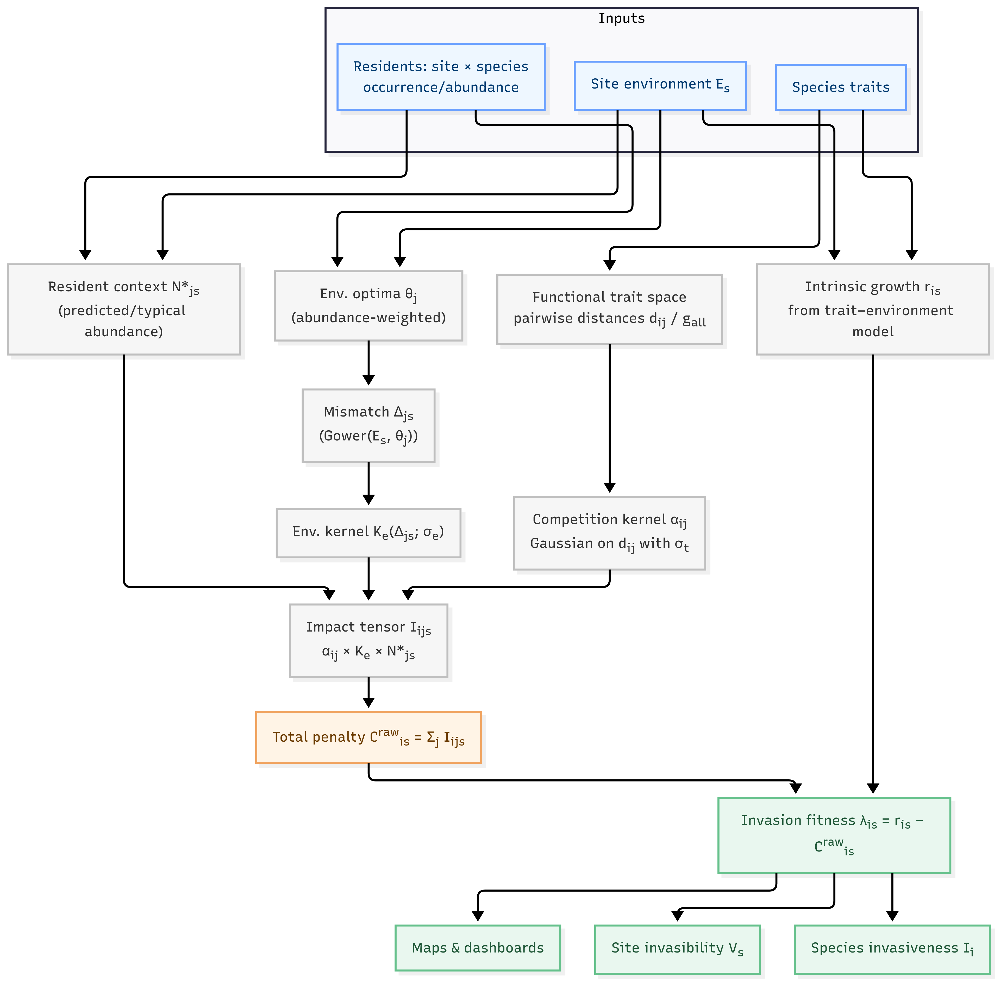

<!-- README.md is generated from README.Rmd. Please edit that file -->

```{r setup, include=FALSE}
knitr::opts_chunk$set(
  collapse = TRUE,
  comment = "#>",
  fig.path = "man/figures/README-",
  out.width = "100%",
  dev = "ragg_png",
  dpi = 200,
  fig.retina = 2, # OR dev = "png"         # avoid PDF devices entirely
  fig.width = 12,
  fig.height = 6,
  fig.align = "center",
  fig.crop = FALSE,
  echo = TRUE,
  message = FALSE,
  warning = FALSE
)

if (requireNamespace("devtools", quietly = TRUE)) {
  devtools::load_all(quiet = TRUE)
}
```

# invasimapr

## A Novel Framework to visualise trait dispersion and assess species invasiveness or site invasibility

<!-- badges: start -->
[](https://github.com/macSands/invasimapr/actions/workflows/R-CMD-check.yaml)
[](https://github.com/macSands/invasimapr/actions/workflows/test-coverage.yaml)
[](https://app.codecov.io/gh/macSands/invasimapr)
[](https://lifecycle.r-lib.org/articles/stages.html#stable)
[](LICENSE.md)
<!-- badges: end -->

---

## 1. Introduction

Biological invasions are a major driver of biodiversity loss. Invasive alien species can spread quickly, alter ecosystem processes, and displace native taxa. Because invasion outcomes depend jointly on functional traits, resident communities, and local environments, ad-hoc analyses are not enough. We need a transparent, reproducible way to quantify establishment potential at specific sites and to compare that potential across species and landscapes.

**invasimapr** fills this gap. It is a trait-based, site-specific R package that estimates **invasion fitness** for candidate invaders, assembles the resident community context that constrains establishment, and turns these quantities into mappable indicators for decision making. The workflow links three pillars: a functional **trait space** that governs competitive overlap, **environmental suitability** that determines how well species perform at a site, and **biotic competition** from residents that reduces the chance of establishment. By fitting a single trait–environment model and reusing it to derive both invader growth and resident context, the package keeps assumptions coherent and results easy to interpret.

This milestone report describes the rationale, model components, and software design of **invasimapr**. We define the ecological quantities we estimate, show how raw data are prepared and validated, and explain how outputs are summarised as **invasibility** (how open a site is to newcomers) and **invasiveness** (how prone a species is to establish across sites). The implementation relies on widely used methods such as GLMM or GAM for trait–environment responses and standard distance measures such as Gower for trait and environmental dissimilarities, which keeps the approach accessible and extensible.

Practically, the package is modular and reproducible. Each step can be run independently or as a full pipeline, inputs and assumptions are explicit, and all intermediate objects can be inspected. The end result is a consistent set of site-level maps and species-level rankings that support surveillance, prioritisation, and scenario testing under changing environments.

---

## 2. Context and model overview

The figure below summarizes the **invasimapr** pipeline from inputs to decision-ready outputs. Starting with species **traits** (T), **site environments** $\mathbf{E}_s$, and **resident communities** (Y), the workflow derives intermediate quantities in two coordinated tracks: a **trait track** that yields pairwise distances and a competition kernel $\alpha_{ij}$, and an **environment track** that yields resident optima $\theta_j$, site-resident mismatch $\Delta_{js}$, an environmental kernel $K_e$, and resident context $N^{*}_{js}$. These parts are assembled into an **impact tensor** $I_{ijs}$, aggregated to a **penalty** $C^{\mathrm{(raw)}}_{is}$, and combined with predicted **intrinsic growth** $r_{is}$ to produce **invasion fitness** $\lambda_{is}$. Site- and species-level summaries (**invasibility** $V_s$ and **invasiveness** $I_i$) support mapping and prioritisation.   
&nbsp;

{width=80%}
<!-- for crisp scaling. ​:contentReference[oaicite:0]{index=0}​ -->

> **Figure 1**: Traits and environment feed two tracks - (1) **competition** via trait distances → $\alpha_{ij}$, and (2) **environmental filtering** via optima and mismatch → $K_e(\Delta_{js};\sigma_e)$ plus **resident context** $N^{*}_{js}$. These combine into an **impact tensor** $I_{ijs}$, which sums to the **penalty** $C^{\mathrm{(raw)}}_{is}$. Subtracting this from the **intrinsic growth** $r_{is}$ gives **invasion fitness** $\lambda_{is}$, which aggregates to **invasibility** $V_s$ and **invasiveness** $I_i$ and can be mapped.

### 2.1. Inputs

* **Species traits**: measurable characteristics (e.g., height, seed mass, leaf area, diet) that shape how species use resources and interact. Traits let us compare species on a common ecological scale.
* **Site environment** $\mathbf{E}_s$: local conditions (climate, soils, habitat structure) that determine whether a species can survive and grow at a place.
* **Residents**: the species already established at a site (the *resident community*). Their presence sets the biotic backdrop into which newcomers arrive.
* **Candidate invaders**: the species being evaluated. They may be real introductions or simulated species drawn from trait distributions to explore “what-if” scenarios.

The **trait-environment response** model ties traits and environments to observed abundances to generate consistent predictions for both invaders and residents.

---

### 2.2. Invasion fitness

Invasion fitness is the net potential for a newcomer to increase when rare. It combines how well the site suits the species (its predicted growth) with how much the resident community pushes back (competitive penalty). Positive values mean establishment is feasible; negative values indicate likely exclusion.

<a id="def-lambda"></a>

$$
\mathbf{\lambda_{is} \;=\; r_{is} \;-\; C^{\mathrm{(raw)}}_{is}}
$$

---

### 2.3. Components of $\lambda_{is}$

#### 2.3.1. Intrinsic growth (predicted growth potential)

This is the growth or abundance a species is expected to achieve at site $s$ **without competitors**, derived from the trait-environment model. It captures environmental suitability and any trait effects independent of competition.

<a id="def-r"></a> $r_{is}$

*Interpretation:* high $r_{is}$ signals a good abiotic match; low $r_{is}$ signals environmental mismatch.

---

#### 2.3.2. Competitive pressure (penalty from residents)

The penalty sums how strongly all residents suppress the invader at a site:

<a id="def-Craw"></a>

$$
C^{\mathrm{(raw)}}_{is} \;=\; \sum_{j \neq i} I_{ijs}
$$

It is built from three ideas: **similarity in trait space**, **environmental match of residents**, and **how common residents are**.

##### i) Functional trait space → competition

Species are positioned in a **functional trait space** where distances reflect ecological similarity. Two summaries help interpret residents:

* **Trait centrality**: how close a species is to the centre of the resident trait cloud; central residents typically overlap more with others.
* **Trait dispersion**: how spread out residents are; greater spread often means less average overlap and weaker competition.

Similarity is translated into a competition coefficient with a Gaussian kernel:

<a id="def-alpha"></a>

$$
\alpha_{ij} \;=\; \exp\!\left(-\frac{d_{ij}^2}{2\sigma_t^2}\right)
$$

Here <a id="def-dij"></a>$d_{ij}$ is trait dissimilarity (0 = identical, 1 = very different) and <a id="def-sigmat"></a>$\sigma_t$ controls how quickly competition fades as species diverge.
The general relation <a id="def-gall"></a>$g^{\mathrm{(all)}}_{ij}$ is computed over the full species set to provide consistent distances.

##### ii) Environmental filtering of residents

Residents suppress invaders most where **they** perform well. We quantify the match between site conditions and each resident’s optimum with a kernel in environmental space:

<a id="def-Ke"></a> <a id="def-delta"></a> <a id="def-sigmae"></a> <a id="def-E"></a> <a id="def-theta"></a>

$$
K_e(\Delta_{js}; \sigma_e) \;=\; \exp\!\left(-\frac{\Delta_{js}^2}{2\sigma_e^2}\right),
\quad \Delta_{js} \;=\; \mathrm{Gower}\!\big(\mathbf{E}_s, \theta_j\big),
$$

where $\theta_j$ is resident $j$’s abundance-weighted environmental optimum. Small $\Delta_{js}$ (good match) yields large $K_e$; large mismatch down-weights that resident’s effect.

##### iii) Resident abundance (context)

Abundant residents exert more pressure. Typical resident abundance at each site comes from the same trait-environment model:

<a id="def-Nstar"></a>

$$
N^{*}_{js} \;=\; f_{\text{env}}\!\left(\mathbf{E}_s, \theta_j, \mathbf{z}_j\right),
$$

where $f_{\text{env}}$ is a fitted response (e.g., GLMM/GAM) and $\mathbf{z}_j$ are any extra predictors.

---

#### 2.3.3. Interaction strength (impact tensor)

The **impact tensor** combines trait overlap, resident suitability, and resident abundance into pairwise effects:

<a id="def-I"></a>

$$
I_{ijs} \;=\; \alpha_{ij} \; K_e(\Delta_{js}; \sigma_e) \; N^{*}_{js}.
$$

Summing $I_{ijs}$ over residents creates the site-level penalty $C^{\mathrm{(raw)}}_{is}$.

*Reading:* large $\alpha_{ij}$ (similar species), large $K_e$ (resident well-matched), and large $N^{*}_{js}$ (resident common) all increase suppression of the invader.

---

### 2.4. Aggregated outputs

#### 2.4.1. Invasibility (site openness)

How open a site is to new species. We aggregate the fitness matrix over invaders to a site-level score that can be mapped or tracked through time.

<a id="def-Vs"></a>

$$
V_s \;=\; \frac{1}{I}\sum_{i} \mathbb{I}\{\lambda_{is} > 0\}
$$

*Interpretation:* higher $V_s$ = more invaders expected to establish at site $s$.

#### 2.4.1. Invasiveness (species propensity)

How readily a species establishes across sites. We aggregate fitness over space to rank potential invaders.

<a id="def-Ii"></a>

$$
I_i \;=\; \sum_{s} \lambda_{is}
$$

*Interpretation:* higher $I_i$ = species $i$ tends to find many suitable, weakly resistant sites.

> **Note.** This section provides a high-level map of the **`invasimapr`** pipeline. Each arrow denotes either a fitted relationship (from traits/environments to predictions) or a deterministic transformation (from distances to kernels to impacts). The modules are interchangeable and auditable: you can inspect intermediate objects, swap modelling choices (e.g., GLMM vs. GAM), and run sensitivity analyses for key scales (\(\sigma_t, \sigma_e\)). Aggregates such as \(V_s\) and \(I_i\) are flexible (sum, mean, or thresholded counts) and should be chosen to match management goals. Because every quantity derives from observed traits, environments, and resident data, the workflow remains transparent, reproducible, and ready for mapping and scenario testing.

---

## 3. Overview of the `invasimapr` R package conceptual workflow

This tutorial walks through the full **`invasimapr`** workflow for quantifying, mapping, and interpreting **invasion fitness** [\(\lambda_{is}\)](#def-lambda). The pipeline integrates information from traits, environments, and resident communities, returning explicit intermediate objects so you can inspect, audit, and reuse results.

1) **Inputs and setup**  
Provide site environments [\(\mathbf{E}_s\)](#def-E), resident occurrence or abundance, species traits, and consistent species and site identifiers. Load packages, set seeds, and ensure that tables align on IDs so later steps can estimate intrinsic growth [\(\;r_{is}\)](#def-r), trait similarity [\(\;d_{ij}\)](#def-dij), and resident context [\(\;N^{*}_{js}\)](#def-Nstar).

2) **Data preparation**  
Use `get_trait_data()` to collect, clean and standardise trait variables, harmonise units, resolve missing values, and align dimensions across sites and species. The output is a tidy trait table and matched site × species matrices ready for analysis.

3) **Trait space to competition**   
Use `compute_trait_space()` to build a functional trait space and compute pairwise trait distances [\(\;d_{ij}\)](#def-dij). Convert distances to competition coefficients [\(\alpha_{ij}\)](#def-alpha) with a Gaussian kernel whose bandwidth [\(\sigma_t\)](#def-sigmat) can be estimated from resident dispersion or set explicitly. The result is an invader × resident matrix of [\(\alpha_{ij}\)](#def-alpha) that reflects how strongly species compete as a function of trait similarity.

4) **Environment and resident context**  
Use `build_glmm_formula()` to first construct the model formula. Simulate hypothetical invaders with traits with `simulate_invaders()`. Estimate each resident’s environmental optimum [\(\theta_j\)](#def-theta), compute site-resident mismatch \(\Delta_{js} = \mathrm{Gower}(\mathbf{E}_s, \theta_j)\) (see [\(\mathbf{E}_s\)](#def-E) and [\(\theta_j\)](#def-theta)), and transform mismatch into an environmental weight [\(K_e(\Delta_{js};\sigma_e)\)](#def-Ke) with bandwidth [\(\sigma_e\)](#def-sigmae) using `compute_environment_kernel()`. Obtain resident context [\(N^{*}_{js}\)](#def-Nstar) as predicted or typical abundance per site, so resident effects are strongest where they are well matched and common.

5) **Trait-environment response for intrinsic growth**  
Fit a trait-environment model to predict intrinsic growth [$r_{is}$](#def-r) or an abundance proxy for candidate invaders at each site with `predict_invader_response()`. This yields the invader × site matrix [\(\;r_{is}\)](#def-r), representing expected performance in the absence of competition.

6) **Assemble impacts and penalties**  
Estimate pairwise biotic influence potentials by computing interaction strengths [$I_{ijs}$](#def-I) with `compute_interaction_strength()`. Then combine competition [\(\alpha_{ij}\)](#def-alpha), environmental weight [\(K_e\)](#def-Ke), and resident context [\(\;N^{*}_{js}\)](#def-Nstar) into the impact tensor [\(I_{ijs}\)](#def-I). Sum impacts over residents to obtain the total competitive penalty [\(C^{\mathrm{(raw)}}_{is}\)](#def-Craw) for each invader at each site.

7) **Compute invasion fitness and variants**  
Calculate invasion fitness as intrinsic growth minus penalty, [\(\lambda_{is} = r_{is} - C^{\mathrm{(raw)}}_{is}\)](#def-lambda) using `compute_invasion_fitness()`. Optionally report scaled fitness that divides the penalty by richness, a relative-abundance version that emphasises composition, and a logistic-capped version that smoothly limits extreme penalties.

8) **Summaries, maps, and interpretation**  
Aggregate the fitness matrix to site-level **invasibility** [\(V_s\)](#def-Vs) and species-level **invasiveness** [\(I_i\)](#def-Ii). Map \(\lambda_{is}\), \(V_s\), and \(I_i\), explore uncertainty and sensitivity, and create concise products for management and reporting.

> **Note.** Different summaries can be used. For example, [\(V_s\)](#def-Vs) can be the mean of [\(\lambda_{is}\)](#def-lambda) over species \(i\); and [\(I_i\)](#def-Ii) can be the mean across sites or a sum over positive values only, depending on management goals.

---
---

# Step-by-step Workflow

### 1. Install and load `invasimapr`

Install and load the `invasimapr` package from GitHub, ensuring all functions are available for use in the workflow.

```{r install, eval=FALSE, include=TRUE}
# # install remotes if needed
# install.packages("remotes")
# remotes::install_github("macSands/invasimapr")

# Ensure the package is loaded when knitting
library(invasimapr)
sessionInfo()$otherPkgs$invasimapr$Version

# Make sure all the functions are loaded
devtools::load_all() # alternative during local development
```

### 2. Load other R libraries

Load core libraries for spatial processing, biodiversity modelling, and visualization required across the `invasimapr` analysis pipeline.

```{r libraries}
# Load essential packages
# --- Data Wrangling and Manipulation ---
library(dplyr)          # Tidy data manipulation (mutate, select, filter, etc.)
library(tidyr)          # Reshape data (wide - long, pivot functions)
library(tibble)         # Modern lightweight data frames (tibble objects)
library(purrr)          # Functional iteration (e.g. map())

# --- String and Factor Utilities ---
library(stringr)        # String pattern manipulation (e.g. str_detect())
library(fastDummies)    # Quickly create dummy/one-hot variables for factors

# --- Data Visualization ---
library(ggplot2)        # Grammar-of-graphics plotting
library(viridis)        # Colorblind-friendly palettes for ggplot2
library(factoextra)     # Visualize clustering e.g. fviz_nbclust, silhouettes
library(pheatmap)       # Pretty Heatmaps

# --- Spatial Data ---
library(sf)             # Spatial vector data (simple features)
library(terra)          # Raster and spatial data operations

# --- Statistical and Ecological Modelling ---
library(glmmTMB)        # Fit GLMMs (Generalized Linear Mixed Models)
library(MASS)           # Kernel density estimation (kde2d, etc.)
library(cluster)        # Clustering algorithms, Gower distance, diagnostics
library(geometry)       # Convex hulls, volumes
library(ClustGeo)       # Spatially constrained clustering

# --- Model Performance and Diagnostics ---
# library(performance)  # Model checking and diagnostics
# options(warn = -1)
```

---

### 3. Data access and preparation using `dissmapr`

To acquire and prepare species occurrence data for biodiversity modelling using the `dissmapr` package, a series of modular functions streamline the workflow from raw observations to spatially aligned environmental predictors.

#### 3.1. Install `dissmapr`

Install and load the `dissmapr` package from GitHub, ensuring all functions are available for use in the workflow.  

```{r dissmapr}
# # install remotes if needed
# install.packages("remotes")
# remotes::install_github("macSands/dissmapr")

# Ensure the package is loaded
library(dissmapr)
sessionInfo()$otherPkgs$dissmapr$Version
```

#### 3.2. Import and harmonise biodiversity-occurrence data

The process begins with [`dissmapr::get_occurrence_data()`](https://macsands.github.io/dissmapr/reference/get_occurrence_data.html), which imports biodiversity records, such as a GBIF butterfly dataset for South Africa, and harmonizes them into standardised formats. Input sources can include local CSV files, URLs, or zipped GBIF downloads. The function filters data by taxon and region, returning both raw records and site-by-species matrices in presence-absence or abundance form.

```{r get-occurrence}
# Use local GBIF data
bfly_data = dissmapr::get_occurrence_data(
  data = system.file("extdata", "gbif_butterflies.csv", package = "invasimapr"),
  source_type = "local_csv",
  sep = "\t"
)

# Check results but only a subset of columns to fit in console
dim(bfly_data)
# str(bfly_data[,c(51,52,22,23,1,14,16,17,30)])
head(bfly_data[, c(51, 52, 22, 23, 1, 14, 16, 17, 30)])
```

#### 3.3. Format biodiversity records to long/wide formats

Next, [`dissmapr::format_df()`](https://macsands.github.io/dissmapr/reference/format_df.html) restructures the raw records into tidy long and wide formats. This assigns unique site IDs, extracts key fields (coordinates, species names, observation values), and prepares two main outputs: `site_obs` (long format for mapping) and `site_spp` (wide format for species-level analysis).

```{r format-df}
# Continue from GBIF data
bfly_result = dissmapr::format_df(
  data        = bfly_data, # A `data.frame` of biodiversity records
  species_col = "verbatimScientificName", # Name of species column (required for `"long"`)
  value_col   = "pa", # Name of value column (e.g. presence/abundance; for `"long"`)
  extra_cols  = NULL, # Character vector of other columns to keep
  format      = "long" # Either`"long"` or `"wide"`
)

# Check `bfly_result` structure
str(bfly_result, max.level = 1)

# Optional: Create new objects from list items
site_obs = bfly_result$site_obs
site_spp = bfly_result$site_spp

# Check results
dim(site_obs)
head(site_obs)

dim(site_spp)
head(site_spp[, 1:6])

#### Get parameters from processed data to use later
# Number of species
(n_sp = dim(site_spp)[2] - 3)

# Species names
sp_cols = names(site_spp)[-c(1:3)]
sp_cols[1:10]
```

#### 3.4. Generate spatial grid and gridded summaries

To integrate the data spatially, [`dissmapr::generate_grid()`](https://macsands.github.io/dissmapr/reference/generate_grid.html) overlays a user-defined spatial lattice (e.g. 0.5° grid), aggregates biodiversity observations per grid cell, and computes standardised metrics such as species richness and observation effort. Outputs include gridded species matrices (`grid_spp`, `grid_spp_pa`), a spatial polygon (`grid_sf`), and raster layers (`grid_r`), enabling downstream spatial modelling.

```{r grid}
# Load the national boundary
rsa = sf::st_read(system.file("extdata", "rsa.shp", package = "invasimapr"))

# Choose a working resolution
res = 0.5 # decimal degrees° (≈ 55 km at the equator)

# Convert the AoI to a 'terra' vector
rsa_vect = terra::vect(rsa)

# Initialise a blank raster template
grid = terra::rast(rsa_vect, resolution = res, crs = terra::crs(rsa_vect))

# Populate the raster with placeholder values
terra::values(grid) = 1

# Clip the raster to the AoI
grid_masked = terra::mask(grid, rsa_vect)

# Generate a 0.5° grid summary for the point dataset `site_spp`
grid_list = dissmapr::generate_grid(
  data          = site_spp, # point data with x/y + species columns
  x_col         = "x", # longitude column
  y_col         = "y", # latitude  column
  grid_size     = 0.5, # cell size in degrees
  sum_cols      = 4:ncol(site_spp), # columns to aggregate * could also use `names(site_spp)[4:ncol(site_spp)]`
  crs_epsg      = 4326 # WGS84
)

# Inspect the returned list
str(grid_list, max.level = 1)

# (Optional) Promote list items to named objects
grid_r = grid_list$grid_r$grid_id # raster
grid_sf = grid_list$grid_sf # polygons for mapping or joins
grid_spp = grid_list$grid_spp # tabular summary per cell
grid_spp_pa = grid_list$grid_spp_pa # presence/absence summary

# Quick checks
dim(grid_sf) # ; head(grid_sf)
dim(grid_spp) # ; head(grid_spp[, 1:8])
dim(grid_spp_pa) # ; head(grid_spp_pa[, 1:8])
```


**Visualise species richess per grid cell**   
Plot square root transformed sampling effort and species richness, in a 1x2 side by side. Each map uses the `viridisLite::turbo` palette and is overlaid with the study area outline for spatial context.

```{r spp-rich}
# Extract & stretch the layers
effRich_r = sqrt(grid_list$grid_r[[c("obs_sum", "spp_rich")]])

# Open a 1×2 layout and plot each layer + outline
old_par = par(
  mfrow = c(1, 2), # multi‐figure by row: 1 row and 2 columns
  mar = c(1, 1, 1, 2)
) # margins sizes: bottom (1 lines)|left (1)|top (1)|right (2)

for (i in 1:2) {
  plot(effRich_r[[i]],
    col = viridisLite::turbo(100),
    colNA = NA,
    axes = FALSE,
    main = c(
      "Sampling effort (√obs count)",
      "Species richness (√unique count)"
    )[i],
    cex.main = 0.8
  ) # ← smaller title)
  plot(terra::vect(rsa), add = TRUE, border = "black", lwd = 0.4)
}
# Reset default plot parameters
par(old_par) # reset plotting parameters
```

#### 3.5. Retrieve, crop, resample, and link environmental rasters to sampling sites

Environmental predictors are appended using [`dissmapr::get_enviro_data()`](https://macsands.github.io/dissmapr/reference/get_enviro_data.html), which buffers the grid, downloads raster data (e.g. WorldClim bioclimatic variables), resamples it, and links values to grid-cell centroids. This produces both a site-by-environment data frame (`env_df`) and a SpatRaster object (`env_r`), aligning biological and environmental data.

Begin by reading in a predefined target species list, then filter a site-by-species dataset (`grid_spp`) to retain only relevant species observations, and reshape the data for further analysis. This produces both a filtered long-format dataset (`grid_obs`) and a cleaned wide-format site-by-species matrix (`grid_spp`).

```{r spp-filter}
# Read in target species list
species = read.csv(system.file("extdata",
  "rsa_butterfly_species_names_n27_100plus.csv",
  package = "invasimapr"
), stringsAsFactors = FALSE)$species

# Filter `grid_spp` and convert to long-format
grid_obs = grid_spp %>%
  dplyr::select(-mapsheet) %>% # Drop mapsheet metadata
  pivot_longer(
    cols = -c(grid_id, centroid_lon, centroid_lat, obs_sum, spp_rich), # Keep core metadata columns only
    names_to = "species",
    values_to = "count",
    values_drop_na = TRUE
  ) %>%
  filter(
    # obs_sum > 100,                                   # Only high-observation sites
    count > 0, # Remove absent species
    species %in% !!species # Keep only target species
  ) %>%
  rename(
    site_id = grid_id, # Change 'grid_id' to 'site_id'
    x = centroid_lon, # Change 'centroid_lon' to 'x'
    y = centroid_lat # Change 'centroid_lat' to 'y'
  ) %>%
  relocate(site_id, x, y, obs_sum, spp_rich, species, count)

dim(grid_obs)
head(grid_obs)
length(unique(grid_obs$species))
length(unique(grid_obs$site_id))

# Reshape site-by-species matrix to wide format and clean
grid_spp = grid_obs %>%
  pivot_wider(
    names_from = species,
    values_from = count,
    values_fill = 0 # Replace missing counts with 0
  )

dim(grid_spp)
# head(grid_spp)
```

Then proceed to retrieve and process environmental data using [`dissmapr::get_enviro_data()`](https://macsands.github.io/dissmapr/reference/get_enviro_data.html). In the example below, 19 bioclimatic variables are downloaded from WorldClim v2.1 (≈10 km resolution) for all site centroids in the `grid_spp` dataset. It performs the following steps:

  1. Retrieves WorldClim “bio” variables via the `geodata` interface.
  2. Buffers the area of interest (AOI) by 10 km.
  3. Retains site-level metadata (`obs_sum`, `spp_rich`) and excludes species columns.

```{r get-enviro}
# Retrieve 19 bioclim layers (≈10-km, WorldClim v2.1) for all grid centroids
data_path = "inst/extdata" # cache folder for rasters
enviro_list = dissmapr::get_enviro_data(
  data       = grid_spp, # centroids + obs_sum + spp_rich
  buffer_km  = 10, # pad the AOI slightly
  source     = "geodata", # WorldClim/SoilGrids interface
  var        = "bio", # bioclim variable set
  res        = 5, # 5-arc-min ≈ 10 km
  grid_r     = grid_r, # To set resampling resolution, if necessary
  path       = data_path,
  sp_cols    = 7:ncol(grid_spp), # ignore species columns
  ext_cols   = c("obs_sum", "spp_rich") # carry effort & richness through
)

# Quick checks
str(enviro_list, max.level = 1)

# (Optional) Assign concise layer names for readability
# Find names here https://www.worldclim.org/data/bioclim.html
names_env = c(
  "temp_mean", "mdr", "iso", "temp_sea", "temp_max", "temp_min",
  "temp_range", "temp_wetQ", "temp_dryQ", "temp_warmQ",
  "temp_coldQ", "rain_mean", "rain_wet", "rain_dry",
  "rain_sea", "rain_wetQ", "rain_dryQ", "rain_warmQ", "rain_coldQ"
)
names(enviro_list$env_rast) = names_env

# (Optional) Promote frequently-used objects
env_r = enviro_list$env_rast # cropped climate stack
env_df = enviro_list$env_df # site × environment data-frame

# Quick checks
env_r
dim(env_df)
head(env_df)

# Build the final site × environment table
grid_env = env_df %>%
  dplyr::select(
    site_id, x, y,
    obs_sum, spp_rich, dplyr::everything()
  ) %>%
  mutate(across(
    .cols = -c(site_id, x, y, obs_sum, spp_rich), # all other columns
    .fns = ~ as.numeric(scale(.x)), # Scale bio
    .names = "{.col}" # keep same names
  ))

str(grid_env, max.level = 1)
head(grid_env)
```

#### 3.6. Remove highly correlated predictors (optional)

Finally, [`dissmapr::rm_correlated()`](https://macsands.github.io/dissmapr/reference/rm_correlated.html) optionally reduces multicollinearity by filtering out highly correlated predictors based on a threshold (e.g. r > 0.70), improving model stability and interpretability. Together, these functions provide a reproducible and scalable pipeline for preparing ecological datasets for spatial analysis.

```{r remove-corr, message = FALSE}
# # (Optional) Rename BIO
# names(env_df) = c("grid_id", "centroid_lon", "centroid_lat", names_env, "obs_sum", "spp_rich")
#
# # Run the filter and compare dimensions
# # Filter environmental predictors for |r| > 0.70
# env_vars_reduced = dissmapr::rm_correlated(
#   data       = env_df[, 4:23],  # drop ID + coord columns
#   cols       = NULL,                  # infer all numeric cols
#   threshold  = 0.70,
#   plot       = TRUE                   # show heat-map of retained vars
# )
#
# # Before vs after
# c(original = ncol(env_df[, c(4, 6:24)]),
#   reduced  = ncol(env_vars_reduced))
```

---

### 4. Data access and preparation using `invasimapr`

#### 4.1. Retrieve and link trait and metadata for each species

This utility provides an automated pipeline for extracting and joining both biological trait data and rich metadata for any focal species. The function integrates several steps:

1. **Trait Table Lookup**: Retrieves species’ trait data from a local trait table (CSV) or a [TRY](https://www.try-db.org/TryWeb/Home.php)-style database, using fuzzy matching to ensure robust linkage even when there are minor naming inconsistencies.
2. **Wikipedia Metadata Scraping**: Optionally augments each species entry with a taxonomic summary, higher taxonomy, and representative images scraped directly from [Wikipedia](https://www.wikipedia.org/).
3. **Image-based Color Palette Extraction**: If enabled, downloads and processes public domain images to extract the most frequent colors, optionally removing green/white backgrounds to focus on diagnostic features.
4. **Flexible Output**: Returns a single-row tibble with the species name, trait data, taxonomic metadata, image URL, and color palette - all harmonized for downstream analyses or visualization.

This function greatly simplifies the assembly of a unified species-trait-metadata table, which is essential for trait-based community ecology, macroecology, and biodiversity informatics projects.

```{r get-traits}
# Fetch local trait data.frame
btfly_traits = read.csv(system.file("extdata", "species_traits.csv", package = "invasimapr"))
str(btfly_traits)

# Retrieve and join trait/metadata for all species in the observation set
spp_traits = purrr::map_dfr(
  unique(grid_obs$species),
  ~ get_trait_data(
    species = .x,
    n_palette = 5,
    preview = FALSE,
    do_summary = TRUE,
    do_taxonomy = TRUE,
    do_image = TRUE,
    do_palette = TRUE,
    local_trait_df = btfly_traits,
    local_species_col = "species",
    max_dist = 1
  )
)
# The final output combines trait data, taxonomic info, Wikipedia summary, images, and color palette for each species.
# This integrated dataset supports multi-faceted biodiversity, trait, and visualization analyses.

# Check output
str(spp_traits)
head(spp_traits)
```

#### 4.2. Alternatively, load local combined site, environment, and trait data

```{r data-import}
# Read GBIF species occurrence with simulated traits and enviro data
# One row per site-species combination
site_env_spp = read.csv(system.file("extdata", "site_env_spp_simulated.csv", package = "invasimapr"))
# site_env_spp = read.csv(system.file("extdata", "site_env_spp_trt_sim.csv", package = "invasimapr"))

# Check the results
names(site_env_spp)
dim(site_env_spp)
```

---

### 5. Model Inputs

Shape your data so every row is “one species at one site,” with that species’ traits and that site’s environment.  

#### 5.1. Format **site-locations**

This section isolates the unique spatial coordinates for each sampling site. The resulting table (`site_xy`) will be used for spatial mapping, distance calculations, and for merging environmental and biodiversity metrics with precise locations.

```{r data-sites}
# Create site coordinate table i.e. # Unique site coordinates
site_xy = site_env_spp %>%
  dplyr::select(site_id, x, y) %>%
  distinct() %>%
  mutate(.site_id_rn = site_id) %>%
  column_to_rownames(var = ".site_id_rn")
head(site_xy)
```

#### 5.2. Format **site-environment** variables

Here, we extract a site-by-environment matrix containing the values of all measured environmental covariates at each sampling site. This matrix (`site_env`) enables analyses of environmental gradients, spatial drivers of community composition, and covariate modeling.

```{r data-env}
# Site-by-environment matrix
site_env = site_env_spp %>%
  dplyr::select(
    site_id, x, y,
    env1:env10
  ) %>%
  mutate(site_id = as.character(site_id)) %>% # ensure character
  distinct() %>%
  mutate(.site_id_rn = site_id) %>%
  column_to_rownames(var = ".site_id_rn")
dim(site_env)
head(site_env[1:6, 1:6])
```

#### 5.3. Format **site-species** abundances and presence-absence

This section generates two site-by-species matrices: one containing abundances (`site_spp_ab`), and one indicating presence-absence (`site_spp_pa`). These matrices are fundamental for calculating community diversity, richness, and for modeling occupancy and abundance patterns.

```{r data-spp}
# Site-by-species abundance matrix (wide format)
site_spp_ab = site_env_spp %>% #
  dplyr::select(site_id, x, y, species, count) %>%
  pivot_wider(
    names_from  = species,
    values_from = count,
    values_fill = list(count = 0)
  ) %>%
  mutate(.site_id_rn = site_id) %>%
  column_to_rownames(var = ".site_id_rn")
dim(site_spp_ab)
head(site_spp_ab[1:6, 1:6])

# Site-by-species presence/absence matrix (wide format)
site_spp_pa = site_env_spp %>%
  mutate(pa = as.integer(count > 0)) %>%
  dplyr::select(site_id, x, y, species, pa) %>%
  pivot_wider(
    names_from  = species,
    values_from = pa,
    values_fill = list(pa = 0)
  ) %>%
  mutate(.site_id_rn = site_id) %>%
  column_to_rownames(var = ".site_id_rn")
dim(site_spp_pa)
head(site_spp_pa[1:6, 1:6])
```

#### 5.4. Format **species-trait** values

Here we build the species-by-trait matrix (`spp_trait`), including all measured continuous, categorical, and ordinal traits for each species. This structure is central for trait-based analyses of community assembly, functional diversity, and invasion processes.

```{r data-trait}
# Species-by-trait matrix (wide)
# Extract and process continuous, categorical, and ordinal trait data
spp_trait = spp_traits %>% # site_env_spp
  dplyr::select(
    species, trait_cont1:trait_cont10,
    trait_cat11:trait_cat15,
    trait_ord16:trait_ord20
  ) %>%
  distinct() %>%
  mutate(.species_rn = species) %>%
  column_to_rownames(var = ".species_rn") %>%
  mutate(across(where(is.character), as.factor))

# Check results
dim(spp_trait)
head(spp_trait[1:6, 1:6])
```

---

### 6. Data summaries and visualisation

#### 6.1. Summarise site-level diversity

This section quantifies and visualizes site-level biodiversity, focusing on local species richness and abundance. Calculating these metrics is essential for mapping alpha diversity, assessing community structure, and identifying spatial patterns of biodiversity hotspots and low-diversity areas across the study landscape.

* **Species richness** (spp_rich<sub>s</sub>): the number of species present (non-zero counts) at site \(s\).
* **Total abundance** (obs_sum<sub>s</sub>): the sum of all individual counts across species at site \(s\) (a proxy for sampling effort).
* **Mean abundance per species** (obs_mean<sub>s</sub>): total abundance at site \(s\) divided by the number of species columns (N); effectively the average count per species regardless of whether it is present.

```{r site-richness}
# Calculate site-level diversity metrics from the species-by-abundance matrix:
spp_rich_obs = site_spp_ab %>%
  mutate(
    spp_rich = rowSums(dplyr::select(., -site_id, -x, -y) > 0), # Species richness: number of species present
    obs_sum = rowSums(dplyr::select(., -site_id, -x, -y)), # Total abundance: sum of all individuals
    obs_mean = rowMeans(dplyr::select(., -site_id, -x, -y)) # Mean abundance per species
  ) %>%
  # Keep summary metrics and site coordinates
  dplyr::select(site_id, x, y, spp_rich, obs_sum, obs_mean) %>%
  mutate(site_id = as.character(site_id)) # Ensure site_id` is a
head(spp_rich_obs)

# Visualize spatial distribution of site-level species richness
# First define a custom color palette for richness mapping (blue = low, dark red = high)
col_pal = colorRampPalette(c("blue", "green", "yellow", "orange", "red", "darkred"))

# Plot
ggplot(spp_rich_obs, aes(x = x, y = y, fill = sqrt(spp_rich))) +
  geom_tile() +
  # Use custom color gradient, reversed so high richness is warm/dark, low is cool/blue
  scale_fill_gradientn(colors = rev(col_pal(10)), name = "√(Richness)") +
  geom_text(aes(label = spp_rich), color = "grey80", size = 2) + # Overlay actual richness values
  geom_sf(data = rsa, inherit.aes = FALSE, fill = NA, color = "black", size = 0.4) + # Plot boundary
  labs(
    x = "Longitude",
    y = "Latitude",
    title = "Spatial Distribution of Species Richness"
  ) +
  theme(panel.grid = element_blank())
```

---

## 7. Functional Trait Space

### 7.1. Basic trait similarity

To diagnose which functional dimensions are more conserved versus variable across the metacommunity, we compute **trait-level similarity** for each trait across all species. This allows identification of traits that might constrain or facilitate invasion and coexistence (e.g., highly conserved traits might reflect strong filtering, while highly variable traits may be axes of ecological opportunity).

We use the `compute_trait_similarity()` function, which calculates similarity as follows:

* **Numeric traits**: Scaled to [0,1], pairwise Euclidean distances are computed, and similarity is 1 - mean(distance). If all values are identical or only one value is present, similarity is 100%.
* **Categorical traits**: Similarity is the proportion of all possible species pairs that share the same category (level).

The output is a table of percent similarity for each trait, allowing direct comparison of conservation vs. lability across traits.

```{r trait-sim-barplot, fig.cap="Trait-level functional similarity across species."}
# Compute Trait Similarity for Numeric and Categorical Variables
df_traits = compute_trait_similarity(spp_trait[, -1])
head(df_traits)

# Barplot: trait-level similarity (percent identity or scaled distance)
ggplot(df_traits, aes(x = reorder(Trait, Similarity), y = Similarity, fill = Similarity)) +
  geom_col(show.legend = FALSE) +
  scale_fill_viridis_c(option = "inferno") + # ramp color scale
  # ylim(0,100) +
  labs(
    title = "Average Trait Similarity (%)",
    y = "Similarity (%)",
    x = NULL
  ) +
  theme(axis.text.x = element_text(angle = 45, hjust = 1))
```

### 7.2. Gower distance, clustering, and trait space mapping (PCoA)

#### 7.2.1. Compute Gower distance (handles mixed trait types)

Trait-based approaches require robust dissimilarity measures for mixed data types (continuous, categorical, ordinal). Here, we compute **pairwise Gower distances** among species, which accommodates all variable types, and use hierarchical clustering to visualize functional similarity structure within the community.

```{r gower-dendro}
# Compute Gower dissimilarity matrix (excluding species column)
sbt_gower = cluster::daisy(spp_trait[, -1], metric = "gower")
trait_dist = as.matrix(sbt_gower)
```


#### 7.2.2. Hierarchical clustering (visualise trait-based groupings)

```{r  hclust-traits, fig.cap="Species clustering by functional traits (Gower distance)"}
# Hierarchical clustering and dendrogram visualization of functional similarity
gower_hc = hclust(as.dist(sbt_gower))
# Dendrogram
fviz_dend(
  gower_hc,
  k = 4,
  cex = 0.5,
  k_colors = viridis(4, option = "D"), # k_colors = c("red","blue","green","purple"),
  color_labels_by_k = TRUE,
  rect = TRUE,
  rect_border = "grey40",
  main = "Gower Cluster Dendrogram") + 
  guides(scale = "none")
```

#### 7.2.3. PCoA ordination (map species into a reduced-dimensional trait space)

Principal Coordinates Analysis (PCoA) enables **ordination** of species in a reduced, low-dimensional trait space, preserving pairwise dissimilarities. This is used to visualize the overall structure of the functional trait space and examine density and clustering patterns.

```{r pcoa-traitspace, fig.cap="Kernel density in trait space (PCoA axes 1-2)."}
# PCoA ordination
pcoa = cmdscale(sbt_gower, eig = TRUE)
scores_species = as.data.frame(pcoa$points)[, 1:2]
colnames(scores_species) = c("PCoA1", "PCoA2")

# Visualize trait space density using kernel density estimation
xlims = range(scores_species$PCoA1) + c(-1, 1) * 0.1 * diff(range(scores_species$PCoA1))
ylims = range(scores_species$PCoA2) + c(-1, 1) * 0.1 * diff(range(scores_species$PCoA2))
grid_density = MASS::kde2d(scores_species$PCoA1,
  scores_species$PCoA2,
  n = 100,
  lims = c(xlims, ylims)
)
filled.contour(
  grid_density,
  color.palette = viridis,
  xlim = xlims, ylim = ylims,
  plot.title = title(
    main = "Trait Space Density Contours",
    xlab = "PCoA1",
    ylab = "PCoA2"
  ),
  plot.axes = {
    axis(1)
    axis(2)
    points(scores_species, pch = 19, cex = 0.5)
    # Draw all contours (thin)
    contour(
      x = grid_density$x, y = grid_density$y, z = grid_density$z,
      add = TRUE, drawlabels = FALSE, lwd = 0.7, col = "grey60"
    )
    # Highlight the major contour (e.g. highest density level)
    contour(
      x = grid_density$x, y = grid_density$y, z = grid_density$z,
      add = TRUE, drawlabels = FALSE,
      levels = max(grid_density$z) * 0.5, # 50% of max density
      lwd = 2, col = "black"
    )
  },
  key.title = title(main = "Density")
)
```

### 7.3. Trait centrality

Trait **centrality** quantifies how close each species is to the “core” of the community’s trait space. Peripheral species may be ecologically distinct and potentially more likely to become invaders or to escape biotic resistance.

```{r trait-centrality, fig.cap="Distribution of trait centrality (distance to centroid) among species."}
# Calculate the community trait centroid in reduced trait-space (PCoA axes)
# First define abundance weights (uniform if none provided)
# Provide a numeric vector `abundance` aligned with rows(scores_species) if available
n = nrow(scores_species)
if (!exists("abundance") || is.null(abundance)) {
  p = rep(1 / n, n)
} else {
  stopifnot(is.numeric(abundance), length(abundance) == n, all(abundance >= 0))
  s = sum(abundance)
  if (s == 0) stop("sum(abundance) == 0")
  p = as.numeric(abundance) / s
}

# Weighted centroid and centrality (distance to centroid)
centroid = colSums(scores_species * p) / sum(p)
scores_species$centrality = sqrt(rowSums((as.matrix(scores_species) -
  matrix(centroid, n, 2, byrow = TRUE))^2))

# Store centrality alongside original trait table (for later use/plots) ---
spp_trt_cent = spp_trait
spp_trt_cent$centrality = scores_species$centrality

# Histogram of distribution of trait centrality (core vs peripheral species)
ggplot(spp_trt_cent, aes(x = centrality)) +
  geom_histogram(bins = 20, fill = "steelblue", color = "white") +
  theme_bw() +
  labs(
    x = "Distance to community-centroid", y = "Number of species",
    title = "Trait Centrality (Community Edge vs Core)"
  )
```

> This histogram shows how far each species is from the **center** of the community’s trait space.
>
> * The **x-axis** is *distance to the centroid* (central trait combination of the community).
> * The **y-axis** is the number of species at each distance.
>
> **Interpretation:**
>
> * Most species are clustered at **intermediate distances** (\~0.18 - 0.22), meaning their traits are moderately similar to the community average.
> * A few species are **very close** to the centroid (low distances) - these are “core” species with typical trait values.
> * Others lie **further out** (higher distances) - these are “peripheral” species with more unusual trait combinations, which might indicate unique ecological roles or specialisations.
>
> **Summary**: the community is centred around a typical trait set, but also includes a handful of species that are either very similar or quite distinct from that average.
> &nbsp;

### 7.4. Trait dispersion

We calculate key functional diversity metrics at the community scale:

* **FDis**: functional **dispersion** (average distance to centroid)
* **FRic**: functional richness (trait-space convex hull volume)
* **RaoQ**: Rao’s quadratic entropy (total abundance-weighted trait dissimilarity)

These summarize the functional structure and ecological breadth of the community.

```{r dispersion-metrics, fig.cap="Community-level functional diversity metrics."}
# FDis: functional dispersion (weighted mean distance to centroid) 
FDis = sum(p * scores_species$centrality)

# FRic: functional richness (convex hull area/volume on retained axes) ---
FRic = NA_real_
if (n >= 3L) {  # need pcoa_dims + 1 points with pcoa_dims = 2
  hull = geometry::convhulln(as.matrix(scores_species[, c("PCoA1", "PCoA2")]), options = "FA")
  FRic = hull$vol
}

# RaoQ: abundance-weighted trait dissimilarity (Rao's quadratic entropy)
dmat = as.matrix(dist(scores_species[, c("PCoA1", "PCoA2")]))
RaoQ = 0.5 * sum(outer(p, p) * dmat)

# Assemble and plot
dispersion_df = data.frame(
  Metric = c("FDis", "FRic", "RaoQ"),
  Value  = c(FDis, FRic, RaoQ)
)

# Bar plot: community-level trait dispersion metrics
ggplot(dispersion_df, aes(x = Metric, y = Value)) +
  geom_col(width = 0.6, fill = "firebrick") +
  theme_classic() +
  labs(title = "Community-Level Trait Dispersion", y = "Metric value")
```

> This bar chart summarises three ways of describing the community’s overall functional diversity:
>
> * **FDis (Functional Dispersion)** – Moderate value (\~0.20).
>   Indicates that species are fairly spread out from the community’s trait centroid, reflecting a moderate amount of variation in trait combinations.
>
> * **FRic (Functional Richness)** – Highest value (\~0.21).
>   Suggests that the community occupies a relatively broad portion of the available trait space, i.e. species collectively use a wide range of possible trait combinations.
>
> * **RaoQ (Rao’s Quadratic Entropy)** – Lowest value (\~0.13).
>   Measures total abundance-weighted trait dissimilarity. The lower value implies that, despite trait differences among species, much of the community’s abundance is concentrated in species that are relatively similar.
>
> **Summary**: The community shows a **broad trait space coverage** (FRic), **moderate trait dispersion** (FDis), but **lower abundance-weighted diversity** (RaoQ). This pattern suggests that while trait space is well filled, dominant species are clustered functionally.
> &nbsp;

### 7.5. Combined functional trait space workflow

Trait-based community analyses often require multiple sequential steps: computing per-trait similarity, calculating trait dissimilarities across species, ordination, mapping trait space, quantifying species centrality, and summarising community-level diversity metrics.  

The `compute_trait_space()` function unifies these steps into a single call, producing **both** per-trait similarity summaries and community-level dispersion outputs as follows:

* **Per-Trait Similarity Table**: `out$similarity` holds percentage similarity (0-100) for each trait column, computed as either i) *Numeric traits* as the scaled mean pairwise similarity; or ii) *Categorical traits* as the proportion of identical pairs.

* **Trait Dissimilarity & Clustering**: `out$dispersion$plots$dend` contains hierarchical clustering results based on pairwise Gower distances across all traits, highlighting functional similarity groupings.  

* **Trait Space Ordination (PCoA)**: `out$dispersion$plots$density_gg` shows species positioned in reduced-dimensional trait space using PCoA, with kernel density contours to reveal clusters and gaps.  

* **Species Centrality**: `out$dispersion$plots$centrality_hist` displays each species’ Euclidean distance from the trait-space centroid. Shorter distances indicate core species; longer distances indicate peripheral, functionally distinct species.  

* **Functional Diversity Metrics Table**: `out$dispersion$metrics_df` provides tabulated values for all computed community-level functional diversity indices.  

* **Functional Diversity Summary Plots**: `out$dispersion$plots$metrics_bar` presents bar plots for three key community-level metrics:  
  * **FDis** - functional dispersion (mean distance to centroid);  
  * **FRic** - functional richness (convex hull volume/area);  
  * **RaoQ** - abundance-weighted trait dissimilarity (Rao’s quadratic entropy).  

```{r func-space, fig.width=7, fig.height=10}
# Same inputs and space as your manual pipeline
res = compute_trait_space(
  trait_df = spp_trait,
  species_col = 1,
  do_similarity = FALSE, # you don't need per-trait similarity here
  k = 4, # only affects dendrogram; metrics don’t use k
  pcoa_dims = 2, # keep 2 axes
  abundance = rep(1, nrow(spp_trait)), # equal weights/unweighted centroid
  show_density_plot = FALSE,
  show_plots = TRUE
)

# Check results/outputs
str(res, max.level = 1)
head(res$similarity)
str(res$dispersion, max.level = 1)
```

> **Note**: By pairing `compute_trait_similarity()` (per-trait conservation/lability) with `compute_trait_dispersion()` (whole-community functional structure), you get a complete, repeatable workflow for trait-based invasion and coexistence studies. All plots are stored in `res$plots` for flexible reuse, while `res$metrics_df` provides ready-to-use numerical summaries for statistical modelling.
> &nbsp;

You can also rearrange or customise the plots in `res$plots` using patchwork or other layout tools. For example, the code below recreates the combined layout used when `show_plot = TRUE`, but omits the base `filled.contour()` plot for simplicity.

```{r func-plot, fig.width=7, fig.height=10}
str(res$dispersion, max.level = 1)

# # Custom combined layout without base filled.contour
# combined = res$dispersion$plots$dend /
#   (res$dispersion$plots$centrality_hist | res$dispersion$plots$metrics_bar) /
#   res$dispersion$plots$density_gg +
#   patchwork::plot_layout(heights = c(1, 2, 1))
#
# print(combined)  # display in console
```

> **Note**: In this way you can change the order or arrangement of panels, replace individual plots with customised versions (e.g., change themes or colours), and/or combine them with other figures in your workflow
> &nbsp;

---

## 8. Trait-Environment Response

To evaluate how **species functional traits, environmental conditions**, and their **interactions** influence species abundances, we use a **Generalized Linear Mixed Model (GLMM)** to:

* Quantify the separate and combined effects of traits and environment.
* Control for repeated observations of the same species and sites via **random intercepts**, accounting for non-independence and spatial structure.
* Allow the flexibility to predict how hypothetical (invader) species might perform in new environments.

We use the **Tweedie** error distribution, which is well-suited to ecological count data because it handles **overdispersion** and **many zeros**.

### 8.1. Prepare the long-format dataset

We first create a long-format table, where each row is a single species-at-site observation, with all associated predictors attached:

* **Site metadata**: `site_id`, spatial coordinates (`x`, `y`)
* **Species ID and count/abundance**
* **Environmental predictors**: e.g., `env1`-`env10`
* **Species traits**: continuous (`trait_cont1`-`trait_cont10`), categorical (`trait_cat11`-`trait_cat15`), and ordinal (`trait_ord16`-`trait_ord20`)

We then convert all character variables to factors so they’re correctly handled by the model.

```{r fit-data}
# Prepare long-format data
# Use simulated traits
longDF = site_env_spp %>%
  dplyr::select(
    site_id, x, y, species, count, # Metadata + response
    env1:env10, # Environment variables
    trait_cont1:trait_cont10, # Continuous traits
    trait_cat11:trait_cat15, # Categorical traits
    trait_ord16:trait_ord20 # Ordinal traits
  ) %>%
  mutate(across(where(is.character), as.factor))
head(longDF)
```

### 8.2. Build the model formula

We use `build_glmm_formula()` to **automatically detect** trait and environmental predictor columns based on naming conventions (prefixes like "*trait_*" or "*env_*") or by excluding known metadata columns (`site_id`, `x`, `y`, `species`, `count`).

The function then:

* **Generates main effect terms** for all detected traits and all detected environment variables.
* **Optionally expands** these into **all pairwise trait × environment interactions** (e.g., `trait_cont1:env3`), capturing environment-dependent trait effects.
* **Appends random intercepts** for the grouping variables specified in `random_effects` (default: `(1 | species)` and `(1 | site_id)`).
* **Returns a valid R formula object** ready for model fitting.

This automatic approach ensures that the model always reflects the full trait-environment structure without hard-coding variable names.

```{r fit-formula}
# Automatically build the GLMM formula
fml = build_glmm_formula(
  data                 = longDF,
  response             = "count", # Response variable
  species_col          = "species", # Random effect grouping
  site_col             = "site_id", # Random effect grouping
  # env_cols             = names(longDF[,6:24]),
  include_interactions = TRUE, # Add all trait × environment terms
  random_effects       = c("(1 | species)", "(1 | site_id)")
)

# Check model formula structure
fml
```

### 8.3. Fit the GLMM

We fit the model using `glmmTMB::glmmTMB()`, which supports a wide range of distributions and correlation structures. In the example below: 

* **Family**: `tweedie(link = "log")`
  * Handles overdispersed count data and zero-inflation without requiring a separate zero-inflated component.
  * The **log link** models multiplicative effects of predictors on expected abundance.

* **Data**: The prepared long-format table (`longDF`).
* **Formula**: The formula, automatically generated `fml` from `build_glmm_formula()` or user customised.

The model is fit via maximum likelihood, estimating both fixed-effect coefficients (for traits, environments, and their interactions) and variance components for the random effects.

```{r fit-glmmTMB}
# Fit Tweedie GLMM
set.seed(123)
mod = glmmTMB::glmmTMB(
  formula = fml,
  data    = longDF,
  family  = glmmTMB::tweedie(link = "log")
)
# Print model summary
summary(mod)
```

> **Note**: This model forms the core of the invasion fitness workflow, allowing us to predict how novel trait-environment combinations are likely to perform (abundance-wise) in different sites, and enables robust estimation of both direct and interactive drivers of community assembly.
> &nbsp;

---

## 9. Simulate & Predict Invaders

This section demonstrates how to **simulate trait profiles for hypothetical invaders** and then use the fitted abundance model to **predict their expected performance across all sites**. This forms a crucial part of modern invasion biology workflows: moving from theory-driven invader trait generation to data-driven, site-level predictions of establishment and performance.

### 9.1. Simulate hypothetical invaders

To evaluate how potential invaders might perform, we generate novel species by resampling trait values from the empirical distribution of the resident pool using the `simulate_invaders()` function. This approach allows you to:

* **Preserve realism** by keeping trait ranges and levels identical to those observed in the resident community.
* **Explore unobserved combinations** (when using column-wise sampling) or maintain natural trait correlations (when using row-wise sampling).
* Control how numeric traits are drawn - bootstrap from observed values, draw from a truncated normal distribution, or sample from a uniform distribution within observed bounds.

By default, traits are sampled **independently by column** (`mode = "columnwise"`), which generates novel combinations. Alternatively, setting `mode = "rowwise"` samples entire resident profiles, preserving observed cross-trait covariance.

```{r invader-sim}
# Simulate 10 invaders from the resident trait table
set.seed(42)
inv_traits = simulate_invaders(
  resident_traits = spp_trait, # your resident species traits table
  n_inv           = 10, # number of invaders to create
  species_col     = "species", # ID column for species
  mode            = "columnwise", # or "rowwise"
  numeric_method  = "bootstrap", # or "normal", "uniform"
  seed            = 42
)
# Check results
head(inv_traits)
```

> **Note**: Use `mode = "rowwise"` when you want to preserve realistic trait correlations OR Use `mode = "columnwise"` when exploring hypothetical trait combinations beyond those observed.
> &nbsp;

### 9.2. Predict abundances across all sites

With simulated invaders in hand, we use the `predict_invader_response()` function to generate expected abundances (our performance proxy) for every **species-site** combination as follows:  
* Takes a fitted model (e.g., from **glmmTMB**, **lme4**, **glm**, or **gam**)  
* Crosses the **species traits table** (residents + simulated invaders) with the **site environment table**  
* Harmonizes factor levels with the model’s training data  
* Calls the model’s native `predict()` method to return:
  * The full prediction grid (`newdata`)
  * A long table of predictions (`predictions`)
  * A wide **site × species** prediction matrix (`prediction_matrix`)  

> **Note**: Why use population-level (fixed-effects) predictions?
>
> * For novel invaders, the random-effect levels (e.g., species- or site-specific intercepts) are unknown.
> * Accordingly, `predict_invader_response()` defaults to setting random effects to zero, producing *population-level* predictions driven solely by traits, environmental covariates, and their interactions. This is the appropriate scale for invasion screening and comparative risk assessment.
> * Set `include_random = TRUE` only if you require conditional predictions that incorporate known random-effect levels from the fitted model (and, where supported, allow estimation for new levels).  
> &nbsp;

```{r predict-inv}
# Combine residents and invaders into a single trait table
all_traits = bind_rows(
  spp_trait, # Resident species traits (must include 'species' column)
  inv_traits # Output from simulate_invaders()
)
head(all_traits[1:4,1:4])
tail(all_traits[1:4,1:4])

# Predict across all sites × all species using predict_invader_response()
pred = predict_invader_response(
  model          = mod,
  species_traits = all_traits, # residents + invaders (traits)
  site_env       = site_env, # base site predictors
  species_col    = "species",
  site_col       = "site_id",
  response_type  = "response",
  include_random = FALSE,
  site_aug       = dplyr::select(spp_rich_obs, site_id, obs_sum, spp_rich)
)

# Inspect outputs
str(pred, max.level = 1)
names(pred$newdata) # long table: site_id, species, pred
head(pred$predictions) # long table: site_id, species, pred
dim(pred$prediction_matrix) # sites × species matrix (for fitness/impact/risk calcs)
```

---

## 10. Biotic & Abiotic Constraints

Understanding how **trait similarity** (biotic constraint) and **environmental matching** (abiotic constraint) shape invasion outcomes requires explicit, quantitative representations of both processes. This section details three linked steps:

1. Constructing the general **trait-based interaction strength** matrix [$g^{\mathrm{(all)}}_{ij}$](#def-gall)
2. Deriving **competition coefficients** [$\alpha_{ij}$](#def-alpha) from the underlying trait dissimilarities [$d_{ij}$](#def-dij)
3. Quantifying **environmental matching** via species’ optima [$K_e(\Delta_{js};\sigma_e)$](#def-Ke)

### 10.1 Interaction Strength

The general trait-based interaction strength [$g^{\mathrm{(all)}}_{ij}$](#def-gall) (`g_all`) quantifies the dissimilarity between the trait vectors $\mathbf{t}_i$ and $\mathbf{t}_j$ for any two species $i$ and $j$.
When $g^{\mathrm{(all)}}$ is computed as a Gower distance, it is numerically identical to [$d_{ij}$](#def-dij). We also compute the **resident × site abundance matrix** [$N^{*}_{js}$](#def-Nstar) (`Nstar`), representing the predicted equilibrium abundance of resident species $j$ at site $s$.

**`compute_interaction_strength()` outputs:**

* `d_ij` and/or `g_all` — trait dissimilarity matrix (residents + invaders)
* `Nstar` — resident × site abundance matrix from `pred$predictions`

```{r interact-test}
# Identify all resident species (excluding invaders)
residents = rownames(spp_trait)

# Compute interaction strengths and resident abundance matrix
cis = compute_interaction_strength(
  traits      = all_traits, # residents + invaders
  predDF      = pred$predictions, # predictions from predict_invader_response()
  method      = "gower", # mixed traits
  kernel      = "distance", # keep as dissimilarity
  standardise = FALSE, # Gower is already [0,1]
  sparsify_k  = NULL # no sparsification for now
)

# Site × resident abundance matrix
# Note: Nstar is built from predictions and restricted to resident species
Nstar = cis$Nstar # site × residents
head(Nstar[1:2, 1:4])

# trait-based distances/dissimilarities (interaction strengths)
# Note: g_all[i, j] is the trait dissimilarity between species i and j
g_all = cis$g_all # species × species
tail(g_all[1:2, 1:4])
```

### 10.2 Competition

From the trait dissimilarities [$d_{ij}$](#def-dij) (obtained from [$g^{\mathrm{(all)}}_{ij}$](#def-gall) when it is a distance matrix), we derive **trait-based competition coefficients** [$\alpha_{ij}$](#def-alpha) using the Gaussian trait kernel.

**`compute_competition_kernel()` outputs:**

* `a_ij` — invader × resident competition coefficients [$\alpha_{ij}$](#def-alpha)
* `sigma_t` — bandwidth parameter used [$\sigma_t$](#def-sigmat)
* `d_ij` — [$d_{ij}$](#def-dij) distances used in kernel

```{r competition}
# Competition coefficients from trait distances
comp = compute_competition_kernel(
  g_all = g_all, # trait distance matrix (e.g., Gower)
  residents = residents, # resident IDs
  # invaders = paste0("inv", 1:n_inv),  # optional; default = non-residents
  # sigma_t  = NULL,             # optional; auto from resident-resident distances
  sigma_method = "sd" # or "median", "iqr"
)

# Optional: New named objects
sigma_t = comp$sigma_t # bandwidth used
d_ij = comp$d_ij # invader-resident distances
a_ij = comp$a_ij # Gaussian competition coefficients

# Check results
sigma_t
head(d_ij[1:4, 1:4])
head(a_ij[1:4, 1:4])

# Example: 
# For invader i at site s, total expected competitive pressure (scalar) could be:
# `pressure_{i,s} = sum_j a_{ij} * N*_j,s`
# which combines trait overlap (a_ij) with resident context (N*).
```

> **Note:**
> - High trait similarity (low $d_{ij}$) → strong competition (high $\alpha_{ij}$)
> - High trait difference (high $d_{ij}$) → weak competition (low $\alpha_{ij}$)
> - Lowering $\sigma_t$ sharpens niche separation; useful for sensitivity tests
> - Ensure `g_all` is a *distance* matrix before applying the Gaussian kernel; if it’s already kernelised, retrieve the original $d_{ij}$ first
> &nbsp;

### 10.3 Environmental Filtering

We estimate each species’ **environmental optimum** from predicted abundances and site-level environmental variables, then compute site-species distances [$\Delta_{js}$](#def-delta).
These are converted to the Gaussian environmental similarity kernel [$K_e(\Delta_{js};\sigma_e)$](#def-Ke) using bandwidth [$\sigma_e$](#def-sigmae).

**`compute_environment_kernel()` outputs:**

* `env_opt` — species × environmental optima [\(\theta_j\)](#def-theta)
* `env_dist` — site × species environmental distances [$\Delta_{js}$](#def-delta)
* `K_env` — Gaussian environmental similarity kernel [$K_e$](#def-Ke)

```{r env-optima}
# Build environmental kernel and distances
ek = compute_environment_kernel(
  site_env = site_env, # site_id, x, y, env1:env10, ...
  predictions = pred$predictions, # species, site_id, pred (from predict_invader_response)
  site_col = "site_id",
  method = "gower",
  kernel = "gaussian", # "distance" or "similarity" also supported
  sigma_method = "sd" # or "median", "iqr"
)

# Optional: New named objects
sigma_e = ek$sigma_e # bandwidth used for Gaussian kernel
env_opt = ek$env_opt # species × env (optima)
env_dist = ek$env_dist # sites × species (distance)
g_env = ek$K_env # sites × species (Gaussian similarity), if requested

# Check results
sigma_e
head(env_opt[1:4, 1:4])
head(env_dist[1:4, 1:4])
head(g_env[1:4, 1:4])
```

---

## 11. Invasion Fitness

The invasion fitness of each hypothetical invader at each site is determined by combining predicted growth potential [$r_{is}$](#def-r), the summed effect of trait-based competition [$C^{\mathrm{(raw)}}_{is}$](#def-Craw), and the degree of environmental matching [$K_e(\Delta_{js};\sigma_e)$](#def-Ke).

### 11.1 Competitive Pressure with Environmental Context

For site $s$, invader $i$, resident $j$, the **impact tensor** [$I_{ijs}$](#def-I) combines:

* competition coefficient [$\alpha_{ij}$](#def-alpha)
* environmental similarity kernel [$K_e$](#def-Ke)
* equilibrium abundance [$N^{*}_{js}$](#def-Nstar)

`assemble_matrices()` outputs:

* `I_raw` — impact tensor [\(I_{ijs}\)](#def-I)
* `pressure_inv_site` — total competitive pressure [$r_{is}$](#def-r)[\(C^{\mathrm{(raw)}}_{is}\)](#def-Craw) per invader $i$ × site $s$

```{r fitness-matrices}
# Assemble site- and species-specific competition/impact matrices
am = assemble_matrices(
  a_ij            = comp$a_ij, # invader × resident competition coefficients
  Nstar           = cis$Nstar, # resident abundances (residents × sites)
  predictions     = pred$predictions, # provides invader r_is (sites × invaders) if needed
  K_env           = ek$K_env # environmental kernel (sites × residents), or env_dist + sigma_e
  # env_dist        = ek$env_dist,      # OR Pass distances and σ to compute the Gaussian kernel internally
  # sigma_e         = ek$sigma_e
)

# Check results
str(am, max.level = 1)

# 3D impact tensor: [invader, resident, site]
dim(am$I_raw)

# Total competitive pressure per invader × site (sum over residents)
pressure = am$pressure_inv_site
dim(pressure) # invaders × sites
```

### 11.2 Invasion Fitness Calculation

Given [$C^{\mathrm{(raw)}}_{is}$](#def-Craw) and predicted growth [$r_{is}$](#def-r), invasion fitness [$\lambda_{is}$](#def-lambda) can be computed with different scaling or transformation variants:

* **Raw penalty**:   
  $$\lambda^{(\mathrm{raw})}_{is} = r_{is} - C^{(\mathrm{raw})}_{is}$$

* **Richness-scaled**:
$$\lambda^{(\mathrm{scaled})}_{is} = r_{is} - \frac{C^{(\mathrm{raw})}_{is}}{J_s}$$
where $J_s$ is resident richness at site $s$.
&nbsp;
* **Relative-abundance weighted**:
$$\lambda^{(\mathrm{rel})}_{is} = r_{is} - \left( \sum_j a_{ij} N^{(\mathrm{rel})}_{js} \right)$$

* **Logistic penalty** (bounded):
$$\lambda^{(\mathrm{logis})}_{is} = r_{is} - \mathrm{inv\_logit}\!\left(k \left[C_{\mathrm{target},is} - x_0\right]\right)$$

Outputs of `compute_invasion_fitness()`, depending on variant specified:

* `C_raw` — total raw competitive penalty i.e. penalty matrix [\(C^{\mathrm{(raw)}}_{is}\)](#def-Craw)
* `lambda` or `lambda_mat` — invasion fitness [\(\lambda_{is}\)](#def-lambda)

```{r fitness-sum}
# Compute invasion fitness (uses am$I_raw from assemble_matrices and pred$predictions)
fitness = compute_invasion_fitness(
  I_raw        = am$I_raw, # or pressure_inv_site = am$pressure_inv_site
  predictions  = pred$predictions, # builds r_mat internally
  a_ij         = comp$a_ij, # needed for lambda_rel / logistic_on = "rel"
  Nstar        = cis$Nstar,
  logistic_on  = "rel", # cap the A %*% N_rel penalty OR "raw"
  k            = 1,
  x0           = NULL, # auto: median penalty
  prefer       = "logis" # returned as $lambda OR c("logis", "rel", "raw", "scaled")
)

# Check results
str(fitness, max.level = 1)

# Key outputs
C_raw = fitness$C_raw # invader × site penalty
lambda_mat = fitness$lambda # final invasion fitness (invader × site)

# Inspect invasion fitness matrix
dim(lambda_mat) # invaders × sites
```

---

## 12. Visualisation, Ranking & Clustering

This section summarises invasion fitness outcomes using plots and rankings that diagnose which invaders and locations pose the greatest establishment risk, show how that risk is distributed across the study region, and support both hypothesis generation and management prioritisation.

### 12.1 Invasion Fitness Matrix (invader × site)

We visualise the **invasion fitness matrix** `lambda_mat`, where each entry [$\lambda_{is}$](#def-lambda) represents the low-density per-capita growth rate of invader $i$ in site $s$ as computed by [`compute_invasion_fitness()`](#).

This matrix is central to the invasion framework because it enables:

* **Direct comparison** of all simulated invaders across all sites.
* Identification of **susceptible sites** (rows/columns with consistently high [$\lambda_{is}$](#def-lambda)).
* Detection of **broadly adapted invaders** versus specialists.

Ecological interpretation:

* **Higher** [$\lambda_{is}$](#def-lambda) (lighter colours) → favourable conditions and/or weak competition.
* **Lower** [$\lambda_{is}$](#def-lambda) (darker colours) → strong competitive exclusion and/or poor environmental match.

```{r plot-fitness}
# Convert the invasion fitness matrix to long format for ggplot and attach spatial coordinates
lambda_df = as_tibble(lambda_mat, rownames = "invader") %>%
  # Reshape from wide (invader × site) to long (invader, site, fitness value)
  pivot_longer(-invader, names_to = "site_id", values_to = "lambda") %>%
  # Add spatial coordinates for each site, matched by site_id
  mutate(
    x = site_xy$x[match(site_id, site_xy$site_id)], # Longitude/Easting
    y = site_xy$y[match(site_id, site_xy$site_id)] # Latitude/Northing
  )

# Order sites by space; invaders by mean lambda
site_order = site_xy$site_id[order(site_xy$x, site_xy$y)]
inv_order = lambda_df |>
  group_by(invader) |>
  summarise(mu = mean(lambda, na.rm = TRUE), .groups = "drop") |>
  arrange(desc(mu)) |>
  pull(invader)

# Format data.frame for ggplot
lambda_df = lambda_df |>
  mutate(
    site_id = factor(site_id, levels = site_order),
    invader = factor(invader, levels = inv_order)
  )

# Create color scaling: winsorize high tail (or set trans = "sqrt")
cap = quantile(lambda_df$lambda, 0.99, na.rm = TRUE)

# Plot invasion fitness matrix
ggplot(lambda_df, aes(x = site_id, y = invader, fill = pmin(lambda, cap))) +
  geom_raster() + # faster, cleaner than geom_tile with borders
  scale_fill_viridis_c(
    option = "magma", direction = -1,
    limits = c(0, cap), oob = scales::squish,
    name = expression("Invasion fitness" ~ lambda[i * k])
  ) +
  labs(
    title = "Invasion Fitness Matrix: Invaders Across Sites",
    x = "Site", y = "Invader"
  ) +
  theme_minimal(base_size = 10) +
  theme(
    panel.grid = element_blank(),
    axis.text.y = element_text(size = 8),
    axis.text.x = element_text(angle = 90, vjust = 0.5, size = 6)
  ) +
  # 3) show every Nth site label to avoid overlap
  scale_x_discrete(
    breaks = function(x) x[seq(1, length(x), by = 10)]
  ) +
  guides(fill = guide_colorbar(
    title.position = "top",
    barheight = unit(40, "mm"),
    barwidth = unit(4, "mm")
  ))
```
  
> **Note**: This figure serves as a diagnostic map of invasibility and invader performance, feeding into later steps like risk ranking, vulnerability hotspot mapping, or scenario testing.

---

### 12.2 Invader Invasiveness Ranking

From the invasion fitness matrix `lambda_mat`, we derive the **species-level invasiveness** [$I_i$](#def-Ii), defined as the mean (or sum) of [$\lambda_{is}$](#def-lambda) over all sites for invader $i$.
This integrates both **biotic resistance** and **environmental filtering** across the full landscape, producing a single quantitative measure of establishment potential.

Ranking invaders by [$I_i$](#def-Ii) reveals:

* **High-risk “super-invaders”** — species with high and geographically broad [$\lambda_{is}$](#def-lambda), posing widespread establishment potential.
* **Low-risk invaders** — species predicted to be strongly excluded in most or all sites.

Such rankings are valuable for **risk prioritisation**, focusing management and surveillance on species most likely to succeed under current conditions.
In plots, bar height represents cumulative [$\lambda_{is}$](#def-lambda) (summed over sites), ordered from highest to lowest [$I_i$](#def-Ii).

```{r invader-rank}
# Sum invasion fitness across sites for each invader and order from highest to lowest
rank_df = lambda_df %>%
  group_by(invader) %>%
  summarise(total_lambda = sum(lambda, na.rm = TRUE)) %>%
  arrange(desc(total_lambda)) %>%
  mutate(invader = factor(invader, levels = invader))

# Bar plot of total invasion fitness by invader
ggplot(
  rank_df,
  aes(x = invader, y = sqrt(total_lambda), fill = sqrt(total_lambda))
) +
  geom_col(width = 0.7, color = "grey50") +
  scale_fill_viridis_c(
    option = "inferno",
    direction =1,
    name = expression("Total fitness" ~ sum(lambda[i]))
  ) +
  labs(
    title = "Invader Ranking by Total Growth Potential",
    x = "Invader",
    y = expression("Total invasion fitness " * sum(lambda[i * k]))
  ) +
  theme_minimal(base_size = 12) +
  theme(
    axis.text.x = element_text(angle = 45, hjust = 1, vjust = 1),
    panel.grid.major.x = element_blank(),
    legend.position = "top"
  )
```

> **Note**: This figure ranks invaders by their **total invasion fitness** (\$\sum\_s \lambda\_{is}\$) across all sites, providing a measure of each species’ overall growth potential within the landscape. Invaders such as *inv3* and *inv4* exhibit the highest cumulative fitness, indicating consistently strong establishment potential across sites, while *inv7* and *inv10* have the lowest totals, suggesting limited success or strong constraints on establishment. The colour gradient reinforces this ranking by visually mapping higher total fitness to lighter shades. Together, the bar heights and colours highlight which invaders pose the greatest broad-scale invasion risk.

---

### 12.3 Site-level Invasibility Metrics

We summarise `lambda_mat` across invaders to quantify **site-level invasibility** [$V_s$](#def-Vs) — the openness of each community to establishment.
For each site $s$, we compute:

* **Proportion of invaders with positive fitness** — fraction of invaders with [\$\lambda\_{is} > 0\$](#def-lambda).
  *This metric only has ecological meaning if some \$\lambda\_{is}\$ can be negative (i.e. invaders that fail to establish). If all values are positive, the proportion saturates at 1 and becomes redundant.*
* **Count of successful invaders** — number of $i$ with [$\lambda_{is} > 0$](#def-lambda).
* **Mean invasion fitness** — average [$\lambda_{is}$](#def-lambda) across invaders, indicating general establishment potential.

Spatial mapping of [$V_s$](#def-Vs) reveals:

* **Hotspots** — sites with high proportions of positive [$\lambda_{is}$](#def-lambda), indicating low biotic resistance and/or favourable abiotic conditions.
* **Potential refugia** — sites with low proportions, where community structure or environmental context limits establishment.

Tile labels often show counts of successful invaders to complement proportional risk with absolute numbers.

```{r site-invasibility}
# Summarize invasion fitness at each site:
site_sum = lambda_df %>%
  group_by(site_id, x, y) %>%
  summarize(
    mean_l   = mean(lambda), # Mean invasion fitness across invaders
    prop_pos = mean(lambda > 0), # Proportion of invaders with positive fitness
    cnt_pos  = sum(lambda > 0), # Number of successful invaders
    cnt_neg  = sum(lambda < 0) # Number of unsuccessful invaders
  ) %>%
  ungroup()

# Map proportion of successful invaders at each site
ggplot(site_sum, aes(x = x, y = y, fill = prop_pos)) +
  geom_tile(color = NA) +
  geom_sf(data = rsa, inherit.aes = FALSE, fill = NA, color = "black", size = 0.5) +
  scale_fill_viridis_c(
    option = "inferno",
    direction = 1,                     # ← reverse the palette
    labels = scales::percent_format(accuracy = 1),
    name = "% Invaders with\nPositive Fitness"
  ) +
  geom_text(aes(label = cnt_pos), color = "white", size = 2.5) +
  coord_sf() +
  labs(
    title = "Site-level Invasibility (Proportion of Successful Invaders)",
    x = "Longitude", y = "Latitude"
  ) +
  theme_minimal(base_size = 12) +
  theme(panel.grid = element_blank())
```

> **Note**: The proportion of invaders with positive fitness is only informative when some [\(\lambda_{is}\)](#def-lambda) values are negative (i.e. establishment failure is possible); otherwise it trivially saturates at 1.   

---

### 12.4 Mean Invasion Fitness by Site

We map the **mean invasion fitness** across invaders at each site i.e. the average [$\lambda_{is}$](#def-lambda) over all $i$ for a given site $s$.
This provides a continuous index of **community openness**, complementing the proportion-based [$V_s$](#def-Vs):

* **High mean values** — communities generally favourable to a broad range of potential invaders.
* **Low mean values** — communities broadly resistant due to environmental mismatch, strong resident competition, or both.
* *Note: unlike the proportion metric, the mean remains informative even if all \$\lambda\_{is}\$ are positive, because it reflects the **magnitude** of establishment success rather than just its occurrence.*

Sites with moderately high mean values but low [$V_s$](#def-Vs) may be vulnerable to a few highly adapted invaders.

```{r spp-invasiness}
# Map the mean invasion fitness of all invaders at each site
ggplot(site_sum, aes(x = x, y = y, fill = mean_l)) +
  geom_tile(color = NA) +
  geom_sf(data = rsa, inherit.aes = FALSE, fill = NA, color = "black", size = 0.5) +
  scale_fill_viridis_c(option = "inferno", name = "Mean invasion\nfitness") +
  # Optional: annotate with number of successful invaders
  # geom_text(aes(label = cnt_pos), color = "white", size = 1.5) +
  coord_sf() +
  labs(
    title = "Mean Species Invasiveness by Site (All Invaders)",
    x = "Longitude",
    y = "Latitude"
  ) +
  theme_minimal(base_size = 12) +
  theme(panel.grid = element_blank())
```

> **Note**: Mean invasion fitness remains informative even if all [\(\lambda_{is}\)](#def-lambda) are positive, as it reflects the magnitude of establishment success rather than just its occurrence.   

---

### 12.5 Clustering and Risk Scenarios

We identify **clusters of sites and invaders** with similar invasion fitness patterns using hierarchical clustering of [$\lambda_{is}$](#def-lambda) from `lambda_mat`. This reveals ecological “syndromes” — types of sites most at risk, or types of invaders most threatening — enabling targeted surveillance and intervention.

#### 12.5.1 Hierarchical Clustering of Invaders and Sites

Hierarchical clustering groups:

* **Rows** (invaders) by similarity of their [$\lambda_{is}$](#def-lambda) profiles across sites.
* **Columns** (sites) by similarity of their [$\lambda_{is}$](#def-lambda) profiles across invaders.

The heatmap displays [$\lambda_{is}$](#def-lambda) values as cells, with dendrograms indicating clusters.
This approach distinguishes:

* **Invader types** — e.g., broad-spectrum high-risk vs. site-specialists.
* **Site types** — e.g., broadly open vs. strongly resistant communities.

These groups can be used for categorical risk classification and scenario exploration in downstream analyses.

```{r fitness-cluster}
# Remove invaders (rows) and sites (columns) with all NA values (if present)
# This ensures only meaningful data are visualized and clustered
lambda_mat_noNA = lambda_mat[
  rowSums(is.na(lambda_mat)) < ncol(lambda_mat),
  colSums(is.na(lambda_mat)) < nrow(lambda_mat)
]

# Assign invaders and sites to discrete clusters (syndromes) for downstream visualization
# Sites: cluster by invasion fitness profile (columns)
site_dist = dist(t(scale(lambda_mat_noNA))) # standardize first then compute pairwise distances between sites
site_clust = hclust(site_dist, method = "ward.D2") # Hierarchical clustering
kj = factoextra::fviz_nbclust(t(scale(lambda_mat_noNA)), kmeans, method = "silhouette") # or gap
site_groups = cutree(site_clust, k = 5) # Assign each site to one of 5 clusters

# Invaders: cluster by fitness profile across sites (rows)
invader_dist = dist(scale(lambda_mat_noNA)) # Scale then compute pairwise distances between invaders
invader_clust = hclust(invader_dist, method = "ward.D2")
ki = factoextra::fviz_nbclust(t(scale(lambda_mat_noNA)), kmeans, method = "silhouette") # or gap
invader_groups = cutree(invader_clust, k = 5) # Assign each invader to one of 5 clusters

# Attach cluster labels to site and invader summary dataframes
# Add site cluster group to site summary dataframe (site_sum)
# site_id must match the column names of lambda_mat_noNA
site_sum$site_cluster = factor(site_groups[site_sum$site_id])

# Add invader cluster group to long-form fitness dataframe (lambda_df)
# invader must match the row names of lambda_mat_noNA
lambda_df$invader_cluster = factor(invader_groups[lambda_df$invader])
```

```{r fit-pheatmap}
# Clustered heatmap of invasion fitness matrix (invader × site)
# - Each cell shows the invasion fitness (lambda) for a given invader-site pair
# - Hierarchical clustering groups similar invaders and similar sites
pheatmap(lambda_mat_noNA,
  color = rev(viridis::viridis(100, option = "viridis")),
  clustering_distance_rows = "euclidean",
  clustering_distance_cols = "euclidean",
  clustering_method = "complete",
  fontsize_row = 8, fontsize_col = 8,
  main = "Clustered Invasion Fitness Matrix (Invader × Site)",
  angle_col = 45
)

# These cluster assignments can be used for:
# - Color-coding sites and invaders in subsequent plots
# - Group-based analyses or statistical comparisons
# - Mapping spatial patterns of invasion risk by ecological “scenario”
```

> Note: This figure presents a **clustered heatmap of invasion fitness ([\(\lambda_{is}\)](#def-lambda)) across invaders (rows) and sites (columns)**, with hierarchical clustering applied to both dimensions to reveal patterns of similarity. The colour scale indicates invasion fitness, ranging from low (dark purple) to high (bright yellow). Distinct vertical and horizontal bands highlight groups of sites that impose similar levels of biotic resistance, and groups of invaders that perform similarly across the landscape. For example, invaders such as *inv3* and *inv4* form a cluster with generally high fitness values across many sites, while other invaders (e.g. *inv7*, *inv10*) show patchier, more constrained success. This matrix view complements the ranking analysis by exposing **patterns of invasibility** and identifying potential clusters of high-risk invaders and vulnerable sites.


#### 12.5.2 Mapping Site-level Risk Categories

Cluster assignments are converted into **descriptive invasibility categories** (e.g., *very-high*, *high*, *medium*, *low*, *very-low*) based on mean [$\lambda_{is}$](#def-lambda) within each cluster.
*Using the mean ensures that clusters capture not only whether invaders establish, but also the **overall strength of establishment success** across sites.*

* **High-risk site categories** — clusters with generally high [$V_s$](#def-Vs) and high mean $\lambda_{is}$.
* **Low-risk site categories** — clusters with low $V_s$ and consistently negative or low $\lambda_{is}$.

Mapping these categories provides a spatial overview of invasibility syndromes, highlighting geographic concentrations of risk.
Parallel invader-category assignments allow alignment of high-risk invaders with high-risk sites for targeted management scenarios.

```{r map-risk}
# ------------------------------- 
# 1) INVADER CATEGORIES
# ------------------------------- 
invader_summary = lambda_df %>%
  dplyr::group_by(invader, invader_cluster) %>%
  dplyr::summarise(mean_lambda = mean(lambda, na.rm = TRUE), .groups = "drop")

cluster_means = invader_summary %>%
  dplyr::group_by(invader_cluster) %>%
  dplyr::summarise(cluster_mean = mean(mean_lambda, na.rm = TRUE)) %>%
  dplyr::arrange(dplyr::desc(cluster_mean))

category_labels = c("very-high", "high", "medium", "low", "very-low")[1:nrow(cluster_means)]
cluster_map = stats::setNames(category_labels, cluster_means$invader_cluster)

invader_summary = invader_summary %>%
  dplyr::mutate(invader_category = factor(cluster_map[as.character(invader_cluster)],
                                          levels = category_labels))

lambda_df = lambda_df %>%
  dplyr::mutate(invader_category = factor(cluster_map[as.character(invader_cluster)],
                                          levels = category_labels))

# -------------------------------------------------------------
# 2) SITE GROUPING: ClustGeo ONLY (spatially-constrained Ward)
# -------------------------------------------------------------
if (!requireNamespace("ClustGeo", quietly = TRUE)) {
  stop("ClustGeo not installed. install.packages('ClustGeo')")
}

# Build λ matrix with aligned columns = site_id, rows = invaders
lambda_mat_noNA = lambda_mat[
  rowSums(is.na(lambda_mat)) < ncol(lambda_mat),
  colSums(is.na(lambda_mat)) < nrow(lambda_mat),
  drop = FALSE
]

# Match coordinates to kept sites
site_ids = colnames(lambda_mat_noNA)
site_coords = site_sum[match(site_ids, site_sum$site_id), c("x", "y")]
ok = stats::complete.cases(site_coords)

# Distances: λ-profile (D1) and geographic (D0)
X  = scale(t(lambda_mat_noNA[, ok, drop = FALSE]))      # sites × invaders
D1 = dist(X)
D0 = dist(as.matrix(site_coords[ok, , drop = FALSE]))

alpha = 0.3                                             # 0 = spatial only, 1 = lambda only
tree  = ClustGeo::hclustgeo(D0, D1, alpha = alpha)

# Choose k (fixed here; adjust as needed)
k = 5
site_groups_ok = stats::cutree(tree, k = k)             # named by kept site_ids

# Reinsert NA for unmatched coords and attach to site_sum
site_groups = stats::setNames(rep(NA_integer_, length(site_ids)), site_ids)
site_groups[names(site_groups_ok)] = site_groups_ok

# Order clusters by mean site fitness and map to ordered risk labels
tmp = data.frame(site_id = names(site_groups), cluster = site_groups) |>
  dplyr::left_join(site_sum[, c("site_id", "mean_l")], by = "site_id") |>
  dplyr::group_by(cluster) |>
  dplyr::summarise(mu = mean(mean_l, na.rm = TRUE), .groups = "drop") |>
  dplyr::arrange(dplyr::desc(mu))

site_labels = c("very-high", "high", "medium", "low", "very-low")[seq_len(nrow(tmp))]
remap = stats::setNames(site_labels, tmp$cluster)

site_sum = site_sum %>%
  dplyr::mutate(
    site_cluster  = remap[as.character(site_groups[match(site_id, names(site_groups))])],
    site_category = factor(site_cluster, levels = site_labels)
  )

# -----------------------------
# 3) Map the site categories
# -----------------------------
ggplot(site_sum, aes(x = x, y = y, fill = site_category)) +
  geom_tile(color = NA) +
  geom_sf(data = rsa, inherit.aes = FALSE, fill = NA, color = "black", size = 0.5) +
  scale_fill_brewer(palette = "RdYlBu", direction = 1, name = "Site invasibility") +
  coord_sf() +
  labs(
    title = "Spatial Invasion Risk (Spatially Constrained ClustGeo)",
    x = "Longitude", y = "Latitude"
  ) +
  theme_minimal(base_size = 12) +
  theme(panel.grid = element_blank())
```

> **Note**: Clustering on mean invasion fitness captures not only whether invaders establish, but also the overall strength of establishment success across sites.

---

## 13. Synthesising Invasion Fitness Insights

This section distills the spatial, clustering, and trait-based analyses into targeted summaries of **invasion risk patterns**. All outputs are derived from the invasion fitness matrix [$\lambda_{is}$](#def-lambda) computed in [`compute_invasion_fitness()`](#def-compute-invasion-fitness), where $i$ indexes invaders and $s$ indexes sites.

### 13.1 Distribution of Invasion Fitness Values

A histogram of all [$\lambda_{is}$](#def-lambda) values provides a system-wide view of **community openness** to invasion:

* **Right-skewed distributions** → prevalence of favourable establishment conditions.
* **Left-skewed distributions** → dominance of exclusionary environments.

This complements the site- and invader-specific patterns in Section 12.

```{r fitness-dist}
# Plot the distribution of invasion fitness values (lambda) across all invader-site combinations,
# using a histogram colored by lambda value for visual emphasis on fitness extremes
ggplot(lambda_df, aes(x = lambda, fill = ..x..)) +
  geom_histogram(bins = 40, color = "grey30") +
  scale_fill_viridis_c(option = "magma", guide = "none") +
  labs(
    title = "Distribution of Invasion Fitness Values (All Invader × Site)",
    x = expression("Invasion Fitness" ~ lambda[i * k]),
    y = "Frequency"
  ) +
  theme_minimal(base_size = 12)
```

### 13.2 Top and Bottom Invaders and Sites

For rapid prioritisation, we rank invaders and sites by their mean [\(\lambda_{is}\)](#def-lambda):

* **Top-ranked invaders** — consistently high predicted establishment success across sites.
* **Top-ranked sites** — consistently permissive to a wide range of invaders.
* **Bottom-ranked invaders/sites** — consistently low [\(\lambda_{is}\)](#def-lambda), indicating strong biotic or abiotic resistance.

These rankings are direct, interpretable summaries of the invasion fitness landscape.

```{r top-bottom, echo=FALSE}
# echo=FALSE, results='asis'
# Top 3 and bottom 3 invaders
invader_means = lambda_df %>%
  group_by(invader) %>%
  summarise(mean_lambda = mean(lambda, na.rm = TRUE)) %>%
  arrange(desc(mean_lambda))
top3_inv = head(invader_means, 3)
bottom3_inv = tail(invader_means, 3)

# Top 3 and bottom 3 sites
site_means = lambda_df %>%
  group_by(site_id) %>%
  summarise(mean_lambda = mean(lambda, na.rm = TRUE)) %>%
  arrange(desc(mean_lambda))
top3_site = head(site_means, 3)
bottom3_site = tail(site_means, 3)

# format top 3 and bottom 3 invaders and sites for console output:
cat(
  paste0(
    "==== Top 3 Invaders by Mean Invasion Fitness ====\n",
    paste0(
      seq_len(nrow(top3_inv)), ". ",
      top3_inv$invader, ": ",
      round(top3_inv$mean_lambda, 3),
      collapse = "\n"
    ),
    "\n\n"
  )
)

cat(
  paste0(
    "==== Bottom 3 Invaders by Mean Invasion Fitness ====\n",
    paste0(
      seq_len(nrow(bottom3_inv)), ". ",
      bottom3_inv$invader, ": ",
      round(bottom3_inv$mean_lambda, 3),
      collapse = "\n"
    ),
    "\n\n"
  )
)

cat(
  paste0(
    "==== Top 3 Sites by Mean Invasion Fitness ====\n",
    paste0(
      seq_len(nrow(top3_site)), ". ",
      top3_site$site_id, ": ",
      round(top3_site$mean_lambda, 3),
      collapse = "\n"
    ),
    "\n\n"
  )
)

cat(
  paste0(
    "==== Bottom 3 Sites by Mean Invasion Fitness ====\n",
    paste0(
      seq_len(nrow(bottom3_site)), ". ",
      bottom3_site$site_id, ": ",
      round(bottom3_site$mean_lambda, 3),
      collapse = "\n"
    ),
    "\n"
  )
)
```

### 13.3 Functional Correlates of Invasion Success

To explore trait–fitness relationships, we join [$\lambda_{is}$](#def-lambda) summaries with invader trait data:

* **Continuous traits** — correlation coefficients with mean [\(\lambda_{is}\)](#def-lambda) identify traits most positively or negatively associated with invasion success.
* **Categorical traits** — mean [\(\lambda_{is}\)](#def-lambda) per trait level identifies functional syndromes linked to high or low establishment.

This supports hypothesis generation about **mechanistic drivers** of invasion potential, complementing the purely spatial and compositional analyses of Section 12.

```{r top-traits, echo=FALSE}
# 1. Correlation of continuous traits with mean invasion fitness
cont_cols = names(inv_traits)[grepl("^trait_cont", names(inv_traits))]
cat_cols = names(inv_traits)[grepl("^trait_cat", names(inv_traits))]
trait_cols = c(cont_cols, cat_cols)

# 1) Mean invasion fitness per invader across sites
inv_mean = lambda_df %>%
  dplyr::group_by(invader) %>%
  dplyr::summarise(mean_lambda = mean(lambda, na.rm = TRUE), .groups = "drop") %>%
  dplyr::rename(species = invader)

# 2) Join traits + mean fitness  →  inv_trait_lambda
inv_trait_lambda = inv_traits %>%
  dplyr::semi_join(inv_mean, by = "species") %>% # keep only invaders present in lambda_df
  dplyr::left_join(inv_mean, by = "species")

# 3) (Optional) quick checks before correlation/summaries
stopifnot("mean_lambda" %in% names(inv_trait_lambda))
# Ensure categorical traits are factors; continuous traits are numeric
# (adjust prefixes to your naming convention)
inv_trait_lambda = inv_trait_lambda %>%
  dplyr::mutate(
    dplyr::across(dplyr::matches("^trait_cat"), ~ as.factor(.)),
    dplyr::across(dplyr::matches("^trait_cont"), ~ as.numeric(.))
  )

# Compute correlation (Pearson) for continuous traits
trait_cor = sapply(cont_cols, function(tr) {
  cor(inv_trait_lambda[[tr]], inv_trait_lambda$mean_lambda, use = "pairwise.complete.obs")
})
trait_cor = sort(trait_cor, decreasing = TRUE)

cat("==== Top 3 Continuous Traits by Correlation with Mean Invasion Fitness ====\n")
for (i in seq_along(head(trait_cor, 3))) {
  cat(sprintf("%d. %s: %.3f\n", i, names(trait_cor)[i], head(trait_cor, 3)[i]))
}
cat("\n==== Bottom 3 Continuous Traits by Correlation with Mean Invasion Fitness ====\n")
tc = tail(trait_cor, 3)
for (i in seq_along(tc)) {
  cat(sprintf("%d. %s: %.3f\n", i, names(tc)[i], tc[i]))
}
cat("\n")

# 2. Categorical traits: mean fitness by level
trait_cat_means = lapply(cat_cols, function(tr) {
  tapply(inv_trait_lambda$mean_lambda, inv_trait_lambda[[tr]], mean)
})
names(trait_cat_means) = cat_cols

cat("==== Categorical Traits: Top Value per Trait by Mean Invasion Fitness ====\n")
for (tr in cat_cols) {
  val = names(trait_cat_means[[tr]])[which.max(trait_cat_means[[tr]])]
  mu = max(trait_cat_means[[tr]])
  cat(sprintf("%s: %s (%.2f)\n", tr, val, mu))
}
cat("\n")

# # 3. (Optional, for a table) Bin continuous traits and summarise
# inv_trait_binned = inv_trait_lambda %>%
#   mutate(across(all_of(cont_cols), ~cut(., breaks = 3, labels = c("low","mid","high"))))
#
# trait_lambda_long = inv_trait_binned %>%
#   pivot_longer(cols = all_of(trait_cols), names_to = "trait", values_to = "trait_value") %>%
#   group_by(trait, trait_value) %>%
#   summarise(mean_lambda = mean(mean_lambda, na.rm = TRUE), n = n(), .groups = "drop") %>%
#   arrange(desc(mean_lambda))
#
# # Print a summary table (top 6, for example)
# print(head(trait_lambda_long, 6))
```

### 13.4 Faceted Maps for Key Invaders

We map [$\lambda_{is}$](#def-lambda) for the **top 3** and **bottom 3** invaders from Section 13.2:

* **Top invaders** — spatially explicit “hotspots” of establishment potential.
* **Bottom invaders** — regions where their traits or niches are mismatched to the community or environment.

These maps link functional traits, site conditions, and predicted invasion risk in an interpretable, management-relevant format.

```{r key-invaders}
# Identify the top 3 and bottom 3 invaders by mean fitness
key_invaders = c(top3_inv$invader, bottom3_inv$invader) # select 3 best/worst

# Filter df amd ensure facet order matches ranking (top first, then bottom)
lambda_key = lambda_df %>%
  filter(invader %in% key_invaders) %>%
  mutate(invader = factor(invader, levels = key_invaders)) # enforce desired order

# Faceted map
# Spatial invasion fitness for each of the top/bottom invaders, enabling direct visual comparison
ggplot(lambda_key, aes(x = x, y = y, fill = lambda)) +
  geom_tile() +
  geom_sf(data = rsa, inherit.aes = FALSE, fill = NA, color = "black", size = 0.5) +
  facet_wrap(~invader, ncol = 3) +
  scale_fill_viridis_c(option = "viridis", direction = -1) +
  labs(
    title = "Spatial Summaries of Invasion Fitness\nfor Top-3 and Bottom-3 Invaders",
    x = "Longitude", y = "Latitude"
  ) +
  theme_minimal(base_size = 12) +
  theme(panel.grid = element_blank())
```

> **Note:**
>
> * Sections 12–13 together move from **raw $\lambda_{is}$** values → **clustered patterns** → **functional correlates** → **site- and invader-specific rankings**.
> * This progression enables scaling from **broad ecological syndromes** to **actionable risk profiles** for specific species and sites.
> &nbsp;

---

## 14. Glossary table (symbols, R objects, meaning, units, source)

| Symbol & Link                                                                                       | Equation                                                                                                     | Definition                                                                                                       | R Object / Slot(s)                                                    | Function(s) Producing It                                |
|-----------------------------------------------------------------------------------------------------|--------------------------------------------------------------------------------------------------------------|-------------------------------------------------------------------------------------------------------------------|------------------------------------------------------------------------|----------------------------------------------------------|
| [\(d_{ij}\)](#def-dij)                                                                              | Pairwise trait dissimilarity (e.g. Gower)                                                                    | Functional trait distance between species \(i\) and \(j\); input to Gaussian trait kernel \(K_t\)                                                         | `comp$d_ij[i, j]` or `cis$g_all[i, j]` if `g_all` computed as distance                              | `compute_interaction_strength()` / `compute_competition_kernel()`                           |
| [\(g^{\mathrm{(all)}}_{ij}\)](#def-gall)                                                             | Generalised trait distance/similarity depending on kernel choice                                             | Distance/similarity for all species pairs, used in interaction strength; for competition, must be a distance                   | `cis$g_all[i, j]`                                                     | `compute_interaction_strength()`                        |
| [\(N^{*}_{js}\)](#def-Nstar)                                                                         | Equilibrium abundance of resident species \(j\) at site \(s\)                                                | Resident abundance context for interaction strength calculations                                                 | `cis$Nstar[j, s]`                                                     | `compute_interaction_strength()`                        |
| [\(\alpha_{ij}\)](#def-alpha)                                                                        | \( \alpha_{ij} = K_t(d_{ij}; \sigma_t) \)                                                                    | Competition coefficient between invader \(i\) and resident \(j\) based on trait similarity                       | `comp$a_ij[i, j]`                                                     | `compute_competition_kernel()`                          |
| [\(\sigma_t\)](#def-sigmat)                                                                          | Trait kernel bandwidth                                                                                        | Controls width of Gaussian trait kernel \(K_t\)                                                                   | `comp$sigma_t`                                                        | User-defined or estimated                                 |
| [\(\theta_j\)](#def-theta)                                                                           | Environmental optimum of species \(j\)                                                                       | Trait–environment centroid for species \(j\)                                                                      | `ek$env_opt[j, ]`                                                     | `compute_environment_kernel()`                          |
| [\(\Delta_{js}\)](#def-delta)                                                                        | \( \Delta_{js} = \| \mathbf{E}_s - \theta_j \| \)                                                             | Environmental mismatch between site \(s\) and species \(j\)                                                       | `ek$env_dist[j, s]`                                                   | `compute_environment_kernel()`                          |
| [\(K_e(\Delta_{js};\sigma_e)\)](#def-Ke)                                                             | \( K_e = \exp\!\left( -\frac{\Delta_{js}^2}{2\sigma_e^2} \right) \)                                          | Environmental filtering weight                                                                                    | `ek$K_env[j, s]`                                                      | `compute_environment_kernel()`                          |
| [\(\sigma_e\)](#def-sigmae)                                                                          | Environmental kernel bandwidth                                                                                | Controls width of Gaussian environment kernel \(K_e\)                                                             | `ek$sigma_e`                                                          | User-defined or estimated                                 |
| [\(r_{is}\)](#def-r)                                                                                 | Predicted intrinsic growth rate                                                                               | Growth rate of invader \(i\) at site \(s\) without biotic/abiotic penalties                                       | `fitness$r_mat[i, s]`                                                 | `predict_invader_response()`                            |
| [\(I_{ijs}\)](#def-I)                                                                                | \( I_{ijs} = \alpha_{ij} \cdot K_e(\Delta_{js}) \cdot N^{*}_{js} \)                                          | Impact tensor: per-site, per-resident contribution to invader’s penalty                                           | `am$I_raw[i, j, s]`                                                   | `assemble_matrices()` / `compute_interaction_strength()` |
| [\(C^{\mathrm{(raw)}}_{is}\)](#def-Craw)                                                             | \( C^{\mathrm{(raw)}}*{is} = \sum*{j} I_{ijs} \)                                                              | Total competitive + environmental penalty experienced by invader \(i\) at site \(s\)                              | `fitness$C_raw[i, s]`                                                 | `compute_invasion_fitness()`                           |
| [\(\lambda_{is}\)](#def-lambda)                                                                      | \( \lambda_{is} = r_{is} - C^{\mathrm{(raw)}}_{is} \)                                                         | Low-density per-capita growth rate of invader \(i\) at site \(s\)                                                  | `fitness$lambda[i, s]` (also in `lambda_mat`)                         | `compute_invasion_fitness()`                           |
| [\(V_s\)](#def-Vs)                                                                                   | \( V_s = \frac{1}{n_\mathrm{inv}} \sum_{i} \mathbb{1}[\lambda_{is} > 0] \)                                   | Invasibility: mean or proportion of invaders with positive \(\lambda_{is}\) at site \(s\)                          | `summary$Vs[s]`                                                       | Post-processing / summary functions                    |
| [\(I_i\)](#def-Ii)                                                                                   | \( I_i = \frac{1}{n_\mathrm{sites}} \sum_{s} \lambda_{is} \)                                                  | Invasiveness: mean or sum of \(\lambda_{is}\) over sites for species \(i\)                                         | `summary$Ii[i]`                                                       | Post-processing / summary functions                    |

**Notes (index orientation you’ll care about in code):**

* `a_ij[i, j]` = **invader × resident**  
* `K_env[s, j]` = **sites × residents**  
* `Nstar[j, s]` = **residents × sites**  
* `prediction_matrix[s, i]` = **sites × species**; in `fitness$r_mat` we use **invader × site** ordering: `r_mat[i, s]`.

---

## 15. References

- Hui C, Richardson DM (2017). Invasion Dynamics. Oxford University Press.
* Hui C, Richardson DM, Landi P. et al. (2016). Defining invasiveness and invasibility in ecological networks. Biological Invasions.
* Hui C et al. (2021). Trait-mediated ecological networks: mechanisms and consequences of invasion. Trends in Ecology & Evolution.
* *Hui C et al. (2023). [Title of relevant work, update as needed.]*

This RMarkdown document implements a reproducible, extensible workflow for trait-based invasion ecology, integrating best practices for data wrangling, statistical modeling, and scientific visualization. Please cite the original data and framework sources as appropriate.
