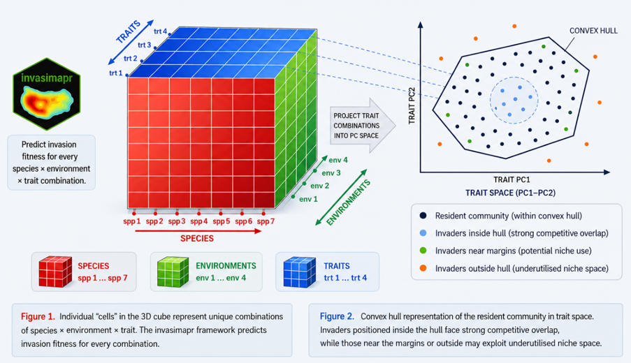
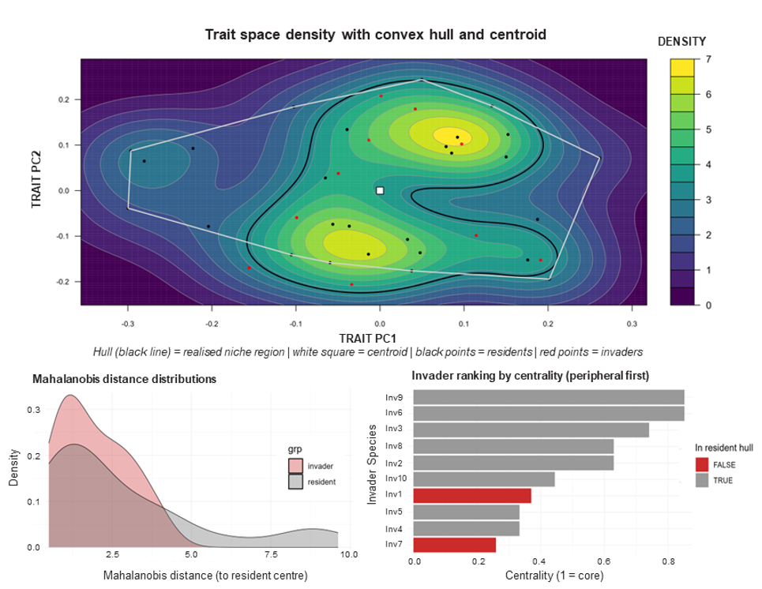
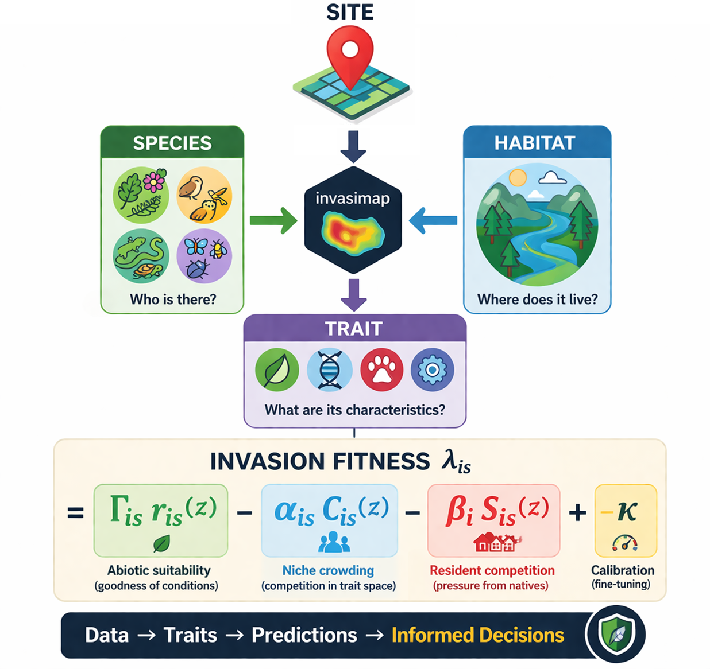
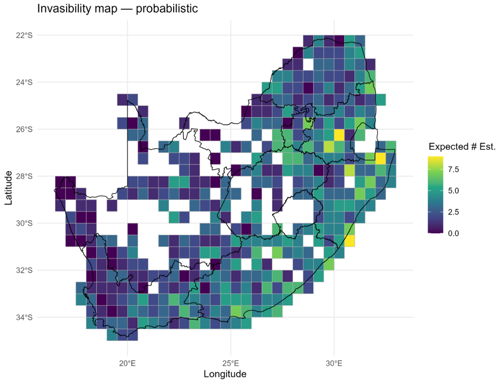
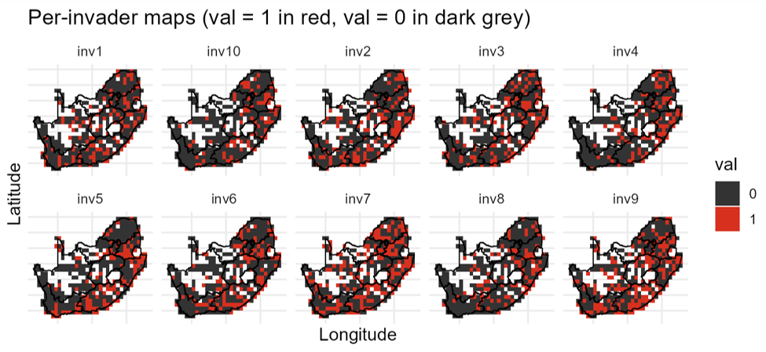

<!-- README.md is generated from README.Rmd. Please edit that file -->

```{r, include = FALSE}
knitr::opts_chunk$set(
  collapse = TRUE,
  comment = "#>",
  fig.path = "man/figures/README-",
  out.width = "100%",
  message = FALSE,
  warning = FALSE
)
```

# invasimapr 

<!-- badges: start -->
[](https://www.repostatus.org/#wip)
[](https://github.com/b-cubed-eu/invasimapr/actions/workflows/R-CMD-check.yaml)
[](https://app.codecov.io/gh/b-cubed-eu/invasimapr)
[](https://b-cubed-eu.r-universe.dev/invasimapr)
[](https://doi.org/10.5281/zenodo.20842472)
[](https://opensource.org/licenses/MIT)
<!-- badges: end -->

**invasimapr** is an open-source R package that quantifies and maps
community-level **invasion fitness** and site-specific **invasibility**.
Biological invasions are a leading driver of biodiversity loss, yet invasion
outcomes depend jointly on three things: the **functional traits** of candidate
invaders, the **abiotic suitability** of local environments, and the **biotic
resistance** of resident communities. Most risk-assessment tools address only
one or two of these axes at a time. invasimapr integrates all three into a
single, reproducible workflow that resolves invasion fitness at the scale of
individual species and sites, and turns it into decision-ready indicators of
*which* invaders are most likely to establish, *where* invasions are most
likely to occur, and *which* ecological mechanisms drive that risk.

invasimapr is part of the [B-Cubed](https://b-cubed.eu/)
([b3verse](https://docs.b-cubed.eu/guides/b3verse/)) toolbox and integrates
tightly with [dissmapr](https://github.com/b-cubed-eu/dissmapr) for biodiversity
data acquisition and spatial gridding.

## How it works

invasimapr is built on the **Invasibility Cube**: a unified species x environment
x trait structure that predicts invasion outcomes across every combination of
candidate invader and site. Trait combinations are projected into a
principal-component trait space, where the convex hull of the resident community
defines the competitive arena an invader must enter.



At its core, invasimapr estimates **invasion fitness**: the per-capita growth
rate of a rare invader introduced into a resident community at ecological
equilibrium. When this is positive the invader can increase from low density and
is predicted to establish; when negative it is expected to fail. Invasion
fitness is decomposed into three mechanistic components:

- **Abiotic suitability** – how well the invader's traits match local
  environmental conditions.
- **Niche crowding** – how strongly the invader's traits overlap with the
  resident community in a shared trait–environment space.
- **Resident competition** – how saturated the site already is with abundant
  residents.

When abiotic benefits outweigh competitive penalties, a species attains positive
invasion fitness and a higher probability of establishment. Geometrically,
invaders near the centroid of the resident trait cloud face strong competition
from look-alike residents, while those toward the margins (or outside the hull)
find less crowded niche space and weaker biotic resistance.



## Installation

You can install the development version of invasimapr from
[GitHub](https://github.com/b-cubed-eu/invasimapr) with:

``` r
# install.packages("remotes")
remotes::install_github("b-cubed-eu/invasimapr")
```

## The workflow

invasimapr is modular, transparent and fully reproducible, progressing in three
phases: **inputs and setup**, **from data to invasion fitness**, and **prediction
and indicators**. It is built around eight wrapper functions that run end-to-end
with minimal intervention, each returning an updated `invasimapr_fit` container:



1. **`prepare_inputs()`** – assemble and align community, trait and
   environmental matrices.
2. **`simulate_invaders()`** – generate hypothetical invader trait profiles
   from the resident pool (or import your own).
3. **`prepare_trait_space()`** – build the shared Gower/PCoA trait space, convex
   hull and niche-crowding indices.
4. **`model_residents()`** – fit GLMMs to resident abundance and derive
   standardised predictors.
5. **`learn_sensitivities()`** – estimate trait-dependent (and optionally
   site-varying) slopes for suitability, crowding and competition.
6. **`predict_invaders()`** – project invaders into the resident model space.
7. **`predict_establishment()`** – compute per-invader, per-site invasion
   fitness and map it to establishment probability.
8. **`summarise_results()`** – derive species invasiveness, site invasibility
   and trait-effect indicators with maps and plots.

## Example

A minimal, reproducible example using the demo data shipped with the package
(415 sites, 27 resident species, 20 traits and 10 environmental layers):

```{r example}
library(invasimapr)

# Demo data: one long table with sites, coordinates, species counts,
# environment (env*) and trait (trait_*) columns.
csv <- system.file("extdata", "site_env_spp_simulated.csv.gz", package = "invasimapr")
if (!nzchar(csv)) csv <- "inst/extdata/site_env_spp_simulated.csv.gz"  # source fallback (pre-reinstall)
site_env_spp <- read.csv(csv)

# invasimapr expects a `site` key; coerce character columns to factors.
long_df <- site_env_spp
names(long_df)[names(long_df) == "site_id"] <- "site"
chr <- vapply(long_df, is.character, logical(1))
long_df[chr] <- lapply(long_df[chr], as.factor)

# Step 1: assemble and align the core matrices in one call
fit <- prepare_inputs(
  long_df      = long_df,
  site_col     = "site",
  env_prefix   = "^env",
  trait_prefix = "^trait",
  make_plots   = FALSE
)

fit
```

The remaining steps extend the same `fit` object. They involve model fitting and
are shown here without evaluation for brevity:

``` r
# Step 2: simulate hypothetical invaders from the resident trait pool
traits_inv <- simulate_invaders(
  resident_traits = fit$inputs$traits_res,
  n_inv = 10, mode = "columnwise"
)

# Steps 3-8: trait space -> resident model -> sensitivities ->
#            invader prediction -> invasion fitness -> indicators
fit <- prepare_trait_space(fit, traits_inv = traits_inv)
fit <- model_residents(fit)
fit <- learn_sensitivities(fit)
fit <- predict_invaders(fit, traits_inv = traits_inv)
fit <- predict_establishment(fit, option = "C", prob_method = "probit")
fit <- summarise_results(fit)
```

See the [Get started](https://b-cubed-eu.github.io/invasimapr/articles/invasimapr.html)
vignette and the [tutorial articles](https://b-cubed-eu.github.io/invasimapr/articles/)
for the full step-by-step workflow with real data.

## Outputs and indicators

By marginalising the species × site fitness surface across species, sites or
traits, invasimapr produces three complementary families of indicators:

- **Species invasiveness** – how broadly a species can establish across sites
  (supports watchlists and early detection).
- **Site invasibility** – how open a community is to newcomers (identifies
  invasion hotspots for surveillance and conservation planning).
- **Trait invasiveness** – which functional attributes most strongly drive
  establishment (reveals the mechanistic basis of risk).



Applied to South African butterflies, for example, invasimapr maps binary
establishment for each candidate invader on a common grid, making spatial
patterns directly comparable across species:



## Documentation

- Package website: <https://b-cubed-eu.github.io/invasimapr/>
- Source code: <https://github.com/b-cubed-eu/invasimapr>
- B-Cubed project documentation: <https://docs.b-cubed.eu/>

## Citation

To cite invasimapr, run `citation("invasimapr")` in R, or use:

> MacFadyen, S., Yahaya, M.M., Trekels, M., Kumschick, S., Landi, P. & Hui, C.
> (2025). *invasimapr: Workflow to Visualise Trait Dispersion and Assess
> Invasibility.* R package version 0.2.0.
> <https://doi.org/10.5281/zenodo.20842472>

## Meta

- We welcome [contributions](.github/CONTRIBUTING.md), including bug reports, via
  the [issue tracker](https://github.com/b-cubed-eu/invasimapr/issues).
- License: MIT.
- Please note that this project is released with a
  [Contributor Code of Conduct](CODE_OF_CONDUCT.md). By participating you agree
  to abide by its terms.

## Acknowledgments

This software was developed with funding from the European Union's Horizon
Europe Research and Innovation Programme under grant agreement ID No
[101059592](https://doi.org/10.3030/101059592).
