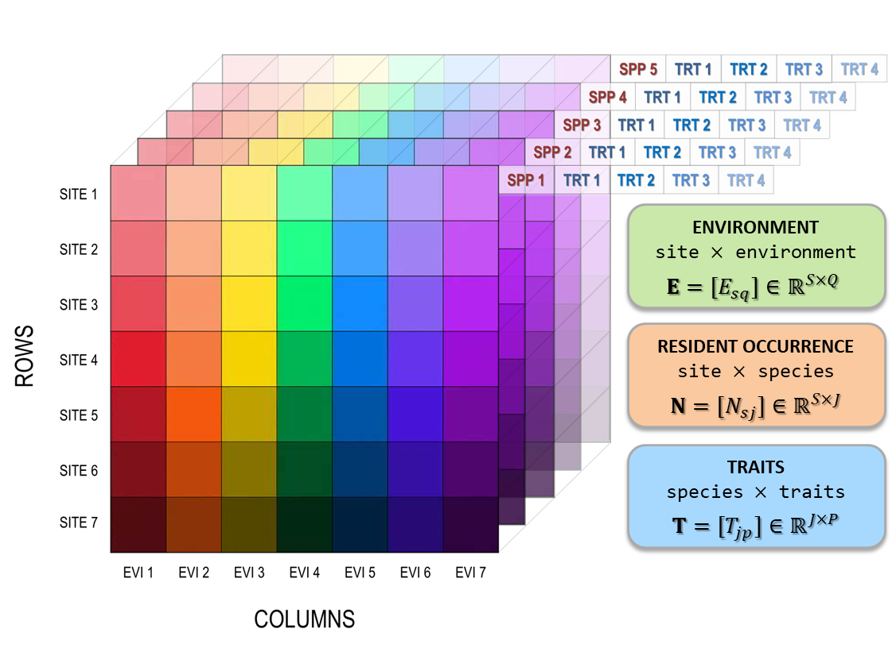
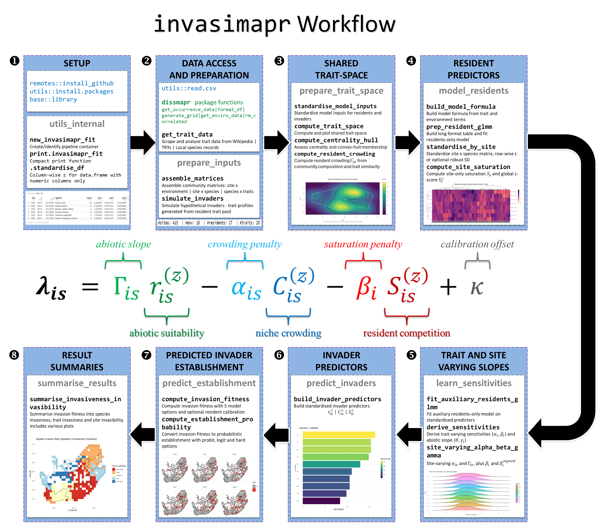
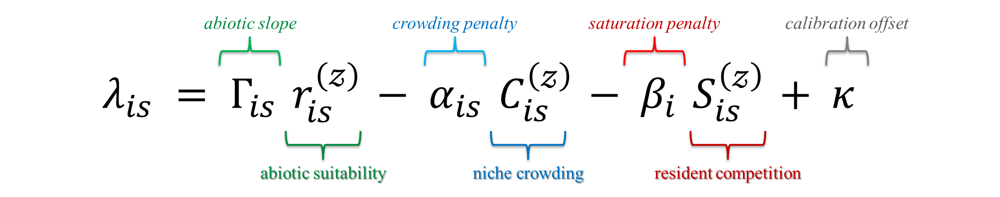

<!-- README.md is generated from README.Rmd. Please edit that file -->

```{r setup-readme, include=FALSE}
knitr::opts_chunk$set(
  collapse = TRUE,
  comment = "#>",
  fig.path = "man/figures/README-",
  out.width = "100%",
  dev = "ragg_png",
  dpi = 200,
  fig.retina = 2, # OR dev = "png"         # avoid PDF devices entirely
  fig.width = 12,
  fig.height = 6,
  fig.align = "center",
  fig.crop = FALSE,
  echo = TRUE,
  message = FALSE,
  warning = FALSE
)

options(rmarkdown.html_vignette.check_title = FALSE)

if (requireNamespace("devtools", quietly = TRUE)) {
  devtools::load_all(quiet = TRUE)
}

# if (requireNamespace("data.table", quietly = TRUE)) data.table::cedta()

```

<!-- badges: start -->

[](https://www.repostatus.org/#active) [](https://github.com/b-cubed-eu/invasimapr/releases) [](https://b-cubed-eu.r-universe.dev/invasimapr) [](https://CRAN.R-project.org/package=invasimapr) [](https://github.com/b-cubed-eu/invasimapr/actions/workflows/R-CMD-check.yaml) [](https://app.codecov.io/gh/b-cubed-eu/invasimapr) [](https://zenodo.org) [](https://b-cubed-eu.r-universe.dev/) [](LICENSE.md)

<!-- badges: end -->

------------------------------------------------------------------------

# `invasimapr`

## A novel framework to visualise trait dispersion and assess species invasiveness and site invasibility

------------------------------------------------------------------------

## 1. Introduction

Biological invasions are a major driver of biodiversity loss. Invasive alien species (IAS) can spread quickly, alter ecosystem processes, and displace native taxa. Because invasion outcomes depend jointly on functional traits, resident communities, and local environments, ad-hoc analyses are not enough. We need a transparent, reproducible way to quantify establishment potential at specific sites and to compare that potential across species and landscapes. **`invasimapr`** fills this gap. It is a trait-based, site-specific R package that estimates **invasion fitness** for candidate invaders, assembles the resident community context that constrains establishment, and turns these quantities into mappable indicators for decision making. The workflow links three pillars:

1.  **Functional trait space**, which governs competitive overlap.
2.  **Environmental suitability**, which determines how well species perform at a site.
3.  **Biotic competition**, which reduces the chance of establishment.

Implemented in **`invasimapr`**, our framework fits a single trait-environment model and reuses it to quantify both **invader performance** and the **resident context**, ensuring internal consistency and transparent assumptions. It builds on standard tools (GLMM/GAM; Gower trait distances), yields reproducible workflows, and reports two headline metrics: **site invasibility** (openness of sites to newcomers) and **species invasiveness** (propensity of species to establish across sites). These metrics support core applications: **risk assessment** (flag species-trait combinations with high-establishment potential), **biodiversity conservation** (pinpoint vulnerable regions in trait and geographic space), and **ecosystem management** (anticipate community reconfiguration under invasion pressure). We synthesize results in the **network invasibility cube**, which organises invasion fitness across sites, species, and traits.

------------------------------------------------------------------------

## 2. Network Invasibility Cube

The network invasibility cube unifies **functional traits**, **environmental suitability**, and **community competition** into a single **multidimensional framework**. Three matrices form the **data-cube backbone** that supports invasion fitness estimation and network-level analyses (Figure 1):  

-   **Environment matrix**: $\mathbf{E} = [E_{sq}] \in \mathbb{R}^{S \times Q}$, describing site × environmental variables.  
-   **Community matrix**: $\mathbf{N} = [N_{sj}] \in \mathbb{R}^{S \times J}$, giving site × species abundances or occurrences.  
-   **Trait matrix**: $\mathbf{T} = [T_{jp}] \in \mathbb{R}^{J \times P}$, representing species × traits.  

{width="80%"}

> **Figure 1**: Data-cube schematic showing the three core matrices that are integrated into a unified multidimensional structure: 
> - **Environment** $\mathbf{E}\in\mathbb{R}^{S\times Q}$ where for each site $s$, columns **EVI1** to **EVI5** are environmental variables (e.g., climate, soils) attached to that site's location $(x_s,y_s)$
> - **Resident occurrence** $\mathbf{N}\in\mathbb{R}^{S\times J}$ where for the same sites, columns **SPP1** to **SPP5** are species $j$ with abundance or occurrence recorded at site $s$
> - **Traits** $\mathbf{T}\in\mathbb{R}^{J\times P}$ where for each species $j$, columns **TRT1** to **TRT4** are trait values (e.g., size, colour, life stage). $\mathbf{T}$ links to $\mathbf{N}$ via the shared species ID.
> - **Stacking $\mathbf{E}$, $\mathbf{N}$, and $\mathbf{T}$** forms a consistent data cube that underpins trait-environment modeling and downstream invasion analyses.

------------------------------------------------------------------------

## 3. Shared Trait-Environment Space

Integrating traits, environment, community composition and abundance (or presence-absence) into a unified framework, the **multidimensional trait-environment space** provides a geometric representation of these interactions, allowing invasion fitness to be visualised in spatial terms. In this way, each species occupies a region defined by its traits and ecological tolerances. In this space, each axis corresponds to a trait or environmental variable, and species are represented as points (or point clouds) defined by their values. In the shared **trait space**, ecological interactions and establishment potential can thus be understood through geometric measures:

-   The community forms a **species cloud** in trait space, whose shape reflects the diversity of resident strategies.
-   The **convex hull** of this cloud approximates the realised niche space.
-   Invasion fitness depends on an invader's **distance to the cloud centroid** (trait centrality) and **position relative to the hull**.
-   **Geometric measures** (distances, overlaps, boundaries) map onto ecological processes: alignment with environment (abiotic suitability), niche crowding, and competitive displacement.

Within this framework, **invasion fitness** can be estimated using the geometry of trait space. That is, invaders positioned on the periphery or in under-occupied regions are more likely to establish, whereas those embedded within dense resident clusters experience stronger competition and lower fitness. Typically, fitness can be decomposed into three components (Figure 2):

1.  **Abiotic suitability** - captures the alignment between the invader's traits and the local environment.
2.  **Niche crowding** - reflects the overlap with resident trait space, weighted by resident composition.
3.  **Resident competition** (site saturation) - represents the competitive pressure from residents that already perform well at the site.

------------------------------------------------------------------------

## 4. Invasion Fitness

**Invasion fitness** $(\lambda_{is})$ is a central concept in adaptive dynamics and eco-evolutionary theory, providing a predictor of coexistence, competitive exclusion, and adaptive evolutionary outcomes. It predicts whether species $i$ can take hold at site $s$ i.e. positive values suggest establishment, negative values suggest failure. More specifically, $\lambda_{is}$ is defined as the per capita growth rate of a rare species introduced into a resident community at ecological equilibrium. It combines the effects of **abiotic suitability**, **niche crowding**, and **resident competition**, to determine whether an invader $i$ with traits $\mathbf{t_i} \in \mathbb{R}^p$ can establish and persist at site $s$ with environmental conditions $\mathbf{e_s} \in \mathbb{R}^q$ and resident community composition $\mathbf{n_s} \in \mathbb{R}^j$. Mathematically, invasion fitness is expressed as: 

{width="100%"}

-   where $r^{(z)}_{is}$ is the invader's **environmental fit** at the site (standardised so values are comparable across sites and species). ➜ The coefficient $\Gamma_{is}$ tells how strongly that fit translates into potential growth.
-   The term $C^{(z)}_{is}$ measures **niche crowding** i.e. how much look-alike residents already occupy the same niche. ➜ $\alpha_{is}$ is how severely that overlap reduces the invader's success.
-   The term $S^{(z)}_{is}$ reflects **site saturation** i.e. how "full" or dominance-skewed the community is. ➜ $\beta_i$ is the invader's sensitivity to that general resident pressure.
-   $\kappa$ is a small **calibration offset** that sets the baseline (typically centering residents near zero) without changing relative rankings.\|

> 💡 In short, $\lambda_{is}$ balances **how suitable the site is** against **how hard it is to elbow in**.
> When environmental benefits outweigh crowding and saturation penalties, $\lambda_{is}>0$ and establishment is more likely; when penalties dominate, $\lambda_{is}<0$.

------------------------------------------------------------------------

### 4.1 Invasiveness and Invasibility

The invasion fitness output can be aggregated to site and species level summaries of **invasiveness** $V_i$ & $T_{ik}$ and **invasibility** $V_s$ to provide interpretable metrics for mapping and prioritisation;

1. **Species Invasiveness** is the proportion of sites ($S$) where species $i$ can establish i.e. it identifies trait combinations that enable broad establishment:
   
   $$
   V_i \;=\; \frac{1}{|S|} \sum_{s} \mathbb{I}\{\lambda_{is} > 0\}
   $$

1. **Trait Invasiveness** is how much a single trait explains variation in species invasiveness $V_i$ across species, yielding one scalar per trait e.g. for trait $T_k$ (the $k$-th trait):
   
   $$
   \mathrm{TI}_k \;=\; \frac{\mathrm{Var}\!\left(\mathbb{E}[\,V_i \mid T_{ik}\,]\right)}{\mathrm{Var}(V_i)}
   $$
   where invasiveness is the fraction of variance in $V_i$ explained by trait $T_k$ alone (no other covariates).
&nbsp;

2. **Site Invasibility** is the proportion of invaders ($I$) that establish at site $s$ i.e. it identifies invasion "hotspots" or resistant communities.
   
   $$
   V_s \;=\; \frac{1}{|I|} \sum_{i} \mathbb{I}\{\lambda_{is} > 0\}
   $$

> 💡The decomposition of invasion fitness into **abiotic suitability**, **niche crowding**, and **biotic resistance** or resident competition, reinforces that successful invasion depends both on the compatibility of the invader (incl. its associated traits) with its abiotic environment and on the competitive structure of the biotic community. Thus, if invasion fitness is **positive**, the invader is expected to increase in abundance; if **negative**, it will fail to establish. In other words, $\lambda_{is} > 0$ implies positive invasion fitness, suggesting establishment of invader $i$ is possible at site $s$. Therefore a probabilistic measure of establishment can also be derived as:
>
> $$
> P(F>0) \;=\; \Phi\!\left(\frac{\mu_{is}}{\sigma}\right)
> $$
>
> where $\mu_{is}$ is the predicted mean invasion fitness and $\sigma$ is the predictive residual standard deviation.
>  

---

## 5. Overview of `invasimapr` workflow

The **`invasimapr`** workflow links raw ecological inputs (Figure 1) to decision-ready outputs, progressing from resident community data, traits $T$, abundances $N$ across sites $S$ with environments $E$, to site-level maps and species rankings (Figure 2). Each stage corresponds to wrapper functions implemented in specific scripts, so users can trace every conceptual step to its code. Intermediate objects are returned throughout for auditability and reuse.

1. **Setup**
Install and load **`invasimapr`** from [GitHub](https://github.com/b-cubed-eu/invasimapr) to make the full workflow available, alongside the core libraries used for spatial handling, biodiversity modelling, and visualisation. If you do not already have species-occurrence and/or environmental site data, install **`dissmapr`** ([GitHub](https://github.com/b-cubed-eu/dissmapr)) for modular acquisition and preparation of biodiversity data. The utility wrapper **`utils_internal`** creates a pipeline container with `new_invasimapr_fit()`, prints a compact summary via `print.invasimapr_fit()`, and standardises predictors with `.standardise_df()`; together these utilities harmonise IDs and scales before modelling begins.
&nbsp;

2. **Data access and preparation**
You may read local data with `utils::read.csv` or use **`dissmapr`** to pull raw observations from [GBIF](https://www.gbif.org/), harmonise them onto spatial grids, and extract environmental predictors. **`get_trait_data()`** retrieves and aligns species traits (e.g. from [Wikipedia](https://www.wikipedia.org/)-derived tables) so community, environment, and invader information integrate cleanly downstream. The wrapper **`prepare_inputs`** calls **`assemble_matrices()`** to build the core inputs, namely site coordinates, site × environment tables, site × resident matrices, and trait tables, while invader profiles are either imported or simulated with **`simulate_invaders()`** by resampling resident trait distributions.
&nbsp;

3. **Trait space and resident crowding**
The wrapper **`prepare_trait_space`** standardises model inputs and characterises the joint trait space, writing outputs to `fit$traits` and `fit$crowding`. `standardise_model_inputs()` z-scores environments and resident traits, rescales invader traits using resident means/SDs (preventing leakage), and aligns factor levels; outputs include `env_df_z`, `traits_res_glmm`, and `traits_inv_glmm` with scaling metadata. `compute_trait_space()` constructs a shared resident-invader trait map, `compute_centrality_hull()` computes centrality and convex-hull membership, and `compute_resident_crowding()` derives crowding indices $C_{js}$ from community composition and trait similarity (Gower to Gaussian kernel) with robust z-standardisation.
&nbsp;

4. **Resident modelling** 
The **`model_residents`** wrapper fits resident responses to traits and environments. `build_model_formula()` defines a GLMM-ready formula; `prep_resident_glmm()` builds the site × resident long table and fits a residents-only GLMM to obtain link-scale suitability $r_{js}$ and expected abundances $\mu_{js}$. `standardise_by_site()` row-standardises site×species matrices, and `compute_site_saturation()` yields site-level saturation $S_s$ and its z-standardised form $S^{(z)}_s$.
&nbsp;

5. **Sensitivity estimation** 
The **`learn_sensitivities`** wrapper estimates resident-only slopes and trait sensitivities. `fit_auxiliary_residents_glmm()` fits trait × predictor interactions with optional site random slopes; `derive_sensitivities()` extracts invader-level $\alpha_i$ (crowding), $\beta_i$ (saturation), $\theta_i$ (abiotic slope), and a fallback $\gamma_i$; and `site_varying_alpha_beta_gamma()` combines fixed effects with site deviations to produce $\alpha_{is}$ and $\Gamma_{is}$, while propagating $\beta_i$.
&nbsp;

6. **Invader predictors** 
Using **`predict_invaders`**, the function `build_invader_predictors()` generates invader-specific predictors on the resident-calibrated scale: $r^{(z)}_{is}$ for abiotic suitability, $C^{(z)}_{is}$ for trait-weighted crowding, and $S^{(z)}_{is}$ for site saturation (broadcast across invaders).
&nbsp;

7. **Invasion fitness and establishment probability** 
The wrapper **`predict_establishment`** assembles fitness and translates it to probability. **`compute_invasion_fitness()`** forms
$$
\lambda_{is} \;=\; \Gamma_{is}\, r^{(z)}_{is} \;-\; \alpha_{is}\, C^{(z)}_{is} \;-\; \beta_i\, S^{(z)}_{is} \;+\; \kappa,
$$
allowing global or site-varying slopes, signed vs unsigned saturation effects, and calibration via $\kappa$ so resident mean $\lambda$ is zero. **`compute_establishment_probability()`** then maps $\lambda_{is}$ to $p_{is}$ using `probit`, `logit`, or hard thresholds, returning matrices aligned with $\lambda_{is}$.
&nbsp;

8. **Summarisation and interpretation** 
Finally, **`summarise_results`** calls **`summarise_invasiveness_invasibility()`** to collapse site × invader surfaces into species invasiveness (mean breadth of establishment across sites), site invasibility (mean probability or fraction of invaders establishing), and trait-level associations (continuous slopes or ANOVA $R^2$ for categorical traits). Outputs include tidy species- and site-level tables, trait-effect summaries, and a suite of plots (e.g. maps, rankings, heatmaps, trait-effect diagrams), providing management-ready summaries and ecological insight.


{width="100%"}

**Figure 2**: `invasimapr` workflow linking data access, preparation, trait-space modelling, resident predictors, and slope estimation to the invasion fitness equation - The invasion fitness formula decomposes into four components: **abiotic suitability** $\Gamma_{is} r^{(z)}_{is}$ (green), **niche crowding penalty** $-\alpha_{is} C^{(z)}_{is}$ (blue), **resident saturation penalty** $-\beta_i S^{(z)}_{is}$ (red), and a **calibration offset** $\kappa$ (grey). Each component is derived from specific workflow modules, converging on predicted invader establishment and summarised results, which provide actionable **outputs to policy**.
 

> 💡Across eight wrappers and eigthteen functions, **`invasimapr`** offers a logically ordered pipeline. Utility functions prepare and standardise inputs; resident and invader predictors are generated on common scales; invasion fitness and establishment probabilities are derived under flexible assumptions; and results are summarised into interpretable, map-ready outputs. Explicit mapping of each conceptual step to a wrapper function ensures reproducibility, transparency, and accessibility for both ecological research and applied biodiversity monitoring.

------------------------------------------------------------------------

# Step-by-step Workflow

## 1. Setup

### 1.1. Install and load `invasimapr`

Install and load the `invasimapr` package from GitHub, ensuring all functions are available for use in the workflow.

```{r install, eval=FALSE, include=TRUE}
# # Install remotes package if needed
# install.packages("remotes")
# remotes::install_github("b-cubed-eu/invasimapr")

# Ensure the package is loaded when knitting
library(invasimapr)
sessionInfo()$otherPkgs$invasimapr$Version

# Make sure all the functions are loaded
# devtools::load_all() # alternative during local development
```

### 1.2. Load other R libraries

Load core libraries for spatial processing, biodiversity modelling, and visualization required across the `invasimapr` analysis pipeline.

```{r setup, echo=TRUE, eval=FALSE}
# Load essential packages
suppressPackageStartupMessages({
  need = c("dplyr","tidyr","purrr","tibble","stringr","ggplot2","Matrix","glmnet","rlang", "glmmTMB",
  "performance", "vegan", "cluster", "matrixStats", "sf", "MASS", "factoextra", "viridis", "pheatmap")
  to_install = need[!sapply(need, requireNamespace, quietly = TRUE)]
  if (length(to_install)) install.packages(to_install)
  lapply(need, library, character.only = TRUE)
})
```

------------------------------------------------------------------------

## 2. Data access and preparation

### 2.1. Using `dissmapr`

To acquire and prepare species occurrence data for biodiversity modelling using the `dissmapr` package, a series of modular functions streamline the workflow from raw observations to spatially aligned environmental predictors.

#### 2.1.1. Install `dissmapr`

Install and load the `dissmapr` package from GitHub, ensuring all functions are available for use in the workflow.

```{r dissmapr}
# # Install remotes if needed
# install.packages("remotes")
# remotes::install_github("b-cubed-eu/dissmapr")

# Ensure the package is loaded
library(dissmapr)
sessionInfo()$otherPkgs$dissmapr$Version
```

#### 2.1.2. Import and harmonise biodiversity-occurrence data

The process begins with [`dissmapr::get_occurrence_data()`](https://b-cubed-eu.github.io/dissmapr/reference/get_occurrence_data.html), which imports biodiversity records, such as a GBIF butterfly dataset for South Africa, and harmonizes them into standardised formats. Input sources can include local CSV files, URLs, or zipped GBIF downloads. The function filters data by taxon and region, returning both raw records and site × species matrices in presence-absence or abundance form.

```{r get-occurrence, echo=TRUE, results='hide', message=FALSE, warning=FALSE, fig.show='hide'}
# Use local GBIF data
bfly_data = dissmapr::get_occurrence_data(
  data = system.file("extdata", "gbif_butterflies.csv", package = "invasimapr"),
  source_type = "local_csv",
  sep = "\t"
)

# Check results but only a subset of columns to fit in console
dim(bfly_data)
# str(bfly_data[,c(51,52,22,23,1,14,16,17,30)])
head(bfly_data[, c(51, 52, 22, 23, 1, 14, 16, 17, 30)])
```

#### 2.1.3. Format biodiversity records to long/wide formats

Next, [`dissmapr::format_df()`](https://b-cubed-eu.github.io/dissmapr/reference/format_df.html) restructures the raw records into tidy long and wide formats. This assigns unique site IDs, extracts key fields (coordinates, species names, observation values), and prepares two main outputs: `site_obs` (long format for mapping) and `site_spp` (wide format for species-level analysis).

```{r format-df, echo=TRUE, results='hide', message=FALSE, warning=FALSE, fig.show='hide'}
# Continue from GBIF data
bfly_result = dissmapr::format_df(
  data        = bfly_data, # A `data.frame` of biodiversity records
  species_col = "verbatimScientificName", # Name of species column (required for `"long"`)
  value_col   = "pa", # Name of value column (e.g. presence/abundance; for `"long"`)
  extra_cols  = NULL, # Character vector of other columns to keep
  format      = "long" # Either`"long"` or `"wide"`
)

# Check `bfly_result` structure
str(bfly_result, max.level = 1)

# Optional: Create new objects from list items
site_obs = bfly_result$site_obs
site_spp = bfly_result$site_spp

# Check results
dim(site_obs)
head(site_obs)

dim(site_spp)
head(site_spp[, 1:6])

#### Get parameters from processed data to use later
# Number of species
(n_sp = dim(site_spp)[2] - 3)

# Species names
sp_cols = names(site_spp)[-c(1:3)]
sp_cols[1:10]
```

#### 2.1.4. Generate spatial grid and gridded summaries

To integrate the data spatially, [`dissmapr::generate_grid()`](https://b-cubed-eu.github.io/dissmapr/reference/generate_grid.html) overlays a user-defined spatial lattice (e.g. 0.5° grid), aggregates biodiversity observations per grid cell, and computes standardised metrics such as species richness and observation effort. Outputs include gridded species matrices (`grid_spp`, `grid_spp_pa`), a spatial polygon (`grid_sf`), and raster layers (`grid_r`), enabling downstream spatial modelling.

```{r grid, echo=TRUE, results='hide', message=FALSE, warning=FALSE, fig.show='hide'}
# Load the national boundary
rsa = sf::st_read(system.file("extdata", "rsa.shp", package = "invasimapr"))

# Choose a working resolution
res = 0.5 # decimal degrees° (≈ 55 km at the equator)

# Convert the AoI to a 'terra' vector
rsa_vect = terra::vect(rsa)

# Initialise a blank raster template
grid = terra::rast(rsa_vect, resolution = res, crs = terra::crs(rsa_vect))

# Populate the raster with placeholder values
terra::values(grid) = 1

# Clip the raster to the AoI
grid_masked = terra::mask(grid, rsa_vect)

# Generate a 0.5° grid summary for the point dataset `site_spp`
grid_list = dissmapr::generate_grid(
  data          = site_spp, # point data with x/y + species columns
  x_col         = "x", # longitude column
  y_col         = "y", # latitude  column
  grid_size     = 0.5, # cell size in degrees
  sum_cols      = 4:ncol(site_spp), # columns to aggregate * could also use `names(site_spp)[4:ncol(site_spp)]`
  crs_epsg      = 4326 # WGS84
)

# Inspect the returned list
str(grid_list, max.level = 1)

# (Optional) Promote list items to named objects
grid_r = grid_list$grid_r$grid_id # raster
grid_sf = grid_list$grid_sf # polygons for mapping or joins
grid_spp = grid_list$grid_spp # tabular summary per cell
grid_spp_pa = grid_list$grid_spp_pa # presence/absence summary

# Quick checks
dim(grid_sf) # ; head(grid_sf)
dim(grid_spp) # ; head(grid_spp[, 1:8])
dim(grid_spp_pa) # ; head(grid_spp_pa[, 1:8])
```

**(Optional) Visualise species richess per grid cell**

Plot square root transformed sampling effort and species richness, in a 1x2 side by side. Each map uses the `viridisLite::turbo` palette and is overlaid with the study area outline for spatial context.

```{r spp-rich, echo=TRUE, results='hide', message=FALSE, warning=FALSE, fig.show='hide'}
# ensure terra methods are used
# library(terra)

# Get a 2-layer SpatRaster for obs_sum & spp_rich, regardless of source structure
r = grid_list$grid_r
if (inherits(r, "SpatRaster")) {
  effRich_r = r[[c("obs_sum", "spp_rich")]]
} else if (is.list(r)) {
  # r is a list of single-layer SpatRasters named 'obs_sum' and 'spp_rich'
  effRich_r = rast(list(r[["obs_sum"]], r[["spp_rich"]]))
} else {
  stop("grid_list$grid_r must be a SpatRaster or a list of SpatRaster layers")
}

# transform
effRich_r = sqrt(effRich_r)

# Open a 1×2 layout and plot each layer + outline
old_par = par(mfrow = c(1, 2), mar = c(1, 1, 1, 2))
on.exit(par(old_par), add = TRUE)

for (i in 1:2) {
  terra::plot(effRich_r[[i]],
    col   = viridisLite::turbo(100),
    colNA = NA,
    axes  = FALSE,
    main  = c("Sampling effort (√obs count)",
              "Species richness (√unique count)")[i],
    cex.main = 0.8
  )
  terra::plot(terra::vect(rsa), add = TRUE, border = "black", lwd = 0.4)
}
```

> :chart_with_upwards_trend: **Figure 3: Spatial distribution of sampling effort and species richness across the study area.** Each grid cell shows the square root--transformed values for (left) total observation counts (sampling effort) and (right) unique species counts (species richness). Both maps use the `viridisLite::turbo` color palette for comparability and are overlaid with the study area outline to provide spatial context.

#### 2.1.5. Retrieve, crop, resample, and link environmental rasters to sampling sites

Environmental predictors are appended using [`dissmapr::get_enviro_data()`](https://b-cubed-eu.github.io/dissmapr/reference/get_enviro_data.html), which buffers the grid, downloads raster data (e.g. WorldClim bioclimatic variables), resamples it, and links values to grid-cell centroids. This produces both a site × environment data frame (`env_df`) and a SpatRaster object (`env_r`), aligning biological and environmental data.

Begin by reading in a predefined target species list, then filter a site × species dataset (`grid_spp`) to retain only relevant species observations, and reshape the data for further analysis. This produces both a filtered long-format dataset (`grid_obs`) and a cleaned wide-format site × species matrix (`grid_spp`).

```{r spp-filter, echo=TRUE, results='hide', message=FALSE, warning=FALSE, fig.show='hide'}
# Read in target species list
species = read.csv(system.file("extdata",
  "rsa_butterfly_species_names_n27_100plus.csv",
  package = "invasimapr"
), stringsAsFactors = FALSE)$species

# Filter `grid_spp` and convert to long-format
grid_obs = grid_spp |>
  dplyr::select(-mapsheet) |> # Drop mapsheet metadata
  tidyr::pivot_longer(
    cols = -c(grid_id, centroid_lon, centroid_lat, obs_sum, spp_rich), # Keep core metadata columns only
    names_to = "species",
    values_to = "count",
    values_drop_na = TRUE
  ) |>
  dplyr::filter(
    # obs_sum > 100, # Only high-observation sites
    count > 0,# Remove absent species
    .data$species %in% .env$species# Keep only target species
    ) |>
  dplyr::rename(
    site_id = grid_id, # Change 'grid_id' to 'site_id'
    x = centroid_lon, # Change 'centroid_lon' to 'x'
    y = centroid_lat # Change 'centroid_lat' to 'y'
  ) |>
  dplyr::relocate(site_id, x, y, obs_sum, spp_rich, species, count)

dim(grid_obs)
head(grid_obs)
length(unique(grid_obs$species))
length(unique(grid_obs$site))

# Reshape site-by-species matrix to wide format and clean
grid_spp = grid_obs |>
  tidyr::pivot_wider(
    names_from = species,
    values_from = count,
    values_fill = 0 # Replace missing counts with 0
  )

dim(grid_spp)
# head(grid_spp)
```

Then proceed to **retrieve and process environmental data** using [`dissmapr::get_enviro_data()`](https://b-cubed-eu.github.io/dissmapr/reference/get_enviro_data.html). In the example below, 19 bioclimatic variables are downloaded from WorldClim v2.1 (≈10 km resolution) for all site centroids in the `grid_spp` dataset. It performs the following steps:

1.  Retrieves WorldClim "bio" variables via the `geodata` interface.
2.  Buffers the area of interest (AOI) by 10 km.
3.  Retains site-level metadata (`obs_sum`, `spp_rich`) and excludes species columns.

```{r get-enviro, echo=TRUE, results='hide', message=FALSE, warning=FALSE, fig.show='hide'}
# Retrieve 19 bioclim layers (≈10-km, WorldClim v2.1) for all grid centroids
data_path = "inst/extdata" # cache folder for rasters
enviro_list = dissmapr::get_enviro_data(
  data       = grid_spp, # centroids + obs_sum + spp_rich
  buffer_km  = 10, # pad the AOI slightly
  source     = "geodata", # WorldClim/SoilGrids interface
  var        = "bio", # bioclim variable set
  res        = 5, # 5-arc-min ≈ 10 km
  grid_r     = grid_r, # To set resampling resolution, if necessary
  path       = data_path,
  sp_cols    = 7:ncol(grid_spp), # ignore species columns
  ext_cols   = c("obs_sum", "spp_rich") # carry effort & richness through
)

# Quick checks
str(enviro_list, max.level = 1)

# (Optional) Assign concise layer names for readability
# Find names here https://www.worldclim.org/data/bioclim.html
names_env = c(
  "temp_mean", "mdr", "iso", "temp_sea", "temp_max", "temp_min",
  "temp_range", "temp_wetQ", "temp_dryQ", "temp_warmQ",
  "temp_coldQ", "rain_mean", "rain_wet", "rain_dry",
  "rain_sea", "rain_wetQ", "rain_dryQ", "rain_warmQ", "rain_coldQ"
)
names(enviro_list$env_rast) = names_env

# (Optional) Promote frequently-used objects
env_r = enviro_list$env_rast # cropped climate stack
env_df = enviro_list$env_df # site × environment data-frame

# Quick checks
env_r
dim(env_df)
head(env_df)

# Build the final site × environment table
grid_env = env_df |>
  dplyr::select(
    site_id, x, y,
    obs_sum, spp_rich, dplyr::everything()
  ) |>
  mutate(across(
    .cols = -c(site_id, x, y, obs_sum, spp_rich), # all other columns
    .fns = ~ as.numeric(scale(.x)), # Scale bio
    .names = "{.col}" # keep same names
  ))

str(grid_env, max.level = 1)
head(grid_env)
```

#### 2.1.6. (Optional) Remove highly correlated predictors

Finally, [`dissmapr::rm_correlated()`](https://b-cubed-eu.github.io/dissmapr/reference/rm_correlated.html) optionally reduces multicollinearity by filtering out highly correlated predictors based on a threshold (e.g. r \> 0.70), improving model stability and interpretability. Together, these functions provide a reproducible and scalable pipeline for preparing ecological datasets for spatial analysis.

```{r remove-corr, echo=TRUE, eval=FALSE}
# # (Optional) Rename BIO
# names(env_df) = c("grid_id", "centroid_lon", "centroid_lat", names_env, "obs_sum", "spp_rich")
#
# # Run the filter and compare dimensions
# # Filter environmental predictors for |r| > 0.70
# env_vars_reduced = dissmapr::rm_correlated(
#   data       = env_df[, 4:23],  # drop ID + coord columns
#   cols       = NULL,                  # infer all numeric cols
#   threshold  = 0.70,
#   plot       = TRUE                   # show heat-map of retained vars
# )
#
# # Before vs after
# c(original = ncol(env_df[, c(4, 6:24)]),
#   reduced  = ncol(env_vars_reduced))
```

------------------------------------------------------------------------

### 2.2. Data access and preparation using `invasimapr`

This section sets up data needed by all downstream wrappers: site locations, environmental covariates, resident community matrices, and species traits. It also shows how to enrich traits with metadata, and how to simulate invader trait tables for later steps.

#### 2.2.1. Retrieve and link trait and metadata for each species

`get_trait_data()` provides an automated pipeline for extracting and joining both biological trait data and rich metadata for any focal species. Many analyses benefit from curated trait columns, short taxonomy summaries, and links to images. `get_trait_data()` consolidates these per species from local trait tables and optional online sources, returning a single tidy row per species for frictionless joins.

:hourglass_flowing_sand: **What it does**: Given a species name, the function looks up traits in a local table (or [TRY](https://www.try-db.org/TryWeb/Home.php)-style database), performs tolerant name matching, optionally scrapes a short [Wikipedia](https://www.wikipedia.org/) description and taxonomy, and can extract a compact image-based colour palette for visual summaries, as follows:

1.  **Trait Table Lookup**: Retrieves species' trait data from a local trait table (CSV) or a [TRY](https://www.try-db.org/TryWeb/Home.php) (Kattge et al 2020) style database, using fuzzy matching to ensure robust linkage even when there are minor naming inconsistencies.
2.  **Wikipedia Metadata Scraping**: Optionally augments each species entry with a taxonomic summary, higher taxonomy, and representative images scraped directly from [Wikipedia](https://www.wikipedia.org/).
3.  **Image-based Color Palette Extraction**: If enabled, downloads and processes public domain images to extract the most frequent colors, optionally removing green/white backgrounds to focus on diagnostic features.
4.  **Flexible Output**: Returns a single-row tibble with the species name, trait data, taxonomic metadata, image URL, and color palette - all harmonized for downstream analyses or visualization.

:information_source: **Why this matters**: Having a consistent, analysis-ready trait table avoids downstream NA cascades, eases plotting, and ensures that residents and invaders share identical column definitions.

:warning: **Practical checks and tips**: Keep resident and invader trait column names identical; prefer factors for categorical traits with explicit levels; store provenance for any scraped fields for reproducibility.

```{r get-traits}
# Fetch local trait data.frame
btfly_traits = read.csv(system.file("extdata", "species_traits.csv", package = "invasimapr"))
str(btfly_traits)

# Retrieve and join trait/metadata for all species in the observation set
spp_traits = purrr::map_dfr(
  unique(grid_obs$species), # unique(longDF$species),
  ~ get_trait_data(
    species = .x,
    n_palette = 5,
    preview = FALSE,
    do_summary = TRUE,
    do_taxonomy = TRUE,
    do_image = TRUE,
    do_palette = TRUE,
    local_trait_df = btfly_traits,
    local_species_col = "species",
    max_dist = 1
  )
)
# The final output combines trait data, taxonomic info, Wikipedia summary, images, and color palette for each species.
# This integrated dataset supports multi-faceted biodiversity, trait, and visualization analyses.

# Check output
str(spp_traits, 1)
head(spp_traits[1:5,1:5])
```

------------------------------------------------------------------------

### 2.2 Alternatively, load a local combined site-environment-trait file

If you already maintain a single long file that includes sites, coordinates, species, counts, environment, and traits, you can start directly from that structure and let `prepare_inputs()` parse columns by prefixes.

:hourglass_flowing_sand: **What it does**: This code reads a demo CSV, selects canonical columns, coerces character fields to factors, and renames the site identifier. The resulting `longDF` feeds straight into the wrapper.

:information_source: **Why this matters**: A single schema keeps alignment errors low and simplifies lineage tracking for each variable class.

:warning: **Practical checks and tips**: Use stable prefixes like `env_*` and `trait_*`; keep `site`, `x`, `y`, `species`, and `count` present and well-typed.

```{r data-import}
# Example data (invasimapr demo)
site_env_spp = read.csv(
  system.file("extdata","site_env_spp_simulated.csv", package = "invasimapr")
)

# Long format
longDF = site_env_spp |>
  dplyr::select(site_id, x, y, species, count,
                dplyr::starts_with("env"),
                dplyr::starts_with("trait_")) |>
  dplyr::mutate(across(where(is.character), as.factor))
colnames(longDF)[colnames(longDF) == "site_id"] = "site"
head(longDF[1:5,1:5])
```

**(Optional) Import separate tables**

```{r tbls-import, echo=TRUE, eval=FALSE}
# # site_df = read.csv('D:/Data/Simulations/env_sites_t0.csv')[,1:3]
# site_df = read.csv('D:/Data/Simulations/env_sites_t0_v2.csv')[,1:3]
# # head(site_df)
# dim(site_df)
# 
# # env_df = read.csv('D:/Data/Simulations/env_sites_t0.csv')[,-c(4:5)]
# env_df = read.csv('D:/Data/Simulations/env_sites_t0_v2.csv')[,-c(4:5)]
# # head(env_df)
# dim(env_df)
# 
# # comm_res = read.csv('D:/Data/Simulations/community_t0.csv')
# comm_res = read.csv('D:/Data/Simulations/community_t0_v2.csv')
# # head(comm_res)
# dim(comm_res)
# 
# # traits_res = read.csv('D:/Data/Simulations/species_traits_t0.csv')
# traits_res = read.csv('D:/Data/Simulations/species_traits_t0_v2.csv')
# # head(traits_res)
# dim(traits_res)
```

------------------------------------------------------------------------

### 2.3 Prepare residents' community data with `prepare_inputs()`

`prepare_inputs()` assembles and aligns the core matrices in one call, whether you start from a single long table or from separate site, environment, community, and trait tables. Under the hood it checks and standardises column names, reconciles data types, and aligns keys so that the five core objects share a common index: **sites** $S$, **environment** $E$, **resident IDs** $J$, **abundances** $N$, and **traits** $T$.

The result is a compact **`invasimapr_fit`** object that downstream steps simply extend. Optional utilities can be invoked at this stage to attach trait metadata or to generate hypothetical invaders, but the primary job here is reliable assembly and alignment of those core matrices-ready for everything that follows.

:hourglass_flowing_sand: **What it does**: It isolates unique site coordinates, constructs a site × environment matrix, produces site × species abundance and presence-absence tables, and builds a species × traits table. It records dimensions in `fit$meta` and can compute simple site diversity summaries.

:information_source: **Why this matters**: All downstream geometry (trait space), modelling, and prediction assume strict row/column alignment across these matrices; the wrapper guarantees this and surfaces early warnings.

:warning: **Practical checks and tips**: From a long table, keep at least `site,x,y,species,count` plus `env_*` and `trait_*`. If tables are separate, ensure identical site rownames across `site_df`, `env_df`, `comm_res`, `pa_res`, and trait rownames that match community column names.

---

:zap: **Run `prepare_inputs()`** to initialises `fit` with aligned inputs. Use this as the single source of truth for sites, community matrices, and traits for all subsequent wrappers.

```{r prepare-inputs}
# ---- Option A: one long table -----------------------------------------------
# try(source("D:/Methods/R/myR_Packages/b-cubed-versions/invasimapr/R/prepare_inputs.R"), silent = TRUE)
# if (!exists("prepare_inputs")) stop("prepare_inputs() not found.")

# # ---- Option A: One long table ----------------------------------
# stopifnot(all(c("site","x","y","species","count") %in% names(longDF)))
fit = prepare_inputs(
  long_df            = longDF,
  comm_long          = "auto",
  site_col           = "site", x_col = "x", y_col = "y",
  species_col        = "species", count_col = "count",
  env_cols           = NULL,    env_prefix   = "^env",
  trait_cols         = NULL,    trait_prefix = "^trait",
  drop_empty_sites   = TRUE,
  drop_empty_species = TRUE,
  return_diversity   = TRUE,
  make_plots         = FALSE
)

# # ---- Option B: already have separate tables ----------------------------------
# fit = prepare_inputs(
#   site_df            = site_df,
#   env_df             = env_df,
#   comm_res           = comm_res,
#   traits_res         = traits_res,
#   comm_long          = "auto",
#   site_col           = "site_id",
#   x_col              = "lon",
#   y_col              = "lat",
#   species_col        = "species",
#   count_col          = "abundance",
#   env_cols           = c('temp','precip','elev','aridity','fire_freq','human_index','habitat','geology'),
#   trait_cols         = c('guild','thermal_opt','moisture_opt','SLA','seed_mass','dispersal','body_size','trophic_level','life_history'),
#   drop_empty_sites   = TRUE,
#   drop_empty_species = TRUE,
#   return_diversity   = TRUE,
#   make_plots         = FALSE
# )

print(fit)
str(fit$inputs, 1)
```

------------------------------------------------------------------------

:card_index_dividers: **Save the matrices** to use downstream and perform quick sanity check before heavy computation.

```{r inputs-check}
site_df    = fit$inputs$site_df
env_df     = fit$inputs$env_df
comm_res   = fit$inputs$comm_res
pa_res     = fit$inputs$pa_res
traits_res = fit$inputs$traits_res

stopifnot(
  identical(rownames(site_df), rownames(env_df)),
  identical(rownames(site_df), rownames(comm_res)),
  identical(rownames(site_df), rownames(pa_res)),
  setequal(colnames(comm_res), rownames(traits_res))
)

cat("#sites:", nrow(site_df), " | #env:", ncol(env_df),
    " | #residents:", ncol(comm_res),
    " | #traits:", ncol(traits_res), "\n")
```

------------------------------------------------------------------------

:bar_chart: **Map of resident richness** provides a spatial lens on alpha diversity and sampling intensity before modelling.

```{r plot-rich}
spp_rich_obs = fit$inputs$diversity 
rsa = sf::st_read(system.file("extdata", "rsa.shp", package = "invasimapr"))

col_pal = colorRampPalette(c("blue", "green", "yellow", "orange", "red", "darkred"))
ggplot2::ggplot(spp_rich_obs, ggplot2::aes(x = x, y = y, fill = spp_rich)) +
  ggplot2::geom_tile() +
  ggplot2::scale_fill_gradientn(colors = rev(col_pal(10)), name = "Richness") +
  ggplot2::geom_text(ggplot2::aes(label = spp_rich), color = "grey80", size = 2) +
  ggplot2::geom_sf(data = rsa, inherit.aes = FALSE, fill = NA, color = "black", size = 0.4) +
  ggplot2::labs(x = "Longitude", y = "Latitude", title = "Spatial Distribution of Species Richness") +
  ggplot2::theme(panel.grid = ggplot2::element_blank())
```

> :chart_with_upwards_trend: **Figure 4: Spatial distribution of species richness across the study area.** Each grid cell shows the number of unique species (species richness) in each grid-cell.

:information_source: **Why this matters**: Early spatial diagnostics flag data gaps and uneven effort that can influence crowding and model fits.

:bulb: **Summary**: `prepare_inputs()` locks in a clean, aligned foundation for trait-based analyses; store `fit` and reference it throughout.

------------------------------------------------------------------------

## 2.4 Generate hypothetical invaders: $\textit{invader} \times \textit{traits}$

When invader traits are unknown, you can simulate plausible invaders from the resident pool to explore fitness scenarios. `simulate_invaders()` builds an invader trait table aligned with residents.

:hourglass_flowing_sand: **What it does**: It samples trait columns either independently (novel combinations) or row-wise (preserve covariance), supports bounded or distribution-based sampling for numerics, and honours factor levels.

:information_source: **Why this matters**: Simulation supports sensitivity analyses and planning when the exact invader set is uncertain.

:warning: **Practical checks and tips**: Prefer `rowwise` for realism when covariance is essential; use `columnwise` to probe unobserved combinations; keep trait names and levels identical to residents.

```{r simulate-invaders}
stopifnot(exists("simulate_invaders"))
set.seed(42)

traits_inv = simulate_invaders(
  resident_traits     = traits_res,
  species_col         = NULL,
  n_inv               = 10,
  mode                = "columnwise",      # or "rowwise"
  numeric_method      = "bootstrap",       # "tnorm" / "uniform"
  keep_bounds         = TRUE,
  inv_prefix          = "inv",
  keep_species_column = TRUE,
  seed                = 42
)

traits_all = rbind(traits_res, traits_inv)
head(traits_all[1:4,1:4]); tail(traits_all[1:4,1:4])

cat("Simulated invaders:", nrow(traits_inv),
    "| invader traits:", ncol(traits_inv),
    "| total species:", nrow(traits_all),
    "| total traits:", ncol(traits_all), "\n")
```

:sparkles: **Overall importance**: This closes the data layer: residents, environment, and invaders are harmonised and ready for trait-space construction.

------------------------------------------------------------------------

## 3. Shared trait space and resident crowding

This wrapper, `prepare_trait_space()`, builds the joint trait geometry (PCoA on Gower), diagnoses centrality and convex hull membership, and computes resident crowding $C_{js}$ with optional site-wise z-scoring. It returns traits, crowding, and (if requested) standardised inputs for modelling. 

:hourglass_flowing_sand: **What the wrapper does (step-by-step)**:

1.  **Standardises** traits leakage-safely;
2.  Computes **Gower distances** and PCoA scores;
3.  Identifies **centroid, density, and hull**;
4.  Builds $C_{js}$ from Hellinger weights and **Gaussian trait kernels**;
5.  Packages **tidy diagnostics and plots**.

------------------------------------------------------------------------

### 3.1 Standardise model inputs (optional)

`standardise_model_inputs()` harmonises resident and invader traits and any numeric environment columns while preventing information leakage.

:hourglass_flowing_sand: **Step-by-step**: It z-scores resident traits and environment with a zero-variance guard &#x2794; scales invader numerics using resident moments &#x2794; coerces factor levels to resident sets &#x2794; optionally drops invader-only columns.

:information_source: **Why this matters**: Comparable scales improve ordination stability and GLMM convergence; resident-based scaling avoids leaking invader information.

:warning: **Practical checks and tips**: Keep invader columns a subset/compatible superset of residents; document factor level harmonisation.

------------------------------------------------------------------------

## 3.2 Compute and plot the shared trait space

`compute_trait_space()` builds the unified trait map across residents and invaders using Gower dissimilarities followed by PCoA.

:hourglass_flowing_sand: **Step-by-step**: It computes distances across mixed types &#x2794; projects points to $(\mathrm{tr1},\mathrm{tr2})$ &#x2794; identifies the resident convex hull and centroid &#x2794; and optionally adds density surfaces and a dendrogram.

:information_source: **Why this matters**: Positions relative to the hull and core foreshadow niche overlap and novelty, guiding the interpretation of crowding and abiotic alignment.

:warning: **Practical checks and tips**: Ensure >=3 residents for a stable hull; keep trait schemas identical; record ordination settings for reproducibility.

------------------------------------------------------------------------

## 3.3 Determine centrality and convex-hull membership

`compute_centrality_hull()` quantifies where species sit relative to the resident cloud and whether invaders fall inside or outside the realised trait boundary.

:hourglass_flowing_sand: **Step-by-step**: It estimates robust covariance &#x2794; computes Mahalanobis distances &#x2794; rescales to centrality (0 = peripheral, 1 = core) &#x2794; and tests hull membership for each invader.

:information_source: **Why this matters**: Central or in-hull invaders face stronger crowding; peripheral or out-of-hull invaders may experience weaker biotic resistance if the environment suits.

:warning: **Practical checks and tips**: Use robust covariance to limit outlier leverage; keep a tidy table of ranks and flags for later map legends.

------------------------------------------------------------------------

## 3.4 Resident crowding $C_{js}$ from composition × trait similarity

`compute_resident_crowding()` integrates community composition and trait similarity into site × resident crowding fields with optional per-site z-scores.

:hourglass_flowing_sand: **Step-by-step**: It Hellinger-transforms abundances to weights $W$ &#x2794; converts resident-resident Gower distances to a Gaussian kernel $K$ with bandwidth $\sigma_\alpha$ (median positive distance by default) &#x2794; and computes $C_{js} = (W K^\top)_{sj}$  &#x2794; with optional row-z standardisation yields $C^{(z)}_{js}$.

:information_source: **Why this matters**: $C_{js}$ is the resident-side template for invader crowding and directly enters invasion fitness.

:warning: **Practical checks and tips**: Verify name alignment between community and traits; examine distance distributions before fixing $\sigma_\alpha$; prefer robust row-scales when z-scoring.

------------------------------------------------------------------------

:zap: **Run `prepare_trait_space()`** to construct the trait space, diagnostics, and $C_{js}$ in one step, adding them to `fit`.

```{r trait-space}
stopifnot(inherits(fit, "invasimapr_fit"),
          !is.null(fit$inputs$traits_res),
          !is.null(fit$inputs$comm_res),
          !is.null(fit$inputs$site_df))
stopifnot(exists("traits_inv"))

# try(source("D:/Methods/R/myR_Packages/b-cubed-versions/invasimapr/R/prepare_trait_space.R"), silent = TRUE)
# if (!exists("prepare_trait_space")) stop("prepare_trait_space() not found.")

fit = prepare_trait_space(
  fit            = fit,
  traits_inv     = traits_inv,
  crowding_sigma = NULL,   # data-driven default
  do_standardise = TRUE,
  row_z          = FALSE,
  show_plots     = FALSE
)

# print(fit)
# str(fit, 1)
str(fit$traits, 1)
str(fit$crowding, 1)
```

---

:card_index_dividers: **Save the core trait geometry objects and crowding matrices** used by the residents model and for invader predictions.

```{r space-objects}
# Trait space & diagnostics
Q_res      = fit$traits$Q_res
Q_inv      = fit$traits$Q_inv
gower_all  = fit$traits$gower
hull_res   = fit$traits$hull
centroid   = fit$traits$centroid
central_df = fit$traits$centrality

# Resident crowding
C_js        = fit$crowding$C_js
C_js_z      = fit$crowding$C_js_z
C_mu_s      = fit$crowding$C_mu_s
C_sd_s      = fit$crowding$C_sd_s
W_site      = fit$crowding$W_site
D_res       = fit$crowding$D_res
K_res_res   = fit$crowding$K_res_res
sigma_alpha = fit$crowding$sigma_alpha

# If standardisation ran
traits_res_glmm = fit$inputs_std$traits_res_glmm
traits_inv_glmm = fit$inputs_std$traits_inv_glmm
```

---

Visualise different plots showing how invaders differ markedly in how much they overlap with resident trait strategies: For example, *core invaders* are more constrained by resident crowding, while *peripheral invaders* may exploit unfilled regions of trait space, though often at the cost of reduced environmental alignment. This framework links geometric novelty to invasion fitness expectations.

```{r plot-traitspace}
# Check output structure
# str(fit$traits, 1)

# Heatmap plot
# fit$traits$plots_ts$dens_plot
fit$traits$plots_ts$dens_plot()  # draws to any current device (screen or file)
```

> :chart_with_upwards_trend: **Figure 5**: Heatmap plot showing how all species are mapped into a shared trait space (PCoA on Gower distances). Coloured contours show kernel-density "hotspots" of resident strategies, the white polygon is the resident convex hull (realised niche region), and the white square marks the cloud centroid. Residents (black points) form a clearly **multimodal** structure with two dense modes (upper-right and lower-centre), separated by a lower-density corridor. Invaders (red points) are mostly **inside the hull** and often fall near the dense resident cores, positions that imply **strong niche crowding** penalties. A few invaders sit near the hull boundary or in sparser regions of trait space, indicating **greater novelty** and potentially weaker crowding if local abiotic suitability is high.

---

```{r plot-dendo}
# Dendogram plot
fit$traits$plots_ts$dend_plot
```

> :chart_with_upwards_trend: **Figure 6**: Dendogram plot shows hierarchical clustering species using Gower distances. The large splits (branch heights) and coloured/dashed groups reveal **distinct functional syndromes** that align with the density modes in the trait map: a leftmost (purple) clade is well separated, while central clades (blue/green) encompass the dense core, and smaller rightmost clades (yellow) capture peripheral strategies. Together, the panels show a resident community with strong trait structure; invaders overlapping core clusters should experience higher $C^{(z)}$ (crowding), whereas those on the periphery or near gaps in the hull may face weaker biotic resistance and thus higher establishment potential if $r^{(z)}$ is favourable.

------------------------------------------------------------------------

:bar_chart: **Centrality ranks and hull maps** to highlight novelty and diagnose ordination and kernel choices. The three figures below, illustrate how invaders position relative to residents in trait space, and how this affects their potential to establish.

```{r plot-p_trait}
# Check output structure
# str(fit$traits,1)
# str(fit$traits$plots_ch, 1)
# head(fit$crowding$C_js[1:4,1:4])

# Plot Centrality and hull status
if (!is.null(fit$traits$plots_ch)) {
  print(fit$traits$plots_ch$p_trait)
}

```

> :chart_with_upwards_trend: **Figure 7**: Centrality and hull status shows **residents (circles)** and **invaders (triangles)** embedded in a **two-dimensional trait space**. The **convex hull (solid polygon)** marks the **realised resident niche**, while the **dashed ellipse** indicates the **central core region**. Colour shading reflects **centrality** (values closer to 1 are deeper within the resident cloud). Many invaders fall inside the hull but with relatively **low centrality**, placing them nearer the trait-space **periphery**. A few invaders lie **outside the hull**, representing **novel strategies** not currently expressed by residents.

---

```{r plot-p_dist}
# Plot Mahalanobis distance distribution
fit$traits$plots_ch$p_dist

```

> :chart_with_upwards_trend: **Figure 8**: Mahalanobis distance distribution comparisons from the resident centroid. **Residents (grey)** cluster close to the centre, with most distances below 2-3 units. **Invaders (red)** show a broader distribution, with some overlapping resident values but others displaced further into the tails. This highlights greater heterogeneity among invaders, with several occupying marginal or novel positions.

---

```{r plot-p_rank}
# Plot Invader ranking by centrality
fit$traits$plots_ch$p_rank

```

> :chart_with_upwards_trend: **Figure 9**: Invader ranking by centrality (from peripheral to core). **Peripheral invaders (low centrality)** are often those falling **outside the hull (red bars)**. These species represent the most novel introductions and are expected to experience **weaker crowding**, though their establishment will depend on abiotic suitability. Invaders with **higher centrality (grey bars)** overlap strongly with residents, implying **greater competition** and reduced establishment potential.

---

:sparkles: **Overall importance**: This stage anchors the trait geometry and the resident-side crowding fields that everything else builds on.

:bulb: **Summary.** You now have a reproducible trait map, novelty diagnostics, and $C^{(z)}_{js}$ on a site-comparable scale.

------------------------------------------------------------------------

## 4. Resident predictors (standardised): $r^{(z)}_{js}, C^{(z)}_{js}, S^{(z)}_{js}$

`model_residents()` fits a residents-only GLMM that yields site-standardised **abiotic suitability** $r^{(z)}_{js}$ and carries forward **niche crowding** $C^{(z)}_{js}$. It also constructs a **site saturation** index $S^{(z)}_{js}$ broadcast from a site-only score. 

:hourglass_flowing_sand: **What the wrapper does (step-by-step)**:

1.  **Standardises** environment and resident traits for the GLMM,
2.  **Builds** a transparent **formula** (with optional $E\times T$ interactions),
3.  **Fits `glmmTMB`**, 
4.  **Predicts fixed-effects** η for residents, and
5.  Applies per-site **z-scores** to $r_{js}$.
6.  **Computes $S_s$** via a chosen mode and returns $S^{(z)}$.

------------------------------------------------------------------------

### 4.1 Build the model frame and formula

`build_model_formula()` discovers predictors and assembles a formula that is reused for invaders to ensure consistent structure.

:hourglass_flowing_sand: **Step-by-step**: It infers environment and trait terms &#x2794; adds mains and optional $E\times T$ &#x2794; attaches `(1|site) + (1|species)` and optional zero-correlation random slopes &#x2794; returns a valid `formula`.

:information_source: **Why this matters**: Consistent specification across residents and invaders avoids scale drift and makes coefficients interpretable in the trait plane.

:warning: **Checks/tips**: Keep naming conventions stable (`env_*`, `trait_*`); avoid random slopes for site-only indices.

------------------------------------------------------------------------

### 4.2 Fit the residents model (e.g., GLMM)

`prep_resident_glmm()` expands the long site×resident frame, fits `glmmTMB`, and returns fixed-effect predictions as a site×resident matrix.

:hourglass_flowing_sand: **Step-by-step**: It joins site environment and resident traits &#x2794; coerces keys to factors &#x2794; fits a Tweedie log-link GLMM &#x2794; and predicts η with `re.form = NA`.

:information_source: **Why this matters**: Fixed-effect predictions provide an **abiotic suitability** surface without borrowing random effects across species or sites.

:warning: **Checks/tips**: Ensure numeric matrices, no `NA` predictors, and sensible convergence (simplify interactions if needed).

------------------------------------------------------------------------

### 4.3 Site-standardised resident predictors

`standardise_by_site()` centres and scales each site row for $r_{js}$ (and for $C_{js}$ if needed), yielding $r^{(z)}_{js}$ and $C^{(z)}_{js}$.

:hourglass_flowing_sand: **Step-by-step**: It computes row means and SDs (robust optional) &#x2794; guards zero SD &#x2794; and returns z-scores plus moments.

:information_source: **Why this matters**: Within-site scaling makes predictors comparable across species and ensures invaders can be standardised on **resident moments**.

:warning: **Checks/tips**: Prefer robust scaling for skewed $C$; retain `row_mean` and `row_sd` for invader standardisation.

------------------------------------------------------------------------

### 4.4 Site-only saturation $S_s$ and global z-score

`compute_site_saturation()` builds a site-only competition index from totals, modelled dominance, or evenness deficit, then applies a global z-score and broadcasts to species.

:hourglass_flowing_sand: **Step-by-step**: It computes $S_s$ by mode &#x2794; applies global z &#x2794; and returns `S_js_z` for residents.

:information_source: **Why this matters**: $S^{(z)}$ captures non-trait-specific crowding pressure and complements $C^{(z)}$.

:warning: **Checks/tips**: Do not add random slopes on $S_z$ (no within-site variation); guard zero richness.

------------------------------------------------------------------------

:zap: **Run `model_residents()`** to fit the resident model (e.g. GLMM), construct standardised predictors, and write results back to `fit$model` and `fit$residents`.

```{r model-residents}
# try(source("D:/Methods/R/myR_Packages/b-cubed-versions/invasimapr/R/model_residents.R"), silent = TRUE)
# if (!exists("model_residents")) stop("model_residents() not found.")

# Run model_residents() function
fit = model_residents(
  fit,
  family = glmmTMB::tweedie(link = "log"),
  include_env_trait_interactions = TRUE,
  saturation_mode = "evenness_deficit",
  reduce_strategy = 'none',
  robust_r = TRUE
)

# print(fit)
# str(fit$model, 1)
# str(fit$residents, 1)
summary(fit$residents$fit_r)

```

---

:card_index_dividers: **Save the core resident model objects** used for invader predictions.

```{r residents-objects}
str(fit$residents, 1)
r_js    = fit$residents$r_js
r_js_z  = fit$residents$r_js_z
C_js_z  = fit$residents$C_js_z
S_s_z   = fit$residents$S_s_z
S_js_z  = fit$residents$S_js_z

r_mu_s  = fit$residents$r_mu_s
r_sd_s  = fit$residents$r_sd_s
```

------------------------------------------------------------------------

:bar_chart: **Site map of $S^{(z)}$** and quick checks on the spread of $C^{(z)}$ to help confirm scales and hotspots.


```{r plot-saturation}
# str(fit$residents,1)
head(fit$residents$S_js_z[1:4,1:4])

site_sat_df = data.frame(
  site  = names(fit$residents$S_s_z),
  S_s_z = as.numeric(fit$residents$S_s_z),
  row.names = NULL, check.names = FALSE) |>
  dplyr::left_join(site_df, by = "site")

ggplot2::ggplot(site_sat_df, ggplot2::aes(x, y, fill = S_s_z)) +
  ggplot2::geom_tile() +
  ggplot2::scale_fill_viridis_c(name=expression(Mean~S^{(z)}), direction=-1) +
  ggplot2::geom_sf(data = rsa, inherit.aes = FALSE, fill = NA, color = "black", size = 0.3) +
  ggplot2::labs(title = expression("Mean saturation (" * S^z * ") across sites"), x = "Longitude", y = "Latitude") +
  ggplot2::theme_minimal()
```

> :chart_with_upwards_trend: **Figures 10**: The map shows the mean saturation term ($S^{(z)}$) across sites in South Africa, calculated from the relative abundance structure of resident communities. Warmer colours (yellow) indicate sites with low saturation values, suggesting lower levels of resident dominance, whereas cooler colours (green to purple) highlight sites with higher saturation, where resident communities are dense and strongly filled. The pattern is heterogeneous: several regions, including the south-western Cape and parts of the interior plateau, show pronounced hotspots of high saturation, while coastal and northern areas are more lightly saturated. This map is an important diagnostic for the **site saturation predictor** in the invasion fitness framework. Areas of high $S^{(z)}$ reflect environments where invaders are expected to experience stronger suppression from resident dominance, regardless of their trait alignment. Conversely, low-saturation sites highlight potential windows of opportunity where invaders may establish more easily if abiotic suitability and trait differences align.

:zap: In practice, visualising $S^{(z)}$ confirms both the spatial scaling of the predictor and the ecological plausibility of hotspots, ensuring that subsequent invasion fitness calculations are grounded in realistic community saturation patterns.

:sparkles: **Overall importance**: This step produces resident-only, site-comparable predictors that define the scale on which invaders will be evaluated.

:bulb: **Summary.** You now have $r^{(z)}_{js}$, $C^{(z)}_{js}$, and $S^{(z)}_{js}$ with resident moments saved for invader scaling.

------------------------------------------------------------------------

## 5. Learn trait- and site-varying sensitivities ($\alpha, \beta, \Gamma/\gamma$)

`learn_sensitivities()` fits an auxiliary GLMM to relate $r^{(z)}, C^{(z)}, S^{(z)}$ to positions in trait space, deriving trait-varying sensitivities and optional site-varying slopes from random-slope components. 

:hourglass_flowing_sand: **What the wrapper does (step-by-step)**:

1.  Builds a long **residents table** with $(\mathrm{tr1},\mathrm{tr2})$,
2.  **Fits interactions** between predictors and the trait plane,
3.  **Extracts slopes** to compute $\alpha_i$, $\beta_i$ (signed optional), $\theta_i$,
4.  Applies a **test for trait-varying $\gamma$** (Wald by default; likelihood-ratio test (LRT) optional), and
5.  (optionally) **Combines site random slopes** to produce $\alpha_{is}$ and $\Gamma_{is}$.

------------------------------------------------------------------------

### 5.1 Auxiliary residents-only model on standardised predictors

`fit_auxiliary_residents_glmm()` estimates how slopes on $r^{(z)}, C^{(z)}, S^{(z)}$ vary with $(\mathrm{tr1},\mathrm{tr2})$.

:hourglass_flowing_sand: **Step-by-step**: It creates one row per site × resident &#x2794; adds predictors and trait coordinates &#x2794; fits interactions `(r_z + C_z + S_z) × (tr1 + tr2)` with `(1|site) + (1|species)` and optional site random slopes for `r_z` and `C_z`.

:information_source: **Why this matters**: The fitted slope systems underpin trait-varying and site-varying sensitivities for invasion fitness.

:warning: **Checks/tips**: Ensure $(\mathrm{tr1},\mathrm{tr2})$ come from the same PCoA used elsewhere; keep `re.form = NA` when predicting; avoid slopes on site-only `S_z`.

------------------------------------------------------------------------

### 5.2 Trait-varying sensitivities and $\gamma$

`derive_sensitivities()` parses fixed effects to compute trait-dependent coefficients and chooses $\gamma$ via an LRT.

:hourglass_flowing_sand: **Step-by-step**: It evaluates slopes at each invader's $(\mathrm{tr1},\mathrm{tr2})$ &#x2794; maps crowding/saturation slopes to $\alpha_i, \beta_i$ (or signed $\beta$) &#x2794; and returns $\theta_0, \theta_i, \gamma_i$ with diagnostics.

:information_source: **Why this matters**: These parameters translate trait position into how hard crowding bites and how steep abiotic gains are.

:warning: **Checks/tips**: Match `Q_inv` rownames and columns; inspect distributions of $\alpha_i$ and $\beta_i$ for degeneracy. By default, a Wald $\chi^2$ test is used; set `lrt = "lrt"` for a likelihood-ratio test, or `lrt = "none"` to skip testing.

------------------------------------------------------------------------

### 5.3 Site-varying penalties and slopes $\alpha_{is}$ and $\Gamma_{is}$

`site_varying_alpha_beta_gamma()` combines trait-varying slopes with site random-slope deviations to form site×invader versions where appropriate.

:hourglass_flowing_sand: **Step-by-step**: It sums fixed and random-slope parts for `C_z` and `r_z` &#x2794; clamps $\alpha_{is} \ge 0$ &#x2794; and returns tidy tables for heatmaps and summaries.

:information_source: **Why this matters**: Site heterogeneity modulates how universal or local the inferred penalties and gains are.

:warning: **Checks/tips**: Include `(0 + C_z || site)` and optionally `(0 + r_z || site)` in the auxiliary model; weak random-slope variance implies little site variation.

------------------------------------------------------------------------

:zap: **Run `learn_sensitivities()`** to fit the auxiliary model, derive trait- and site-varying sensitivities, and attach them to `fit$sensitivities`.

```{r learn-sensitivities}
# try(source("D:/Methods/R/myR_Packages/b-cubed-versions/invasimapr/R/learn_sensitivities.R"), silent = TRUE)
# if (!exists("learn_sensitivities")) stop("learn_sensitivities() not found.")

fit = learn_sensitivities(
  fit,
  use_site_random_slopes = TRUE,
  lrt = TRUE
)

str(fit$sensitivities, 1)

alpha_i        = fit$sensitivities$alpha_i
beta_i         = fit$sensitivities$beta_i
beta_signed_i  = fit$sensitivities$beta_signed_i
theta0         = fit$sensitivities$theta0
theta_i        = fit$sensitivities$theta_i
gamma_i        = fit$sensitivities$gamma_i
alpha_is       = fit$sensitivities$alpha_is
Gamma_is       = fit$sensitivities$Gamma_is
sens_df        = fit$sensitivities$sens_df
abg_df         = fit$sensitivities$abg_df

head(sens_df[1:4,1:4]); head(abg_df[1:4,1:4])
```

------------------------------------------------------------------------

:bar_chart: **Heatmaps** of $\alpha_{is}$ and $\Gamma_{is}$ that reveal spatial heterogeneity and **barplots** that summarise mean effects across invaders.

```{r alpha-plot}
ggplot(abg_df, aes(invader, site, fill = alpha_is)) +
    ggplot2::geom_tile() + scale_fill_viridis_c(name = expression(alpha[is])) +
    labs(title = expression("Site-varying " * alpha[is]),
         x = "Invader", y = "Site") + theme_minimal(base_size = 11) +
    theme(axis.text.x = element_text(angle = 90, vjust = 0.5))
```

> :chart_with_upwards_trend: **Figure 11**: The heatmaps show how sensitivity to crowding ($\alpha_{is}$) varies across sites and invaders. Each column corresponds to an invader, each row to a site, and the colour scale represents the parameter value. Here, $\alpha_{is}$ values are consistently positive but display subtle gradients across sites, indicating that some environments impose stronger penalties from trait overlap than others. This heterogeneity reflects local differences in how resident communities constrain invaders: higher $\alpha_{is}$ (yellow-green) means stronger crowding effects, while lower values (blue-purple) suggest weaker suppression.

---

```{r gamma-plot}
ggplot(abg_df, aes(invader, site, fill = Gamma_is)) +
    ggplot2::geom_tile() + 
  scale_fill_viridis_c(name = expression(Gamma[is])) +
    labs(title = expression("Site-varying " * Gamma[is]),
         x = "Invader", y = "Site") + theme_minimal(base_size = 11) +
    theme(axis.text.x = element_text(angle = 90, vjust = 0.5))

```

> :chart_with_upwards_trend: **Figure 12**: The heatmaps show how sensitivity to abiotic scaling ($\Gamma_{is}$, second) varies across sites and invaders.Each column corresponds to an invader, each row to a site, and the colour scale represents the parameter value. Here, $\Gamma_{is}$ values describe how abiotic suitability scales for each invader--site combination. Most values fall near zero to moderate positive ranges, but some sites show locally elevated $\Gamma_{is}$, highlighting environments where abiotic alignment disproportionately boosts invasion fitness.

:bar_chart: Together, the plots above confirm that invasion fitness is shaped by **site-specific interactions**: even with the same trait predictors, the balance between abiotic suitability and crowding penalties varies geographically. This heterogeneity is crucial for interpreting invasion outcomes, since invaders may thrive in sites where abiotic boosts outweigh crowding, while failing elsewhere despite similar trait distances.

:sparkles: **Overall importance**: These sensitivities are the coefficients that connect predictors to invasion fitness in flexible ways (constant, trait-varying, site-varying).

:bulb: **Summary.** You now have $\alpha_i$, $\beta_i$ (and optional signed), $\theta_i$ and $\gamma_i$, plus $\alpha_{is}$, $\Gamma_{is}$ where random slopes support site variation.

------------------------------------------------------------------------

## 6. Invader predictors $r^{(z)}_{is}, C^{(z)}_{is}, S^{(z)}_{is}$

`predict_invaders()` builds invader-side pillars on the **resident scale** using the residents GLMM, trait geometry, and resident moments.

:hourglass_flowing_sand: **Step-by-step** `predict_invaders()`:

1. **Predicts invader $r_{is}$** from fixed effects; 
2. **Standardises by resident site** moments; 
3. **Computes** invader-resident distances and kernels to obtain **$C_{is}$**;
4. **Standardises by resident** moments; 
5. Broadcasts $S^{(z)}_s$ to **$S^{(z)}_{is}$**.

------------------------------------------------------------------------

:zap: **Run `predict_invaders()`** to produce invader predictor matrices and tidy frames, aligning invaders directly to residents' scales to avoid leakage.

```{r predict-invaders}
# try(source("D:/Methods/R/myR_Packages/b-cubed-versions/invasimapr/R/predict_invaders.R"), silent = TRUE)
# if (!exists("predict_invaders")) stop("predict_invaders() not found.")

fit = predict_invaders(fit, traits_inv)

# str(fit$invaders, 1)

r_is   = fit$invaders$r_is
r_is_z = fit$invaders$r_is_z
C_is   = fit$invaders$C_is
C_is_z = fit$invaders$C_is_z
S_is_z = fit$invaders$S_is_z

inv_predict_df = fit$invaders$df
summary(inv_predict_df)
```

------------------------------------------------------------------------

:bar_chart: **Site maps of mean** $r^{(z)}$ and mean $C^{(z)}$ across invaders that reveal abiotic opportunity versus biotic pressure patterns.

```{r plot-abiotic}
stopifnot(exists("site_df"))

df_r_site = inv_predict_df |>
  dplyr::group_by(site) |>
  dplyr::mutate(mean_r_z = mean(r_z)) |>
  dplyr::left_join(site_df, by = "site")

ggplot2::ggplot(df_r_site, ggplot2::aes(x, y, fill = mean_r_z)) +
  ggplot2::geom_tile() +
  ggplot2::scale_fill_gradient2(name = expression(Mean~r^{(z)}), midpoint = 0) +
  ggplot2::labs(title = expression("Abiotic suitability " * r^{(z)} * " (site mean across invaders)"),
                x = "x", y = "y") +
  ggplot2::theme_minimal() + 
  ggplot2::geom_sf(data = rsa, inherit.aes = FALSE, fill = NA, color = "black", size = 0.3)
```

> :chart_with_upwards_trend: **Figure 13**: This map summarises how **Abiotic Suitability** ($r^{(z)}$) co-varies across space, averaged over all invaders. Here, the colours reflect the mean abiotic suitability that invaders experience per site. Warmer red tones indicate lower or even negative suitability, while cooler blue tones show higher suitability. The spatial gradients capture regions where abiotic conditions consistently favour or hinder invasion potential.

---

```{r plot-invaders}
stopifnot(exists("site_df"))

df_C_site = inv_predict_df |>
  dplyr::group_by(site) |>
  dplyr::mutate(mean_C_z = mean(C_z)) |>
  dplyr::left_join(site_df, by = "site")

ggplot2::ggplot(df_C_site, ggplot2::aes(x, y, fill = mean_C_z)) +
  ggplot2::geom_tile() +
  ggplot2::scale_fill_viridis_c(name = expression(Mean~C^{(z)}), direction = 1) +
  ggplot2::labs(
    title = expression("Trait-similar crowding " * C^{(z)} * " (site mean across invaders)"),
    x = "x", y = "y"
  ) +
  ggplot2::theme_minimal() +
  ggplot2::geom_sf(data = rsa, inherit.aes = FALSE, fill = NA, color = "black", size = 0.3)

```

> :chart_with_upwards_trend: **Figure 14**: This map summarises how **Trait-similar Crowding** ($C^{(z)}$) or biotic pressure co-varies across space, averaged over all invaders. Here, the colours represent the average intensity of biotic pressure from resident communities, scaled by trait similarity. Higher values (yellow-green) highlight areas where residents are more functionally similar to potential invaders, thus exerting stronger competitive exclusion. Lower values (blue-purple) identify sites where invaders may face less trait-overlap pressure.

---

:bar_chart: Together, these maps provide a spatial lens on the **trade-off between abiotic opportunity and biotic resistance**: invasion is more likely where $r^{(z)}$ is high and $C^{(z)}$ is low, and less likely where the opposite holds.

:sparkles: **Overall importance**: Invader predictors are now on the same within-site scales as residents, enabling apples-to-apples fitness calculations.

:bulb: **Summary.** You now have $r^{(z)}_{is}$, $C^{(z)}_{is}$, $S^{(z)}_{is}$ aligned to resident moments and ready for $\lambda$.

------------------------------------------------------------------------

## 7. Invasion fitness ($\lambda$) and establishment probability ($P$)

`predict_establishment()` combines invader predictors with sensitivities under a set of options (A-E) and maps $\lambda$ to probabilities with probit/logit/hard rules.

:hourglass_flowing_sand: **Step-by-step** `predict_establishment()`:

1.  Selects coefficients (constant, trait-varying, site-varying),
2.  optionally calibrates a resident baseline,
3.  computes $\lambda_{is}$, and transforms to $P_{is}$.
5.  Finally, it returns matrices plus tidy long frames and optional plots.

------------------------------------------------------------------------

:zap: **Run `predict_establishment()`** to produce $\lambda$ and $P$ surfaces for chosen options, with maps and ranks for rapid review.

```{r predict-establishment}
# try(source("D:/Methods/R/myR_Packages/b-cubed-versions/invasimapr/R/predict_establishment.R"), silent = TRUE)
# if (!exists("predict_establishment")) stop("predict_establishment() not found.")

fit = predict_establishment(
  fit,
  option         = "A",          # try "A"..."E"
  prob_method    = "hard",       # "probit", "logit", or "hard"
  prob_scale     = list(sigma = 1),
  calibrate_kappa = TRUE,
  boundary_sf    = rsa
)

# str(fit$fitness, 1)
# str(fit$prob, 1)

lambda_is = fit$fitness$lambda_is
p_is      = fit$prob$p_is
```

------------------------------------------------------------------------

:bar_chart: **Overall mean** $\lambda$ maps that summarise openness, **probability heatmaps** and **per-invader faceted maps** reveal where and for whom establishment is likely.

```{r plot-fitness-est}
if (!is.null(fit$prob$plots$heatmap))     fit$prob$plots$heatmap
```

> :chart_with_upwards_trend: **Figure 15**: This figure illustrates the spatial and invader-specific structure of establishment likelihood. Rows correspond to sites and columns to invaders, with cells showing binary establishment outcomes. The sparse but structured pattern of yellow cells (successful establishment) indicates that invasion is not uniform but instead constrained by both species identity and site context.

---

```{r plot-fitness-noEst}
# str(fit$prob$plots, 1)
if (!is.null(fit$prob$plots$site_mean))     fit$prob$plots$site_mean
```

> :chart_with_upwards_trend: **Figure 16**: Spatial pattern of establishment under Option A ($\gamma$ = 1). Tiles show the number/proportion of species establishing per grid cell (“# establishing”), from low (brown) to high (blue), over South Africa’s boundaries.

---

```{r plot-fitness-invader}
# str(fit$prob$plots, 1)
if (!is.null(fit$prob$plots$invader_mean))     fit$prob$plots$invader_mean
```

> :chart_with_upwards_trend: **Figure 17**: Invasiveness ranking by invader. Bars show the mean fraction of sites where intrinsic growth is positive ($\lambda$ > 0) for each invader, averaged across all sites and ordered from highest (more invasive; e.g., inv7, inv9) to lowest (e.g., inv10).

---

```{r plot-fitness-mean}
fitness_df = fit$fitness$lambda_long |>
  dplyr::group_by(site, x, y, option) |>
  dplyr::summarise(lambda_mean = mean(lambda, na.rm = TRUE), .groups = "drop")

ggplot2::ggplot(fitness_df, ggplot2::aes(x, y, fill = lambda_mean)) +
  ggplot2::geom_tile() +
  ggplot2::scale_fill_gradient2(name = "Mean lambda", midpoint = -1.707) +
  ggplot2::geom_sf(data = rsa, inherit.aes = FALSE, fill = NA, color = "black", size = 0.3) +
  ggplot2::labs(title = fitness_df$option, x = "x", y = "y") +
  ggplot2::theme_minimal()
```

> :chart_with_upwards_trend: **Figure 18**: This figures illustrates the spatial and invader-specific structure of establishment likelihood. **Mean $\lambda$** is mapped with colours reflecting the site-level mean fitness ($\lambda$) of invaders under option A ($\gamma=1$), summarising overall openness to establishment. Negative values (brown) dominate, showing that most sites are generally resistant, while scattered blue patches identify hotspots where conditions are sufficiently favourable for invader persistence.

---

:bar_chart: Together, the heatmap and map highlight the **joint filtering effects** of species identity and geography: while few invaders succeed broadly, specific site--species combinations align to permit establishment, with spatial clustering of higher openness revealing invasion-prone regions.

:sparkles: **Overall importance**: These outputs translate biotic and abiotic structure into explicit establishment surfaces, ready for summary and decision-support.

:bulb: **Summary.** You now have $\lambda_{is}$ and $P_{is}$ under clear assumptions (A-E), with diagnostics to choose a working specification.

------------------------------------------------------------------------

## 8. Summaries: species, traits, and sites

`summarise_results()` distils the full $\lambda$ or $P$ surfaces into indicators of species invasiveness $V_i$, site invasibility $V_s$, and trait correlates, with tidy tables and plots.

:hourglass_flowing_sand: **Step-by-step** `summarise_results()`:

1.  **Computes $V_i$** and **$V_s$** (hard or probabilistic),
2.  **Ranks** invaders and sites,
3.  Quantifies **trait-fitness relationships**, and
4.  Returns **plots** (e.g. maps, heatmaps, lollipop plots) and **summary tables**.

------------------------------------------------------------------------

:zap: **Run `summarise_results()`** to produce decision-ready summaries and figures linked back to the same predictors and trait geometry.

```{r summarise-results}
# try(source("D:/Methods/R/myR_Packages/b-cubed-versions/invasimapr/R/summarise_results.R"), silent = TRUE)
# if (!exists("summarise_results")) stop("summarise_results() not found.")

fit = summarise_results(
  fit,
  use_probabilistic = TRUE,
  make_plots        = TRUE,
  boundary_sf       = rsa
)

str(fit$summary, 1)

# head(dplyr::arrange(fit$summary$species, dplyr::desc(V_i)), 10)
# head(dplyr::arrange(fit$summary$site,    dplyr::desc(total_expected %||% n_est)), 10)
# fit$summary$trait_effects

```

------------------------------------------------------------------------

:bar_chart: **Species & trait invasiveness and site invasibility maps**

```{r plot-invader_rank}
if (!is.null(fit$summary$plots$invader_rank))  fit$summary$plots$invader_rank
```

> :chart_with_upwards_trend: **Figure 19**: **Invasiveness - probabilistic** view where bars show the mean probability of establishment across sites for each invader. A steep drop from the top few taxa to the remainder indicates a short "high-risk list": a small subset of invaders (e.g., inv6--inv7) are consistently more likely to establish, while others rarely exceed low single-digit probabilities. This ranking is useful for triage and horizon scanning.

---

```{r plot-site_map}
if (!is.null(fit$summary$plots$site_map))      fit$summary$plots$site_map
```

> :chart_with_upwards_trend: **Figure 20**: **Invasibility map - probabilistic** view where colours map the **expected number of establishing invaders** per site (sum of probabilities), highlighting geographic hotspots of openness. Most of the country remains resistant (dark tones), but clusters of higher expected establishment emerge along specific regions and borders, suggesting where surveillance or rapid response capacity would yield the greatest return.

---

```{r plot-heatmap}
if (!is.null(fit$summary$plots$heatmap))       fit$summary$plots$heatmap
```

> :chart_with_upwards_trend: **Figure 21**: **Establishment matrix** with binary establishment outcomes from the probabilistic model shown across sites and invaders. Rows are sites, columns are invaders; tiles show establishment (1, red) vs non-establishment (0, grey), illustrating heterogeneity among invaders and among sites.

---

```{r plot-trait_effects}
if (!is.null(fit$summary$plots$trait_effects)) fit$summary$plots$trait_effects
```

> :chart_with_upwards_trend: **Figure 22**: **Trait invasiveness effects** view with a lollipop plot ranks traits by their association with mean establishment probability (\|β\| for continuous traits; ANOVA $R^2$ for categorical/ordinal). A small set of continuous traits dominate the signal (right side, several with $p<0.05$), implying that functional axes captured by those traits systematically raise or lower invasion success. Categorical/ordinal traits contribute more modestly, pointing to ecologically relevant but weaker thresholds or syndromes.

---

:bar_chart: A few invaders and a few trait axes drive most risk, and their success concentrates in identifiable regions. This combination, **who**, **why**, and **where**, provides a clear basis for prioritising monitoring, pathway management, and site-level mitigation. Ranked bars highlight consistently risky invaders; site maps show hotspots of openness; heatmaps reveal joint structure; trait lollipops identify functional correlates.

:sparkles: **Overall importance**: These summaries compress high-dimensional predictions into interpretable priorities for surveillance and management.

:bulb: **Summary.** You now have species ranks $V_i$, site maps $V_s$, and trait effect sizes - linked transparently to the earlier geometry, predictors, and sensitivities.

------------------------------------------------------------------------

```{r plot-est}
# # 1) Count of all val==1 by site (heatmap)
# site_counts = fit$summary$establish_long |>
#   group_by(site, x, y) |>
#   summarise(n_val1 = sum(val == 1L, na.rm = TRUE),
#             p_val1 = (sum(val == 1L, na.rm = TRUE)/length(unique(fit$summary$establish_long$invader)))*100, .groups = "drop")
# head(site_counts)
# 
# p_count = ggplot(site_counts, aes(x, y, fill = n_val1)) +
#   geom_tile() +
#   coord_equal() +
#   scale_fill_viridis_c(name = "# invaders with val = 1", option = "C") +
#   geom_sf(data = rsa, inherit.aes = FALSE, fill = NA, color = "black", size = 0.35) +
#   labs(title = "Count of val = 1 by site", x = "Longitude", y = "Latitude") +
#   theme_minimal(base_size = 12)
# print(p_count)

# p_prop = ggplot(site_counts, aes(x, y, fill = p_val1)) +
#   geom_tile() +
#   coord_equal() +
#   scale_fill_viridis_c(name = "% invaders with val = 1", option = "C") +
#   geom_sf(data = rsa, inherit.aes = FALSE, fill = NA, color = "black", size = 0.35) +
#   labs(title = "% of val = 1 by site", x = "Longitude", y = "Latitude") +
#   theme_minimal(base_size = 12)
# print(p_prop)

# 2) Separate maps per invader: val=1 red, val=0 dark grey
df_inv = fit$summary$establish_long |>
  mutate(val_f = factor(val, levels = c(0, 1)))

p_facets = ggplot(df_inv, aes(x, y, fill = val_f)) +
  ggplot2::geom_tile() +
  ggplot2::coord_equal() +
  ggplot2::scale_fill_manual(
    values = c(`0` = "grey20", `1` = "#d7301f"),
    labels = c(`0` = "0", `1` = "1"),
    name   = "val"
  ) +
  ggplot2::facet_wrap(~ invader, ncol = 5) +
  ggplot2::geom_sf(data = rsa, inherit.aes = FALSE, fill = NA, color = "black", size = 0.35) +
  labs(title = "Per-invader maps (val = 1 in red, val = 0 in dark grey)",
       x = "Longitude", y = "Latitude") +
  theme_minimal(base_size = 12) +
  theme(axis.text.x = ggplot2::element_blank(),
        axis.text.y = ggplot2::element_blank())
print(p_facets)
```

> :chart_with_upwards_trend: **Figure 23**: Per-invader maps of binary establishment across South Africa. Each panel is one invader; red cells indicate establishment (1) and dark grey non-establishment (0). Common grid and coastline enable direct comparison of spatial patterns among invaders.


------------------------------------------------------------------------

## Common pitfalls & quick fixes

Final guardrails for robust runs and reproducibility.

-   **Name alignment.** All site-indexed matrices use identical rownames; community columns match trait rownames.
-   **Hull stability.** Use ≥3 residents; otherwise centrality/hull diagnostics may be skipped.
-   **Standardisation leakage.** Scale invaders using **resident** moments only.
-   **Prediction scale.** Use fixed-effects predictions (`re.form = NA`) for both residents and invaders.
-   **Saturation slopes.** Do **not** add `(0 + S_z || site)`; `S_z` has no within-site variation.

------------------------------------------------------------------------

## 9. (Optional) Clustering and risk scenarios

After computing invasion fitness $\lambda_{is}$ (Sections 6-7), we can mine the $\text{invader} \times \text{site}$ surface for **recurring profiles**. Clustering reveals groups of invaders with similar spatial success and groups of sites with similar susceptibility, enabling practical **risk categories** and **scenario planning**.

:hourglass_flowing_sand: **Step-by-step** this section:

1.  We reshape the long fitness table into a matrix $\Lambda$ with rows = invaders and columns = sites;
2.  scale and cluster rows and columns (Ward's method) to expose structure;
3.  assign **discrete cluster labels** to invaders and sites for downstream mapping and summaries; and
4.  visualise the joint structure with a clustered heatmap.

---

### 9.1 Hierarchical clustering of invaders and sites

We treat each invader as a vector of fitness values across sites and each site as a vector across invaders. Hierarchical clustering groups **invaders** into "broad-spectrum" vs. "specialists" and **sites** into "open" vs. "resistant" community types. We scale rows/columns to neutralise magnitude, compute Euclidean distances, and apply Ward's linkage. The number of clusters $k$ can be chosen by silhouette/gap heuristics or fixed for interpretability.

:hourglass_flowing_sand: **Step-by-step** this section: 1. Build the $\lambda_{is}$ matrix &#x2794; 2. Clean &#x2794; 3. Scale rows/cols &#x2794; 4. Compute Euclidean distances &#x2794; 5. Cluster with Ward’s linkage &#x2794; 6. Choose ($k$) (silhouette when available; else a small default) &#x2794; 7. Attach cluster labels back to data.

---

#### 1. Setup helper functions

```{r cluster-setup}
# Optional for k selection via silhouette:
has_fviz = requireNamespace("factoextra", quietly = TRUE)

# Helpers --------------------------------------------------------------
safe_scale = function(M) {
  if (is.null(dim(M))) return(matrix(M, nrow = 1L))
  sds = apply(M, 2, sd, na.rm = TRUE)
  z = scale(M, center = TRUE, scale = sds)
  z[is.na(z)] = 0  # handles sd=0 columns
  z
}

safe_kmax = function(X, kmax = 10L) {
  n = nrow(X); if (is.null(n) || n < 3L) return(NA_integer_)
  min(kmax, n - 1L)  # k in [2, n-1]
}

choose_k_silhouette = function(X, kmax = 10L, nstart = 25L) {
  kmax_safe = safe_kmax(X, kmax)
  if (is.na(kmax_safe) || !has_fviz) return(NA_integer_)
  gg = factoextra::fviz_nbclust(
    as.data.frame(X), FUNcluster = kmeans, method = "silhouette",
    k.max = kmax_safe, nstart = nstart
  )
  d = gg$data
  if (!is.null(d) && all(c("clusters","y") %in% names(d))) d$clusters[which.max(d$y)] else NA_integer_
}
```

---

#### 2. Assemble the invader × site fitness matrix ($\lambda$)

We pivot long results (one row per site×invader) to a wide matrix with **rows = invaders**, **cols = sites**. If multiple draws exist, we take the mean per cell. Then drop rows/columns that are entirely `NA` (or all missing after earlier filters). If too few remain, we bail out gracefully.

```{r cluster-mat}
lambda_mat = fit$summary$establish_long |>
  dplyr::select(invader, site, lambda) |>
  pivot_wider(
    id_cols = invader,
    names_from = site,
    values_from = lambda,
    values_fill = 0,
    values_fn = list(lambda = ~ mean(.x, na.rm = TRUE))
  ) |>
  tibble::column_to_rownames("invader") |>
  as.matrix()

dim(lambda_mat)     # rows=invaders, cols=sites

lambda_mat_noNA = lambda_mat[
  rowSums(is.na(lambda_mat)) < ncol(lambda_mat),
  colSums(is.na(lambda_mat)) < nrow(lambda_mat),
  drop = FALSE
]

if (nrow(lambda_mat_noNA) < 2L || ncol(lambda_mat_noNA) < 2L) {
  warning("Too few invaders or sites for clustering; assigning NA clusters.")
}
dim(lambda_mat_noNA)     # rows=invaders, cols=sites

```

---

#### 3. Cluster **sites** (columns as observations)

We scale invader dimensions (columns) to neutralize magnitude and cluster sites via `Ward.D2`.

```{r cluster-sites}
if (nrow(lambda_mat_noNA) >= 2L && ncol(lambda_mat_noNA) >= 2L) {

  X_sites = t(safe_scale(lambda_mat_noNA))  # rows = sites, cols = invaders
  keep_sites = apply(X_sites, 1, sd) > 0
  if (any(!keep_sites)) X_sites = X_sites[keep_sites, , drop = FALSE]

  site_dist  = dist(X_sites)
  site_clust = hclust(site_dist, method = "ward.D2")

  k_sites = choose_k_silhouette(X_sites, kmax = 10L)
  if (is.na(k_sites)) k_sites = max(2L, min(5L, nrow(X_sites)))

  site_groups_ok = cutree(site_clust, k = k_sites)  # named vector (kept sites)

  # Reinsert dropped sites (if any) as NA; preserve original site order
  site_groups = setNames(rep(NA_integer_, ncol(lambda_mat_noNA)),
                          colnames(lambda_mat_noNA))
  site_groups[names(site_groups_ok)] = site_groups_ok
}
```

---

#### 4. Cluster **invaders** (rows as observations)

Same idea, now with rows (invaders) as observations.

```{r cluster-invaders}
if (nrow(lambda_mat_noNA) >= 2L && ncol(lambda_mat_noNA) >= 2L) {

  X_inv = safe_scale(lambda_mat_noNA)       # rows = invaders, cols = sites
  keep_inv = apply(X_inv, 1, sd) > 0
  if (any(!keep_inv)) X_inv = X_inv[keep_inv, , drop = FALSE]

  inv_dist  = dist(X_inv)
  inv_clust = hclust(inv_dist, method = "ward.D2")

  k_inv = choose_k_silhouette(X_inv, kmax = 10L)
  if (is.na(k_inv)) k_inv = max(2L, min(5L, nrow(X_inv)))

  inv_groups_ok = cutree(inv_clust, k = k_inv)  # named vector (kept invaders)

  inv_groups = setNames(rep(NA_integer_, nrow(lambda_mat_noNA)),
                         rownames(lambda_mat_noNA))
  inv_groups[names(inv_groups_ok)] = inv_groups_ok
}
```

---

#### 5. Attach cluster labels for downstream use

We create (or update) a `df_inv` table with one row per `(site, invader)` and two factor columns: `site_cluster`, `invader_cluster`. Any dropped entities become `NA`.

```{r cluster-labels}
# Ensure df_inv exists
if (!exists("df_inv")) {
  df_inv = fit$summary$establish_long |>
    select(site, invader) |>
    distinct() |>
    mutate(across(c(site, invader), as.character))
}

# Sanity checks: names should align with the clustered matrix
if (!all(df_inv$site %in% names(site_groups))) {
  warning("Some sites in df_inv not present in clustered matrix; setting NA.")
}
if (!all(df_inv$invader %in% names(inv_groups))) {
  warning("Some invaders in df_inv not present in clustered matrix; setting NA.")
}

df_inv = df_inv |>
  mutate(
    site_cluster    = factor(site_groups[site],
                             levels = sort(unique(site_groups))),
    invader_cluster = factor(inv_groups[invader],
                             levels = sort(unique(inv_groups)))
  )

head(df_inv)
```

---

:information_source: **Why this matters**: Cluster labels compress thousands of $\lambda_{is}$ cells into a handful of **profiles** that managers and analysts can reason about.

:warning: **Checks/tips**: 
* Remove rows/cols with only `NA` before clustering; clustering needs variation.
* Scaling neutralizes magnitude so distance reflects **shape** of response.
* If silhouette selection isn’t available, we default to a small ($k$) (2–5) for interpretability.
* Store `site_cluster` and `invader_cluster` on your canonical tables for downstream stratified summaries, e.g. site-type vs invader-type risk maps.

---

#### 6. Quick diagnostic plots

:bar_chart: **Clustered** $\lambda$ heatmap summarizes the joint structure of invasion fitness ($\lambda$) across invaders (rows) and sites (columns).

```{r cluster-dendrogram}
# Sites dendrogram
if (exists("site_clust")) plot(site_clust, main = "Sites (Ward.D2)", xlab = "", sub = "")
# Invaders dendrogram
if (exists("inv_clust")) plot(inv_clust, main = "Invaders (Ward.D2)", xlab = "", sub = "")
```

> :chart_with_upwards_trend: **Figure 24**: Dendrograms, useful to eyeball structure and plausible (k).


```{r fit-pheatmap}
# Clustered heatmap: joint structure in $\lambda$ (invader × site)
pheatmap::pheatmap(
  lambda_mat_noNA,
  kmeans_k = 5,
  color = rev(viridis::viridis(50, option = "magma", direction = 1)),
  clustering_distance_rows = "euclidean",
  clustering_distance_cols = "euclidean",
  clustering_method        = "ward.D",
  fontsize_row = 8, fontsize_col = 8,
  main = "Clustered Invasion Fitness Matrix (Invader × Site)",
  angle_col = 45
)
```

> :chart_with_upwards_trend: **Figure 25**: The clustered heatmap summarizes the joint structure of invasion fitness ($\lambda$) across invaders (rows) and sites (columns): Colors encode $\lambda$ (yellow/white = higher fitness; purple/black = lower), and the dendrograms group invaders and sites by similarity in their $\lambda$ profiles (Ward clustering). Clear vertical bands of warmer colors indicate that site identity explains much of the variation, certain site clusters consistently offer higher fitness across many invaders, whereas horizontal blocks are weaker, implying more modest between-invader differences. The k-means split (k = 5) on the columns highlights a few distinct site regimes that alternate between high and low $\lambda$, producing contiguous stripes rather than scattered pixels. Some invader clusters show uniformly poor performance (cool rows) with only small pockets of opportunity, while others have broader tolerance with multiple site clusters showing elevated $\lambda$. **Overall, the figure reveals strong spatial structure in establishment potential, with invader effects present but secondary to site-level context.**

:sparkles: **Overall importance**: Clustering turns a dense prediction surface into a concise **vocabulary of profiles** for communication and planning.

:bulb: **Summary.** You now have **invader** and **site** cluster labels that can be mapped, ranked, and cross-tabulated with traits and environments.

------------------------------------------------------------------------

### 9.2 Mapping site-level risk categories

To support spatial decisions, we translate site clusters into **ordered risk categories** (*very-high* → *very-low*) using mean $\lambda_{is}$ within each cluster, optionally constraining clusters to be geographically cohesive. In this section:

1. We use **ClustGeo** to blend similarity in $\Lambda$ profiles with geographic distance, 
2. **choose $k$ clusters**, and then 
3. **relabel** clusters by their mean site fitness into intuitive **risk categories**.
4. Finally, we **map categories** over the study region.

:information_source: **Why this matters**: The map highlights **where** openness to invasion concentrates and provides a stable spatial unit for monitoring and intervention.

:warning: **Checks/tips**: Ensure coordinate joins are correct; test a few $\alpha$ weights (0 = spatial only, 1 = fitness only); order categories by mean fitness for consistent legends.

:hourglass_flowing_sand: **Step-by-step**: 1. Assemble $\lambda$ &#x2794; 2. Prepare site coordinates &#x2794; 3. Build profile and spatial distances &#x2794; 4. Cluster with `ClustGeo` &#x2794; 5. Choose $k$ &#x2794; 6. Relabel clusters by mean $\lambda$ &#x2794; 7. Map

---

#### 1. Setup (packages, inputs)

```{r risk-setup}
# Optional: spatial / clustering helpers
has_sf      = requireNamespace("sf", quietly = TRUE)
has_clgeo   = requireNamespace("ClustGeo", quietly = TRUE)

# Expected objects:
# - fit$summary$establish_long or fit$fitness$lambda_long with (site, invader, lambda)
# - fitness_df with site-level summaries incl. site coords (x,y) or an sf geometry
# - rsa (optional sf boundary for context)
```

---

#### 2. Assemble a long table of ($\lambda$) (one row per site × invader)

Guard against duplicates by averaging within (site, invader) and drop fully-NA rows/columns for stability.

```{r risk-table}
lambda_long = if (!is.null(fit$fitness$lambda_long)) {
  fit$fitness$lambda_long
} else {
  fit$summary$establish_long
}

lambda_mean = lambda_long |>
  dplyr::select(site, invader, lambda) |>
  mutate(across(c(site, invader), as.character)) |>
  group_by(site, invader) |>
  summarise(mean_lambda = mean(lambda, na.rm = TRUE), .groups = "drop")

# Drop fully-NA rows/columns for stability
lambda_mat = lambda_mean |>
  pivot_wider(
    id_cols = invader, names_from = site, values_from = mean_lambda,
    values_fill = 0, values_fn = list(mean_lambda = ~ mean(.x, na.rm = TRUE))
  ) |>
  tibble::column_to_rownames("invader") |>
  as.matrix()
dim(lambda_mat)

lambda_mat_noNA = lambda_mat[
  rowSums(is.na(lambda_mat)) < ncol(lambda_mat),
  colSums(is.na(lambda_mat)) < nrow(lambda_mat),
  drop = FALSE
]

stopifnot(ncol(lambda_mat_noNA) >= 2L, nrow(lambda_mat_noNA) >= 2L)
dim(lambda_mat_noNA)
```

---

#### 3. Prepare site coordinates (x,y)

Accepts `fitness_df` either with numeric `x,y` columns *or* as `sf` with point geometry.

```{r risk-sites}
# Extract site ids to be clustered (columns of lambda_mat_noNA)
site_ids = colnames(lambda_mat_noNA)

# Get coordinates for these sites
if (has_sf && inherits(fitness_df, "sf")) {
  # If sf, derive lon/lat (or projected) from geometry
  xy = sf::st_coordinates(sf::st_centroid(fitness_df))
  coords_df = cbind(st_drop_geometry(fitness_df), x = xy[,1], y = xy[,2])
} else {
  coords_df = fitness_df
}

stopifnot(all(c("site","x","y") %in% names(coords_df)))
site_coords = coords_df |>
  dplyr::mutate(site = as.character(site)) |>
  dplyr::filter(site %in% site_ids) |>
  dplyr::select(site, x, y)

# Reorder to match site_ids; keep only complete cases
site_coords = site_coords[match(site_ids, site_coords$site), ]
ok = stats::complete.cases(site_coords$x, site_coords$y)
stopifnot(any(ok))  # need at least some sites with coords
```

---

#### 4. Build distances: profile (D1) + geographic (D0)

Scale site profiles (rows) to neutralize magnitude; then compute Euclidean distances.

```{r risk-distance}
# X = sites × invaders (scaled across invaders)
scale_cols = function(M) {
  sds = apply(M, 2, sd, na.rm = TRUE)
  Z   = scale(M, center = TRUE, scale = sds); Z[is.na(Z)] = 0; Z
}

X  = scale_cols(t(lambda_mat_noNA[, ok, drop = FALSE]))  # rows = sites(ok)
D1 = dist(X)                                            # profile distance

D0 = dist(as.matrix(site_coords$x[ok]) |> cbind(site_coords$y[ok]))
# Equivalent: dist(cbind(site_coords$x[ok], site_coords$y[ok]))
```

---

#### 5. Run ClustGeo (blend profile + spatial cohesion)

Tune ($\alpha \in$ [0,1]): 0 = spatial only; 1 = profile only. *(Optional)* try a few ($\alpha$) values and inspect `inertia` to pick a trade-off.

```{r risk-ClustGeo}
if (!has_clgeo) stop("ClustGeo not installed. install.packages('ClustGeo')")

alpha = 0.3   # adjust: higher = prioritize lambda profiles; lower = more spatial cohesion
tree  = ClustGeo::hclustgeo(D0, D1, alpha = alpha)

# Choose k (fixed or heuristic). For spatial categories, a small k is typical.
k = 5
site_groups_ok = stats::cutree(tree, k = k)  # names are sites with ok coords

# Reinsert NAs for sites lacking coords; order = site_ids
site_groups = setNames(rep(NA_integer_, length(site_ids)), site_ids)
site_groups[names(site_groups_ok)] = site_groups_ok
```

*Optional: alpha tuning curve*

```{r risk-alpha}
# Within-cluster sum of squares from a distance matrix
# Works for Euclidean distances (e.g., dist() on scaled data or coordinates).
# W(C) = 0.5 / n_C * sum_{i,j in C} d(i,j)^2  ;  W = sum_C W(C)

withinss_dist = function(D, groups) {
  if (inherits(D, "dist")) D = as.matrix(D)
  g = as.factor(groups)
  idx = split(seq_len(nrow(D)), g)
  w = vapply(idx, function(I) {
    n = length(I)
    if (n <= 1L) return(0)
    Dij2 = D[I, I, drop = FALSE]^2
    sum(Dij2) / (2 * n)
  }, numeric(1))
  sum(w)
}

# Total sum of squares from a distance matrix: T = 0.5/n * sum_{i,j} d(i,j)^2
totss_dist = function(D) {
  if (inherits(D, "dist")) D = as.matrix(D)
  n = nrow(D)
  if (n <= 1L) return(0)
  sum(D^2) / (2 * n)
}

# Evaluate a grid of alpha to visualize within-cluster inertia trade-off
alphas = seq(0, 1, by = 0.1)

# Precompute totals for normalization (optional)
T1 = totss_dist(D1)   # profile total inertia
T0 = totss_dist(D0)   # spatial total inertia

alpha_curve = lapply(alphas, function(a) {
  tr = ClustGeo::hclustgeo(D0, D1, alpha = a)
  gr = cutree(tr, k = k)

  W1 = withinss_dist(D1, gr)         # within-cluster profile inertia
  W0 = withinss_dist(D0, gr)         # within-cluster spatial inertia
  data.frame(alpha = a,
             W1 = W1,  W1_rel = if (T1 > 0) W1/T1 else NA_real_,
             W0 = W0,  W0_rel = if (T0 > 0) W0/T0 else NA_real_)
})
alpha_curve = do.call(rbind, alpha_curve)

# Plot (relative values 0–1 are easiest to compare)
ggplot(alpha_curve, aes(alpha)) +
  ggplot2::geom_line(aes(y = W1_rel), linewidth = 0.8) +
  ggplot2::geom_point(aes(y = W1_rel), size = 1.2) +
  ggplot2::geom_line(aes(y = W0_rel), linetype = 2) +
  ggplot2::geom_point(aes(y = W0_rel), size = 1.2, shape = 1) +
  labs(y = "Relative within-cluster inertia",
       title = "Alpha trade-off: profile (solid) vs spatial (dashed)",
       subtitle = paste("k =", k)) +
  theme_minimal(11)

```

> :chart_with_upwards_trend: **Figure 26**: Trade-off curve showing how the choice of the `ClustGeo` mixing parameter ($\alpha$) affects clustering compactness in trait-profile space (solid line) versus geographic space (dashed line). At ($\alpha=0$), clusters are maximally cohesive geographically but poorly capture profile similarity; at ($\alpha=1$), the reverse holds. The curve suggests that intermediate values ($(\alpha \approx 0.3!-!0.6)$) provide a reasonable balance, with modest loss of profile compactness but large gains in spatial cohesion.

---

#### 6. Order clusters by mean site fitness → ordered **risk categories**

Compute a site-level mean ($\lambda$); order clusters by descending mean; map to labels.

```{r risk-labels}
# Site-level mean lambda
site_lambda_mean = lambda_mean |>
  group_by(site) |>
  summarise(lambda_mean = mean(mean_lambda, na.rm = TRUE), .groups = "drop")

# Rank clusters by mean site lambda
tmp = data.frame(site = names(site_groups), cluster = site_groups) |>
  left_join(site_lambda_mean, by = "site") |>
  group_by(cluster) |>
  summarise(mu = mean(lambda_mean, na.rm = TRUE), .groups = "drop") |>
  arrange(desc(mu))

risk_labels = c("very-high","high","medium","low","very-low")[seq_len(nrow(tmp))]
remap = setNames(risk_labels, tmp$cluster)

# Final site table with ordered categories
site_sum = site_coords |>
  dplyr::transmute(site, x, y,
            site_cluster = remap[as.character(site_groups[site])],
            site_category = factor(site_cluster, levels = risk_labels))
```

---

#### 7. Map the categories

Use either a gridded backdrop or your `sf` boundary. If `fitness_df` is gridded, tiles work; if polygons, join on `site` and plot geometry.

```{r risk-map}
p = ggplot(site_sum, aes(x = x, y = y, fill = site_category)) +
  ggplot2::geom_tile(color = NA) +
  labs(title = "Spatial invasion risk (ClustGeo-constrained categories)",
       x = "Longitude", y = "Latitude", fill = "Site invasibility") +
  ggplot2::scale_fill_brewer(palette = "RdYlBu", direction = 1, drop = FALSE) +
  theme_minimal(12) +
  theme(panel.grid = ggplot2::element_blank(),
        legend.position = "right")

# Add boundary if available
if (exists("rsa") && has_sf && inherits(rsa, "sf")) {
  p = p + ggplot2::geom_sf(data = rsa, inherit.aes = FALSE, fill = NA, color = "black", size = 0.5)
}
p
```

> :chart_with_upwards_trend: **Figure 27**: The map depicts **spatial categories of invasion risk** derived from a ClustGeo clustering that jointly considers site-level invasion fitness ($\lambda$ profiles across invaders) and geographic proximity. Each grid cell is assigned to one of five ordered categories, very high, high, medium, low, and very low invasibility, based on the mean establishment potential of invaders at that location.

:bar_chart: Two patterns emerge: First, invasion risk is **spatially structured**, with contiguous clusters of high-risk sites (red) concentrated in the southern and central regions, and very-high categories also evident in the northeast. These regions combine favorable abiotic conditions with invader-compatible resident communities. Second, low and very-low risk sites (blue shades) form coherent zones, often in the western and coastal areas, suggesting environmental filtering or strong resident resistance. Because the categories are **constrained by geography**, the map highlights regional-scale patterns rather than isolated hotspots. This makes it useful for decision-making, since it aligns biological risk signals with practical spatial units for monitoring and intervention. **In short, the figure reveals where invasion pressure is expected to be greatest, where resistance is likely strongest, and how these patterns are distributed across the South African landscape.**

---

#### 8. Optional: cluster-wise summaries for reporting

Summarize mean/SD/CV of ($\lambda$) **by risk category**, and across **(site × invader)** cells.

```{r risk-sumaries}
lambda_with_cat = lambda_mean |>
  left_join(dplyr::select(site_sum, site, site_category), by = "site")

summ_sitecat = lambda_with_cat |>
  group_by(site_category) |>
  summarise(
    n_cells = dplyr::n(),
    mean_lambda = mean(mean_lambda, na.rm = TRUE),
    sd_lambda   = sd(mean_lambda, na.rm = TRUE),
    cv_lambda   = sd_lambda / mean_lambda,
    q10 = quantile(mean_lambda, 0.10, na.rm = TRUE),
    q50 = quantile(mean_lambda, 0.50, na.rm = TRUE),
    q90 = quantile(mean_lambda, 0.90, na.rm = TRUE),
    .groups = "drop"
  )

summ_sitecat
```

*Quick barplot of category means:*

```{r risk-barplot}
ggplot(summ_sitecat,
       aes(x = site_category, y = mean_lambda, fill = site_category)) +
  ggplot2::geom_col(show.legend = FALSE) +
  ggplot2::geom_errorbar(aes(ymin = mean_lambda - 1.96*sd_lambda/sqrt(n_cells),
                    ymax = mean_lambda + 1.96*sd_lambda/sqrt(n_cells)),
                width = 0.15) +
  labs(x = "Risk category", y = expression("Mean " * lambda),
       title = expression("Category-wise summaries of " * lambda)) +
  theme_minimal(11)
```

> :chart_with_upwards_trend: **Figure 28**: Category-wise mean invasion fitness ($\lambda$) across ordered site risk categories (*very-high* to *very-low*). Sites assigned to the *very-high* category exhibit near-zero or slightly positive mean fitness values, indicating conditions most favorable to invader establishment. In contrast, *low* and *very-low* categories show strongly negative mean fitness, reflecting resistant community conditions. The monotonic decline confirms that the clustering and relabeling successfully captured a gradient of invasion risk.

---

:sparkles: **Overall importance**: Clustering + mapping yields actionable **spatial units** and **invader types** for prioritising surveillance and control.

:bulb: **Summary.** You now have spatially coherent **site categories** and interpretable **invader categories** that align with the full fitness surface.

:warning: **Checks/tips**: 
* **Coordinates:** confirm site ↔ coord join; if using `sf`, verify CRS.
* **Alpha:** test a few ($\alpha$) (e.g., 0, 0.3, 0.6, 1) and inspect inertia to trade off cohesion vs profile similarity.
* **k:** small ($k$) (3-6) aids communication; fix ($k$) for comparability across runs.
* **Ordering:** always order labels by **descending** mean ($\lambda$) to keep legends consistent.
* **Missing coords:** sites without coordinates get `NA` clusters; handle explicitly if mapping is required.

---


## 10. (Optional) Synthesising invasion-fitness insights

This section condenses the high-dimensional output into **system-level distributions**, **top/bottom ranks**, **trait correlates**, and **key-invader maps**. The goal is a compact dashboard for reporting and decision-support.

:hourglass_flowing_sand: **Step-by-step** in this section:

1.  Summarise the distribution of $\lambda_{is}$,
2.  Identify top/bottom invaders and sites by mean fitness,
3.  Link invader traits to fitness via correlations/means, and
4.  Visualise spatial patterns for the most and least concerning invaders.

------------------------------------------------------------------------

### 10.1 Distribution of invasion fitness values

The histogram of all $\lambda_{is}$ values gives a system-wide view of how often establishment conditions are favourable vs. exclusionary.

:bulb: **Interpretation**: Right-skew suggests many marginal combinations but a meaningful tail of high-opportunity cases; left-skew suggests strong overall resistance.

:warning: **Checks/tips**: Inspect tails; compare across specification options (A-E) to test robustness.

```{r fitness-dist}
ggplot2::ggplot(fitness_df, ggplot2::aes(x = lambda_mean, fill = ggplot2::after_stat(x))) +
  ggplot2::geom_histogram(bins = 40, color = "grey30") +
  ggplot2::scale_fill_viridis_c(option = "magma", guide = "none") +
  ggplot2::labs(title = "Distribution of invasion fitness values (all invader × site)",
                x = expression("Invasion fitness " * lambda[i*s]),
                y = "Frequency") +
  ggplot2::theme_minimal(base_size = 12)
```

> :chart_with_upwards_trend: **Figure 29**: The histogram shows the **distribution of invasion fitness values (**$\lambda$ᵢₛ) across all invader--site combinations. Most $\lambda$ values fall between −3 and 0, with a strong concentration around −2, indicating that the majority of potential invasions are constrained by either abiotic conditions or biotic resistance. Only a small fraction of cases approach or exceed $\lambda$ \> 0 (to the right of the origin), highlighting that successful establishment opportunities are relatively rare. The long left tail (\< −4) represents invader--site pairings where conditions are strongly unfavorable.

:bar_chart: Overall, the figure emphasizes that the **invasion landscape is dominated by resistance** rather than opportunity, but with occasional site--invader matches that may permit establishment. **This pattern is consistent with theoretical expectations of community assembly, where most introductions fail but a minority may find niches that allow them to persist.**

------------------------------------------------------------------------

### 10.2 Top and bottom invaders and sites

Ranking by mean $\lambda_{is}$ highlights consistently permissive sites and consistently risky invaders.

:bulb: **Interpretation**: Top invaders are candidates for vigilant monitoring; top sites are **hotspots** for surveillance or preventative management.

:warning: **Checks/tips**: Report uncertainty (e.g., bootstrapped means) when used for policy.

```{r top-bottom, echo=FALSE}
# Top/bottom invaders
invader_means = lambda_long |>
  dplyr::group_by(invader) |>
  dplyr::summarise(mean_lambda = mean(lambda, na.rm = TRUE), .groups = "drop") |>
  dplyr::arrange(dplyr::desc(mean_lambda))
top3_inv    = head(invader_means, 3)
bottom3_inv = tail(invader_means, 3)

# Top/bottom sites
site_means = df_inv |>
  dplyr::group_by(site) |>
  dplyr::summarise(mean_lambda = mean(lambda, na.rm = TRUE), .groups = "drop") |>
  dplyr::arrange(dplyr::desc(mean_lambda))
top3_site    = head(site_means, 3)
bottom3_site = tail(site_means, 3)

cat("==== Top 3 Invaders by Mean Invasion Fitness ====\n",
    paste0(seq_len(nrow(top3_inv)), ". ", top3_inv$invader, ": ",
           round(top3_inv$mean_lambda, 3), collapse = "\n"), "\n\n",
    "==== Bottom 3 Invaders by Mean Invasion Fitness ====\n",
    paste0(seq_len(nrow(bottom3_inv)), ". ", bottom3_inv$invader, ": ",
           round(bottom3_inv$mean_lambda, 3), collapse = "\n"), "\n\n",
    "==== Top 3 Sites by Mean Invasion Fitness ====\n",
    paste0(seq_len(nrow(top3_site)), ". ", top3_site$site, ": ",
           round(top3_site$mean_lambda, 3), collapse = "\n"), "\n\n",
    "==== Bottom 3 Sites by Mean Invasion Fitness ====\n",
    paste0(seq_len(nrow(bottom3_site)), ". ", bottom3_site$site, ": ",
           round(bottom3_site$mean_lambda, 3), collapse = "\n"), "\n", sep = "")
```

------------------------------------------------------------------------

### 10.3 Functional correlates of invasion success

We relate invader traits to mean $\lambda_{is}$ to identify functional profiles linked to high or low establishment.

:bulb: **Interpretation**: Strong positive (or negative) correlations for continuous traits, and high/low trait-level means for categorical traits, suggest **mechanistic drivers** worth testing experimentally.

:warning: **Checks/tips**: Standardise continuous traits; ensure categorical levels are well populated; treat results as exploratory unless validated.

```{r top-traits, echo=FALSE}
cont_cols = names(traits_inv)[grepl("^trait_cont", names(traits_inv))]
cat_cols  = names(traits_inv)[grepl("^trait_cat",  names(traits_inv))]
trait_cols = c(cont_cols, cat_cols)

inv_mean = df_inv |>
  dplyr::group_by(invader) |>
  dplyr::summarise(mean_lambda = mean(lambda, na.rm = TRUE), .groups = "drop") |>
  dplyr::rename(species = invader)

inv_trait_lambda = traits_inv |>
  tibble::rownames_to_column("species") |>
  dplyr::semi_join(inv_mean, by = "species") |>
  dplyr::left_join(inv_mean, by = "species") |>
  dplyr::mutate(
    dplyr::across(dplyr::matches("^trait_cat"),  ~ as.factor(.)),
    dplyr::across(dplyr::matches("^trait_cont"), ~ as.numeric(.))
  )

trait_cor = sapply(cont_cols, function(tr) {
  stats::cor(inv_trait_lambda[[tr]], inv_trait_lambda$mean_lambda, use = "pairwise.complete.obs")
})
trait_cor = sort(trait_cor, decreasing = TRUE)

cat("==== Top 3 Continuous Traits by Correlation with Mean Invasion Fitness ====\n")
for (nm in names(head(trait_cor, 3))) cat(sprintf("%s: %.3f\n", nm, trait_cor[nm]))
cat("\n==== Bottom 3 Continuous Traits by Correlation with Mean Invasion Fitness ====\n")
for (nm in names(tail(trait_cor, 3))) cat(sprintf("%s: %.3f\n", nm, trait_cor[nm])); cat("\n")

trait_cat_means = lapply(cat_cols, function(tr) tapply(inv_trait_lambda$mean_lambda,
                                                       inv_trait_lambda[[tr]], mean))
names(trait_cat_means) = cat_cols

cat("==== Categorical Traits: Top Value per Trait by Mean Invasion Fitness ====\n")
for (tr in cat_cols) {
  levs = trait_cat_means[[tr]]
  cat(sprintf("%s: %s (%.2f)\n", tr, names(levs)[which.max(levs)], max(levs)))
}
cat("\n")
```

------------------------------------------------------------------------

### 10.4 Faceted maps for key invaders

We visualise spatial patterns for the **top** and **bottom** invaders identified above to link traits, environments, and community context.

:bulb: **Interpretation**: Hotspots for top invaders mark priority regions; uniformly low values for bottom invaders highlight robust sites or mismatched niches.

:warning: **Checks/tips**: Use a centred colour scale; show boundaries for orientation; keep facet order consistent with ranks.

---

:hourglass_flowing_sand: **Step-by-step** in this section: 1. select invaders &#x2794; 2. compute z-MAD standardized fitness &#x2794; 3. build facet labels ordered by mean $\lambda$ &#x2794; 4. map with a centered palette &#x2794; 5. show relative advantage vs site mean &#x2794; 6. optionally overlay contours ($\lambda>0$); top decile).

#### 1. Select key invaders (top & bottom)

```{r invader-key}
# Objects assumed: df_inv (site, invader, x, y, lambda), rsa (sf boundary)
# Also assumed: top3_inv, bottom3_inv with columns 'invader'

# Select key invaders
key_invaders = c(top3_inv$invader, bottom3_inv$invader) |> unique()

lambda_key = df_inv |>
  dplyr::filter(invader %in% key_invaders) |>
  dplyr::mutate(invader = factor(invader, levels = key_invaders))
dim(lambda_key)
```

---

#### 2. Compute z-MAD standardization of ($\lambda$)

```{r invader-zMAD}
# z-MAD for lambda (avoid divide-by-zero)
med = median(lambda_key$lambda, na.rm = TRUE)
mad_ = mad(lambda_key$lambda, na.rm = TRUE)
if (!is.finite(mad_) || mad_ == 0) mad_ = sd(lambda_key$lambda, na.rm = TRUE)

lambda_key = lambda_key |>
  dplyr::mutate(lambda_zmad = (lambda - med) / mad_)
dim(lambda_key)
```

---

#### 3. Order facets by mean ($\lambda$) and build labels

```{r invader-facet_mean}
# Order facets by mean lambda and create labels
lab_means = lambda_key |>
  dplyr::group_by(.data$invader) |>
  dplyr::summarise(mu = mean(.data$lambda, na.rm = TRUE), .groups = "drop") |>
  dplyr::arrange(dplyr::desc(.data$mu)) |>
  dplyr::mutate(label = sprintf("%s (mean \u03BB = %.2f)", .data$invader, .data$mu))

lab_levels = lab_means$label

lambda_key2 <- lambda_key |>
  dplyr::left_join(lab_means |> dplyr::select(invader, label), by = "invader", suffix = c(".x", ".y")) |>
  dplyr::mutate(label = dplyr::coalesce(label.y, label.x)) |>   # prefer joined label
  dplyr::select(-label.x, -label.y) |>
  dplyr::mutate(label = factor(label, levels = lab_levels))
names(lambda_key2)

```

---

#### 4. Ordered faceted maps (centered palette)

```{r invader-facet_order}
# Diverging palette + clearer midpoint
ggplot(lambda_key2, aes(x, y, fill = lambda_zmad)) +
  ggplot2::geom_tile() +
  ggplot2::geom_sf(data = rsa, inherit.aes = FALSE, fill = NA, color = "black", linewidth = 0.5) +
  ggplot2::facet_wrap(~ label, ncol = 3) +
  scico::scale_fill_scico(
    palette = "vik", limits = c(-4, 4), oob = scales::squish,
    name = "Lambda (z-MAD)", midpoint = 0
  ) +
  labs(title = "Spatial invasion fitness (facets ordered by mean \u03BB)",
       x = "Longitude", y = "Latitude") +
  theme_minimal(12) +
  theme(panel.grid = ggplot2::element_blank())
```

> :chart_with_upwards_trend: **Figure 30**: This figure compares the **spatial distribution of invasion fitness** ($\lambda$, expressed as `z-MAD`) for the three highest- and three lowest-ranked invaders, ordered by their mean $\lambda$ values. Across invaders, spatial variation is structured by a common underlying pattern: inland and northeastern regions generally exhibit higher-than-expected invasion fitness (warm tones), whereas coastal and southwestern areas are consistently characterized by lower fitness (cool tones). The top-ranked invaders (inv5, inv9, inv10) show broader and more contiguous zones of positive $\lambda$, indicating relatively favourable conditions across multiple regions. In contrast, the bottom-ranked invaders (inv8, inv2, inv1) display more extensive and spatially consistent negative $\lambda$ values, with only small and fragmented pockets of opportunity.

---

#### 5. Alternative gradient (viridis/magma)

```{r invader-facet_gradient}
ggplot(lambda_key, aes(x = x, y = y, fill = lambda_zmad)) +
  ggplot2::geom_tile() +
  ggplot2::geom_sf(data = rsa, inherit.aes = FALSE, fill = NA, color = "black", linewidth = 0.5) +
  ggplot2::facet_wrap(~ invader, ncol = 3) +
  ggplot2::scale_fill_gradientn(
    colours  = viridisLite::magma(256, direction = -1),
    rescaler = function(x, ...) scales::rescale_mid(x, mid = 0),
    limits   = c(-4, 4), oob = scales::squish,
    name     = "Lambda (z-MAD)"
  ) +
  labs(title = "Spatial invasion fitness for top- and bottom-ranked invaders",
       x = "Longitude", y = "Latitude") +
  theme_minimal(12) +
  theme(panel.grid = ggplot2::element_blank())
```

> :chart_with_upwards_trend: **Figure 31**: Same maps with an alternative diverging look using `magma` centered at 0.

---

#### 6. Invader advantage relative to **site** mean

```{r invader-facet_rel}
# Emphasize invader-specific advantage relative to the same sites
site_means = df_inv |>
  dplyr::group_by(site) |>
  dplyr::summarise(site_mean = mean(lambda, na.rm = TRUE), .groups = "drop")

lambda_rel = lambda_key |>
  dplyr::left_join(site_means, by = "site") |>
  dplyr::mutate(delta_lambda = lambda - site_mean)

ggplot(lambda_rel, aes(x, y, fill = delta_lambda)) +
  ggplot2::geom_tile() +
  ggplot2::geom_sf(data = rsa, inherit.aes = FALSE, fill = NA, color = "black", linewidth = 0.5) +
  ggplot2::facet_wrap(~ invader, ncol = 3) +
  ggplot2::scale_fill_gradient2(
    name = expression(Delta * lambda),
    low = "#3b4cc0", mid = "white", high = "#b40426", midpoint = 0
  ) +
  labs(title = "Invader advantage relative to site mean (\u0394\u03BB)",
       x = "Longitude", y = "Latitude") +
  theme_minimal(12) +
  theme(panel.grid = ggplot2::element_blank())
```

> :chart_with_upwards_trend: **Figure 32**: Deviations from each site’s mean ($\lambda$) (positive = invader outperforms the typical invader at that site).

---

:bar_chart: Together, these contrasts highlight that **invader performance is shaped by both shared environmental templates and invader-specific deviations**, with higher-ranked invaders better aligned with spatial hotspots of opportunity.

:sparkles: **Overall importance**: This compact set---distribution, ranks, trait links, and maps---forms a practical **reporting dashboard** for stakeholders.

:bulb: **Summary.** You now have system-level summaries, interpretable ranks, functional signals, and spatial views---ready for communication and action.

:warning: **Checks/tips**: 
* Use a **centered** color scale so zero is visually neutral.
* Keep facet **order** consistent (use the `label` factor).
* If thresholds should be **invader-specific**, compute per-invader `thr_i` and draw contours per group (loop or `group_split()`), since `breaks` can’t vary within a single `geom_contour()` call.
* For publication, export figures with fixed dimensions and fonts (e.g., `ggsave(..., width=7, height=6, dpi=300)`).

---

## 11. Discussion and conclusion

We presented a reproducible workflow, implemented in `invasimapr`, that links **traits**, **environment**, and **community composition** to invader establishment potential. The pipeline proceeds from aligned inputs (Section 2), to shared trait geometry and crowding (Section 3), to resident-only predictors (Section 4), trait- and site-varying sensitivities (Section 5), invader predictors (Section 6), invasion fitness and probabilities (Section 7), and decision-ready summaries (Section 8), with optional clustering and spatial risk scenarios (Sections 9-10).

**Key insights.**

1.  A **shared trait space** (PCoA on Gower) provides a transparent lens on overlap vs. novelty; convex-hull and centrality diagnostics make this geometry interpretable.
2.  **Niche crowding** $C$ (composition × similarity) captures biotic resistance, while **abiotic suitability** $r$ and **site saturation** $S$ supply complementary axes of opportunity and constraint.
3.  Learning **sensitivities** ($\alpha, \beta, \Gamma/\gamma$) connects trait position (and optional site heterogeneity) to how strongly these axes matter, enabling multiple **fitness specifications** (A-E) without changing predictors.
4.  Standardising invaders on **resident moments** prevents information leakage and ensures scales are comparable across species and sites.
5.  **Clustering** compresses the prediction surface into **invader types** and **site categories**, which map naturally to surveillance and management priorities.

**Assumptions and limitations:** The approach assumes (i) trait coverage sufficient to represent functional niches; (ii) stationarity of trait-environment relationships across the spatial domain; (iii) crowding kernels that reasonably approximate similarity in competitive effects. Sensitivity to ordination choices, kernel bandwidth $\sigma_\alpha$, GLMM specification (e.g., Tweedie vs. alternatives), and the treatment of **S** should be checked. Where training data are sparse, drop overly rich $E\times T$ interactions or use penalised variants.

**Validation and robustness:** We recommend k-fold cross-validation by site blocks, posterior predictive checks for GLMMs, and **ablation tests**: (a) remove $C$ to quantify biotic resistance; (b) remove $S$ to isolate trait-specific crowding; (c) randomise trait labels to benchmark signal vs. noise. Compare fitness options (A-E) and report stability of ranks and maps.

**Use in practice:** For **surveillance**, target sites in **high-risk categories** and emphasise **broad-spectrum invader types**. For **management**, combine hotspots of high $r^{(z)}$ with low $C^{(z)}$ to identify windows of vulnerability, and track changes through time as communities or environments shift. The tidy outputs (tables + plots) are designed to support open reporting and iterative updates.

**Future extensions:** Incorporate temporal dynamics (seasonality, multi-year changes), explicit propagule pressure, alternative similarity kernels, and causal structure (e.g., SEM) to partition direct vs. mediated effects. Where data allow, integrate detection models for observation bias.

**Conclusion:** `invasimapr` operationalises a **trait-centred, community-aware** view of invasion risk. By keeping geometry, predictors, and coefficients transparent and aligned, the workflow bridges **ecological interpretation** and **practical decision-making**, delivering reproducible maps, ranks, and risk profiles that can evolve with new data.

> :bulb: **Final takeaway**: Keep inputs aligned, scale invaders on resident moments, prefer fixed-effects predictions for comparability, and use clustering sparingly but purposefully to turn rich fitness surfaces into **actionable categories**.

------------------------------------------------------------------------

## 12. References

-   **Hui, C.** (2016) *Defining invasiveness and invasibility in ecological networks:* invasion fitness = per-capita growth rate at trivial propagule size. ([pure.iiasa.ac.at](https://pure.iiasa.ac.at/id/eprint/13390/3/hui2016.pdf?utm_source=chatgpt.com "Defining invasiveness and invasibility in ecological networks"), [SciSpace](https://scispace.com/pdf/defining-invasiveness-and-invasibility-in-ecological-49506ncsok.pdf?utm_source=chatgpt.com "Defining invasiveness and invasibility in ecological networks"))
-   **Hui, C. & Richardson, D.** (2023) *Disentangling the relationships among abundance, occupancy and invasiveness:* invasiveness measured by expected initial per-capita population growth rate ("invasion growth rate"). ([Nature](https://www.nature.com/articles/s44185-023-00019-1?utm_source=chatgpt.com "Disentangling the relationships among abundance ..."))
-   **Hui, C.** (2021) *Trait positions for elevated invasiveness in adaptive ecological networks:* extends invasion-fitness concept in an adaptive-dynamics/network setting. ([SpringerLink](https://link.springer.com/article/10.1007/s10530-021-02484-w?utm_source=chatgpt.com "Trait positions for elevated invasiveness in adaptive ..."), [pure.ed.ac.uk](https://www.pure.ed.ac.uk/ws/files/217547418/Hui2021_Article_TraitPositionsForElevatedInvas.pdf?utm_source=chatgpt.com "Trait positions for elevated invasiveness in adaptive ... - Account"))
-   **Landi, P., Dercole, F., Rinaldi, S.** (2013) *Branching scenarios... IIASA IR-13-044:* invasion fitness $\lambda_i$ = initial exponential rate of increase of the mutant; appears in the canonical equation. ([pure.iiasa.ac.at](https://pure.iiasa.ac.at/id/eprint/10719/1/IR-13-044.pdf "paper_rev2.dvi"))
-   **Landi, P.** et al. (2018) *Variability in life-history switch points...:* invasion fitness framed as expected offspring number per generation (discrete-time analogue). ([PMC](https://pmc.ncbi.nlm.nih.gov/articles/PMC6283999/?utm_source=chatgpt.com "Variability in life-history switch points across and within ..."))

------------------------------------------------------------------------

# Tutorial: Computing different invasion fitness options and predicting establishment methods

This appendix shows, step-by-step, how `compute_invasion_fitness()` and `compute_establishment_probability()` turn the standardised predictors you built earlier - abiotic suitability $r^{(z)}$, trait-similar crowding $C^{(z)}$, and site saturation $S^{(z)}$ - into an invasion fitness surface $\lambda_{is}$ and then into establishment probabilities $P_{is}$. Each option is motivated, precisely defined, and illustrated with minimal code that you can paste into your analysis.

------------------------------------------------------------------------

## 1. Different invasion fitness options, linked back to the **base formula**

### Compute different forms of invasion fitness

`compute_invasion_fitness()` combines the **trait-space geometry** (where invaders sit relative to the resident cloud and convex hull) with **environmental alignment** and **biotic resistance** into a single linear index of invasion fitness:

{width="80%"}

where $\Gamma_{is}$ scales the abiotic signal, $\alpha_{is}$ penalises trait overlap, and $\beta_i$ captures site-wide saturation pressure.
Five options (A-E) let you move from a simple baseline to trait- and site-varying sensitivity without changing inputs.

:hourglass_flowing_sand: **Inputs and outputs** (at a glance): **Inputs:** matrices $r^{(z)}_{is}$, $C^{(z)}_{is}$, $S^{(z)}_{is}$; vectors/matrices $\alpha,\beta,\theta,\Gamma$ depending on option; optional calibration data for residents. **Output:** site × invader matrix $\lambda_{is}$ plus an optional tidy long table for mapping and summaries.

:information_source: **Why this matters**: Having A-E in one place keeps analyses **comparable and auditable**. Start with a canonical baseline (A), then add realism: a global abiotic slope (B), trait-dependent scaling (C), site-varying slopes (D), or a signed saturation effect (E) when facilitation is plausible.

:warning: **Practical checks and tips**:

-   Keep **row/column names aligned** across all matrices (sites as rownames; invaders as colnames).
-   Use `calibrate_kappa = TRUE` if you want residents centred near $\lambda \approx 0$.
-   Do **not** include random slopes for $S^{(z)}$ (it is site-only by construction).
-   Inspect distributions of $\alpha,\beta,\gamma$ (or $\Gamma$); extreme values usually indicate scaling or model-fit issues.
-   Prefer signed $\beta$ (Option E) **only** with a clear ecological rationale.

{width="80%"}

Everything is a **special case** of this by constraining which terms vary by site $s$ and/or invader $i$.

**Table S1: How each option instantiates the base form**

| Option | $\Gamma_{is}$ (abiotic slope)                                     | $\alpha$ (crowding)                                        | $\beta$ (saturation)                                       | $\kappa$             |
|---------------|---------------|---------------|---------------|---------------|
| **A**  | $1$ (all ones)                                                    | $\alpha_{is} \leftarrow \alpha_i$ (broadcast to all sites) | $\beta_i \ge 0$                                            | $0$ (or calibrated)  |
| **B**  | $\theta_0$ (scalar, broadcast to all $s,i$)                       | $\alpha_{is} \leftarrow \alpha_i$                          | $\beta_i \ge 0$                                            | optional calibration |
| **C**  | $\theta_i$ (vector, broadcast over sites: $\Gamma_{is}=\theta_i$) | $\alpha_{is} \leftarrow \alpha_i$                          | $\beta_i \ge 0$                                            | optional calibration |
| **D**  | $\Gamma_{is}$ (site-varying; e.g., from random slopes)            | $\alpha_{is}$ (site-varying; from random slopes)           | $\beta_i \ge 0$                                            | optional calibration |
| **E**  | $\theta_0$ (as in B)                                              | $\alpha_{is} \leftarrow \alpha_i$                          | $\beta_i^{(\text{signed})}$ (can be \< 0 for facilitation) | optional calibration |

**Broadcasting** means: a vector by invader (e.g., $\theta_i$ or $\alpha_i$) is expanded to an $S\times I$ matrix by repeating each column across sites.

**Where the pieces come from**

-   $\theta_0,\ \theta_i,\ \alpha_i,\ \beta_i,\ \beta_i^{(\text{signed})}$: from `derive_sensitivities()`.
-   $\alpha_{is}$: from `site_varying_alpha()` (random slopes on $C_z$).
-   $\Gamma_{is}$: either broadcast $\theta_0$/$\theta_i$ or a site-varying matrix if modeled.
-   $\kappa$ (**calibration offset**): optional shift so the **mean resident** $\lambda$ is \~0 (when you calibrate).

> **Pick a level of complexity:** Start with **B** (parsimonious, global $\theta_0$), move to **C** if traits clearly modulate abiotic response, use **D** when site random slopes matter, and switch to **E** only if you want to allow signed saturation effects.

------------------------------------------------------------------------

### Option A: Baseline ($\gamma$ = 1, $k$ = 0)

A transparent first look: abiotic $-$ crowding $-$ saturation on a common, site-standardised scale.

$$
\lambda_{is} = r^{(z)}_{is} - \alpha_i\, C^{(z)}_{is} - \beta_i\, S^{(z)}_{is}.
$$

:bulb: **When to use**: Rapid scans and communication; no extra scaling on $r^{(z)}$; $\alpha_i,\beta_i \ge 0$ as penalties.

```{r fitness-A}
# Option A
outA = compute_invasion_fitness(
  r_is_z, C_is_z, S_is_z,
  option = "A",
  alpha_i = alpha_i,    # named vector by invader
  beta_i  = beta_i,     # named vector by invader
  return_long = TRUE
)
str(outA,1)
```

:bar_chart: **Map** mean $\lambda$ by site to see invasibility patterns.

```{r plot-A}
# outA already created with compute_invasion_fitness(..., return_long = TRUE)

# 1) Site means
lambda_siteA = outA$lambda_long |>
  dplyr::group_by(site) |>
  dplyr::summarise(mean_lambda = mean(lambda, na.rm = TRUE), .groups = "drop") |>
  dplyr::left_join(site_df, by = "site")  # needs columns: site, x, y

# 2) Continuous map (blue = low, red = high; 0-centered)
p_lambdaA = ggplot2::ggplot(lambda_siteA, ggplot2::aes(x, y, fill = mean_lambda)) +
  ggplot2::geom_tile() +
  ggplot2::scale_fill_gradient2(name = "Mean \u03BB", midpoint = 0) + # or `expression("Mean " * lambda)`
  ggplot2::labs(
    title = "Mean invasion fitness (\u03BB) by site - Option A", # or `expression("Mean invasion fitness (" * lambda * ") by site — Option A")`
    x = "Longitude", y = "Latitude"
  ) +
  ggplot2::theme_minimal()
if (exists("rsa")) p_lambdaA = p_lambdaA +
  ggplot2::geom_sf(data = rsa, inherit.aes = FALSE, fill = NA, color = "black", size = 0.3)
print(p_lambdaA)

# 3) Optional: discrete “risk bands” (quintiles)
lambda_siteA$band = cut(
  lambda_siteA$mean_lambda,
  breaks = stats::quantile(lambda_siteA$mean_lambda, probs = seq(0, 1, 0.2), na.rm = TRUE),
  include.lowest = TRUE,
  labels = c("very-low","low","medium","high","very-high")
)

p_lambdaA_bands = ggplot2::ggplot(lambda_siteA, ggplot2::aes(x, y, fill = band)) +
  ggplot2::geom_tile() +
  ggplot2::scale_fill_brewer(palette = "RdYlBu", direction = 1, name = "Site invasibility") +
  ggplot2::labs(title = "Site invasibility bands (quintiles) - Option A",
                x = "Longitude", y = "Latitude") +
  ggplot2::theme_minimal()
if (exists("rsa")) p_lambdaA_bands = p_lambdaA_bands +
  ggplot2::geom_sf(data = rsa, inherit.aes = FALSE, fill = NA, color = "black", size = 0.3)
print(p_lambdaA_bands)


```

> :chart_with_upwards_trend: **Figure 1**: Baseline spatial pattern of mean invasion fitness $\overline{\lambda}_{is}$ with zero-centred colour scaling and optional boundary overlay. Positive regions (red) indicate conditions favouring establishment; negative regions (blue) reflect net biotic penalties or abiotic misalignment. A discrete quintile variant summarises relative invasibility for communication.

------------------------------------------------------------------------

### Option B: Parsimonious abiotic scaling ($\gamma$ = $\theta_0$)

A single slope $\theta_0$ rescales the abiotic term relative to biotic penalties.

$$
\lambda_{is} = \theta_0\, r^{(z)}_{is} - \alpha_i\, C^{(z)}_{is} - \beta_i\, S^{(z)}_{is}.
$$

:bulb: **When to use**: Auxiliary fits suggest a strong global slope on $r^{(z)}$ but little trait dependence.

```{r fitness-B}
outB = compute_invasion_fitness(
  r_is_z, C_is_z, S_is_z,
  option = "B",
  alpha_i = alpha_i, beta_i = beta_i,
  theta0  = 0.8,     # example value
  return_long = TRUE
)
str(outB,1)
```

:bar_chart: Computes *site-mean invasion fitness** $\overline{\lambda}_{is}$ and visualises it as a zero-centred continuous surface (blue → low, red → high). A discrete quintile map ("risk bands") summarises relative invasibility for communication. Optional national boundary overlays provide geographic context.

```{r plot-B}
# 1) Site means for Option B
lambda_siteB = outB$lambda_long |>
  dplyr::group_by(site) |>
  dplyr::summarise(mean_lambda = mean(lambda, na.rm = TRUE), .groups = "drop") |>
  dplyr::left_join(site_df, by = "site")

# 2) Continuous map (0-centered)
p_lambdaB = ggplot2::ggplot(lambda_siteB, ggplot2::aes(x, y, fill = mean_lambda)) +
  ggplot2::geom_tile() +
  ggplot2::scale_fill_gradient2(name = "Mean \u03BB", midpoint = 0) +
  ggplot2::labs(title = "Mean invasion fitness (\u03BB) by site — Option B",
                x = "Longitude", y = "Latitude") +
  ggplot2::theme_minimal()
if (exists("rsa")) p_lambdaB = p_lambdaB +
  ggplot2::geom_sf(data = rsa, inherit.aes = FALSE, fill = NA, color = "black", size = 0.3)
print(p_lambdaB)

# 3) Optional: discrete “risk bands” (quintiles) for Option B
lambda_siteB$band = cut(
  lambda_siteB$mean_lambda,
  breaks = stats::quantile(lambda_siteB$mean_lambda, probs = seq(0, 1, 0.2), na.rm = TRUE),
  include.lowest = TRUE,
  labels = c("very-low", "low", "medium", "high", "very-high")
)

p_lambdaB_bands = ggplot2::ggplot(lambda_siteB, ggplot2::aes(x, y, fill = band)) +
  ggplot2::geom_tile() +
  ggplot2::scale_fill_brewer(palette = "RdYlBu", direction = 1, name = "Site invasibility") +
  ggplot2::labs(title = "Site invasibility bands (quintiles) — Option B",
                x = "Longitude", y = "Latitude") +
  ggplot2::theme_minimal()
if (exists("rsa")) p_lambdaB_bands = p_lambdaB_bands +
  ggplot2::geom_sf(data = rsa, inherit.aes = FALSE, fill = NA, color = "black", size = 0.3)
print(p_lambdaB_bands)

```

> :chart_with_upwards_trend: **Figure 2**: Spatial pattern of mean invasion fitness under a single abiotic rescaling $\theta_0$. Global down-/up-weighting of $r^{(z)}$ compresses or amplifies contrasts relative to Option A, while biotic penalties remain unchanged.

------------------------------------------------------------------------

### Option C: Trait-varying abiotic scaling ($\gamma_i$ = $\theta_i$)

Different invader strategies convert abiotic alignment to fitness at different rates (learned from the auxiliary GLMM in trait space).

$$
\lambda_{is} = \theta_i\, r^{(z)}_{is} - \alpha_i\, C^{(z)}_{is} - \beta_i\, S^{(z)}_{is}.
$$

:bulb: **When to use**: There is clear **trait × r** interaction; likelihood-ratio tests favour trait-varying slopes.

```{r fitness-C}
outC = compute_invasion_fitness(
  r_is_z, C_is_z, S_is_z,
  option  = "C",
  alpha_i = alpha_i, beta_i = beta_i,
  theta_i = theta_i,       # named vector by invader
  return_long = TRUE
)
str(outC, 1)
```

**Optional calibration.** Align invader and resident scales using resident moments and trait-plane slopes.

```{r  fitness-Cres}
resC = compute_invasion_fitness(
  r_is_z, C_is_z, S_is_z,
  option          = "C",
  alpha_i         = alpha_i, beta_i = beta_i, theta_i = theta_i,
  calibrate_kappa = TRUE,
  r_js_z = r_js_z, C_js_z = C_js_z, S_js_z = S_js_z,
  Q_res = Q_res,
  a0 = fit$sensitivities$a0, a1 = fit$sensitivities$a1, a2 = fit$sensitivities$a2,
  b0 = fit$sensitivities$b0, b1 = fit$sensitivities$b1, b2 = fit$sensitivities$b2,
  return_long = TRUE
)
str(resC, 1)
```

:bar_chart: Aggregates $\lambda_{is}$ to site means then bins them into robust quintiles to handle ties. The discrete map emphasises where trait-specific abiotic conversion ($\theta_i$) yields elevated or suppressed invasibility after calibration.

```{r plot-C}
# Site means (Option C)
lambda_siteC = resC$lambda_long |>
  dplyr::group_by(site) |>
  dplyr::summarise(mean_lambda = mean(lambda, na.rm = TRUE), .groups = "drop") |>
  dplyr::left_join(site_df, by = "site")

# Robust quintile bands (handles ties / constant vectors)
q = stats::quantile(lambda_siteC$mean_lambda, probs = seq(0, 1, 0.2), na.rm = TRUE)
if (length(unique(q)) < 6L) {
  # fallback if quantiles are not strictly increasing
  q = seq(min(lambda_siteC$mean_lambda, na.rm = TRUE),
           max(lambda_siteC$mean_lambda, na.rm = TRUE),
           length.out = 6L)
}

lambda_siteC$band = cut(
  lambda_siteC$mean_lambda,
  breaks = q, include.lowest = TRUE,
  labels = c("very-low", "low", "medium", "high", "very-high")
)

# Map: discrete risk bands (Option C)
p_lambdaC_bands = ggplot2::ggplot(lambda_siteC, ggplot2::aes(x = x, y = y, fill = band)) +
  ggplot2::geom_tile() +
  ggplot2::scale_fill_brewer(palette = "RdYlBu", direction = 1, name = "Site invasibility") +
  ggplot2::labs(title = "Site invasibility bands (quintiles) — Option C",
                x = "Longitude", y = "Latitude") +
  ggplot2::theme_minimal(base_size = 12) +
  ggplot2::theme(panel.grid = ggplot2::element_blank())

if (exists("rsa")) {
  p_lambdaC_bands = p_lambdaC_bands +
    ggplot2::geom_sf(data = rsa, inherit.aes = FALSE, fill = NA, color = "black", size = 0.3)
}

print(p_lambdaC_bands)

```

> :chart_with_upwards_trend: **Figure 3**: Site-level invasibility bands with trait-varying abiotic slopes $\theta_i$. Heterogeneity reflects trait × abiotic interactions learned from the auxiliary model; warm bands denote sites where particular strategies convert abiotic alignment into fitness more efficiently.

------------------------------------------------------------------------

### Option D: Site-varying abiotic and crowding ($\gamma_{is}$, $\alpha_{is}$)

Allow local heterogeneity via site random slopes: some places amplify abiotic gains ($\Gamma_{is}$), others intensify crowding penalties ($\alpha_{is}$).

$$
\lambda_{is} = \Gamma_{is}\, r^{(z)}_{is} - \alpha_{is}\, C^{(z)}_{is} - \beta_i\, S^{(z)}_{is}.
$$

:bulb: **When to use**: Auxiliary model includes `(0 + r_z || site)` and/or `(0 + C_z || site)` with non-trivial variance.

```{r fitness-D}
outD = compute_invasion_fitness(
  r_is_z, C_is_z, S_is_z,
  option   = "D",
  Gamma_is = Gamma_is,  # site × invader matrix
  alpha_is = alpha_is,  # site × invader matrix, ≥ 0
  beta_i   = beta_i,
  return_long = TRUE
)
str(outD, 1)
```

:bar_chart: Summarises $\lambda_{is}$ by site and renders quintile bands to reveal local departures driven by site-specific abiotic amplification $\Gamma_{is}$ and crowding penalties $\alpha_{is}$. This isolates geographic hotspots where environment “bites” harder or crowding intensifies.

```{r plot-D}
# Site means (Option D)
lambda_siteD = outD$lambda_long |>
  dplyr::group_by(site) |>
  dplyr::summarise(mean_lambda = mean(lambda, na.rm = TRUE), .groups = "drop") |>
  dplyr::left_join(site_df, by = "site")

# Robust quintile bands (handles ties / constant vectors)
q = stats::quantile(lambda_siteD$mean_lambda, probs = seq(0, 1, 0.2), na.rm = TRUE)
if (length(unique(q)) < 6L) {
  # fallback if quantiles are not strictly increasing
  q = seq(min(lambda_siteD$mean_lambda, na.rm = TRUE),
           max(lambda_siteD$mean_lambda, na.rm = TRUE),
           length.out = 6L)
}

lambda_siteD$band = cut(
  lambda_siteD$mean_lambda,
  breaks = q, include.lowest = TRUE,
  labels = c("very-low", "low", "medium", "high", "very-high")
)

# Map: discrete risk bands (Option D)
p_lambdaD_bands = ggplot2::ggplot(lambda_siteD, ggplot2::aes(x = x, y = y, fill = band)) +
  ggplot2::geom_tile() +
  ggplot2::scale_fill_brewer(palette = "RdYlBu", direction = 1, name = "Site invasibility") +
  ggplot2::labs(title = "Site invasibility bands (quintiles) — Option D",
                x = "Longitude", y = "Latitude") +
  ggplot2::theme_minimal(base_size = 12) +
  ggplot2::theme(panel.grid = ggplot2::element_blank())

if (exists("rsa")) {
  p_lambdaD_bands = p_lambdaD_bands +
    ggplot2::geom_sf(data = rsa, inherit.aes = FALSE, fill = NA, color = "black", size = 0.3)
}

print(p_lambdaD_bands)
```

> :chart_with_upwards_trend: **Figure 4**: Invasibility bands under site-varying $\Gamma_{is}$ and $\alpha_{is}$. Spatial structure highlights locations with amplified abiotic gains (high $\Gamma_{is}$) or stronger crowding (large $\alpha_{is}$), indicating where establishment pressure is locally enhanced or suppressed

:bulb: **Interpretation**: Heatmaps of $\Gamma_{is}$ and $\alpha_{is}$ reveal where environment "bites" harder and where similarity pressure is strongest.

------------------------------------------------------------------------

### Option E: Signed saturation effect ($\beta$ may be ±)

Let $S^{(z)}$ increase fitness for some invaders (facilitation/productivity), using a signed $\beta_i$.

$$
\lambda_{is} = \theta_0\, r^{(z)}_{is} - \alpha_i\, C^{(z)}_{is} + \beta^{(\mathrm{signed})}_i\, S^{(z)}_{is}.
$$

:bulb: **When to use**: There is a defensible ecological case for facilitation; signed slopes improve fit/realism.

```{r fitness-E}
outE = compute_invasion_fitness(
  r_is_z, C_is_z, S_is_z,
  option         = "E",
  alpha_i        = alpha_i,
  beta_signed_i  = beta_signed_i,  # named vector, can be < 0 or > 0
  theta0         = 1,
  return_long    = TRUE
)
str(outE, 1)
```

:bar_chart: Computes site means and quintile bands when saturation $S^{(z)}$ can facilitate or inhibit via signed $\beta_i$. Positive $\beta_i$ shifts risk upward where $S^{(z)}$ is high, while negative $\beta_i$ dampens risk.

```{r plot-E}
# Site means (Option E)
lambda_siteE = outE$lambda_long |>
  dplyr::group_by(site) |>
  dplyr::summarise(mean_lambda = mean(lambda, na.rm = TRUE), .groups = "drop") |>
  dplyr::left_join(site_df, by = "site")

# Robust quintile bands (handles ties / constant vectors)
q = stats::quantile(lambda_siteE$mean_lambda, probs = seq(0, 1, 0.2), na.rm = TRUE)
if (length(unique(q)) < 6L) {
  # fallback if quantiles are not strictly increasing
  q = seq(min(lambda_siteE$mean_lambda, na.rm = TRUE),
           max(lambda_siteE$mean_lambda, na.rm = TRUE),
           length.out = 6L)
}

lambda_siteE$band = cut(
  lambda_siteE$mean_lambda,
  breaks = q, include.lowest = TRUE,
  labels = c("very-low", "low", "medium", "high", "very-high")
)

# Map: discrete risk bands (Option C)
p_lambdaE_bands = ggplot2::ggplot(lambda_siteE, ggplot2::aes(x = x, y = y, fill = band)) +
  ggplot2::geom_tile() +
  ggplot2::scale_fill_brewer(palette = "RdYlBu", direction = 1, name = "Site invasibility") +
  ggplot2::labs(title = "Site invasibility bands (quintiles) — Option E",
                x = "Longitude", y = "Latitude") +
  ggplot2::theme_minimal(base_size = 12) +
  ggplot2::theme(panel.grid = ggplot2::element_blank())

if (exists("rsa")) {
  p_lambdaE_bands = p_lambdaE_bands +
    ggplot2::geom_sf(data = rsa, inherit.aes = FALSE, fill = NA, color = "black", size = 0.3)
}

print(p_lambdaE_bands)
```

> :chart_with_upwards_trend: **Figure 5**:Invasibility bands with signed saturation effects. Warm zones indicate contexts where saturation/facilitation elevates fitness (positive $\beta_i$); cool zones mark inhibitory responses (negative $\beta_i$).

------------------------------------------------------------------------

## 2. Predict establishment probability using different methods

`compute_establishment_probability()` maps $\lambda_{is}$ to a probability $P_{is}$ using a **link function**. You can provide $\lambda$ directly or the function will (re)build it from $r^{(z)}, C^{(z)}, S^{(z)}$ plus coefficients. Choose among **probit**, **logistic**, a **hard 0/1** rule, or an **uncertainty-aware probit** that uses predictive standard errors.

:hourglass_flowing_sand: **Inputs and outputs** (at a glance): **Inputs:** either `lambda_is` **or** the components $r^{(z)}, C^{(z)}, S^{(z)}$ with $\gamma/\Gamma, \alpha, \beta$; a scale (`sigma` or `tau`) depending on method; optional `site_df` for maps. **Output:** site × invader matrix $P_{is}$, a tidy long table, and ready-to-use maps (site mean, invader ranking, heatmap).

:information_source: **Why this matters**: A probability scale is intuitive for planning and communication. The link choice controls **steepness** around $\lambda=0$ and whether you propagate **parameter uncertainty**.

:warning: **Practical checks and tips**:

-   If maps are flat at \~0.5, your scale (`sigma`/`tau`) may be too large or $\lambda \approx 0$.
-   Use **predictive SD** when uncertainty communication is important (edges of trait space; sparse data).
-   For binary maps, co-report a probabilistic view where decisions are marginal.

------------------------------------------------------------------------

### Method A: Probit $P=\Phi(\lambda/\sigma)$

A normal CDF turns $\lambda$ into a probability with a single noise scale $\sigma$.

```{r est-probit}
outP = compute_establishment_probability(
  r_is_z, C_is_z, S_is_z,
  gamma = gamma, alpha = alpha, beta = beta,   # or pass lambda_is directly
  method = "probit", sigma = 1,
  site_df = site_df, return_long = TRUE, make_plots = TRUE
)
str(outP, 1)
```

:bar_chart: Maps the mean establishment probability $\mathbb{E}[P_{is}]$ per site, the expected number of establishing invaders $\sum_i P_{is}$, and optional quintile bands for communication. Also prints a quick invader ranking by mean probability.

```{r plot-estP}
# ---- 1) Get a long table (site × invader → probability) ----------------------
p_long = if (!is.null(outP$p_long)) {
  outP$p_long
} else if (!is.null(outP$prob_long)) {
  outP$prob_long
} else if (!is.null(outP$lambda_long)) {
  # last resort: recompute prob from lambda using the same sigma you passed in
  sigma_used = attr(outP, "sigma") %||% 1
  dplyr::mutate(outP$lambda_long, p = pnorm(lambda / sigma_used))
} else {
  stop("No probability table found in outP (looked for p_long / prob_long / lambda_long).")
}

# Standardise column names we need
p_long = p_long |>
  dplyr::rename(prob = dplyr::any_of(c("p","prob","probability","val"))) |>
  dplyr::select(site, invader, prob) |>
  dplyr::mutate(site = as.character(site), invader = as.character(invader))

# ---- 2) Site mean probability map -------------------------------------------
p_site = p_long |>
  dplyr::group_by(site) |>
  dplyr::summarise(mean_p = mean(prob, na.rm = TRUE), .groups = "drop") |>
  dplyr::left_join(site_df, by = "site")

p_map = ggplot2::ggplot(p_site, ggplot2::aes(x = x, y = y, fill = mean_p)) +
  ggplot2::geom_tile() +
  ggplot2::scale_fill_viridis_c(name = "Mean P(establish)", limits = c(0,1)) +
  ggplot2::labs(title = "Probit: site mean establishment probability",
                x = "Longitude", y = "Latitude") +
  ggplot2::theme_minimal(base_size = 12) +
  ggplot2::theme(panel.grid = ggplot2::element_blank())
if (exists("rsa")) p_map = p_map + ggplot2::geom_sf(data = rsa, inherit.aes = FALSE,
                                                     fill = NA, color = "black", size = 0.3)
print(p_map)

# ---- 3) Expected # establishing invaders per site (sum of probabilities) ----
p_site_exp = p_long |>
  dplyr::group_by(site) |>
  dplyr::summarise(expected_n = sum(prob, na.rm = TRUE), .groups = "drop") |>
  dplyr::left_join(site_df, by = "site")

p_exp = ggplot2::ggplot(p_site_exp, ggplot2::aes(x = x, y = y, fill = expected_n)) +
  ggplot2::geom_tile() +
  ggplot2::scale_fill_viridis_c(name = "Expected # establishing") +
  ggplot2::labs(title = "Probit: expected # establishing invaders (per site)",
                x = "Longitude", y = "Latitude") +
  ggplot2::theme_minimal(base_size = 12) +
  ggplot2::theme(panel.grid = ggplot2::element_blank())
if (exists("rsa")) p_exp = p_exp + ggplot2::geom_sf(data = rsa, inherit.aes = FALSE,
                                                     fill = NA, color = "black", size = 0.3)
print(p_exp)

# ---- 4) Optional: discrete “risk bands” (quintiles) for mean probability ----
q = stats::quantile(p_site$mean_p, probs = seq(0,1,0.2), na.rm = TRUE)
if (length(unique(q)) < 6L) {
  q = seq(min(p_site$mean_p, na.rm = TRUE), max(p_site$mean_p, na.rm = TRUE), length.out = 6L)
}
p_site$band = cut(p_site$mean_p, breaks = q, include.lowest = TRUE,
                   labels = c("very-low","low","medium","high","very-high"))

p_band = ggplot2::ggplot(p_site, ggplot2::aes(x = x, y = y, fill = band)) +
  ggplot2::geom_tile() +
  ggplot2::scale_fill_brewer(palette = "RdYlBu", direction = 1, name = "Site invasibility") +
  ggplot2::labs(title = "Probit: site invasibility bands (quintiles)",
                x = "Longitude", y = "Latitude") +
  ggplot2::theme_minimal(base_size = 12) +
  ggplot2::theme(panel.grid = ggplot2::element_blank())
if (exists("rsa")) p_band = p_band + ggplot2::geom_sf(data = rsa, inherit.aes = FALSE,
                                                       fill = NA, color = "black", size = 0.3)
print(p_band)

# ---- 5) Quick invader ranking by mean establishment probability --------------
invader_rank = p_long |>
  dplyr::group_by(invader) |>
  dplyr::summarise(mean_p = mean(prob, na.rm = TRUE), .groups = "drop") |>
  dplyr::arrange(dplyr::desc(mean_p))

print(head(invader_rank, 10))

```

> :chart_with_upwards_trend: **Figure 6**: Probit-linked establishment probabilities with $\sigma = 1$. Panels show site-mean $P$, expected count of establishing invaders, and discrete bands; mid-probability contours track $\lambda \approx 0$.

:bulb: **Interpretation**: Smaller $\sigma$ → sharper transitions around $\lambda=0$; larger $\sigma$ → flatter maps.

------------------------------------------------------------------------

### Method B: Logistic $P=\text{logit}^{-1}(\lambda/\tau)$

A logistic link with scale $\tau$ produces smooth, interpretable probability fields.

```{r est-log}
outL = compute_establishment_probability(
  r_is_z, C_is_z, S_is_z,
  gamma = gamma, alpha = alpha, beta = beta,
  method = "logit", tau = 1,
  site_df = site_df, return_long = TRUE, make_plots = TRUE
)
str(outL, 1)
```

:bar_chart: Analogous to the probit workflow but with a logistic link scaled by $\tau$. Outputs site-mean probability, expected counts, quintile bands, and a ranking of invaders by mean $P$.

```{r plot-estLog}
# ---- 1) Get a long table (site × invader → probability) ----------------------
p_long = if (!is.null(outL$p_long)) {
  outL$p_long
} else if (!is.null(outL$prob_long)) {
  outL$prob_long
} else if (!is.null(outL$lambda_long)) {
  # Recompute from lambda using the same tau you passed in (default 1)
  tau_used = attr(outL, "tau") %||% 1
  dplyr::mutate(outL$lambda_long, p = plogis(lambda / tau_used))
} else {
  stop("No probability table found in outL (looked for p_long / prob_long / lambda_long).")
}

p_long = p_long |>
  dplyr::rename(prob = dplyr::any_of(c("p","prob","probability","val"))) |>
  dplyr::select(site, invader, prob) |>
  dplyr::mutate(site = as.character(site), invader = as.character(invader))

# ---- 2) Site mean probability map -------------------------------------------
p_site = p_long |>
  dplyr::group_by(site) |>
  dplyr::summarise(mean_p = mean(prob, na.rm = TRUE), .groups = "drop") |>
  dplyr::left_join(site_df, by = "site")

p_map = ggplot2::ggplot(p_site, ggplot2::aes(x = x, y = y, fill = mean_p)) +
  ggplot2::geom_tile() +
  ggplot2::scale_fill_viridis_c(name = "Mean P(establish)", limits = c(0,1)) +
  ggplot2::labs(title = "Logistic: site mean establishment probability",
                x = "Longitude", y = "Latitude") +
  ggplot2::theme_minimal(base_size = 12) +
  ggplot2::theme(panel.grid = ggplot2::element_blank())
if (exists("rsa")) p_map = p_map + ggplot2::geom_sf(data = rsa, inherit.aes = FALSE,
                                                     fill = NA, color = "black", size = 0.3)
print(p_map)

# ---- 3) Expected # establishing invaders per site ----------------------------
p_site_exp = p_long |>
  dplyr::group_by(site) |>
  dplyr::summarise(expected_n = sum(prob, na.rm = TRUE), .groups = "drop") |>
  dplyr::left_join(site_df, by = "site")

p_exp = ggplot2::ggplot(p_site_exp, ggplot2::aes(x = x, y = y, fill = expected_n)) +
  ggplot2::geom_tile() +
  ggplot2::scale_fill_viridis_c(name = "Expected # establishing") +
  ggplot2::labs(title = "Logistic: expected # establishing invaders (per site)",
                x = "Longitude", y = "Latitude") +
  ggplot2::theme_minimal(base_size = 12) +
  ggplot2::theme(panel.grid = ggplot2::element_blank())
if (exists("rsa")) p_exp = p_exp + ggplot2::geom_sf(data = rsa, inherit.aes = FALSE,
                                                     fill = NA, color = "black", size = 0.3)
print(p_exp)

# ---- 4) Discrete “risk bands” (quintiles) for mean probability ---------------
q = stats::quantile(p_site$mean_p, probs = seq(0,1,0.2), na.rm = TRUE)
if (length(unique(q)) < 6L) {
  q = seq(min(p_site$mean_p, na.rm = TRUE), max(p_site$mean_p, na.rm = TRUE), length.out = 6L)
}
p_site$band = cut(p_site$mean_p, breaks = q, include.lowest = TRUE,
                   labels = c("very-low","low","medium","high","very-high"))

p_band = ggplot2::ggplot(p_site, ggplot2::aes(x = x, y = y, fill = band)) +
  ggplot2::geom_tile() +
  ggplot2::scale_fill_brewer(palette = "RdYlBu", direction = 1, name = "Site invasibility") +
  ggplot2::labs(title = "Logistic: site invasibility bands (quintiles)",
                x = "Longitude", y = "Latitude") +
  ggplot2::theme_minimal(base_size = 12) +
  ggplot2::theme(panel.grid = ggplot2::element_blank())
if (exists("rsa")) p_band = p_band + ggplot2::geom_sf(data = rsa, inherit.aes = FALSE,
                                                       fill = NA, color = "black", size = 0.3)
print(p_band)

# ---- 5) Quick invader ranking ------------------------------------------------
invader_rank = p_long |>
  dplyr::group_by(invader) |>
  dplyr::summarise(mean_p = mean(prob, na.rm = TRUE), .groups = "drop") |>
  dplyr::arrange(dplyr::desc(mean_p))
print(head(invader_rank, 10))

```

> :chart_with_upwards_trend: **Figure 7**: Logistic-linked establishment probabilities with $\tau = 1$. Spatial gradients resemble the probit view but with logistic tails; tuning $\tau$ shifts the steepness of transitions around $\lambda = 0$.

:bulb: **Interpretation**: Tune $\tau$ until mid-probability bands match ecological expectations (e.g., near convex-hull boundaries).

------------------------------------------------------------------------

### Method C: Hard rule $P=\mathbb{I}\{\lambda>0\}$

A crisp decision surface for thresholded planning and auditing.

```{r est-hard}
outH = compute_establishment_probability(
  r_is_z, C_is_z, S_is_z,
  gamma = gamma, alpha = alpha, beta = beta,
  method = "hard",
  site_df = site_df, return_long = TRUE, make_plots = TRUE
)
str(outH, 1)
```

:bar_chart: Imposes a deterministic threshold $P_{is}=\mathbb{1}\{\lambda_{is} > 0\}$. Produces maps of the count and fraction of invaders establishing per site, optional quintile bands on the fraction, and an invader ranking by percent of sites with $\lambda > 0$.

```{r plot-estHard}
# Build probability long table (0/1 under hard rule)
p_long = if (!is.null(outH$p_long)) {
  outH$p_long
} else if (!is.null(outH$prob_long)) {
  outH$prob_long
} else if (!is.null(outH$lambda_long)) {
  dplyr::mutate(outH$lambda_long, p = as.numeric(lambda > 0))
} else stop("No probability table found in outH.")
p_long = p_long |>
  dplyr::rename(prob = dplyr::any_of(c("p","prob","probability","val"))) |>
  dplyr::select(site, invader, prob) |>
  dplyr::mutate(site = as.character(site), invader = as.character(invader))

# ---- Site summaries: COUNT and PERCENT ---------------------------------------
site_sum = p_long |>
  dplyr::group_by(site) |>
  dplyr::summarise(
    n_est   = as.integer(sum(prob, na.rm = TRUE)),      # whole-number count
    n_eval  = sum(!is.na(prob)),                         # how many invaders evaluated
    frac    = ifelse(n_eval > 0, n_est / n_eval, NA_real_) # percent basis (0..1)
  ) |>
  dplyr::left_join(site_df, by = "site")

# ---- Map 1: COUNT of establishing invaders ($\lambda$>0) ------------------------------
p_count = ggplot2::ggplot(site_sum, ggplot2::aes(x = x, y = y, fill = n_est)) +
  ggplot2::geom_tile() +
  ggplot2::scale_fill_viridis_c(name = "Count (\u03BB>0)",
                                labels = function(x) formatC(x, digits = 0, format = "f")) +
  ggplot2::labs(title = "Hard rule: count of establishing invaders per site",
                x = "Longitude", y = "Latitude") +
  ggplot2::theme_minimal(base_size = 12) +
  ggplot2::theme(panel.grid = ggplot2::element_blank())
if (exists("rsa")) p_count = p_count +
  ggplot2::geom_sf(data = rsa, inherit.aes = FALSE, fill = NA, color = "black", size = 0.3)
print(p_count)

# ---- Map 2: PERCENT of invaders establishing ($\lambda$>0) ----------------------------
p_percent = ggplot2::ggplot(site_sum, ggplot2::aes(x = x, y = y, fill = frac)) +
  ggplot2::geom_tile() +
  ggplot2::scale_fill_viridis_c(name = "% establishing",
                                limits = c(0,1), labels = scales::percent_format(accuracy = 1)) +
  ggplot2::labs(title = "Hard rule: percent of invaders establishing per site",
                x = "Longitude", y = "Latitude") +
  ggplot2::theme_minimal(base_size = 12) +
  ggplot2::theme(panel.grid = ggplot2::element_blank())
if (exists("rsa")) p_percent = p_percent +
  ggplot2::geom_sf(data = rsa, inherit.aes = FALSE, fill = NA, color = "black", size = 0.3)
print(p_percent)

# ---- Optional: discrete quintile bands on % (communication-friendly) ----------
q = stats::quantile(site_sum$frac, probs = seq(0,1,0.2), na.rm = TRUE)
if (length(unique(q)) < 6L) {  # fallback if ties collapse bins
  q = seq(min(site_sum$frac, na.rm = TRUE), max(site_sum$frac, na.rm = TRUE), length.out = 6L)
}
site_sum$band = cut(site_sum$frac, breaks = q, include.lowest = TRUE,
                     labels = c("very-low","low","medium","high","very-high"))

p_bands = ggplot2::ggplot(site_sum, ggplot2::aes(x = x, y = y, fill = band)) +
  ggplot2::geom_tile() +
  ggplot2::scale_fill_brewer(palette = "RdYlBu", direction = 1, name = "Site invasibility") +
  ggplot2::labs(title = "Hard rule: invasibility bands (quintiles of % establishing)",
                x = "Longitude", y = "Latitude") +
  ggplot2::theme_minimal(base_size = 12) +
  ggplot2::theme(panel.grid = ggplot2::element_blank())
if (exists("rsa")) p_bands = p_bands +
  ggplot2::geom_sf(data = rsa, inherit.aes = FALSE, fill = NA, color = "black", size = 0.3)
print(p_bands)

# ---- Invader ranking as % of sites (not mean) ---------------------------------
invader_rank = p_long |>
  dplyr::group_by(invader) |>
  dplyr::summarise(pct_sites = mean(prob, na.rm = TRUE)) |>
  dplyr::mutate(pct_sites = scales::percent(pct_sites, accuracy = 1)) |>
  dplyr::arrange(dplyr::desc(pct_sites))
print(invader_rank)

```

> :chart_with_upwards_trend: **Figure 8**: Binary establishment under a hard threshold. Count and percent maps identify sites prone to establishment by many invaders; rankings report the breadth of each invader’s spatial viability.

:bulb: **Interpretation**: Pair a **count map** (\# invaders establishing per site) with per-invader 0/1 facets for rapid triage.

------------------------------------------------------------------------

### Method D: Probit with **predictive** SD (uncertainty-aware)

Use cell-wise predictive SD combining fixed-effect uncertainty (from `vcov`) and residual noise so that low-information regions shrink toward 0.5.

```{r rest-SD}
# Build a sigma matrix from your auxiliary GLMM
sigma_mat = sigma_mat_from_vcov(
  fit   = fit$sensitivities$fit_coeffs,                     # GLMM on r_z, C_z, S_z × trait-plane terms
  r_is_z = r_is_z, C_is_z = C_is_z, S_is_z = S_is_z,
  Q_inv  = Q_inv,
  add_resid = TRUE                     # predictive SD, not just mean-SE
)

outPSD = compute_establishment_probability(
  r_is_z, C_is_z, S_is_z,
  gamma = gamma, alpha = alpha, beta = beta,
  method = "probit",
  predictive = TRUE, sigma_mat = sigma_mat,
  site_df = site_df, return_long = TRUE, make_plots = TRUE,
  option_label = "Probit (predictive SD)"
)
str(outPSD, 1)
```


:bar_chart: Displays (i) site-mean probability incorporating predictive SD, (ii) a map of the site-mean predictive SD to localise uncertainty, and (iii) the distribution of $P$ across all site-invader pairs to diagnose shrinkage toward 0.5.


```{r plot-estSD, message=FALSE, warning=FALSE}
`%||%` = function(a, b) if (!is.null(a)) a else b

# ---- Prepare long probability table ------------------------------------------
p_long = if (!is.null(outPSD$prob_long)) outPSD$prob_long else outPSD$p_long
stopifnot(!is.null(p_long))
p_long = p_long |>
  dplyr::select(site, invader, val, x, y) |>
  dplyr::mutate(site = as.character(site), invader = as.character(invader))

# ---- Site-mean probability map ------------------------------------------------
site_mean = p_long |>
  dplyr::group_by(site, x, y) |>
  dplyr::summarise(p_mean = mean(val, na.rm = TRUE), .groups = "drop")

p_site = ggplot2::ggplot(site_mean, ggplot2::aes(x = x, y = y, fill = p_mean)) +
  ggplot2::geom_tile() +
  ggplot2::scale_fill_viridis_c(name = "Mean P(estab.)", limits = c(0,1)) +
  ggplot2::labs(title = "Probit (predictive SD): site-mean establishment probability",
                x = "Longitude", y = "Latitude") +
  ggplot2::theme_minimal(base_size = 12) +
  ggplot2::theme(panel.grid = ggplot2::element_blank())
if (exists("rsa")) p_site = p_site +
  ggplot2::geom_sf(data = rsa, inherit.aes = FALSE, fill = NA, color = "black", size = 0.35)
print(p_site)

# ---- Uncertainty map: site-mean predictive SD (σ) -----------------------------
# ---- Build site-mean predictive SD (σ) safely --------------------------------
stopifnot(exists("sigma_mat"), exists("site_df"))
site_ids = as.character(site_df$site)

# Decide whether sites are in rows or columns
sites_are_rows = !is.null(rownames(sigma_mat)) &&
  mean(rownames(sigma_mat) %in% site_ids) > 0.5
sites_are_cols = !is.null(colnames(sigma_mat)) &&
  mean(colnames(sigma_mat) %in% site_ids) > 0.5

if (sites_are_rows) {
  sigma_df = data.frame(
    site       = rownames(sigma_mat),
    sigma_mean = rowMeans(sigma_mat, na.rm = TRUE),
    row.names  = NULL,
    check.names = FALSE
  )
} else if (sites_are_cols) {
  sigma_df = data.frame(
    site       = colnames(sigma_mat),
    sigma_mean = colMeans(sigma_mat, na.rm = TRUE),
    row.names  = NULL,
    check.names = FALSE
  )
} else {
  stop("Could not match site IDs to sigma_mat rownames/colnames.")
}

sigma_df = sigma_df |>
  dplyr::mutate(site = as.character(site)) |>
  dplyr::left_join(site_df, by = "site")

# ---- Plot the uncertainty map -------------------------------------------------
p_sigma = ggplot2::ggplot(sigma_df, ggplot2::aes(x = x, y = y, fill = sigma_mean)) +
  ggplot2::geom_tile() +
  ggplot2::scale_fill_viridis_c(name = "Predictive SD (σ)") +
  ggplot2::labs(title = "Uncertainty map: site-mean predictive SD",
                x = "Longitude", y = "Latitude") +
  ggplot2::theme_minimal(base_size = 12) +
  ggplot2::theme(panel.grid = ggplot2::element_blank())
if (exists("rsa")) p_sigma = p_sigma +
  ggplot2::geom_sf(data = rsa, inherit.aes = FALSE, fill = NA, color = "black", size = 0.35)
print(p_sigma)


# ---- Distribution of probabilities (all invader × site) -----------------------
p_hist = ggplot2::ggplot(p_long, ggplot2::aes(x = val, fill = ..x..)) +
  ggplot2::geom_histogram(bins = 40, color = "grey30") +
  ggplot2::scale_fill_viridis_c(option = "magma", guide = "none") +
  ggplot2::labs(title = "Probit (predictive SD): distribution of P(establishment)",
                x = "Probability", y = "Frequency") +
  ggplot2::theme_minimal(base_size = 12)
print(p_hist)

```

> :chart_with_upwards_trend: **Figure 9**: Incorporating predictive SD damps extreme probabilities in low-information cells, pulling them toward 0.5. The site-mean P map highlights where establishment remains plausible after this shrinkage, while the uncertainty map (σ) pinpoints data-poor or extrapolative regions (often at trait-space edges or sparse sites) where decisions should be more cautious or targeted for new surveys.

:bulb: **Interpretation**: Also print the **uncertainty map** (site-mean $\sigma$) to show where estimates are less certain (trait-space edges; data-poor sites).

------------------------------------------------------------------------

### (Optional) Minimal fallback when you only have $\lambda$

If $\lambda_{is}$ is already computed, you can still produce probabilities with a scalar scale:

```{r est-quick}
outQuick = compute_establishment_probability(
  lambda_is = lambda_is,
  method = "probit", sigma = 1,
  site_df = site_df, return_long = TRUE, make_plots = TRUE
)
str(outQuick, 1)
```

:bar_chart: When only $\lambda$ is available, converts to probabilities with a scalar $\sigma$ and maps the site-mean $P$ plus its across-cell distribution; patterns mirror $\lambda$ without uncertainty adaptation.

```{r plot-estQuick}
# ---- Prepare long probability table ------------------------------------------
p_long_q = if (!is.null(outQuick$prob_long)) outQuick$prob_long else outQuick$p_long
stopifnot(!is.null(p_long_q))
p_long_q = p_long_q |>
  dplyr::select(site, invader, val, x, y) |>
  dplyr::mutate(site = as.character(site), invader = as.character(invader))

# ---- Site-mean probability map ------------------------------------------------
site_mean_q = p_long_q |>
  dplyr::group_by(site, x, y) |>
  dplyr::summarise(p_mean = mean(val, na.rm = TRUE), .groups = "drop")

p_site_q = ggplot2::ggplot(site_mean_q, ggplot2::aes(x = x, y = y, fill = p_mean)) +
  ggplot2::geom_tile() +
  ggplot2::scale_fill_viridis_c(name = "Mean P(estab.)", limits = c(0,1)) +
  ggplot2::labs(title = "Quick probit (scalar σ): site-mean establishment probability",
                x = "Longitude", y = "Latitude") +
  ggplot2::theme_minimal(base_size = 12) +
  ggplot2::theme(panel.grid = ggplot2::element_blank())
if (exists("rsa")) p_site_q = p_site_q +
  ggplot2::geom_sf(data = rsa, inherit.aes = FALSE, fill = NA, color = "black", size = 0.35)
print(p_site_q)

# ---- Distribution of probabilities -------------------------------------------
p_hist_q = ggplot2::ggplot(p_long_q, ggplot2::aes(x = val, fill = ..x..)) +
  ggplot2::geom_histogram(bins = 40, color = "grey30") +
  ggplot2::scale_fill_viridis_c(option = "magma", guide = "none") +
  ggplot2::labs(title = "Quick probit (scalar σ): distribution of P(establishment)",
                x = "Probability", y = "Frequency") +
  ggplot2::theme_minimal(base_size = 12)
print(p_hist_q)

```

> :chart_with_upwards_trend: **Figure 10**: Using a single, scalar $\sigma$ converts $\lambda$ to probabilities quickly, preserving relative patterns but without uncertainty adaptation. High or low $\lambda$ regions stay extreme; consider the predictive-SD approach when you need risk that reflects confidence, not just the mean signal.

------------------------------------------------------------------------

### :bulb: Section takeaway

-   Use **Option A** to anchor interpretation;
-   switch to **B** for a single global abiotic slope;
-   choose **C** when trait × abiotic interactions are real;
-   add **D** when site heterogeneity matters;
-   reserve **E** for justified facilitation.
-   Then select a probability **method** that matches your communication needs i.e. **logistic/probit** for smooth risk maps, **hard** for thresholded planning, and **probit with predictive SD** when conveying **uncertainty**, is essential.

------------------------------------------------------------------------

## 13. Appendices

### 13.1. Expanded formula and links to model components

We summarize how each component of the invasion fitness function is computed, linking back to the ecological quantities and trait dependence.

$$
\boxed{\;
\lambda_{is}
\;=\;
\underbrace{\gamma_i}_{\text{slope on suitability}}
\;\;\underbrace{r^{(z)}_{is}}_{\text{trait-conditioned suitability}}
\;-\;
\underbrace{\alpha_i}_{\text{slope on crowding}}
\;\;\underbrace{C^{(z)}_{is}}_{\text{trait-space crowding}}
\;-\;
\underbrace{\beta_i}_{\text{slope on filtering}}
\;\;\underbrace{S^{(z)}_{is}}_{\text{performance-weighted filtering}}
\;}
$$

Here $\gamma_i, \alpha_i, \beta_i$ are **trait-dependent slopes**, evaluated at invader traits $t_i$, and $r^{(z)}_{is}, C^{(z)}_{is}, S^{(z)}_{is}$ are **site-invader predictors** derived from resident data but conditioned on invader traits $t_i$.

#### 1. Trait-conditioned environmental suitability $r^{(z)}_{is}$

-   **Resident** $E \times T$ model: Fit on residents $j$,

    $$
    r_{js} = \text{FE}_{E \times T}(\text{env}_s, t_j),
    $$

    where $\text{FE}_{E \times T}$ is the fixed-effect surface of environment × trait predictors.   
    
-   **Invader projection:** Evaluate at invader traits $t_i$:

    $$
    r_{is} = \text{FE}_{E \times T}(\text{env}_s, t_i).
    $$

-   **Resident-anchored z-score:**

    $$
    r^{(z)}_{is} = \frac{r_{is} - \mu_r}{\sigma_r},
    $$

    where $\mu_r, \sigma_r$ are mean and SD across resident species at site $s$.

------------------------------------------------------------------------

#### 2. Trait-space crowding $C^{(z)}_{is}$

-   **Kernel overlap in trait space:**

    $$
    K_{ir} = \exp\!\left\{-\frac{d^2(t_i,t_j)}{2\tau^2}\right\},
    $$

    where $d(t_i,t_j)$ is trait distance, $\tau$ a bandwidth.

-   **Site composition weights:** $W_{\text{site}}(s,j)$ (Hellinger-scaled abundances).

-   **Crowding index:**

    $$
    C_{is} = \sum_j K_{ir}\, W_{\text{site}}(s,j).
    $$

-   **Resident-anchored z-score:**

    $$
    C^{(z)}_{is} = \frac{C_{is} - \mu_C}{\sigma_C}.
    $$

------------------------------------------------------------------------

#### 3. Performance-weighted resident filtering $S^{(z)}_{is}$

-   **Neighbor performance signal:** Residents' site-specific suitability $r_{js}$.

-   **Implemented sum (code):**

    $$
    S_{is} = \sum_j K_{ir}\; r_{is}\; r_{js}\; W_{\text{site}}(s,j).
    $$

    (This form includes both invader and resident suitability; a pure neighbor filter would omit $r_{is}$).

-   **Resident-anchored z-score:**

    $$
    S^{(z)}_{is} = \frac{S_{is} - \mu_S}{\sigma_S}.
    $$

------------------------------------------------------------------------

#### 4. Trait-dependent slopes $\gamma_i, \alpha_i, \beta_i$

-   **Auxiliary regression on residents:**

    $$
    \log(1+\text{abund}_{js})
    \sim (r^{(z)} + C^{(z)} + S^{(z)}) \times (\text{tr1} + \text{tr2}) \;+\; (1|\text{species}) + (1|\text{site}).
    $$

-   **Linear slope surfaces in trait space:**

    $$
    \gamma(t) = b_{r,0} + b_{r,1}\,t_1 + b_{r,2}\,t_2, \quad
    \alpha(t) = b_{C,0} + b_{C,1}\,t_1 + b_{C,2}\,t_2, \quad
    \beta(t) = b_{S,0} + b_{S,1}\,t_1 + b_{S,2}\,t_2.
    $$

-   **Invader-specific slopes:** $\gamma_i = \gamma(t_i), \; \alpha_i = \alpha(t_i), \; \beta_i = \beta(t_i).$

------------------------------------------------------------------------

#### 5. Predictive distribution

-   **Mean invasion fitness:** $\mu_{is} = \lambda_{is}.$

-   **Delta-method predictive variance:** $\sigma^2_{\text{pred},is}$ from fixed-effect covariance + residual.

-   **Probability of establishment:**

    $$
    P(F>0) \;\approx\; \Phi\!\left(\frac{\mu_{is}}{\sigma_{\text{pred},is}}\right).
    $$

------------------------------------------------------------------------

### 13.4. Glossary (objects and equation components)

| Symbol / Term               | R Object(s)                                 | Definition                                                               | Relevance                                                                          |
|------------------|------------------|------------------|-------------------|
| $r_{js}$                    | `r_js`                                      | Resident FE-only predictor (link scale) from E×T GLMM                    | Baseline suitability per resident & site                                           |
| $r_{is}$                    | `r_is`                                      | Invader FE-only predictor (projected)                                    | Invader suitability before scaling; becomes $r^{(\tilde{t})}_{is}$ after z-scoring |
| Resident scaling moments    | `r_mu`,`r_sd`; `C_mu`,`C_sd`; `S_mu`,`S_sd` | Means/SDs computed on residents only                                     | Used to standardise invader predictors, preventing leakage                         |
| $r^{(\tilde{t})}_{is}$      | `r_is_z`                                    | standardised invader suitability                                         | Feeds $\gamma_i r^{(\tilde{t})}_{is}$                                              |
| $C_{is}$                    | `C_is`                                      | Trait-kernel exposure $W_{\text{site}} K_{ri}^\top$                      | Crowding/overlap pressure                                                          |
| $C^{(\tilde{t})}_{is}$      | `C_is_z`                                    | standardised crowding                                                    | Feeds $\alpha_i C^{(\tilde{t})}_{is}$                                              |
| $S_{js}$                    | `S_js`                                      | Resident convolution $K_{\text{res}}\cdot (r_{js}\odot W_{\text{site}})$ | Neighbor success signal by resident & site                                         |
| $S_{is}$                    | `S_is`                                      | Invader-resident interaction sum $\sum_j K_{ij}\,r_{is}\,r_{js}\,W_{sj}$ | Site × invader filtering pressure                                                  |
| $S^{(\tilde{t})}_{is}$      | `S_is_z`                                    | standardised filtering                                                   | Feeds $\beta_i S^{(\tilde{t})}_{is}$                                               |
| $\gamma_i,\alpha_i,\beta_i$ | `gamma_i`,`alpha_i`,`beta_i`                | Trait-varying slopes (linear in `tr1/2`)                                 | Transfer strength of each standardised component to fitness                        |
| $\mu_{is}$                  | `MU` / `pe$mu`                              | Mean fitness on standardised scale                                       | Center for Normal approximation                                                    |
| $\sigma$                    | `pe$sigma`                                  | Predictive SD from auxiliary model                                       | Scale for $P(F>0)=\Phi(\mu/\sigma)$                                                |
| $P(F>0)$                    | `pe$p_establish`                            | Probabilistic establishment matrix (site × invader)                      | Used for mapping, ranking, calibration                                             |
| $D_s$                       | `D_s`                                       | Site density/productivity proxy (row sums)                               | Confounder separated from `C_is` upstream                                          |
| $Q_s$                       | `Q_s`                                       | Abiotic propensity (mean `r_js` per site)                                | Confounder separated from `C_is` upstream; optional residualization                |
| $\tau$                      | `tau_hat`, `tau_grid`                       | Kernel bandwidth estimated from resident distance-overlap                | Sets the scale of trait-based crowding and filtering                               |
| LOSO outputs                | `loso_fast`, `loso_cal`                     | Per-site probabilities and calibration table                             | Backtesting transferability and reliability                                        |

------------------------------------------------------------------------
