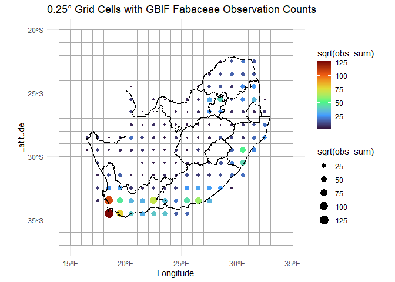
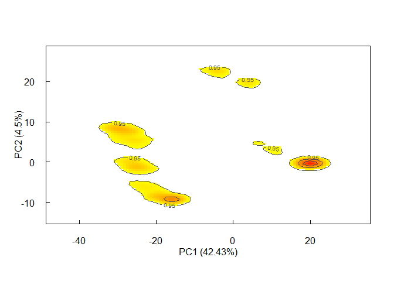
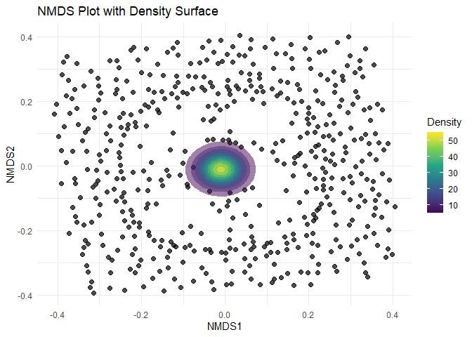

- [**`invasimapr`**: A Novel Framework to visualise trait dispersion and assess invasibility](#invasimapr)
  - [1. Introduction](#introduction)
    - [1.1. Invasion Fitness and Invasibility](#invasion-fitness-and-invasibility)
    - [1.2. Overview of the **`invasimapr`** R package](#overview-of-the-invasimapr-r-package)
  - [2. Workflow and Step-by-Step Tutorial](#workflow-and-step-by-step-tutorial)
    - [2.1. Install and load **`invasimapr`**](#install-and-load-invasimapr)
    - [2.2. Install and load libraries](#install-and-load-libraries)
    - [2.3. Setup environment and load functions](#setup-environment-and-load-functions)
    - [2.4. Data Access and Preparation](#data-access-and-preparation)
      - [2.4.1. Species Occurrence Data with `get_occurrence_data`](#species-occurrence-data-with-get_occurrence_data)
      - [2.4.2. Data formatting with `format_df`](#data-formatting-with-format_df)
      - [2.4.3. Generate Spatial Grids with `generate_grid`](#generate-spatial-grids-with-generate_grid)
      - [2.4.4. Environmental data with `get_enviro_data`](#environmental-data-with-get_enviro_data)
      - [2.4.5. Species Traits Data with `process_site_sp_trait`](#species-traits-data-with-process_site_sp_trait)
    - [2.5. Functional Dissimilarity and Community Trait Profiles](#functional-dissimilarity-and-community-trait-profiles)
    - [2.6. Interaction Strength with `r()` and `alpha()`](#interaction-strength-with-r()-and-alpha())
    - [2.7. Invasiveness with `inv()`](#invasiveness-with-inv())
      - [2.7.1. Parallel computation with `compute_invasibility_noLoop`](#parallel-computation-with-compute_invasibility_noloop)
      - [2.7.2. Convert into long format and calculate Invasion Percent](#convert-into-long-format-and-calculate-invasion-percent)
    - [2.8. Trait-Environment Relationship with `mvabund::traitglm`](#trait-environment-relationship-with-mvabundtraitglm)
    - [2.9. Predictive Modelling with `mvabund::predict.traitglm`](#predictive-modelling-with-mvabundpredicttraitglm)
  - [3. Conclusion](#conclusion)

<!-- README.md is generated from README.Rmd. Please edit that file -->
<!-- badges: start -->

[](https://mybinder.org/v2/gh/nithecs-biomath/RBasicPack/master?urlpath=rstudio)
[](https://lifecycle.r-lib.org/articles/stages.html#stable)
[](https://github.com/macSands/**%60invasimapr%60**/actions/workflows/test-coverage.yaml)
[](https://app.codecov.io/gh/macSands/**%60invasimapr%60**)
[](https://github.com/macSands/**%60invasimapr%60**/actions/workflows/R-CMD-check.yaml)

<!-- badges: end -->

------------------------------------------------------------------------

# **`invasimapr`**

## A Novel Framework to visualise trait dispersion and ability to assess invasibility

------------------------------------------------------------------------

**`invasimapr`** is an R package in development for quantifying and
mapping community–level invasion fitness and site-specific invasibility.
It links three data streams—species occurrences, functional traits, and
(in a later module) curated invasive-alien-species lists—to generate
spatial grids, extract and harmonise environmental and trait
information, visualise community trait profiles, and compute invasion
metrics such as interaction-strength matrices, invasion hotspots, and
maximum-invasiveness traits (MITs). By explicitly modelling how
trait–environment–competition relationships shape establishment success,
**`invasimapr`** delivers biologically informed predictions that support
evidence-based biodiversity management and policy planning.

------------------------------------------------------------------------

## 1. Introduction

Biological invasions—the establishment and spread of species outside
their native ranges—have become a leading driver of biodiversity loss,
ecosystem disruption, and economic damage worldwide. Whether an alien
species succeeds in a new habitat depends on a web of factors that
includes propagule pressure, species-specific traits, resident community
structure, and environmental conditions. Contemporary invasion theory
therefore emphasises trait-mediated ecological networks and invasion
fitness: alien species gain a foothold when their functional traits
confer competitive or facilitative advantages within the local
interaction web and environmental context (Hui et al., 2016; 2021;
2023).

**`invasimapr`** is being developed to turn this theory into a
reproducible analytic workflow. The R package couples species-occurrence
records and functional-trait databases with optional invasive-species
lists to build spatial grids, quantify trait centrality and dispersion,
estimate interaction-strength matrices, and calculate site-level
invasibility and maximum-invasiveness traits. Its outputs—maps of
invasion hotspots, trait-specific risk factors, and community
openness—provide biologically informed predictions of where invasions
are most likely to occur and which traits drive them. By integrating
traits, propagule pressure, and environmental context in a single
pipeline, **`invasimapr`** aims to equip researchers and policy-makers
with a transparent, scalable tool for anticipating and managing
biological invasions.

------------------------------------------------------------------------

### 1.1. Invasion Fitness and Invasibility

Invasion fitness and invasibility are key concepts in invasion ecology.
Invasion fitness captures an species’ ability to establish, persist, and
spread within a new community, while invasibility is a property of the
receiving community that indicates how “open” it is to new colonizers.
Both concepts are interconnected and can be explored through
trait-mediated interactions within ecological networks (Hui et al.,
2016). Invasion fitness has been defined as a dynamic, density-dependent
demographic performance measure, while invasibility reflects the
availability of opportunity niches within a community’s trait space (Hui
et al., 2021). These definitions highlight the eco-evolutionary
feedbacks that modulate invasion dynamics. The workflow described in
this milestone integrates several data-driven elements to quantify and
visualize invasion fitness and invasibility:

• Species Occurrence Data: Provides a spatial snapshot of where
different species—both native and alien—are present, serving as a
baseline for estimating community composition and distribution. •
Species Traits: Links species’ functional characteristics to their
ecological interactions. By calculating trait-based interaction
strengths, we can infer competitive dynamics and resource use. •
Community Trait Profile: Visualizes the range of trait values within a
community, identifying unoccupied or heavily populated trait regions
that influence invasion success. • Interaction Strength Matrices:
Reflect how trait similarity modulates competition between alien and
resident species, revealing the combinations of traits that enhance or
hinder invasiveness.

By leveraging these elements, the workflow produces regional maps of
invasibility that pinpoint areas most susceptible to invasion pressure.
These insights, grounded in trait-based ecological frameworks, provide a
robust theoretical foundation for prioritizing management interventions
to mitigate invasion risks (Hui et al., 2023).

------------------------------------------------------------------------

### 1.2. Overview of the **`invasimapr`** R package

**`invasimapr`** is an R package under development that consolidates the
above workflow steps into a cohesive, reproducible toolkit. The package
is designed with flexibility in mind, allowing users to integrate local
or global data sources, adapt trait-based models to diverse taxonomic
groups, and scale computational analyses from small study regions to
continental extents.

Key Deliverables • Interaction Strength Matrices: Quantitative depiction
of how resident species compete with potential invaders, derived from
trait similarities and dissimilarities. • Community Trait Profiles:
Graphical summaries of a community’s functional structure, helping users
quickly identify potential ecological “gaps” that might be exploited by
invaders. • Invasion Fitness Surface: Spatial predictions showing
variation in invasion success across a landscape, identifying hotspots
of potential impact on ecosystem services and biodiversity. • Regional
Invasibility Maps: Spatial outlines of communities most prone to
successful invasion, illuminating the links between species’ functional
traits and local environmental conditions.

Ultimately, **`invasimapr`** aims to empower researchers, practitioners,
and policymakers by providing actionable insights on how specific
trait-environment interactions drive invasion risks. Whether used to
forecast future invasion scenarios or to validate ongoing control
measures, the package will offer an evidence-based platform that
enhances decision-making for biodiversity protection.

------------------------------------------------------------------------

## 2. Workflow and Step-by-Step Tutorial

Below we present **`invasimapr`**, an R-based workflow designed to
streamline the mapping and analysis of invasion processes. This
step-by-step pipeline integrates species occurrence records,
environmental variables, and trait information to quantify invasibility
and identify key drivers of biological invasions. By combining data
preparation, distance-based analyses, dimension reduction, and
trait–environment modelling, **`invasimapr`** provides a reproducible
framework for researchers aiming to better understand how species traits
interact with environmental conditions to shape invasion outcomes.

------------------------------------------------------------------------

### 2.1. Install and load **`invasimapr`**

Install and load the **`invasimapr`** package from GitHub, ensuring
all functions are available for use in the analysis workflow.

``` r
# install remotes if needed
# install.packages("remotes")
# remotes::install_github("macSands/invasimapr")
```

``` r
# Ensure the package is loaded when knitting
library(invasimapr)

# Make sure all the functions are loaded
devtools::load_all()
```

------------------------------------------------------------------------

### 2.2. Install and load libraries

To begin, ensure that all necessary libraries are installed and loaded.

``` r
library(ggplot2)
library(dplyr)
library(reshape2)
library(sf)
library(terra)
library(mvabund)
library(cluster)
library(vegan)
library(funspace)
library(parallel)
library(future.apply)
```

------------------------------------------------------------------------

### 2.3. Setup environment and load functions

Setup your environment by optimizing memory usage, setting up your
working directory, and loading essential functions from the
**`invasimapr`** package for retrieving and formatting occurrence and
environmental data, generating spatial grids, and performing subsequent
distance-based or trait–environment analyses (e.g.,
`get_occurrence_data`, `format_df`, `process_site_sp_trait`). In this
way, the workflow can seamlessly integrate data preparation, trait
analysis, and invasion modelling.

``` r
# Run garbage collection (gc) to free unused R memory 
gc(reset = TRUE)
#>           used  (Mb) gc trigger  (Mb) max used  (Mb)
#> Ncells 3950460 211.0    6761608 361.2  3950460 211.0
#> Vcells 6179660  47.2   12255594  93.6  6179660  47.2

# Set working directory
# setwd('X:/Your/Path')

# Load the following 10 functions
```

------------------------------------------------------------------------

### User-defined area of interest and grid resolution

Load the spatial boundary data for South Africa to serve as the
geographic reference for all subsequent biodiversity analyses and
visualizations.

``` r
# Read RSA shape file
rsa = sf::st_read('inst/extdata/rsa.shp')
#> Reading layer `rsa' from data source 
#>   `D:\Methods\R\myR_Packages\myCompletePks\invasimapr\inst\extdata\rsa.shp' 
#>   using driver `ESRI Shapefile'
#> Simple feature collection with 11 features and 8 fields
#> Geometry type: MULTIPOLYGON
#> Dimension:     XY
#> Bounding box:  xmin: 16.45189 ymin: -34.83417 xmax: 32.94498 ymax: -22.12503
#> Geodetic CRS:  WGS 84

# Define your resolution and create mask to use later
res = 0.5 # 0.5 degrees is roughly 55km

# Convert to a terra vector
rsa_vect = vect(rsa)

# Create an empty raster over RSA at your desired resolution
grid = rast(rsa_vect, resolution = res, crs = crs(rsa_vect))
values(grid) = 1   # fill with dummy values

# Mask everything outside the RSA boundary
grid_masked = mask(grid, rsa_vect)
```

------------------------------------------------------------------------

### 2.4. Data Access and Preparation

This section focuses on automating the retrieval and pre-processing of
core data, including species occurrence, species traits and
environmental variables. Functions described below, automate access and
prepare species, trait and environment data to support downstream
invasibility assessments.

#### 2.4.1. Species Occurrence Data with `get_occurrence_data`

Use get_occurrence_data to automates the retrieval and preprocessing of
species occurrence data from multiple sources, including:

1)  local databases,
2)  the Global Biodiversity Information Facility (GBIF), and
3)  species occurrence cubes from B3 (specification) \[*work in
    progress*\].

The function assembles data on species distributions across specified
taxonomic groups and regions, producing presence-absence or abundance
matrices that quantify species co-occurrence within locations.

``` r
# Imports species occurrence data from local files, data frames, or GBIF sources
fab_data = get_occurrence_data(data = 'inst/extdata/gbif_fabaceae_0038785-241126133413365.csv', # gbif_fabaceae_0038785-241126133.csv
                                source_type = 'local_csv',
                                sep = '\t', # Default: ','
                                download_dir = tempdir())

# fab_data = get_occurrence_data(data = 'inst/extdata/site_sp_pa_long.csv',
#                                 source_type = 'local_csv',
#                                 download_dir = tempdir())

# Check column names of `fab_data` data.frame
names(fab_data)
#>  [1] "gbifID"                           "datasetKey"                      
#>  [3] "occurrenceID"                     "kingdom"                         
#>  [5] "phylum"                           "class"                           
#>  [7] "order"                            "family"                          
#>  [9] "genus"                            "species"                         
#> [11] "infraspecificEpithet"             "taxonRank"                       
#> [13] "scientificName"                   "verbatimScientificName"          
#> [15] "verbatimScientificNameAuthorship" "countryCode"                     
#> [17] "locality"                         "stateProvince"                   
#> [19] "occurrenceStatus"                 "individualCount"                 
#> [21] "publishingOrgKey"                 "y"                               
#> [23] "x"                                "coordinateUncertaintyInMeters"   
#> [25] "coordinatePrecision"              "elevation"                       
#> [27] "elevationAccuracy"                "depth"                           
#> [29] "depthAccuracy"                    "eventDate"                       
#> [31] "day"                              "month"                           
#> [33] "year"                             "taxonKey"                        
#> [35] "speciesKey"                       "basisOfRecord"                   
#> [37] "institutionCode"                  "collectionCode"                  
#> [39] "catalogNumber"                    "recordNumber"                    
#> [41] "identifiedBy"                     "dateIdentified"                  
#> [43] "license"                          "rightsHolder"                    
#> [45] "recordedBy"                       "typeStatus"                      
#> [47] "establishmentMeans"               "lastInterpreted"                 
#> [49] "mediaType"                        "issue"                           
#> [51] "site_id"                          "pa"
head(fab_data)
#>      gbifID                           datasetKey occurrenceID kingdom
#> 1 922193121 6ac3f774-d9fb-4796-b3e9-92bf6c81c084              Plantae
#> 2 922192413 6ac3f774-d9fb-4796-b3e9-92bf6c81c084              Plantae
#> 3 921474501 6ac3f774-d9fb-4796-b3e9-92bf6c81c084              Plantae
#> 4 920335900 6ac3f774-d9fb-4796-b3e9-92bf6c81c084              Plantae
#> 5 920205876 6ac3f774-d9fb-4796-b3e9-92bf6c81c084              Plantae
#> 6 920205872 6ac3f774-d9fb-4796-b3e9-92bf6c81c084              Plantae
#>         phylum         class   order   family     genus                species
#> 1 Tracheophyta Magnoliopsida Fabales Fabaceae Lessertia   Lessertia frutescens
#> 2 Tracheophyta Magnoliopsida Fabales Fabaceae Lessertia   Lessertia frutescens
#> 3 Tracheophyta Magnoliopsida Fabales Fabaceae   Dipogon       Dipogon lignosus
#> 4 Tracheophyta Magnoliopsida Fabales Fabaceae   Albizia Albizia tanganyicensis
#> 5 Tracheophyta Magnoliopsida Fabales Fabaceae Senegalia   Senegalia nigrescens
#> 6 Tracheophyta Magnoliopsida Fabales Fabaceae Vachellia     Vachellia tortilis
#>   infraspecificEpithet taxonRank
#> 1                        SPECIES
#> 2                        SPECIES
#> 3                        SPECIES
#> 4                        SPECIES
#> 5                        SPECIES
#> 6                        SPECIES
#>                                      scientificName verbatimScientificName
#> 1 Lessertia frutescens (L.) Goldblatt & J.C.Manning   Lessertia frutescens
#> 2 Lessertia frutescens (L.) Goldblatt & J.C.Manning   Lessertia frutescens
#> 3                      Dipogon lignosus (L.) Verdc.       Dipogon lignosus
#> 4                   Albizia tanganyicensis Baker f. Albizia tanganyicensis
#> 5                           Acacia nigrescens Oliv.      Acacia nigrescens
#> 6                   Acacia tortilis (Forssk.) Hayne        Acacia tortilis
#>   verbatimScientificNameAuthorship countryCode
#> 1                                           ZA
#> 2                                           ZA
#> 3                                           ZA
#> 4                                           ZA
#> 5                                           ZA
#> 6                                           ZA
#>                             locality stateProvince occurrenceStatus
#> 1 Oudtshoorn und Umgebung, Südafrika                        PRESENT
#> 2                           Hermanus                        PRESENT
#> 3           Fernkloof Nature Reserve                        PRESENT
#> 4              Masebe Nature Reserve                        PRESENT
#> 5                UTM50_36J_0350_7200                        PRESENT
#> 6                UTM50_36J_0350_7200                        PRESENT
#>   individualCount                     publishingOrgKey         y        x
#> 1              NA bb646dff-a905-4403-a49b-6d378c2cf0d9 -33.59240 22.20197
#> 2              NA bb646dff-a905-4403-a49b-6d378c2cf0d9 -34.42086 19.24410
#> 3              NA bb646dff-a905-4403-a49b-6d378c2cf0d9 -34.39338 19.26590
#> 4              NA bb646dff-a905-4403-a49b-6d378c2cf0d9 -23.64735 28.55587
#> 5              NA bb646dff-a905-4403-a49b-6d378c2cf0d9 -25.08560 31.76047
#> 6              NA bb646dff-a905-4403-a49b-6d378c2cf0d9 -25.08560 31.76047
#>   coordinateUncertaintyInMeters coordinatePrecision elevation elevationAccuracy
#> 1                           250                  NA        NA                NA
#> 2                           250                  NA        NA                NA
#> 3                           250                  NA        NA                NA
#> 4                           250                  NA        NA                NA
#> 5                           250                  NA        NA                NA
#> 6                           250                  NA        NA                NA
#>   depth depthAccuracy        eventDate day month year taxonKey speciesKey
#> 1    NA            NA 2012-10-26T00:00  26    10 2012  5633333    5633333
#> 2    NA            NA 2012-10-14T00:00  14    10 2012  5633333    5633333
#> 3    NA            NA 2012-10-14T00:00  14    10 2012  5349965    5349965
#> 4    NA            NA 2003-07-11T00:00  11     7 2003  2973309    2973309
#> 5    NA            NA 2011-12-12T00:00  12    12 2011  2979282    3795961
#> 6    NA            NA 2011-12-12T00:00  12    12 2011  2979907    3974700
#>       basisOfRecord institutionCode collectionCode catalogNumber recordNumber
#> 1 HUMAN_OBSERVATION     naturgucker    naturgucker     -61325468             
#> 2 HUMAN_OBSERVATION     naturgucker    naturgucker   -1060906812             
#> 3 HUMAN_OBSERVATION     naturgucker    naturgucker    1059867205             
#> 4 HUMAN_OBSERVATION     naturgucker    naturgucker    1639100266             
#> 5 HUMAN_OBSERVATION     naturgucker    naturgucker     312886081             
#> 6 HUMAN_OBSERVATION     naturgucker    naturgucker    1703557589             
#>   identifiedBy dateIdentified   license rightsHolder recordedBy typeStatus
#> 1                             CC_BY_4_0               591374253         NA
#> 2                             CC_BY_4_0               591374253         NA
#> 3                             CC_BY_4_0               591374253         NA
#> 4                             CC_BY_4_0              1647598034         NA
#> 5                             CC_BY_4_0               794562383         NA
#> 6                             CC_BY_4_0               794562383         NA
#>   establishmentMeans          lastInterpreted  mediaType
#> 1                    2024-03-15T23:18:40.302Z           
#> 2                    2024-03-15T23:22:45.189Z StillImage
#> 3                    2024-03-15T23:26:31.963Z StillImage
#> 4                    2024-03-15T23:27:29.743Z           
#> 5                    2024-03-15T23:24:44.663Z           
#> 6                    2024-03-15T23:22:16.768Z           
#>                                                                                                       issue
#> 1 COORDINATE_ROUNDED;GEODETIC_DATUM_ASSUMED_WGS84;CONTINENT_DERIVED_FROM_COORDINATES;MULTIMEDIA_URI_INVALID
#> 2                        COORDINATE_ROUNDED;GEODETIC_DATUM_ASSUMED_WGS84;CONTINENT_DERIVED_FROM_COORDINATES
#> 3                        COORDINATE_ROUNDED;GEODETIC_DATUM_ASSUMED_WGS84;CONTINENT_DERIVED_FROM_COORDINATES
#> 4 COORDINATE_ROUNDED;GEODETIC_DATUM_ASSUMED_WGS84;CONTINENT_DERIVED_FROM_COORDINATES;MULTIMEDIA_URI_INVALID
#> 5 COORDINATE_ROUNDED;GEODETIC_DATUM_ASSUMED_WGS84;CONTINENT_DERIVED_FROM_COORDINATES;MULTIMEDIA_URI_INVALID
#> 6 COORDINATE_ROUNDED;GEODETIC_DATUM_ASSUMED_WGS84;CONTINENT_DERIVED_FROM_COORDINATES;MULTIMEDIA_URI_INVALID
#>   site_id pa
#> 1       1  1
#> 2       2  1
#> 3       3  1
#> 4       4  1
#> 5       5  1
#> 6       5  1
```

------------------------------------------------------------------------

#### 2.4.2. Data formatting with `format_df`

To analyse biodiversity data effectively, it is necessary to standardize
and reshape datasets into specific formats, each serving a distinct
purpose.

• `site_xy`: Holds spatial coordinates of sampled sites. • `site_sp`:
Site-by-species matrix for biodiversity assessments. • `sp_trait`:
Species-specific trait data essential for understanding how species
traits influence interactions. • `site_env`: Site-specific environmental
data provides contextual information about the conditions at each study
location.

First use `format_df` to standardise and reshape biodiversity data into
long or wide formats. It automatically identifies key columns (e.g.,
coordinates, species, and values), assigns missing site IDs, and
reformats the data for analysis. Outputs include a cleaned dataset and
species-site matrices for further processing.

``` r
# Run `format_df` to format data.frame
fab_format = format_df(data = fab_data,
                       species_col = 'verbatimScientificName',#sp_name
                       value_col = 'pa',
                       format = 'long')

# Check results – list structure
str(fab_format, max.level = 1)
#> List of 2
#>  $ site_obs:'data.frame':    82204 obs. of  11 variables:
#>  $ site_sp :'data.frame':    76832 obs. of  1779 variables:

# Check results – first few lines of ‘site_obs’ data.frame
head(fab_format$site_obs)
#>   site_id        x         y                species value coordUnM recordedBy
#> 1       1 22.20197 -33.59240   Lessertia frutescens     1      250  591374253
#> 2       2 19.24410 -34.42086   Lessertia frutescens     1      250  591374253
#> 3       3 19.26590 -34.39338       Dipogon lignosus     1      250  591374253
#> 4       4 28.55587 -23.64735 Albizia tanganyicensis     1      250 1647598034
#> 5       5 31.76047 -25.08560      Acacia nigrescens     1      250  794562383
#> 6       5 31.76047 -25.08560        Acacia tortilis     1      250  794562383
#>          eventDate day month year
#> 1 2012-10-26T00:00  26    10 2012
#> 2 2012-10-14T00:00  14    10 2012
#> 3 2012-10-14T00:00  14    10 2012
#> 4 2003-07-11T00:00  11     7 2003
#> 5 2011-12-12T00:00  12    12 2011
#> 6 2011-12-12T00:00  12    12 2011

# Check results – first few lines and columns of ‘site_sp’ data.frame
head(fab_format$site_sp[,1:6])
#>   site_id        x         y Abrus laevigatus Abrus precatorius
#> 1       1 22.20197 -33.59240                0                 0
#> 2       2 19.24410 -34.42086                0                 0
#> 3       3 19.26590 -34.39338                0                 0
#> 4       4 28.55587 -23.64735                0                 0
#> 5       5 31.76047 -25.08560                0                 0
#> 6       6 31.61720 -25.16298                0                 0
#>   Abrus precatorius africanus
#> 1                           0
#> 2                           0
#> 3                           0
#> 4                           0
#> 5                           0
#> 6                           0
```

------------------------------------------------------------------------

#### 2.4.3. Generate Spatial Grids with `generate_grid`

Then use generate_grid to divide the study area, derived from the
geographic extent of the occurrence data above, into grids of
user-defined resolution, creating a spatial grid over a specified
geographic extent. It assigns unique grid IDs to points and summarizes
selected data columns within each grid cell. The function outputs a
raster grid, grid polygons for visualization, and a data frame
summarizing the contents of each grid cell, including totals and
centroids. It is particularly useful for aggregating spatial data, such
as biodiversity observations, into predefined spatial units for further
analysis.

``` r
# Now run `generate_grid` to group observations by specific grid
# *For now only geographic projection (EPSG:4326) works
grid_list = generate_grid(data = fab_format$site_sp,
                          x_col = "x",       # Column for x-coordinates
                          y_col = "y",       # Column for y-coordinates
                          grid_size = 1,    # Grid size in degrees
                          sum_col_range = 4:ncol(fab_format$site_sp),  # Columns to summarize
                          crs_epsg = 4326) # Set projection*  

# Optional: Make separate data objects from returned list
grid_sf = grid_list$grid_sf # Grid polygons
grid_sp = grid_list$grid_sp # Summarised data.frame by new ‘grid_id’

# Check first few rows ‘grid_sp’ data.frame
head(grid_sp[,1:10])
#>     grid_id    x     y obs_sum Abrus laevigatus Abrus precatorius
#> 100     100 29.5 -24.5      56                0                 0
#> 101     101 30.5 -24.5     546                2                 3
#> 102     102 31.5 -24.5     719                0                 3
#> 112     112 20.5 -25.5      82                0                 0
#> 114     114 22.5 -25.5      19                0                 0
#> 115     115 23.5 -25.5       3                0                 0
#>     Abrus precatorius africanus Acacia Acacia acinacea Acacia adunca
#> 100                           0      0               0             0
#> 101                           1      0               0             0
#> 102                           1      0               0             0
#> 112                           0      0               0             0
#> 114                           0      0               0             0
#> 115                           0      0               0             0

# Plot results as grid centroids weighted by total observation counts
ggplot() +
  # Add 0.25° grid layer
  geom_sf(data = grid_sf, fill = NA, color = "darkgrey", alpha = 0.5) +
  # Add grid centroids as points, size and colour by sqrt of observation counts
  geom_point(data=grid_sp, aes(x=x,y=y,size=sqrt(obs_sum),color=sqrt(obs_sum))) +
  scale_size_continuous(range = c(0.5, 5)) +  
  # Option: Use ‘turbo’ colour range
  scale_color_viridis_c(option = "turbo") + 
  # Add South African provincial boundary layer
  geom_sf(data = rsa, fill = NA, color = "black", alpha = 1) +
  # Set axis labels and plot title
  labs(
    title = "0.25° Grid Cells with GBIF Fabaceae Observation Counts",
    x = "Longitude",
    y = "Latitude") +
  theme_minimal()
```



------------------------------------------------------------------------

#### 2.4.4. Environmental data with `get_enviro_data`

Use `get_enviro_data` to retrieve environmental data for spatial points
derived from get_occurrence_data (actual observation coordinates) and/or
`generate_grid` (grid centroids), by either downloading it from sources
like `WorldClim` or `SoilGrids` via the
[`geodata`](https://ouicodedata.com/posts/worldclim-with-r/) package, or
provide path to local raster data. The function generates an area of
interest (AOI) around the input points, adds a pre-defined buffer area,
and extracts the selected environmental variables for these locations.
If no data (NA) values are returned for some outlier points, the
function will interpolate these missing values using the average of
surrounding non-NA records. The output includes a cropped raster of the
environmental data, spatial points as an `sf` object, and a combined
data frame of the input data with extracted environmental variables,
enabling spatial analyses of environmental conditions. Future data
source options plan to include i) CHELSA via
[`climenv`](https://chelsa-climate.org/), ii) Google Earth Engine via
[`rgee`](https://r-spatial.github.io/rgee/), and iii) additional
biodiversity data via
[`mapme`](https://mapme-initiative.github.io/mapme.%20biodiversity/index.html).

``` r
# First set output directory
output_path = 'inst/extdata'

# Run `get_enviro_data` to download and extract environmental variables
# Current ‘source’ options include 'geodata' and 'local'
# For 'geodata' source, variables 'var' include: bioclim - 'bio', elevation - 'elev', human development footprint - 'footprint', population numbers - 'population', world soil classification - 'soil_world'
# Resolution 'res' is needed for 'worldclim_global','elev', 'population'
enviro_list = get_enviro_data(data = grid_sp,
                            buffer_km = 1,
                            source = "geodata",
                            var = "bio", 
                            res = 2.5, 
                            path = output_path)

# Check results – Returns list of 3 objects
str(enviro_list, max.level = 1)
#> List of 3
#>  $ env_rast:S4 class 'SpatRaster' [package "terra"]
#>  $ sites_sf:Classes 'sf' and 'data.frame':   144 obs. of  2 variables:
#>   ..- attr(*, "sf_column")= chr "geometry"
#>   ..- attr(*, "agr")= Factor w/ 3 levels "constant","aggregate",..: NA
#>   .. ..- attr(*, "names")= chr "grid_id"
#>  $ env_df  :'data.frame':    144 obs. of  23 variables:

# Optional: Rename the columns to something more descriptive
names_env = c("temp_mean", "mdr", "iso", "temp_sea", "temp_max",
                    "temp_min", "temp_rang","temp_wetQ","temp_dryQ", "temp_warmQ",
                    "temp_coldQ", "rain_mean","rain_wet", "rain_dry", "rain_sea",
                    "rain_wetQ", "rain_dryQ","rain_warmQ", "rain_coldQ")

names(enviro_list$env_df) = c('grid_id','x','y','ID',names_env)
names(enviro_list$env_rast) = names_env

# Check results – SpatRaster with layers for each environmental variable
enviro_list$env_rast
#> class       : SpatRaster 
#> dimensions  : 294, 386, 19  (nrow, ncol, nlyr)
#> resolution  : 0.04166667, 0.04166667  (x, y)
#> extent      : 16.45833, 32.54167, -34.66667, -22.41667  (xmin, xmax, ymin, ymax)
#> coord. ref. : lon/lat WGS 84 (EPSG:4326) 
#> source(s)   : memory
#> names       : temp_mean,       mdr,      iso, temp_sea, temp_max, temp_min, ... 
#> min values  :   5.07650,  5.891667, 45.16353, 143.0743,   14.748,   -6.412, ... 
#> max values  :  24.89817, 18.710333, 67.80205, 704.0901,   38.812,   13.600, ...

# Check results – Simple feature collection of grid centroids  
enviro_list$sites_sf
#> Simple feature collection with 144 features and 1 field
#> Geometry type: POINT
#> Dimension:     XY
#> Bounding box:  xmin: 16.5 ymin: -34.5 xmax: 32.5 ymax: -22.5
#> Geodetic CRS:  WGS 84
#> First 10 features:
#>     grid_id           geometry
#> 100     100 POINT (29.5 -24.5)
#> 101     101 POINT (30.5 -24.5)
#> 102     102 POINT (31.5 -24.5)
#> 112     112 POINT (20.5 -25.5)
#> 114     114 POINT (22.5 -25.5)
#> 115     115 POINT (23.5 -25.5)
#> 117     117 POINT (25.5 -25.5)
#> 118     118 POINT (26.5 -25.5)
#> 119     119 POINT (27.5 -25.5)
#> 120     120 POINT (28.5 -25.5)


# Check results – data.frame with unique ‘grid_id’ and columns for each environmental variable
head(enviro_list$env_df[,1:8])
#>     grid_id    x     y ID temp_mean      mdr      iso temp_sea
#> 100     100 29.5 -24.5  1  20.44683 15.44967 56.56732 437.3889
#> 101     101 30.5 -24.5  2  18.07767 12.13000 58.50858 326.2116
#> 102     102 31.5 -24.5  3  21.56517 13.71767 61.90282 301.8622
#> 112     112 20.5 -25.5  4  20.25667 17.85600 53.50593 589.6021
#> 114     114 22.5 -25.5  5  21.81400 17.23600 56.17260 497.1898
#> 115     115 23.5 -25.5  6  21.60333 17.11533 56.79365 478.9305
```

------------------------------------------------------------------------

#### 2.4.5. Species Traits Data with `process_site_sp_trait`

This function integrates trait data from the
[TRY](https://www.try-db.org/TryWeb/Home.php) database (Kattge et
al. 2020), a global collaborative initiative that consolidates and
standardizes plant trait data from multiple sources, with site-level
species observations, returning a concise set of data structures for
further ecological analyses. First, it imports and checks the provided
TRY data (either from a file path or an existing data frame). It then
uses fuzzy string matching to reconcile species names in the
site-by-observations table with those in the TRY dataset. Next, trait
values are extracted, cleaned (e.g., converting character values to
numeric), and pivoted into a “wide” format. Finally, the function
filters out unmatched species, retrieves spatial coordinates, and
returns a list containing merged traits, filtered site-by-species data,
and site coordinates. Optional outputs (via appendix = TRUE) include
additional intermediate objects like the raw species-by-trait matrix,
trait name lookups, and the species mapping table.
`process_site_sp_trait` unites external trait data (from the TRY
database) with site-level species observations to produce a dataset
ready for downstream ecological analyses. The steps are as follows: 1.
Import and Validate: Uses `rtry::rtry_import` to read in TRY data
(either from a file path or data frame) and ensures required columns are
present. 2. Fuzzy Match Species: Uses `fuzzyjoin::stringdist_inner_join`
to reconcile species names between the site observations (grid_obs) and
the TRY dataset. 3. Pivot Trait Data: Cleans numeric values, groups them
by species and trait, and transforms data into a “wide” matrix of
species by traits. 4. Filter by Site: Matches only those species listed
in grid_sp (via sp_cols) and obtains an updated site-by-species matrix
along with corresponding spatial coordinates. 5. Return Outputs:
Provides a concise list containing: o `sp_traits`: The final
species-by-traits data. o `site_sp`: A filtered site-by-species matrix.
o `site_xy`: Spatial coordinates for these sites. o Optional components
(if appendix = TRUE) include the raw species-by-trait matrix, trait name
lookups, and the species mapping table.

``` r
# First use `data.table::fread` to read in traits tables from TRYS database
species_trait = fread("inst/extdata/try_data_37981.txt", sep = "\t", quote="")

# Check first few rows of `species_trait` data.frame
head(species_trait[,7:11])
#>          AccSpeciesName ObservationID ObsDataID TraitID           TraitName
#>                  <char>         <int>     <int>   <int>              <char>
#> 1: Abelia grandiflora_x         14335    426753      37 Leaf phenology type
#> 2: Abelia grandiflora_x         14335    426754      NA                    
#> 3:           Abies alba         14336    426760      37 Leaf phenology type
#> 4:           Abies alba         14336    426761      NA                    
#> 5:       Abies amabilis         14337    426767      37 Leaf phenology type
#> 6:       Abies amabilis         14337    426768      NA

# Run `process_site_sp_trait` to get `species_traits` and other data.frames
spp_traits_list = process_site_sp_trait(
                          # Full TRY traits table
                try_data = species_trait, 
                          # Unfiltered site-by-observations table (long format)
                grid_obs = grid_list$grid_obs, 
                          # Unfiltered site-by-species table
                grid_sp = grid_list$grid_sp, 
                          # Species column range unfiltered site-by-species table
                sp_cols = 5:ncol(grid_list$grid_sp), 
                appendix = FALSE
)

# Check results – structure of ‘spp_traits_list’
str(spp_traits_list)
#> List of 5
#>  $ sp_traits      : tibble [1,019 × 24] (S3: tbl_df/tbl/data.frame)
#>   ..$ species : chr [1:1019] "Abrus laevigatus" "Abrus precatorius" "Acacia acinacea" "Acacia adunca" ...
#>   ..$ trait_1 : num [1:1019] NA NA NA NA NA 5 5 NA 1.5 4 ...
#>   ..$ trait_2 : num [1:1019] 49.25 102.4 8.8 11.51 9.61 ...
#>   ..$ trait_3 : num [1:1019] NA NA NA NA NA NA NA NA NA NA ...
#>   ..$ trait_4 : num [1:1019] NA NA NA NA NA NA NA NA NA 180 ...
#>   ..$ trait_5 : num [1:1019] NA NA NA NA NA NA NA NA NA NA ...
#>   ..$ trait_6 : num [1:1019] NA NA NA NA NA NA NA NA NA NA ...
#>   ..$ trait_7 : num [1:1019] NA NA NA NA NA 30 NA NA NA NA ...
#>   ..$ trait_8 : num [1:1019] NA 100 NA NA NA NA NA NA 91 90 ...
#>   ..$ trait_9 : num [1:1019] NA NA NA NA NA NA NA NA NA NA ...
#>   ..$ trait_10: num [1:1019] NA NA NA NA NA NA NA NA NA NA ...
#>   ..$ trait_11: num [1:1019] NA NA NA NA NA NA NA NA NA NA ...
#>   ..$ trait_12: num [1:1019] NA NA NA NA NA NA NA NA NA 3 ...
#>   ..$ trait_13: num [1:1019] NA 0 1 1 NA NA 1 NA 1 1 ...
#>   ..$ trait_14: num [1:1019] NA 54.9 6.74 NA NA ...
#>   ..$ trait_15: num [1:1019] NA NA NA NA NA NA NA NA NA NA ...
#>   ..$ trait_16: num [1:1019] NA NA NA NA NA NA NA NA NA NA ...
#>   ..$ trait_17: num [1:1019] NA NA NA NA NA ...
#>   ..$ trait_18: num [1:1019] NA NA NA NA NA NA NA NA NA NA ...
#>   ..$ trait_19: num [1:1019] NA 0.63 NA NA NA ...
#>   ..$ trait_20: num [1:1019] NA NA 0.774 NA NA ...
#>   ..$ trait_21: num [1:1019] NA NA NA NA NA 3 NA NA 8 NA ...
#>   ..$ trait_22: num [1:1019] NA NA NA NA NA 0.8 NA NA 5 NA ...
#>   ..$ trait_23: num [1:1019] NA NA NA NA NA NA NA NA NA NA ...
#>  $ site_sp        : tibble [143 × 1,023] (S3: tbl_df/tbl/data.frame)
#>   ..$ grid_id                             : chr [1:143] "100" "101" "102" "112" ...
#>   ..$ x                                   : num [1:143] 29.5 30.5 31.5 20.5 22.5 23.5 25.5 26.5 27.5 28.5 ...
#>   ..$ y                                   : num [1:143] -24.5 -24.5 -24.5 -25.5 -25.5 -25.5 -25.5 -25.5 -25.5 -25.5 ...
#>   ..$ obs_sum                             : num [1:143] 56 546 719 82 19 3 24 44 922 1680 ...
#>   ..$ Argyrolobium wilmsii                : num [1:143] 3 0 0 0 0 0 0 0 0 0 ...
#>   ..$ Burkea africana                     : num [1:143] 1 0 0 0 0 0 0 6 67 73 ...
#>   ..$ Ceratonia siliqua                   : num [1:143] 1 0 0 0 0 0 0 1 1 29 ...
#>   ..$ Chamaecrista absus                  : num [1:143] 1 0 2 0 0 0 0 0 0 0 ...
#>   ..$ Crotalaria burkeana                 : num [1:143] 1 1 1 0 0 0 0 0 0 0 ...
#>   ..$ Crotalaria damarensis               : num [1:143] 1 0 1 0 0 0 0 0 0 0 ...
#>   ..$ Delonix regia                       : num [1:143] 2 1 2 0 0 0 0 0 4 0 ...
#>   ..$ Dichrostachys cinerea               : num [1:143] 3 18 30 0 1 0 2 3 25 26 ...
#>   ..$ Eriosema nutans                     : num [1:143] 1 0 0 0 0 0 0 0 2 5 ...
#>   ..$ Indigofera daleoides                : num [1:143] 1 0 0 0 1 0 0 0 5 1 ...
#>   ..$ Libidibia ferrea                    : num [1:143] 2 1 0 0 0 0 0 0 0 11 ...
#>   ..$ Mundulea sericea                    : num [1:143] 1 8 6 0 0 0 0 3 40 58 ...
#>   ..$ Ormocarpum trichocarpum             : num [1:143] 3 7 5 0 0 0 0 0 0 0 ...
#>   ..$ Pearsonia cajanifolia               : num [1:143] 1 0 0 0 0 0 0 0 1 9 ...
#>   ..$ Peltophorum africanum               : num [1:143] 2 21 33 0 0 0 0 3 25 38 ...
#>   ..$ Schotia brachypetala                : num [1:143] 3 9 28 0 0 0 0 0 4 16 ...
#>   ..$ Senna didymobotrya                  : num [1:143] 1 6 3 0 0 0 0 0 0 4 ...
#>   ..$ Senna italica                       : num [1:143] 1 5 9 0 2 0 0 0 2 3 ...
#>   ..$ Senna occidentalis                  : num [1:143] 2 4 2 0 0 0 0 0 0 5 ...
#>   ..$ Senna spectabilis                   : num [1:143] 1 1 1 0 0 0 0 0 0 0 ...
#>   ..$ Sphenostylis angustifolia           : num [1:143] 1 2 0 0 0 0 0 0 43 44 ...
#>   ..$ Stylosanthes fruticosa              : num [1:143] 1 0 7 0 0 0 0 0 6 8 ...
#>   ..$ Vachellia erioloba                  : num [1:143] 1 1 0 38 1 0 5 3 5 7 ...
#>   ..$ Vachellia grandicornuta             : num [1:143] 1 0 0 0 0 0 0 0 0 0 ...
#>   ..$ Vachellia karroo                    : num [1:143] 5 4 4 2 0 0 3 3 57 122 ...
#>   ..$ Vachellia permixta                  : num [1:143] 1 0 0 0 0 0 0 0 0 0 ...
#>   ..$ Vachellia rehmanniana               : num [1:143] 1 0 0 0 0 0 0 0 0 0 ...
#>   ..$ Vachellia tortilis                  : num [1:143] 2 6 11 0 0 0 2 0 8 8 ...
#>   ..$ Abrus laevigatus                    : num [1:143] 0 2 0 0 0 0 0 0 1 2 ...
#>   ..$ Abrus precatorius                   : num [1:143] 0 3 3 0 0 0 0 0 0 2 ...
#>   ..$ Acacia dealbata                     : num [1:143] 0 2 0 0 0 0 0 0 0 3 ...
#>   ..$ Acacia decurrens                    : num [1:143] 0 1 0 0 0 0 0 0 1 11 ...
#>   ..$ Acacia mearnsii                     : num [1:143] 0 1 0 0 0 0 0 0 0 43 ...
#>   ..$ Acacia melanoxylon                  : num [1:143] 0 4 0 0 0 0 0 0 0 10 ...
#>   ..$ Adenopodia spicata                  : num [1:143] 0 3 0 0 0 0 0 0 0 0 ...
#>   ..$ Albizia anthelmintica               : num [1:143] 0 3 2 0 0 0 0 0 0 0 ...
#>   ..$ Albizia harveyi                     : num [1:143] 0 6 9 0 0 0 0 0 0 0 ...
#>   ..$ Albizia versicolor                  : num [1:143] 0 7 1 0 0 0 0 0 0 0 ...
#>   ..$ Argyrolobium pseudotuberosum        : num [1:143] 0 1 0 0 0 0 0 0 0 0 ...
#>   ..$ Argyrolobium robustum               : num [1:143] 0 1 0 0 0 0 0 0 0 0 ...
#>   ..$ Argyrolobium tomentosum             : num [1:143] 0 2 0 0 0 0 0 0 0 0 ...
#>   ..$ Argyrolobium transvaalense          : num [1:143] 0 1 0 0 0 0 0 0 0 0 ...
#>   ..$ Bauhinia galpinii                   : num [1:143] 0 7 13 0 0 0 0 0 0 1 ...
#>   ..$ Bauhinia tomentosa                  : num [1:143] 0 2 3 0 0 0 0 0 2 9 ...
#>   ..$ Bauhinia variegata                  : num [1:143] 0 9 0 0 0 0 0 0 7 47 ...
#>   ..$ Bolusanthus speciosus               : num [1:143] 0 4 30 0 0 0 0 0 1 15 ...
#>   ..$ Calpurnia aurea                     : num [1:143] 0 2 0 0 0 0 0 0 0 0 ...
#>   ..$ Chamaecrista mimosoides             : num [1:143] 0 2 3 0 0 0 0 0 5 9 ...
#>   ..$ Clitoria ternatea                   : num [1:143] 0 1 2 0 0 0 0 0 0 0 ...
#>   ..$ Colophospermum mopane               : num [1:143] 0 5 25 0 0 0 0 0 0 0 ...
#>   ..$ Cordyla africana                    : num [1:143] 0 3 2 0 0 0 0 0 0 0 ...
#>   ..$ Crotalaria capensis                 : num [1:143] 0 2 0 0 0 0 0 0 0 0 ...
#>   ..$ Crotalaria doidgeae                 : num [1:143] 0 11 2 0 0 0 0 0 0 0 ...
#>   ..$ Crotalaria monteiroi                : num [1:143] 0 1 0 0 0 0 0 0 0 0 ...
#>   ..$ Crotalaria pallida                  : num [1:143] 0 1 0 0 0 0 0 0 0 0 ...
#>   ..$ Crotalaria sphaerocarpa             : num [1:143] 0 1 0 0 0 0 0 0 0 1 ...
#>   ..$ Dalbergia armata                    : num [1:143] 0 26 1 0 0 0 0 0 0 0 ...
#>   ..$ Dalbergia melanoxylon               : num [1:143] 0 2 13 0 0 0 0 0 0 0 ...
#>   ..$ Dalbergia nitidula                  : num [1:143] 0 1 0 0 0 0 0 0 0 0 ...
#>   ..$ Decorsea galpinii                   : num [1:143] 0 2 0 0 0 0 0 0 0 0 ...
#>   ..$ Desmodium incanum                   : num [1:143] 0 1 0 0 0 0 0 0 0 0 ...
#>   ..$ Eriosema psoraleoides               : num [1:143] 0 2 1 0 0 0 0 0 0 3 ...
#>   ..$ Eriosema simulans                   : num [1:143] 0 1 0 0 0 0 0 0 0 0 ...
#>   ..$ Erythrina crista-galli              : num [1:143] 0 1 0 0 0 0 0 0 0 13 ...
#>   ..$ Erythrina humeana                   : num [1:143] 0 3 7 0 0 0 0 0 0 0 ...
#>   ..$ Erythrina lysistemon                : num [1:143] 0 16 5 0 0 0 0 0 23 37 ...
#>   ..$ Faidherbia albida                   : num [1:143] 0 5 1 0 0 0 0 0 0 0 ...
#>   ..$ Flemingia grahamiana                : num [1:143] 0 2 2 0 0 0 0 0 0 0 ...
#>   ..$ Hylodesmum repandum                 : num [1:143] 0 1 0 0 0 0 0 0 0 0 ...
#>   ..$ Indigofera filipes                  : num [1:143] 0 2 2 0 0 0 0 0 0 2 ...
#>   ..$ Indigofera hendecaphylla            : num [1:143] 0 1 0 0 0 0 0 0 0 0 ...
#>   ..$ Indigofera heterotricha             : num [1:143] 0 1 0 0 0 0 1 1 3 0 ...
#>   ..$ Indigofera hilaris                  : num [1:143] 0 1 0 0 0 0 0 0 6 14 ...
#>   ..$ Indigofera lydenburgensis           : num [1:143] 0 6 1 0 0 0 0 0 0 0 ...
#>   ..$ Indigofera oxalidea                 : num [1:143] 0 1 0 0 0 0 0 0 0 10 ...
#>   ..$ Indigofera oxytropis                : num [1:143] 0 1 0 0 0 0 0 0 26 5 ...
#>   ..$ Indigofera sanguinea                : num [1:143] 0 1 0 0 0 0 0 0 0 0 ...
#>   ..$ Indigofera spicata                  : num [1:143] 0 1 1 0 0 0 0 0 6 1 ...
#>   ..$ Indigofera tristoides               : num [1:143] 0 1 0 0 0 0 0 0 0 0 ...
#>   ..$ Kotschya parvifolia                 : num [1:143] 0 4 0 0 0 0 0 0 0 0 ...
#>   ..$ Lablab purpureus                    : num [1:143] 0 1 0 0 0 0 0 0 0 0 ...
#>   ..$ Leucaena leucocephala               : num [1:143] 0 2 0 0 0 0 0 0 1 8 ...
#>   ..$ Lotus discolor                      : num [1:143] 0 1 0 0 0 0 0 0 1 0 ...
#>   ..$ Mucuna pruriens                     : num [1:143] 0 1 0 0 0 0 0 0 0 0 ...
#>   ..$ Neonotonia wightii                  : num [1:143] 0 1 1 0 0 0 0 0 2 5 ...
#>   ..$ Ormocarpum kirkii                   : num [1:143] 0 3 0 0 0 0 0 0 0 0 ...
#>   ..$ Paraserianthes lophantha            : num [1:143] 0 1 0 0 0 0 0 0 0 0 ...
#>   ..$ Pearsonia aristata                  : num [1:143] 0 3 0 0 0 0 0 0 0 0 ...
#>   ..$ Pearsonia obovata                   : num [1:143] 0 2 0 0 0 0 0 0 0 0 ...
#>   ..$ Pearsonia sessilifolia              : num [1:143] 0 1 0 0 0 0 0 0 5 33 ...
#>   ..$ Pearsonia uniflora                  : num [1:143] 0 2 0 0 0 0 0 0 0 0 ...
#>   ..$ Philenoptera violacea               : num [1:143] 0 15 63 0 0 0 0 0 0 0 ...
#>   ..$ Psoralea affinis                    : num [1:143] 0 1 0 0 0 0 0 0 0 0 ...
#>   ..$ Pterocarpus angolensis              : num [1:143] 0 19 1 0 0 0 0 0 0 4 ...
#>   ..$ Pterocarpus rotundifolius           : num [1:143] 0 5 8 0 0 0 0 0 1 1 ...
#>   .. [list output truncated]
#>  $ site_xy        :'data.frame': 143 obs. of  3 variables:
#>   ..$ grid_id: chr [1:143] "100" "101" "102" "112" ...
#>   ..$ x      : num [1:143] 29.5 30.5 31.5 20.5 22.5 23.5 25.5 26.5 27.5 28.5 ...
#>   ..$ y      : num [1:143] -24.5 -24.5 -24.5 -25.5 -25.5 -25.5 -25.5 -25.5 -25.5 -25.5 ...
#>  $ traitname      :'data.frame': 23 obs. of  2 variables:
#>   ..$ TraitID  : chr [1:23] "trait_1" "trait_2" "trait_3" "trait_4" ...
#>   ..$ TraitName: chr [1:23] "Plant height vegetative" "Seed dry mass" "Dispersal syndrome" "Species tolerance to frost" ...
#>  $ species_mapping:'data.frame': 1090 obs. of  2 variables:
#>   ..$ species       : chr [1:1090] "Argyrolobium wilmsii" "Burkea africana" "Ceratonia siliqua" "Chamaecrista absus" ...
#>   ..$ AccSpeciesName: chr [1:1090] "Argyrolobium wilmsii" "Burkea africana" "Ceratonia siliqua" "Chamaecrista absus" ...

# Check results – dimensions of ‘sp_traits’, ‘site_sp’ and ‘site_xy’
dim(spp_traits_list$sp_traits)
#> [1] 1019   24
dim(spp_traits_list$site_sp)
#> [1]  143 1023
dim(spp_traits_list$site_xy)
#> [1] 143   3
```

------------------------------------------------------------------------

### 2.5. Functional Dissimilarity and Community Trait Profiles
In this step, the functional structure of species communities is defined using the following libraies and functions: with `cluster::daisy`; `funspace::funspace`; `stats::princomp` and `vegan::metaMDS`. 

Below the Gower distance metric and dissimilarity matrices are calculated to assess trait-based differences between species. Dissimilarity Matrix Calculation (Gower): A Gower distance matrix is computed using species traits. This matrix captures the dissimilarity in species traits, which is later used to quantify species interaction strength. A PCA-based trait space is then used to summarise the main axes of variation among species.

``` r
# Dissimilarity Matrix Calculation (Gower)
# Calculates pairwise dissimilarity between species based on traits (sbt) 
# Uses Gower distance >> handles mixed data types 
# (continuous, ordinal, categorical).
sbt = spp_traits_list$sp_traits
sbt$species = as.factor(sbt$species)
sbt_gower = as.matrix(cluster::daisy(sbt, metric = "gower", stand = FALSE))

# Performs Principal Component Analysis (PCA) on the Gower distance matrix. 
# By setting cor = TRUE, standardizes variables internally for PCA calculation
sbt_daisy_pca = princomp(sbt_gower, cor = TRUE)
```

Community Trait Profiles (CTP): CTPs are visualised using
funspace::funspace, which indicates how species traits are distributed
in the reduced space.

``` r
# Applies `funspace` to the PCA result to create a functional trait space. 
# Threshold = 0.95 ensures the first two principal components explain at 
# least 95% of trait variation.
sbt_daisy_pca_space = funspace::funspace(x = sbt_daisy_pca, PCs = c(1, 2), threshold = 0.95)
summary(sbt_daisy_pca_space)
#> 
#> Functional space based on a PCA with 1019 dimensions
#> Dimensions 1 and 2 are considered in analyses
#> 
#> Loadings:
#>      Comp.1 Comp.2 Comp.3 Comp.4 Comp.5 Comp.6 Comp.7 Comp.8 Comp.9 Comp.10
#> 1     0.956  0.271  0.061  0.062  0.012  0.036  0.005  0.005  0.013   0.000
#> 2     0.958  0.139 -0.159  0.080 -0.027 -0.102 -0.065  0.018 -0.009   0.000
#> 3     0.951  0.133 -0.214  0.078 -0.067  0.054 -0.005 -0.056 -0.012   0.000
#> 4     0.954  0.185 -0.113  0.121 -0.115  0.016 -0.070  0.050 -0.011   0.000
#> 5     0.956  0.271  0.061  0.062  0.012  0.036  0.005  0.005  0.013   0.000
#> 6     0.961 -0.225  0.010 -0.095 -0.050  0.048  0.035 -0.055  0.036   0.000
#> 7     0.976 -0.032 -0.139 -0.053 -0.015  0.065 -0.073  0.055 -0.079   0.000
#> 8     0.956  0.271  0.061  0.062  0.012  0.036  0.005  0.005  0.013   0.000
#> 9     0.960 -0.210  0.019 -0.085 -0.122 -0.056 -0.042  0.005  0.018   0.000
#> 10    0.972 -0.031 -0.185 -0.078  0.005 -0.019 -0.020 -0.007 -0.101   0.000
#> 11    0.957 -0.222 -0.065 -0.095 -0.109  0.010  0.059 -0.004  0.005   0.000
#> 12    0.977 -0.016 -0.092 -0.087  0.054  0.112 -0.032 -0.057 -0.064   0.000
#> 13    0.973 -0.023 -0.147 -0.091  0.052  0.067  0.053 -0.011 -0.091   0.000
#> 14    0.961 -0.226  0.035 -0.087 -0.056  0.058  0.024 -0.062  0.040   0.000
#> 15    0.959  0.165 -0.121  0.028  0.074 -0.050  0.009 -0.125  0.011   0.000
#> 16    0.968 -0.041 -0.198 -0.067 -0.013  0.058  0.006  0.016 -0.101   0.000
#> 17    0.966 -0.163 -0.121 -0.089 -0.096  0.020  0.044  0.005 -0.016   0.000
#> 18    0.968 -0.165 -0.105 -0.085 -0.091  0.029  0.046  0.000 -0.020   0.000
#> 19    0.970 -0.146 -0.070 -0.105 -0.093 -0.028 -0.055 -0.042 -0.009   0.000
#> 20    0.968 -0.041 -0.189 -0.054 -0.030  0.075 -0.058 -0.004 -0.081   0.000
#> 21    0.953  0.211 -0.093  0.047  0.004  0.087  0.044 -0.145  0.013   0.000
#> 22    0.956  0.271  0.061  0.062  0.012  0.036  0.005  0.005  0.013   0.000
#> 23    0.959 -0.226 -0.030 -0.071 -0.123  0.040 -0.002 -0.031  0.031   0.000
#> 24    0.971 -0.151 -0.093 -0.096 -0.076 -0.031 -0.031 -0.036  0.001   0.000
#> 25    0.972 -0.031 -0.182 -0.078  0.007 -0.020 -0.021 -0.007 -0.101   0.000
#> 26    0.972 -0.176  0.092 -0.077 -0.014  0.047 -0.008  0.023  0.027   0.000
#> 27    0.654 -0.717  0.017  0.067  0.183  0.079 -0.041  0.034  0.075   0.000
#> 28    0.970 -0.039 -0.180 -0.059 -0.018  0.082 -0.054 -0.010 -0.080   0.000
#> 29    0.973 -0.035 -0.153 -0.047 -0.025  0.057 -0.076  0.059 -0.079   0.000
#> 30    0.961  0.233  0.028  0.058  0.059 -0.087 -0.030 -0.022  0.013   0.000
#> 31    0.975 -0.007 -0.135 -0.086  0.045  0.066  0.060 -0.016 -0.091   0.000
#> 32    0.956  0.271  0.061  0.062  0.012  0.036  0.005  0.005  0.013   0.000
#> 33    0.956  0.271  0.061  0.062  0.012  0.036  0.005  0.005  0.013   0.000
#> 34    0.509 -0.763  0.233  0.275 -0.030 -0.032  0.041 -0.047 -0.125   0.000
#> 35    0.964 -0.206  0.096 -0.092 -0.017 -0.045 -0.013 -0.005  0.043   0.000
#> 36    0.654 -0.718  0.020  0.068  0.181  0.078 -0.041  0.034  0.075   0.000
#> 37   -0.030  0.001 -0.001  0.006  0.007  0.001 -0.001  0.000  0.000  -0.044
#> 38    0.971 -0.037 -0.171 -0.062 -0.008 -0.006 -0.091 -0.037 -0.079   0.000
#> 39    0.958 -0.211 -0.071 -0.102 -0.116 -0.035  0.040 -0.016  0.006   0.000
#> 40    0.958 -0.233  0.002 -0.053 -0.129  0.015 -0.025  0.035  0.030   0.000
#> 41    0.959 -0.230 -0.035 -0.071 -0.118  0.040 -0.002 -0.030  0.025   0.000
#> 42    0.964 -0.206  0.095 -0.093 -0.014 -0.049 -0.014 -0.006  0.045   0.000
#> 43    0.962 -0.219  0.032 -0.095 -0.034  0.003  0.088  0.041  0.021   0.000
#> 44    0.961 -0.215 -0.002 -0.085 -0.119  0.011  0.008  0.030  0.018   0.000
#> 45    0.965 -0.204  0.011 -0.111 -0.037 -0.027  0.011 -0.070  0.042   0.000
#> 46    0.960 -0.234  0.018 -0.057 -0.117  0.022 -0.022  0.031  0.028   0.000
#> 47    0.960 -0.229  0.037 -0.086 -0.057  0.056  0.024 -0.063  0.040   0.000
#> 48    0.964 -0.205  0.034 -0.102 -0.056  0.010  0.011 -0.073  0.041   0.000
#> 49    0.963 -0.211  0.104 -0.089 -0.027 -0.027 -0.007 -0.003  0.043   0.000
#> 50    0.957 -0.221  0.081 -0.098 -0.049  0.005  0.079  0.039  0.010   0.000
#> 51    0.951 -0.192  0.190  0.001 -0.109 -0.006  0.042 -0.008  0.012   0.000
#> 52   -0.030  0.001 -0.001  0.006  0.007  0.001 -0.001  0.000  0.000  -0.006
#> 53   -0.030  0.001 -0.001  0.006  0.007  0.001 -0.001  0.000  0.000  -0.013
#> 54   -0.030  0.001 -0.001  0.006  0.007  0.001 -0.001  0.000  0.000  -0.013
#> 55   -0.030  0.001 -0.001  0.006  0.007  0.001 -0.001  0.000  0.000  -0.031
#> 56   -0.030  0.001 -0.001  0.006  0.007  0.001 -0.001  0.000  0.000  -0.017
#> 57   -0.030  0.001 -0.001  0.006  0.007  0.001 -0.001  0.000  0.000   0.083
#> 58   -0.030  0.001 -0.001  0.006  0.007  0.001 -0.001  0.000  0.000   0.004
#> 59   -0.030  0.001 -0.001  0.006  0.007  0.001 -0.001  0.000  0.000  -0.025
#> 60   -0.030  0.001 -0.001  0.006  0.007  0.001 -0.001  0.000  0.000   0.066
#> 61   -0.030  0.001 -0.001  0.006  0.007  0.001 -0.001  0.000  0.000   0.058
#> 62   -0.030  0.001 -0.001  0.006  0.007  0.001 -0.001  0.000  0.000   0.014
#> 63   -0.030  0.001 -0.001  0.006  0.007  0.001 -0.001  0.000  0.000   0.058
#> 64   -0.030  0.001 -0.001  0.006  0.007  0.001 -0.001  0.000  0.000   0.021
#> 65   -0.030  0.001 -0.001  0.006  0.007  0.001 -0.001  0.000  0.000   0.007
#> 66   -0.030  0.001 -0.001  0.006  0.007  0.001 -0.001  0.000  0.000  -0.023
#> 67   -0.030  0.001 -0.001  0.006  0.007  0.001 -0.001  0.000  0.000  -0.055
#> 68   -0.030  0.001 -0.001  0.006  0.007  0.001 -0.001  0.000  0.000  -0.071
#> 69   -0.030  0.001 -0.001  0.006  0.007  0.001 -0.001  0.000  0.000  -0.015
#> 70   -0.030  0.001 -0.001  0.006  0.007  0.001 -0.001  0.000  0.000   0.070
#> 71   -0.030  0.001 -0.001  0.006  0.007  0.001 -0.001  0.000  0.000   0.035
#> 72   -0.030  0.001 -0.001  0.006  0.007  0.001 -0.001  0.000  0.000  -0.004
#> 73   -0.030  0.001 -0.001  0.006  0.007  0.001 -0.001  0.000  0.000  -0.053
#> 74   -0.030  0.001 -0.001  0.006  0.007  0.001 -0.001  0.000  0.000   0.036
#> 75   -0.030  0.001 -0.001  0.006  0.007  0.001 -0.001  0.000  0.000   0.016
#> 76   -0.030  0.001 -0.001  0.006  0.007  0.001 -0.001  0.000  0.000   0.036
#> 77   -0.030  0.001 -0.001  0.006  0.007  0.001 -0.001  0.000  0.000   0.002
#> 78   -0.030  0.001 -0.001  0.006  0.007  0.001 -0.001  0.000  0.000   0.015
#> 79   -0.030  0.001 -0.001  0.006  0.007  0.001 -0.001  0.000  0.000   0.051
#> 80   -0.030  0.001 -0.001  0.006  0.007  0.001 -0.001  0.000  0.000  -0.085
#> 81   -0.030  0.001 -0.001  0.006  0.007  0.001 -0.001  0.000  0.000   0.000
#> 82   -0.030  0.001 -0.001  0.006  0.007  0.001 -0.001  0.000  0.000   0.028
#> 83    0.954 -0.186  0.166 -0.024 -0.107 -0.013  0.066  0.009  0.014   0.000
#> 84   -0.030  0.001 -0.001  0.006  0.007  0.001 -0.001  0.000  0.000   0.021
#> 85   -0.030  0.001 -0.001  0.006  0.007  0.001 -0.001  0.000  0.000  -0.085
#> 86   -0.030  0.001 -0.001  0.006  0.007  0.001 -0.001  0.000  0.000   0.056
#> 87   -0.030  0.001 -0.001  0.006  0.007  0.001 -0.001  0.000  0.000   0.033
#> 88   -0.030  0.001 -0.001  0.006  0.007  0.001 -0.001  0.000  0.000  -0.051
#> 89   -0.030  0.001 -0.001  0.006  0.007  0.001 -0.001  0.000  0.000   0.012
#> 90   -0.030  0.001 -0.001  0.006  0.007  0.001 -0.001  0.000  0.000   0.017
#> 91   -0.030  0.001 -0.001  0.006  0.007  0.001 -0.001  0.000  0.000   0.059
#> 92   -0.030  0.001 -0.001  0.006  0.007  0.001 -0.001  0.000  0.000  -0.056
#> 93   -0.030  0.001 -0.001  0.006  0.007  0.001 -0.001  0.000  0.000  -0.029
#> 94   -0.030  0.001 -0.001  0.006  0.007  0.001 -0.001  0.000  0.000  -0.053
#> 95   -0.030  0.001 -0.001  0.006  0.007  0.001 -0.001  0.000  0.000   0.051
#> 96   -0.030  0.001 -0.001  0.006  0.007  0.001 -0.001  0.000  0.000  -0.029
#> 97    0.653 -0.720  0.024  0.074  0.174  0.076 -0.034  0.031  0.076   0.000
#> 98   -0.030  0.001 -0.001  0.006  0.007  0.001 -0.001  0.000  0.000  -0.001
#> 
#> Percentage of variance explained for each trait:
#>      Comp.1 Comp.2 Overall_explained
#> 1     91.31   7.37             98.68
#> 2     91.72   1.94             93.66
#> 3     90.51   1.77             92.28
#> 4     91.00   3.44             94.44
#> 5     91.31   7.37             98.68
#> 6     92.26   5.06             97.32
#> 7     95.20   0.10             95.30
#> 8     91.31   7.37             98.68
#> 9     92.23   4.41             96.64
#> 10    94.44   0.10             94.54
#> 11    91.66   4.92             96.58
#> 12    95.46   0.03             95.49
#> 13    94.77   0.05             94.82
#> 14    92.30   5.12             97.42
#> 15    92.06   2.72             94.78
#> 16    93.76   0.17             93.93
#> 17    93.32   2.65             95.97
#> 18    93.78   2.71             96.49
#> 19    94.09   2.13             96.22
#> 
#> ------------------------------------------------------------
#> 
#> Functional diversity indicators:
#> 
#>  ---> For the global set of species:
#> 
#> Functional richness (95% probability threshold) = 216.11
#> 
#> Functional divergence  = 0.92

# Global TPD (Trait Probability Distribution): 
# Displays overall trait distribution looks in first 2 principal components
plot(x = sbt_daisy_pca_space,
     type = 'global',
     quant.plot = TRUE, # Adds Quantile lines >> spread of trait densities
     arrows = FALSE, # Control the loading vectors (PCA arrows)
     arrows.length = 0.9)
```



Non-Metric Multidimensional Scaling (NMDS): NMDS is applied to visualise
the trait space in two or three dimensions, providing a visual
representation of the trait profiles within the community. The NMDS
ordination shows a low-dimensional arrangement of species or sites based
on trait distances. The stress value indicates how well the NMDS
solution preserves distances and the returned density-surface NMDS plot
illustrates clustering patterns among species/sites in the trait space.

``` r
# Non-Metric Multidimensional Scaling (NMDS)
# Uses `vegan::metaMDS` to perform Non-Metric Multidimensional Scaling on 
# Gower distance matrix.
sbt_daisy_nmds = vegan::metaMDS(sbt_gower)
#> Run 0 stress 0.0003715987 
#> Run 1 stress 0.0001457324 
#> ... New best solution
#> ... Procrustes: rmse 0.03132421  max resid 0.04740367 
#> Run 2 stress 0.0002370701 
#> ... Procrustes: rmse 0.03131173  max resid 0.07013512 
#> Run 3 stress 0.000284416 
#> ... Procrustes: rmse 0.03128215  max resid 0.07025273 
#> Run 4 stress 0.0001482104 
#> ... Procrustes: rmse 0.03130328  max resid 0.06994735 
#> Run 5 stress 0.0001901384 
#> ... Procrustes: rmse 0.03130807  max resid 0.07054051 
#> Run 6 stress 0.0002419121 
#> ... Procrustes: rmse 0.03130627  max resid 0.06796513 
#> Run 7 stress 0.0002207207 
#> ... Procrustes: rmse 0.03123808  max resid 0.06892866 
#> Run 8 stress 0.0003701118 
#> ... Procrustes: rmse 0.03131148  max resid 0.06770783 
#> Run 9 stress 0.0001844372 
#> ... Procrustes: rmse 0.03127128  max resid 0.06875316 
#> Run 10 stress 0.0002060744 
#> ... Procrustes: rmse 0.0312432  max resid 0.07028041 
#> Run 11 stress 0.0002506782 
#> ... Procrustes: rmse 0.03123787  max resid 0.06863629 
#> Run 12 stress 0.0003114266 
#> ... Procrustes: rmse 0.03128134  max resid 0.06903744 
#> Run 13 stress 0.0002315475 
#> ... Procrustes: rmse 0.03131061  max resid 0.06798071 
#> Run 14 stress 0.0002281894 
#> ... Procrustes: rmse 0.03126143  max resid 0.0701267 
#> Run 15 stress 0.0002517465 
#> ... Procrustes: rmse 0.03131745  max resid 0.06962538 
#> Run 16 stress 0.000450025 
#> ... Procrustes: rmse 0.03127596  max resid 0.06974974 
#> Run 17 stress 0.0002373762 
#> ... Procrustes: rmse 0.03130783  max resid 0.069106 
#> Run 18 stress 0.0003381884 
#> ... Procrustes: rmse 0.03127237  max resid 0.06948972 
#> Run 19 stress 0.0002999952 
#> ... Procrustes: rmse 0.03128006  max resid 0.06965592 
#> Run 20 stress 0.0003509284 
#> ... Procrustes: rmse 0.03131552  max resid 0.07017438 
#> *** Best solution was not repeated -- monoMDS stopping criteria:
#>     20: scale factor of the gradient < sfgrmin
sbt_daisy_nmds$stress # lower stress indicates a better fit
#> [1] 0.0001457324
sbt_daisy_nmds$converged # if converged to a stable solution
#> [1] 0

# Extracts site (or species) scores (coordinates) from the NMDS ordination for plotting.
nmds_scores_sites = as.data.frame(scores(sbt_daisy_nmds, display = "sites"))

ggplot(nmds_scores_sites, aes(x = NMDS1, y = NMDS2)) +
  geom_point(alpha = 0.7, size = 2) +
  stat_density_2d(aes(fill = after_stat(level)), geom = "polygon", 
               alpha = 0.5, n = 200, h = c(0.15, 0.15)) +
  scale_fill_viridis_c() +
  theme_minimal() +
  labs(x = "NMDS1", y = "NMDS2", fill = "Density") +
  ggtitle("NMDS Plot with Density Surface")
```



------------------------------------------------------------------------

### Check species and sites are filtered by `sbt` and set parameters for models

Align the three core data sets required by **`invasimapr`**. After
dropping an unneeded geometry column, `env` holds per-site environmental
predictors, while `sbs` is the raw site-by-species table. The vector
`keep_spp` is the intersection of species columns present in `sbs` and
those listed in the trait table `sbt`, guaranteeing that only taxa with
trait information are analysed. `sbs_fil` retains the four metadata
columns (grid_id, coordinates, etc.) plus these matched species and then
discards any site that now contains no occurrences of them, preventing
empty rows in later computations. `env_fil` is created with semi_join,
keeping only the environmental rows whose grid_id is represented in
`sbs_fil`, so the environmental and biological matrices are perfectly
co-registered.

``` r
## Prepare data.frames  -----------------------------------------
env = enviro_list$env_df[,-4]
sbs = grid_sp

## species to retain  ------------------------------------------------------
keep_spp <- intersect(
  colnames(sbs)[-(1:4)],      # species columns in the site-by-species table
  as.character(sbt$species)      # those present in the trait table
)

## filter the site-by-species table  ---------------------------------------
sbs_fil <- sbs %>%
  # keep the first four metadata columns plus the selected species
  select(1:4, all_of(keep_spp)) %>%
  # drop sites with no occurrences of any retained species
  filter(if_any(all_of(keep_spp), ~ .x > 0))

## filter the environmental table  -----------------------------------------
env_fil <- env %>%
  semi_join(sbs_fil, by = "grid_id")   # keeps only matching grid_id rows
```

Extract the analysis matrices and key constants. `sbsF` is the pure
species matrix (*sites × species*), `sbtF` is the trait matrix (*species
× traits*), and `envF` is the environmental matrix (*sites ×
environment*) with the same site order as `sbsF`. The scalar assignments
record the dimensions of these matrices (n_site, s_spp, t_trt), the
competition‐kernel width `sigV`, and the number of null reshuffles
`sub`, which are passed directly to downstream **`invasimapr`**
functions such as `alpha()` and the Monte-Carlo routines.

``` r
sbsF = sbs_fil[,-(1:4)]
sbtF = sbt[,-1]
envF = sbs_fil[,-(1:3)]
(n_site = dim(sbsF)[1]) # number of sites
#> [1] 143
(s_spp = dim(sbtF)[1]) # number of species
#> [1] 1019
(t_trt = dim(sbtF[,-1])[2]) # number of traits
#> [1] 22
(sigV = 0.02175691) # sigma value in alpha function: Width of bell i.e. wide bell = stronger competition in general
#> [1] 0.02175691
(sub = 10) # number of reshuffles
#> [1] 10
```

------------------------------------------------------------------------

### 2.6. Interaction Strength with `r()` and `alpha()`

Here, the workflow calculates the interaction strength matrix based on
trait-mediated competition. The strength of interactions is derived from
a Gaussian-like kernel function that models the effect of trait
distances on competitive interactions. The Gaussian-like Interaction
Kernel function is used to compute pairwise interaction strengths based
on trait distances, where smaller trait distances lead to stronger
interactions:  
o `r()`: Growth rates for alien species in various environments.  
o `alpha()`: A matrix of interaction strengths, with higher values
indicating stronger competitive effects when species’ traits are
similar.  
o `r(alien_x, enviro)`: a placeholder function returning a constant
growth rate (here fixed at 1). In practice, this would be replaced by a
more complex function capturing how an alien species’ intrinsic growth
rate depends on both its traits (alien_x) and the environment (enviro).

`r()`: Growth rates for alien species in various environments.

``` r
# ‘r’ Function: Trait mediated growth as a function of the environment
r = function(alien_x, enviro){
  1 
}
```

`alpha(sbt, alien_x, sig)`: Calculates the pairwise trait distances
between an alien species (alien_x) and each resident species in `sbt`
using Gower distance. It then applies a Gaussian-like kernel
(exponential decay of squared distance) to represent trait-mediated
competition. `sig` defines the kernel width (sigma); larger sigma
implies a broader range of competitive effects.

``` r
> # ‘Alpha’ Function: Pairwise dissimilarities (distances) between traits
> alpha = function(sbt, alien_x, sig=sigV){
+   yy = as.matrix(cluster::daisy(rbind(sbt, alien_x), metric = "gower"))
+   td = yy[s_spp+1, 1:s_spp] # alien-resident trait distance
+   exp(-td^2/(2*sig^2)) # trait mediated interaction kernel 
+ }
```

------------------------------------------------------------------------

### 2.7. Invasiveness with `inv()`

Invasiveness Calculation: A function is implemented to compute the
trait-mediated invasiveness of alien species based on their interaction
strength with the community. A numeric value (or vector) is returned for
each site indicating the alien species’ ability to invade (i.e., whether
it can grow in the presence of established competitors and local
environmental conditions). By reshuffling traits, we can create a new
species-trait matrix (xx) by randomly permuting the rows of `sbt`. This
mimics creating “alien” trait profiles from existing trait data. Using
`future_apply::future_lapply`, the invasibility calculations can be run
in parallel across multiple species, essentially looping over each newly
“constructed” alien species (species_index). Invasibility is then
computed for each alien species across all sites. A matrix of
invasibility values is returned, where rows correspond to alien species
and columns correspond to sites i.e. a *sspp × nsites* matrix of
invasibility scores for each reshuffled species at each site.

`inv()` computes the invasiveness of an alien species: Invasiveness =
`r(alienx, enviro) − α(sbt, alienx) × abT` where `ab` represents the
abundance vector of resident species, and `α` (`alpha`) is the
trait-mediated competition kernel. A positive result indicates a higher
growth potential relative to competitive suppression, while a negative
result suggests the alien is outcompeted by resident species.

``` r
# Invasiveness calculation 
inv = function(alien_x, enviro, sbt, ab){
  r(alien_x, enviro) - alpha(sbt, alien_x) %*% t(ab)
}
```

------------------------------------------------------------------------

#### 2.7.1. Parallel computation with `compute_invasibility_noLoop`

Next compute invasibility using parallel processing, with the function
for Parallel Computation below:

``` r
# Function for parallel computation 
compute_invasibility_noLoop = function(i, sbt, env, sbs, inv) {
  # Generate possible aliens by reshuffling sbt (factors are kept intact)
  xx = as.data.frame(lapply(sbt, sample))
  
  # Parallel processing using future_lapply to compute results each species
  reshuffle_results = future.apply::future_lapply(1:s_spp, function(species_index) {
    # Extract reshuffled species data 
    x = xx[species_index, ]      
    # For each species, compute invasibility for each site in parallel
    inv_results = sapply(1:n_site, function(site_index) {
      inv(x, env[site_index, ], sbt, sbs[site_index, ])
    })
    return(inv_results)
  }, future.seed = TRUE)
  
  # Combine the list of results into a matrix
  reshuffle_results = do.call(rbind, reshuffle_results)
  return(reshuffle_results)
}
```

Returns a 3D array (`inb_all`) with dimensions: \[sub, s_spp, n_site\],
containing invasibility values for each reshuffle, species, and site. A
substantial speedup in computations compared to a single-threaded
approach, especially for large data.

``` r
# # Run in parallel
# # Pre-allocates a 3D array to store invasibility results for multiple 
# # reshuffles (sub times), across all species and sites.
# inb_all = array(NA, dim = c(sub, s_spp, n_site))
# 
# # Cluster Initialization
# num_cores = detectCores() - 2 # keeps one system core free
# cl = makeCluster(num_cores) # creates the parallel backend
# 
# # Sends the required objects/functions to each node
# clusterExport(cl, varlist = c("sbt", "env", "sbs", 
#                            "inv", "r", "alpha", 
#                            "s_spp", "n_site", "sigV"))
# start_time = Sys.time()
# 
# # Parallel Computation
# # `parLapply` runs the `compute_invasibility_noLoop` function in parallel 
# # for each reshuffle iteration (1 through sub).
# inb_all_parallel = parLapply(cl, 1:sub, 
#                              compute_invasibility_noLoop,
#                              sbtF, envF, sbsF, inv)
# stopCluster(cl)
# 
# end_time = Sys.time()
# 
# # Times the parallel run, printing total runtime in minutes
# execution_time = difftime(end_time, start_time, units = "mins")
# print(paste("Execution time: ", round(execution_time, 2), "minutes"))
# 
# # >> WORK-IN-PROGRESS TO SPEEDUP COMPUTATION <<
# 
# # Fills the `inb_all` array with the results from each parallel iteration
# for (i in 1:sub) {
#   inb_all[i, , ] = inb_all_parallel[[i]]
# }
# 
# str(inb_all)
```

------------------------------------------------------------------------

#### 2.7.2. Convert into long format and calculate **Invasion Percent**

Converting into long format, each row will correspond to a single
combination of reshuffle iteration, species, and site, making it easier
to summarize, group, and plot. A tidy data frame with columns for
reshuffle iteration, species index, site index, and invasiveness values
is returned.

``` r
# # Convert to long format
# # Reshapes the 3D invasibility array into a “long” data frame
# inb_all_long = reshape2::melt(inb_all, 
#           varnames = c("Reshuffle", "Species", "Site"),
#           value.name = "Invasiness")
#           
# inb_all_long <- inb_all %>%                       # wide → long
#   pivot_longer(names_to  = c("Reshuffle", "Species", "Site"),                      # new column with names
#     values_to = "Invasiness"                         # new column with values
#   ) %>% 
#   group_by(site, x, y, species) %>%             # collapse duplicates
#   summarise(Invasiness = sum(Invasiness), .groups = "drop")
# 
# # Confirm that the data has been successfully restructured
# head(inb_all_long)
# str(inb_all_long)
# summary(inb_all_long)
```

Calculates **Invasion Proportion and Percent** where, `Invasi_Prop` is
the proportion of positive invasiveness values across all reshuffles and
species (i.e., fraction of times an alien can invade). `Invasi_Percent`
is the same proportion multiplied by 100. A raster-style map is
returned, showing how invasibility percent varies across sites,
highlighting hotspots (dark blue) and colder spots (yellow) of potential
alien establishment. Species richness is overlaid to help interpret
invasibility in context of existing community diversity.

``` r
# # Invasibility Percent Raster Plot
# # Matches site indices to their x and y coordinates (site_xy)
# inb_all_long$x = site_xy$x[match(inb_all_long$Site, site_xy$grid_id)]
# inb_all_long$y = site_xy$y[match(inb_all_long$Site, site_xy$grid_id)]
# 
# # Summarise by xyz
# invasibility_spp_site = inb_all_long %>%
#   group_by(Site, x, y) %>%
#   summarise(Invasi_Prop = sum(Invasiness > 0) / (sub * s_spp),
#             Invasi_Percent = Invasi_Prop * 100)
# 
# # Add number of species per site back to results (species richness)
# invasibility_spp_site$nSpp = spp_rich$nSpp[match(invasibility_spp_site$Site,
#                              spp_rich$site)]
# 
# # Check results
# head(invasibility_spp_site)
# 
# # Invasibility Percent Raster Plot
# ggplot() +
#   # Creates a spatial heatmap of invasibility percent
#   geom_tile(invasibility_spp_site, aes(x=x, y=y, fill=Invasi_Percent)) + 
#   # Overlays the species richness value at each site
#   geom_text(invasibility_spp_site, aes(x=x, y=y, label=nSpp), color="darkgrey") +
#   # Uses `viridis` colours in reverse order
#   scale_fill_viridis(colors=viridis(8), direction =-1) + 
#   # Add South African boundary layer
#   geom_sf(data = rsa, fill = NA, color = "forestgreen", alpha = 0.5) +
#   # Add Title, Axis and Legend labels
#   labs(title = "Invasibility Percent Raster Plot",
#        x = "Longitude",
#        y = "Latitude",
#        fill = "Invasibility %") +
#   theme_minimal()
```

The map above displays the variation in **invasibility percent** across
sites, reflecting the relative openness of communities to potential
alien species establishment, as described by Hui et al. (2016). Dark
blue areas represent hotspots of high invasibility, indicating regions
more susceptible to colonization, while yellow areas signify lower
invasibility or “colder spots.” The map overlays species richness data,
providing context for understanding invasibility in relation to existing
community diversity. Regions with high invasibility and low species
richness may represent opportunities for alien species to establish,
whereas high diversity areas with lower invasibility suggest more stable
or resistant communities.

------------------------------------------------------------------------

### 2.8. Trait-Environment Relationship with `mvabund::traitglm`

A trait–environment analysis can be conducted using `mvabund` to relate
species traits to environmental variables (Wang et al 2012):

**Trait-Environment Model**: A trait–environment model is fitted to
quantify the relationship between species traits and environmental
conditions. This approach helps identify which environmental variables
promote invasibility by interacting with specific species traits. The
fitted model captures how particular traits interact with specific
environmental factors to influence species distributions or abundances.
By examining the trait–environment interaction coefficients, one can
interpret which traits matter most under different conditions.

*WORK-IN-PROGRESS* *OUTPUT PENDING FOR 2 DAYS. NEED TO SPEED-UP
COMPUTATION*

``` r
# # Trait–Environment Model 
# # Fits a Trait–Environment model that links species abundance (sbs) to both 
# # environment (env) and species traits (sbt), using “manyglm” method.
# ft = mvabund::traitglm(sbs[,1:41], env, sbt, method = "manyglm")
# 
# # Inspect the model structure at the top level
# str(ft, max.level = 1)
# # >> OUTPUT PENDING
# 
# # Show estimated trait–environment interaction coefficients
# # How traits mediate effect of enviro. variables on species abundance
# ft$fourth
```

*OUTPUT PENDING*

Visualisation of **Trait–Environment Interaction Coefficients**: The
coefficients from the trait–environment model can be visualized in a
heatmap, highlighting how traits and environmental factors interact to
influence species abundances. This reveals which pairs of (*trait ×
environment*) have the strongest positive or negative effects, providing
insight into how environmental conditions modify **trait–based
responses**.

*WORK-IN-PROGRESS*

``` r
# # Visualization of Trait–Environment Interaction Coefficients
# # Extracts the absolute maximum value ‘a’ among the interaction coefficients  
# # i.e. used or symmetric colour scaling
# a = max(abs(ft$fourth.corner))
# 
# # Defines a gradient from negative (blue) to positive (red)
# pcols = colorRampPalette(c("blue","white","red"))
# 
# # Provides a heatmap of trait–environment interaction strengths
# plot.4th = levelplot(t(as.matrix(ft$fourth.corner)), 
#           xlab="Enviro Variables", ylab="Species traits", 
#           col.regions=pcols(100), at=seq(-a, a, length=100),
#           scales = list(x = list(rot = 45)))
# plot.4th
```

*OUTPUT PENDING*

------------------------------------------------------------------------

### 2.9. Predictive Modelling with `mvabund::predict.traitglm`

Uses the predict method for the `mvabund::traitglm` model (ft) to
estimate species abundance or other response metrics under new (or
existing) environmental conditions. If new environmental data are
supplied, it predicts how the *species–trait–environment* relationships
translate to abundance or occurrence in novel conditions. Returns the
predicted abundances or response (depending on the specification) of
species based on the fitted trait–environment relationships. This
provides an opportunity to test scenarios or forecast how changes in the
environment could shift community composition.

*WORK-IN-PROGRESS*

``` r
# Use `predict` method for class 'traitglm'
# predict(object, newR=NULL, newQ=NULL, newL=NULL, type="response", ...)
# newR: Data frame of enviro variables for each site/time to be predicted
# newQ: New species traits, can be used to predict how new trait 
# combinations might respond to the environment
# predict(ft, newR = env)
```

*OUTPUT PENDING*

------------------------------------------------------------------------

## 3. Conclusion

**`invasimapr`**’s developing workflow demonstrates a modular pipeline
that links standardized occurrence and environmental data with
functional traits to quantify community-level invasion risk. By merging
trait-derived Gower distances, trait–environment GLMs, and parallelised
reshuffling of species–trait profiles, the package can estimate
interaction strengths, identify trait combinations that foster
establishment, and map site-specific invasibility at fine spatial
resolution. Its adaptable data-access and preprocessing functions,
coupled with scalable simulation routines, make the framework suitable
for plant, invertebrate, and vertebrate systems. Continued expansion of
trait coverage, refinement of growth models, and improved spatial
interpolation will consolidate **`invasimapr`** into a robust, fully
documented tool for assessing and managing biological invasions by
mid-2025.
