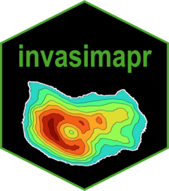

<!-- README.md is generated from README.Rmd. Please edit that file -->

# **`invasimapr`**

## A Novel Framework to visualise trait dispersion and assess species invasiveness or site invasibility

<!-- badges: start -->

<!-- badges: end -->

------------------------------------------------------------------------

## 1. Introduction

Biological invasions are a major driver of biodiversity loss. Invasive
alien species can spread quickly, alter ecosystem processes, and
displace native taxa. Because invasion outcomes depend jointly on
functional traits, resident communities, and local environments, ad-hoc
analyses are not enough. We need a transparent, reproducible way to
quantify establishment potential at specific sites and to compare that
potential across species and landscapes.

**invasimapr** fills this gap. It is a trait-based, site-specific R
package that estimates **invasion fitness** for candidate invaders,
assembles the resident community context that constrains establishment,
and turns these quantities into mappable indicators for decision making.
The workflow links three pillars: a functional **trait space** that
governs competitive overlap, **environmental suitability** that
determines how well species perform at a site, and **biotic
competition** from residents that reduces the chance of establishment.
By fitting a single trait-environment model and reusing it to derive
both invader growth and resident context, the package keeps assumptions
coherent and results easy to interpret.

This milestone report describes the rationale, model components, and
software design of **invasimapr**. We define the ecological quantities
we estimate, show how raw data are prepared and validated, and explain
how outputs are summarised as **invasibility** (how open a site is to
newcomers) and **invasiveness** (how prone a species is to establish
across sites). The implementation relies on widely used methods such as
GLMM or GAM for trait-environment responses and standard distance
measures such as Gower for trait and environmental dissimilarities,
which keeps the approach accessible and extensible.

Practically, the package is modular and reproducible. Each step can be
run independently or as a full pipeline, inputs and assumptions are
explicit, and all intermediate objects can be inspected. The end result
is a consistent set of site-level maps and species-level rankings that
support surveillance, prioritisation, and scenario testing under
changing environments.

------------------------------------------------------------------------

## 2. Core Concepts

* **Invasion fitness (`λ`)**: Net potential for a species to establish at a site, combining predicted growth and competitive penalties.
* **Invasiveness (`Vᵢ`)**: Propensity of a species to establish across multiple sites.
* **Invasibility (`Vₛ`)**: How open a site is to establishment by newcomers.

These indicators are derived from three pillars:

1. **Trait space** - functional similarity between species.
2. **Environmental suitability** - how well a species matches site conditions.
3. **Resident context** - competitive pressure from established species.

---

## 3. Main Functions

The package is modular, allowing individual steps or full workflows:

* **Data preparation**

  * `get_trait_data()` - Collect, clean, and standardise trait data.
  * `simulate_invaders()` - Generate hypothetical species to test scenarios.

* **Trait-environment modelling**

  * `compute_trait_space()` - Build functional trait space, compute pairwise trait distances and competition coefficients.
  * `build_glmm_formula()` - Specify trait-environment model structures.
  * `predict_invader_response()` - Predict intrinsic growth potential of species at sites.

* **Competition and environment**

  * `compute_environment_kernel()` - Quantify site-species environmental mismatch.
  * `compute_interaction_strength()` - Estimate biotic influence via trait overlap, resident suitability, and abundance.

* **Invasion outcomes**

  * `compute_invasion_fitness()` - Calculate invasion fitness for species × sites.
  * **Summaries:**

    * **Invasibility** (`Vₛ`) - site-level openness.
    * **Invasiveness** (`Vᵢ`) - species-level propensity.

---

## 4. Applications

* Prioritising invasive species for management.
* Identifying vulnerable sites under environmental change.
* Exploring “what-if” invasion scenarios with simulated traits.
* Generating consistent, reproducible maps of invasion risk.

------------------------------------------------------------------------
