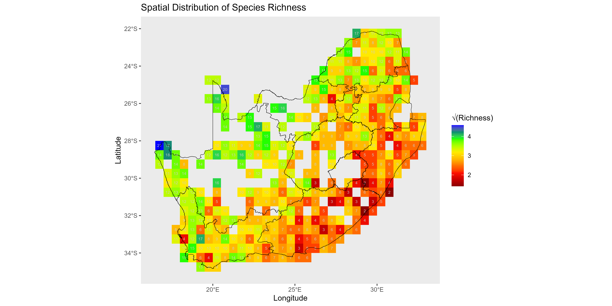
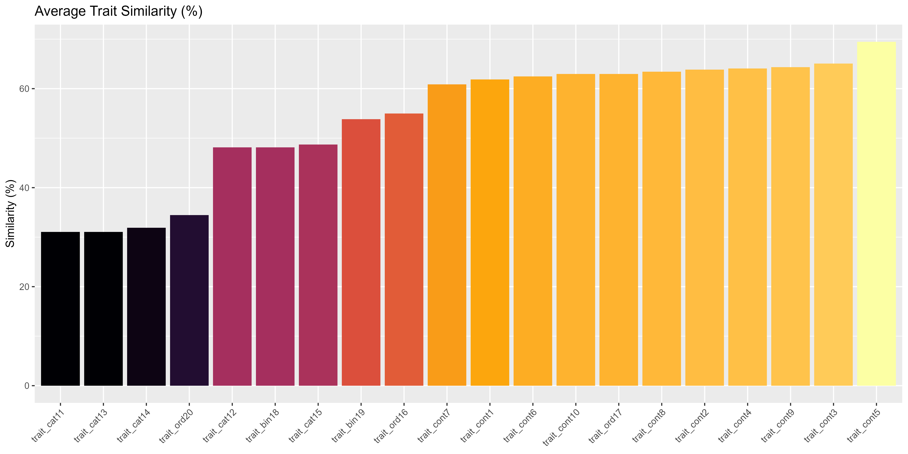
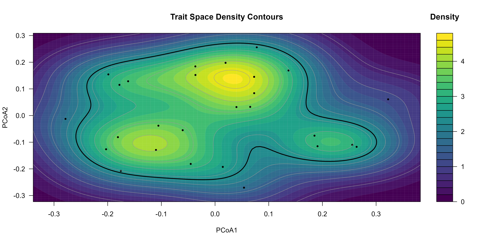
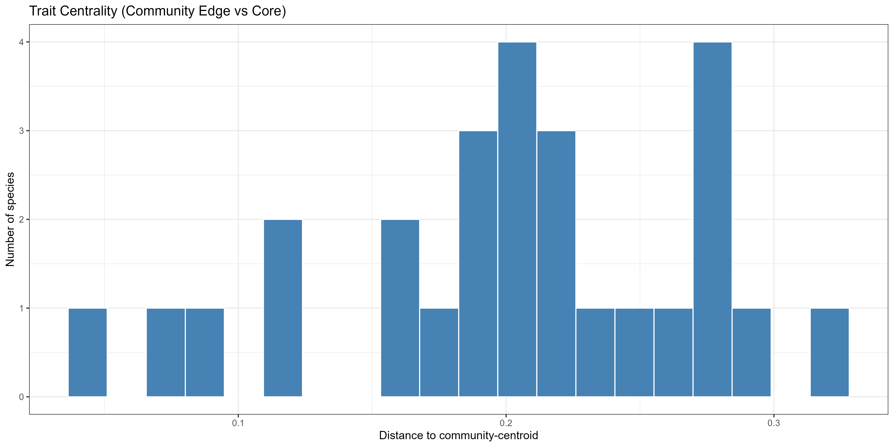
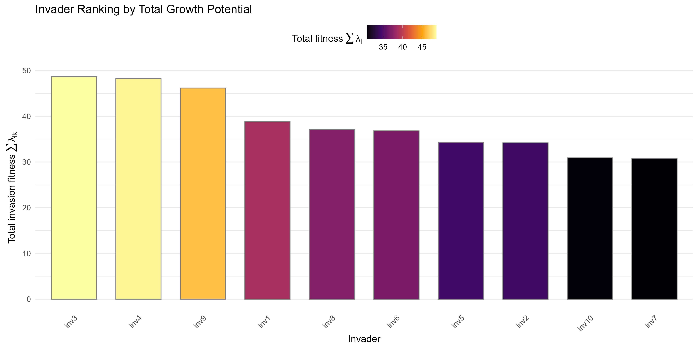
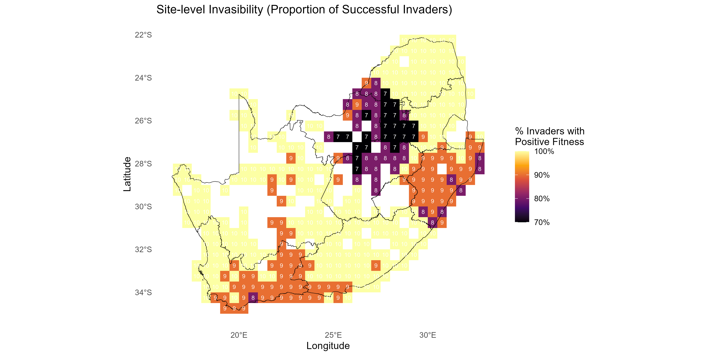
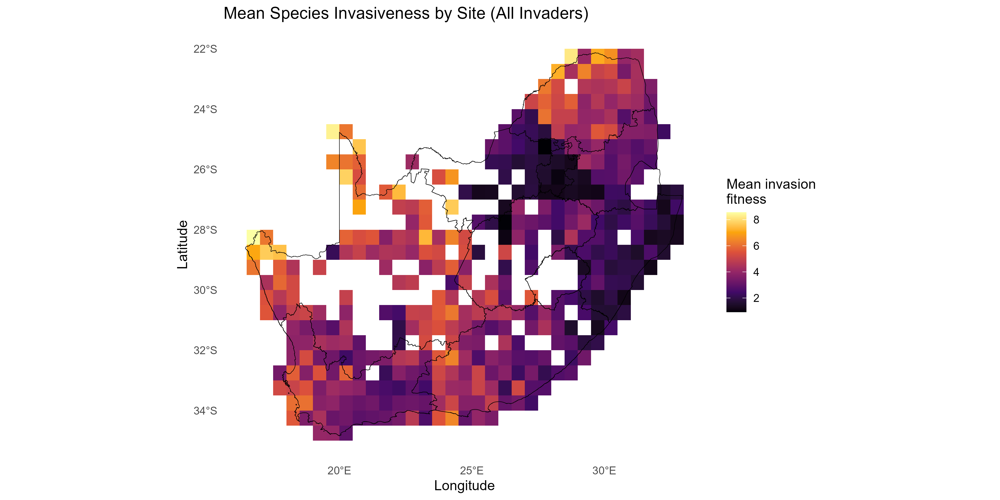
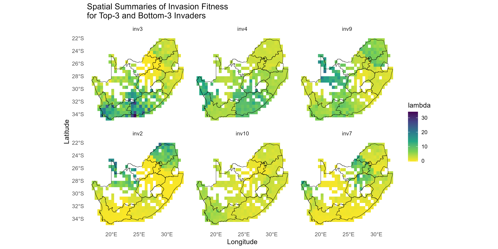

<!-- README.md is generated from README.Rmd. Please edit that file -->

# invasimapr

## A Novel Framework to visualise trait dispersion and assess species invasiveness or site invasibility

<!-- badges: start -->

[](https://github.com/macSands/invasimapr/actions/workflows/R-CMD-check.yaml)
[](https://github.com/macSands/invasimapr/actions/workflows/test-coverage.yaml)
[](https://app.codecov.io/gh/macSands/invasimapr)
[](https://lifecycle.r-lib.org/articles/stages.html#stable)
[](LICENSE.md)
<!-- badges: end -->

------------------------------------------------------------------------

## 1. Introduction

Biological invasions are a major driver of biodiversity loss. Invasive
alien species can spread quickly, alter ecosystem processes, and
displace native taxa. Because invasion outcomes depend jointly on
functional traits, resident communities, and local environments, ad-hoc
analyses are not enough. We need a transparent, reproducible way to
quantify establishment potential at specific sites and to compare that
potential across species and landscapes.

**invasimapr** fills this gap. It is a trait-based, site-specific R
package that estimates **invasion fitness** for candidate invaders,
assembles the resident community context that constrains establishment,
and turns these quantities into mappable indicators for decision making.
The workflow links three pillars: a functional **trait space** that
governs competitive overlap, **environmental suitability** that
determines how well species perform at a site, and **biotic
competition** from residents that reduces the chance of establishment.
By fitting a single trait–environment model and reusing it to derive
both invader growth and resident context, the package keeps assumptions
coherent and results easy to interpret.

This milestone report describes the rationale, model components, and
software design of **invasimapr**. We define the ecological quantities
we estimate, show how raw data are prepared and validated, and explain
how outputs are summarised as **invasibility** (how open a site is to
newcomers) and **invasiveness** (how prone a species is to establish
across sites). The implementation relies on widely used methods such as
GLMM or GAM for trait–environment responses and standard distance
measures such as Gower for trait and environmental dissimilarities,
which keeps the approach accessible and extensible.

Practically, the package is modular and reproducible. Each step can be
run independently or as a full pipeline, inputs and assumptions are
explicit, and all intermediate objects can be inspected. The end result
is a consistent set of site-level maps and species-level rankings that
support surveillance, prioritisation, and scenario testing under
changing environments.

------------------------------------------------------------------------

## 2. Context and model overview

The figure below summarizes the **invasimapr** pipeline from inputs to
decision-ready outputs. Starting with species **traits**, **site
environments** $\mathbf{E}_s$, and **resident communities**, the
workflow derives intermediate quantities in two coordinated tracks: a
**trait track** that yields pairwise distances and a competition kernel
$\alpha_{ij}$, and an **environment track** that yields resident optima
$\theta_j$, site-resident mismatch $\Delta_{js}$, an environmental
kernel $K_e$, and resident context $N^{*}_{js}$. These parts are
assembled into an **impact tensor** $I_{ijs}$, aggregated to a
**penalty** $C^{\mathrm{(raw)}}_{is}$, and combined with predicted
**intrinsic growth** $r_{is}$ to produce **invasion fitness**
$\lambda_{is}$. Site- and species-level summaries (**invasibility**
$V_s$ and **invasiveness** $V_i$) support mapping and prioritisation.  
 


<!-- for crisp scaling. ​:contentReference[oaicite:0]{index=0}​ -->

> **Figure 1**: Traits and environment feed two tracks - (1)
> **competition** via trait distances → $\alpha_{ij}$, and (2)
> **environmental filtering** via optima and mismatch →
> $K_e(\Delta_{js};\sigma_e)$ plus **resident context** $N^{*}_{js}$.
> These combine into an **impact tensor** $I_{ijs}$, which sums to the
> **penalty** $C^{\mathrm{(raw)}}_{is}$. Subtracting this from the
> **intrinsic growth** $r_{is}$ gives **invasion fitness**
> $\lambda_{is}$, which aggregates to **invasibility** $V_s$ and
> **invasiveness** $V_i$ and can be mapped.

### 2.1. Inputs

- **Species traits**: measurable characteristics (e.g., height, seed
  mass, leaf area, diet) that shape how species use resources and
  interact. Traits let us compare species on a common ecological scale.
- **Site environment** $\mathbf{E}_s$: local conditions (climate, soils,
  habitat structure) that determine whether a species can survive and
  grow at a place.
- **Residents**: the species already established at a site (the
  *resident community*). Their presence sets the biotic backdrop into
  which newcomers arrive.
- **Candidate invaders**: the species being evaluated. They may be real
  introductions or simulated species drawn from trait distributions to
  explore “what-if” scenarios.

The **trait-environment response** model ties traits and environments to
observed abundances to generate consistent predictions for both invaders
and residents.

------------------------------------------------------------------------

### 2.2. Invasion fitness

Invasion fitness is the net potential for a newcomer to increase when
rare. It combines how well the site suits the species (its predicted
growth) with how much the resident community pushes back (competitive
penalty). Positive values mean establishment is feasible; negative
values indicate likely exclusion.

<a id="def-lambda"></a>

$$
\mathbf{\lambda_{is} \;=\; r_{is} \;-\; C^{\mathrm{(raw)}}_{is}}
$$

------------------------------------------------------------------------

### 2.3. Components of $\lambda_{is}$

The invader fitness $\lambda_{is}$ at site $s$ is built from three
modules:

1.  **Intrinsic growth** $r_{is}$: the abiotic match of species $i$ to
    site $s$.
2.  **Competitive pressure** $C^{\mathrm{(raw)}}_{is}$: suppression
    exerted by residents.
3.  **Interaction tensor** $I_{ijs}$: trait overlap): pairwise impact
    combining trait similarity, environmental suitability, and resident
    abundance.

------------------------------------------------------------------------

#### 2.3.1. Intrinsic growth (predicted growth potential)

This is the growth or abundance a species is expected to achieve at site
$s$ **without competitors**, derived from the trait-environment model.
It captures environmental suitability and any trait effects independent
of competition.

<a id="def-r"></a> $r_{is}$

Thus a high $r_{is}$ signals a good abiotic match,while a low $r_{is}$
signals environmental mismatch.

------------------------------------------------------------------------

#### 2.3.2. Competitive pressure (penalty from residents)

The penalty sums how strongly all residents suppress the invader at a
site:

<a id="def-Craw"></a>

$$
C^{\mathrm{(raw)}}_{is} \;=\; \sum_{j \neq i} I_{ijs}
$$

This penalty integrates **competition** (trait similarity),
**environmental suitability/filtering** (resident suitability), and
**resident abundance** (how common residents are).

##### i) Functional trait space → competition

Species are positioned in a **functional trait space** (e.g. PCoA) where
distances (e.g. Euclidean) reflect ecological similarity. Two summaries
help interpret residents:

###### **Pairwise similarity**:

<a id="def-alpha"></a>

$$
\alpha_{ij} \;=\; \exp\!\left(-\frac{d_{ij}^2}{2\sigma_t^2}\right),
\quad d_{ij}=\|\mathbf{z}_i-\mathbf{z}_j\|_2.
$$

In this way, similarity is translated into a competition coefficient
with a Gaussian kernel. Here <a id="def-dij"></a>$d_{ij}$ is trait
dissimilarity (0 = identical, 1 = very different) and
<a id="def-sigmat"></a>$\sigma_t$ controls how quickly competition fades
as species diverge. The general relation
<a id="def-gall"></a>$g^{\mathrm{(all)}}_{ij}$ is computed over the full
species set to provide consistent distances.

###### **Centrality (formal definition)**:

Let $p_{i}$ be normalised abundances, $\mathbf{z}_i$ the coordinates in
PCoA space, and

<a id="def-mu"></a><a id="def-ci"></a>

$$
\pmb{\mu} = \sum_i p_i \mathbf{z}_i,
\quad c_i = \|\mathbf{z}_i - \pmb{\mu}\|_2.
$$

Thus **trait centrality** is how close a species is to the centre of the
resident trait cloud; central residents typically overlap more with
others.

###### **Dispersion metrics (community-level)**:

<a id="def-fdis"></a>

$$
\mathrm{FDis} = \sum_i p_i c_i,
$$

<a id="def-fric"></a>

$$
\mathrm{FRic} = \mathrm{Vol}(\mathrm{ConvHull}\{\mathbf{z}_i\}),
$$

<a id="def-raoq"></a>

$$
\mathrm{RaoQ} = \tfrac{1}{2}\sum_i\sum_j p_i p_j\, d_{ij}.
$$

Thus **trait dispersion** is how spread out residents are. Greater
spread often means less average overlap and weaker competition.

*All together, similarity, trait centrality and dispersion, quantify the
“shape” of the trait cloud influencing overlap and competition.*

##### ii) Environmental filtering of residents

Residents suppress invaders most where they perform well. We quantify
the match between site conditions and each resident’s optimum with a
kernel in environmental space:

<a id="def-Ke"></a> <a id="def-delta"></a> <a id="def-sigmae"></a>
<a id="def-E"></a> <a id="def-theta"></a>

$$
K_e(\Delta_{js}; \sigma_e) \;=\; \exp\!\left(-\frac{\Delta_{js}^2}{2\sigma_e^2}\right),
\quad \Delta_{js} \;=\; \mathrm{Gower}\!\big(\mathbf{E}_s, \theta_j\big),
$$

where $\theta_j$ is resident $j$’s abundance-weighted environmental
optimum. Small $\Delta_{js}$ (good match) yields large $K_e$; large
mismatch down-weights that resident’s effect.

##### iii) Resident abundance (context)

Abundant residents exert more pressure. Typical abundance of resident
$j$ at site $s$ is predicted from the trait-environment model:

<a id="def-Nstar"></a>

$$
N^{*}_{js} \;=\; f_{\text{env}}\!\left(\mathbf{E}_s, \theta_j, \mathbf{z}_j\right),
$$

where $f_{\text{env}}$ is a fitted response (e.g., GLMM/GAM) and
$\mathbf{z}_j$ are any extra predictors.

------------------------------------------------------------------------

#### 2.3.3. Interaction strength (impact tensor)

The impact tensor combines trait overlap, resident suitability, and
resident abundance into pairwise effects:

<a id="def-I"></a>

$$
I_{ijs} \;=\; \alpha_{ij} \; K_e(\Delta_{js}; \sigma_e) \; N^{*}_{js}.
$$

Thus the supression of invader $j$ at site $s$ will increase when: 1.
Species $i$ and $j$ are very similar = large $\alpha_{ij}$ 2. Residents
$j$ are well-matched with environment $\mathbf{E}_s$ = large $K_e$ 3.
Residents $j$ are very common/thriving = large $N^{*}_{js}$

Note: Summing $I_{ijs}$ over residents $j$ creates the site-level
penalty $C^{\mathrm{(raw)}}_{is}$.

------------------------------------------------------------------------

### 2.4. Aggregated outputs

#### 2.4.1. Invasiveness of species (propensity to invade)

How readily a species establishes across sites. We aggregate fitness
over space to rank potential invaders.

<a id="def-Vi"></a>

$$
V_i \;=\; \sum_{s} \lambda_{is}
$$

Thus higher $V_i$ suggests species $i$ tends to be more invasive across
all sites i.e. many sites are suitableand/ore less resistant to invasion
by species $i$.

#### 2.4.2. Invasibility of sites (openness)

How open a site is to new species. We aggregate the fitness matrix over
invaders to a site-level score that can be mapped or tracked through
time.

<a id="def-Vs"></a>

$$
V_s \;=\; \frac{1}{I}\sum_{i} \mathbb{I}\{\lambda_{is} > 0\}
$$

Thus higher $V_s$ suggests more invaders are expected to establish at
site $s$.

------------------------------------------------------------------------

## 3. Overview of the `invasimapr` R package conceptual workflow

This tutorial walks through the full **`invasimapr`** workflow for
quantifying, mapping, and interpreting **invasion fitness**
[$\lambda_{is}$](#def-lambda). The pipeline integrates information from
traits, environments, and resident communities, returning explicit
intermediate objects so you can inspect, audit, and reuse results.


> **Figure 2**: Conceptual overview of the invasimapr framework:
> Intrinsic growth potential ($r_{is}$) derives from trait-environment
> matching in the absence of competitors. Resident communities impose
> competitive pressure ($C_{is}$) through trait similarity, resident
> environmental matching, and resident abundance. These components
> combine into invasion fitness ($\lambda_{is}$), which aggregates to
> species-level invasiveness ($V_i$) and site-level invasibility
> ($V_s$).

------------------------------------------------------------------------

1)  **Inputs and setup**  
    Provide site environments [$\mathbf{E}_s$](#def-E), resident
    occurrence or abundance, species traits, and consistent species and
    site identifiers. Load packages, set seeds, and ensure that tables
    align on IDs so later steps can estimate intrinsic growth
    [$\;r_{is}$](#def-r), trait similarity [$\;d_{ij}$](#def-dij), and
    resident context [$\;N^{*}_{js}$](#def-Nstar).

2)  **Data preparation**  
    Use `get_trait_data()` to collect, clean and standardise trait
    variables, harmonise units, resolve missing values, and align
    dimensions across sites and species. The output is a tidy trait
    table and matched site × species matrices ready for analysis.

3)  **Trait space to competition**  
    Use `compute_trait_space()` to build a functional trait space and
    compute pairwise trait distances [$\;d_{ij}$](#def-dij). Convert
    distances to competition coefficients [$\alpha_{ij}$](#def-alpha)
    with a Gaussian kernel whose bandwidth [$\sigma_t$](#def-sigmat) can
    be estimated from resident dispersion or set explicitly. The result
    is an invader × resident matrix of [$\alpha_{ij}$](#def-alpha) that
    reflects how strongly species compete as a function of trait
    similarity.

4)  **Environment and resident context**  
    Use `build_glmm_formula()` to first construct the model formula.
    Simulate hypothetical invaders with traits with
    `simulate_invaders()`. Estimate each resident’s environmental
    optimum [$\theta_j$](#def-theta), compute site-resident mismatch
    $\Delta_{js} = \mathrm{Gower}(\mathbf{E}_s, \theta_j)$ (see
    [$\mathbf{E}_s$](#def-E) and [$\theta_j$](#def-theta)), and
    transform mismatch into an environmental weight
    [$K_e(\Delta_{js};\sigma_e)$](#def-Ke) with bandwidth
    [$\sigma_e$](#def-sigmae) using `compute_environment_kernel()`.
    Obtain resident context [$N^{*}_{js}$](#def-Nstar) as predicted or
    typical abundance per site, so resident effects are strongest where
    they are well matched and common.

5)  **Trait-environment response for intrinsic growth**  
    Fit a trait-environment model to predict intrinsic growth
    [$r_{is}$](#def-r) or an abundance proxy for candidate invaders at
    each site with `predict_invader_response()`. This yields the invader
    × site matrix [$\;r_{is}$](#def-r), representing expected
    performance in the absence of competition.

6)  **Assemble impacts and penalties**  
    Estimate pairwise biotic influence potentials by computing
    interaction strengths [$I_{ijs}$](#def-I) with
    `compute_interaction_strength()`. Then combine competition
    [$\alpha_{ij}$](#def-alpha), environmental weight [$K_e$](#def-Ke),
    and resident context [$\;N^{*}_{js}$](#def-Nstar) into the impact
    tensor [$I_{ijs}$](#def-I). Sum impacts over residents to obtain the
    total competitive penalty [$C^{\mathrm{(raw)}}_{is}$](#def-Craw) for
    each invader at each site.

7)  **Compute invasion fitness and variants**  
    Calculate invasion fitness as intrinsic growth minus penalty,
    [$\lambda_{is} = r_{is} - C^{\mathrm{(raw)}}_{is}$](#def-lambda)
    using `compute_invasion_fitness()`. Optionally report scaled fitness
    that divides the penalty by richness, a relative-abundance version
    that emphasises composition, and a logistic-capped version that
    smoothly limits extreme penalties.

8)  **Summaries, maps, and interpretation**  
    Aggregate the fitness matrix to site-level **invasibility**
    [$V_s$](#def-Vs) and species-level **invasiveness**
    [$V_i$](#def-Vi). Map $\lambda_{is}$, $V_s$, and $V_i$, explore
    uncertainty and sensitivity, and create concise products for
    management and reporting.

> **Note.** Different summaries can be used. For example,
> [$V_s$](#def-Vs) can be the mean of [$\lambda_{is}$](#def-lambda) over
> species $i$; and [$V_i$](#def-Vi) can be the mean across sites or a
> sum over positive values only, depending on management goals.

# Step-by-step Workflow

### 1. Install and load `invasimapr`

Install and load the `invasimapr` package from GitHub, ensuring all
functions are available for use in the workflow.

``` r
# # install remotes if needed
# install.packages("remotes")
# remotes::install_github("macSands/invasimapr")

# Ensure the package is loaded when knitting
library(invasimapr)
sessionInfo()$otherPkgs$invasimapr$Version

# Make sure all the functions are loaded
devtools::load_all() # alternative during local development
```

### 2. Load other R libraries

Load core libraries for spatial processing, biodiversity modelling, and
visualization required across the `invasimapr` analysis pipeline.

``` r
# Load essential packages
# --- Data Wrangling and Manipulation ---
library(dplyr)          # Tidy data manipulation (mutate, select, filter, etc.)
library(tidyr)          # Reshape data (wide - long, pivot functions)
library(tibble)         # Modern lightweight data frames (tibble objects)
library(purrr)          # Functional iteration (e.g. map())

# --- String and Factor Utilities ---
library(stringr)        # String pattern manipulation (e.g. str_detect())
library(fastDummies)    # Quickly create dummy/one-hot variables for factors

# --- Data Visualization ---
library(ggplot2)        # Grammar-of-graphics plotting
library(viridis)        # Colorblind-friendly palettes for ggplot2
library(factoextra)     # Visualize clustering e.g. fviz_nbclust, silhouettes
library(pheatmap)       # Pretty Heatmaps
library(grid)           # Grid Graphics Package

# --- Spatial Data ---
library(sf)             # Spatial vector data (simple features)
library(terra)          # Raster and spatial data operations

# --- Statistical and Ecological Modelling ---
library(glmmTMB)        # Fit GLMMs (Generalized Linear Mixed Models)
library(MASS)           # Kernel density estimation (kde2d, etc.)
library(cluster)        # Clustering algorithms, Gower distance, diagnostics
library(geometry)       # Convex hulls, volumes
library(ClustGeo)       # Spatially constrained clustering

# --- Model Performance and Diagnostics ---
# library(performance)  # Model checking and diagnostics
# options(warn = -1)
```

------------------------------------------------------------------------

### 3. Data access and preparation using `dissmapr`

To acquire and prepare species occurrence data for biodiversity
modelling using the `dissmapr` package, a series of modular functions
streamline the workflow from raw observations to spatially aligned
environmental predictors.

#### 3.1. Install `dissmapr`

Install and load the `dissmapr` package from GitHub, ensuring all
functions are available for use in the workflow.

``` r
# # install remotes if needed
# install.packages("remotes")
# remotes::install_github("macSands/dissmapr")

# Ensure the package is loaded
library(dissmapr)
sessionInfo()$otherPkgs$dissmapr$Version
#> [1] "0.1.0"
```

#### 3.2. Import and harmonise biodiversity-occurrence data

The process begins with
[`dissmapr::get_occurrence_data()`](https://macsands.github.io/dissmapr/reference/get_occurrence_data.html),
which imports biodiversity records, such as a GBIF butterfly dataset for
South Africa, and harmonizes them into standardised formats. Input
sources can include local CSV files, URLs, or zipped GBIF downloads. The
function filters data by taxon and region, returning both raw records
and site-by-species matrices in presence-absence or abundance form.

``` r
# Use local GBIF data
bfly_data = dissmapr::get_occurrence_data(
  data = system.file("extdata", "gbif_butterflies.csv", package = "invasimapr"),
  source_type = "local_csv",
  sep = "\t"
)

# Check results but only a subset of columns to fit in console
dim(bfly_data)
#> [1] 81825    52
# str(bfly_data[,c(51,52,22,23,1,14,16,17,30)])
head(bfly_data[, c(51, 52, 22, 23, 1, 14, 16, 17, 30)])
#>   site_id pa         y        x    gbifID             verbatimScientificName countryCode
#> 1       1  1 -34.42086 19.24410 923051749                   Pieris brassicae          ZA
#> 2       2  1 -33.96044 18.75564 922985630                   Pieris brassicae          ZA
#> 3       3  1 -33.91651 18.40321 922619348 Papilio demodocus subsp. demodocus          ZA
#> 4       1  1 -34.42086 19.24410 922426210 Mylothris agathina subsp. agathina          ZA
#> 5       4  1 -34.35024 18.47488 921650584                  Eutricha capensis          ZA
#> 6       5  1 -33.58570 25.65097 921485695            Drepanogynis bifasciata          ZA
#>                                            locality        eventDate
#> 1                                          Hermanus 2012-10-13T00:00
#> 2                                   Polkadraai Road 2012-11-01T00:00
#> 3                                       Signal Hill 2012-10-31T00:00
#> 4                                          Hermanus 2012-10-13T00:00
#> 5 Cape of Good Hope / Cape Point Area, South Africa 2012-10-30T00:00
#> 6                             Kudu Ridge Game Lodge 2012-10-23T00:00
```

#### 3.3. Format biodiversity records to long/wide formats

Next,
[`dissmapr::format_df()`](https://macsands.github.io/dissmapr/reference/format_df.html)
restructures the raw records into tidy long and wide formats. This
assigns unique site IDs, extracts key fields (coordinates, species
names, observation values), and prepares two main outputs: `site_obs`
(long format for mapping) and `site_spp` (wide format for species-level
analysis).

``` r
# Continue from GBIF data
bfly_result = dissmapr::format_df(
  data        = bfly_data, # A `data.frame` of biodiversity records
  species_col = "verbatimScientificName", # Name of species column (required for `"long"`)
  value_col   = "pa", # Name of value column (e.g. presence/abundance; for `"long"`)
  extra_cols  = NULL, # Character vector of other columns to keep
  format      = "long" # Either`"long"` or `"wide"`
)

# Check `bfly_result` structure
str(bfly_result, max.level = 1)
#> List of 2
#>  $ site_obs:'data.frame':    79953 obs. of  5 variables:
#>  $ site_spp: tibble [56,090 × 2,871] (S3: tbl_df/tbl/data.frame)

# Optional: Create new objects from list items
site_obs = bfly_result$site_obs
site_spp = bfly_result$site_spp

# Check results
dim(site_obs)
#> [1] 79953     5
head(site_obs)
#>   site_id        x         y                            species value
#> 1       1 19.24410 -34.42086                   Pieris brassicae     1
#> 2       2 18.75564 -33.96044                   Pieris brassicae     1
#> 3       3 18.40321 -33.91651 Papilio demodocus subsp. demodocus     1
#> 4       1 19.24410 -34.42086 Mylothris agathina subsp. agathina     1
#> 5       4 18.47488 -34.35024                  Eutricha capensis     1
#> 6       5 25.65097 -33.58570            Drepanogynis bifasciata     1

dim(site_spp)
#> [1] 56090  2871
head(site_spp[, 1:6])
#> # A tibble: 6 × 6
#>   site_id     x     y `Mylothris agathina subsp. agathina` `Pieris brassicae` `Tarucus thespis`
#>     <int> <dbl> <dbl>                                <dbl>              <dbl>             <dbl>
#> 1       1  19.2 -34.4                                    1                  1                 1
#> 2       2  18.8 -34.0                                    0                  1                 0
#> 3       3  18.4 -33.9                                    0                  0                 0
#> 4       4  18.5 -34.4                                    0                  0                 0
#> 5       5  25.7 -33.6                                    0                  0                 0
#> 6       6  22.2 -33.6                                    0                  0                 0

#### Get parameters from processed data to use later
# Number of species
(n_sp = dim(site_spp)[2] - 3)
#> [1] 2868

# Species names
sp_cols = names(site_spp)[-c(1:3)]
sp_cols[1:10]
#>  [1] "Mylothris agathina subsp. agathina" "Pieris brassicae"                  
#>  [3] "Tarucus thespis"                    "Acraea horta"                      
#>  [5] "Danaus chrysippus"                  "Papilio demodocus subsp. demodocus"
#>  [7] "Eutricha capensis"                  "Mesocelis monticola"               
#>  [9] "Vanessa cardui"                     "Cuneisigna obstans"
```

#### 3.4. Generate spatial grid and gridded summaries

To integrate the data spatially,
[`dissmapr::generate_grid()`](https://macsands.github.io/dissmapr/reference/generate_grid.html)
overlays a user-defined spatial lattice (e.g. 0.5° grid), aggregates
biodiversity observations per grid cell, and computes standardised
metrics such as species richness and observation effort. Outputs include
gridded species matrices (`grid_spp`, `grid_spp_pa`), a spatial polygon
(`grid_sf`), and raster layers (`grid_r`), enabling downstream spatial
modelling.

``` r
# Load the national boundary
rsa = sf::st_read(system.file("extdata", "rsa.shp", package = "invasimapr"))
#> Reading layer `rsa' from data source 
#>   `D:\Methods\R\myR_Packages\myCompletePks\invasimapr\inst\extdata\rsa.shp' using driver `ESRI Shapefile'
#> Simple feature collection with 11 features and 8 fields
#> Geometry type: MULTIPOLYGON
#> Dimension:     XY
#> Bounding box:  xmin: 16.45189 ymin: -34.83417 xmax: 32.94498 ymax: -22.12503
#> Geodetic CRS:  WGS 84

# Choose a working resolution
res = 0.5 # decimal degrees° (≈ 55 km at the equator)

# Convert the AoI to a 'terra' vector
rsa_vect = terra::vect(rsa)

# Initialise a blank raster template
grid = terra::rast(rsa_vect, resolution = res, crs = terra::crs(rsa_vect))

# Populate the raster with placeholder values
terra::values(grid) = 1

# Clip the raster to the AoI
grid_masked = terra::mask(grid, rsa_vect)

# Generate a 0.5° grid summary for the point dataset `site_spp`
grid_list = dissmapr::generate_grid(
  data          = site_spp, # point data with x/y + species columns
  x_col         = "x", # longitude column
  y_col         = "y", # latitude  column
  grid_size     = 0.5, # cell size in degrees
  sum_cols      = 4:ncol(site_spp), # columns to aggregate * could also use `names(site_spp)[4:ncol(site_spp)]`
  crs_epsg      = 4326 # WGS84
)

# Inspect the returned list
str(grid_list, max.level = 1)
#> List of 4
#>  $ grid_r     :S4 class 'SpatRaster' [package "terra"]
#>  $ grid_sf    :Classes 'sf' and 'data.frame':    1110 obs. of  8 variables:
#>   ..- attr(*, "sf_column")= chr "geometry"
#>   ..- attr(*, "agr")= Factor w/ 3 levels "constant","aggregate",..: NA NA NA NA NA NA NA
#>   .. ..- attr(*, "names")= chr [1:7] "centroid_lon" "centroid_lat" "grid_id" "mapsheet" ...
#>  $ grid_spp   : tibble [415 × 2,874] (S3: tbl_df/tbl/data.frame)
#>  $ grid_spp_pa: tibble [415 × 2,874] (S3: tbl_df/tbl/data.frame)

# (Optional) Promote list items to named objects
grid_r = grid_list$grid_r$grid_id # raster
grid_sf = grid_list$grid_sf # polygons for mapping or joins
grid_spp = grid_list$grid_spp # tabular summary per cell
grid_spp_pa = grid_list$grid_spp_pa # presence/absence summary

# Quick checks
dim(grid_sf) # ; head(grid_sf)
#> [1] 1110    8
dim(grid_spp) # ; head(grid_spp[, 1:8])
#> [1]  415 2874
dim(grid_spp_pa) # ; head(grid_spp_pa[, 1:8])
#> [1]  415 2874
```

**Visualise species richess per grid cell**  
Plot square root transformed sampling effort and species richness, in a
1x2 side by side. Each map uses the `viridisLite::turbo` palette and is
overlaid with the study area outline for spatial context.

``` r
# Extract & stretch the layers
effRich_r = sqrt(grid_list$grid_r[[c("obs_sum", "spp_rich")]])

# Open a 1×2 layout and plot each layer + outline
old_par = par(
  mfrow = c(1, 2), # multi‐figure by row: 1 row and 2 columns
  mar = c(1, 1, 1, 2)
) # margins sizes: bottom (1 lines)|left (1)|top (1)|right (2)

for (i in 1:2) {
  plot(effRich_r[[i]],
    col = viridisLite::turbo(100),
    colNA = NA,
    axes = FALSE,
    main = c(
      "Sampling effort (√obs count)",
      "Species richness (√unique count)"
    )[i],
    cex.main = 0.8
  ) # ← smaller title)
  plot(terra::vect(rsa), add = TRUE, border = "black", lwd = 0.4)
}
```


``` r
# Reset default plot parameters
par(old_par) # reset plotting parameters
```

#### 3.5. Retrieve, crop, resample, and link environmental rasters to sampling sites

Environmental predictors are appended using
[`dissmapr::get_enviro_data()`](https://macsands.github.io/dissmapr/reference/get_enviro_data.html),
which buffers the grid, downloads raster data (e.g. WorldClim
bioclimatic variables), resamples it, and links values to grid-cell
centroids. This produces both a site-by-environment data frame
(`env_df`) and a SpatRaster object (`env_r`), aligning biological and
environmental data.

Begin by reading in a predefined target species list, then filter a
site-by-species dataset (`grid_spp`) to retain only relevant species
observations, and reshape the data for further analysis. This produces
both a filtered long-format dataset (`grid_obs`) and a cleaned
wide-format site-by-species matrix (`grid_spp`).

``` r
# Read in target species list
species = read.csv(system.file("extdata",
  "rsa_butterfly_species_names_n27_100plus.csv",
  package = "invasimapr"
), stringsAsFactors = FALSE)$species

# Filter `grid_spp` and convert to long-format
grid_obs = grid_spp %>%
  dplyr::select(-mapsheet) %>% # Drop mapsheet metadata
  pivot_longer(
    cols = -c(grid_id, centroid_lon, centroid_lat, obs_sum, spp_rich), # Keep core metadata columns only
    names_to = "species",
    values_to = "count",
    values_drop_na = TRUE
  ) %>%
  filter(
    # obs_sum > 100,                                   # Only high-observation sites
    count > 0, # Remove absent species
    species %in% !!species # Keep only target species
  ) %>%
  rename(
    site_id = grid_id, # Change 'grid_id' to 'site_id'
    x = centroid_lon, # Change 'centroid_lon' to 'x'
    y = centroid_lat # Change 'centroid_lat' to 'y'
  ) %>%
  relocate(site_id, x, y, obs_sum, spp_rich, species, count)

dim(grid_obs)
#> [1] 1737    7
head(grid_obs)
#> # A tibble: 6 × 7
#>   site_id     x     y obs_sum spp_rich species                    count
#>   <chr>   <dbl> <dbl>   <dbl>    <dbl> <chr>                      <dbl>
#> 1 1027     29.2 -22.3      41       31 Utetheisa pulchella            1
#> 2 1029     30.3 -22.3       7        7 Danaus chrysippus orientis     1
#> 3 1029     30.3 -22.3       7        7 Telchinia serena               1
#> 4 1031     31.3 -22.3     107       76 Vanessa cardui                 1
#> 5 1031     31.3 -22.3     107       76 Utetheisa pulchella            2
#> 6 1031     31.3 -22.3     107       76 Hypolimnas misippus            2
length(unique(grid_obs$species))
#> [1] 27
length(unique(grid_obs$site_id))
#> [1] 314

# Reshape site-by-species matrix to wide format and clean
grid_spp = grid_obs %>%
  pivot_wider(
    names_from = species,
    values_from = count,
    values_fill = 0 # Replace missing counts with 0
  )

dim(grid_spp)
#> [1] 314  32
# head(grid_spp)
```

Then proceed to retrieve and process environmental data using
[`dissmapr::get_enviro_data()`](https://macsands.github.io/dissmapr/reference/get_enviro_data.html).
In the example below, 19 bioclimatic variables are downloaded from
WorldClim v2.1 (≈10 km resolution) for all site centroids in the
`grid_spp` dataset. It performs the following steps:

1.  Retrieves WorldClim “bio” variables via the `geodata` interface.
2.  Buffers the area of interest (AOI) by 10 km.
3.  Retains site-level metadata (`obs_sum`, `spp_rich`) and excludes
    species columns.

``` r
# Retrieve 19 bioclim layers (≈10-km, WorldClim v2.1) for all grid centroids
data_path = "inst/extdata" # cache folder for rasters
enviro_list = dissmapr::get_enviro_data(
  data       = grid_spp, # centroids + obs_sum + spp_rich
  buffer_km  = 10, # pad the AOI slightly
  source     = "geodata", # WorldClim/SoilGrids interface
  var        = "bio", # bioclim variable set
  res        = 5, # 5-arc-min ≈ 10 km
  grid_r     = grid_r, # To set resampling resolution, if necessary
  path       = data_path,
  sp_cols    = 7:ncol(grid_spp), # ignore species columns
  ext_cols   = c("obs_sum", "spp_rich") # carry effort & richness through
)

# Quick checks
str(enviro_list, max.level = 1)
#> List of 3
#>  $ env_rast:S4 class 'SpatRaster' [package "terra"]
#>  $ sites_sf: sf [314 × 2] (S3: sf/tbl_df/tbl/data.frame)
#>   ..- attr(*, "sf_column")= chr "geometry"
#>   ..- attr(*, "agr")= Factor w/ 3 levels "constant","aggregate",..: NA
#>   .. ..- attr(*, "names")= chr "site_id"
#>  $ env_df  : tibble [314 × 24] (S3: tbl_df/tbl/data.frame)

# (Optional) Assign concise layer names for readability
# Find names here https://www.worldclim.org/data/bioclim.html
names_env = c(
  "temp_mean", "mdr", "iso", "temp_sea", "temp_max", "temp_min",
  "temp_range", "temp_wetQ", "temp_dryQ", "temp_warmQ",
  "temp_coldQ", "rain_mean", "rain_wet", "rain_dry",
  "rain_sea", "rain_wetQ", "rain_dryQ", "rain_warmQ", "rain_coldQ"
)
names(enviro_list$env_rast) = names_env

# (Optional) Promote frequently-used objects
env_r = enviro_list$env_rast # cropped climate stack
env_df = enviro_list$env_df # site × environment data-frame

# Quick checks
env_r
#> class       : SpatRaster 
#> size        : 30, 37, 19  (nrow, ncol, nlyr)
#> resolution  : 0.5, 0.5  (x, y)
#> extent      : 15.5, 34, -36, -21  (xmin, xmax, ymin, ymax)
#> coord. ref. : lon/lat WGS 84 (EPSG:4326) 
#> source(s)   : memory
#> names       : temp_mean,       mdr,      iso, temp_sea, temp_max,  temp_min, ... 
#> min values  :  9.779773,  8.977007, 47.10606, 228.9986, 19.92147, -4.110302, ... 
#> max values  : 24.406433, 18.352308, 64.92966, 653.4167, 36.19497, 12.005042, ...
dim(env_df)
#> [1] 314  24
head(env_df)
#> # A tibble: 6 × 24
#>   site_id     x     y bio01 bio02 bio03 bio04 bio05 bio06 bio07 bio08 bio09 bio10 bio11 bio12 bio13
#>   <chr>   <dbl> <dbl> <dbl> <dbl> <dbl> <dbl> <dbl> <dbl> <dbl> <dbl> <dbl> <dbl> <dbl> <dbl> <dbl>
#> 1 1027     29.2 -22.3  21.8 14.5   55.1  430.  32.6  6.30  26.3  26.2  15.9  26.2  15.9  358.  74.4
#> 2 1029     30.3 -22.3  22.8 13.9   58.0  359.  32.7  8.79  23.9  26.5  17.8  26.5  17.8  451.  94.4
#> 3 1031     31.3 -22.3  24.2 14.2   61.3  326.  34.2 10.9   23.2  27.5  19.7  27.5  19.7  467.  97.6
#> 4 117      18.2 -34.3  20.2 11.8   56.8  317.  29.8  9.29  20.5  19.9  19.8  23.7  16.0  583. 104. 
#> 5 118      18.7 -34.3  16.2  9.28  52.3  309.  25.4  7.65  17.7  12.4  19.8  19.9  12.4  700. 110. 
#> 6 119      19.3 -34.3  15.8 10.2   53.5  321.  25.8  6.67  19.2  11.8  19.6  19.6  11.8  701. 101. 
#> # ℹ 8 more variables: bio14 <dbl>, bio15 <dbl>, bio16 <dbl>, bio17 <dbl>, bio18 <dbl>, bio19 <dbl>,
#> #   obs_sum <dbl>, spp_rich <dbl>

# Build the final site × environment table
grid_env = env_df %>%
  dplyr::select(
    site_id, x, y,
    obs_sum, spp_rich, dplyr::everything()
  ) %>%
  mutate(across(
    .cols = -c(site_id, x, y, obs_sum, spp_rich), # all other columns
    .fns = ~ as.numeric(scale(.x)), # Scale bio
    .names = "{.col}" # keep same names
  ))

str(grid_env, max.level = 1)
#> tibble [314 × 24] (S3: tbl_df/tbl/data.frame)
head(grid_env)
#> # A tibble: 6 × 24
#>   site_id     x     y obs_sum spp_rich  bio01   bio02  bio03  bio04  bio05 bio06  bio07   bio08
#>   <chr>   <dbl> <dbl>   <dbl>    <dbl>  <dbl>   <dbl>  <dbl>  <dbl>  <dbl> <dbl>  <dbl>   <dbl>
#> 1 1027     29.2 -22.3      41       31  1.75   0.274  -0.309  0.272  1.24  0.605  0.292  1.51  
#> 2 1029     30.3 -22.3       7        7  2.20  -0.0315  0.616 -0.450  1.27  1.28  -0.239  1.58  
#> 3 1031     31.3 -22.3     107       76  2.78   0.150   1.68  -0.792  1.79  1.87  -0.391  1.83  
#> 4 117      18.2 -34.3    4246      231  1.08  -1.05    0.236 -0.883  0.241 1.42  -1.00  -0.0540
#> 5 118      18.7 -34.3    2202      215 -0.628 -2.25   -1.21  -0.975 -1.30  0.973 -1.61  -1.94  
#> 6 119      19.3 -34.3     989      173 -0.799 -1.79   -0.838 -0.842 -1.15  0.706 -1.30  -2.10  
#> # ℹ 11 more variables: bio09 <dbl>, bio10 <dbl>, bio11 <dbl>, bio12 <dbl>, bio13 <dbl>,
#> #   bio14 <dbl>, bio15 <dbl>, bio16 <dbl>, bio17 <dbl>, bio18 <dbl>, bio19 <dbl>
```

#### 3.6. Remove highly correlated predictors (optional)

Finally,
[`dissmapr::rm_correlated()`](https://macsands.github.io/dissmapr/reference/rm_correlated.html)
optionally reduces multicollinearity by filtering out highly correlated
predictors based on a threshold (e.g. r \> 0.70), improving model
stability and interpretability. Together, these functions provide a
reproducible and scalable pipeline for preparing ecological datasets for
spatial analysis.

``` r
# # (Optional) Rename BIO
# names(env_df) = c("grid_id", "centroid_lon", "centroid_lat", names_env, "obs_sum", "spp_rich")
#
# # Run the filter and compare dimensions
# # Filter environmental predictors for |r| > 0.70
# env_vars_reduced = dissmapr::rm_correlated(
#   data       = env_df[, 4:23],  # drop ID + coord columns
#   cols       = NULL,                  # infer all numeric cols
#   threshold  = 0.70,
#   plot       = TRUE                   # show heat-map of retained vars
# )
#
# # Before vs after
# c(original = ncol(env_df[, c(4, 6:24)]),
#   reduced  = ncol(env_vars_reduced))
```

------------------------------------------------------------------------

### 4. Data access and preparation using `invasimapr`

#### 4.1. Retrieve and link trait and metadata for each species

This utility provides an automated pipeline for extracting and joining
both biological trait data and rich metadata for any focal species. The
function integrates several steps:

1.  **Trait Table Lookup**: Retrieves species’ trait data from a local
    trait table (CSV) or a [TRY](https://www.try-db.org/TryWeb/Home.php)
    (Kattge et al 2020) style database, using fuzzy matching to ensure
    robust linkage even when there are minor naming inconsistencies.
2.  **Wikipedia Metadata Scraping**: Optionally augments each species
    entry with a taxonomic summary, higher taxonomy, and representative
    images scraped directly from
    [Wikipedia](https://www.wikipedia.org/).
3.  **Image-based Color Palette Extraction**: If enabled, downloads and
    processes public domain images to extract the most frequent colors,
    optionally removing green/white backgrounds to focus on diagnostic
    features.
4.  **Flexible Output**: Returns a single-row tibble with the species
    name, trait data, taxonomic metadata, image URL, and color palette -
    all harmonized for downstream analyses or visualization.

This function greatly simplifies the assembly of a unified
species-trait-metadata table, which is essential for trait-based
community ecology, macroecology, and biodiversity informatics projects.

``` r
# Fetch local trait data.frame
btfly_traits = read.csv(system.file("extdata", "species_traits.csv", package = "invasimapr"))
str(btfly_traits)
#> 'data.frame':    27 obs. of  21 variables:
#>  $ species     : chr  "Acraea horta" "Amata cerbera" "Bicyclus safitza safitza" "Cacyreus lingeus" ...
#>  $ trait_cont1 : num  0.83 0.874 -0.428 0.661 0.283 ...
#>  $ trait_cont2 : num  0.811 -0.106 0.672 0.475 0.622 ...
#>  $ trait_cont3 : num  -0.922 0.498 0.355 -0.657 -0.478 ...
#>  $ trait_cont4 : num  -0.684 -0.282 0.291 0.552 0.127 ...
#>  $ trait_cont5 : num  0.0715 -0.9955 0.2179 0.6736 0.503 ...
#>  $ trait_cont6 : num  0.16 0.643 -0.773 0.529 0.247 ...
#>  $ trait_cont7 : num  0.2035 -0.606 0.0705 -0.6409 -0.0962 ...
#>  $ trait_cont8 : num  -0.425 -0.611 0.568 -0.742 -0.742 ...
#>  $ trait_cont9 : num  0.1493 -0.2933 0.0949 0.7854 -0.02 ...
#>  $ trait_cont10: num  -0.5772 0.0992 -0.036 -0.6811 -0.7008 ...
#>  $ trait_cat11 : chr  "wetland" "forest" "wetland" "wetland" ...
#>  $ trait_cat12 : chr  "diurnal" "nocturnal" "diurnal" "nocturnal" ...
#>  $ trait_cat13 : chr  "bivoltine" "multivoltine" "univoltine" "multivoltine" ...
#>  $ trait_cat14 : chr  "detritivore" "detritivore" "generalist" "nectarivore" ...
#>  $ trait_cat15 : chr  "migratory" "resident" "resident" "migratory" ...
#>  $ trait_ord16 : int  4 1 4 3 4 1 1 4 1 1 ...
#>  $ trait_ord17 : int  1 4 4 3 2 4 3 5 4 3 ...
#>  $ trait_bin18 : int  1 1 1 0 1 1 1 1 0 0 ...
#>  $ trait_bin19 : int  1 0 1 0 0 1 1 1 0 1 ...
#>  $ trait_ord20 : chr  "medium" "large" "medium" "medium" ...

# Retrieve and join trait/metadata for all species in the observation set
spp_traits = purrr::map_dfr(
  unique(grid_obs$species),
  ~ get_trait_data(
    species = .x,
    n_palette = 5,
    preview = FALSE,
    do_summary = TRUE,
    do_taxonomy = TRUE,
    do_image = TRUE,
    do_palette = TRUE,
    local_trait_df = btfly_traits,
    local_species_col = "species",
    max_dist = 1
  )
)
# The final output combines trait data, taxonomic info, Wikipedia summary, images, and color palette for each species.
# This integrated dataset supports multi-faceted biodiversity, trait, and visualization analyses.

# Check output
str(spp_traits)
#> tibble [27 × 29] (S3: tbl_df/tbl/data.frame)
#>  $ species     : chr [1:27] "Utetheisa pulchella" "Danaus chrysippus orientis" "Telchinia serena" "Vanessa cardui" ...
#>  $ summary     : chr [1:27] "Utetheisa pulchella, the crimson-speckled flunkey, crimson-speckled footman, or crimson-speckled moth, is a mot"| __truncated__ NA "Acraea serena, the dancing acraea, is a butterfly of the family Nymphalidae. It is found throughout Africa sout"| __truncated__ "Vanessa cardui is the most widespread of all butterfly species. It is commonly called the painted lady, or form"| __truncated__ ...
#>  $ Kingdom     : Named chr [1:27] "Animalia" NA "Animalia" "Animalia" ...
#>   ..- attr(*, "names")= chr [1:27] "Kingdom" "Kingdom" "Kingdom" "Kingdom" ...
#>  $ Phylum      : Named chr [1:27] "Arthropoda" NA "Arthropoda" "Arthropoda" ...
#>   ..- attr(*, "names")= chr [1:27] "Phylum" "Phylum" "Phylum" "Phylum" ...
#>  $ Class       : Named chr [1:27] "Insecta" NA "Insecta" "Insecta" ...
#>   ..- attr(*, "names")= chr [1:27] "Class" "Class" "Class" "Class" ...
#>  $ Order       : Named chr [1:27] "Lepidoptera" NA "Lepidoptera" "Lepidoptera" ...
#>   ..- attr(*, "names")= chr [1:27] "Order" "Order" "Order" "Order" ...
#>  $ Family      : Named chr [1:27] "Erebidae" NA "Nymphalidae" "Nymphalidae" ...
#>   ..- attr(*, "names")= chr [1:27] "Family" "Family" "Family" "Family" ...
#>  $ img_url     : chr [1:27] "https://upload.wikimedia.org/wikipedia/commons/thumb/a/a6/Arctiidae_-_Utetheisa_pulchella.JPG/250px-Arctiidae_-"| __truncated__ NA "https://upload.wikimedia.org/wikipedia/commons/thumb/2/2a/Dancing_acraea_%28Acraea_serena%29_underside_Maputo.j"| __truncated__ "https://upload.wikimedia.org/wikipedia/commons/thumb/c/c8/0_Belle-dame_%28Vanessa_cardui%29_-_Echinacea_purpure"| __truncated__ ...
#>  $ palette     : chr [1:27] "#1D220C, #8C8012, #535509, #CCBF98, #A59A47" NA "#736745, #A2A070, #3C3220, #8E8F60, #E8E6CF" "#6A5C42, #C65D9B, #3A311F, #CC8242, #EA8FD3" ...
#>  $ trait_cont1 : num [1:27] 0.0284 0.0382 -0.8351 -0.2196 0.314 ...
#>  $ trait_cont2 : num [1:27] -0.203 -0.224 -0.307 0.569 0.666 ...
#>  $ trait_cont3 : num [1:27] -0.9969 0.0288 0.0288 0.1632 0.5191 ...
#>  $ trait_cont4 : num [1:27] 0.48 -0.533 0.925 0.466 -0.39 ...
#>  $ trait_cont5 : num [1:27] 0.8748 -0.0945 0.263 0.701 -0.9972 ...
#>  $ trait_cont6 : num [1:27] 0.87 -0.703 0.36 0.101 0.559 ...
#>  $ trait_cont7 : num [1:27] 0.586 -0.366 0.836 -0.733 0.459 ...
#>  $ trait_cont8 : num [1:27] -0.0974 -0.8555 -0.8781 0.6775 -0.7754 ...
#>  $ trait_cont9 : num [1:27] 0.123 -0.657 -0.865 -0.859 -0.373 ...
#>  $ trait_cont10: num [1:27] 0.85009 -0.00145 -0.5899 0.77351 -0.62313 ...
#>  $ trait_cat11 : chr [1:27] "wetland" "grassland" "forest" "forest" ...
#>  $ trait_cat12 : chr [1:27] "diurnal" "diurnal" "nocturnal" "diurnal" ...
#>  $ trait_cat13 : chr [1:27] "multivoltine" "univoltine" "multivoltine" "univoltine" ...
#>  $ trait_cat14 : chr [1:27] "detritivore" "detritivore" "generalist" "generalist" ...
#>  $ trait_cat15 : chr [1:27] "migratory" "migratory" "migratory" "resident" ...
#>  $ trait_ord16 : int [1:27] 3 1 2 3 1 1 4 4 2 2 ...
#>  $ trait_ord17 : int [1:27] 4 4 5 3 4 2 1 5 2 5 ...
#>  $ trait_bin18 : int [1:27] 1 1 1 0 0 0 1 1 0 0 ...
#>  $ trait_bin19 : int [1:27] 1 1 1 0 0 0 1 1 1 1 ...
#>  $ trait_ord20 : chr [1:27] "small" "medium" "large" "large" ...
head(spp_traits)
#> # A tibble: 6 × 29
#>   species          summary Kingdom Phylum Class Order Family img_url palette trait_cont1 trait_cont2
#>   <chr>            <chr>   <chr>   <chr>  <chr> <chr> <chr>  <chr>   <chr>         <dbl>       <dbl>
#> 1 Utetheisa pulch… Utethe… Animal… Arthr… Inse… Lepi… Erebi… https:… #1D220…      0.0284      -0.203
#> 2 Danaus chrysipp… <NA>    <NA>    <NA>   <NA>  <NA>  <NA>   <NA>    <NA>         0.0382      -0.224
#> 3 Telchinia serena Acraea… Animal… Arthr… Inse… Lepi… Nymph… https:… #73674…     -0.835       -0.307
#> 4 Vanessa cardui   Vaness… Animal… Arthr… Inse… Lepi… Nymph… https:… #6A5C4…     -0.220        0.569
#> 5 Hypolimnas misi… Hypoli… Animal… Arthr… Inse… Lepi… Nymph… https:… #B2A79…      0.314        0.666
#> 6 Pieris brassicae Pieris… Animal… Arthr… Inse… Lepi… Pieri… https:… #ECEFE…     -0.765       -0.136
#> # ℹ 18 more variables: trait_cont3 <dbl>, trait_cont4 <dbl>, trait_cont5 <dbl>, trait_cont6 <dbl>,
#> #   trait_cont7 <dbl>, trait_cont8 <dbl>, trait_cont9 <dbl>, trait_cont10 <dbl>, trait_cat11 <chr>,
#> #   trait_cat12 <chr>, trait_cat13 <chr>, trait_cat14 <chr>, trait_cat15 <chr>, trait_ord16 <int>,
#> #   trait_ord17 <int>, trait_bin18 <int>, trait_bin19 <int>, trait_ord20 <chr>
```

#### 4.2. Alternatively, load local combined site, environment, and trait data

``` r
# Read GBIF species occurrence with simulated traits and enviro data
# One row per site-species combination
site_env_spp = read.csv(system.file("extdata", "site_env_spp_simulated.csv", package = "invasimapr"))
# site_env_spp = read.csv(system.file("extdata", "site_env_spp_trt_sim.csv", package = "invasimapr"))

# Check the results
names(site_env_spp)
#>  [1] "site_id"      "x"            "y"            "species"      "count"        "trait_cont1" 
#>  [7] "trait_cont2"  "trait_cont3"  "trait_cont4"  "trait_cont5"  "trait_cont6"  "trait_cont7" 
#> [13] "trait_cont8"  "trait_cont9"  "trait_cont10" "trait_cat11"  "trait_cat12"  "trait_cat13" 
#> [19] "trait_cat14"  "trait_cat15"  "trait_ord16"  "trait_ord17"  "trait_bin18"  "trait_bin19" 
#> [25] "trait_ord20"  "env1"         "env2"         "env3"         "env4"         "env5"        
#> [31] "env6"         "env7"         "env8"         "env9"         "env10"        "cat11_num"
dim(site_env_spp)
#> [1] 11205    36
```

------------------------------------------------------------------------

### 5. Model Inputs

Shape your data so every row is “one species at one site,” with that
species’ traits and that site’s environment.

#### 5.1. Format **site-locations**

This section isolates the unique spatial coordinates for each sampling
site. The resulting table (`site_xy`) will be used for spatial mapping,
distance calculations, and for merging environmental and biodiversity
metrics with precise locations.

``` r
# Create site coordinate table i.e. # Unique site coordinates
site_xy = site_env_spp %>%
  dplyr::select(site_id, x, y) %>%
  distinct() %>%
  mutate(.site_id_rn = site_id) %>%
  column_to_rownames(var = ".site_id_rn")
head(site_xy)
#>      site_id     x         y
#> 1026    1026 28.75 -22.25004
#> 1027    1027 29.25 -22.25004
#> 1028    1028 29.75 -22.25004
#> 1029    1029 30.25 -22.25004
#> 1030    1030 30.75 -22.25004
#> 1031    1031 31.25 -22.25004
```

#### 5.2. Format **site-environment** variables

Here, we extract a site-by-environment matrix containing the values of
all measured environmental covariates at each sampling site. This matrix
(`site_env`) enables analyses of environmental gradients, spatial
drivers of community composition, and covariate modeling.

``` r
# Site-by-environment matrix
site_env = site_env_spp %>%
  dplyr::select(
    site_id, x, y,
    env1:env10
  ) %>%
  mutate(site_id = as.character(site_id)) %>% # ensure character
  distinct() %>%
  mutate(.site_id_rn = site_id) %>%
  column_to_rownames(var = ".site_id_rn")
dim(site_env)
#> [1] 415  13
head(site_env[1:6, 1:6])
#>      site_id     x         y     env1      env2       env3
#> 1026    1026 28.75 -22.25004 2.203029 0.6471631 -0.4910981
#> 1027    1027 29.25 -22.25004 2.086006 1.4025519 -0.4471106
#> 1028    1028 29.75 -22.25004 2.233508 0.8008731 -0.5405243
#> 1029    1029 30.25 -22.25004 2.333375 1.1607272 -0.4405388
#> 1030    1030 30.75 -22.25004 2.153073 1.2747649 -0.2945477
#> 1031    1031 31.25 -22.25004 2.046307 1.4773531 -0.4125693
```

#### 5.3. Format **site-species** abundances and presence-absence

This section generates two site-by-species matrices: one containing
abundances (`site_spp_ab`), and one indicating presence-absence
(`site_spp_pa`). These matrices are fundamental for calculating
community diversity, richness, and for modeling occupancy and abundance
patterns.

``` r
# Site-by-species abundance matrix (wide format)
site_spp_ab = site_env_spp %>% #
  dplyr::select(site_id, x, y, species, count) %>%
  pivot_wider(
    names_from  = species,
    values_from = count,
    values_fill = list(count = 0)
  ) %>%
  mutate(.site_id_rn = site_id) %>%
  column_to_rownames(var = ".site_id_rn")
dim(site_spp_ab)
#> [1] 415  30
head(site_spp_ab[1:6, 1:6])
#>      site_id     x         y Acraea horta Amata cerbera Bicyclus safitza safitza
#> 1026    1026 28.75 -22.25004           10             0                        0
#> 1027    1027 29.25 -22.25004            0             7                        0
#> 1028    1028 29.75 -22.25004            0             0                        0
#> 1029    1029 30.25 -22.25004            0            31                        0
#> 1030    1030 30.75 -22.25004            0            12                        3
#> 1031    1031 31.25 -22.25004            0             7                        0

# Site-by-species presence/absence matrix (wide format)
site_spp_pa = site_env_spp %>%
  mutate(pa = as.integer(count > 0)) %>%
  dplyr::select(site_id, x, y, species, pa) %>%
  pivot_wider(
    names_from  = species,
    values_from = pa,
    values_fill = list(pa = 0)
  ) %>%
  mutate(.site_id_rn = site_id) %>%
  column_to_rownames(var = ".site_id_rn")
dim(site_spp_pa)
#> [1] 415  30
head(site_spp_pa[1:6, 1:6])
#>      site_id     x         y Acraea horta Amata cerbera Bicyclus safitza safitza
#> 1026    1026 28.75 -22.25004            1             0                        0
#> 1027    1027 29.25 -22.25004            0             1                        0
#> 1028    1028 29.75 -22.25004            0             0                        0
#> 1029    1029 30.25 -22.25004            0             1                        0
#> 1030    1030 30.75 -22.25004            0             1                        1
#> 1031    1031 31.25 -22.25004            0             1                        0
```

#### 5.4. Format **species-trait** values

Here we build the species-by-trait matrix (`spp_trait`), including all
measured continuous, categorical, and ordinal traits for each species.
This structure is central for trait-based analyses of community
assembly, functional diversity, and invasion processes.

``` r
# Species-by-trait matrix (wide)
# Extract and process continuous, categorical, and ordinal trait data
spp_trait = spp_traits %>% # site_env_spp
  dplyr::select(
    species, trait_cont1:trait_cont10,
    trait_cat11:trait_cat15,
    trait_ord16:trait_ord20
  ) %>%
  distinct() %>%
  mutate(.species_rn = species) %>%
  column_to_rownames(var = ".species_rn") %>%
  mutate(across(where(is.character), as.factor))

# Check results
dim(spp_trait)
#> [1] 27 21
head(spp_trait[1:6, 1:6])
#>                                               species trait_cont1 trait_cont2 trait_cont3
#> Utetheisa pulchella               Utetheisa pulchella  0.02842357  -0.2030292 -0.99685889
#> Danaus chrysippus orientis Danaus chrysippus orientis  0.03819190  -0.2237834  0.02882587
#> Telchinia serena                     Telchinia serena -0.83512488  -0.3065035  0.02881542
#> Vanessa cardui                         Vanessa cardui -0.21959307   0.5693856  0.16320801
#> Hypolimnas misippus               Hypolimnas misippus  0.31398458   0.6658322  0.51908854
#> Pieris brassicae                     Pieris brassicae -0.76502528  -0.1364975 -0.71904181
#>                            trait_cont4 trait_cont5
#> Utetheisa pulchella          0.4797106  0.87477170
#> Danaus chrysippus orientis  -0.5325932 -0.09453685
#> Telchinia serena             0.9252160  0.26301460
#> Vanessa cardui               0.4664918  0.70096550
#> Hypolimnas misippus         -0.3895633 -0.99723831
#> Pieris brassicae             0.4879493 -0.21005391
```

------------------------------------------------------------------------

### 6. Data summaries and visualisation

#### 6.1. Summarise site-level diversity

This section quantifies and visualizes site-level biodiversity, focusing
on local species richness and abundance. Calculating these metrics is
essential for mapping alpha diversity, assessing community structure,
and identifying spatial patterns of biodiversity hotspots and
low-diversity areas across the study landscape.

- **Species richness** (spp_rich<sub>s</sub>): the number of species
  present (non-zero counts) at site $s$.
- **Total abundance** (obs_sum<sub>s</sub>): the sum of all individual
  counts across species at site $s$ (a proxy for sampling effort).
- **Mean abundance per species** (obs_mean<sub>s</sub>): total abundance
  at site $s$ divided by the number of species columns (N); effectively
  the average count per species regardless of whether it is present.

``` r
# Calculate site-level diversity metrics from the species-by-abundance matrix:
spp_rich_obs = site_spp_ab %>%
  mutate(
    spp_rich = rowSums(dplyr::select(., -site_id, -x, -y) > 0), # Species richness: number of species present
    obs_sum = rowSums(dplyr::select(., -site_id, -x, -y)), # Total abundance: sum of all individuals
    obs_mean = rowMeans(dplyr::select(., -site_id, -x, -y)) # Mean abundance per species
  ) %>%
  # Keep summary metrics and site coordinates
  dplyr::select(site_id, x, y, spp_rich, obs_sum, obs_mean) %>%
  mutate(site_id = as.character(site_id)) # Ensure site_id` is a
head(spp_rich_obs)
#>      site_id     x         y spp_rich obs_sum obs_mean
#> 1026    1026 28.75 -22.25004       17     172 6.370370
#> 1027    1027 29.25 -22.25004        9      92 3.407407
#> 1028    1028 29.75 -22.25004       11     131 4.851852
#> 1029    1029 30.25 -22.25004       12     129 4.777778
#> 1030    1030 30.75 -22.25004       13     136 5.037037
#> 1031    1031 31.25 -22.25004       13      99 3.666667

# Visualize spatial distribution of site-level species richness
# First define a custom color palette for richness mapping (blue = low, dark red = high)
col_pal = colorRampPalette(c("blue", "green", "yellow", "orange", "red", "darkred"))

# Plot
ggplot(spp_rich_obs, aes(x = x, y = y, fill = sqrt(spp_rich))) +
  geom_tile() +
  # Use custom color gradient, reversed so high richness is warm/dark, low is cool/blue
  scale_fill_gradientn(colors = rev(col_pal(10)), name = "√(Richness)") +
  geom_text(aes(label = spp_rich), color = "grey80", size = 2) + # Overlay actual richness values
  geom_sf(data = rsa, inherit.aes = FALSE, fill = NA, color = "black", size = 0.4) + # Plot boundary
  labs(
    x = "Longitude",
    y = "Latitude",
    title = "Spatial Distribution of Species Richness"
  ) +
  theme(panel.grid = element_blank())
```



------------------------------------------------------------------------

## 7. Functional Trait Space

### 7.1. Basic trait similarity

To diagnose which functional dimensions are more conserved versus
variable across the metacommunity, we compute **trait-level similarity**
for each trait across all species. This allows identification of traits
that might constrain or facilitate invasion and coexistence (e.g.,
highly conserved traits might reflect strong filtering, while highly
variable traits may be axes of ecological opportunity).

We use the `compute_trait_similarity()` function, which calculates
similarity as follows:

- **Numeric traits**: Scaled to \[0,1\], pairwise Euclidean distances
  are computed, and similarity is 1 - mean(distance). If all values are
  identical or only one value is present, similarity is 100%.
- **Categorical traits**: Similarity is the proportion of all possible
  species pairs that share the same category (level).

The output is a table of percent similarity for each trait, allowing
direct comparison of conservation vs. lability across traits.

``` r
# Compute Trait Similarity for Numeric and Categorical Variables
df_traits = compute_trait_similarity(spp_trait[, -1])
head(df_traits)
#> # A tibble: 6 × 2
#>   Trait       Similarity
#>   <chr>            <dbl>
#> 1 trait_cont1       61.8
#> 2 trait_cont2       63.9
#> 3 trait_cont3       65.1
#> 4 trait_cont4       64.1
#> 5 trait_cont5       69.5
#> 6 trait_cont6       62.5

# Barplot: trait-level similarity (percent identity or scaled distance)
ggplot(df_traits, aes(x = reorder(Trait, Similarity), y = Similarity, fill = Similarity)) +
  geom_col(show.legend = FALSE) +
  scale_fill_viridis_c(option = "inferno") + # ramp color scale
  # ylim(0,100) +
  labs(
    title = "Average Trait Similarity (%)",
    y = "Similarity (%)",
    x = NULL
  ) +
  theme(axis.text.x = element_text(angle = 45, hjust = 1))
```

<div class="figure" style="text-align: center">


<p class="caption">
Trait-level functional similarity across species.
</p>

</div>

### 7.2. Gower distance, clustering, and trait space mapping (PCoA)

#### 7.2.1. Compute Gower distance (handles mixed trait types)

Trait-based approaches require robust dissimilarity measures for mixed
data types (continuous, categorical, ordinal). Here, we compute
**pairwise Gower distances** among species, which accommodates all
variable types, and use hierarchical clustering to visualize functional
similarity structure within the community.

``` r
# Compute Gower dissimilarity matrix (excluding species column)
sbt_gower = cluster::daisy(spp_trait[, -1], metric = "gower")
trait_dist = as.matrix(sbt_gower)
```

#### 7.2.2. Hierarchical clustering (visualise trait-based groupings)

``` r
# Hierarchical clustering and dendrogram visualization of functional similarity
gower_hc = hclust(as.dist(sbt_gower))
# Dendrogram
fviz_dend(
  gower_hc,
  k = 4,
  cex = 0.5,
  k_colors = viridis(4, option = "D"), # k_colors = c("red","blue","green","purple"),
  color_labels_by_k = TRUE,
  rect = TRUE,
  rect_border = "grey40",
  main = "Gower Cluster Dendrogram") + 
  guides(scale = "none")
```

<div class="figure" style="text-align: center">


<p class="caption">
Species clustering by functional traits (Gower distance)
</p>

</div>

#### 7.2.3. PCoA ordination (map species into a reduced-dimensional trait space)

Principal Coordinates Analysis (PCoA) enables **ordination** of species
in a reduced, low-dimensional trait space, preserving pairwise
dissimilarities. This is used to visualize the overall structure of the
functional trait space and examine density and clustering patterns.

``` r
# PCoA ordination
pcoa = cmdscale(sbt_gower, eig = TRUE)
scores_species = as.data.frame(pcoa$points)[, 1:2]
colnames(scores_species) = c("PCoA1", "PCoA2")

# Visualize trait space density using kernel density estimation
xlims = range(scores_species$PCoA1) + c(-1, 1) * 0.1 * diff(range(scores_species$PCoA1))
ylims = range(scores_species$PCoA2) + c(-1, 1) * 0.1 * diff(range(scores_species$PCoA2))
grid_density = MASS::kde2d(scores_species$PCoA1,
  scores_species$PCoA2,
  n = 100,
  lims = c(xlims, ylims)
)
filled.contour(
  grid_density,
  color.palette = viridis,
  xlim = xlims, ylim = ylims,
  plot.title = title(
    main = "Trait Space Density Contours",
    xlab = "PCoA1",
    ylab = "PCoA2"
  ),
  plot.axes = {
    axis(1)
    axis(2)
    points(scores_species, pch = 19, cex = 0.5)
    # Draw all contours (thin)
    contour(
      x = grid_density$x, y = grid_density$y, z = grid_density$z,
      add = TRUE, drawlabels = FALSE, lwd = 0.7, col = "grey60"
    )
    # Highlight the major contour (e.g. highest density level)
    contour(
      x = grid_density$x, y = grid_density$y, z = grid_density$z,
      add = TRUE, drawlabels = FALSE,
      levels = max(grid_density$z) * 0.5, # 50% of max density
      lwd = 2, col = "black"
    )
  },
  key.title = title(main = "Density")
)
```

<div class="figure" style="text-align: center">


<p class="caption">
Kernel density in trait space (PCoA axes 1-2).
</p>

</div>

### 7.3. Trait centrality

Trait **centrality** quantifies how close each species is to the “core”
of the community’s trait space. Peripheral species may be ecologically
distinct and potentially more likely to become invaders or to escape
biotic resistance.

``` r
# Calculate the community trait centroid in reduced trait-space (PCoA axes)
# First define abundance weights (uniform if none provided)
# Provide a numeric vector `abundance` aligned with rows(scores_species) if available
n = nrow(scores_species)
if (!exists("abundance") || is.null(abundance)) {
  p = rep(1 / n, n)
} else {
  stopifnot(is.numeric(abundance), length(abundance) == n, all(abundance >= 0))
  s = sum(abundance)
  if (s == 0) stop("sum(abundance) == 0")
  p = as.numeric(abundance) / s
}

# Weighted centroid and centrality (distance to centroid)
centroid = colSums(scores_species * p) / sum(p)
scores_species$centrality = sqrt(rowSums((as.matrix(scores_species) -
  matrix(centroid, n, 2, byrow = TRUE))^2))

# Store centrality alongside original trait table (for later use/plots) ---
spp_trt_cent = spp_trait
spp_trt_cent$centrality = scores_species$centrality

# Histogram of distribution of trait centrality (core vs peripheral species)
ggplot(spp_trt_cent, aes(x = centrality)) +
  geom_histogram(bins = 20, fill = "steelblue", color = "white") +
  theme_bw() +
  labs(
    x = "Distance to community-centroid", y = "Number of species",
    title = "Trait Centrality (Community Edge vs Core)"
  )
```

<div class="figure" style="text-align: center">


<p class="caption">
Distribution of trait centrality (distance to centroid) among species.
</p>

</div>

> This histogram shows how far each species is from the **center** of
> the community’s trait space.
>
> - The **x-axis** is *distance to the centroid* (central trait
>   combination of the community).
> - The **y-axis** is the number of species at each distance.
>
> **Interpretation:**
>
> - Most species are clustered at **intermediate distances** (~0.18 -
>   0.22), meaning their traits are moderately similar to the community
>   average.
> - A few species are **very close** to the centroid (low distances) -
>   these are “core” species with typical trait values.
> - Others lie **further out** (higher distances) - these are
>   “peripheral” species with more unusual trait combinations, which
>   might indicate unique ecological roles or specialisations.
>
> **Summary**: the community is centred around a typical trait set, but
> also includes a handful of species that are either very similar or
> quite distinct from that average.  

### 7.4. Trait dispersion

We calculate key functional diversity metrics at the community scale:

- **FDis**: functional **dispersion** (average distance to centroid)
- **FRic**: functional richness (trait-space convex hull volume)
- **RaoQ**: Rao’s quadratic entropy (total abundance-weighted trait
  dissimilarity)

These summarize the functional structure and ecological breadth of the
community.

``` r
# FDis: functional dispersion (weighted mean distance to centroid) 
FDis = sum(p * scores_species$centrality)

# FRic: functional richness (convex hull area/volume on retained axes) ---
FRic = NA_real_
if (n >= 3L) {  # need pcoa_dims + 1 points with pcoa_dims = 2
  hull = geometry::convhulln(as.matrix(scores_species[, c("PCoA1", "PCoA2")]), options = "FA")
  FRic = hull$vol
}

# RaoQ: abundance-weighted trait dissimilarity (Rao's quadratic entropy)
dmat = as.matrix(dist(scores_species[, c("PCoA1", "PCoA2")]))
RaoQ = 0.5 * sum(outer(p, p) * dmat)

# Assemble and plot
dispersion_df = data.frame(
  Metric = c("FDis", "FRic", "RaoQ"),
  Value  = c(FDis, FRic, RaoQ)
)

# Bar plot: community-level trait dispersion metrics
ggplot(dispersion_df, aes(x = Metric, y = Value)) +
  geom_col(width = 0.6, fill = "firebrick") +
  theme_classic() +
  labs(title = "Community-Level Trait Dispersion", y = "Metric value")
```

<div class="figure" style="text-align: center">


<p class="caption">
Community-level functional diversity metrics.
</p>

</div>

> This bar chart summarises three ways of describing the community’s
> overall functional diversity:
>
> - **FDis (Functional Dispersion)** – Moderate value (~0.20). Indicates
>   that species are fairly spread out from the community’s trait
>   centroid, reflecting a moderate amount of variation in trait
>   combinations.
>
> - **FRic (Functional Richness)** – Highest value (~0.21). Suggests
>   that the community occupies a relatively broad portion of the
>   available trait space, i.e. species collectively use a wide range of
>   possible trait combinations.
>
> - **RaoQ (Rao’s Quadratic Entropy)** – Lowest value (~0.13). Measures
>   total abundance-weighted trait dissimilarity. The lower value
>   implies that, despite trait differences among species, much of the
>   community’s abundance is concentrated in species that are relatively
>   similar.
>
> **Summary**: The community shows a **broad trait space coverage**
> (FRic), **moderate trait dispersion** (FDis), but **lower
> abundance-weighted diversity** (RaoQ). This pattern suggests that
> while trait space is well filled, dominant species are clustered
> functionally.  

### 7.5. Combined functional trait space workflow

Trait-based community analyses often require multiple sequential steps:
computing per-trait similarity, calculating trait dissimilarities across
species, ordination, mapping trait space, quantifying species
centrality, and summarising community-level diversity metrics.

The `compute_trait_space()` function unifies these steps into a single
call, producing **both** per-trait similarity summaries and
community-level dispersion outputs as follows:

- **Per-Trait Similarity Table**: `out$similarity` holds percentage
  similarity (0-100) for each trait column, computed as either i)
  *Numeric traits* as the scaled mean pairwise similarity; or -Vi)
  *Categorical traits* as the proportion of identical pairs.

- **Trait Dissimilarity & Clustering**: `out$dispersion$plots$dend`
  contains hierarchical clustering results based on pairwise Gower
  distances across all traits, highlighting functional similarity
  groupings.

- **Trait Space Ordination (PCoA)**: `out$dispersion$plots$density_gg`
  shows species positioned in reduced-dimensional trait space using
  PCoA, with kernel density contours to reveal clusters and gaps.

- **Species Centrality**: `out$dispersion$plots$centrality_hist`
  displays each species’ Euclidean distance from the trait-space
  centroid. Shorter distances indicate core species; longer distances
  indicate peripheral, functionally distinct species.

- **Functional Diversity Metrics Table**: `out$dispersion$metrics_df`
  provides tabulated values for all computed community-level functional
  diversity indices.

- **Functional Diversity Summary Plots**:
  `out$dispersion$plots$metrics_bar` presents bar plots for three key
  community-level metrics:

  - **FDis** - functional dispersion (mean distance to centroid);  
  - **FRic** - functional richness (convex hull volume/area);  
  - **RaoQ** - abundance-weighted trait dissimilarity (Rao’s quadratic
    entropy).

``` r
# Same inputs and space as your manual pipeline
res = compute_trait_space(
  trait_df = spp_trait,
  species_col = 1,
  do_similarity = FALSE, # you don't need per-trait similarity here
  k = 4, # only affects dendrogram; metrics don’t use k
  pcoa_dims = 2, # keep 2 axes
  abundance = rep(1, nrow(spp_trait)), # equal weights/unweighted centroid
  show_density_plot = FALSE,
  show_plots = TRUE
)
```


``` r

# Check results/outputs
str(res, max.level = 1)
#> List of 1
#>  $ dispersion:List of 7
head(res$similarity)
#> NULL
str(res$dispersion, max.level = 1)
#> List of 7
#>  $ distance_matrix: num [1:27, 1:27] 0 0.398 0.416 0.534 0.607 ...
#>   ..- attr(*, "dimnames")=List of 2
#>  $ hc             :List of 7
#>   ..- attr(*, "class")= chr "hclust"
#>  $ pcoa           :List of 5
#>  $ scores         :'data.frame': 27 obs. of  3 variables:
#>  $ centroid       : num [1:2] -1.44e-17 -5.42e-20
#>  $ metrics_df     :'data.frame': 3 obs. of  2 variables:
#>  $ plots          :List of 4
```

> **Note**: By pairing `compute_trait_similarity()` (per-trait
> conservation/lability) with `compute_trait_dispersion()`
> (whole-community functional structure), you get a complete, repeatable
> workflow for trait-based invasion and coexistence studies. All plots
> are stored in `res$plots` for flexible reuse, while `res$metrics_df`
> provides ready-to-use numerical summaries for statistical modelling.  

You can also rearrange or customise the plots in `res$plots` using
patchwork or other layout tools. For example, the code below recreates
the combined layout used when `show_plot = TRUE`, but omits the base
`filled.contour()` plot for simplicity.

``` r
str(res$dispersion, max.level = 1)
#> List of 7
#>  $ distance_matrix: num [1:27, 1:27] 0 0.398 0.416 0.534 0.607 ...
#>   ..- attr(*, "dimnames")=List of 2
#>  $ hc             :List of 7
#>   ..- attr(*, "class")= chr "hclust"
#>  $ pcoa           :List of 5
#>  $ scores         :'data.frame': 27 obs. of  3 variables:
#>  $ centroid       : num [1:2] -1.44e-17 -5.42e-20
#>  $ metrics_df     :'data.frame': 3 obs. of  2 variables:
#>  $ plots          :List of 4

# # Custom combined layout without base filled.contour
# combined = res$dispersion$plots$dend /
#   (res$dispersion$plots$centrality_hist | res$dispersion$plots$metrics_bar) /
#   res$dispersion$plots$density_gg +
#   patchwork::plot_layout(heights = c(1, 2, 1))
#
# print(combined)  # display in console
```

> **Note**: In this way you can change the order or arrangement of
> panels, replace individual plots with customised versions (e.g.,
> change themes or colours), and/or combine them with other figures in
> your workflow  

------------------------------------------------------------------------

## 8. Trait-Environment Response

To evaluate how **species functional traits, environmental conditions**,
and their **interactions** influence species abundances, we use a
**Generalized Linear Mixed Model (GLMM)** to:

- Quantify the separate and combined effects of traits and environment.
- Control for repeated observations of the same species and sites via
  **random intercepts**, accounting for non-independence and spatial
  structure.
- Allow the flexibility to predict how hypothetical (invader) species
  might perform in new environments.

We use the **Tweedie** error distribution, which is well-suited to
ecological count data because it handles **overdispersion** and **many
zeros**.

### 8.1. Prepare the long-format dataset

We first create a long-format table, where each row is a single
species-at-site observation, with all associated predictors attached:

- **Site metadata**: `site_id`, spatial coordinates (`x`, `y`)
- **Species ID and count/abundance**
- **Environmental predictors**: e.g., `env1`-`env10`
- **Species traits**: continuous (`trait_cont1`-`trait_cont10`),
  categorical (`trait_cat11`-`trait_cat15`), and ordinal
  (`trait_ord16`-`trait_ord20`)

We then convert all character variables to factors so they’re correctly
handled by the model.

``` r
# Prepare long-format data
# Use simulated traits
longDF = site_env_spp %>%
  dplyr::select(
    site_id, x, y, species, count, # Metadata + response
    env1:env10, # Environment variables
    trait_cont1:trait_cont10, # Continuous traits
    trait_cat11:trait_cat15, # Categorical traits
    trait_ord16:trait_ord20 # Ordinal traits
  ) %>%
  mutate(across(where(is.character), as.factor))
head(longDF)
#>   site_id     x         y                    species count     env1      env2       env3       env4
#> 1    1026 28.75 -22.25004               Acraea horta    10 2.203029 0.6471631 -0.4910981 -0.7934531
#> 2    1026 28.75 -22.25004              Amata cerbera     0 2.203029 0.6471631 -0.4910981 -0.7934531
#> 3    1026 28.75 -22.25004   Bicyclus safitza safitza     0 2.203029 0.6471631 -0.4910981 -0.7934531
#> 4    1026 28.75 -22.25004           Cacyreus lingeus     0 2.203029 0.6471631 -0.4910981 -0.7934531
#> 5    1026 28.75 -22.25004        Charaxes wakefieldi     9 2.203029 0.6471631 -0.4910981 -0.7934531
#> 6    1026 28.75 -22.25004 Danaus chrysippus orientis     8 2.203029 0.6471631 -0.4910981 -0.7934531
#>        env5     env6      env7      env8        env9     env10 trait_cont1 trait_cont2 trait_cont3
#> 1 0.8216381 1.545075 0.4185999 -1.050379 -0.05366469 0.9329782   0.8296121   0.8114763 -0.92212702
#> 2 0.8216381 1.545075 0.4185999 -1.050379 -0.05366469 0.9329782   0.8741508  -0.1060607  0.49759077
#> 3 0.8216381 1.545075 0.4185999 -1.050379 -0.05366469 0.9329782  -0.4277209   0.6720085  0.35455366
#> 4 0.8216381 1.545075 0.4185999 -1.050379 -0.05366469 0.9329782   0.6608953   0.4751912 -0.65747134
#> 5 0.8216381 1.545075 0.4185999 -1.050379 -0.05366469 0.9329782   0.2834910   0.6221103 -0.47782407
#> 6 0.8216381 1.545075 0.4185999 -1.050379 -0.05366469 0.9329782   0.0381919  -0.2237834  0.02882587
#>   trait_cont4 trait_cont5 trait_cont6 trait_cont7 trait_cont8 trait_cont9 trait_cont10 trait_cat11
#> 1  -0.6841896  0.07152258   0.1596418  0.20353247  -0.4245005  0.14927467 -0.577216122     wetland
#> 2  -0.2819434 -0.99545407   0.6428078 -0.60601102  -0.6106477 -0.29329924  0.099240827      forest
#> 3   0.2912638  0.21787491  -0.7725628  0.07047322   0.5682188  0.09485216 -0.036037103     wetland
#> 4   0.5516467  0.67360312   0.5290155 -0.64088852  -0.7422557  0.78543719 -0.681060291     wetland
#> 5   0.1272937  0.50304512   0.2472269 -0.09622701  -0.7418214 -0.02001886 -0.700842010      forest
#> 6  -0.5325932 -0.09453686  -0.7031068 -0.36589330  -0.8554938 -0.65673577 -0.001454239   grassland
#>   trait_cat12  trait_cat13 trait_cat14 trait_cat15 trait_ord16 trait_ord17 trait_bin18 trait_bin19
#> 1     diurnal    bivoltine detritivore   migratory           4           1           1           1
#> 2   nocturnal multivoltine detritivore    resident           1           4           1           0
#> 3     diurnal   univoltine  generalist    resident           4           4           1           1
#> 4   nocturnal multivoltine nectarivore   migratory           3           3           0           0
#> 5   nocturnal    bivoltine  generalist   migratory           4           2           1           0
#> 6     diurnal   univoltine detritivore   migratory           1           4           1           1
#>   trait_ord20
#> 1      medium
#> 2       large
#> 3      medium
#> 4      medium
#> 5      medium
#> 6      medium
```

### 8.2. Build the model formula

We use `build_glmm_formula()` to **automatically detect** trait and
environmental predictor columns based on naming conventions (prefixes
like “*trait\_*” or “*env\_*”) or by excluding known metadata columns
(`site_id`, `x`, `y`, `species`, `count`).

The function then:

- **Generates main effect terms** for all detected traits and all
  detected environment variables.
- **Optionally expands** these into **all pairwise trait × environment
  interactions** (e.g., `trait_cont1:env3`), capturing
  environment-dependent trait effects.
- **Appends random intercepts** for the grouping variables specified in
  `random_effects` (default: `(1 | species)` and `(1 | site_id)`).
- **Returns a valid R formula object** ready for model fitting.

This automatic approach ensures that the model always reflects the full
trait-environment structure without hard-coding variable names.

``` r
# Automatically build the GLMM formula
fml = build_glmm_formula(
  data                 = longDF,
  response             = "count", # Response variable
  species_col          = "species", # Random effect grouping
  site_col             = "site_id", # Random effect grouping
  # env_cols             = names(longDF[,6:24]),
  include_interactions = TRUE, # Add all trait × environment terms
  random_effects       = c("(1 | species)", "(1 | site_id)")
)

# Check model formula structure
fml
#> count ~ trait_cont1 + trait_cont2 + trait_cont3 + trait_cont4 + 
#>     trait_cont5 + trait_cont6 + trait_cont7 + trait_cont8 + trait_cont9 + 
#>     trait_cont10 + trait_cat11 + trait_cat12 + trait_cat13 + 
#>     trait_cat14 + trait_cat15 + trait_ord16 + trait_ord17 + trait_bin18 + 
#>     trait_bin19 + trait_ord20 + env1 + env2 + env3 + env4 + env5 + 
#>     env6 + env7 + env8 + env9 + env10 + (trait_cont1 + trait_cont2 + 
#>     trait_cont3 + trait_cont4 + trait_cont5 + trait_cont6 + trait_cont7 + 
#>     trait_cont8 + trait_cont9 + trait_cont10 + trait_cat11 + 
#>     trait_cat12 + trait_cat13 + trait_cat14 + trait_cat15 + trait_ord16 + 
#>     trait_ord17 + trait_bin18 + trait_bin19 + trait_ord20):(env1 + 
#>     env2 + env3 + env4 + env5 + env6 + env7 + env8 + env9 + env10) + 
#>     (1 | species) + (1 | site_id)
#> <environment: 0x000001c938671ae0>
```

### 8.3. Fit the GLMM

We fit the model using `glmmTMB::glmmTMB()`, which supports a wide range
of distributions and correlation structures. In the example below:

- **Family**: `tweedie(link = "log")`
  - Handles overdispersed count data and zero-inflation without
    requiring a separate zero-inflated component.
  - The **log link** models multiplicative effects of predictors on
    expected abundance.
- **Data**: The prepared long-format table (`longDF`).
- **Formula**: The formula, automatically generated `fml` from
  `build_glmm_formula()` or user customised.

The model is fit via maximum likelihood, estimating both fixed-effect
coefficients (for traits, environments, and their interactions) and
variance components for the random effects.

``` r
# Fit Tweedie GLMM
set.seed(123)
mod = glmmTMB::glmmTMB(
  formula = fml,
  data    = longDF,
  family  = glmmTMB::tweedie(link = "log")
)
# Print model summary
summary(mod)
#>  Family: tweedie  ( log )
#> Formula:          count ~ trait_cont1 + trait_cont2 + trait_cont3 + trait_cont4 +  
#>     trait_cont5 + trait_cont6 + trait_cont7 + trait_cont8 + trait_cont9 +  
#>     trait_cont10 + trait_cat11 + trait_cat12 + trait_cat13 +  
#>     trait_cat14 + trait_cat15 + trait_ord16 + trait_ord17 + trait_bin18 +  
#>     trait_bin19 + trait_ord20 + env1 + env2 + env3 + env4 + env5 +  
#>     env6 + env7 + env8 + env9 + env10 + (trait_cont1 + trait_cont2 +  
#>     trait_cont3 + trait_cont4 + trait_cont5 + trait_cont6 + trait_cont7 +  
#>     trait_cont8 + trait_cont9 + trait_cont10 + trait_cat11 +  
#>     trait_cat12 + trait_cat13 + trait_cat14 + trait_cat15 + trait_ord16 +  
#>     trait_ord17 + trait_bin18 + trait_bin19 + trait_ord20):(env1 +  
#>     env2 + env3 + env4 + env5 + env6 + env7 + env8 + env9 + env10) +  
#>     (1 | species) + (1 | site_id)
#> Data: longDF
#> 
#>       AIC       BIC    logLik -2*log(L)  df.resid 
#>   38196.0   40239.4  -18819.0   37638.0     10926 
#> 
#> Random effects:
#> 
#> Conditional model:
#>  Groups  Name        Variance  Std.Dev.
#>  species (Intercept) 0.0007666 0.02769 
#>  site_id (Intercept) 0.0067449 0.08213 
#> Number of obs: 11205, groups:  species, 27; site_id, 415
#> 
#> Dispersion parameter for tweedie family (): 7.98 
#> 
#> Conditional model:
#>                                 Estimate Std. Error z value Pr(>|z|)    
#> (Intercept)                    1.4704424  0.2628156   5.595 2.21e-08 ***
#> trait_cont1                   -0.5101186  0.1596020  -3.196 0.001393 ** 
#> trait_cont2                   -0.2327202  0.0678723  -3.429 0.000606 ***
#> trait_cont3                   -0.0341002  0.1094644  -0.312 0.755407    
#> trait_cont4                    0.0130361  0.0849067   0.154 0.877977    
#> trait_cont5                    0.0729463  0.0994374   0.734 0.463199    
#> trait_cont6                    0.0968116  0.1181499   0.819 0.412560    
#> trait_cont7                   -0.0688003  0.0874939  -0.786 0.431666    
#> trait_cont8                    0.1176131  0.1168984   1.006 0.314361    
#> trait_cont9                   -0.0103170  0.0824478  -0.125 0.900418    
#> trait_cont10                   0.1304327  0.0805313   1.620 0.105307    
#> trait_cat11grassland           0.0306508  0.1759612   0.174 0.861716    
#> trait_cat11wetland            -0.1600557  0.2324683  -0.689 0.491134    
#> trait_cat12nocturnal          -0.2304255  0.1110776  -2.074 0.038037 *  
#> trait_cat13multivoltine       -0.0010464  0.0923656  -0.011 0.990961    
#> trait_cat13univoltine         -0.2102297  0.1253302  -1.677 0.093463 .  
#> trait_cat14generalist          0.0071383  0.2479466   0.029 0.977032    
#> trait_cat14nectarivore         0.2505427  0.1645857   1.522 0.127943    
#> trait_cat15resident           -0.0296779  0.1293586  -0.229 0.818540    
#> trait_ord16                    0.0100260  0.0466039   0.215 0.829665    
#> trait_ord17                   -0.0374465  0.0314953  -1.189 0.234457    
#> trait_bin18                    0.0873029  0.0915280   0.954 0.340165    
#> trait_bin19                    0.0315366  0.1155415   0.273 0.784895    
#> trait_ord20medium              0.1233020  0.2515604   0.490 0.624029    
#> trait_ord20small              -0.1603479  0.1475234  -1.087 0.277067    
#> env1                           0.5422358  0.5433334   0.998 0.318289    
#> env2                          -1.0286903  0.5629959  -1.827 0.067674 .  
#> env3                          -0.4640513  0.8122554  -0.571 0.567788    
#> env4                           0.5304439  0.6134961   0.865 0.387245    
#> env5                           0.4719702  0.6761339   0.698 0.485151    
#> env6                           0.3931038  0.6982169   0.563 0.573427    
#> env7                           0.3775495  0.9974476   0.379 0.705048    
#> env8                          -0.2439993  1.1758269  -0.208 0.835609    
#> env9                          -0.6138702  1.2123491  -0.506 0.612613    
#> env10                         -0.4518295  1.2848177  -0.352 0.725087    
#> trait_cont1:env1               0.4542883  0.3307548   1.373 0.169600    
#> trait_cont1:env2              -0.1657942  0.3429966  -0.483 0.628833    
#> trait_cont1:env3              -0.0672174  0.4913060  -0.137 0.891178    
#> trait_cont1:env4               0.3310830  0.3695503   0.896 0.370302    
#> trait_cont1:env5              -0.0086909  0.4129877  -0.021 0.983211    
#> trait_cont1:env6              -0.0522244  0.4194517  -0.125 0.900914    
#> trait_cont1:env7              -0.2542360  0.6089449  -0.418 0.676311    
#> trait_cont1:env8              -0.1987654  0.7093235  -0.280 0.779310    
#> trait_cont1:env9               0.0132204  0.7344460   0.018 0.985638    
#> trait_cont1:env10              0.2976046  0.7825323   0.380 0.703716    
#> trait_cont2:env1               0.1224603  0.1401736   0.874 0.382318    
#> trait_cont2:env2               0.1257619  0.1457562   0.863 0.388234    
#> trait_cont2:env3               0.0510393  0.2097336   0.243 0.807732    
#> trait_cont2:env4              -0.0545704  0.1554956  -0.351 0.725630    
#> trait_cont2:env5              -0.0523391  0.1758109  -0.298 0.765931    
#> trait_cont2:env6              -0.0236931  0.1776132  -0.133 0.893879    
#> trait_cont2:env7               0.0193329  0.2592569   0.075 0.940556    
#> trait_cont2:env8              -0.0035217  0.3032631  -0.012 0.990735    
#> trait_cont2:env9               0.0114218  0.3123773   0.037 0.970833    
#> trait_cont2:env10             -0.1187163  0.3333231  -0.356 0.721721    
#> trait_cont3:env1               0.0224383  0.2268712   0.099 0.921215    
#> trait_cont3:env2               0.0197380  0.2373843   0.083 0.933734    
#> trait_cont3:env3               0.1063384  0.3360710   0.316 0.751686    
#> trait_cont3:env4               0.2250068  0.2545347   0.884 0.376700    
#> trait_cont3:env5               0.0438643  0.2815770   0.156 0.876206    
#> trait_cont3:env6               0.0931172  0.2868353   0.325 0.745456    
#> trait_cont3:env7              -0.3698838  0.4171191  -0.887 0.375209    
#> trait_cont3:env8              -0.2242540  0.4868664  -0.461 0.645081    
#> trait_cont3:env9              -0.1435396  0.5033282  -0.285 0.775506    
#> trait_cont3:env10              0.1991328  0.5354910   0.372 0.709990    
#> trait_cont4:env1               0.0662273  0.1761968   0.376 0.707013    
#> trait_cont4:env2               0.0482631  0.1848803   0.261 0.794054    
#> trait_cont4:env3               0.0475713  0.2618060   0.182 0.855815    
#> trait_cont4:env4               0.0558466  0.1984742   0.281 0.778419    
#> trait_cont4:env5              -0.0079881  0.2180135  -0.037 0.970772    
#> trait_cont4:env6               0.1322373  0.2240845   0.590 0.555109    
#> trait_cont4:env7               0.0030004  0.3240575   0.009 0.992613    
#> trait_cont4:env8              -0.0559403  0.3797565  -0.147 0.882891    
#> trait_cont4:env9              -0.0373883  0.3919177  -0.095 0.923998    
#> trait_cont4:env10             -0.2119408  0.4155868  -0.510 0.610066    
#> trait_cont5:env1              -0.3157162  0.2076197  -1.521 0.128348    
#> trait_cont5:env2              -0.0020636  0.2157308  -0.010 0.992368    
#> trait_cont5:env3              -0.0658514  0.3077739  -0.214 0.830578    
#> trait_cont5:env4               0.0134922  0.2354324   0.057 0.954300    
#> trait_cont5:env5               0.0261295  0.2553548   0.102 0.918498    
#> trait_cont5:env6               0.2519034  0.2647715   0.951 0.341402    
#> trait_cont5:env7              -0.4533944  0.3789051  -1.197 0.231466    
#> trait_cont5:env8               0.0661443  0.4466947   0.148 0.882284    
#> trait_cont5:env9               0.0510576  0.4586971   0.111 0.911371    
#> trait_cont5:env10              0.5789141  0.4873776   1.188 0.234907    
#> trait_cont6:env1              -0.1881089  0.2447584  -0.769 0.442161    
#> trait_cont6:env2               0.1347617  0.2537602   0.531 0.595378    
#> trait_cont6:env3               0.1762242  0.3631814   0.485 0.627518    
#> trait_cont6:env4              -0.1655427  0.2731632  -0.606 0.544501    
#> trait_cont6:env5              -0.0584509  0.3052173  -0.192 0.848129    
#> trait_cont6:env6               0.1809909  0.3105673   0.583 0.560045    
#> trait_cont6:env7               0.0136916  0.4483815   0.031 0.975640    
#> trait_cont6:env8              -0.0287384  0.5247439  -0.055 0.956324    
#> trait_cont6:env9               0.1670829  0.5425820   0.308 0.758128    
#> trait_cont6:env10             -0.0216889  0.5775002  -0.038 0.970041    
#> trait_cont7:env1               0.0117718  0.1832154   0.064 0.948770    
#> trait_cont7:env2              -0.2494385  0.1908231  -1.307 0.191155    
#> trait_cont7:env3              -0.2403364  0.2736175  -0.878 0.379745    
#> trait_cont7:env4               0.1897891  0.2073779   0.915 0.360095    
#> trait_cont7:env5               0.0307101  0.2285526   0.134 0.893112    
#> trait_cont7:env6               0.2824628  0.2343997   1.205 0.228185    
#> trait_cont7:env7              -0.1028858  0.3374557  -0.305 0.760452    
#> trait_cont7:env8              -0.0941266  0.3973214  -0.237 0.812732    
#> trait_cont7:env9               0.0188233  0.4101149   0.046 0.963392    
#> trait_cont7:env10              0.0654068  0.4330113   0.151 0.879936    
#> trait_cont8:env1              -0.1719497  0.2425198  -0.709 0.478316    
#> trait_cont8:env2              -0.2490949  0.2505595  -0.994 0.320148    
#> trait_cont8:env3              -0.1298487  0.3597634  -0.361 0.718153    
#> trait_cont8:env4              -0.0541162  0.2704139  -0.200 0.841384    
#> trait_cont8:env5               0.1029516  0.3019067   0.341 0.733100    
#> trait_cont8:env6               0.2066006  0.3083429   0.670 0.502835    
#> trait_cont8:env7               0.0301432  0.4444334   0.068 0.945926    
#> trait_cont8:env8               0.0388618  0.5189531   0.075 0.940306    
#> trait_cont8:env9               0.0657501  0.5389646   0.122 0.902904    
#> trait_cont8:env10              0.1524384  0.5715950   0.267 0.789708    
#> trait_cont9:env1               0.0491704  0.1729237   0.284 0.776144    
#> trait_cont9:env2              -0.1516373  0.1800992  -0.842 0.399807    
#> trait_cont9:env3               0.0404439  0.2559539   0.158 0.874447    
#> trait_cont9:env4               0.1468507  0.1926070   0.762 0.445799    
#> trait_cont9:env5               0.1078422  0.2144027   0.503 0.614972    
#> trait_cont9:env6               0.1373539  0.2175442   0.631 0.527790    
#> trait_cont9:env7               0.0709711  0.3175835   0.223 0.823168    
#> trait_cont9:env8              -0.1044847  0.3705180  -0.282 0.777946    
#> trait_cont9:env9              -0.0241682  0.3826458  -0.063 0.949638    
#> trait_cont9:env10             -0.0707903  0.4081366  -0.173 0.862300    
#> trait_cont10:env1             -0.0161651  0.1675005  -0.097 0.923117    
#> trait_cont10:env2             -0.0123918  0.1748189  -0.071 0.943490    
#> trait_cont10:env3             -0.1351959  0.2499217  -0.541 0.588540    
#> trait_cont10:env4             -0.0179706  0.1863072  -0.096 0.923158    
#> trait_cont10:env5             -0.0960179  0.2093890  -0.459 0.646548    
#> trait_cont10:env6              0.0523432  0.2122691   0.247 0.805227    
#> trait_cont10:env7              0.1417525  0.3084044   0.460 0.645780    
#> trait_cont10:env8              0.0911406  0.3615158   0.252 0.800959    
#> trait_cont10:env9              0.1438915  0.3728547   0.386 0.699557    
#> trait_cont10:env10            -0.1892620  0.3969231  -0.477 0.633488    
#> trait_cat11grassland:env1     -0.2166084  0.3633703  -0.596 0.551102    
#> trait_cat11wetland:env1       -0.2864278  0.4824768  -0.594 0.552739    
#> trait_cat11grassland:env2      0.3342700  0.3784489   0.883 0.377094    
#> trait_cat11wetland:env2       -0.0904607  0.5010602  -0.181 0.856730    
#> trait_cat11grassland:env3      0.0548656  0.5379108   0.102 0.918759    
#> trait_cat11wetland:env3        0.0121837  0.7162052   0.017 0.986427    
#> trait_cat11grassland:env4     -0.1520046  0.4004652  -0.380 0.704265    
#> trait_cat11wetland:env4        0.4100571  0.5381755   0.762 0.446096    
#> trait_cat11grassland:env5     -0.0669323  0.4505183  -0.149 0.881895    
#> trait_cat11wetland:env5       -0.0382453  0.6020639  -0.064 0.949350    
#> trait_cat11grassland:env6     -0.4388071  0.4552669  -0.964 0.335123    
#> trait_cat11wetland:env6       -0.1781153  0.6077280  -0.293 0.769458    
#> trait_cat11grassland:env7     -0.1155986  0.6691581  -0.173 0.862846    
#> trait_cat11wetland:env7        0.0118782  0.8885123   0.013 0.989334    
#> trait_cat11grassland:env8      0.1636730  0.7758684   0.211 0.832923    
#> trait_cat11wetland:env8       -0.1067334  1.0347932  -0.103 0.917848    
#> trait_cat11grassland:env9     -0.1814162  0.8019406  -0.226 0.821029    
#> trait_cat11wetland:env9       -0.1069967  1.0669591  -0.100 0.920120    
#> trait_cat11grassland:env10     0.0621179  0.8608062   0.072 0.942473    
#> trait_cat11wetland:env10       0.1178661  1.1409306   0.103 0.917719    
#> trait_cat12nocturnal:env1     -0.0754443  0.2309471  -0.327 0.743915    
#> trait_cat12nocturnal:env2     -0.0296988  0.2400987  -0.124 0.901557    
#> trait_cat12nocturnal:env3      0.0047181  0.3406933   0.014 0.988951    
#> trait_cat12nocturnal:env4      0.0006826  0.2569039   0.003 0.997880    
#> trait_cat12nocturnal:env5     -0.1068315  0.2872327  -0.372 0.709942    
#> trait_cat12nocturnal:env6      0.2186171  0.2904297   0.753 0.451608    
#> trait_cat12nocturnal:env7     -0.4323136  0.4256436  -1.016 0.309786    
#> trait_cat12nocturnal:env8      0.0687424  0.4939589   0.139 0.889319    
#> trait_cat12nocturnal:env9      0.1660581  0.5108386   0.325 0.745128    
#> trait_cat12nocturnal:env10     0.5392907  0.5458439   0.988 0.323155    
#> trait_cat13multivoltine:env1   0.1368508  0.1909488   0.717 0.473566    
#> trait_cat13univoltine:env1     0.2841505  0.2577352   1.102 0.270249    
#> trait_cat13multivoltine:env2   0.0681931  0.1971593   0.346 0.729434    
#> trait_cat13univoltine:env2    -0.0341924  0.2653602  -0.129 0.897474    
#> trait_cat13multivoltine:env3  -0.0409377  0.2844874  -0.144 0.885580    
#> trait_cat13univoltine:env3    -0.0574466  0.3794755  -0.151 0.879673    
#> trait_cat13multivoltine:env4  -0.0495623  0.2158698  -0.230 0.818408    
#> trait_cat13univoltine:env4     0.1227831  0.2886493   0.425 0.670566    
#> trait_cat13multivoltine:env5  -0.1020816  0.2363995  -0.432 0.665873    
#> trait_cat13univoltine:env5    -0.2213424  0.3186085  -0.695 0.487233    
#> trait_cat13multivoltine:env6  -0.2882216  0.2432146  -1.185 0.235997    
#> trait_cat13univoltine:env6     0.2284586  0.3278184   0.697 0.485862    
#> trait_cat13multivoltine:env7  -0.0209723  0.3503083  -0.060 0.952261    
#> trait_cat13univoltine:env7     0.0771967  0.4670323   0.165 0.868714    
#> trait_cat13multivoltine:env8   0.0419555  0.4116171   0.102 0.918814    
#> trait_cat13univoltine:env8     0.0414558  0.5478425   0.076 0.939681    
#> trait_cat13multivoltine:env9  -0.0118302  0.4233286  -0.028 0.977705    
#> trait_cat13univoltine:env9     0.3152771  0.5656912   0.557 0.577301    
#> trait_cat13multivoltine:env10  0.0253027  0.4497710   0.056 0.955137    
#> trait_cat13univoltine:env10   -0.2688425  0.6025053  -0.446 0.655447    
#> trait_cat14generalist:env1     0.2606976  0.5164928   0.505 0.613737    
#> trait_cat14nectarivore:env1   -0.2360857  0.3408356  -0.693 0.488518    
#> trait_cat14generalist:env2     0.0418664  0.5331459   0.079 0.937409    
#> trait_cat14nectarivore:env2   -0.0044629  0.3533997  -0.013 0.989924    
#> trait_cat14generalist:env3    -0.0139439  0.7682749  -0.018 0.985519    
#> trait_cat14nectarivore:env3    0.1527119  0.5020463   0.304 0.760992    
#> trait_cat14generalist:env4     0.1510262  0.5776250   0.261 0.793737    
#> trait_cat14nectarivore:env4    0.0284546  0.3790514   0.075 0.940161    
#> trait_cat14generalist:env5    -0.2015317  0.6417709  -0.314 0.753503    
#> trait_cat14nectarivore:env5   -0.0326672  0.4232302  -0.077 0.938476    
#> trait_cat14generalist:env6    -0.3943444  0.6552377  -0.602 0.547285    
#> trait_cat14nectarivore:env6   -0.0958633  0.4293834  -0.223 0.823335    
#> trait_cat14generalist:env7     0.3523372  0.9512120   0.370 0.711078    
#> trait_cat14nectarivore:env7    0.2099320  0.6256045   0.336 0.737198    
#> trait_cat14generalist:env8    -0.0441667  1.1089876  -0.040 0.968232    
#>  [ reached 'max' / getOption("max.print") -- omitted 75 rows ]
#> ---
#> Signif. codes:  0 '***' 0.001 '**' 0.01 '*' 0.05 '.' 0.1 ' ' 1
```

> **Note**: This model forms the core of the invasion fitness workflow,
> allowing us to predict how novel trait-environment combinations are
> likely to perform (abundance-wise) in different sites, and enables
> robust estimation of both direct and interactive drivers of community
> assembly.  

------------------------------------------------------------------------

## 9. Simulate & Predict Invaders

This section demonstrates how to **simulate trait profiles for
hypothetical invaders** and then use the fitted abundance model to
**predict their expected performance across all sites**. This forms a
crucial part of modern invasion biology workflows: moving from
theory-driven invader trait generation to data-driven, site-level
predictions of establishment and performance.

### 9.1. Simulate hypothetical invaders

To evaluate how potential invaders might perform, we generate novel
species by resampling trait values from the empirical distribution of
the resident pool using the `simulate_invaders()` function. This
approach allows you to:

- **Preserve realism** by keeping trait ranges and levels identical to
  those observed in the resident community.
- **Explore unobserved combinations** (when using column-wise sampling)
  or maintain natural trait correlations (when using row-wise sampling).
- Control how numeric traits are drawn - bootstrap from observed values,
  draw from a truncated normal distribution, or sample from a uniform
  distribution within observed bounds.

By default, traits are sampled **independently by column**
(`mode = "columnwise"`), which generates novel combinations.
Alternatively, setting `mode = "rowwise"` samples entire resident
profiles, preserving observed cross-trait covariance.

``` r
# Simulate 10 invaders from the resident trait table
set.seed(42)
inv_traits = simulate_invaders(
  resident_traits = spp_trait, # your resident species traits table
  n_inv           = 10, # number of invaders to create
  species_col     = "species", # ID column for species
  mode            = "columnwise", # or "rowwise"
  numeric_method  = "bootstrap", # or "normal", "uniform"
  seed            = 42
)
# Check results
head(inv_traits)
#>      species trait_cont1 trait_cont2 trait_cont3 trait_cont4 trait_cont5 trait_cont6 trait_cont7
#> inv1    inv1  0.47317663  -0.9853317  0.02881542  -0.8287759  0.07475339  -0.6596750  -0.3658933
#> inv2    inv2  0.31398458   0.8114763  0.65631697   0.9252160  0.70096550   0.3603284   0.8361128
#> inv3    inv3  0.02842357   0.5693856  0.69937944   0.1272937  0.70096550   0.4670559   0.8358081
#> inv4    inv4 -0.08451645  -0.5846821  0.43871168   0.4797106  0.20694817   0.3571857   0.4947222
#> inv5    inv5  0.86934449   0.6658322  0.16320801   0.8660683  0.65788426  -0.8394711   0.4845329
#> inv6    inv6 -0.21959307  -0.1060607  0.51908854   0.3348530  0.14695180  -0.9418284  -0.3658933
#>      trait_cont8 trait_cont9 trait_cont10 trait_cat11 trait_cat12  trait_cat13 trait_cat14
#> inv1  0.06374887   0.9931054 -0.001454239      forest   nocturnal multivoltine detritivore
#> inv2 -0.77538352  -0.5086517 -0.957099543      forest   nocturnal   univoltine detritivore
#> inv3 -0.09737830  -0.8268388 -0.460567643     wetland   nocturnal    bivoltine nectarivore
#> inv4 -0.89374103  -0.8647264  0.881129756   grassland   nocturnal multivoltine  generalist
#> inv5 -0.42450050  -0.6819552 -0.957099543   grassland     diurnal    bivoltine nectarivore
#> inv6  0.67751007  -0.3726324 -0.623131341     wetland     diurnal   univoltine  generalist
#>      trait_cat15 trait_ord16 trait_ord17 trait_bin18 trait_bin19 trait_ord20
#> inv1   migratory           1           2           1           1       large
#> inv2   migratory           3           2           0           1       small
#> inv3   migratory           1           2           1           1      medium
#> inv4   migratory           1           2           1           1      medium
#> inv5    resident           2           1           0           1      medium
#> inv6   migratory           1           3           0           1       large
```

> **Note**: Use `mode = "rowwise"` when you want to preserve realistic
> trait correlations OR Use `mode = "columnwise"` when exploring
> hypothetical trait combinations beyond those observed.  

### 9.2. Predict abundances across all sites

With simulated invaders in hand, we use the `predict_invader_response()`
function to generate expected abundances (our performance proxy) for
every **species-site** combination as follows:

- Takes a fitted model (e.g., from **glmmTMB**, **lme4**, **glm**, or
  **gam**)  
- Crosses the **species traits table** (residents + simulated invaders)
  with the **site environment table**  
- Harmonizes factor levels with the model’s training data  
- Calls the model’s native `predict()` method to return:
  - The full prediction grid (`newdata`)
  - A long table of predictions (`predictions`)
  - A wide **site × species** prediction matrix (`prediction_matrix`)

> **Note**: Why use population-level (fixed-effects) predictions?
>
> - For novel invaders, the random-effect levels (e.g., species- or
>   site-specific intercepts) are unknown.
> - Accordingly, `predict_invader_response()` defaults to setting random
>   effects to zero, producing *population-level* predictions driven
>   solely by traits, environmental covariates, and their interactions.
>   This is the appropriate scale for invasion screening and comparative
>   risk assessment.
> - Set `include_random = TRUE` only if you require conditional
>   predictions that incorporate known random-effect levels from the
>   fitted model (and, where supported, allow estimation for new
>   levels).  
>    

``` r
# Combine residents and invaders into a single trait table
all_traits = bind_rows(
  spp_trait, # Resident species traits (must include 'species' column)
  inv_traits # Output from simulate_invaders()
)
head(all_traits[1:4,1:4])
#>                                               species trait_cont1 trait_cont2 trait_cont3
#> Utetheisa pulchella               Utetheisa pulchella  0.02842357  -0.2030292 -0.99685889
#> Danaus chrysippus orientis Danaus chrysippus orientis  0.03819190  -0.2237834  0.02882587
#> Telchinia serena                     Telchinia serena -0.83512488  -0.3065035  0.02881542
#> Vanessa cardui                         Vanessa cardui -0.21959307   0.5693856  0.16320801
tail(all_traits[1:4,1:4])
#>                                               species trait_cont1 trait_cont2 trait_cont3
#> Utetheisa pulchella               Utetheisa pulchella  0.02842357  -0.2030292 -0.99685889
#> Danaus chrysippus orientis Danaus chrysippus orientis  0.03819190  -0.2237834  0.02882587
#> Telchinia serena                     Telchinia serena -0.83512488  -0.3065035  0.02881542
#> Vanessa cardui                         Vanessa cardui -0.21959307   0.5693856  0.16320801

# Predict across all sites × all species using predict_invader_response()
pred = predict_invader_response(
  model          = mod,
  species_traits = all_traits, # residents + invaders (traits)
  site_env       = site_env, # base site predictors
  species_col    = "species",
  site_col       = "site_id",
  response_type  = "response",
  include_random = FALSE,
  site_aug       = dplyr::select(spp_rich_obs, site_id, obs_sum, spp_rich)
)

# Inspect outputs
str(pred, max.level = 1)
#> List of 3
#>  $ newdata          : tibble [15,355 × 36] (S3: tbl_df/tbl/data.frame)
#>  $ predictions      :'data.frame':   15355 obs. of  3 variables:
#>  $ prediction_matrix: num [1:415, 1:37] 2.27 1.77 2.99 2.08 1.78 ...
#>   ..- attr(*, "dimnames")=List of 2
names(pred$newdata) # long table: site_id, species, pred
#>  [1] "species"      "site_id"      "trait_cont1"  "trait_cont2"  "trait_cont3"  "trait_cont4" 
#>  [7] "trait_cont5"  "trait_cont6"  "trait_cont7"  "trait_cont8"  "trait_cont9"  "trait_cont10"
#> [13] "trait_cat11"  "trait_cat12"  "trait_cat13"  "trait_cat14"  "trait_cat15"  "trait_ord16" 
#> [19] "trait_ord17"  "trait_bin18"  "trait_bin19"  "trait_ord20"  "x"            "y"           
#> [25] "env1"         "env2"         "env3"         "env4"         "env5"         "env6"        
#> [31] "env7"         "env8"         "env9"         "env10"        "obs_sum"      "spp_rich"
head(pred$predictions) # long table: site_id, species, pred
#>   site_id             species     pred
#> 1    1026 Utetheisa pulchella 1.761536
#> 2    1027 Utetheisa pulchella 1.561990
#> 3    1028 Utetheisa pulchella 1.771892
#> 4    1029 Utetheisa pulchella 1.364692
#> 5    1030 Utetheisa pulchella 1.843295
#> 6    1031 Utetheisa pulchella 1.359066
dim(pred$prediction_matrix) # sites × species matrix (for fitness/impact/risk calcs)
#> [1] 415  37
```

------------------------------------------------------------------------

## 10. Biotic & Abiotic Constraints

Understanding how **trait similarity** (biotic constraint) and
**environmental matching** (abiotic constraint) shape invasion outcomes
requires explicit, quantitative representations of both processes. This
section details three linked steps:

1.  Constructing the general **trait-based interaction strength** matrix
    [$g^{\mathrm{(all)}}_{ij}$](#def-gall)
2.  Deriving **competition coefficients** [$\alpha_{ij}$](#def-alpha)
    from the underlying trait dissimilarities [$d_{ij}$](#def-dij)
3.  Quantifying **environmental matching** via species’ optima
    [$K_e(\Delta_{js};\sigma_e)$](#def-Ke)

### 10.1 Interaction Strength

The general trait-based interaction strength
[$g^{\mathrm{(all)}}_{ij}$](#def-gall) (`g_all`) quantifies the
dissimilarity between the trait vectors $\mathbf{t}_i$ and
$\mathbf{t}_j$ for any two species $i$ and $j$. When
$g^{\mathrm{(all)}}$ is computed as a Gower distance, it is numerically
identical to [$d_{ij}$](#def-dij). We also compute the **resident × site
abundance matrix** [$N^{*}_{js}$](#def-Nstar) (`Nstar`), representing
the predicted equilibrium abundance of resident species $j$ at site $s$.

**`compute_interaction_strength()` outputs:**

- `d_ij` and/or `g_all` — trait dissimilarity matrix (residents +
  invaders) [$g^{\mathrm{(all)}}_{ij}$](#def-gall)
- `Nstar` — resident × site abundance matrix from `pred$predictions`
  [$N^{*}_{js}$](#def-Nstar)

``` r
# Identify all resident species (excluding invaders)
residents = rownames(spp_trait)

# Compute interaction strengths and resident abundance matrix
cis = compute_interaction_strength(
  traits      = all_traits, # residents + invaders
  predDF      = pred$predictions, # predictions from predict_invader_response()
  method      = "gower", # mixed traits
  kernel      = "distance", # keep as dissimilarity
  standardise = FALSE, # Gower is already [0,1]
  sparsify_k  = NULL # no sparsification for now
)

# Site × resident abundance matrix
# Note: Nstar is built from predictions and restricted to resident species
Nstar = cis$Nstar # site × residents
head(Nstar[1:2, 1:4])
#>                                1026     1027     1028     1029
#> Utetheisa pulchella        1.761536 1.561990 1.771892 1.364692
#> Danaus chrysippus orientis 3.239507 3.001678 3.677266 3.446281

# trait-based distances/dissimilarities (interaction strengths)
# Note: g_all[i, j] is the trait dissimilarity between species i and j
g_all = cis$g_all # species × species
tail(g_all[1:2, 1:4])
#>                            Utetheisa pulchella Danaus chrysippus orientis Telchinia serena
#> Utetheisa pulchella                   0.000000                   0.398072        0.4164589
#> Danaus chrysippus orientis            0.398072                   0.000000        0.4409018
#>                            Vanessa cardui
#> Utetheisa pulchella             0.5341222
#> Danaus chrysippus orientis      0.5248909
```

### 10.2 Competition

From the trait dissimilarities [$d_{ij}$](#def-dij) (obtained from
[$g^{\mathrm{(all)}}_{ij}$](#def-gall) when it is a distance matrix), we
derive **trait-based competition coefficients**
[$\alpha_{ij}$](#def-alpha) using the Gaussian trait kernel.

**`compute_competition_kernel()` outputs:**

- `a_ij` — invader × resident competition coefficients
  [$\alpha_{ij}$](#def-alpha)
- `sigma_t` — bandwidth parameter used [$\sigma_t$](#def-sigmat)
- `d_ij` — [$d_{ij}$](#def-dij) distances used in kernel

``` r
# Competition coefficients from trait distances
comp = compute_competition_kernel(
  g_all = g_all, # trait distance matrix (e.g., Gower)
  residents = residents, # resident IDs
  # invaders = paste0("inv", 1:n_inv),  # optional; default = non-residents
  # sigma_t  = NULL,             # optional; auto from resident-resident distances
  sigma_method = "sd" # or "median", "iqr"
)

# Optional: New named objects
sigma_t = comp$sigma_t # bandwidth used
d_ij = comp$d_ij # invader-resident distances
a_ij = comp$a_ij # Gaussian competition coefficients

# Check results
sigma_t
#> [1] 0.08758267
head(d_ij[1:4, 1:4])
#>      Utetheisa pulchella Danaus chrysippus orientis Telchinia serena Vanessa cardui
#> inv1           0.4428054                  0.3371734        0.3626310      0.5756327
#> inv2           0.4224789                  0.4655103        0.3639053      0.4594073
#> inv3           0.4136122                  0.4075364        0.3784909      0.5894313
#> inv4           0.3899103                  0.3182808        0.2564511      0.5408265
head(a_ij[1:4, 1:4])
#>      Utetheisa pulchella Danaus chrysippus orientis Telchinia serena Vanessa cardui
#> inv1        2.814174e-06               6.049429e-04     1.894032e-04   4.167436e-10
#> inv2        8.856219e-06               7.337331e-07     1.783117e-04   1.060064e-06
#> inv3        1.435855e-05               1.987671e-05     8.803305e-05   1.461412e-10
#> inv4        4.968745e-05               1.356017e-03     1.374756e-02   5.247268e-09

# Example: 
# For invader i at site s, total expected competitive pressure (scalar) could be:
# `pressure_{i,s} = sum_j a_{ij} * N*_j,s`
# which combines trait overlap (a_ij) with resident context (N*).
```

> **Note:** - High trait similarity (low $d_{ij}$) → strong competition
> (high $\alpha_{ij}$) - High trait difference (high $d_{ij}$) → weak
> competition (low $\alpha_{ij}$) - Lowering $\sigma_t$ sharpens niche
> separation; useful for sensitivity tests - Ensure `g_all` is a
> *distance* matrix before applying the Gaussian kernel; if it’s already
> kernelised, retrieve the original $d_{ij}$ first  

### 10.3 Environmental Filtering

We estimate each species’ **environmental optimum** from predicted
abundances and site-level environmental variables, then compute
site-species distances [$\Delta_{js}$](#def-delta). These are converted
to the Gaussian environmental similarity kernel
[$K_e(\Delta_{js};\sigma_e)$](#def-Ke) using bandwidth
[$\sigma_e$](#def-sigmae).

**`compute_environment_kernel()` outputs:**

- `env_opt` — species × environmental optima [$\theta_j$](#def-theta)
- `env_dist` — site × species environmental distances
  [$\Delta_{js}$](#def-delta)
- `K_env` — Gaussian environmental similarity kernel [$K_e$](#def-Ke)

``` r
# Build environmental kernel and distances
ek = compute_environment_kernel(
  site_env = site_env, # site_id, x, y, env1:env10, ...
  predictions = pred$predictions, # species, site_id, pred (from predict_invader_response)
  site_col = "site_id",
  method = "gower",
  kernel = "gaussian", # "distance" or "similarity" also supported
  sigma_method = "sd" # or "median", "iqr"
)

# Optional: New named objects
sigma_e = ek$sigma_e # bandwidth used for Gaussian kernel
env_opt = ek$env_opt # species × env (optima)
env_dist = ek$env_dist # sites × species (distance)
g_env = ek$K_env # sites × species (Gaussian similarity), if requested

# Check results
sigma_e
#> [1] 0.0495915
head(env_opt[1:4, 1:4])
#>                                   env1        env2        env3       env4
#> Utetheisa pulchella        -0.45572568 -0.25326724 -0.05813116  0.1956375
#> Danaus chrysippus orientis -0.09139371 -0.19942460  0.22554528  0.1762052
#> Telchinia serena           -0.15295732 -0.10760847  0.16373671  0.2630910
#> Vanessa cardui              0.17546879 -0.03901351  0.02578274 -0.1113054
head(env_dist[1:4, 1:4])
#>      Utetheisa pulchella Danaus chrysippus orientis Telchinia serena Vanessa cardui
#> 1026           0.2919083                  0.2901035        0.2891394      0.2443649
#> 1027           0.3004139                  0.2986090        0.2976450      0.2528705
#> 1028           0.3051308                  0.3033259        0.3023619      0.2575874
#> 1029           0.3230038                  0.3211989        0.3202349      0.2754604
head(g_env[1:4, 1:4])
#>      Utetheisa pulchella Danaus chrysippus orientis Telchinia serena Vanessa cardui
#> 1026        2.994181e-08               3.707048e-08     4.152730e-08   5.339339e-06
#> 1027        1.075079e-08               1.339372e-08     1.505410e-08   2.259750e-06
#> 1028        6.015103e-09               7.519820e-09     8.467670e-09   1.385049e-06
#> 1029        6.137287e-10               7.773871e-10     8.815289e-10   1.996438e-07
```

------------------------------------------------------------------------

## 11. Invasion Fitness

The invasion fitness of each hypothetical invader at each site is
determined by combining predicted growth potential [$r_{is}$](#def-r),
the summed effect of trait-based competition
[$C^{\mathrm{(raw)}}_{is}$](#def-Craw), and the degree of environmental
matching [$K_e(\Delta_{js};\sigma_e)$](#def-Ke).

### 11.1 Competitive Pressure with Environmental Context

For site $s$, invader $i$, resident $j$, the **impact tensor**
[$I_{ijs}$](#def-I) combines:

- competition coefficient [$\alpha_{ij}$](#def-alpha)
- environmental similarity kernel [$K_e$](#def-Ke)
- equilibrium abundance [$N^{*}_{js}$](#def-Nstar)

`assemble_matrices()` outputs:

- `I_raw` — impact tensor [$I_{ijs}$](#def-I)
- `pressure_inv_site` — total competitive pressure
  [$r_{is}$](#def-r)[$C^{\mathrm{(raw)}}_{is}$](#def-Craw) per invader
  $i$ × site $s$

``` r
# Assemble site- and species-specific competition/impact matrices
am = assemble_matrices(
  a_ij            = comp$a_ij, # invader × resident competition coefficients
  Nstar           = cis$Nstar, # resident abundances (residents × sites)
  predictions     = pred$predictions, # provides invader r_is (sites × invaders) if needed
  K_env           = ek$K_env # environmental kernel (sites × residents), or env_dist + sigma_e
  # env_dist        = ek$env_dist,      # OR Pass distances and σ to compute the Gaussian kernel internally
  # sigma_e         = ek$sigma_e
)

# Check results
str(am, max.level = 1)
#> List of 3
#>  $ I_raw            : num [1:10, 1:27, 1:415] 1.35e-12 1.06e-11 3.40e-12 7.14e-12 2.01e-16 ...
#>   ..- attr(*, "dimnames")=List of 3
#>  $ pressure_inv_site: num [1:10, 1:415] 5.39e-07 1.45e-06 1.23e-06 5.49e-07 1.57e-05 ...
#>   ..- attr(*, "dimnames")=List of 2
#>  $ meta             :List of 6

# 3D impact tensor: [invader, resident, site]
dim(am$I_raw)
#> [1]  10  27 415

# Total competitive pressure per invader × site (sum over residents)
pressure = am$pressure_inv_site
dim(pressure) # invaders × sites
#> [1]  10 415
```

### 11.2 Invasion Fitness Calculation

Given [$C^{\mathrm{(raw)}}_{is}$](#def-Craw) and predicted growth
[$r_{is}$](#def-r), invasion fitness [$\lambda_{is}$](#def-lambda) can
be computed with different scaling or transformation variants:

- **Raw penalty**:  
  $$\lambda^{(\mathrm{raw})}_{is} = r_{is} - C^{(\mathrm{raw})}_{is}$$

- **Richness-scaled**:
  $$\lambda^{(\mathrm{scaled})}_{is} = r_{is} - \frac{C^{(\mathrm{raw})}_{is}}{J_s}$$
  where $J_s$ is resident richness at site $s$.  

- **Relative-abundance weighted**:
  $$\lambda^{(\mathrm{rel})}_{is} = r_{is} - \left( \sum_j a_{ij} N^{(\mathrm{rel})}_{js} \right)$$

- **Logistic penalty** (bounded):
  $$\lambda^{(\mathrm{logis})}_{is} = r_{is} - \mathrm{inv\_logit}\!\left(k \left[C_{\mathrm{target},is} - x_0\right]\right)$$

Outputs of `compute_invasion_fitness()`, depending on variant specified:

- `C_raw` — total raw competitive penalty i.e. penalty matrix
  [$C^{\mathrm{(raw)}}_{is}$](#def-Craw)
- `lambda` or `lambda_mat` — invasion fitness
  [$\lambda_{is}$](#def-lambda)

``` r
# Compute invasion fitness (uses am$I_raw from assemble_matrices and pred$predictions)
fitness = compute_invasion_fitness(
  I_raw        = am$I_raw, # or pressure_inv_site = am$pressure_inv_site
  predictions  = pred$predictions, # builds r_mat internally
  a_ij         = comp$a_ij, # needed for lambda_rel / logistic_on = "rel"
  Nstar        = cis$Nstar,
  logistic_on  = "rel", # cap the A %*% N_rel penalty OR "raw"
  k            = 1,
  x0           = NULL, # auto: median penalty
  prefer       = "logis" # returned as $lambda OR c("logis", "rel", "raw", "scaled")
)

# Check results
str(fitness, max.level = 1)
#> List of 8
#>  $ C_raw        : num [1:10, 1:415] 5.39e-07 1.45e-06 1.23e-06 5.49e-07 1.57e-05 ...
#>   ..- attr(*, "dimnames")=List of 2
#>  $ r_mat        : num [1:10, 1:415] 9.09 22.79 4.49 2.73 7.63 ...
#>   ..- attr(*, "dimnames")=List of 2
#>  $ lambda_raw   : num [1:10, 1:415] 9.09 22.79 4.49 2.73 7.63 ...
#>   ..- attr(*, "dimnames")=List of 2
#>  $ lambda_scaled: num [1:10, 1:415] 9.09 22.79 4.49 2.73 7.63 ...
#>   ..- attr(*, "dimnames")=List of 2
#>  $ lambda_rel   : num [1:10, 1:415] 9.09 22.79 4.49 2.72 7.63 ...
#>   ..- attr(*, "dimnames")=List of 2
#>  $ lambda_logis : num [1:10, 1:415] 8.59 22.29 3.99 2.23 7.13 ...
#>   ..- attr(*, "dimnames")=List of 2
#>  $ lambda       : num [1:10, 1:415] 8.59 22.29 3.99 2.23 7.13 ...
#>   ..- attr(*, "dimnames")=List of 2
#>  $ meta         :List of 5

# Key outputs
C_raw = fitness$C_raw # invader × site penalty
lambda_mat = fitness$lambda # final invasion fitness (invader × site)

# Inspect invasion fitness matrix
dim(lambda_mat) # invaders × sites
#> [1]  10 415
```

------------------------------------------------------------------------

## 12. Visualisation, Ranking & Clustering

This section summarises invasion fitness outcomes using plots and
rankings that diagnose which invaders and locations pose the greatest
establishment risk, show how that risk is distributed across the study
region, and support both hypothesis generation and management
prioritisation.

### 12.1 Invasion Fitness Matrix (invader × site)

We visualise the **invasion fitness matrix** `lambda_mat`, where each
entry [$\lambda_{is}$](#def-lambda) represents the low-density
per-capita growth rate of invader $i$ in site $s$ as computed by
[`compute_invasion_fitness()`](#).

This matrix is central to the invasion framework because it enables:

- **Direct comparison** of all simulated invaders across all sites.
- Identification of **susceptible sites** (rows/columns with
  consistently high [$\lambda_{is}$](#def-lambda)).
- Detection of **broadly adapted invaders** versus specialists.

Ecological interpretation:

- **Higher** [$\lambda_{is}$](#def-lambda) (lighter colours) →
  favourable conditions and/or weak competition.
- **Lower** [$\lambda_{is}$](#def-lambda) (darker colours) → strong
  competitive exclusion and/or poor environmental match.

``` r
# Convert the invasion fitness matrix to long format for ggplot and attach spatial coordinates
lambda_df = as_tibble(lambda_mat, rownames = "invader") %>%
  # Reshape from wide (invader × site) to long (invader, site, fitness value)
  pivot_longer(-invader, names_to = "site_id", values_to = "lambda") %>%
  # Add spatial coordinates for each site, matched by site_id
  mutate(
    x = site_xy$x[match(site_id, site_xy$site_id)], # Longitude/Easting
    y = site_xy$y[match(site_id, site_xy$site_id)] # Latitude/Northing
  )

# Order sites by space; invaders by mean lambda
site_order = site_xy$site_id[order(site_xy$x, site_xy$y)]
inv_order = lambda_df |>
  group_by(invader) |>
  summarise(mu = mean(lambda, na.rm = TRUE), .groups = "drop") |>
  arrange(desc(mu)) |>
  pull(invader)

# Format data.frame for ggplot
lambda_df = lambda_df |>
  mutate(
    site_id = factor(site_id, levels = site_order),
    invader = factor(invader, levels = inv_order)
  )

# Create color scaling: winsorize high tail (or set trans = "sqrt")
cap = quantile(lambda_df$lambda, 0.99, na.rm = TRUE)

# Plot invasion fitness matrix
ggplot(lambda_df, aes(x = site_id, y = invader, fill = pmin(lambda, cap))) +
  geom_raster() + # faster, cleaner than geom_tile with borders
  scale_fill_viridis_c(
    option = "magma", direction = -1,
    limits = c(0, cap), oob = scales::squish,
    name = expression("Invasion fitness" ~ lambda[i * k])
  ) +
  labs(
    title = "Invasion Fitness Matrix: Invaders Across Sites",
    x = "Site", y = "Invader"
  ) +
  theme_minimal(base_size = 10) +
  theme(
    panel.grid = element_blank(),
    axis.text.y = element_text(size = 8),
    axis.text.x = element_text(angle = 90, vjust = 0.5, size = 6)
  ) +
  # 3) show every Nth site label to avoid overlap
  scale_x_discrete(
    breaks = function(x) x[seq(1, length(x), by = 10)]
  ) +
  guides(fill = guide_colorbar(
    title.position = "top",
    barheight = grid::unit(40, "mm"),
    barwidth = grid::unit(4, "mm")
  ))
```


> **Note**: This figure shows the **raw invasion fitness matrix**
> ([$\lambda_{is}$](#def-lambda)) for each invader (rows) across all
> sites (columns). The colour scale ranges from low fitness (light
> orange) to high fitness (dark purple), allowing direct comparison of
> how well each invader performs across the landscape. Some invaders,
> such as *inv3* and *inv4*, exhibit consistently high fitness across
> many sites, while others (e.g. *inv7*, *inv10*) show lower and more
> spatially restricted establishment potential. The heterogeneity of
> colour patterns along the site axis highlights spatial variation in
> community resistance and environmental conditions, while differences
> among rows reflect interspecific variation in invasiveness. This
> unclustered view provides the baseline data structure from which
> rankings and clustering analyses are derived.

------------------------------------------------------------------------

### 12.2 Invader Invasiveness Ranking

From the invasion fitness matrix `lambda_mat`, we derive the
**species-level invasiveness** [$V_i$](#def-Vi), defined as the mean (or
sum) of [$\lambda_{is}$](#def-lambda) over all sites for invader $i$.
This integrates both **biotic resistance** and **environmental
filtering** across the full landscape, producing a single quantitative
measure of establishment potential.

Ranking invaders by [$V_i$](#def-Vi) reveals:

- **High-risk “super-invaders”** — species with high and geographically
  broad [$\lambda_{is}$](#def-lambda), posing widespread establishment
  potential.
- **Low-risk invaders** — species predicted to be strongly excluded in
  most or all sites.

Such rankings are valuable for **risk prioritisation**, focusing
management and surveillance on species most likely to succeed under
current conditions. In plots, bar height represents cumulative
[$\lambda_{is}$](#def-lambda) (summed over sites), ordered from highest
to lowest [$V_i$](#def-Vi).

``` r
# Sum invasion fitness across sites for each invader and order from highest to lowest
rank_df = lambda_df %>%
  group_by(invader) %>%
  summarise(total_lambda = sum(lambda, na.rm = TRUE)) %>%
  arrange(desc(total_lambda)) %>%
  mutate(invader = factor(invader, levels = invader))

# Bar plot of total invasion fitness by invader
ggplot(
  rank_df,
  aes(x = invader, y = sqrt(total_lambda), fill = sqrt(total_lambda))
) +
  geom_col(width = 0.7, color = "grey50") +
  scale_fill_viridis_c(
    option = "inferno",
    direction =1,
    name = expression("Total fitness" ~ sum(lambda[i]))
  ) +
  labs(
    title = "Invader Ranking by Total Growth Potential",
    x = "Invader",
    y = expression("Total invasion fitness " * sum(lambda[i * k]))
  ) +
  theme_minimal(base_size = 12) +
  theme(
    axis.text.x = element_text(angle = 45, hjust = 1, vjust = 1),
    panel.grid.major.x = element_blank(),
    legend.position = "top"
  )
```



> **Note**: This figure ranks invaders by their **total invasion
> fitness** ([$\lambda_{is}$](#def-lambda)) across all sites, providing
> a measure of each species’ overall growth potential within the
> landscape. Invaders such as *inv3* and *inv4* exhibit the highest
> cumulative fitness, indicating consistently strong establishment
> potential across sites, while *inv7* and *inv10* have the lowest
> totals, suggesting limited success or strong constraints on
> establishment. The colour gradient reinforces this ranking by visually
> mapping higher total fitness to lighter shades. Together, the bar
> heights and colours highlight which invaders pose the greatest
> broad-scale invasion risk.

------------------------------------------------------------------------

### 12.3 Site-level Invasibility Metrics

We summarise `lambda_mat` across invaders to quantify **site-level
invasibility** [$V_s$](#def-Vs) — the openness of each community to
establishment. For each site $s$, we compute:

- **Proportion of invaders with positive fitness** — fraction of
  invaders with [\$\_{is} \> 0\$](#def-lambda). *This metric only has
  ecological meaning if some \$\_{is}\$ can be negative (i.e. invaders
  that fail to establish). If all values are positive, the proportion
  saturates at 1 and becomes redundant.*
- **Count of successful invaders** — number of $i$ with
  [$\lambda_{is} > 0$](#def-lambda).
- **Mean invasion fitness** — average [$\lambda_{is}$](#def-lambda)
  across invaders, indicating general establishment potential.

Spatial mapping of [$V_s$](#def-Vs) reveals:

- **Hotspots** — sites with high proportions of positive
  [$\lambda_{is}$](#def-lambda), indicating low biotic resistance and/or
  favourable abiotic conditions.
- **Potential refugia** — sites with low proportions, where community
  structure or environmental context limits establishment.

Tile labels often show counts of successful invaders to complement
proportional risk with absolute numbers.

``` r
# Summarize invasion fitness at each site:
site_sum = lambda_df %>%
  group_by(site_id, x, y) %>%
  summarize(
    mean_l   = mean(lambda), # Mean invasion fitness across invaders
    prop_pos = mean(lambda > 0), # Proportion of invaders with positive fitness
    cnt_pos  = sum(lambda > 0), # Number of successful invaders
    cnt_neg  = sum(lambda < 0) # Number of unsuccessful invaders
  ) %>%
  ungroup()

# Map proportion of successful invaders at each site
ggplot(site_sum, aes(x = x, y = y, fill = prop_pos)) +
  geom_tile(color = NA) +
  geom_sf(data = rsa, inherit.aes = FALSE, fill = NA, color = "black", size = 0.5) +
  scale_fill_viridis_c(
    option = "inferno",
    direction = 1,                     # ← reverse the palette
    labels = scales::percent_format(accuracy = 1),
    name = "% Invaders with\nPositive Fitness"
  ) +
  geom_text(aes(label = cnt_pos), color = "white", size = 2.5) +
  coord_sf() +
  labs(
    title = "Site-level Invasibility (Proportion of Successful Invaders)",
    x = "Longitude", y = "Latitude"
  ) +
  theme_minimal(base_size = 12) +
  theme(panel.grid = element_blank())
```



> **Note**: This figure maps the **site-level invasibility** of South
> Africa, expressed as the **proportion of invaders with positive
> fitness** ([$\lambda_{is}$](#def-lambda) $> 0$). Darker cells indicate
> sites where most invaders are successful, highlighting hotspots of low
> biotic resistance or favourable abiotic conditions, while lighter
> cells indicate sites where fewer invaders establish successfully. Tile
> labels show the absolute number of successful invaders at each site,
> complementing proportional risk with absolute counts. IMPORTANT: *The
> proportion of invaders with positive fitness is only informative when
> some [$\lambda_{is}$](#def-lambda) values are negative
> (i.e. establishment failure is possible); otherwise it trivially
> saturates at 1. This example uses the `logis` variant of invasion
> fitness, which allows both positive and negative values and thus
> provides meaningful variation in this metric.*

------------------------------------------------------------------------

### 12.4 Mean Invasion Fitness by Site

We map the **mean invasion fitness** across invaders at each site
i.e. the average [$\lambda_{is}$](#def-lambda) over all $i$ for a given
site $s$. This provides a continuous index of **community openness**,
complementing the proportion-based [$V_s$](#def-Vs):

- **High mean values** — communities generally favourable to a broad
  range of potential invaders.
- **Low mean values** — communities broadly resistant due to
  environmental mismatch, strong resident competition, or both.
- *Note: unlike the proportion metric, the mean remains informative even
  if all \$\_{is}\$ are positive, because it reflects the **magnitude**
  of establishment success rather than just its occurrence.*

Sites with moderately high mean values but low [$V_s$](#def-Vs) may be
vulnerable to a few highly adapted invaders.

``` r
# Map the mean invasion fitness of all invaders at each site
ggplot(site_sum, aes(x = x, y = y, fill = mean_l)) +
  geom_tile(color = NA) +
  geom_sf(data = rsa, inherit.aes = FALSE, fill = NA, color = "black", size = 0.5) +
  scale_fill_viridis_c(option = "inferno", name = "Mean invasion\nfitness") +
  # Optional: annotate with number of successful invaders
  # geom_text(aes(label = cnt_pos), color = "white", size = 1.5) +
  coord_sf() +
  labs(
    title = "Mean Species Invasiveness by Site (All Invaders)",
    x = "Longitude",
    y = "Latitude"
  ) +
  theme_minimal(base_size = 12) +
  theme(panel.grid = element_blank())
```



> **Note**: This figure shows the **mean invasion fitness** of all
> invaders at each site, providing a continuous measure of **community
> openness to invasion**. Warmer colours (yellow-red) highlight sites
> where invaders generally achieve high fitness, while cooler colours
> (blue-purple) indicate sites with low average performance, reflecting
> stronger biotic resistance or environmental filtering. This metric
> complements the proportion-based invasibility map by capturing not
> only whether invaders establish, but also **how strongly** they tend
> to succeed. IMPORTANT: *Mean invasion fitness remains informative even
> if all [$\lambda_{is}$](#def-lambda) are positive, as it reflects the
> magnitude of establishment success rather than just its occurrence.*

------------------------------------------------------------------------

### 12.5 Clustering and Risk Scenarios

We identify **clusters of sites and invaders** with similar invasion
fitness patterns using hierarchical clustering of
[$\lambda_{is}$](#def-lambda) from `lambda_mat`. This reveals ecological
“syndromes” — types of sites most at risk, or types of invaders most
threatening — enabling targeted surveillance and intervention.

#### 12.5.1 Hierarchical Clustering of Invaders and Sites

Hierarchical clustering groups:

- **Rows** (invaders) by similarity of their
  [$\lambda_{is}$](#def-lambda) profiles across sites.
- **Columns** (sites) by similarity of their
  [$\lambda_{is}$](#def-lambda) profiles across invaders.

The heatmap displays [$\lambda_{is}$](#def-lambda) values as cells, with
dendrograms indicating clusters. This approach distinguishes:

- **Invader types** — e.g., broad-spectrum high-risk
  vs. site-specialists.
- **Site types** — e.g., broadly open vs. strongly resistant
  communities.

These groups can be used for categorical risk classification and
scenario exploration in downstream analyses.

``` r
# Remove invaders (rows) and sites (columns) with all NA values (if present)
# This ensures only meaningful data are visualized and clustered
lambda_mat_noNA = lambda_mat[
  rowSums(is.na(lambda_mat)) < ncol(lambda_mat),
  colSums(is.na(lambda_mat)) < nrow(lambda_mat)
]

# Assign invaders and sites to discrete clusters (syndromes) for downstream visualization
# Sites: cluster by invasion fitness profile (columns)
site_dist = dist(t(scale(lambda_mat_noNA))) # standardize first then compute pairwise distances between sites
site_clust = hclust(site_dist, method = "ward.D2") # Hierarchical clustering
kj = factoextra::fviz_nbclust(t(scale(lambda_mat_noNA)), kmeans, method = "silhouette") # or gap
site_groups = cutree(site_clust, k = 5) # Assign each site to one of 5 clusters

# Invaders: cluster by fitness profile across sites (rows)
invader_dist = dist(scale(lambda_mat_noNA)) # Scale then compute pairwise distances between invaders
invader_clust = hclust(invader_dist, method = "ward.D2")
ki = factoextra::fviz_nbclust(t(scale(lambda_mat_noNA)), kmeans, method = "silhouette") # or gap
invader_groups = cutree(invader_clust, k = 5) # Assign each invader to one of 5 clusters

# Attach cluster labels to site and invader summary dataframes
# Add site cluster group to site summary dataframe (site_sum)
# site_id must match the column names of lambda_mat_noNA
site_sum$site_cluster = factor(site_groups[site_sum$site_id])

# Add invader cluster group to long-form fitness dataframe (lambda_df)
# invader must match the row names of lambda_mat_noNA
lambda_df$invader_cluster = factor(invader_groups[lambda_df$invader])
```

``` r
# Clustered heatmap of invasion fitness matrix (invader × site)
# - Each cell shows the invasion fitness (lambda) for a given invader-site pair
# - Hierarchical clustering groups similar invaders and similar sites
pheatmap(lambda_mat_noNA,
  color = rev(viridis::viridis(100, option = "viridis")),
  clustering_distance_rows = "euclidean",
  clustering_distance_cols = "euclidean",
  clustering_method = "complete",
  fontsize_row = 8, fontsize_col = 8,
  main = "Clustered Invasion Fitness Matrix (Invader × Site)",
  angle_col = 45
)
```


``` r

# These cluster assignments can be used for:
# - Color-coding sites and invaders in subsequent plots
# - Group-based analyses or statistical comparisons
# - Mapping spatial patterns of invasion risk by ecological “scenario”
```

> **Note**: This figure presents a **clustered heatmap of invasion
> fitness ([$\lambda_{is}$](#def-lambda)) across invaders (rows) and
> sites (columns)**, with hierarchical clustering applied to both
> dimensions to reveal patterns of similarity. The colour scale
> indicates invasion fitness, ranging from low (dark purple) to high
> (bright yellow). Distinct vertical and horizontal bands highlight
> groups of sites that impose similar levels of biotic resistance, and
> groups of invaders that perform similarly across the landscape. For
> example, invaders such as *inv3* and *inv4* form a cluster with
> generally high fitness values across many sites, while other invaders
> (e.g. *inv7*, *inv10*) show patchier, more constrained success. This
> matrix view complements the ranking analysis by exposing **patterns of
> invasibility** and identifying potential clusters of high-risk
> invaders and vulnerable sites.

#### 12.5.2 Mapping Site-level Risk Categories

Cluster assignments are converted into **descriptive invasibility
categories** (e.g., *very-high*, *high*, *medium*, *low*, *very-low*)
based on mean [$\lambda_{is}$](#def-lambda) within each cluster. *Using
the mean ensures that clusters capture not only whether invaders
establish, but also the **overall strength of establishment success**
across sites.*

- **High-risk site categories** — clusters with generally high
  [$V_s$](#def-Vs) and high mean $\lambda_{is}$.
- **Low-risk site categories** — clusters with low $V_s$ and
  consistently negative or low $\lambda_{is}$.

Mapping these categories provides a spatial overview of invasibility
syndromes, highlighting geographic concentrations of risk. Parallel
invader-category assignments allow alignment of high-risk invaders with
high-risk sites for targeted management scenarios.

``` r
# ------------------------------- 
# 1) INVADER CATEGORIES
# ------------------------------- 
invader_summary = lambda_df %>%
  dplyr::group_by(invader, invader_cluster) %>%
  dplyr::summarise(mean_lambda = mean(lambda, na.rm = TRUE), .groups = "drop")

cluster_means = invader_summary %>%
  dplyr::group_by(invader_cluster) %>%
  dplyr::summarise(cluster_mean = mean(mean_lambda, na.rm = TRUE)) %>%
  dplyr::arrange(dplyr::desc(cluster_mean))

category_labels = c("very-high", "high", "medium", "low", "very-low")[1:nrow(cluster_means)]
cluster_map = stats::setNames(category_labels, cluster_means$invader_cluster)

invader_summary = invader_summary %>%
  dplyr::mutate(invader_category = factor(cluster_map[as.character(invader_cluster)],
                                          levels = category_labels))

lambda_df = lambda_df %>%
  dplyr::mutate(invader_category = factor(cluster_map[as.character(invader_cluster)],
                                          levels = category_labels))

# -------------------------------------------------------------
# 2) SITE GROUPING: ClustGeo ONLY (spatially-constrained Ward)
# -------------------------------------------------------------
if (!requireNamespace("ClustGeo", quietly = TRUE)) {
  stop("ClustGeo not installed. install.packages('ClustGeo')")
}

# Build λ matrix with aligned columns = site_id, rows = invaders
lambda_mat_noNA = lambda_mat[
  rowSums(is.na(lambda_mat)) < ncol(lambda_mat),
  colSums(is.na(lambda_mat)) < nrow(lambda_mat),
  drop = FALSE
]

# Match coordinates to kept sites
site_ids = colnames(lambda_mat_noNA)
site_coords = site_sum[match(site_ids, site_sum$site_id), c("x", "y")]
ok = stats::complete.cases(site_coords)

# Distances: λ-profile (D1) and geographic (D0)
X  = scale(t(lambda_mat_noNA[, ok, drop = FALSE]))      # sites × invaders
D1 = dist(X)
D0 = dist(as.matrix(site_coords[ok, , drop = FALSE]))

alpha = 0.3                                             # 0 = spatial only, 1 = lambda only
tree  = ClustGeo::hclustgeo(D0, D1, alpha = alpha)

# Choose k (fixed here; adjust as needed)
k = 5
site_groups_ok = stats::cutree(tree, k = k)             # named by kept site_ids

# Reinsert NA for unmatched coords and attach to site_sum
site_groups = stats::setNames(rep(NA_integer_, length(site_ids)), site_ids)
site_groups[names(site_groups_ok)] = site_groups_ok

# Order clusters by mean site fitness and map to ordered risk labels
tmp = data.frame(site_id = names(site_groups), cluster = site_groups) |>
  dplyr::left_join(site_sum[, c("site_id", "mean_l")], by = "site_id") |>
  dplyr::group_by(cluster) |>
  dplyr::summarise(mu = mean(mean_l, na.rm = TRUE), .groups = "drop") |>
  dplyr::arrange(dplyr::desc(mu))

site_labels = c("very-high", "high", "medium", "low", "very-low")[seq_len(nrow(tmp))]
remap = stats::setNames(site_labels, tmp$cluster)

site_sum = site_sum %>%
  dplyr::mutate(
    site_cluster  = remap[as.character(site_groups[match(site_id, names(site_groups))])],
    site_category = factor(site_cluster, levels = site_labels)
  )

# -----------------------------
# 3) Map the site categories
# -----------------------------
ggplot(site_sum, aes(x = x, y = y, fill = site_category)) +
  geom_tile(color = NA) +
  geom_sf(data = rsa, inherit.aes = FALSE, fill = NA, color = "black", size = 0.5) +
  scale_fill_brewer(palette = "RdYlBu", direction = 1, name = "Site invasibility") +
  coord_sf() +
  labs(
    title = "Spatial Invasion Risk (Spatially Constrained ClustGeo)",
    x = "Longitude", y = "Latitude"
  ) +
  theme_minimal(base_size = 12) +
  theme(panel.grid = element_blank())
```


> **Note**: Clustering on mean invasion fitness captures not only
> whether invaders establish, but also the overall strength of
> establishment success across sites.

------------------------------------------------------------------------

## 13. Synthesising Invasion Fitness Insights

This section distills the spatial, clustering, and trait-based analyses
into targeted summaries of **invasion risk patterns**. All outputs are
derived from the invasion fitness matrix [$\lambda_{is}$](#def-lambda)
computed in
[`compute_invasion_fitness()`](#def-compute-invasion-fitness), where $i$
indexes invaders and $s$ indexes sites.

### 13.1 Distribution of Invasion Fitness Values

A histogram of all [$\lambda_{is}$](#def-lambda) values provides a
system-wide view of **community openness** to invasion:

- **Right-skewed distributions** → prevalence of favourable
  establishment conditions.
- **Left-skewed distributions** → dominance of exclusionary
  environments.

This complements the site- and invader-specific patterns in Section 12.

``` r
# Plot the distribution of invasion fitness values (lambda) across all invader-site combinations,
# using a histogram colored by lambda value for visual emphasis on fitness extremes
ggplot(lambda_df, aes(x = lambda, fill = ..x..)) +
  geom_histogram(bins = 40, color = "grey30") +
  scale_fill_viridis_c(option = "magma", guide = "none") +
  labs(
    title = "Distribution of Invasion Fitness Values (All Invader × Site)",
    x = expression("Invasion Fitness" ~ lambda[i * k]),
    y = "Frequency"
  ) +
  theme_minimal(base_size = 12)
```


### 13.2 Top and Bottom Invaders and Sites

For rapid prioritisation, we rank invaders and sites by their mean
[$\lambda_{is}$](#def-lambda):

- **Top-ranked invaders** — consistently high predicted establishment
  success across sites.
- **Top-ranked sites** — consistently permissive to a wide range of
  invaders.
- **Bottom-ranked invaders/sites** — consistently low
  [$\lambda_{is}$](#def-lambda), indicating strong biotic or abiotic
  resistance.

These rankings are direct, interpretable summaries of the invasion
fitness landscape.

    #> ==== Top 3 Invaders by Mean Invasion Fitness ====
    #> 1. inv3: 5.703
    #> 2. inv4: 5.611
    #> 3. inv9: 5.14
    #> ==== Bottom 3 Invaders by Mean Invasion Fitness ====
    #> 1. inv2: 2.816
    #> 2. inv10: 2.3
    #> 3. inv7: 2.289
    #> ==== Top 3 Sites by Mean Invasion Fitness ====
    #> 1. 558: 8.559
    #> 2. 823: 8.338
    #> 3. 1026: 8.173
    #> ==== Bottom 3 Sites by Mean Invasion Fitness ====
    #> 1. 729: 1.046
    #> 2. 614: 0.952
    #> 3. 802: 0.927

### 13.3 Functional Correlates of Invasion Success

To explore trait–fitness relationships, we join
[$\lambda_{is}$](#def-lambda) summaries with invader trait data:

- **Continuous traits** — correlation coefficients with mean
  [$\lambda_{is}$](#def-lambda) identify traits most positively or
  negatively associated with invasion success.
- **Categorical traits** — mean [$\lambda_{is}$](#def-lambda) per trait
  level identifies functional syndromes linked to high or low
  establishment.

This supports hypothesis generation about **mechanistic drivers** of
invasion potential, complementing the purely spatial and compositional
analyses of Section 12.

    #> ==== Top 3 Continuous Traits by Correlation with Mean Invasion Fitness ====
    #> 1. trait_cont10: 0.403
    #> 2. trait_cont6: 0.321
    #> 3. trait_cont5: 0.302
    #> 
    #> ==== Bottom 3 Continuous Traits by Correlation with Mean Invasion Fitness ====
    #> 1. trait_cont2: -0.278
    #> 2. trait_cont9: -0.459
    #> 3. trait_cont1: -0.505
    #> ==== Categorical Traits: Top Value per Trait by Mean Invasion Fitness ====
    #> trait_cat11: grassland (4.53)
    #> trait_cat12: nocturnal (4.01)
    #> trait_cat13: bivoltine (4.25)
    #> trait_cat14: nectarivore (4.56)
    #> trait_cat15: migratory (4.36)

### 13.4 Faceted Maps for Key Invaders

We map [$\lambda_{is}$](#def-lambda) for the **top 3** and **bottom 3**
invaders from Section 13.2:

- **Top invaders** — spatially explicit “hotspots” of establishment
  potential.
- **Bottom invaders** — regions where their traits or niches are
  mismatched to the community or environment.

These maps link functional traits, site conditions, and predicted
invasion risk in an interpretable, management-relevant format.

``` r
# Identify the top 3 and bottom 3 invaders by mean fitness
key_invaders = c(top3_inv$invader, bottom3_inv$invader) # select 3 best/worst

# Filter df amd ensure facet order matches ranking (top first, then bottom)
lambda_key = lambda_df %>%
  filter(invader %in% key_invaders) %>%
  mutate(invader = factor(invader, levels = key_invaders)) # enforce desired order

# Faceted map
# Spatial invasion fitness for each of the top/bottom invaders, enabling direct visual comparison
ggplot(lambda_key, aes(x = x, y = y, fill = lambda)) +
  geom_tile() +
  geom_sf(data = rsa, inherit.aes = FALSE, fill = NA, color = "black", size = 0.5) +
  facet_wrap(~invader, ncol = 3) +
  scale_fill_viridis_c(option = "viridis", direction = -1) +
  labs(
    title = "Spatial Summaries of Invasion Fitness\nfor Top-3 and Bottom-3 Invaders",
    x = "Longitude", y = "Latitude"
  ) +
  theme_minimal(base_size = 12) +
  theme(panel.grid = element_blank())
```



> **Note:** Together, sections 12–13 move from **raw $\lambda_{is}$**
> values → **clustered patterns** → **functional correlates** → **site-
> and invader- specific rankings**. This progression enables scaling
> from **broad ecological syndromes** to **actionable risk profiles**
> for specific species and sites.  

------------------------------------------------------------------------

## 14. Glossary of definitions

| Term                               | Symbol                                                                                   | Definition                                                                                                                                                                                                                                                                                                                                   |
|------------------------------------|------------------------------------------------------------------------------------------|----------------------------------------------------------------------------------------------------------------------------------------------------------------------------------------------------------------------------------------------------------------------------------------------------------------------------------------------|
| **Resident Abundance Equilibrium** | [$N^{*}_{js}$](#def-Nstar)                                                               | Equilibrium abundance of resident species $j$ at site $s$ providing resident abundance context for interaction strength calculations.                                                                                                                                                                                                        |
| **Functional Trait Space**         | [$d_{ij}$](#def-dij); [$g^{\mathrm{(all)}}_{ij}$](#def-gall)                             | The multidimensional “map” of traits that describe how species use resources and interact with their environment.                                                                                                                                                                                                                            |
| **Trait Centrality**               | [$\pmb{\mu}$](#def-mu)                                                                   | The position of a species’ traits relative to the community average, indicating similarity or distinctiveness. We compute abundance-weighted centroid [$\pmb{\mu}$](#def-mu) and species centrality [$c_i$](#def-ci) in the same PCoA space used for [$d_{ij}$](#def-dij).                                                                   |
| **Trait Dispersion**               | [$\mathrm{FDis}$](#def-fdis); [$\mathrm{FRic}$](#def-fric); [$\mathrm{RaoQ}$](#def-raoq) | The degree of spread in trait space among species, reflecting ecological diversity and functional complementarity. Community dispersion is summarised by [$\mathrm{FDis}$](#def-fdis), [$\mathrm{FRic}$](#def-fric) (convex hull volume), and [$\mathrm{RaoQ}$](#def-raoq) based on the Euclidean distances underlying [$d_{ij}$](#def-dij). |
| **Hypothetical Invaders**          | $\tilde{\mathbf{T}}$                                                                     | Simulated species introduced to test how traits influence establishment success. Hypothetical invaders $\tilde{\mathbf{T}}$ are sampled from resident trait distributions and evaluated via [$r_{is}$](#def-r) and [$\lambda_{is}$](#def-lambda).                                                                                            |
| **Predicted Intrinsic Growth**     | [$r_{is}$](#def-r)                                                                       | Estimated growth rate of an invader under specific trait-environment conditions.                                                                                                                                                                                                                                                             |
| **Interaction Strength**           | [$I_{ijs}$](#def-I)                                                                      | A measure of how strongly species affect each other’s growth rates, capturing competition or facilitation.                                                                                                                                                                                                                                   |
| **Competition Pressure**           | [$\alpha_{ij}$](#def-alpha)                                                              | The penalty a species experiences due to trait overlap with resident species.                                                                                                                                                                                                                                                                |
| **Environmental Filtering**        | [$K_e(\Delta_{js};\sigma_e)$](#def-Ke)                                                   | The effect of environmental conditions in favouring or excluding certain traits.                                                                                                                                                                                                                                                             |
| **Context-Dependent Competition**  | [$C^{\mathrm{(raw)}}_{is}$](#def-Craw)                                                   | Competitive effects modified by environmental context.                                                                                                                                                                                                                                                                                       |
| **Invasion Fitness**               | [$\lambda_{is}$](#def-lambda)                                                            | A measure of an invader’s likelihood of successful establishment relative to residents.                                                                                                                                                                                                                                                      |
| **Invasiveness Ranking**           | [$V_i$](#def-Vi)                                                                         | Ordering of species by their relative propensity to invade.                                                                                                                                                                                                                                                                                  |
| **Site Invasibility Metrics**      | [$V_s$](#def-Vs)                                                                         | Measures of how open a community is to invasion, reflecting ecological “vacancies.”                                                                                                                                                                                                                                                          |

**Note**: \* `a_ij[i, j]` = invader × resident \* `K_env[s, j]` = sites
× residents \* `Nstar[j, s]` = residents × sites \* `r_mat[i, s]` =
invader × site

------------------------------------------------------------------------

## 15. References

- Hui, C., Pyšek, P., & Richardson, D.M. (2023). Disentangling the
  relationships among abundance, invasiveness, and invasibility in trait
  space. npj Biodiversity, 2, 13.
  <https://doi.org/10.1038/s44185-023-00019-1>
- Hui, C., Richardson, D.M., Landi, P., Minoarivelo, H.O., & Roy, H.E.
  (2016). Defining invasiveness and invasibility in ecological networks.
  Biological Invasions. <https://doi.org/10.1007/s10530-016-1076-7>
- Hui, C., Richardson, D.M., Landi, P., Minoarivelo, H.O., & Roy, H.E.
  (2021). Trait positions for elevated invasiveness in adaptive
  ecological networks. Biological Invasions, 23, 1965–1985.
  <https://doi.org/10.1007/s10530-021-02484-w>
- Kattge, J., Bönisch, G., Díaz, S., Lavorel, S., Prentice, I. C.,
  Leadley, P., Tautenhahn, S., Werner, G., et al. (2020). TRY plant
  trait database - enhanced coverage and open access. Global Change
  Biology, 26(1), 119-188. <doi:10.1111/gcb.14904>)
- Wang, Y, U Naumann, ST Wright & DI Warton (2012) mvabund - an R
  package for model-based analysis of multivariate abundance data.
  Methods in Ecology and Evolution 3: 471-474. (help: Multivariate
  Analysis with mvabund :: Environmental Computing)
- Hui C, Richardson DM (2017). Invasion Dynamics. Oxford University
  Press.
- Hui C et al. (2021). Trait-mediated ecological networks: mechanisms
  and consequences of invasion. Trends in Ecology & Evolution.

------------------------------------------------------------------------

------------------------------------------------------------------------

# Appendices

## S1. Glossary table of symbols

| Symbol & Link                          | Equation                                                               | Definition                                                                                                   | R Object / Slot(s)                                                     | Function(s) Producing It                                          |
|----------------------------------------|------------------------------------------------------------------------|--------------------------------------------------------------------------------------------------------------|------------------------------------------------------------------------|-------------------------------------------------------------------|
| [$d_{ij}$](#def-dij)                   | Pairwise trait dissimilarity (e.g. Gower)                              | Functional trait distance between species $i$ and $j$; input to Gaussian trait kernel $K_t$                  | `comp$d_ij[i, j]` or `cis$g_all[i, j]` if `g_all` computed as distance | `compute_interaction_strength()` / `compute_competition_kernel()` |
| [$g^{\mathrm{(all)}}_{ij}$](#def-gall) | Generalised trait distance/similarity depending on kernel choice       | Distance/similarity for all species pairs, used in interaction strength; for competition, must be a distance | `cis$g_all[i, j]`                                                      | `compute_interaction_strength()`                                  |
| [$N^{*}_{js}$](#def-Nstar)             | Equilibrium abundance of resident species $j$ at site $s$              | Resident abundance context for interaction strength calculations                                             | `cis$Nstar[j, s]`                                                      | `compute_interaction_strength()`                                  |
| [$\alpha_{ij}$](#def-alpha)            | $\alpha_{ij} = K_t(d_{ij}; \sigma_t)$                                  | Competition coefficient between invader $i$ and resident $j$ based on trait similarity                       | `comp$a_ij[i, j]`                                                      | `compute_competition_kernel()`                                    |
| [$\sigma_t$](#def-sigmat)              | Trait kernel bandwidth                                                 | Controls width of Gaussian trait kernel $K_t$                                                                | `comp$sigma_t`                                                         | User-defined or estimated                                         |
| [$\theta_j$](#def-theta)               | Environmental optimum of species $j$                                   | Trait–environment centroid for species $j$                                                                   | `ek$env_opt[j, ]`                                                      | `compute_environment_kernel()`                                    |
| [$\Delta_{js}$](#def-delta)            | $\Delta_{js} = \| \mathbf{E}_s - \theta_j \|$                          | Environmental mismatch between site $s$ and species $j$                                                      | `ek$env_dist[j, s]`                                                    | `compute_environment_kernel()`                                    |
| [$K_e(\Delta_{js};\sigma_e)$](#def-Ke) | $K_e = \exp\!\left( -\frac{\Delta_{js}^2}{2\sigma_e^2} \right)$        | Environmental filtering weight                                                                               | `ek$K_env[j, s]`                                                       | `compute_environment_kernel()`                                    |
| [$\sigma_e$](#def-sigmae)              | Environmental kernel bandwidth                                         | Controls width of Gaussian environment kernel $K_e$                                                          | `ek$sigma_e`                                                           | User-defined or estimated                                         |
| [$r_{is}$](#def-r)                     | Predicted intrinsic growth rate                                        | Growth rate of invader $i$ at site $s$ without biotic/abiotic penalties                                      | `fitness$r_mat[i, s]`                                                  | `predict_invader_response()`                                      |
| [$I_{ijs}$](#def-I)                    | $I_{ijs} = \alpha_{ij} \cdot K_e(\Delta_{js}) \cdot N^{*}_{js}$        | Impact tensor: per-site, per-resident contribution to invader’s penalty                                      | `am$I_raw[i, j, s]`                                                    | `assemble_matrices()` / `compute_interaction_strength()`          |
| [$C^{\mathrm{(raw)}}_{is}$](#def-Craw) | $C^{\mathrm{(raw)}}*{is} = \sum*{j} I_{ijs}$                           | Total competitive + environmental penalty experienced by invader $i$ at site $s$                             | `fitness$C_raw[i, s]`                                                  | `compute_invasion_fitness()`                                      |
| [$\lambda_{is}$](#def-lambda)          | $\lambda_{is} = r_{is} - C^{\mathrm{(raw)}}_{is}$                      | Low-density per-capita growth rate of invader $i$ at site $s$                                                | `fitness$lambda[i, s]` (also in `lambda_mat`)                          | `compute_invasion_fitness()`                                      |
| [$V_s$](#def-Vs)                       | $V_s = \frac{1}{n_\mathrm{inv}} \sum_{i} \mathbb{1}[\lambda_{is} > 0]$ | Invasibility: mean or proportion of invaders with positive $\lambda_{is}$ at site $s$                        | `summary$Vs[s]`                                                        | Post-processing / summary functions                               |
| [$V_i$](#def-Vi)                       | $V_i = \frac{1}{n_\mathrm{sites}} \sum_{s} \lambda_{is}$               | Invasiveness: mean or sum of $\lambda_{is}$ over sites for species $i$                                       | `summary$-Vi[i]`                                                       | Post-processing / summary functions                               |

**Note:** \* `a_ij[i, j]` = **invader × resident**  
\* `K_env[s, j]` = **sites × residents**  
\* `Nstar[j, s]` = **residents × sites**  
\* `r_mat[i, s]` = **invader × site**

------------------------------------------------------------------------
