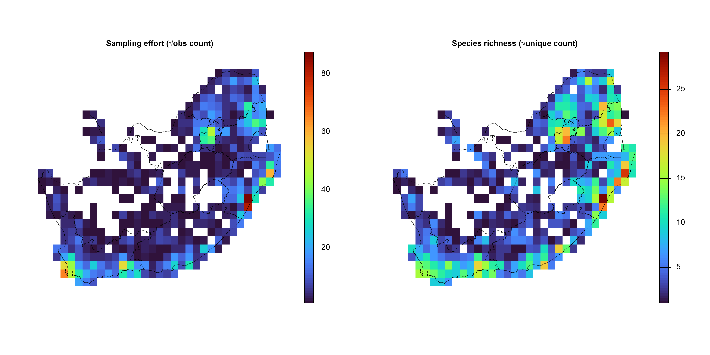
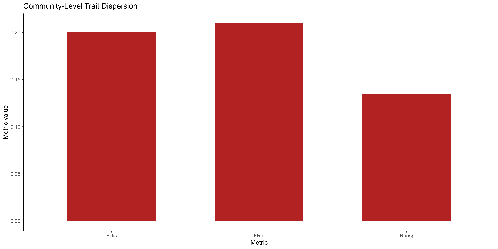
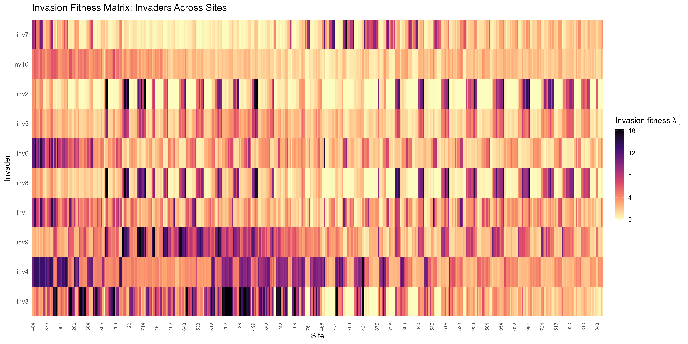

<!-- README.md is generated from README.Rmd. Please edit that file -->
<!-- badges: start -->

[](https://mybinder.org/v2/gh/nithecs-biomath/RBasicPack/master?urlpath=rstudio)
[](https://lifecycle.r-lib.org/articles/stages.html#stable)
[](https://github.com/macSands/invasimapr/actions/workflows/test-coverage.yaml)
[](https://app.codecov.io/gh/macSands/invasimapr)
[](https://github.com/macSands/invasimapr/actions/workflows/R-CMD-check.yaml)

<!-- badges: end -->

------------------------------------------------------------------------

# `invasimapr`

## A Novel Framework to visualise trait dispersion and assess invasiness and invasibility

------------------------------------------------------------------------

## 1. Introduction

Biological invasions pose a major threat to global biodiversity, with
invasive alien species (IAS) often capable of rapidly expanding and
transforming the ecosystems they enter. Given the complex drivers
underlying invasion dynamics, ranging from species interactions and
traits to environmental gradients, rigorous and reproducible workflows
are essential to diagnose how certain species establish and spread in
new habitats. Recent advances in ecological theory, such as
trait-mediated ecological networks and the concept of invasion fitness,
have provided new frameworks for understanding invasions in both
ecological and evolutionary contexts (Hui et al., 2021; Hui et al.,
2016). These approaches highlight the interplay between species traits,
propagule pressure, and ecological networks in shaping invasion
outcomes.

The primary goal of this research milestone is to develop a workflow
that quantifies and visualises invasion fitness, leveraging species
occurrence data and functional trait information. By calculating trait
centrality, visualizing trait dispersion, estimating interaction
strength, and assessing site-level invasibility, we can derive outputs
such as interaction strength matrices, trait-specific invasion risk
factors, and community openness to new invasions. These elements align
with the three-pronged framework proposed by Hui et al. (2023), which
integrates traits, propagule pressure, and environmental context into a
comprehensive invasion model.

------------------------------------------------------------------------

# 2. Workflow and Step-by-Step Tutorial

This workflow demonstrates a comprehensive workflow for quantifying and
visualizing invasion fitness, operationalizing the concepts of **trait
centrality**, **trait dispersion**, **interaction strength**,
**invasibility**, and **invasion fitness** using simulated site-level
species occurrence, abundance, and trait data. Analyses include
calculation of trait-based distances, clustering, trait-space mapping,
generalized linear mixed modeling of abundance, and explicit estimation
of invasion fitness for hypothetical invaders across a landscape.

------------------------------------------------------------------------

## 3. Setup `invasimapr`

### 3.1. Overview of the `invasimapr` R package (incl. Functions)

### 3.2. Install and load `invasimapr`

Install and load the `invasimapr` package from GitHub, ensuring all
functions are available for use in the workflow.

``` r
# # install remotes if needed
# install.packages("remotes")
# remotes::install_github("macSands/invasimapr")

# Ensure the package is loaded when knitting
library(invasimapr)
sessionInfo()$otherPkgs$invasimapr$Version

# Make sure all the functions are loaded
# devtools::load_all() # alternative during local development
```

### 3.3. Load other R libraries

Load core libraries for spatial processing, biodiversity modelling, and
visualization required across the `invasimapr` analysis pipeline.

``` r
# Load essential packages
# library(tidyverse)
# --- Data Wrangling and Manipulation ---
library(dplyr)       # Tidy data manipulation verbs (mutate, select, filter, etc.)
library(tidyr)       # Reshape data (wide ↔ long, pivot functions)
library(tibble)      # Modern lightweight data frames (tibble objects)
library(purrr)       # Functional iteration (map(), etc.)

# --- String and Factor Utilities ---
library(stringr)     # String pattern matching and manipulation (str_detect, etc.)
library(fastDummies) # Quickly create dummy/one-hot variables for factors

# --- Data Visualization ---
library(ggplot2)     # Grammar-of-graphics plotting
library(viridis)     # Colorblind-friendly palettes for ggplot2
library(lattice)     # Trellis (multi-panel) graphics
library(factoextra)  # Visualize clustering and multivariate analyses

# --- Spatial Data ---
library(sf)          # Handling and plotting spatial vector data (simple features)
library(terra)       # Raster and spatial data operations

# --- Statistical and Ecological Modelling ---
library(glmmTMB)     # Fit GLMMs (Generalized Linear Mixed Models), e.g., Tweedie, NB, Poisson
library(MASS)        # Statistical functions and kernel density estimation (kde2d, etc.)
library(cluster)     # Clustering algorithms, Gower distance, diagnostics
library(vegan)       # Community ecology, ordination (PCoA, diversity metrics)
library(geometry)    # Convex hulls, volumes, and related geometry calculations

# --- Model Performance and Diagnostics ---
library(performance) # Model checking, diagnostics, and performance metrics
# options(warn = -1)
```

------------------------------------------------------------------------

## 4. Data access and preparation using `dissmapr`

### 4.1. Install `dissmapr`

To acquire and prepare species occurrence data for biodiversity
modelling using the `dissmapr` package, a series of modular functions
streamline the workflow from raw observations to spatially aligned
environmental predictors.

``` r
# # install remotes if needed
# install.packages("remotes")
# remotes::install_github("macSands/dissmapr")

# Ensure the package is loaded
library(dissmapr)
```

### 4.2. Import and harmonise biodiversity-occurrence data

The process begins with
[`get_occurrence_data()`](https://macsands.github.io/dissmapr/reference/get_occurrence_data.html),
which imports biodiversity records, such as a GBIF butterfly dataset for
South Africa, and harmonizes them into standardised formats. Input
sources can include local CSV files, URLs, or zipped GBIF downloads. The
function filters data by taxon and region, returning both raw records
and site-by-species matrices in presence–absence or abundance form.

``` r
# Use local GBIF data
bfly_data = get_occurrence_data(
  data = system.file("extdata", "gbif_butterflies.csv", package = "dissmapr"),
  source_type = 'local_csv',
  sep = '\t'
)

# Check results but only a subset of columns to fit in console
dim(bfly_data)
#> [1] 81825    52
# str(bfly_data[,c(51,52,22,23,1,14,16,17,30)]) 
head(bfly_data[,c(51,52,22,23,1,14,16,17,30)])
#>   site_id pa         y        x    gbifID             verbatimScientificName
#> 1       1  1 -34.42086 19.24410 923051749                   Pieris brassicae
#> 2       2  1 -33.96044 18.75564 922985630                   Pieris brassicae
#> 3       3  1 -33.91651 18.40321 922619348 Papilio demodocus subsp. demodocus
#> 4       1  1 -34.42086 19.24410 922426210 Mylothris agathina subsp. agathina
#> 5       4  1 -34.35024 18.47488 921650584                  Eutricha capensis
#> 6       5  1 -33.58570 25.65097 921485695            Drepanogynis bifasciata
#>   countryCode                                          locality
#> 1          ZA                                          Hermanus
#> 2          ZA                                   Polkadraai Road
#> 3          ZA                                       Signal Hill
#> 4          ZA                                          Hermanus
#> 5          ZA Cape of Good Hope / Cape Point Area, South Africa
#> 6          ZA                             Kudu Ridge Game Lodge
#>          eventDate
#> 1 2012-10-13T00:00
#> 2 2012-11-01T00:00
#> 3 2012-10-31T00:00
#> 4 2012-10-13T00:00
#> 5 2012-10-30T00:00
#> 6 2012-10-23T00:00

# Use local data adpated from GBIF
# local_df = read.csv('D:/Methods/R/myR_Packages/myCompletePks/invasimapr/inst/extdata/site_species.csv')
# head(local_df)

bfly_data = get_occurrence_data(
  data = system.file("extdata", "site_species.csv", package = "invasimapr"),
  source_type = 'local_csv'
)

# Check results but only a subset of columns to fit in console
dim(bfly_data)
#> [1] 11205     6
str(bfly_data) 
#> 'data.frame':    11205 obs. of  6 variables:
#>  $ site_id: int  1026 1026 1026 1026 1026 1026 1026 1026 1026 1026 ...
#>  $ x      : num  28.8 28.8 28.8 28.8 28.8 ...
#>  $ y      : num  -22.3 -22.3 -22.3 -22.3 -22.3 ...
#>  $ sp_name: chr  "Acraea horta" "Amata cerbera" "Bicyclus safitza safitza" "Cacyreus lingeus" ...
#>  $ count  : int  10 0 0 0 9 8 8 3 19 0 ...
#>  $ abund  : num  10 0 0 0 9 8 8 3 19 0 ...
head(bfly_data)
#>   site_id     x         y                    sp_name count abund
#> 1    1026 28.75 -22.25004               Acraea horta    10    10
#> 2    1026 28.75 -22.25004              Amata cerbera     0     0
#> 3    1026 28.75 -22.25004   Bicyclus safitza safitza     0     0
#> 4    1026 28.75 -22.25004           Cacyreus lingeus     0     0
#> 5    1026 28.75 -22.25004        Charaxes wakefieldi     9     9
#> 6    1026 28.75 -22.25004 Danaus chrysippus orientis     8     8
```

### 4.3. Format Biodiversity Records to Long / Wide

Next,
[`format_df()`](https://macsands.github.io/dissmapr/reference/format_df.html)
restructures the raw records into tidy long and wide formats. This
assigns unique site IDs, extracts key fields (coordinates, species
names, observation values), and prepares two main outputs: `site_obs`
(long format for mapping) and `site_spp` (wide format for species-level
analysis).

``` r
# bfly_result = format_df(
#   data        = bfly_data, # A `data.frame` of biodiversity records
#   species_col = 'verbatimScientificName', # Name of species column (required for `"long"`)
#   value_col   = 'pa', # Name of value column (e.g. presence/abundance; for `"long"`)
#   extra_cols  = NULL, # Character vector of other columns to keep
#   format      = 'long' # Either`"long"` or `"wide"`. If `NULL`, inferred from `species_col` & `value_col`
# )

bfly_result = format_df(
  data        = bfly_data, # A `data.frame` of biodiversity records
  species_col = 'sp_name', # Name of species column (required for `"long"`)
  value_col   = 'count' # Name of value column (e.g. presence/abundance; for `"long"`)
  )

# Check `bfly_result` structure
str(bfly_result, max.level = 1)
#> List of 2
#>  $ site_obs:'data.frame':    11205 obs. of  5 variables:
#>  $ site_spp: tibble [415 × 30] (S3: tbl_df/tbl/data.frame)

# Optional: Create new objects from list items
site_obs = bfly_result$site_obs
site_spp = bfly_result$site_spp

# Check results
dim(site_obs)
#> [1] 11205     5
head(site_obs)
#>   site_id     x         y                    species value
#> 1    1026 28.75 -22.25004               Acraea horta    10
#> 2    1026 28.75 -22.25004              Amata cerbera     0
#> 3    1026 28.75 -22.25004   Bicyclus safitza safitza     0
#> 4    1026 28.75 -22.25004           Cacyreus lingeus     0
#> 5    1026 28.75 -22.25004        Charaxes wakefieldi     9
#> 6    1026 28.75 -22.25004 Danaus chrysippus orientis     8

dim(site_spp)
#> [1] 415  30
head(site_spp[,1:6])
#> # A tibble: 6 × 6
#>   site_id     x     y `Acraea horta` `Amata cerbera` `Bicyclus safitza safitza`
#>     <int> <dbl> <dbl>          <dbl>           <dbl>                      <dbl>
#> 1      82  19.2 -34.8              0               0                         25
#> 2      83  19.8 -34.8              0               7                          0
#> 3      84  20.2 -34.8              0               0                          0
#> 4     117  18.2 -34.3             13               0                         20
#> 5     118  18.8 -34.3              0               0                         24
#> 6     119  19.2 -34.3              0               0                         15

#### Get parameters from processed data to use later
# Number of species
(n_sp = dim(site_spp)[2] - 3)
#> [1] 27

# Species names
sp_cols = names(site_spp)[-c(1:3)]
sp_cols[1:10]
#>  [1] "Acraea horta"               "Amata cerbera"             
#>  [3] "Bicyclus safitza safitza"   "Cacyreus lingeus"          
#>  [5] "Charaxes wakefieldi"        "Danaus chrysippus orientis"
#>  [7] "Dira clytus clytus"         "Eutricha capensis"         
#>  [9] "Hypolimnas misippus"        "Junonia elgiva"
```

### 4.4. Generate Spatial Grid and Gridded Summaries

To integrate the data spatially,
[`generate_grid()`](https://macsands.github.io/dissmapr/reference/generate_grid.html)
overlays a user-defined spatial lattice (e.g. 0.5° grid), aggregates
biodiversity observations per grid cell, and computes standardised
metrics such as species richness and observation effort. Outputs include
gridded species matrices (`grid_spp`, `grid_spp_pa`), a spatial polygon
(`grid_sf`), and raster layers (`grid_r`), enabling downstream spatial
modelling.

``` r
# 1. Load the national boundary 
rsa = sf::st_read(system.file("extdata", "rsa.shp", package = "invasimapr"))
#> Reading layer `rsa' from data source 
#>   `D:\Methods\R\myR_Packages\myCompletePks\invasimapr\inst\extdata\rsa.shp' 
#>   using driver `ESRI Shapefile'
#> Simple feature collection with 11 features and 8 fields
#> Geometry type: MULTIPOLYGON
#> Dimension:     XY
#> Bounding box:  xmin: 16.45189 ymin: -34.83417 xmax: 32.94498 ymax: -22.12503
#> Geodetic CRS:  WGS 84

# 2. Choose a working resolution 
res = 0.5   # decimal degrees° (≈ 55 km at the equator)

# 3. Convert the AoI to a 'terra' vector 
rsa_vect = terra::vect(rsa)

# 4. Initialise a blank raster template 
grid = terra::rast(rsa_vect, resolution = res, crs = terra::crs(rsa_vect))

# 5. Populate the raster with placeholder values 
terra::values(grid) = 1

# 6. Clip the raster to the AoI 
grid_masked = terra::mask(grid, rsa_vect)

# 7. Generate a 0.5° grid summary for the point dataset `site_spp`
grid_list = generate_grid(
  data          = site_spp,           # point data with x/y + species columns
  x_col         = "x",                # longitude column
  y_col         = "y",                # latitude  column
  grid_size     = 0.5,                # cell size in degrees
  sum_cols      = 4:ncol(site_spp),   # columns to aggregate * could also use `names(site_spp)[4:ncol(site_spp)]`
  crs_epsg      = 4326                # WGS84
)

# Inspect the returned list 
str(grid_list, max.level = 1)
#> List of 4
#>  $ grid_r     :S4 class 'SpatRaster' [package "terra"]
#>  $ grid_sf    :Classes 'sf' and 'data.frame':    1110 obs. of  8 variables:
#>   ..- attr(*, "sf_column")= chr "geometry"
#>   ..- attr(*, "agr")= Factor w/ 3 levels "constant","aggregate",..: NA NA NA NA NA NA NA
#>   .. ..- attr(*, "names")= chr [1:7] "centroid_lon" "centroid_lat" "grid_id" "mapsheet" ...
#>  $ grid_spp   : tibble [415 × 33] (S3: tbl_df/tbl/data.frame)
#>  $ grid_spp_pa: tibble [415 × 33] (S3: tbl_df/tbl/data.frame)

# (Optional) Promote list items to named objects 
grid_r = grid_list$grid_r$grid_id    # raster
grid_sf = grid_list$grid_sf   # polygons for mapping or joins
grid_spp = grid_list$grid_spp # tabular summary per cell
grid_spp_pa = grid_list$grid_spp_pa # presence/absence summary

# Quick checks 
dim(grid_sf) #; head(grid_sf)
#> [1] 1110    8
dim(grid_spp) #; head(grid_spp[, 1:8])
#> [1] 415  33
dim(grid_spp_pa) #; head(grid_spp_pa[, 1:8])
#> [1] 415  33

# 1. Extract & stretch the layers 
effRich_r = sqrt(grid_list$grid_r[[c("obs_sum", "spp_rich")]])

# 2. Open a 1×2 layout and plot each layer + outline 
old_par = par(mfrow = c(1, 2), # multi‐figure by row: 1 row and 2 columns 
              mar = c(1, 1, 1, 2))  # margins sizes: bottom (1 lines)|left (1)|top (1)|right (2)

for (i in 1:2) {
  plot(effRich_r[[i]],
       col   = viridisLite::turbo(100),
       colNA = NA,
       axes  = FALSE,
       main  = c("Sampling effort (√obs count)",
                 "Species richness (√unique count)")[i],
       cex.main = 0.8)          # ← smaller title)
  plot(terra::vect(rsa), add = TRUE, border = "black", lwd = 0.4)
}
```



``` r

par(old_par)  # reset plotting parameters
```

### 4.5. Retrieve, crop, resample, and link environmental rasters to sampling sites

Environmental predictors are appended using
[`get_enviro_data()`](https://macsands.github.io/dissmapr/reference/get_enviro_data.html),
which buffers the grid, downloads raster data (e.g. WorldClim
bioclimatic variables), resamples it, and links values to grid-cell
centroids. This produces both a site-by-environment data frame
(`env_df`) and a SpatRaster object (`env_r`), aligning biological and
environmental data.

``` r
# Retrieve 19 bioclim layers (≈10-km, WorldClim v2.1) for all grid centroids
data_path = "inst/extdata"               # cache folder for rasters
enviro_list = get_enviro_data(
  data       = grid_spp,                  # centroids + obs_sum + spp_rich
  buffer_km  = 10,                        # pad the AOI slightly
  source     = "geodata",                 # WorldClim/SoilGrids interface
  var        = "bio",                     # bioclim variable set
  res        = 5,                         # 5-arc-min ≈ 10 km
  grid_r     = grid_r,                      # To set resampling resolution, if necessary
  path       = data_path,
  sp_cols    = 7:ncol(grid_spp),          # ignore species columns
  ext_cols   = c("obs_sum", "spp_rich")   # carry effort & richness through
)

# Quick checks 
str(enviro_list, max.level = 1)
#> List of 3
#>  $ env_rast:S4 class 'SpatRaster' [package "terra"]
#>  $ sites_sf: sf [415 × 2] (S3: sf/tbl_df/tbl/data.frame)
#>   ..- attr(*, "sf_column")= chr "geometry"
#>   ..- attr(*, "agr")= Factor w/ 3 levels "constant","aggregate",..: NA
#>   .. ..- attr(*, "names")= chr "grid_id"
#>  $ env_df  : tibble [415 × 24] (S3: tbl_df/tbl/data.frame)

# (Optional) Assign concise layer names for readability
# Find names here https://www.worldclim.org/data/bioclim.html
names_env = c("temp_mean","mdr","iso","temp_sea","temp_max","temp_min",
              "temp_range","temp_wetQ","temp_dryQ","temp_warmQ",
              "temp_coldQ","rain_mean","rain_wet","rain_dry",
              "rain_sea","rain_wetQ","rain_dryQ","rain_warmQ","rain_coldQ")
names(enviro_list$env_rast) = names_env

# (Optional) Promote frequently-used objects
env_r = enviro_list$env_rast    # cropped climate stack
env_df = enviro_list$env_df      # site × environment data-frame

# Quick checks 
env_r; dim(env_df); head(env_df)
#> class       : SpatRaster 
#> size        : 30, 37, 19  (nrow, ncol, nlyr)
#> resolution  : 0.5, 0.5  (x, y)
#> extent      : 15.5, 34, -36, -21  (xmin, xmax, ymin, ymax)
#> coord. ref. : lon/lat WGS 84 (EPSG:4326) 
#> source(s)   : memory
#> names       : temp_mean,       mdr,      iso, temp_sea, temp_max,  temp_min, ... 
#> min values  :  9.779773,  8.977007, 47.10606, 228.9986, 19.92147, -4.110302, ... 
#> max values  : 24.406433, 18.352308, 64.92966, 653.4167, 36.19497, 12.005042, ...
#> [1] 415  24
#> # A tibble: 6 × 24
#>   grid_id centroid_lon centroid_lat bio01 bio02 bio03 bio04 bio05 bio06 bio07
#>   <chr>          <dbl>        <dbl> <dbl> <dbl> <dbl> <dbl> <dbl> <dbl> <dbl>
#> 1 1026            28.8        -22.3  21.9  14.5  55.8  425.  32.5  6.44  26.1
#> 2 1027            29.2        -22.3  21.8  14.5  55.1  430.  32.6  6.30  26.3
#> 3 1028            29.7        -22.3  22.0  14.2  56.3  396.  32.3  7.15  25.2
#> 4 1029            30.3        -22.3  22.8  13.9  58.0  359.  32.7  8.79  23.9
#> 5 1030            30.8        -22.3  23.3  13.9  60.0  332.  33.2  9.97  23.2
#> 6 1031            31.3        -22.3  24.2  14.2  61.3  326.  34.2 10.9   23.2
#> # ℹ 14 more variables: bio08 <dbl>, bio09 <dbl>, bio10 <dbl>, bio11 <dbl>,
#> #   bio12 <dbl>, bio13 <dbl>, bio14 <dbl>, bio15 <dbl>, bio16 <dbl>,
#> #   bio17 <dbl>, bio18 <dbl>, bio19 <dbl>, obs_sum <dbl>, spp_rich <dbl>

# Build the final site × environment table
grid_env = env_df %>%
  dplyr::select(grid_id, centroid_lon, centroid_lat,
                obs_sum, spp_rich, dplyr::everything())

str(grid_env, max.level = 1)
#> tibble [415 × 24] (S3: tbl_df/tbl/data.frame)
head(grid_env)
#> # A tibble: 6 × 24
#>   grid_id centroid_lon centroid_lat obs_sum spp_rich bio01 bio02 bio03 bio04
#>   <chr>          <dbl>        <dbl>   <dbl>    <dbl> <dbl> <dbl> <dbl> <dbl>
#> 1 1026            28.8        -22.3     172       17  21.9  14.5  55.8  425.
#> 2 1027            29.2        -22.3      92        9  21.8  14.5  55.1  430.
#> 3 1028            29.7        -22.3     131       11  22.0  14.2  56.3  396.
#> 4 1029            30.3        -22.3     129       12  22.8  13.9  58.0  359.
#> 5 1030            30.8        -22.3     136       13  23.3  13.9  60.0  332.
#> 6 1031            31.3        -22.3      99       13  24.2  14.2  61.3  326.
#> # ℹ 15 more variables: bio05 <dbl>, bio06 <dbl>, bio07 <dbl>, bio08 <dbl>,
#> #   bio09 <dbl>, bio10 <dbl>, bio11 <dbl>, bio12 <dbl>, bio13 <dbl>,
#> #   bio14 <dbl>, bio15 <dbl>, bio16 <dbl>, bio17 <dbl>, bio18 <dbl>,
#> #   bio19 <dbl>
```

### 4.6. Remove Highly Correlated Predictors (optional)

Finally,
[`rm_correlated()`](https://macsands.github.io/dissmapr/reference/rm_correlated.html)
optionally reduces multicollinearity by filtering out highly correlated
predictors based on a threshold (e.g. r \> 0.70), improving model
stability and interpretability. Together, these functions provide a
reproducible and scalable pipeline for preparing ecological datasets for
spatial analysis.

``` r
# # (Optional) Rename BIO
# names(env_df) = c("grid_id", "centroid_lon", "centroid_lat", names_env, "obs_sum", "spp_rich")
#   
# # Run the filter and compare dimensions
# # Filter environmental predictors for |r| > 0.70
# env_vars_reduced = rm_correlated(
#   data       = env_df[, 4:23],  # drop ID + coord columns
#   cols       = NULL,                  # infer all numeric cols
#   threshold  = 0.70,
#   plot       = TRUE                   # show heat-map of retained vars
# )
# 
# # Before vs after
# c(original = ncol(env_df[, c(4, 6:24)]),
#   reduced  = ncol(env_vars_reduced))
```

------------------------------------------------------------------------

## 5. Data access and preparation using `invasimapr`

### 5.1. Reshape and Clean Site-by-Species Observation Matrix

This step converts the wide site-by-species abundance matrix into a
long-format data frame, suitable for downstream ecological modeling and
trait linkage. The process includes:

- **Dropping unnecessary metadata** (e.g., mapsheet columns)
- **Pivoting to long format** so each row represents a unique
  site-species observation
- **Filtering out missing species** and absent (zero count) records
- **Optionally filtering** for sufficiently abundant species or
  high-confidence observations

These actions ensure your analysis is based on well-sampled taxa and
avoids downstream issues related to sparse or missing data.

``` r
# Reshape site-by-species matrix to long format and clean
grid_obs = grid_spp %>% 
  dplyr::select(-mapsheet) %>%                         # Drop mapsheet metadata
  pivot_longer(
    cols = -c(grid_id, centroid_lon, centroid_lat,     # Keep core metadata columns only
              obs_sum, spp_rich),
    names_to  = "species",
    values_to = "count",
    values_drop_na = TRUE ) %>%                        # Drop missing values
  filter(count > 0) %>%                                # Remove zero-count (absent) records
  relocate(grid_id, centroid_lon, centroid_lat,
           obs_sum, spp_rich, species, count)

# # Only keep observations where species have >500 observations
# site_spp_obs = site_spp_obs %>%
#   # select only the columns you care about
#   dplyr::select(10, 13, 14, 16:17, 19, 22:23, 30:33) %>%
#   # drop rows where species is NA
#   filter(!is.na(species)) %>%
#   # add a count column called "n_obs"
#   add_count(species, name = "n_obs") %>%
#   # keep only species with >100 observations
#   filter(n_obs > 500) %>%
#   # (optional) sort by descending count
#   arrange(desc(n_obs))

# # Further filter: retain only observations with count > 10 and non-missing species
# grid_obs = grid_obs %>%
#   filter(!is.na(species)) %>%
#   filter(count > 10) %>%
#   arrange(desc(count))                                 # Optionally, sort by descending count

# Final data check
# Examine structure and summary statistics before further filtering
str(grid_obs)
#> tibble [3,839 × 7] (S3: tbl_df/tbl/data.frame)
#>  $ grid_id     : chr [1:3839] "1026" "1026" "1026" "1026" ...
#>  $ centroid_lon: num [1:3839] 28.8 28.8 28.8 28.8 28.8 ...
#>  $ centroid_lat: num [1:3839] -22.3 -22.3 -22.3 -22.3 -22.3 ...
#>  $ obs_sum     : num [1:3839] 172 172 172 172 172 172 172 172 172 172 ...
#>  $ spp_rich    : num [1:3839] 17 17 17 17 17 17 17 17 17 17 ...
#>  $ species     : chr [1:3839] "Acraea horta" "Charaxes wakefieldi" "Danaus chrysippus orientis" "Dira clytus clytus" ...
#>  $ count       : num [1:3839] 10 9 8 8 3 19 9 9 6 13 ...
dim(grid_obs)
#> [1] 3839    7
length(unique(grid_obs$species))
#> [1] 27
summary(grid_obs$count)
#>    Min. 1st Qu.  Median    Mean 3rd Qu.    Max. 
#>    1.00    6.00    9.00   10.88   14.00   87.00
```

### 5.2. Retrieve and Link Trait and Metadata for Each Species

This utility provides an automated pipeline for extracting and joining
both biological trait data and rich metadata for any focal species. The
function integrates several steps:

1.  **Trait Table Lookup**: Retrieves species’ trait data from a local
    trait table (CSV) or a
    [TRY](https://www.try-db.org/TryWeb/Home.php)-style database, using
    fuzzy matching to ensure robust linkage even when there are minor
    naming inconsistencies.
2.  **Wikipedia Metadata Scraping**: Optionally augments each species
    entry with a taxonomic summary, higher taxonomy, and representative
    images scraped directly from
    [Wikipedia](https://www.wikipedia.org/).
3.  **Image-based Color Palette Extraction**: If enabled, downloads and
    processes public domain images to extract the most frequent colors,
    optionally removing green/white backgrounds to focus on diagnostic
    features.
4.  **Flexible Output**: Returns a single-row tibble with the species
    name, trait data, taxonomic metadata, image URL, and color palette -
    all harmonized for downstream analyses or visualization.

This function greatly simplifies the assembly of a unified
species-trait-metadata table, which is essential for trait-based
community ecology, macroecology, and biodiversity informatics projects.

``` r
# # Local trait data.frame version 1
# btfly_traits1 = read.csv("D:/Data/Traits/Butterflies/Middleton_etal_2020/Middleton_etal_2020_traits.csv") # adjust path
# btfly_traits1 = read.csv(system.file("extdata", "Middleton_etal_2020_traits.csv", package = "invasimapr"))
# str(btfly_traits1)
# length(unique(btfly_traits1$Species))
# 
# # Github trait data.frame
# git_url = "https://raw.githubusercontent.com/RiesLabGU/LepTraits/main/consensus/consensus.csv"
# # Make sure inst/extdata exists then define destination
# dir.create("inst/extdata", recursive = TRUE, showWarnings = FALSE)
# destfile = file.path("inst", "extdata", "consensus.csv")
# 
# # Download the raw CSV
# download.file(
#   url = git_url,
#   destfile = destfile,
#   mode = "wb"    # important on Windows
# )
# 
# # 4. Read it from disk
# btfly_traits2 = read.csv(destfile, stringsAsFactors = FALSE)
# str(btfly_traits2)
# length(unique(btfly_traits2$Species))
# 
# # Retrieve and join trait/metadata for all species in the observation set
# spp_traits = purrr::map_dfr(
#   unique(grid_obs$species),
#   ~get_trait_data(
#     species = .x,
#     remove_bg = FALSE,
#     n_palette = 5,
#     preview = FALSE,
#     save_folder = NULL,
#     do_summary = TRUE,
#     do_taxonomy = TRUE,
#     do_image = TRUE,
#     do_palette = TRUE,
#     use_try = FALSE,
#     try_data = NULL,
#     # local_trait_df = btfly_traits1,
#     local_trait_df = btfly_traits2,
#     local_species_col = 'Species',
#     # github_url = git_url,
#     max_dist = 1
#   )
# )

# Local trait data.frame version 2
# btfly_traits3 = read.csv("D:/Methods/R/myR_Packages/myCompletePks/invasimapr/inst/extdata/species_traits.csv") # adjust path
btfly_traits3 = read.csv(system.file("extdata", "species_traits.csv", package = "invasimapr"))
str(btfly_traits3)
#> 'data.frame':    27 obs. of  21 variables:
#>  $ species     : chr  "Acraea horta" "Amata cerbera" "Bicyclus safitza safitza" "Cacyreus lingeus" ...
#>  $ trait_cont1 : num  0.83 0.874 -0.428 0.661 0.283 ...
#>  $ trait_cont2 : num  0.811 -0.106 0.672 0.475 0.622 ...
#>  $ trait_cont3 : num  -0.922 0.498 0.355 -0.657 -0.478 ...
#>  $ trait_cont4 : num  -0.684 -0.282 0.291 0.552 0.127 ...
#>  $ trait_cont5 : num  0.0715 -0.9955 0.2179 0.6736 0.503 ...
#>  $ trait_cont6 : num  0.16 0.643 -0.773 0.529 0.247 ...
#>  $ trait_cont7 : num  0.2035 -0.606 0.0705 -0.6409 -0.0962 ...
#>  $ trait_cont8 : num  -0.425 -0.611 0.568 -0.742 -0.742 ...
#>  $ trait_cont9 : num  0.1493 -0.2933 0.0949 0.7854 -0.02 ...
#>  $ trait_cont10: num  -0.5772 0.0992 -0.036 -0.6811 -0.7008 ...
#>  $ trait_cat11 : chr  "wetland" "forest" "wetland" "wetland" ...
#>  $ trait_cat12 : chr  "diurnal" "nocturnal" "diurnal" "nocturnal" ...
#>  $ trait_cat13 : chr  "bivoltine" "multivoltine" "univoltine" "multivoltine" ...
#>  $ trait_cat14 : chr  "detritivore" "detritivore" "generalist" "nectarivore" ...
#>  $ trait_cat15 : chr  "migratory" "resident" "resident" "migratory" ...
#>  $ trait_ord16 : int  4 1 4 3 4 1 1 4 1 1 ...
#>  $ trait_ord17 : int  1 4 4 3 2 4 3 5 4 3 ...
#>  $ trait_bin18 : int  1 1 1 0 1 1 1 1 0 0 ...
#>  $ trait_bin19 : int  1 0 1 0 0 1 1 1 0 1 ...
#>  $ trait_ord20 : chr  "medium" "large" "medium" "medium" ...
# length(unique(btfly_traits3$species))

# Retrieve and join trait/metadata for all species in the observation set
spp_traits = purrr::map_dfr(
  unique(grid_obs$species),
  ~get_trait_data(
    species = .x,
    n_palette = 5,
    preview = FALSE,
    do_summary = TRUE,
    do_taxonomy = TRUE,
    do_image = TRUE,
    do_palette = TRUE,
    local_trait_df = btfly_traits3,
    local_species_col = 'species',
    max_dist = 1
  )
)
# The final output combines trait data, taxonomic info, Wikipedia summary, images, and color palette for each species.
# This integrated dataset supports multi-faceted biodiversity, trait, and visualization analyses.

str(spp_traits)
#> tibble [27 × 29] (S3: tbl_df/tbl/data.frame)
#>  $ species     : chr [1:27] "Acraea horta" "Charaxes wakefieldi" "Danaus chrysippus orientis" "Dira clytus clytus" ...
#>  $ summary     : chr [1:27] "Acraea horta or the garden acraea is a butterfly of the family Nymphalidae. It is found in South Africa and Zimbabwe." "Euxanthe wakefieldi, the forest queen, is a butterfly of the family Nymphalidae. It is found in South Africa, f"| __truncated__ NA "Dira clytus, the Cape autumn widow, is a butterfly of the family Nymphalidae. It is found in South Africa." ...
#>  $ Kingdom     : Named chr [1:27] "Animalia" "Animalia" NA "Animalia" ...
#>   ..- attr(*, "names")= chr [1:27] "Kingdom" "Kingdom" "Kingdom" "Kingdom" ...
#>  $ Phylum      : Named chr [1:27] "Arthropoda" "Arthropoda" NA "Arthropoda" ...
#>   ..- attr(*, "names")= chr [1:27] "Phylum" "Phylum" "Phylum" "Phylum" ...
#>  $ Class       : Named chr [1:27] "Insecta" "Insecta" NA "Insecta" ...
#>   ..- attr(*, "names")= chr [1:27] "Class" "Class" "Class" "Class" ...
#>  $ Order       : Named chr [1:27] "Lepidoptera" "Lepidoptera" NA "Lepidoptera" ...
#>   ..- attr(*, "names")= chr [1:27] "Order" "Order" "Order" "Order" ...
#>  $ Family      : Named chr [1:27] "Nymphalidae" "Nymphalidae" NA "Nymphalidae" ...
#>   ..- attr(*, "names")= chr [1:27] "Family" "Family" "Family" "Family" ...
#>  $ img_url     : chr [1:27] "https://upload.wikimedia.org/wikipedia/commons/thumb/f/fc/Garden_acraea_%28Acraea_horta%29.jpg/250px-Garden_acr"| __truncated__ "https://upload.wikimedia.org/wikipedia/commons/thumb/0/0f/GroseSmithKirby1892RhopExotNEPlate1%2C_1%2C_%E2%99%80"| __truncated__ NA "https://upload.wikimedia.org/wikipedia/commons/thumb/c/ce/SeitzFaunaAfricanaXIIITaf28%2C_Dira_clytus.jpg/250px-"| __truncated__ ...
#>  $ palette     : chr [1:27] "#404A14, #9AA552, #BDC57C, #6F782D, #DE8345" "#988976, #37200C, #D1CBBE, #FDFBF9, #644D35" NA "#FEFDFC, #4F1D09, #885B39, #C5B091, #6B3110" ...
#>  $ trait_cont1 : num [1:27] 0.8296 0.2835 0.0382 0.4732 -0.7307 ...
#>  $ trait_cont2 : num [1:27] 0.811 0.622 -0.224 0.37 -0.992 ...
#>  $ trait_cont3 : num [1:27] -0.9221 -0.4778 0.0288 0.3512 0.9656 ...
#>  $ trait_cont4 : num [1:27] -0.684 0.127 -0.533 -0.82 -0.829 ...
#>  $ trait_cont5 : num [1:27] 0.0715 0.503 -0.0945 0.0716 0.0748 ...
#>  $ trait_cont6 : num [1:27] 0.1596 0.2472 -0.7031 -0.8395 -0.0719 ...
#>  $ trait_cont7 : num [1:27] 0.2035 -0.0962 -0.3659 -0.7677 -0.6278 ...
#>  $ trait_cont8 : num [1:27] -0.4245 -0.7418 -0.8555 -0.8937 0.0637 ...
#>  $ trait_cont9 : num [1:27] 0.1493 -0.02 -0.6567 0.0861 0.9229 ...
#>  $ trait_cont10: num [1:27] -0.57722 -0.70084 -0.00145 0.88113 -0.33154 ...
#>  $ trait_cat11 : chr [1:27] "wetland" "forest" "grassland" "forest" ...
#>  $ trait_cat12 : chr [1:27] "diurnal" "nocturnal" "diurnal" "diurnal" ...
#>  $ trait_cat13 : chr [1:27] "bivoltine" "bivoltine" "univoltine" "bivoltine" ...
#>  $ trait_cat14 : chr [1:27] "detritivore" "generalist" "detritivore" "detritivore" ...
#>  $ trait_cat15 : chr [1:27] "migratory" "migratory" "migratory" "resident" ...
#>  $ trait_ord16 : int [1:27] 4 4 1 1 4 1 3 1 2 2 ...
#>  $ trait_ord17 : int [1:27] 1 2 4 3 5 4 1 3 5 2 ...
#>  $ trait_bin18 : int [1:27] 1 1 1 1 1 0 0 0 0 0 ...
#>  $ trait_bin19 : int [1:27] 1 0 1 1 1 0 1 0 1 1 ...
#>  $ trait_ord20 : chr [1:27] "medium" "medium" "medium" "large" ...
head(spp_traits)
#> # A tibble: 6 × 29
#>   species  summary Kingdom Phylum Class Order Family img_url palette trait_cont1
#>   <chr>    <chr>   <chr>   <chr>  <chr> <chr> <chr>  <chr>   <chr>         <dbl>
#> 1 Acraea … Acraea… Animal… Arthr… Inse… Lepi… Nymph… https:… #404A1…      0.830 
#> 2 Charaxe… Euxant… Animal… Arthr… Inse… Lepi… Nymph… https:… #98897…      0.283 
#> 3 Danaus … <NA>    <NA>    <NA>   <NA>  <NA>  <NA>   <NA>    <NA>         0.0382
#> 4 Dira cl… Dira c… Animal… Arthr… Inse… Lepi… Nymph… https:… #FEFDF…      0.473 
#> 5 Eutrich… Eutric… Animal… Arthr… Inse… Lepi… Lasio… https:… #BB927…     -0.731 
#> 6 Hypolim… Hypoli… Animal… Arthr… Inse… Lepi… Nymph… https:… #B2A79…      0.314 
#> # ℹ 19 more variables: trait_cont2 <dbl>, trait_cont3 <dbl>, trait_cont4 <dbl>,
#> #   trait_cont5 <dbl>, trait_cont6 <dbl>, trait_cont7 <dbl>, trait_cont8 <dbl>,
#> #   trait_cont9 <dbl>, trait_cont10 <dbl>, trait_cat11 <chr>,
#> #   trait_cat12 <chr>, trait_cat13 <chr>, trait_cat14 <chr>, trait_cat15 <chr>,
#> #   trait_ord16 <int>, trait_ord17 <int>, trait_bin18 <int>, trait_bin19 <int>,
#> #   trait_ord20 <chr>

# Count how many non‐NA IDs
length(unique(btfly_traits3$species))
#> [1] 27
length(unique(grid_obs$species))
#> [1] 27
sum(!is.na(spp_traits$species))
#> [1] 27
```

### 5.3. Load local combined site, environment, and trait data

``` r
# Optional - Set working directory
# setwd('D:/Methods/R/myR_Packages/myCompletePks/invasimapr/inst/extdata')

# Read primary data (one row per site–species combination)
# site_env_spp = read.csv('site_env_spp_simulated.csv')
site_env_spp = read.csv(system.file("extdata", "site_env_spp_simulated.csv", package = "invasimapr"))
dim(site_env_spp)
#> [1] 11205    36
str(site_env_spp)
#> 'data.frame':    11205 obs. of  36 variables:
#>  $ site_id     : int  1026 1026 1026 1026 1026 1026 1026 1026 1026 1026 ...
#>  $ x           : num  28.8 28.8 28.8 28.8 28.8 ...
#>  $ y           : num  -22.3 -22.3 -22.3 -22.3 -22.3 ...
#>  $ species     : chr  "Acraea horta" "Amata cerbera" "Bicyclus safitza safitza" "Cacyreus lingeus" ...
#>  $ count       : int  10 0 0 0 9 8 8 3 19 0 ...
#>  $ trait_cont1 : num  0.83 0.874 -0.428 0.661 0.283 ...
#>  $ trait_cont2 : num  0.811 -0.106 0.672 0.475 0.622 ...
#>  $ trait_cont3 : num  -0.922 0.498 0.355 -0.657 -0.478 ...
#>  $ trait_cont4 : num  -0.684 -0.282 0.291 0.552 0.127 ...
#>  $ trait_cont5 : num  0.0715 -0.9955 0.2179 0.6736 0.503 ...
#>  $ trait_cont6 : num  0.16 0.643 -0.773 0.529 0.247 ...
#>  $ trait_cont7 : num  0.2035 -0.606 0.0705 -0.6409 -0.0962 ...
#>  $ trait_cont8 : num  -0.425 -0.611 0.568 -0.742 -0.742 ...
#>  $ trait_cont9 : num  0.1493 -0.2933 0.0949 0.7854 -0.02 ...
#>  $ trait_cont10: num  -0.5772 0.0992 -0.036 -0.6811 -0.7008 ...
#>  $ trait_cat11 : chr  "wetland" "forest" "wetland" "wetland" ...
#>  $ trait_cat12 : chr  "diurnal" "nocturnal" "diurnal" "nocturnal" ...
#>  $ trait_cat13 : chr  "bivoltine" "multivoltine" "univoltine" "multivoltine" ...
#>  $ trait_cat14 : chr  "detritivore" "detritivore" "generalist" "nectarivore" ...
#>  $ trait_cat15 : chr  "migratory" "resident" "resident" "migratory" ...
#>  $ trait_ord16 : int  4 1 4 3 4 1 1 4 1 1 ...
#>  $ trait_ord17 : int  1 4 4 3 2 4 3 5 4 3 ...
#>  $ trait_bin18 : int  1 1 1 0 1 1 1 1 0 0 ...
#>  $ trait_bin19 : int  1 0 1 0 0 1 1 1 0 1 ...
#>  $ trait_ord20 : chr  "medium" "large" "medium" "medium" ...
#>  $ env1        : num  2.2 2.2 2.2 2.2 2.2 ...
#>  $ env2        : num  0.647 0.647 0.647 0.647 0.647 ...
#>  $ env3        : num  -0.491 -0.491 -0.491 -0.491 -0.491 ...
#>  $ env4        : num  -0.793 -0.793 -0.793 -0.793 -0.793 ...
#>  $ env5        : num  0.822 0.822 0.822 0.822 0.822 ...
#>  $ env6        : num  1.55 1.55 1.55 1.55 1.55 ...
#>  $ env7        : num  0.419 0.419 0.419 0.419 0.419 ...
#>  $ env8        : num  -1.05 -1.05 -1.05 -1.05 -1.05 ...
#>  $ env9        : num  -0.0537 -0.0537 -0.0537 -0.0537 -0.0537 ...
#>  $ env10       : num  0.933 0.933 0.933 0.933 0.933 ...
#>  $ cat11_num   : int  -1 1 -1 -1 1 0 1 -1 1 0 ...

# # Format 'dissmapr' output to be the same
# grid_obs = grid_obs %>%
#   rename(
#     site_id = grid_id,    # Change 'grid_id' to 'site_id'
#     x = centroid_lon,     # Change 'centroid_lon' to 'x'
#     y = centroid_lat      # Change 'centroid_lat' to 'y'
#   )

# grid_env = grid_env %>%
#   rename(
#     site_id = grid_id,      # Change 'grid_id' to 'site_id'
#     x = centroid_lon,     # Change 'centroid_lon' to 'x'
#     y = centroid_lat      # Change 'centroid_lat' to 'y'
#   )

# Check the results
names(grid_obs)
#> [1] "grid_id"      "centroid_lon" "centroid_lat" "obs_sum"      "spp_rich"    
#> [6] "species"      "count"
# names(grid_env)
```

------------------------------------------------------------------------

## 6. Model inputs

First shape your data so every row is “one species at one site,” with
that species’ traits and that site’s environment.

### 6.1. Extract **site-locations**

This section isolates the unique spatial coordinates for each sampling
site. The resulting table (`site_xy`) will be used for spatial mapping,
distance calculations, and for merging environmental and biodiversity
metrics with precise locations.

``` r
# Create site coordinate table i.e. # Unique site coordinates
site_xy = site_env_spp %>%
  dplyr::select(site_id, x, y) %>%
  distinct() %>%
  mutate(.site_id_rn = site_id) %>%
  column_to_rownames(var = ".site_id_rn")
head(site_xy)
#>      site_id     x         y
#> 1026    1026 28.75 -22.25004
#> 1027    1027 29.25 -22.25004
#> 1028    1028 29.75 -22.25004
#> 1029    1029 30.25 -22.25004
#> 1030    1030 30.75 -22.25004
#> 1031    1031 31.25 -22.25004
```

### 6.2. Extract **site-environment** variables

Here, we extract a site-by-environment matrix containing the values of
all measured environmental covariates at each sampling site. This matrix
(`site_env`) enables analyses of environmental gradients, spatial
drivers of community composition, and covariate modeling.

``` r
# Site-by-environment matrix
site_env = site_env_spp %>%
  dplyr::select(site_id, x, y,
                env1:env10) %>%
  mutate(site_id = as.character(site_id)) %>%  # ensure character
  distinct() %>%
  mutate(.site_id_rn = site_id) %>%
  column_to_rownames(var = ".site_id_rn")
dim(site_env)
#> [1] 415  13
head(site_env[1:6,1:6])
#>      site_id     x         y     env1      env2       env3
#> 1026    1026 28.75 -22.25004 2.203029 0.6471631 -0.4910981
#> 1027    1027 29.25 -22.25004 2.086006 1.4025519 -0.4471106
#> 1028    1028 29.75 -22.25004 2.233508 0.8008731 -0.5405243
#> 1029    1029 30.25 -22.25004 2.333375 1.1607272 -0.4405388
#> 1030    1030 30.75 -22.25004 2.153073 1.2747649 -0.2945477
#> 1031    1031 31.25 -22.25004 2.046307 1.4773531 -0.4125693

# site_env = grid_env %>%
#   dplyr::select(site_id, x, y, 
#                 obs_sum, spp_rich, 
#                 bio01:bio19) %>%
#   distinct() %>%
#   mutate(.site_id_rn = site_id) %>%
#   column_to_rownames(var = ".site_id_rn")

dim(site_env)
#> [1] 415  13
head(site_env[1:6,1:6])
#>      site_id     x         y     env1      env2       env3
#> 1026    1026 28.75 -22.25004 2.203029 0.6471631 -0.4910981
#> 1027    1027 29.25 -22.25004 2.086006 1.4025519 -0.4471106
#> 1028    1028 29.75 -22.25004 2.233508 0.8008731 -0.5405243
#> 1029    1029 30.25 -22.25004 2.333375 1.1607272 -0.4405388
#> 1030    1030 30.75 -22.25004 2.153073 1.2747649 -0.2945477
#> 1031    1031 31.25 -22.25004 2.046307 1.4773531 -0.4125693
```

### 6.3. Extract **site-species** abundances and presence-absence

This section generates two site-by-species matrices: one containing
abundances (`site_spp_ab`), and one indicating presence-absence
(`site_spp_pa`). These matrices are fundamental for calculating
community diversity, richness, and for modeling occupancy and abundance
patterns.

``` r
# Site-by-species abundance matrix (wide format)
# site_spp_ab = grid_obs %>%
site_spp_ab = site_env_spp %>% # 
  dplyr::select(site_id, x, y, species, count) %>%
  pivot_wider(
    names_from  = species,
    values_from = count,
    values_fill = list(count = 0)
  ) %>%
  mutate(.site_id_rn = site_id) %>%
  column_to_rownames(var = ".site_id_rn")
dim(site_spp_ab)
#> [1] 415  30
head(site_spp_ab[1:6,1:6])
#>      site_id     x         y Acraea horta Amata cerbera
#> 1026    1026 28.75 -22.25004           10             0
#> 1027    1027 29.25 -22.25004            0             7
#> 1028    1028 29.75 -22.25004            0             0
#> 1029    1029 30.25 -22.25004            0            31
#> 1030    1030 30.75 -22.25004            0            12
#> 1031    1031 31.25 -22.25004            0             7
#>      Bicyclus safitza safitza
#> 1026                        0
#> 1027                        0
#> 1028                        0
#> 1029                        0
#> 1030                        3
#> 1031                        0

# Site-by-species presence/absence matrix (wide format)
# site_spp_pa = grid_obs %>%
site_spp_pa = site_env_spp %>% 
  mutate(pa = as.integer(count > 0)) %>%
  dplyr::select(site_id, x, y, species, pa) %>%
  pivot_wider(
    names_from  = species,
    values_from = pa,
    values_fill = list(pa = 0)
  ) %>%
  mutate(.site_id_rn = site_id) %>%
  column_to_rownames(var = ".site_id_rn")
dim(site_spp_pa)
#> [1] 415  30
head(site_spp_pa[1:6,1:6])
#>      site_id     x         y Acraea horta Amata cerbera
#> 1026    1026 28.75 -22.25004            1             0
#> 1027    1027 29.25 -22.25004            0             1
#> 1028    1028 29.75 -22.25004            0             0
#> 1029    1029 30.25 -22.25004            0             1
#> 1030    1030 30.75 -22.25004            0             1
#> 1031    1031 31.25 -22.25004            0             1
#>      Bicyclus safitza safitza
#> 1026                        0
#> 1027                        0
#> 1028                        0
#> 1029                        0
#> 1030                        1
#> 1031                        0
```

### 6.4. Extract **species-trait** values

Here we build the species-by-trait matrix (`spp_trait`), including all
measured continuous, categorical, and ordinal traits for each species.
This structure is central for trait-based analyses of community
assembly, functional diversity, and invasion processes.

``` r
# Species-by-trait matrix (wide)
# Extract and process continuous, categorical, and ordinal trait data
spp_trait = spp_traits %>% # site_env_spp
  dplyr::select(species, trait_cont1:trait_cont10, 
                trait_cat11:trait_cat15, 
                trait_ord16:trait_ord20) %>%
  distinct() %>%
  mutate(.species_rn = species) %>%
  column_to_rownames(var = ".species_rn") %>%
  mutate(across(where(is.character), as.factor))

dim(spp_trait)
#> [1] 27 21
head(spp_trait[1:6,1:6])
#>                                               species trait_cont1 trait_cont2
#> Acraea horta                             Acraea horta   0.8296121   0.8114763
#> Charaxes wakefieldi               Charaxes wakefieldi   0.2834910   0.6221103
#> Danaus chrysippus orientis Danaus chrysippus orientis   0.0381919  -0.2237834
#> Dira clytus clytus                 Dira clytus clytus   0.4731766   0.3703395
#> Eutricha capensis                   Eutricha capensis  -0.7306668  -0.9921033
#> Hypolimnas misippus               Hypolimnas misippus   0.3139846   0.6658322
#>                            trait_cont3 trait_cont4 trait_cont5
#> Acraea horta               -0.92212702  -0.6841896  0.07152258
#> Charaxes wakefieldi        -0.47782407   0.1272937  0.50304513
#> Danaus chrysippus orientis  0.02882587  -0.5325932 -0.09453685
#> Dira clytus clytus          0.35121455  -0.8200390  0.07157999
#> Eutricha capensis           0.96563440  -0.8287759  0.07475339
#> Hypolimnas misippus         0.51908854  -0.3895633 -0.99723831
```

------------------------------------------------------------------------

## 3. Summarize Site-Level Diversity

This section quantifies and visualizes site-level biodiversity, focusing
on local species richness and abundance. Calculating these metrics is
essential for mapping alpha diversity, assessing community structure,
and identifying spatial patterns of biodiversity hotspots and
low-diversity areas across the study landscape.

- **Species richness** (spp_rich<sub>k</sub>): the number of species
  present (non-zero counts) at site k.
- **Total abundance** (obs_sum<sub>k</sub>): the sum of all individual
  counts across species at site k (a proxy for sampling effort).
- **Mean abundance per species** (obs_mean<sub>k</sub>): total abundance
  at the site divided by the number of species columns (S); effectively
  the average count per species regardless of whether it is present.

``` r
# Calculate site-level diversity metrics from the species-by-abundance matrix:
spp_rich_obs = site_spp_ab %>%
  mutate(
    spp_rich = rowSums(dplyr::select(., -site_id, -x, -y) > 0), # Species richness: number of species present
    obs_sum = rowSums(dplyr::select(., -site_id, -x, -y)), # Total abundance: sum of all individuals
    obs_mean = rowMeans(dplyr::select(., -site_id, -x, -y)) # Mean abundance per species
  ) %>%
  # Keep summary metrics and site coordinates
  dplyr::select(site_id, x, y, spp_rich, obs_sum, obs_mean) %>%
    mutate(site_id = as.character(site_id))  # Ensure site_id` is a
head(spp_rich_obs)
#>      site_id     x         y spp_rich obs_sum obs_mean
#> 1026    1026 28.75 -22.25004       17     172 6.370370
#> 1027    1027 29.25 -22.25004        9      92 3.407407
#> 1028    1028 29.75 -22.25004       11     131 4.851852
#> 1029    1029 30.25 -22.25004       12     129 4.777778
#> 1030    1030 30.75 -22.25004       13     136 5.037037
#> 1031    1031 31.25 -22.25004       13      99 3.666667

# Define a custom color palette for richness mapping (blue = low, dark red = high)
col_pal = colorRampPalette(c("blue", "green", "yellow", "orange", "red", "darkred"))

# Visualize spatial distribution of site-level species richness
ggplot(spp_rich_obs, aes(x = x, y = y, fill = sqrt(spp_rich))) +
  geom_tile() +
  # Use custom color gradient, reversed so high richness is warm/dark, low is cool/blue
  scale_fill_gradientn(colors = rev(col_pal(10)), name = "√(Richness)") +
  geom_text(aes(label = spp_rich), color = "grey80", size = 2) + # Overlay actual richness values
  geom_sf(data = rsa, inherit.aes = FALSE, fill = NA, color = "black", size = 0.4) +  # Plot boundary
  labs(
    x = "Longitude",
    y = "Latitude",
    title = "Spatial Distribution of Species Richness"
  ) +
  theme(panel.grid = element_blank())
```


------------------------------------------------------------------------

## 4. Similarity, Functional Trait Space and Diversity Analysis

### 4.1. Basic Trait Similarity

To diagnose which functional dimensions are more conserved versus
variable across the metacommunity, we compute **trait-level similarity**
for each trait across all species. This allows identification of traits
that might constrain or facilitate invasion and coexistence (e.g.,
highly conserved traits might reflect strong filtering, while highly
variable traits may be axes of ecological opportunity).

We use the `compute_trait_similarity()` function, which calculates
similarity as follows:

- **Numeric traits**: Scaled to \[0,1\], pairwise Euclidean distances
  are computed, and similarity is 1 - mean(distance). If all values are
  identical or only one value is present, similarity is 100%.
- **Categorical traits**: Similarity is the proportion of all possible
  species pairs that share the same category (level).

The output is a table of percent similarity for each trait, allowing
direct comparison of conservation vs. lability across traits.

``` r
# Compute Trait Similarity for Numeric and Categorical Variables
df_traits = compute_trait_similarity(spp_trait[,-1])
head(df_traits)
#> # A tibble: 6 × 2
#>   Trait       Similarity
#>   <chr>            <dbl>
#> 1 trait_cont1       61.8
#> 2 trait_cont2       63.9
#> 3 trait_cont3       65.1
#> 4 trait_cont4       64.1
#> 5 trait_cont5       69.5
#> 6 trait_cont6       62.5

# Barplot: trait-level similarity (percent identity or scaled distance)
ggplot(df_traits, aes(x = reorder(Trait, Similarity), y = Similarity, fill = Trait)) +
  geom_col(show.legend = FALSE) +
  # ylim(0,100) +
  labs(
    title = "Average Trait Similarity (%)",
    y = "Similarity (%)",
    x = NULL
  ) +
  theme(axis.text.x = element_text(angle = 45, hjust = 1))
```

<div class="figure" style="text-align: center">


<p class="caption">
Trait-level functional similarity across species.
</p>

</div>

### 4.2 Gower Distance and Hierarchical Clustering

Trait-based approaches require robust dissimilarity measures for mixed
data types (continuous, categorical, ordinal). Here, we compute
**pairwise Gower distances** among species, which accommodates all
variable types, and use hierarchical clustering to visualize functional
similarity structure within the community.

``` r
# Compute Gower dissimilarity matrix (excluding species column)
sbt_gower = cluster::daisy(spp_trait[,-1], metric = "gower")
trait_dist = as.matrix(sbt_gower)

# Hierarchical clustering and dendrogram visualization of functional similarity
# Hierarchical clustering
gower_hc = hclust(as.dist(sbt_gower))
# Dendrogram
fviz_dend(
  gower_hc,
  k = 4,
  cex = 0.5,
  k_colors = viridis(4, option = "D"), # k_colors = c("red","blue","green","purple"),
  color_labels_by_k = TRUE,
  rect = TRUE,
  rect_border = "grey40",
  main = "Gower Cluster Dendrogram") + 
  guides(scale = "none")
```

<div class="figure" style="text-align: center">


<p class="caption">
Species clustering by functional traits (Gower distance, hierarchical
clustering).
</p>

</div>

### 4.3. Trait Space Mapping via Principal Coordinates Analysis (PCoA)

Principal Coordinates Analysis (PCoA) enables **ordination** of species
in a reduced, low-dimensional trait space, preserving pairwise
dissimilarities. This is used to visualize the overall structure of the
functional trait space and examine density and clustering patterns.

``` r
# PCoA ordination
pcoa = cmdscale(sbt_gower, eig = TRUE)
scores_species = as.data.frame(pcoa$points)[,1:2]
colnames(scores_species) = c("PCoA1", "PCoA2")

# Visualize trait space density using kernel density estimation
xlims = range(scores_species$PCoA1) + c(-1, 1) * 0.1 * diff(range(scores_species$PCoA1))
ylims = range(scores_species$PCoA2) + c(-1, 1) * 0.1 * diff(range(scores_species$PCoA2))
grid_density = MASS::kde2d(scores_species$PCoA1, 
                           scores_species$PCoA2, 
                           n = 100, 
                           lims = c(xlims, ylims))
filled.contour(
  grid_density,
  color.palette = viridis,
  xlim = xlims, ylim = ylims,
  plot.title = title(
    main = "Trait Space Density Contours",
    xlab = "PCoA1",
    ylab = "PCoA2"
  ),
  plot.axes = {
    axis(1); axis(2)
    points(scores_species, pch = 19, cex = 0.5)
    # Draw all contours (thin)
    contour(
      x = grid_density$x, y = grid_density$y, z = grid_density$z,
      add = TRUE, drawlabels = FALSE, lwd = 0.7, col = "grey60"
    )
    # Highlight the major contour (e.g. highest density level)
    contour(
      x = grid_density$x, y = grid_density$y, z = grid_density$z,
      add = TRUE, drawlabels = FALSE,
      levels = max(grid_density$z) * 0.5,  # 50% of max density
      lwd = 2, col = "black"
    )
  },
  key.title = title(main = "Density")
)
```

<div class="figure" style="text-align: center">


<p class="caption">
Kernel density in trait space (PCoA axes 1–2).
</p>

</div>

### 4.4. Trait Centrality

Trait **centrality** quantifies how close each species is to the “core”
of the community’s trait space. Peripheral species may be ecologically
distinct and potentially more likely to become invaders or to escape
biotic resistance.

``` r
# Calculate the community trait centroid in reduced trait-space (PCoA axes)
centroid = colMeans(scores_species)

# Compute each species' Euclidean distance to the centroid (trait centrality)
scores_species$centrality = sqrt(rowSums((scores_species - centroid)^2))

# Add centrality to the main trait data frame for further analysis/plotting
spp_trt_cent = spp_trait
spp_trt_cent$centrality = scores_species$centrality

# Histogram of distribution of trait centrality (core vs peripheral species)
ggplot(spp_trt_cent, aes(x = centrality)) +
  geom_histogram(bins = 20, fill = "steelblue", color = "white") +
  theme_bw() +
  labs(x = "Distance to community-centroid", y = "Number of species",
       title = "Trait Centrality (Community Edge vs Core)")
```

<div class="figure" style="text-align: center">


<p class="caption">
Distribution of trait centrality (distance to centroid) among species.
</p>

</div>

``` r

# # OPTIONAL
# # Scatterplot of trait-space (PCoA1 vs PCoA2), coloured by trait centrality
# ggplot(scores_species, aes(x = PCoA1, y = PCoA2, colour = centrality)) +
#   geom_point(size = 3) +
#   scale_colour_viridis_c(option = "magma") +
#   labs(colour = "Centrality",
#        title = "Species Position in Trait Space (PCoA axes 1–2)")
```

> This histogram shows how far each species is from the **center** of
> the community’s trait space.
>
> - The **x-axis** is *distance to the centroid* (central trait
>   combination of the community).
> - The **y-axis** is the number of species at each distance.
>
> **Interpretation:**
>
> - Most species are clustered at **intermediate distances**
>   (~0.18–0.22), meaning their traits are moderately similar to the
>   community average.
> - A few species are **very close** to the centroid (low distances) -
>   these are “core” species with typical trait values.  
> - Others lie **further out** (higher distances) - these are
>   “peripheral” species with more unusual trait combinations, which
>   might indicate unique ecological roles or specialisations.
>
> **Summary**: the community is centred around a typical trait set, but
> also includes a handful of species that are either very similar or
> quite distinct from that average.

### 4.5. Community-Level Trait Dispersion

We calculate key functional diversity metrics at the community scale:

- **FDis**: functional **dispersion** (average distance to centroid)
- **FRic**: functional richness (trait-space convex hull volume)
- **RaoQ**: Rao’s quadratic entropy (total abundance-weighted trait
  dissimilarity)

These summarize the functional structure and ecological breadth of the
community.

``` r
# FDis: Functional dispersion (mean distance to centroid in trait space)
FDis = mean(scores_species$centrality)

# FRic: Functional richness (convex hull volume in PCoA space)
hull = convhulln(scores_species, options = "FA")
FRic = hull$vol

# Rao's Q: Rao's quadratic entropy (abundance-weighted pairwise trait diversity)
n = nrow(scores_species)
dmat = as.matrix(dist(scores_species))
p = rep(1/n, n)
RaoQ = 0.5 * sum(outer(p, p) * dmat)

# Assemble all community-level trait dispersion metrics for comparison
dispersion_df = data.frame(
  Metric = c("FDis", "FRic", "RaoQ"),
  Value = c(FDis, FRic, RaoQ)
)

# Bar plot: community-level trait dispersion metrics
ggplot(dispersion_df, aes(x = Metric, y = Value)) +
  geom_col(width = 0.6, fill = "firebrick") +
  theme_classic() +
  labs(title = "Community-Level Trait Dispersion", y = "Metric value")
```

<div class="figure" style="text-align: center">


<p class="caption">
Community-level functional diversity metrics.
</p>

</div>

> This bar chart summarises three ways of describing the community’s
> overall functional diversity:
>
> - **FDis (Functional Dispersion)** - Highest value here (~0.20). Shows
>   that, on average, species are moderately spread out from the
>   community’s trait centroid, meaning there is a fair amount of
>   variation in trait combinations.
>
> - **FRic (Functional Richness)** - Very low value (~0.02). Indicates
>   that the total “volume” of trait space occupied by the community is
>   quite small — species collectively use only a limited portion of the
>   possible trait combinations.
>
> - **RaoQ (Rao’s Quadratic Entropy)** - Intermediate value (~0.14).
>   Measures total abundance-weighted trait dissimilarity. A moderate
>   value here means that, while traits \>\> differ between species,
>   much of the community’s abundance is concentrated in species that
>   are not \>\> extremely dissimilar.
>
> **Summary**: The community has **moderate spread** of traits (FDis),
> **low coverage** of the potential trait space (FRic), and **moderate
> abundance-weighted diversity** (RaoQ). This suggests that while
> individual species differ, the community as a whole is functionally
> constrained.

### 4.6. Combined Functional Workflow

Trait-based community analyses often require multiple sequential steps:
computing per-trait similarity, calculating trait dissimilarities across
species, ordination, mapping trait space, quantifying species
centrality, and summarising community-level diversity metrics.  
The `compute_trait_space()` function unifies these steps into a single
call, producing **both** per-trait similarity summaries and
community-level dispersion outputs. When run, `compute_trait_space()`
returns:

- **`out$similarity`** — *Per-Trait Similarity Table*:  
  Percentage similarity (0–100) for each trait column, computed as:

  - **Numeric traits** — scaled mean pairwise similarity.
  - **Categorical traits** — proportion of identical pairs.

- **`out$dispersion$plots$dend`** — *Gower Distance & Hierarchical
  Clustering* \[4.2\]:  
  Computes pairwise Gower distances across all trait types, then applies
  hierarchical clustering to reveal functional similarity structure.

- **`out$dispersion$plots$density_gg`** — *Trait Space Mapping (PCoA)*
  \[4.3\]:  
  Uses PCoA ordination to position species in reduced trait space;
  kernel density contours highlight clustering and gaps.

- **`out$dispersion$plots$centrality_hist`** — *Trait Centrality*
  \[4.4\]:  
  Shows the Euclidean distance of each species from the community
  centroid in PCoA space. Smaller distances indicate “core” species;
  larger distances indicate more peripheral, functionally distinct
  species.

- **`out$dispersion$plots$metrics_bar`** — *Community-Level Trait
  Dispersion* \[4.5\]:  
  Summarises three functional diversity metrics:

  - **FDis** — mean distance to centroid (functional dispersion)
  - **FRic** — convex hull volume/area (functional richness)
  - **RaoQ** — abundance-weighted trait dissimilarity (Rao’s quadratic
    entropy)

- **`out$dispersion$metrics_df`** — *Metrics Table*:  
  A tidy table of all metric values for reporting or further analysis.

``` r
# res = compute_trait_dispersion(spp_trait,
#                                species_col = 1,
#                                k = 4,
#                                pcoa_dims = 2,
#                                abundance = rep(1, nrow(spp_trait)),  # equal weights
#                                kde_n = 100,
#                                viridis_option = "D",
#                                show_plots = TRUE,                    # combined patchwork output
#                                show_density_plot = FALSE,
#                                seed = NULL)
# 
# str(res, max.level=1)

res = compute_trait_space(
  trait_df = spp_trait,
  species_col = "species", 
  abundance = NULL,
  k = 4, 
  pcoa_dims = 2, 
  show_density_plot = FALSE,
  show_plots = TRUE
)
```


``` r

str(res, max.level=1)
#> List of 2
#>  $ similarity:'data.frame':  20 obs. of  2 variables:
#>  $ dispersion:List of 7

head(res$similarity)
#>         Trait Similarity
#> 1 trait_cont1   61.84292
#> 2 trait_cont2   63.85425
#> 3 trait_cont3   65.05900
#> 4 trait_cont4   64.09280
#> 5 trait_cont5   69.47249
#> 6 trait_cont6   62.46692
str(res$dispersion, max.level=1)
#> List of 7
#>  $ distance_matrix: num [1:27, 1:27] 0 0.304 0.358 0.394 0.413 ...
#>   ..- attr(*, "dimnames")=List of 2
#>  $ hc             :List of 7
#>   ..- attr(*, "class")= chr "hclust"
#>  $ pcoa           :List of 5
#>  $ scores         :'data.frame': 27 obs. of  3 variables:
#>  $ centroid       : num [1:2] -3.11e-17 2.91e-17
#>  $ metrics_df     :'data.frame': 3 obs. of  2 variables:
#>  $ plots          :List of 4
```

**Summary**: By pairing `compute_trait_similarity()` (per-trait
conservation/lability) with `compute_trait_dispersion()`
(whole-community functional structure), you get a complete, repeatable
workflow for trait-based invasion and coexistence studies. All plots are
stored in `res$plots` for flexible reuse, while `res$metrics_df`
provides ready-to-use numerical summaries for statistical modelling.

You can also rearrange or customise the plots in `res$plots` using
patchwork or other layout tools. For example, the code below recreates
the combined layout used when `show_plot = TRUE`, but omits the base
`filled.contour()` plot for simplicity.

``` r
str(res$dispersion, max.level=1)
#> List of 7
#>  $ distance_matrix: num [1:27, 1:27] 0 0.304 0.358 0.394 0.413 ...
#>   ..- attr(*, "dimnames")=List of 2
#>  $ hc             :List of 7
#>   ..- attr(*, "class")= chr "hclust"
#>  $ pcoa           :List of 5
#>  $ scores         :'data.frame': 27 obs. of  3 variables:
#>  $ centroid       : num [1:2] -3.11e-17 2.91e-17
#>  $ metrics_df     :'data.frame': 3 obs. of  2 variables:
#>  $ plots          :List of 4

# # Custom combined layout without base filled.contour
# combined = res$dispersion$plots$dend /
#   (res$dispersion$plots$centrality_hist | res$dispersion$plots$metrics_bar) /
#   res$dispersion$plots$density_gg +
#   patchwork::plot_layout(heights = c(1, 2, 1))
# 
# print(combined)  # display in console
```

This flexibility means you can:

- Change the order or arrangement of panels
- Replace individual plots with customised versions (e.g., change themes
  or colours)
- Combine them with other figures in your workflow

------------------------------------------------------------------------

## 5. Model Abundance as a Function of Traits and Environment

To evaluate how **species functional traits, environmental conditions**,
and their **interactions** influence species abundances, we use a
**Generalized Linear Mixed Model (GLMM)**. This framework:

- Quantifies the separate and combined effects of traits and
  environment.
- Controls for repeated observations of the same species and sites via
  **random intercepts**, accounting for non-independence and spatial
  structure.
- Is flexible enough to predict how hypothetical (invader) species might
  perform in new environments.

We use the **Tweedie** error distribution, which is well-suited to
ecological count data because it handles **overdispersion** and **many
zeros**.

### 5.1. Prepare the long-format dataset

We first create a long-format table, where each row is a single
species-at-site observation, with all associated predictors attached:

- **Site metadata**: `site_id`, spatial coordinates (`x`, `y`)
- **Species ID and count/abundance**
- **Environmental predictors**: e.g., `env1`-`env10`
- **Species traits**: continuous (`trait_cont1`-`trait_cont10`),
  categorical (`trait_cat11`-`trait_cat15`), and ordinal
  (`trait_ord16`-`trait_ord20`)

Finally, we convert all character variables to factors so they’re
correctly handled by the model.

``` r
# Prepare long-format data
longDF = site_env_spp %>%
  dplyr::select(
    site_id, x, y, species, count,           # Metadata + response
    env1:env10,                              # Environment variables
    trait_cont1:trait_cont10,                # Continuous traits
    trait_cat11:trait_cat15,                 # Categorical traits
    trait_ord16:trait_ord20                  # Ordinal traits
  ) %>%
  mutate(across(where(is.character), as.factor))

head(longDF)
#>   site_id     x         y                    species count     env1      env2
#> 1    1026 28.75 -22.25004               Acraea horta    10 2.203029 0.6471631
#> 2    1026 28.75 -22.25004              Amata cerbera     0 2.203029 0.6471631
#> 3    1026 28.75 -22.25004   Bicyclus safitza safitza     0 2.203029 0.6471631
#> 4    1026 28.75 -22.25004           Cacyreus lingeus     0 2.203029 0.6471631
#> 5    1026 28.75 -22.25004        Charaxes wakefieldi     9 2.203029 0.6471631
#> 6    1026 28.75 -22.25004 Danaus chrysippus orientis     8 2.203029 0.6471631
#>         env3       env4      env5     env6      env7      env8        env9
#> 1 -0.4910981 -0.7934531 0.8216381 1.545075 0.4185999 -1.050379 -0.05366469
#> 2 -0.4910981 -0.7934531 0.8216381 1.545075 0.4185999 -1.050379 -0.05366469
#> 3 -0.4910981 -0.7934531 0.8216381 1.545075 0.4185999 -1.050379 -0.05366469
#> 4 -0.4910981 -0.7934531 0.8216381 1.545075 0.4185999 -1.050379 -0.05366469
#> 5 -0.4910981 -0.7934531 0.8216381 1.545075 0.4185999 -1.050379 -0.05366469
#> 6 -0.4910981 -0.7934531 0.8216381 1.545075 0.4185999 -1.050379 -0.05366469
#>       env10 trait_cont1 trait_cont2 trait_cont3 trait_cont4 trait_cont5
#> 1 0.9329782   0.8296121   0.8114763 -0.92212702  -0.6841896  0.07152258
#> 2 0.9329782   0.8741508  -0.1060607  0.49759077  -0.2819434 -0.99545407
#> 3 0.9329782  -0.4277209   0.6720085  0.35455366   0.2912638  0.21787491
#> 4 0.9329782   0.6608953   0.4751912 -0.65747134   0.5516467  0.67360312
#> 5 0.9329782   0.2834910   0.6221103 -0.47782407   0.1272937  0.50304512
#> 6 0.9329782   0.0381919  -0.2237834  0.02882587  -0.5325932 -0.09453686
#>   trait_cont6 trait_cont7 trait_cont8 trait_cont9 trait_cont10 trait_cat11
#> 1   0.1596418  0.20353247  -0.4245005  0.14927467 -0.577216122     wetland
#> 2   0.6428078 -0.60601102  -0.6106477 -0.29329924  0.099240827      forest
#> 3  -0.7725628  0.07047322   0.5682188  0.09485216 -0.036037103     wetland
#> 4   0.5290155 -0.64088852  -0.7422557  0.78543719 -0.681060291     wetland
#> 5   0.2472269 -0.09622701  -0.7418214 -0.02001886 -0.700842010      forest
#> 6  -0.7031068 -0.36589330  -0.8554938 -0.65673577 -0.001454239   grassland
#>   trait_cat12  trait_cat13 trait_cat14 trait_cat15 trait_ord16 trait_ord17
#> 1     diurnal    bivoltine detritivore   migratory           4           1
#> 2   nocturnal multivoltine detritivore    resident           1           4
#> 3     diurnal   univoltine  generalist    resident           4           4
#> 4   nocturnal multivoltine nectarivore   migratory           3           3
#> 5   nocturnal    bivoltine  generalist   migratory           4           2
#> 6     diurnal   univoltine detritivore   migratory           1           4
#>   trait_bin18 trait_bin19 trait_ord20
#> 1           1           1      medium
#> 2           1           0       large
#> 3           1           1      medium
#> 4           0           0      medium
#> 5           1           0      medium
#> 6           1           1      medium

# # Use `grid_obs` from `dissmapr` imports instead
# longDF = grid_obs %>%
#   mutate(site_id = as.character(site_id)) %>%
#   left_join(site_env %>% dplyr::select(-x, -y) %>% 
#               mutate(site_id = as.character(site_id)), by = "site_id") %>%
#   left_join(spp_trait %>% 
#               mutate(species = as.character(species)), by = "species") %>%
#   mutate(across(where(is.character), as.factor))  # Ensure all character fields are treated as factors
# # head(longDF)
```

### 5.2. Build the model formula

We use `build_glmm_formula()` to **automatically detect** trait and
environmental predictor columns based on naming conventions (prefixes
like “`trait_`” or “`env_`”) or by excluding known metadata columns
(`site_id`, `x`, `y`, `species`, `count`).

The function then:

- **Generates main effect terms** for all detected traits and all
  detected environment variables.
- **Optionally expands** these into **all pairwise trait × environment
  interactions** (e.g., `trait_cont1:env3`), capturing
  environment-dependent trait effects.
- **Appends random intercepts** for the grouping variables specified in
  `random_effects` (default: “`(1 | species)`” and “`(1 | site_id)`”).
- **Returns a valid R formula object** ready for model fitting.

This automatic approach ensures that the model always reflects the full
trait–environment structure without hard-coding variable names.

``` r
# Automatically build the GLMM formula
fml = build_glmm_formula(
  data                 = longDF,
  response             = "count",            # Response variable
  species_col          = "species",          # Random effect grouping
  site_col             = "site_id",          # Random effect grouping
  include_interactions = TRUE,               # Add all trait × environment terms
  random_effects       = c("(1 | species)", "(1 | site_id)")
)

fml
#> count ~ trait_cont1 + trait_cont2 + trait_cont3 + trait_cont4 + 
#>     trait_cont5 + trait_cont6 + trait_cont7 + trait_cont8 + trait_cont9 + 
#>     trait_cont10 + trait_cat11 + trait_cat12 + trait_cat13 + 
#>     trait_cat14 + trait_cat15 + trait_ord16 + trait_ord17 + trait_bin18 + 
#>     trait_bin19 + trait_ord20 + env1 + env2 + env3 + env4 + env5 + 
#>     env6 + env7 + env8 + env9 + env10 + (trait_cont1 + trait_cont2 + 
#>     trait_cont3 + trait_cont4 + trait_cont5 + trait_cont6 + trait_cont7 + 
#>     trait_cont8 + trait_cont9 + trait_cont10 + trait_cat11 + 
#>     trait_cat12 + trait_cat13 + trait_cat14 + trait_cat15 + trait_ord16 + 
#>     trait_ord17 + trait_bin18 + trait_bin19 + trait_ord20):(env1 + 
#>     env2 + env3 + env4 + env5 + env6 + env7 + env8 + env9 + env10) + 
#>     (1 | species) + (1 | site_id)
#> <environment: 0x000001f23af077a8>
# Example output:
# count ~ trait_cont1 + trait_cont2 + ... + env1 + env2 + ... +
#         (trait_cont1 + ... + trait_cat15):(env1 + ... + env10) +
#         (1 | species) + (1 | site_id)
```

### 5.3. Fit the GLMM

We fit the model using `glmmTMB::glmmTMB()`, which supports a wide range
of distributions and correlation structures.

In this case:

- **Family**: `tweedie(link = "log")`
  - Handles overdispersed count data and zero-inflation without
    requiring a separate zero-inflated component.
  - The **log link** models multiplicative effects of predictors on
    expected abundance.
- **Data**: The prepared long-format table (`longDF`).
- **Formula**: The formula, automatically generated `fml` from
  `build_glmm_formula()` or user customised.

The model is fit via maximum likelihood, estimating both fixed-effect
coefficients (for traits, environments, and their interactions) and
variance components for the random effects.

``` r
# Fit Tweedie GLMM
set.seed(123)
mod = glmmTMB::glmmTMB(
  formula = fml,
  data    = longDF,
  family  = glmmTMB::tweedie(link = "log")
)

summary(mod)
#>  Family: tweedie  ( log )
#> Formula:          
#> count ~ trait_cont1 + trait_cont2 + trait_cont3 + trait_cont4 +  
#>     trait_cont5 + trait_cont6 + trait_cont7 + trait_cont8 + trait_cont9 +  
#>     trait_cont10 + trait_cat11 + trait_cat12 + trait_cat13 +  
#>     trait_cat14 + trait_cat15 + trait_ord16 + trait_ord17 + trait_bin18 +  
#>     trait_bin19 + trait_ord20 + env1 + env2 + env3 + env4 + env5 +  
#>     env6 + env7 + env8 + env9 + env10 + (trait_cont1 + trait_cont2 +  
#>     trait_cont3 + trait_cont4 + trait_cont5 + trait_cont6 + trait_cont7 +  
#>     trait_cont8 + trait_cont9 + trait_cont10 + trait_cat11 +  
#>     trait_cat12 + trait_cat13 + trait_cat14 + trait_cat15 + trait_ord16 +  
#>     trait_ord17 + trait_bin18 + trait_bin19 + trait_ord20):(env1 +  
#>     env2 + env3 + env4 + env5 + env6 + env7 + env8 + env9 + env10) +  
#>     (1 | species) + (1 | site_id)
#> Data: longDF
#> 
#>       AIC       BIC    logLik -2*log(L)  df.resid 
#>   38196.0   40239.4  -18819.0   37638.0     10926 
#> 
#> Random effects:
#> 
#> Conditional model:
#>  Groups  Name        Variance  Std.Dev.
#>  species (Intercept) 0.0007666 0.02769 
#>  site_id (Intercept) 0.0067449 0.08213 
#> Number of obs: 11205, groups:  species, 27; site_id, 415
#> 
#> Dispersion parameter for tweedie family (): 7.98 
#> 
#> Conditional model:
#>                                 Estimate Std. Error z value Pr(>|z|)    
#> (Intercept)                    1.4704424  0.2628156   5.595 2.21e-08 ***
#> trait_cont1                   -0.5101186  0.1596020  -3.196 0.001393 ** 
#> trait_cont2                   -0.2327202  0.0678723  -3.429 0.000606 ***
#> trait_cont3                   -0.0341002  0.1094644  -0.312 0.755407    
#> trait_cont4                    0.0130361  0.0849067   0.154 0.877977    
#> trait_cont5                    0.0729463  0.0994374   0.734 0.463199    
#> trait_cont6                    0.0968116  0.1181499   0.819 0.412560    
#> trait_cont7                   -0.0688003  0.0874939  -0.786 0.431666    
#> trait_cont8                    0.1176131  0.1168984   1.006 0.314361    
#> trait_cont9                   -0.0103170  0.0824478  -0.125 0.900418    
#> trait_cont10                   0.1304327  0.0805313   1.620 0.105307    
#> trait_cat11grassland           0.0306508  0.1759612   0.174 0.861716    
#> trait_cat11wetland            -0.1600557  0.2324683  -0.689 0.491134    
#> trait_cat12nocturnal          -0.2304255  0.1110776  -2.074 0.038037 *  
#> trait_cat13multivoltine       -0.0010464  0.0923656  -0.011 0.990961    
#> trait_cat13univoltine         -0.2102297  0.1253302  -1.677 0.093463 .  
#> trait_cat14generalist          0.0071383  0.2479466   0.029 0.977032    
#> trait_cat14nectarivore         0.2505427  0.1645857   1.522 0.127943    
#> trait_cat15resident           -0.0296779  0.1293586  -0.229 0.818540    
#> trait_ord16                    0.0100260  0.0466039   0.215 0.829665    
#> trait_ord17                   -0.0374465  0.0314953  -1.189 0.234457    
#> trait_bin18                    0.0873029  0.0915280   0.954 0.340165    
#> trait_bin19                    0.0315366  0.1155415   0.273 0.784895    
#> trait_ord20medium              0.1233020  0.2515604   0.490 0.624029    
#> trait_ord20small              -0.1603479  0.1475234  -1.087 0.277067    
#> env1                           0.5422358  0.5433334   0.998 0.318289    
#> env2                          -1.0286903  0.5629959  -1.827 0.067674 .  
#> env3                          -0.4640513  0.8122554  -0.571 0.567788    
#> env4                           0.5304439  0.6134961   0.865 0.387245    
#> env5                           0.4719702  0.6761339   0.698 0.485151    
#> env6                           0.3931038  0.6982169   0.563 0.573427    
#> env7                           0.3775495  0.9974476   0.379 0.705048    
#> env8                          -0.2439993  1.1758269  -0.208 0.835609    
#> env9                          -0.6138702  1.2123491  -0.506 0.612613    
#> env10                         -0.4518295  1.2848177  -0.352 0.725087    
#> trait_cont1:env1               0.4542883  0.3307548   1.373 0.169600    
#> trait_cont1:env2              -0.1657942  0.3429966  -0.483 0.628833    
#> trait_cont1:env3              -0.0672174  0.4913060  -0.137 0.891178    
#> trait_cont1:env4               0.3310830  0.3695503   0.896 0.370302    
#> trait_cont1:env5              -0.0086909  0.4129877  -0.021 0.983211    
#> trait_cont1:env6              -0.0522244  0.4194517  -0.125 0.900914    
#> trait_cont1:env7              -0.2542360  0.6089449  -0.418 0.676311    
#> trait_cont1:env8              -0.1987654  0.7093235  -0.280 0.779310    
#> trait_cont1:env9               0.0132204  0.7344460   0.018 0.985638    
#> trait_cont1:env10              0.2976046  0.7825323   0.380 0.703716    
#> trait_cont2:env1               0.1224603  0.1401736   0.874 0.382318    
#> trait_cont2:env2               0.1257619  0.1457562   0.863 0.388234    
#> trait_cont2:env3               0.0510393  0.2097336   0.243 0.807732    
#> trait_cont2:env4              -0.0545704  0.1554956  -0.351 0.725630    
#> trait_cont2:env5              -0.0523391  0.1758109  -0.298 0.765931    
#> trait_cont2:env6              -0.0236931  0.1776132  -0.133 0.893879    
#> trait_cont2:env7               0.0193329  0.2592569   0.075 0.940556    
#> trait_cont2:env8              -0.0035217  0.3032631  -0.012 0.990735    
#> trait_cont2:env9               0.0114218  0.3123773   0.037 0.970833    
#> trait_cont2:env10             -0.1187163  0.3333231  -0.356 0.721721    
#> trait_cont3:env1               0.0224383  0.2268712   0.099 0.921215    
#> trait_cont3:env2               0.0197380  0.2373843   0.083 0.933734    
#> trait_cont3:env3               0.1063384  0.3360710   0.316 0.751686    
#> trait_cont3:env4               0.2250068  0.2545347   0.884 0.376700    
#> trait_cont3:env5               0.0438643  0.2815770   0.156 0.876206    
#> trait_cont3:env6               0.0931172  0.2868353   0.325 0.745456    
#> trait_cont3:env7              -0.3698838  0.4171191  -0.887 0.375209    
#> trait_cont3:env8              -0.2242540  0.4868664  -0.461 0.645081    
#> trait_cont3:env9              -0.1435396  0.5033282  -0.285 0.775506    
#> trait_cont3:env10              0.1991328  0.5354910   0.372 0.709990    
#> trait_cont4:env1               0.0662273  0.1761968   0.376 0.707013    
#> trait_cont4:env2               0.0482631  0.1848803   0.261 0.794054    
#> trait_cont4:env3               0.0475713  0.2618060   0.182 0.855815    
#> trait_cont4:env4               0.0558466  0.1984742   0.281 0.778419    
#> trait_cont4:env5              -0.0079881  0.2180135  -0.037 0.970772    
#> trait_cont4:env6               0.1322373  0.2240845   0.590 0.555109    
#> trait_cont4:env7               0.0030004  0.3240575   0.009 0.992613    
#> trait_cont4:env8              -0.0559403  0.3797565  -0.147 0.882891    
#> trait_cont4:env9              -0.0373883  0.3919177  -0.095 0.923998    
#> trait_cont4:env10             -0.2119408  0.4155868  -0.510 0.610066    
#> trait_cont5:env1              -0.3157162  0.2076197  -1.521 0.128348    
#> trait_cont5:env2              -0.0020636  0.2157308  -0.010 0.992368    
#> trait_cont5:env3              -0.0658514  0.3077739  -0.214 0.830578    
#> trait_cont5:env4               0.0134922  0.2354324   0.057 0.954300    
#> trait_cont5:env5               0.0261295  0.2553548   0.102 0.918498    
#> trait_cont5:env6               0.2519034  0.2647715   0.951 0.341402    
#> trait_cont5:env7              -0.4533944  0.3789051  -1.197 0.231466    
#> trait_cont5:env8               0.0661443  0.4466947   0.148 0.882284    
#> trait_cont5:env9               0.0510576  0.4586971   0.111 0.911371    
#> trait_cont5:env10              0.5789141  0.4873776   1.188 0.234907    
#> trait_cont6:env1              -0.1881089  0.2447584  -0.769 0.442161    
#> trait_cont6:env2               0.1347617  0.2537602   0.531 0.595378    
#> trait_cont6:env3               0.1762242  0.3631814   0.485 0.627518    
#> trait_cont6:env4              -0.1655427  0.2731632  -0.606 0.544501    
#> trait_cont6:env5              -0.0584509  0.3052173  -0.192 0.848129    
#> trait_cont6:env6               0.1809909  0.3105673   0.583 0.560045    
#> trait_cont6:env7               0.0136916  0.4483815   0.031 0.975640    
#> trait_cont6:env8              -0.0287384  0.5247439  -0.055 0.956324    
#> trait_cont6:env9               0.1670829  0.5425820   0.308 0.758128    
#> trait_cont6:env10             -0.0216889  0.5775002  -0.038 0.970041    
#> trait_cont7:env1               0.0117718  0.1832154   0.064 0.948770    
#> trait_cont7:env2              -0.2494385  0.1908231  -1.307 0.191155    
#> trait_cont7:env3              -0.2403364  0.2736175  -0.878 0.379745    
#> trait_cont7:env4               0.1897891  0.2073779   0.915 0.360095    
#> trait_cont7:env5               0.0307101  0.2285526   0.134 0.893112    
#> trait_cont7:env6               0.2824628  0.2343997   1.205 0.228185    
#> trait_cont7:env7              -0.1028858  0.3374557  -0.305 0.760452    
#> trait_cont7:env8              -0.0941266  0.3973214  -0.237 0.812732    
#> trait_cont7:env9               0.0188233  0.4101149   0.046 0.963392    
#> trait_cont7:env10              0.0654068  0.4330113   0.151 0.879936    
#> trait_cont8:env1              -0.1719497  0.2425198  -0.709 0.478316    
#> trait_cont8:env2              -0.2490949  0.2505595  -0.994 0.320148    
#> trait_cont8:env3              -0.1298487  0.3597634  -0.361 0.718153    
#> trait_cont8:env4              -0.0541162  0.2704139  -0.200 0.841384    
#> trait_cont8:env5               0.1029516  0.3019067   0.341 0.733100    
#> trait_cont8:env6               0.2066006  0.3083429   0.670 0.502835    
#> trait_cont8:env7               0.0301432  0.4444334   0.068 0.945926    
#> trait_cont8:env8               0.0388618  0.5189531   0.075 0.940306    
#> trait_cont8:env9               0.0657501  0.5389646   0.122 0.902904    
#> trait_cont8:env10              0.1524384  0.5715950   0.267 0.789708    
#> trait_cont9:env1               0.0491704  0.1729237   0.284 0.776144    
#> trait_cont9:env2              -0.1516373  0.1800992  -0.842 0.399807    
#> trait_cont9:env3               0.0404439  0.2559539   0.158 0.874447    
#> trait_cont9:env4               0.1468507  0.1926070   0.762 0.445799    
#> trait_cont9:env5               0.1078422  0.2144027   0.503 0.614972    
#> trait_cont9:env6               0.1373539  0.2175442   0.631 0.527790    
#> trait_cont9:env7               0.0709711  0.3175835   0.223 0.823168    
#> trait_cont9:env8              -0.1044847  0.3705180  -0.282 0.777946    
#> trait_cont9:env9              -0.0241682  0.3826458  -0.063 0.949638    
#> trait_cont9:env10             -0.0707903  0.4081366  -0.173 0.862300    
#> trait_cont10:env1             -0.0161651  0.1675005  -0.097 0.923117    
#> trait_cont10:env2             -0.0123918  0.1748189  -0.071 0.943490    
#> trait_cont10:env3             -0.1351959  0.2499217  -0.541 0.588540    
#> trait_cont10:env4             -0.0179706  0.1863072  -0.096 0.923158    
#> trait_cont10:env5             -0.0960179  0.2093890  -0.459 0.646548    
#> trait_cont10:env6              0.0523432  0.2122691   0.247 0.805227    
#> trait_cont10:env7              0.1417525  0.3084044   0.460 0.645780    
#> trait_cont10:env8              0.0911406  0.3615158   0.252 0.800959    
#> trait_cont10:env9              0.1438915  0.3728547   0.386 0.699557    
#> trait_cont10:env10            -0.1892620  0.3969231  -0.477 0.633488    
#> trait_cat11grassland:env1     -0.2166084  0.3633703  -0.596 0.551102    
#> trait_cat11wetland:env1       -0.2864278  0.4824768  -0.594 0.552739    
#> trait_cat11grassland:env2      0.3342700  0.3784489   0.883 0.377094    
#> trait_cat11wetland:env2       -0.0904607  0.5010602  -0.181 0.856730    
#> trait_cat11grassland:env3      0.0548656  0.5379108   0.102 0.918759    
#> trait_cat11wetland:env3        0.0121837  0.7162052   0.017 0.986427    
#> trait_cat11grassland:env4     -0.1520046  0.4004652  -0.380 0.704265    
#> trait_cat11wetland:env4        0.4100571  0.5381755   0.762 0.446096    
#> trait_cat11grassland:env5     -0.0669323  0.4505183  -0.149 0.881895    
#> trait_cat11wetland:env5       -0.0382453  0.6020639  -0.064 0.949350    
#> trait_cat11grassland:env6     -0.4388071  0.4552669  -0.964 0.335123    
#> trait_cat11wetland:env6       -0.1781153  0.6077280  -0.293 0.769458    
#> trait_cat11grassland:env7     -0.1155986  0.6691581  -0.173 0.862846    
#> trait_cat11wetland:env7        0.0118782  0.8885123   0.013 0.989334    
#> trait_cat11grassland:env8      0.1636730  0.7758684   0.211 0.832923    
#> trait_cat11wetland:env8       -0.1067334  1.0347932  -0.103 0.917848    
#> trait_cat11grassland:env9     -0.1814162  0.8019406  -0.226 0.821029    
#> trait_cat11wetland:env9       -0.1069967  1.0669591  -0.100 0.920120    
#> trait_cat11grassland:env10     0.0621179  0.8608062   0.072 0.942473    
#> trait_cat11wetland:env10       0.1178661  1.1409306   0.103 0.917719    
#> trait_cat12nocturnal:env1     -0.0754443  0.2309471  -0.327 0.743915    
#> trait_cat12nocturnal:env2     -0.0296988  0.2400987  -0.124 0.901557    
#> trait_cat12nocturnal:env3      0.0047181  0.3406933   0.014 0.988951    
#> trait_cat12nocturnal:env4      0.0006826  0.2569039   0.003 0.997880    
#> trait_cat12nocturnal:env5     -0.1068315  0.2872327  -0.372 0.709942    
#> trait_cat12nocturnal:env6      0.2186171  0.2904297   0.753 0.451608    
#> trait_cat12nocturnal:env7     -0.4323136  0.4256436  -1.016 0.309786    
#> trait_cat12nocturnal:env8      0.0687424  0.4939589   0.139 0.889319    
#> trait_cat12nocturnal:env9      0.1660581  0.5108386   0.325 0.745128    
#> trait_cat12nocturnal:env10     0.5392907  0.5458439   0.988 0.323155    
#> trait_cat13multivoltine:env1   0.1368508  0.1909488   0.717 0.473566    
#> trait_cat13univoltine:env1     0.2841505  0.2577352   1.102 0.270249    
#> trait_cat13multivoltine:env2   0.0681931  0.1971593   0.346 0.729434    
#> trait_cat13univoltine:env2    -0.0341924  0.2653602  -0.129 0.897474    
#> trait_cat13multivoltine:env3  -0.0409377  0.2844874  -0.144 0.885580    
#> trait_cat13univoltine:env3    -0.0574466  0.3794755  -0.151 0.879673    
#> trait_cat13multivoltine:env4  -0.0495623  0.2158698  -0.230 0.818408    
#> trait_cat13univoltine:env4     0.1227831  0.2886493   0.425 0.670566    
#> trait_cat13multivoltine:env5  -0.1020816  0.2363995  -0.432 0.665873    
#> trait_cat13univoltine:env5    -0.2213424  0.3186085  -0.695 0.487233    
#> trait_cat13multivoltine:env6  -0.2882216  0.2432146  -1.185 0.235997    
#> trait_cat13univoltine:env6     0.2284586  0.3278184   0.697 0.485862    
#> trait_cat13multivoltine:env7  -0.0209723  0.3503083  -0.060 0.952261    
#> trait_cat13univoltine:env7     0.0771967  0.4670323   0.165 0.868714    
#> trait_cat13multivoltine:env8   0.0419555  0.4116171   0.102 0.918814    
#> trait_cat13univoltine:env8     0.0414558  0.5478425   0.076 0.939681    
#> trait_cat13multivoltine:env9  -0.0118302  0.4233286  -0.028 0.977705    
#> trait_cat13univoltine:env9     0.3152771  0.5656912   0.557 0.577301    
#> trait_cat13multivoltine:env10  0.0253027  0.4497710   0.056 0.955137    
#> trait_cat13univoltine:env10   -0.2688425  0.6025053  -0.446 0.655447    
#> trait_cat14generalist:env1     0.2606976  0.5164928   0.505 0.613737    
#> trait_cat14nectarivore:env1   -0.2360857  0.3408356  -0.693 0.488518    
#> trait_cat14generalist:env2     0.0418664  0.5331459   0.079 0.937409    
#> trait_cat14nectarivore:env2   -0.0044629  0.3533997  -0.013 0.989924    
#> trait_cat14generalist:env3    -0.0139439  0.7682749  -0.018 0.985519    
#> trait_cat14nectarivore:env3    0.1527119  0.5020463   0.304 0.760992    
#> trait_cat14generalist:env4     0.1510262  0.5776250   0.261 0.793737    
#> trait_cat14nectarivore:env4    0.0284546  0.3790514   0.075 0.940161    
#> trait_cat14generalist:env5    -0.2015317  0.6417709  -0.314 0.753503    
#> trait_cat14nectarivore:env5   -0.0326672  0.4232302  -0.077 0.938476    
#> trait_cat14generalist:env6    -0.3943444  0.6552377  -0.602 0.547285    
#> trait_cat14nectarivore:env6   -0.0958633  0.4293834  -0.223 0.823335    
#> trait_cat14generalist:env7     0.3523372  0.9512120   0.370 0.711078    
#> trait_cat14nectarivore:env7    0.2099320  0.6256045   0.336 0.737198    
#> trait_cat14generalist:env8    -0.0441667  1.1089876  -0.040 0.968232    
#> trait_cat14nectarivore:env8   -0.2024453  0.7254215  -0.279 0.780189    
#> trait_cat14generalist:env9     0.0889186  1.1459615   0.078 0.938152    
#> trait_cat14nectarivore:env9    0.0925423  0.7521012   0.123 0.902071    
#> trait_cat14generalist:env10   -0.2991912  1.2222034  -0.245 0.806614    
#> trait_cat14nectarivore:env10   0.0601482  0.8030205   0.075 0.940292    
#> trait_cat15resident:env1      -0.1558773  0.2696314  -0.578 0.563188    
#> trait_cat15resident:env2       0.0972675  0.2779438   0.350 0.726373    
#> trait_cat15resident:env3       0.0959809  0.4010530   0.239 0.810856    
#> trait_cat15resident:env4      -0.1433718  0.3026179  -0.474 0.635663    
#> trait_cat15resident:env5       0.0713967  0.3360772   0.212 0.831763    
#> trait_cat15resident:env6      -0.0006126  0.3434115  -0.002 0.998577    
#> trait_cat15resident:env7      -0.2809555  0.4952511  -0.567 0.570511    
#> trait_cat15resident:env8       0.1465885  0.5809911   0.252 0.800803    
#> trait_cat15resident:env9      -0.1148045  0.6007147  -0.191 0.848437    
#> trait_cat15resident:env10      0.3813862  0.6369512   0.599 0.549327    
#> trait_ord16:env1               0.0443858  0.0967309   0.459 0.646336    
#> trait_ord16:env2               0.1264998  0.0999672   1.265 0.205723    
#> trait_ord16:env3               0.0089911  0.1434370   0.063 0.950018    
#> trait_ord16:env4              -0.1249036  0.1092007  -1.144 0.252708    
#> trait_ord16:env5              -0.0327199  0.1190084  -0.275 0.783364    
#> trait_ord16:env6              -0.1532371  0.1232035  -1.244 0.213583    
#> trait_ord16:env7               0.0864534  0.1769544   0.489 0.625151    
#> trait_ord16:env8               0.0561132  0.2077514   0.270 0.787085    
#> trait_ord16:env9               0.0409145  0.2138390   0.191 0.848265    
#> trait_ord16:env10             -0.1615596  0.2272823  -0.711 0.477188    
#> trait_ord17:env1              -0.0508782  0.0650626  -0.782 0.434221    
#> trait_ord17:env2               0.0673156  0.0678696   0.992 0.321277    
#> trait_ord17:env3               0.0981880  0.0966602   1.016 0.309722    
#> trait_ord17:env4               0.0150704  0.0720106   0.209 0.834230    
#> trait_ord17:env5              -0.0461649  0.0803691  -0.574 0.565690    
#> trait_ord17:env6               0.0522241  0.0822010   0.635 0.525218    
#> trait_ord17:env7              -0.1098775  0.1196980  -0.918 0.358642    
#> trait_ord17:env8              -0.0805842  0.1399392  -0.576 0.564715    
#> trait_ord17:env9               0.1282283  0.1437985   0.892 0.372542    
#> trait_ord17:env10              0.1133910  0.1545754   0.734 0.463214    
#> trait_bin18:env1              -0.1179621  0.1877592  -0.628 0.529832    
#> trait_bin18:env2               0.0410970  0.1953517   0.210 0.833375    
#> trait_bin18:env3              -0.1774229  0.2786485  -0.637 0.524303    
#> trait_bin18:env4               0.2552379  0.2089121   1.222 0.221803    
#> trait_bin18:env5               0.1704284  0.2339985   0.728 0.466411    
#> trait_bin18:env6              -0.1018293  0.2381233  -0.428 0.668919    
#> trait_bin18:env7              -0.1197166  0.3440251  -0.348 0.727849    
#> trait_bin18:env8               0.2359866  0.4016228   0.588 0.556812    
#> trait_bin18:env9              -0.2244515  0.4160808  -0.539 0.589582    
#> trait_bin18:env10              0.1134193  0.4424246   0.256 0.797674    
#> trait_bin19:env1              -0.1452246  0.2360668  -0.615 0.538433    
#> trait_bin19:env2               0.0131558  0.2494912   0.053 0.957946    
#> trait_bin19:env3               0.1914155  0.3544992   0.540 0.589224    
#> trait_bin19:env4              -0.2372310  0.2625524  -0.904 0.366231    
#> trait_bin19:env5              -0.0486417  0.2962394  -0.164 0.869576    
#> trait_bin19:env6               0.0364531  0.2983436   0.122 0.902753    
#> trait_bin19:env7               0.1866480  0.4367544   0.427 0.669123    
#> trait_bin19:env8               0.0871527  0.5111420   0.171 0.864612    
#> trait_bin19:env9               0.1295414  0.5262485   0.246 0.805558    
#> trait_bin19:env10              0.0354184  0.5621364   0.063 0.949761    
#> trait_ord20medium:env1        -0.1718096  0.5230806  -0.328 0.742566    
#> trait_ord20small:env1          0.2169684  0.3054409   0.710 0.477490    
#> trait_ord20medium:env2        -0.1134164  0.5411585  -0.210 0.833995    
#> trait_ord20small:env2          0.1796733  0.3127285   0.575 0.565606    
#> trait_ord20medium:env3        -0.0666643  0.7776583  -0.086 0.931685    
#> trait_ord20small:env3         -0.0540712  0.4546263  -0.119 0.905327    
#> trait_ord20medium:env4        -0.2657073  0.5851281  -0.454 0.649756    
#> trait_ord20small:env4         -0.3051708  0.3432778  -0.889 0.374008    
#> trait_ord20medium:env5        -0.0077351  0.6507966  -0.012 0.990517    
#> trait_ord20small:env5         -0.2466345  0.3796726  -0.650 0.515952    
#> trait_ord20medium:env6         0.4155222  0.6624804   0.627 0.530514    
#> trait_ord20small:env6          0.0448119  0.3876854   0.116 0.907979    
#> trait_ord20medium:env7        -0.0706120  0.9624806  -0.073 0.941516    
#> trait_ord20small:env7          0.0312668  0.5610285   0.056 0.955556    
#> trait_ord20medium:env8         0.1203152  1.1207031   0.107 0.914506    
#> trait_ord20small:env8          0.2136062  0.6563351   0.325 0.744838    
#> trait_ord20medium:env9         0.0828510  1.1587777   0.071 0.943001    
#> trait_ord20small:env9          0.0302249  0.6752415   0.045 0.964297    
#> trait_ord20medium:env10        0.0412495  1.2358430   0.033 0.973373    
#> trait_ord20small:env10        -0.3558163  0.7188480  -0.495 0.620613    
#> ---
#> Signif. codes:  0 '***' 0.001 '**' 0.01 '*' 0.05 '.' 0.1 ' ' 1
```

This model forms the core of the invasion fitness workflow, allowing us
to predict how novel trait-environment combinations are likely to
perform (abundance-wise) in different sites, and enables robust
estimation of both direct and interactive drivers of community assembly.

------------------------------------------------------------------------

## 6. Simulating and Predicting Invader Performance

This section demonstrates how to **simulate trait profiles for
hypothetical invaders** and then use the fitted abundance model to
**predict their expected performance across all sites**. This forms a
crucial part of modern invasion biology workflows: moving from
theory-driven invader trait generation to data-driven, site-level
predictions of establishment and performance.

### 6.1. Simulate Hypothetical Invaders

To evaluate how potential invaders might perform, we generate novel
species by resampling trait values from the empirical distribution of
the resident pool using the `simulate_invaders()` function. This
approach allows you to:

- **Preserve realism** by keeping trait ranges and levels identical to
  those observed in the resident community.
- **Explore unobserved combinations** (when using column-wise sampling)
  or maintain natural trait correlations (when using row-wise sampling).
- Control how numeric traits are drawn — bootstrap from observed values,
  draw from a truncated normal distribution, or sample from a uniform
  distribution within observed bounds.

By default, traits are sampled **independently by column**
(`mode = "columnwise"`), which generates novel combinations.
Alternatively, setting `mode = "rowwise"` samples entire resident
profiles, preserving observed cross-trait covariance.

``` r
# Example: simulate 10 invaders from the resident trait table
set.seed(42)
inv_traits = simulate_invaders(
  resident_traits = spp_trait,  # your resident species traits table
  n_inv           = 10,         # number of invaders to create
  species_col     = "species",  # ID column for species
  mode            = "columnwise",   # or "rowwise"
  numeric_method  = "bootstrap",    # or "normal", "uniform"
  seed            = 42
)

head(inv_traits)
#>      species trait_cont1 trait_cont2 trait_cont3 trait_cont4 trait_cont5
#> inv1    inv1  -0.2195931  -0.2030292  0.02882587  -0.5828601  0.65788426
#> inv2    inv2  -0.7306668  -0.5846821 -0.45742677  -0.5325932  0.07157999
#> inv3    inv3   0.8296121   0.3703395  0.35455366  -0.5668654  0.07157999
#> inv4    inv4  -0.4277209   0.6720085 -0.65747134  -0.6841896  0.80726905
#> inv5    inv5  -0.4891424  -0.9921033  0.35121455   0.8512895 -0.99545407
#> inv6    inv6   0.4731766   0.9151532  0.96563440   0.4797106 -0.21005391
#>      trait_cont6 trait_cont7 trait_cont8 trait_cont9 trait_cont10 trait_cat11
#> inv1   0.6428078 -0.09622701  0.77023537   0.6087866  -0.70084201      forest
#> inv2  -0.7031068  0.72525955  0.06374887  -0.9033064   0.09924083      forest
#> inv3   0.8696459 -0.36589330 -0.42450050  -0.2977862   0.85009178     wetland
#> inv4   0.5516501  0.48453290  0.67751007  -0.6567358   0.77350720   grassland
#> inv5   0.1009882 -0.17625586  0.46263095  -0.8647264   0.09924083   grassland
#> inv6   0.4670559 -0.09622701 -0.89374103   0.9229354  -0.33153735     wetland
#>      trait_cat12  trait_cat13 trait_cat14 trait_cat15 trait_ord16 trait_ord17
#> inv1   nocturnal multivoltine detritivore   migratory           3           4
#> inv2   nocturnal   univoltine detritivore   migratory           4           2
#> inv3   nocturnal    bivoltine nectarivore   migratory           4           4
#> inv4   nocturnal multivoltine  generalist   migratory           4           4
#> inv5     diurnal    bivoltine nectarivore    resident           2           2
#> inv6     diurnal   univoltine  generalist   migratory           3           2
#>      trait_bin18 trait_bin19 trait_ord20
#> inv1           1           0       large
#> inv2           0           0       small
#> inv3           1           0      medium
#> inv4           1           1      medium
#> inv5           1           1      medium
#> inv6           1           1       large
```

- Use `mode = "rowwise"` when you want to preserve realistic trait
  correlations.
- Use `mode = "columnwise"` when exploring hypothetical trait
  combinations beyond those observed.

### 6.2. Predict Abundances Across All Sites

With simulated invaders in hand, we use the `predict_invader_response()`
function to generate expected abundances (our performance proxy) for
every **species-site** combination.

This function:  
- Takes a fitted model (e.g., from **glmmTMB**, **lme4**, **glm**, or
**gam**)  
- Crosses the **species traits table** (residents + simulated invaders)
with the **site environment table**  
- Harmonizes factor levels with the model’s training data  
- Calls the model’s native `predict()` method to return:  
1. The full prediction grid (`newdata`)  
2. A long table of predictions (`predictions`)  
3. A wide **site × species** prediction matrix (`prediction_matrix`)

#### Why population-level (fixed-effects) predictions?

For novel invaders, random-effect levels (e.g., species or site
intercepts) are unknown.  
By default, `predict_invader_response()` sets these random effects to
zero, giving **population-level** predictions driven only by traits,
environments, and their interactions — the appropriate scale for
invasion screening and risk ranking.

Set `include_random = TRUE` only if you intentionally want conditional
predictions that incorporate existing random-effect levels (and allow
new levels where supported).

``` r
# Combine residents and invaders into a single trait table
all_traits = bind_rows(
  spp_trait,      # Resident species traits (must include 'species' column)
  inv_traits      # Output from simulate_invaders()
) 
head(all_traits)
#>                                               species trait_cont1 trait_cont2
#> Acraea horta                             Acraea horta   0.8296121   0.8114763
#> Charaxes wakefieldi               Charaxes wakefieldi   0.2834910   0.6221103
#> Danaus chrysippus orientis Danaus chrysippus orientis   0.0381919  -0.2237834
#> Dira clytus clytus                 Dira clytus clytus   0.4731766   0.3703395
#> Eutricha capensis                   Eutricha capensis  -0.7306668  -0.9921033
#> Hypolimnas misippus               Hypolimnas misippus   0.3139846   0.6658322
#>                            trait_cont3 trait_cont4 trait_cont5 trait_cont6
#> Acraea horta               -0.92212702  -0.6841896  0.07152258   0.1596418
#> Charaxes wakefieldi        -0.47782407   0.1272937  0.50304513   0.2472269
#> Danaus chrysippus orientis  0.02882587  -0.5325932 -0.09453685  -0.7031068
#> Dira clytus clytus          0.35121455  -0.8200390  0.07157999  -0.8394711
#> Eutricha capensis           0.96563440  -0.8287759  0.07475339  -0.0718609
#> Hypolimnas misippus         0.51908854  -0.3895633 -0.99723831   0.5587363
#>                            trait_cont7 trait_cont8 trait_cont9 trait_cont10
#> Acraea horta                0.20353247 -0.42450050  0.14927467 -0.577216122
#> Charaxes wakefieldi        -0.09622701 -0.74182143 -0.02001886 -0.700842010
#> Danaus chrysippus orientis -0.36589330 -0.85549378 -0.65673577 -0.001454239
#> Dira clytus clytus         -0.76765066 -0.89374103  0.08606199  0.881129756
#> Eutricha capensis          -0.62779569  0.06374887  0.92293539 -0.331537347
#> Hypolimnas misippus         0.45946019 -0.77538352 -0.37263236 -0.623131341
#>                            trait_cat11 trait_cat12 trait_cat13 trait_cat14
#> Acraea horta                   wetland     diurnal   bivoltine detritivore
#> Charaxes wakefieldi             forest   nocturnal   bivoltine  generalist
#> Danaus chrysippus orientis   grassland     diurnal  univoltine detritivore
#> Dira clytus clytus              forest     diurnal   bivoltine detritivore
#> Eutricha capensis              wetland   nocturnal   bivoltine nectarivore
#> Hypolimnas misippus             forest     diurnal  univoltine nectarivore
#>                            trait_cat15 trait_ord16 trait_ord17 trait_bin18
#> Acraea horta                 migratory           4           1           1
#> Charaxes wakefieldi          migratory           4           2           1
#> Danaus chrysippus orientis   migratory           1           4           1
#> Dira clytus clytus            resident           1           3           1
#> Eutricha capensis            migratory           4           5           1
#> Hypolimnas misippus           resident           1           4           0
#>                            trait_bin19 trait_ord20
#> Acraea horta                         1      medium
#> Charaxes wakefieldi                  0      medium
#> Danaus chrysippus orientis           1      medium
#> Dira clytus clytus                   1       large
#> Eutricha capensis                    1       small
#> Hypolimnas misippus                  0       large
tail(all_traits)
#>       species trait_cont1 trait_cont2 trait_cont3 trait_cont4 trait_cont5
#> inv5     inv5  -0.4891424  -0.9921033  0.35121455   0.8512895 -0.99545407
#> inv6     inv6   0.4731766   0.9151532  0.96563440   0.4797106 -0.21005391
#> inv7     inv7   0.8741508   0.7755098 -0.71904181   0.4681886  0.07475339
#> inv8     inv8  -0.7225797   0.9419332  0.96563440   0.8849114  0.07157999
#> inv9     inv9  -0.2195931  -0.1060607 -0.04120287  -0.2221099  0.50304513
#> inv10   inv10   0.8933365  -0.3331456 -0.47782407  -0.5668654  0.87477170
#>       trait_cont6 trait_cont7 trait_cont8 trait_cont9 trait_cont10 trait_cat11
#> inv5    0.1009882 -0.17625586  0.46263095  -0.8647264   0.09924083   grassland
#> inv6    0.4670559 -0.09622701 -0.89374103   0.9229354  -0.33153735     wetland
#> inv7   -0.6242619 -0.36604952  0.93546733   0.1228759  -0.75339884      forest
#> inv8    0.6428078  0.45946019  0.70386197   0.9931054  -0.95709954      forest
#> inv9    0.5587363 -0.48147885  0.03422211   0.9229354   0.89147833   grassland
#> inv10   0.5587363 -0.72701928 -0.68423980   0.1091717  -0.95709954     wetland
#>       trait_cat12  trait_cat13 trait_cat14 trait_cat15 trait_ord16 trait_ord17
#> inv5      diurnal    bivoltine nectarivore    resident           2           2
#> inv6      diurnal   univoltine  generalist   migratory           3           2
#> inv7    nocturnal multivoltine  generalist    resident           3           2
#> inv8      diurnal    bivoltine detritivore    resident           3           2
#> inv9      diurnal    bivoltine nectarivore   migratory           1           3
#> inv10     diurnal multivoltine detritivore    resident           4           5
#>       trait_bin18 trait_bin19 trait_ord20
#> inv5            1           1      medium
#> inv6            1           1       large
#> inv7            1           1       large
#> inv8            1           1       small
#> inv9            0           0      medium
#> inv10           0           0      medium

# Predict across all sites × all species using predict_invader_response()
pred = predict_invader_response(
  model          = mod,
  species_traits = all_traits,   # residents + invaders (traits)
  site_env       = site_env,     # base site predictors
  species_col    = "species",
  site_col       = "site_id",
  response_type  = "response",
  include_random = FALSE,
  site_aug       = dplyr::select(spp_rich_obs, site_id, obs_sum, spp_rich)
)

# Inspect outputs
str(pred, max.level = 1)
#> List of 3
#>  $ newdata          : tibble [15,355 × 36] (S3: tbl_df/tbl/data.frame)
#>  $ predictions      :'data.frame':   15355 obs. of  3 variables:
#>  $ prediction_matrix: num [1:415, 1:37] 2.27 1.77 2.99 2.08 1.78 ...
#>   ..- attr(*, "dimnames")=List of 2
names(pred$newdata)      # long table: site_id, species, pred
#>  [1] "species"      "site_id"      "trait_cont1"  "trait_cont2"  "trait_cont3" 
#>  [6] "trait_cont4"  "trait_cont5"  "trait_cont6"  "trait_cont7"  "trait_cont8" 
#> [11] "trait_cont9"  "trait_cont10" "trait_cat11"  "trait_cat12"  "trait_cat13" 
#> [16] "trait_cat14"  "trait_cat15"  "trait_ord16"  "trait_ord17"  "trait_bin18" 
#> [21] "trait_bin19"  "trait_ord20"  "x"            "y"            "env1"        
#> [26] "env2"         "env3"         "env4"         "env5"         "env6"        
#> [31] "env7"         "env8"         "env9"         "env10"        "obs_sum"     
#> [36] "spp_rich"
head(pred$predictions)      # long table: site_id, species, pred
#>   site_id      species     pred
#> 1    1026 Acraea horta 2.274204
#> 2    1027 Acraea horta 1.772548
#> 3    1028 Acraea horta 2.993519
#> 4    1029 Acraea horta 2.076743
#> 5    1030 Acraea horta 1.782345
#> 6    1031 Acraea horta 1.290956
dim(pred$prediction_matrix) # sites × species matrix (for fitness/impact/risk calcs)
#> [1] 415  37
```

------------------------------------------------------------------------

## 7. Quantifying Biotic and Abiotic Constraints on Invasion

Understanding how **trait similarity** (biotic constraint) and
**environmental matching** (abiotic constraint) shape invasion outcomes
requires explicit, quantitative representations of both processes. This
section details three linked steps:

1.  Constructing the general **trait-based interaction strength**
    matrix  
2.  Deriving a **competition coefficient** matrix from these
    interactions  
3.  Quantifying **environmental matching** via **species’ optima**

### 7.1. Trait-based Interaction Strength

The trait-based interaction strength matrix, `g_all`, captures the
potential biotic effects (competitive, facilitative, or neutral) between
any two species. Here we compute it using **Gower distances** in trait
space, which are ideal for our mixed continuous, ordinal, and
categorical trait data because they:

- Treat all trait types consistently without pre-scaling.
- Return bounded values in \[0,1\], which makes them interpretable and
  comparable across datasets.

Alongside `g_all`, we also calculate `Nstar`: the **site × resident
abundance matrix**, derived from model-predicted abundances for resident
species. `Nstar` is critical in the invasion modelling steps that follow
because:

- It provides the baseline **biotic context** into which invaders arrive
  i.e., the realised community structure per site.
- Many dynamic invasion models require both **interaction strengths**
  (`g_all`) and **resident abundances** (`Nstar`) to predict
  establishment, competitive exclusion, or facilitation outcomes.

We use the function `compute_interaction_strength()` to: 1. Compute the
trait-based interaction matrix (`g_all`) from resident and invader
traits. 2. Optionally transform it into a **similarity** or **Gaussian
kernel** for methods that require positive-definite interaction weights.
3. Optionally standardise or sparsify the matrix for numerical stability
or graph-based modelling. 4. Extract `Nstar` directly from predicted
abundance data (`pred$predictions`).

``` r
# Identify all resident species (excluding invaders)
residents = rownames(spp_trait)

# Compute interaction strengths and resident abundance matrix
cis = compute_interaction_strength(
  traits      = all_traits,        # residents + invaders
  predDF      = pred$predictions,  # predictions from predict_invader_response()
  method      = "gower",           # mixed traits
  kernel      = "distance",        # keep as dissimilarity
  standardise = FALSE,             # Gower is already [0,1]
  sparsify_k  = NULL               # no sparsification for now
)

# site × resident abundance matrix
# - Nstar is built from predictions and restricted to resident species.
Nstar  = cis$Nstar
head(Nstar)
#>                                 1026     1027      1028      1029     1030
#> Acraea horta                2.274204 1.772548 2.9935185 2.0767430 1.782345
#> Charaxes wakefieldi         6.167690 5.328839 7.0464565 6.3587540 5.691443
#> Danaus chrysippus orientis  3.239507 3.001678 3.6772660 3.4462809 3.272581
#> Dira clytus clytus          5.125246 4.273005 6.4242768 6.2231972 3.760703
#> Eutricha capensis           1.170313 1.131297 0.9787083 0.9396865 1.019897
#> Hypolimnas misippus        15.112295 7.529349 9.2119631 7.9586711 5.810478
#>                                1031       117       118       119       120
#> Acraea horta               1.290956  3.407672  4.196807  2.401167  2.741558
#> Charaxes wakefieldi        4.414552  2.058646  2.084670  1.603886  1.938895
#> Danaus chrysippus orientis 2.748701  5.067923  5.104957  4.332980  4.731894
#> Dira clytus clytus         4.061438  3.923454  3.083844  2.996367  2.807311
#> Eutricha capensis          1.184911 26.343253 24.713793 31.661939 24.986923
#> Hypolimnas misippus        4.886898  1.356147  1.369970  1.394588  1.297032
#>                                  121        122       123       124      125
#> Acraea horta                2.370538  2.6874337  2.293706  1.918440 5.409368
#> Charaxes wakefieldi         1.574194  1.5098539  1.572253  1.665630 2.112923
#> Danaus chrysippus orientis  4.060287  4.3916784  4.181584  4.259153 2.705870
#> Dira clytus clytus          2.838536  2.1464615  2.360288  3.261245 1.843071
#> Eutricha capensis          29.100408 30.6677745 27.144921 25.169106 8.735787
#> Hypolimnas misippus         1.421527  0.8539178  1.033734  1.084271 1.091097
#>                                  126        127       128       129       130
#> Acraea horta                4.443336  3.0293713 2.1318085 2.2084253 2.1952541
#> Charaxes wakefieldi         1.619609  1.4183538 1.6496676 1.3286899 2.2571746
#> Danaus chrysippus orientis  2.449347  2.0167576 3.1812960 2.8110829 3.6170520
#> Dira clytus clytus          1.894501  1.5409602 1.2869191 0.9480474 1.2465092
#> Eutricha capensis          11.229183 10.6703133 7.6319580 8.5605569 4.8024228
#> Hypolimnas misippus         1.026912  0.8992047 0.8492767 0.8354032 0.8460739
#>                                  131       132       154       155       156
#> Acraea horta               2.0595121 2.1825928  4.834203  4.129273  2.430991
#> Charaxes wakefieldi        1.5180650 1.6975138  2.845871  2.258916  1.806915
#> Danaus chrysippus orientis 3.0167883 3.1630209  5.110797  5.057811  4.458700
#> Dira clytus clytus         1.0366573 1.1356581  5.069971  4.584943  3.245703
#> Eutricha capensis          7.4000882 7.1646561 19.262050 24.136097 26.381455
#> Hypolimnas misippus        0.6689216 0.8195843  3.973656  1.484528  1.309315
#>                                  157       158       159        160        161
#> Acraea horta                2.429446  2.165572  2.250851  2.1759210  2.1348607
#> Charaxes wakefieldi         1.596583  1.547736  1.723825  1.5491948  1.8139539
#> Danaus chrysippus orientis  4.452676  4.046869  4.009724  4.0395995  4.3643122
#> Dira clytus clytus          2.971399  3.103381  3.064527  3.7395862  3.2018740
#> Eutricha capensis          30.539126 29.319234 25.542665 25.3898045 22.7764971
#> Hypolimnas misippus         1.070684  1.020383  1.222561  0.8914409  0.9552181
#>                                   162       163        164       165       166
#> Acraea horta                4.7252263 5.1828670  3.5651731 2.2112999 1.3093020
#> Charaxes wakefieldi         1.7628838 2.3459553  1.3778071 1.7702355 1.2951705
#> Danaus chrysippus orientis  2.5839682 2.7496899  2.1830363 3.1364690 2.7100825
#> Dira clytus clytus          1.5264320 2.4616606  1.7592254 1.2697811 1.2777037
#> Eutricha capensis          10.3087198 7.1587660 11.9350012 6.3343851 8.2227557
#> Hypolimnas misippus         0.8598654 0.9705049  0.7338386 0.9283028 0.7331888
#>                                  167       168      169       170      171
#> Acraea horta               1.9849561 1.5194214 1.710388 1.3864301 1.315102
#> Charaxes wakefieldi        1.4588468 1.4736129 1.284636 1.9709405 1.764081
#> Danaus chrysippus orientis 2.7935996 2.7925243 2.503840 3.1617994 3.039825
#> Dira clytus clytus         0.7927533 1.0309421 1.083234 0.9674839 1.195065
#> Eutricha capensis          7.7336503 7.2069377 9.214962 4.8610331 5.927058
#> Hypolimnas misippus        1.0516770 0.8886183 1.099022 1.0216497 1.151369
#>                                  172       190       191       192       193
#> Acraea horta               1.1709342  3.653150  3.572963  3.317036  2.390717
#> Charaxes wakefieldi        1.7526875  2.900778  2.055343  2.027627  1.576957
#> Danaus chrysippus orientis 2.9164784  6.789468  4.990309  4.845296  3.995174
#> Dira clytus clytus         0.8873723  4.546699  3.847205  4.400042  2.822587
#> Eutricha capensis          5.5139794 18.928841 25.521134 28.020133 28.753612
#> Hypolimnas misippus        1.2027722  1.780423  1.531092  1.870460  1.508119
#>                                  194       195       196       197       198
#> Acraea horta                3.145210  2.637603  3.108413  2.545882  1.914383
#> Charaxes wakefieldi         2.346536  1.834799  2.072509  2.190885  1.975451
#> Danaus chrysippus orientis  5.033437  4.275251  4.704487  4.666226  4.628738
#> Dira clytus clytus          4.415470  3.499299  4.014909  3.110371  3.550361
#> Eutricha capensis          20.092147 25.634166 22.521849 20.766890 21.906435
#> Hypolimnas misippus         1.481612  1.533684  1.223113  1.455406  1.335704
#>                                  199        200       201      202      203
#> Acraea horta               4.1427279  3.7124298 3.5306386 2.227061 2.382859
#> Charaxes wakefieldi        2.1009007  1.6186240 1.6980398 2.081627 2.016565
#> Danaus chrysippus orientis 2.5304842  2.3443929 2.3126755 3.465244 3.309477
#> Dira clytus clytus         1.8613022  1.3829662 1.6596773 1.447070 1.421509
#> Eutricha capensis          7.4981668 10.7392906 8.7184257 5.893684 5.880383
#> Hypolimnas misippus        0.8310243  0.8610694 0.8677224 1.482743 1.148172
#>                                 204      205       206       207       208
#> Acraea horta               1.816465 3.350183 2.2586806 1.2133696 1.8350443
#> Charaxes wakefieldi        1.830721 2.180859 1.6642645 1.6570779 1.8380396
#> Danaus chrysippus orientis 2.926399 3.373190 3.0377264 2.8167753 3.2113431
#> Dira clytus clytus         1.403745 1.520510 1.2470967 0.7782002 1.4294330
#> Eutricha capensis          6.004250 6.036611 7.1728607 6.0054364 6.1052413
#> Hypolimnas misippus        1.537541 1.826082 0.9522643 0.9961841 0.9491297
#>                                 209      210       227       228       229
#> Acraea horta               1.139640 1.174868  2.528019  3.835920  2.908403
#> Charaxes wakefieldi        1.725314 1.752900  2.420555  3.190800  1.897145
#> Danaus chrysippus orientis 2.926515 2.875393  5.656813  7.030049  4.388622
#> Dira clytus clytus         1.199415 1.133658  3.631887  5.542555  3.045098
#> Eutricha capensis          5.508307 6.144533 18.739514 19.531809 27.771495
#> Hypolimnas misippus        1.285771 1.413501  1.317890  2.817576  1.740123
#>                                  230       231       232       233       235
#> Acraea horta                2.454650  2.561739  2.853649  2.791368  2.009860
#> Charaxes wakefieldi         1.596962  1.913324  1.980918  2.714554  1.714293
#> Danaus chrysippus orientis  4.174150  4.552907  4.485744  5.202010  3.640635
#> Dira clytus clytus          2.810725  3.530164  5.216396  4.489779  2.474921
#> Eutricha capensis          32.161178 23.984551 23.028600 15.759044 23.623357
#> Hypolimnas misippus         2.011952  1.055911  1.979868  1.517985  1.952810
#>                                 236      237      238       239      240
#> Acraea horta               4.436508 6.475642 4.654558 2.7637946 2.825649
#> Charaxes wakefieldi        1.963416 2.431026 1.847346 1.6168845 1.857252
#> Danaus chrysippus orientis 2.463946 3.028364 2.300742 3.0738924 3.182224
#> Dira clytus clytus         2.524719 1.967748 1.770595 1.2323254 1.360406
#> Eutricha capensis          9.571633 7.906135 8.222428 7.4801385 6.072793
#> Hypolimnas misippus        1.104989 1.079069 1.004005 0.9938717 1.040317
#>                                 241      242      243       244       245
#> Acraea horta               2.543088 1.843548 1.579173 1.3858602 1.3937145
#> Charaxes wakefieldi        2.178116 1.629917 1.920693 1.7182786 1.8746840
#> Danaus chrysippus orientis 3.118336 2.919639 2.872872 3.1072018 3.0718921
#> Dira clytus clytus         1.380720 1.357823 1.282387 1.3413908 0.8532012
#> Eutricha capensis          4.799497 6.505107 5.234941 6.9018002 5.0827422
#> Hypolimnas misippus        1.641787 1.225426 1.591208 0.9315435 1.0670232
#>                                  246       247      248       249       265
#> Acraea horta               1.0313906 1.1663439 1.221218  1.089937  3.634687
#> Charaxes wakefieldi        1.4714457 2.1419640 1.964666  1.753426  3.121778
#> Danaus chrysippus orientis 2.6638461 3.3438379 3.204749  4.854663  6.977974
#> Dira clytus clytus         0.9572942 1.2051394 1.103831  1.826855  4.124810
#> Eutricha capensis          7.0442637 4.0261000 4.844334 13.081462 17.288906
#> Hypolimnas misippus        1.2889014 0.7986475 1.019388  1.302557  1.681700
#>                                  266       267       268       269       270
#> Acraea horta                3.142328  2.835145  3.356652  2.640474  2.040881
#> Charaxes wakefieldi         2.992911  2.506933  2.431463  2.332737  2.229537
#> Danaus chrysippus orientis  6.632207  4.578410  5.019363  5.197448  4.259455
#> Dira clytus clytus          5.060615  4.791036  3.482903  3.413600  3.675192
#> Eutricha capensis          17.993587 17.798862 18.791531 20.485226 17.039251
#> Hypolimnas misippus         1.679938  2.556166  1.753638  1.216761  2.528552
#>                                  271       272      273      274      275
#> Acraea horta                2.718914  2.695711 5.550353 4.585274 2.854414
#> Charaxes wakefieldi         2.516143  2.111580 2.734029 2.167010 1.823029
#> Danaus chrysippus orientis  4.847742  4.527921 2.925487 2.437157 2.137069
#> Dira clytus clytus          3.921504  3.855945 2.890259 2.671435 1.937238
#> Eutricha capensis          17.286045 21.279878 6.719790 8.053473 8.751498
#> Hypolimnas misippus         1.858680  1.834128 1.484636 1.844940 1.489675
#>                                 276      277      278      279      280
#> Acraea horta               2.472244 3.004316 2.660800 2.104140 2.388142
#> Charaxes wakefieldi        1.971790 1.727527 1.921868 2.026055 2.192892
#> Danaus chrysippus orientis 3.027809 3.107453 3.190118 3.180884 3.255708
#> Dira clytus clytus         1.439046 1.657846 1.510720 1.075906 1.565866
#> Eutricha capensis          6.396260 7.778077 6.033303 4.952733 5.039394
#> Hypolimnas misippus        2.248347 1.282929 1.217523 1.088494 1.269472
#>                                 281       282      283      284        286
#> Acraea horta               2.273897 2.2293586 1.112741 1.461918  1.1183412
#> Charaxes wakefieldi        2.577315 2.7149443 2.144917 2.221896  1.8878416
#> Danaus chrysippus orientis 3.708250 4.0351267 3.112897 3.401623  4.9578019
#> Dira clytus clytus         1.635112 1.2744542 1.355614 1.284227  2.0376552
#> Eutricha capensis          4.445363 3.8906030 4.322369 4.502231 11.5947122
#> Hypolimnas misippus        1.451110 0.8922611 1.034308 1.261465  0.9782257
#>                                   287       302       303       304       305
#> Acraea horta                0.9513361  2.496584  3.248092  3.087708  3.615153
#> Charaxes wakefieldi         1.7800402  2.776297  3.615763  2.909067  3.089118
#> Danaus chrysippus orientis  4.6407563  6.398917  6.822410  5.997630  5.279728
#> Dira clytus clytus          2.5572585  3.845245  5.028927  4.625385  5.839393
#> Eutricha capensis          12.6890434 20.189399 12.926872 16.381517 15.397567
#> Hypolimnas misippus         1.3778468  2.196589  2.326060  2.102464  2.531392
#>                                  306       307        310      312      314
#> Acraea horta                3.821695  3.014596  2.7036724 2.029201 2.907073
#> Charaxes wakefieldi         2.400226  2.444593  1.5563153 1.680356 2.224900
#> Danaus chrysippus orientis  4.577044  5.103966  3.1595200 2.838581 3.323442
#> Dira clytus clytus          4.273038  5.001209  2.4158988 1.300445 1.722051
#> Eutricha capensis          21.286411 18.032813 16.9144687 6.994915 6.187004
#> Hypolimnas misippus         2.647058  1.317172  0.9895355 1.218670 2.008278
#>                                 315      316      318      319       322
#> Acraea horta               2.703435 1.827622 1.771486 1.416612  1.057207
#> Charaxes wakefieldi        2.839205 1.793396 2.208743 2.260409  2.072105
#> Danaus chrysippus orientis 3.808353 2.907252 3.154233 3.302117  5.248975
#> Dira clytus clytus         1.730269 1.286072 1.948472 1.412681  2.568502
#> Eutricha capensis          4.143696 5.788204 4.781786 4.209576 10.839393
#> Hypolimnas misippus        1.558612 1.240340 1.729968 1.091294  1.159686
#>                                   323       324       325       339       340
#> Acraea horta                0.8673914  1.368134  1.509737  2.156413  2.146494
#> Charaxes wakefieldi         1.7716446  1.907494  1.995070  2.870917  3.416562
#> Danaus chrysippus orientis  4.5830642  3.992369  4.170215  6.744498  6.766323
#> Dira clytus clytus          2.4457970  2.916005  3.543509  3.286281  3.416430
#> Eutricha capensis          11.0038806 12.601374 13.143940 17.858302 14.287320
#> Hypolimnas misippus         1.1072453  1.111271  1.427270  2.209005  2.926105
#>                                  341       342       343       347      348
#> Acraea horta                2.501647  2.147045  2.998985  2.296110 5.103712
#> Charaxes wakefieldi         3.636971  2.595827  2.450844  1.411236 2.583587
#> Danaus chrysippus orientis  6.988110  5.703428  4.556675  3.004407 2.672788
#> Dira clytus clytus          3.949305  2.922774  4.789833  2.355585 3.322886
#> Eutricha capensis          13.266846 16.221857 17.883190 20.103208 6.673831
#> Hypolimnas misippus         2.525237  1.630823  2.470155  1.002102 1.726959
#>                                 349      350      351      352      353
#> Acraea horta               3.522183 2.745011 2.711788 2.574691 1.810018
#> Charaxes wakefieldi        2.986529 2.652449 2.524061 2.170094 2.178698
#> Danaus chrysippus orientis 3.817893 3.595973 3.770440 3.181886 3.332033
#> Dira clytus clytus         2.112364 1.901302 1.790641 1.641879 1.250151
#> Eutricha capensis          3.744006 4.484210 4.760666 5.104384 4.840623
#> Hypolimnas misippus        1.684047 1.899296 1.421646 1.543575 1.103623
#>                                 354      355      357      358      359
#> Acraea horta               1.737554 1.855025 1.143485 1.543545 1.647523
#> Charaxes wakefieldi        3.130738 2.446108 2.107220 2.689942 2.801952
#> Danaus chrysippus orientis 3.482403 3.603002 3.131976 4.421757 5.943584
#> Dira clytus clytus         1.305993 1.397566 1.705907 2.279472 3.555614
#> Eutricha capensis          3.088339 4.772684 5.085130 5.949721 8.872337
#> Hypolimnas misippus        2.715097 1.957183 1.506807 1.707711 1.833321
#>                                  360        362      363       374       375
#> Acraea horta                1.407015  1.3802325 1.769186  2.804617  3.159178
#> Charaxes wakefieldi         2.265860  2.0637123 2.849384  3.973970  4.009838
#> Danaus chrysippus orientis  4.331169  4.3013302 4.997901  7.408491  7.935444
#> Dira clytus clytus          2.513601  2.1339238 4.297450  6.419577  4.891470
#> Eutricha capensis          10.827465 11.9473256 9.767218 13.468878 12.736178
#> Hypolimnas misippus         1.194231  0.9804527 2.122361  3.462189  2.082927
#>                                  376       377       378       380       383
#> Acraea horta                3.542574  2.857736  2.738238  2.259494  3.708260
#> Charaxes wakefieldi         3.951436  3.328915  4.148450  3.709491  2.174424
#> Danaus chrysippus orientis  7.666521  6.902711  6.801835  7.013336  3.796490
#> Dira clytus clytus          5.454962  5.654911  4.670782  5.084882  4.790036
#> Eutricha capensis          13.413084 16.771815 11.069950 12.389632 15.015523
#> Hypolimnas misippus         2.794723  2.518811  3.745658  2.297483  1.846981
#>                                  384      385      386      387      388
#> Acraea horta                3.173267 5.918432 2.534056 2.965224 4.381826
#> Charaxes wakefieldi         1.737396 3.030818 2.699510 2.543821 2.966738
#> Danaus chrysippus orientis  3.056380 3.022097 3.559858 3.569419 3.695217
#> Dira clytus clytus          3.053008 3.517500 2.024382 2.081623 2.473827
#> Eutricha capensis          15.000018 6.355399 4.454756 5.097380 4.376563
#> Hypolimnas misippus         1.746999 2.250768 2.323385 2.277639 2.889498
#>                                 389      390      391      392      393
#> Acraea horta               3.149915 2.288369 2.344992 2.470076 2.139239
#> Charaxes wakefieldi        3.422090 2.614943 3.251109 3.076254 3.474422
#> Danaus chrysippus orientis 3.972030 3.384942 3.921502 3.613022 4.266348
#> Dira clytus clytus         2.525084 2.169957 2.156382 2.066030 2.456611
#> Eutricha capensis          3.218463 4.315675 3.804469 3.799467 3.235556
#> Hypolimnas misippus        1.925530 2.323267 3.016341 3.430194 1.709892
#>                                 394      395      396       398       399
#> Acraea horta               1.312576 1.424384 2.627789  1.640415  1.368429
#> Charaxes wakefieldi        2.691501 3.136779 2.922867  2.441046  2.171216
#> Danaus chrysippus orientis 3.349127 5.862635 5.345350  4.511724  4.055082
#> Dira clytus clytus         1.474651 3.926470 3.970270  4.371031  3.048153
#> Eutricha capensis          3.234031 7.635771 9.054621 10.953108 10.918671
#> Hypolimnas misippus        1.800926 3.457787 1.668826  1.456579  1.325553
#>                                  400        401       411       412       413
#> Acraea horta                2.088933  1.9521366  3.682179  2.323400  3.065229
#> Charaxes wakefieldi         1.485219  1.6108341  4.480763  3.006992  4.616778
#> Danaus chrysippus orientis  3.325701  3.0580222  8.118804  5.953709  7.465511
#> Dira clytus clytus          3.005326  3.9241691  5.784913  4.685295  6.060268
#> Eutricha capensis          13.801911 11.9642340 12.635237 15.571001 11.139593
#> Hypolimnas misippus         0.631621  0.9007122  3.600146  2.449106  4.198381
#>                                  417      424      425      427      428
#> Acraea horta                2.854386 4.796761 2.870704 3.422252 1.986812
#> Charaxes wakefieldi         4.368637 3.804363 3.073690 3.481819 3.647234
#> Danaus chrysippus orientis  7.442839 3.881367 3.517248 3.783173 3.928756
#> Dira clytus clytus          6.416714 3.110764 1.902252 2.609443 3.273138
#> Eutricha capensis          10.121709 3.625577 3.651502 3.459351 3.265335
#> Hypolimnas misippus         2.543031 2.515643 2.984181 2.859098 3.143612
#>                                 429      431      433       434      435
#> Acraea horta               1.478480 2.102454 1.624678  1.345338 1.864563
#> Charaxes wakefieldi        3.321279 3.428317 2.774925  1.959868 2.752724
#> Danaus chrysippus orientis 3.741730 4.964299 4.285426  3.852747 4.746161
#> Dira clytus clytus         1.602766 3.597149 4.737917  3.831307 3.435031
#> Eutricha capensis          2.770395 5.003899 9.382663 12.628640 8.855799
#> Hypolimnas misippus        2.134082 2.109717 3.001950  1.196336 1.468308
#>                                 436      437      438       448       449
#> Acraea horta               2.141700 2.309773 1.559245  2.122824  3.578114
#> Charaxes wakefieldi        1.940196 2.043345 1.916580  4.195617  4.131561
#> Danaus chrysippus orientis 3.359926 3.344566 3.082353  6.852733  7.879241
#> Dira clytus clytus         3.247579 4.351199 3.559702  5.429244  5.382528
#> Eutricha capensis          9.789156 8.989277 8.863934 11.661571 14.353322
#> Hypolimnas misippus        1.141041 1.198387 1.434813  4.779974  3.730021
#>                                  450      458      459      462      463
#> Acraea horta                3.042027 1.505647 1.770457 1.642949 2.545212
#> Charaxes wakefieldi         4.270461 2.192094 2.992406 2.278626 3.173663
#> Danaus chrysippus orientis  8.058063 3.655119 3.113049 2.248993 4.141048
#> Dira clytus clytus          5.623160 1.759668 1.563730 1.044014 2.497255
#> Eutricha capensis          12.669225 5.543692 2.357123 2.449984 3.965674
#> Hypolimnas misippus         2.490784 1.807236 1.571227 1.579978 2.522565
#>                                 465      466      472       473      474
#> Acraea horta               1.726290 1.648737 4.536476  2.966779 2.368962
#> Charaxes wakefieldi        3.123149 3.544431 2.971091  2.201654 2.125277
#> Danaus chrysippus orientis 3.523939 4.000556 4.320024  3.891258 3.553263
#> Dira clytus clytus         2.219003 1.755361 5.384520  6.045097 4.669277
#> Eutricha capensis          3.346283 2.591522 7.203138 10.052248 9.039798
#> Hypolimnas misippus        2.942194 1.931639 1.796547  1.172127 1.170873
#>                                 475      476      484       486       487
#> Acraea horta               2.786354 2.209267 3.101358  3.234049  2.303790
#> Charaxes wakefieldi        2.313516 2.161124 5.128606  5.132582  4.667549
#> Danaus chrysippus orientis 3.661408 3.335986 7.260499  8.332908  7.467952
#> Dira clytus clytus         4.840946 4.213637 7.004084  7.661278  5.888862
#> Eutricha capensis          8.843874 8.737689 9.784493 10.034204 10.504551
#> Hypolimnas misippus        1.672924 1.896342 6.536521  3.375707  5.311184
#>                                  489      494      497      498      499
#> Acraea horta                3.071036 1.143145 1.622358 2.190565 1.746364
#> Charaxes wakefieldi         4.703018 1.549845 2.724801 3.348865 2.835613
#> Danaus chrysippus orientis  7.319558 3.231178 2.683124 2.968369 2.618877
#> Dira clytus clytus          5.370016 1.130420 1.041359 1.290375 1.384451
#> Eutricha capensis          10.648048 7.541109 2.466789 2.462687 2.279561
#> Hypolimnas misippus         4.910972 1.462646 2.652035 4.284075 3.010549
#>                                 500      503      505       509      510
#> Acraea horta               1.937212 1.630999 2.587695  1.651849 2.414592
#> Charaxes wakefieldi        2.726877 2.667578 4.992010  1.741100 2.223356
#> Danaus chrysippus orientis 2.809204 2.853803 6.221171  3.002830 3.428818
#> Dira clytus clytus         1.578607 1.777225 5.919318  3.015807 5.260560
#> Eutricha capensis          2.829056 4.698188 7.883438 10.351909 8.948607
#> Hypolimnas misippus        1.889549 1.461736 2.235360  1.518043 1.957815
#>                                 511      512      513      514      521
#> Acraea horta               2.743629 3.048114 2.431501 1.948252 4.109681
#> Charaxes wakefieldi        2.441115 2.259898 2.534681 1.892490 5.570111
#> Danaus chrysippus orientis 3.476019 3.589166 3.643163 3.081715 8.428495
#> Dira clytus clytus         4.665462 4.694004 4.805462 2.961871 8.817853
#> Eutricha capensis          7.707324 8.889681 7.149781 8.915188 9.871154
#> Hypolimnas misippus        1.859675 1.483141 1.427487 1.399389 4.670695
#>                                  522      523      527      528      529
#> Acraea horta                4.820074 3.683712 1.034766 1.494419 1.467233
#> Charaxes wakefieldi         6.337277 5.570450 2.937207 2.334351 2.475204
#> Danaus chrysippus orientis  8.574253 7.938598 3.927236 3.926308 3.753986
#> Dira clytus clytus         10.188441 9.478638 1.898134 1.806884 2.046683
#> Eutricha capensis           8.480309 9.688630 5.797843 5.318560 5.175738
#> Hypolimnas misippus         6.395428 5.449585 2.026530 2.514417 3.065108
#>                                 530       531      532       533      534
#> Acraea horta               1.521572 0.9284953 1.064135 0.8629525 2.200570
#> Charaxes wakefieldi        2.486304 1.8913856 2.104426 1.9110846 3.649001
#> Danaus chrysippus orientis 3.737403 3.2070252 3.304401 3.1493429 3.285376
#> Dira clytus clytus         1.895862 1.6117607 1.444254 1.6809912 1.406068
#> Eutricha capensis          5.606476 6.4411892 5.826511 5.6970024 2.016343
#> Hypolimnas misippus        4.070270 2.8006355 3.506618 2.3255473 3.481580
#>                                 535      537      538      540       542
#> Acraea horta               1.412482 1.378248 2.876865 5.334210  2.857906
#> Charaxes wakefieldi        2.959982 2.562671 2.196360 4.455471  2.796893
#> Danaus chrysippus orientis 2.746361 2.452716 1.748720 4.452286  3.821962
#> Dira clytus clytus         1.323875 1.171505 1.645735 5.066029  6.035911
#> Eutricha capensis          2.181421 2.472777 3.550337 4.961436 11.058565
#> Hypolimnas misippus        3.277823 2.865358 1.168956 2.200527  1.404586
#>                                 544       545      546      547      548
#> Acraea horta               4.571914  2.456322 2.764044 3.127711 2.670108
#> Charaxes wakefieldi        3.269952  1.775925 2.516530 2.335746 2.075738
#> Danaus chrysippus orientis 4.720016  3.228526 3.692189 3.687461 3.358418
#> Dira clytus clytus         6.491802  3.384571 5.835526 5.361937 4.153803
#> Eutricha capensis          7.570295 11.299593 8.260036 8.495020 9.965217
#> Hypolimnas misippus        2.385465  1.366902 2.245475 1.487092 2.139734
#>                                 549      550      551      552      558
#> Acraea horta               2.833685 2.353108 3.097637 1.891926 5.339520
#> Charaxes wakefieldi        2.411881 2.091228 2.649962 2.169415 7.108849
#> Danaus chrysippus orientis 3.869594 3.374169 3.663053 3.342554 9.128018
#> Dira clytus clytus         4.203661 3.379498 6.016591 4.871050 9.925284
#> Eutricha capensis          8.371361 9.008607 7.813820 7.725863 8.150353
#> Hypolimnas misippus        1.381476 1.455256 2.198717 1.474570 7.472122
#>                                 559      565      566      567      568
#> Acraea horta               3.846104 1.723501 1.213303 1.615024 1.066919
#> Charaxes wakefieldi        6.241384 2.511492 2.749788 2.613576 2.133640
#> Danaus chrysippus orientis 8.891579 3.807990 3.937151 3.940620 3.318547
#> Dira clytus clytus         7.850986 2.002214 1.778560 2.152586 1.409487
#> Eutricha capensis          8.611395 5.295063 4.377026 5.189827 5.320536
#> Hypolimnas misippus        4.980324 3.680008 3.568255 3.328669 2.486629
#>                                 569      570      571      572      573
#> Acraea horta               1.102370 1.015778 2.592089 1.747355 2.666613
#> Charaxes wakefieldi        2.209505 2.469298 3.679793 2.840400 4.921402
#> Danaus chrysippus orientis 3.536566 3.841528 3.035929 2.686566 3.535654
#> Dira clytus clytus         1.891101 1.792775 1.773437 1.319432 1.854687
#> Eutricha capensis          5.632524 4.714979 2.227392 2.489718 1.421524
#> Hypolimnas misippus        3.023569 2.770460 5.756111 2.721015 4.176495
#>                                 574       577      578      579      581
#> Acraea horta               1.921177 2.3001942 4.656782 4.633200 2.506278
#> Charaxes wakefieldi        3.906692 2.9094673 3.939993 3.742686 2.740343
#> Danaus chrysippus orientis 3.126356 2.0012857 4.581683 4.364439 3.552511
#> Dira clytus clytus         1.739772 1.4390540 8.920716 8.169235 4.985174
#> Eutricha capensis          1.608531 2.1528654 7.935020 7.390045 9.740373
#> Hypolimnas misippus        3.003419 0.7389485 1.583564 1.704683 1.787010
#>                                 582      583      584      585      587
#> Acraea horta               3.808706 2.768460 4.474712 2.721628 3.263293
#> Charaxes wakefieldi        3.363193 2.453226 3.338298 2.801079 3.316052
#> Danaus chrysippus orientis 3.991156 3.676306 4.589910 4.013168 4.134985
#> Dira clytus clytus         8.289120 5.575108 7.068287 6.460873 7.830914
#> Eutricha capensis          6.664445 8.481304 6.764023 7.120992 5.732002
#> Hypolimnas misippus        3.386934 1.962712 1.678913 1.943963 1.934170
#>                                 588      589      590      607      608
#> Acraea horta               1.565884 2.205225 2.362545 1.074372 2.358426
#> Charaxes wakefieldi        2.160483 2.605245 2.614705 1.975612 3.776163
#> Danaus chrysippus orientis 3.146956 3.675601 3.771479 3.418463 3.410632
#> Dira clytus clytus         3.939563 4.296226 3.746097 1.410900 1.431309
#> Eutricha capensis          7.198157 6.604155 6.441616 5.561345 2.137080
#> Hypolimnas misippus        1.557885 1.710572 1.624182 1.703963 3.661934
#>                                 612      613      614      615      616
#> Acraea horta               4.661764 3.296644 1.651383 4.095473 3.858312
#> Charaxes wakefieldi        4.332887 3.204544 2.029482 4.213093 3.453151
#> Danaus chrysippus orientis 2.371534 1.974210 2.017271 4.320308 4.073567
#> Dira clytus clytus         2.542927 1.718372 1.193064 7.105290 8.853375
#> Eutricha capensis          1.954637 2.435389 3.962028 7.025004 8.017049
#> Hypolimnas misippus        2.589205 2.415812 1.052528 2.168085 1.506417
#>                                 617      618      619      620      621
#> Acraea horta               4.201532 2.947082 4.954802 4.689743 3.246344
#> Charaxes wakefieldi        3.594842 3.279651 3.323075 3.641303 2.654426
#> Danaus chrysippus orientis 4.264966 3.726923 4.020198 4.652069 3.923367
#> Dira clytus clytus         7.107371 6.472513 8.364965 9.569672 5.568683
#> Eutricha capensis          7.969706 8.298659 8.827314 6.944860 8.301590
#> Hypolimnas misippus        2.243277 2.218082 1.846069 2.727008 2.158903
#>                                 622      623      624      625      626
#> Acraea horta               2.632501 2.763038 3.346350 2.809393 1.988213
#> Charaxes wakefieldi        2.697113 2.810616 3.096625 3.208278 2.183358
#> Danaus chrysippus orientis 3.638400 3.807619 3.957415 3.669498 3.186073
#> Dira clytus clytus         5.079234 7.016577 7.123541 6.060450 4.701595
#> Eutricha capensis          6.803688 6.909089 6.576673 5.352078 8.471545
#> Hypolimnas misippus        2.101716 2.208458 2.633074 3.171163 2.012302
#>                                 627      640      643      644      645
#> Acraea horta               2.037478 1.985132 1.270080 1.081448 2.243596
#> Charaxes wakefieldi        2.633922 2.776659 3.046591 2.347526 4.264185
#> Danaus chrysippus orientis 3.640906 3.953403 3.940263 3.436733 3.433223
#> Dira clytus clytus         4.074332 2.558126 2.278738 2.084729 2.029706
#> Eutricha capensis          6.249863 5.200635 3.683379 5.026249 1.746374
#> Hypolimnas misippus        1.550426 4.676979 3.109065 3.284091 3.326070
#>                                 647       651      652      654      655
#> Acraea horta               2.199676 3.2467015 5.584115 4.500347 4.444147
#> Charaxes wakefieldi        4.729296 2.4967477 5.175443 4.245216 3.550796
#> Danaus chrysippus orientis 3.323766 2.1315460 4.480694 4.008644 4.184150
#> Dira clytus clytus         2.675352 1.6873445 6.405315 7.659315 7.223207
#> Eutricha capensis          1.497482 3.1302727 5.163868 5.470647 7.766074
#> Hypolimnas misippus        5.773735 0.8210218 2.848182 1.937233 1.594003
#>                                 656      657      658      659      660
#> Acraea horta               4.827585 3.543875 4.704271 2.411754 2.615053
#> Charaxes wakefieldi        3.855333 3.092334 4.148778 2.954623 3.036179
#> Danaus chrysippus orientis 4.400229 3.924032 4.500097 3.926609 4.224442
#> Dira clytus clytus         6.399737 7.054553 7.852730 6.072435 5.337860
#> Eutricha capensis          7.810752 7.519355 5.087404 6.695892 6.255638
#> Hypolimnas misippus        2.289398 2.989719 3.585250 2.272875 1.623488
#>                                 661      662      663      664      677
#> Acraea horta               2.790180 3.322825 1.696632 2.702523 1.622184
#> Charaxes wakefieldi        3.247582 3.835342 2.598833 2.796625 3.944359
#> Danaus chrysippus orientis 3.989065 4.734019 3.401622 3.738227 4.439424
#> Dira clytus clytus         7.803836 6.631905 3.834344 6.214551 2.352222
#> Eutricha capensis          5.838887 5.259329 5.992820 7.324622 2.995656
#> Hypolimnas misippus        2.456051 2.197223 1.755306 2.438032 5.760468
#>                                 679      680      685      686      687
#> Acraea horta               1.644654 1.463197 3.517556 2.305799 2.141850
#> Charaxes wakefieldi        2.922796 2.978120 3.130949 2.521867 2.437053
#> Danaus chrysippus orientis 4.007341 4.091410 2.331415 2.013067 1.888243
#> Dira clytus clytus         2.607960 2.859126 2.381586 1.633636 1.310645
#> Eutricha capensis          4.191155 4.430007 3.042867 3.054146 3.136710
#> Hypolimnas misippus        3.066130 4.272254 1.629989 1.037877 1.644848
#>                                 689      690      691       692      693
#> Acraea horta               4.176685 3.460745 2.533973 2.5638967 2.509605
#> Charaxes wakefieldi        3.369311 3.762315 2.248135 2.8745494 3.266321
#> Danaus chrysippus orientis 2.320260 2.446704 1.877329 2.3675203 2.239710
#> Dira clytus clytus         2.448240 4.010775 1.962705 2.7760524 2.863336
#> Eutricha capensis          3.270470 2.711217 4.731636 3.4987342 3.257283
#> Hypolimnas misippus        1.918022 1.715808 1.476562 0.9508323 1.635994
#>                                 694       695      696      697      700
#> Acraea horta               2.503933 1.5054963 3.446472 2.719085 1.491221
#> Charaxes wakefieldi        2.798569 1.8909036 4.086701 3.243958 2.139147
#> Danaus chrysippus orientis 1.942433 2.0271075 4.652228 3.945193 3.100883
#> Dira clytus clytus         2.300523 2.3782869 6.895789 6.841070 4.952770
#> Eutricha capensis          3.082793 3.4116724 4.753514 5.558753 7.867142
#> Hypolimnas misippus        1.606977 0.7730695 2.933653 2.010253 1.794497
#>                                 701      713      714      720      721
#> Acraea horta               2.094019 1.941458 1.629585 1.594375 1.772559
#> Charaxes wakefieldi        3.160989 3.994850 2.907419 3.961048 4.988044
#> Danaus chrysippus orientis 3.748163 4.420590 3.844733 3.458994 3.685665
#> Dira clytus clytus         5.794064 3.743173 2.768235 1.949961 2.694725
#> Eutricha capensis          5.432379 3.394763 4.308346 2.146200 1.449092
#> Hypolimnas misippus        2.203220 6.019827 3.568534 4.024681 4.584729
#>                                 725      727      728      729      730
#> Acraea horta               3.884996 2.911369 3.072960 2.080813 2.786175
#> Charaxes wakefieldi        3.946475 3.483662 3.328468 2.802679 3.463010
#> Danaus chrysippus orientis 2.389188 2.341049 2.321081 2.008187 2.458398
#> Dira clytus clytus         3.502500 3.608297 2.797015 2.318410 3.491813
#> Eutricha capensis          2.559823 3.000674 3.213637 3.287484 3.210864
#> Hypolimnas misippus        2.395666 1.842558 1.587539 1.430509 1.558441
#>                                 731      732      733      734      735
#> Acraea horta               1.985441 1.602439 1.741998 2.370185 1.753455
#> Charaxes wakefieldi        2.947208 2.205919 2.382421 2.974946 1.916213
#> Danaus chrysippus orientis 2.037736 2.040134 2.133897 2.397018 2.010080
#> Dira clytus clytus         2.698354 1.739470 2.481111 2.631923 1.875127
#> Eutricha capensis          3.350662 2.438706 2.428549 1.925554 3.025703
#> Hypolimnas misippus        2.394451 2.968638 2.846755 3.231394 2.162964
#>                                 749      750      751      755      761
#> Acraea horta               1.591114 2.375457 1.484928 1.140528 3.476696
#> Charaxes wakefieldi        2.828695 4.160667 4.132893 3.357748 4.237969
#> Danaus chrysippus orientis 3.560555 4.894621 4.701738 4.264501 2.414098
#> Dira clytus clytus         2.106780 3.536994 2.888374 2.204378 2.558572
#> Eutricha capensis          4.478202 3.521410 2.907238 3.176731 1.985429
#> Hypolimnas misippus        5.290002 4.589206 3.682420 3.089689 2.683355
#>                                 762      763      764      765      766
#> Acraea horta               3.050181 3.681939 3.438817 3.029898 3.458427
#> Charaxes wakefieldi        3.492863 3.492101 3.795121 3.592301 3.311113
#> Danaus chrysippus orientis 2.262281 2.505387 2.493687 2.311556 2.154284
#> Dira clytus clytus         3.627062 3.757551 3.932432 3.495512 2.707874
#> Eutricha capensis          3.278456 3.176607 2.830406 2.737970 2.962155
#> Hypolimnas misippus        2.426008 1.416525 1.701577 1.753706 2.143344
#>                                 767      768      769      770      771
#> Acraea horta               1.444916 2.600532 1.886384 1.374586 1.459082
#> Charaxes wakefieldi        2.628302 4.586845 3.339123 2.936502 2.966993
#> Danaus chrysippus orientis 1.754663 3.216992 2.794053 2.616123 2.688202
#> Dira clytus clytus         2.832949 3.473897 2.572521 2.133446 2.908875
#> Eutricha capensis          3.070613 1.618830 1.970262 2.072705 2.064078
#> Hypolimnas misippus        1.965948 6.393154 3.646407 2.535480 2.853726
#>                                 772      773      788      798      799
#> Acraea horta               1.238583 1.215061 1.504214 4.796462 4.626858
#> Charaxes wakefieldi        3.049787 3.281077 3.655011 4.173998 4.688371
#> Danaus chrysippus orientis 2.580439 2.635913 4.126038 2.569564 2.680993
#> Dira clytus clytus         2.277134 2.222311 2.302569 4.242492 4.936027
#> Eutricha capensis          1.874693 1.803387 3.397203 3.454872 2.457304
#> Hypolimnas misippus        3.040882 3.725277 6.421138 3.283286 3.490369
#>                                 800      801       802      803      804
#> Acraea horta               3.844525 3.212363 1.9288127 3.818940 2.792692
#> Charaxes wakefieldi        4.046153 3.985518 2.8284482 4.934814 4.394914
#> Danaus chrysippus orientis 2.439879 2.367271 2.2386124 2.843489 3.325980
#> Dira clytus clytus         4.388053 3.351792 2.2001756 4.481683 3.225941
#> Eutricha capensis          2.650528 2.848305 3.1768723 2.203472 1.655297
#> Hypolimnas misippus        2.242410 2.884402 0.9113985 2.135644 3.939759
#>                                 805      806      807      808      809
#> Acraea horta               1.852997 1.808132 1.674036 1.218990 1.463416
#> Charaxes wakefieldi        3.142411 3.379825 3.651758 4.416903 3.339075
#> Danaus chrysippus orientis 2.839572 2.716737 2.878815 3.084857 2.890121
#> Dira clytus clytus         3.089907 3.010403 2.570280 2.636435 2.573787
#> Eutricha capensis          2.191290 1.934872 1.809960 1.180834 2.003075
#> Hypolimnas misippus        2.527648 4.132790 3.521419 3.515213 2.624389
#>                                 810        82      823      824        83
#> Acraea horta               1.273315  2.861670 1.827437 1.512906  2.609168
#> Charaxes wakefieldi        3.746130  1.597933 4.149051 4.070842  1.452602
#> Danaus chrysippus orientis 2.829465  4.470170 4.458183 4.444711  4.209027
#> Dira clytus clytus         2.951799  2.623300 4.316325 2.887103  2.811066
#> Eutricha capensis          1.700983 31.853069 3.319228 2.648191 35.053955
#> Hypolimnas misippus        4.425641  1.172738 6.879410 4.156837  1.285587
#>                                 836      837      838      839        84
#> Acraea horta               4.167412 4.454236 3.199919 3.793481  3.430735
#> Charaxes wakefieldi        4.600496 3.987150 4.145746 4.109914  1.792274
#> Danaus chrysippus orientis 2.534179 2.395467 2.351109 2.549368  4.541169
#> Dira clytus clytus         4.666226 3.717430 3.862594 3.806441  3.006331
#> Eutricha capensis          2.572019 2.710436 2.472549 2.416390 27.503315
#> Hypolimnas misippus        3.451982 2.647808 2.770347 1.605210  1.197992
#>                                 840      841      842      843      844
#> Acraea horta               2.084474 2.191675 2.355542 1.991782 1.918135
#> Charaxes wakefieldi        4.119866 3.888812 4.427857 4.526716 4.058757
#> Danaus chrysippus orientis 3.039022 3.071814 3.123896 3.121011 2.863940
#> Dira clytus clytus         2.944377 3.117449 3.322867 4.749708 4.268535
#> Eutricha capensis          1.812682 1.792363 1.563705 1.505343 1.608723
#> Hypolimnas misippus        5.907845 4.596574 4.558888 6.483343 4.922502
#>                                 845      846      847      848      874
#> Acraea horta               1.827477 1.221263 1.307045 1.188856 3.879305
#> Charaxes wakefieldi        3.706928 3.672120 3.407695 3.467448 5.042001
#> Danaus chrysippus orientis 2.728789 2.679429 2.598322 2.579519 2.866227
#> Dira clytus clytus         2.514479 3.176088 3.334765 2.001365 4.838569
#> Eutricha capensis          1.731771 1.674528 1.989706 1.652678 2.535831
#> Hypolimnas misippus        5.079505 5.055254 6.055500 4.357585 3.276108
#>                                 875      876      877      878      879
#> Acraea horta               2.921470 2.217272 1.841827 3.213147 1.860488
#> Charaxes wakefieldi        3.379948 4.110309 3.908309 5.076075 4.448839
#> Danaus chrysippus orientis 2.140571 2.976450 2.810476 3.577942 2.995599
#> Dira clytus clytus         4.433330 3.709008 3.620319 4.094991 3.856353
#> Eutricha capensis          2.989375 1.855883 1.787983 1.559628 1.327697
#> Hypolimnas misippus        2.367177 6.250647 7.129127 5.911622 4.481500
#>                                 880      881      882      883       884
#> Acraea horta               1.650725 1.952629 1.209465 1.501626 0.9651316
#> Charaxes wakefieldi        3.449044 5.102776 3.196489 3.734420 2.9376791
#> Danaus chrysippus orientis 2.655920 3.146138 2.613216 2.716396 2.3498635
#> Dira clytus clytus         2.594780 3.596057 2.357932 3.489180 2.5433856
#> Eutricha capensis          1.960168 1.175589 1.871595 1.637928 1.9064914
#> Hypolimnas misippus        7.176999 6.562327 3.498970 5.231454 4.0454389
#>                                 912      913      914      915      916
#> Acraea horta               2.419249 2.776463 2.486331 1.852110 2.230718
#> Charaxes wakefieldi        4.419204 5.252449 5.420245 4.168118 4.100883
#> Danaus chrysippus orientis 2.995625 3.411049 3.558691 2.932135 2.746182
#> Dira clytus clytus         2.894532 4.969887 4.566142 4.704642 2.964154
#> Eutricha capensis          1.663918 1.406458 1.386670 1.650393 1.706062
#> Hypolimnas misippus        8.542238 7.038170 6.303966 6.194989 5.831904
#>                                 917      918      919      920      921
#> Acraea horta               2.054416 1.884004 1.828395 1.528112 1.205469
#> Charaxes wakefieldi        4.469106 4.562977 4.683642 4.161762 3.999573
#> Danaus chrysippus orientis 2.889657 3.216985 3.150920 3.051187 2.750469
#> Dira clytus clytus         3.641488 3.870507 3.331476 3.907327 3.009489
#> Eutricha capensis          1.563517 1.419982 1.446716 1.533582 1.437642
#> Hypolimnas misippus        9.096659 4.226642 6.966277 5.375490 5.463367
#>                                 950      951      953      954       955
#> Acraea horta               2.407455 2.365278 1.977267 1.998699 1.9846075
#> Charaxes wakefieldi        5.275476 5.081720 4.387108 5.306580 5.8758100
#> Danaus chrysippus orientis 3.386701 3.349446 3.041349 3.289745 3.2021511
#> Dira clytus clytus         5.014946 3.711366 4.496121 4.666748 3.8881161
#> Eutricha capensis          1.457621 1.372533 1.576680 1.239063 0.9922402
#> Hypolimnas misippus        8.360986 6.479667 5.140320 5.875737 7.8255363
#>                                 956      957      958      988      989
#> Acraea horta               1.483330 1.553889 1.239991 2.878620 1.841443
#> Charaxes wakefieldi        5.001064 4.635383 4.163382 6.490092 4.603586
#> Danaus chrysippus orientis 3.064863 3.118474 2.645489 3.626733 2.968241
#> Dira clytus clytus         4.489016 4.172148 3.851123 5.822280 3.630764
#> Eutricha capensis          1.252660 1.310109 1.424915 1.118887 1.427728
#> Hypolimnas misippus        6.562900 5.220297 6.596687 8.941571 6.458553
#>                                 990      991      992      993      994
#> Acraea horta               2.257803 2.796256 2.030892 1.564671 1.453817
#> Charaxes wakefieldi        6.033002 5.854684 5.533700 4.093081 4.010876
#> Danaus chrysippus orientis 3.530996 3.476394 3.401597 2.736042 2.779034
#> Dira clytus clytus         5.223635 4.642810 4.967488 3.484057 3.794495
#> Eutricha capensis          1.215913 1.150576 1.206531 1.480968 1.443524
#> Hypolimnas misippus        7.623542 6.127163 6.844614 6.129254 5.356811

# trait-based distances (interaction strengths)
# - g_all[i, j] is the trait dissimilarity between species i and j.
g_all  = cis$g_all
head(g_all)
#>                            Acraea horta Charaxes wakefieldi
#> Acraea horta                  0.0000000           0.3041460
#> Charaxes wakefieldi           0.3041460           0.0000000
#> Danaus chrysippus orientis    0.3577512           0.4718073
#> Dira clytus clytus            0.3936204           0.4814306
#> Eutricha capensis             0.4134583           0.4612162
#> Hypolimnas misippus           0.5706830           0.4926691
#>                            Danaus chrysippus orientis Dira clytus clytus
#> Acraea horta                                0.3577512          0.3936204
#> Charaxes wakefieldi                         0.4718073          0.4814306
#> Danaus chrysippus orientis                  0.0000000          0.3199516
#> Dira clytus clytus                          0.3199516          0.0000000
#> Eutricha capensis                           0.4892746          0.5149563
#> Hypolimnas misippus                         0.4566735          0.3998373
#>                            Eutricha capensis Hypolimnas misippus
#> Acraea horta                       0.4134583           0.5706830
#> Charaxes wakefieldi                0.4612162           0.4926691
#> Danaus chrysippus orientis         0.4892746           0.4566735
#> Dira clytus clytus                 0.5149563           0.3998373
#> Eutricha capensis                  0.0000000           0.6497507
#> Hypolimnas misippus                0.6497507           0.0000000
#>                            Junonia natalica natalica Junonia oenone oenone
#> Acraea horta                               0.4612133             0.4541450
#> Charaxes wakefieldi                        0.5127649             0.2881686
#> Danaus chrysippus orientis                 0.3582458             0.4200614
#> Dira clytus clytus                         0.4959568             0.5496448
#> Eutricha capensis                          0.4485547             0.5760250
#> Hypolimnas misippus                        0.4907241             0.5034943
#>                            Leptotes pirithous Mesocelis monticola
#> Acraea horta                        0.5129972           0.5437012
#> Charaxes wakefieldi                 0.5354576           0.3841327
#> Danaus chrysippus orientis          0.5645264           0.4974097
#> Dira clytus clytus                  0.5050138           0.4458534
#> Eutricha capensis                   0.4123579           0.4335488
#> Hypolimnas misippus                 0.4784413           0.5058630
#>                            Mylothris agathina agathina Nudaurelia cytherea
#> Acraea horta                                 0.4895114           0.5576822
#> Charaxes wakefieldi                          0.5513977           0.5038974
#> Danaus chrysippus orientis                   0.4227823           0.4542675
#> Dira clytus clytus                           0.3400324           0.4837985
#> Eutricha capensis                            0.5448484           0.5464023
#> Hypolimnas misippus                          0.3784668           0.2372383
#>                            Pieris brassicae Precis archesia archesia
#> Acraea horta                      0.6880261                0.3634717
#> Charaxes wakefieldi               0.5113449                0.4981140
#> Danaus chrysippus orientis        0.5290636                0.4480285
#> Dira clytus clytus                0.5961900                0.5157646
#> Eutricha capensis                 0.6912039                0.5864822
#> Hypolimnas misippus               0.3931083                0.5205462
#>                            Telchinia esebria Telchinia serena Vanessa cardui
#> Acraea horta                       0.3846088        0.5429170      0.6239640
#> Charaxes wakefieldi                0.5234983        0.3759496      0.4486358
#> Danaus chrysippus orientis         0.3778860        0.4409018      0.5248909
#> Dira clytus clytus                 0.4232726        0.5009763      0.4088823
#> Eutricha capensis                  0.6483213        0.4640343      0.6665711
#> Hypolimnas misippus                0.5415628        0.4987773      0.3280948
#>                            Amata cerbera Papilio demodocus demodocus
#> Acraea horta                   0.5598758                   0.2597808
#> Charaxes wakefieldi            0.4434218                   0.4736231
#> Danaus chrysippus orientis     0.4309091                   0.3641993
#> Dira clytus clytus             0.3153878                   0.3943992
#> Eutricha capensis              0.5649080                   0.5548255
#> Hypolimnas misippus            0.3003224                   0.5137972
#>                            Protogoniomorpha parhassus Junonia elgiva
#> Acraea horta                                0.2426728      0.5064653
#> Charaxes wakefieldi                         0.2939509      0.4144333
#> Danaus chrysippus orientis                  0.4670588      0.3927294
#> Dira clytus clytus                          0.4302457      0.5739214
#> Eutricha capensis                           0.4608644      0.4685654
#> Hypolimnas misippus                         0.5172598      0.5419046
#>                            Telchinia encedon encedon Rhodogastria amasis
#> Acraea horta                               0.3445460           0.3608207
#> Charaxes wakefieldi                        0.3587363           0.3715177
#> Danaus chrysippus orientis                 0.3573376           0.3981438
#> Dira clytus clytus                         0.5504748           0.4436517
#> Eutricha capensis                          0.4639129           0.5307252
#> Hypolimnas misippus                        0.5635878           0.4679238
#>                            Utetheisa pulchella Bicyclus safitza safitza
#> Acraea horta                         0.3349957                0.3602102
#> Charaxes wakefieldi                  0.5035135                0.4185504
#> Danaus chrysippus orientis           0.3980720                0.3483183
#> Dira clytus clytus                   0.4743108                0.4208342
#> Eutricha capensis                    0.4456029                0.4459795
#> Hypolimnas misippus                  0.6069859                0.4871182
#>                            Rubraea petraea Cacyreus lingeus      inv1      inv2
#> Acraea horta                     0.4393985        0.4236482 0.4716460 0.5056534
#> Charaxes wakefieldi              0.4713585        0.3091901 0.3303897 0.4057451
#> Danaus chrysippus orientis       0.4228180        0.5471794 0.4526810 0.4403851
#> Dira clytus clytus               0.4650575        0.6237749 0.4723731 0.5712483
#> Eutricha capensis                0.2222283        0.4624784 0.4324384 0.4597438
#> Hypolimnas misippus              0.5895349        0.4753625 0.4700450 0.4912156
#>                                 inv3      inv4      inv5      inv6      inv7
#> Acraea horta               0.3216107 0.4083555 0.4606710 0.3342920 0.4482907
#> Charaxes wakefieldi        0.2801333 0.3508234 0.5077901 0.3881554 0.3461780
#> Danaus chrysippus orientis 0.4375771 0.4044631 0.3655486 0.3935351 0.5479688
#> Dira clytus clytus         0.4616505 0.5853374 0.4386255 0.4274004 0.3917015
#> Eutricha capensis          0.3234677 0.4666314 0.4516298 0.4354035 0.5495290
#> Hypolimnas misippus        0.4940078 0.6408994 0.4913856 0.4376189 0.5292979
#>                                 inv8      inv9     inv10
#> Acraea horta               0.3980359 0.4775394 0.3748373
#> Charaxes wakefieldi        0.4707841 0.4242280 0.4466263
#> Danaus chrysippus orientis 0.5474664 0.3749042 0.4737134
#> Dira clytus clytus         0.3987751 0.4622563 0.4987956
#> Eutricha capensis          0.4384759 0.4701587 0.5546257
#> Hypolimnas misippus        0.5029632 0.4302811 0.4437495
```

*The matrix `g_all` provides a quantitative framework for trait-based
interaction strength among all species pairs.*

### 7.2. Trait-based Competition

Trait-based competition is a specific case of negative biotic
interaction arising from **ecological similarity**.
`compute_competition_kernel()` converts trait distances into
**competition coefficients** using a **Gaussian kernel**, which controls
how rapidly competition decays with trait difference.

**Key outputs:** - **$d_{ij}$** — the **pairwise trait distance**
between invader $i$ and resident $j$.  
Extracted as the invader-resident block from the general trait distance
matrix `g_all`.

- **$\sigma_t$** — the **trait bandwidth** (kernel width).  
  Sets the **scale of decay**: small $\sigma_t$ ⇒ competition drops
  quickly with trait difference (strong niche partitioning); large
  $\sigma_t$ ⇒ broader overlap (competition persists across larger trait
  gaps).  
  By default, we estimate $\sigma_t$ from **resident–resident**
  distances so it reflects the realised functional dispersion of the
  resident pool.

- **$a_{ij}$** — the **competition coefficient** from resident $j$ onto
  invader $i$:  
  $$
    a_{ij} \;=\; \exp\!\left(- \frac{d_{ij}^2}{2\sigma_t^2}\right).
  $$  
  This yields values in $(0,1]$, with $a_{ij}\approx 1$ for
  near-identical traits and $a_{ij}\to 0$ as traits diverge.

This parameterisation fits naturally within the **Framework to visualise
trait dispersion and assess invasiveness/invasibility**:

- The **dispersion** captured by `g_all` (e.g., from Gower) tells us how
  species are arranged in trait space.
- **Invasiveness** can be explored by combining invaders’ trait
  positions with $a_{ij}$: invaders sitting **inside dense resident
  regions** (small $d_{ij}$, large $a_{ij}$) are predicted to experience
  **stronger competitive pressure**.
- **Invasibility** at a site additionally depends on **resident
  abundance context** $N^\*$ (from Section 7.1). High $N^\*$ for
  residents with large $a_{ij}$ implies **strong biotic resistance**
  against a given invader.

``` r
# --- Competition coefficients from trait distances ---
residents = spp_trait$species
comp = compute_competition_kernel(
  g_all     = g_all,            # trait distance matrix (e.g., Gower)
  residents = residents,        # resident IDs
  # invaders = paste0("inv", 1:n_inv),  # optional; default = non-residents
  # sigma_t  = NULL,             # optional; auto from resident–resident distances
  sigma_method = "sd"           # or "median", "iqr"
)

sigma_t = comp$sigma_t        # bandwidth used
d_ij = comp$d_ij   # invader-resident distances
a_ij = comp$a_ij   # Gaussian competition coefficients

sigma_t
#> [1] 0.08758267
head(d_ij[1:4,1:4])
#>      Acraea horta Eutricha capensis Hypolimnas misippus
#> inv1    0.4716460         0.4324384           0.4700450
#> inv2    0.5056534         0.4597438           0.4912156
#> inv3    0.3216107         0.3234677           0.4940078
#> inv4    0.4083555         0.4666314           0.6408994
#>      Junonia natalica natalica
#> inv1                 0.3472671
#> inv2                 0.3321891
#> inv3                 0.4882970
#> inv4                 0.4087344
head(a_ij[1:4,1:4])
#>      Acraea horta Eutricha capensis Hypolimnas misippus
#> inv1 5.043824e-07      5.084087e-06        5.564678e-07
#> inv2 5.779776e-08      1.038906e-06        1.476881e-07
#> inv3 1.180174e-03      1.091531e-03        1.234444e-07
#> inv4 1.902950e-05      6.854140e-07        2.356122e-12
#>      Junonia natalica natalica
#> inv1              3.856056e-04
#> inv2              7.519014e-04
#> inv3              1.779401e-07
#> inv4              1.864927e-05

# Example use with N* (from Section 7.1):
# For invader i at site s, total expected competitive pressure (scalar) could be:
#   pressure_{i,s} = sum_j a_{ij} * N*_j,s
# which combines trait overlap (a_ij) with resident context (N*).
```

- **High trait similarity** (low $d_{ij}$) → **Stronger competition**
  (high $a_{ij}$)
- **High trait difference** (high $d_{ij}$) → **Weaker competition**
  (low $a_{ij}$)

*This step specialises the general interaction matrix to focus on
competition, a key process structuring community assembly and invasion.*

> **Notes & tips:** - If you want stronger attenuation (sharper niche
> separation), decrease $\sigma_t$ (or choose
> `sigma_method = "median"`/`"iqr"`).  
> - For sensitivity analysis, scan a grid of $\sigma_t$ values and
> report how rankings of invasiveness/invasibility change.  
> - Ensure `g_all` is a **distance** matrix (not similarity) before
> calling this function. If you kernelised earlier (e.g., Gaussian), use
> the original distance matrix to compute $d_{ij}$.

### 7.3. Environmental Optimum and Distance

`compute_environment_kernel()` quantifies how well each species matches
local abiotic conditions. We estimate each species’ **environmental
optimum** as the abundance-weighted mean of the site-level covariates,
and then measure the **mismatch** between every site and every species’
optimum using **Gower distance** (or another metric).

- **`env_opt` (species × env)** - abundance-weighted mean environment
  for each species.
- **`env_dist` (sites × species)** - distance between a site’s
  environment and each species’ optimum.
- **`K_env` (sites × species, optional)** - similarity kernel from
  `env_dist` (e.g., Gaussian), controlled by **$\sigma_e$**, the
  environmental bandwidth.

Why this matters for invasiveness/invasibility: - `env_opt` summarises
the **abiotic niche** realised by each species. - `env_dist` indicates
**site-level suitability**; large distances imply poor match. - A
Gaussian `K_env` translates mismatch into **probabilistic suitability**
with interpretable decay governed by $\sigma_e$. Smaller $\sigma_e$
implies narrow niche breadth; larger $\sigma_e$ implies broader
tolerance.

``` r
# Build environmental kernel and distances
ek = compute_environment_kernel(
  site_env    = site_env,            # site_id, x, y, env1:env10, ...
  predictions = pred$predictions,    # species, site_id, pred (from predict_invader_response)
  site_col    = "site_id",
  method      = "gower",
  kernel      = "gaussian",          # "distance" or "similarity" also supported
  sigma_method= "sd"                 # or "median", "iqr"
)

sigma_e = ek$sigma_e     # bandwidth used for Gaussian kernel
env_opt  = ek$env_opt    # species × env (optima)
env_dist = ek$env_dist   # sites × species (distance)
g_env    = ek$K_env      # sites × species (Gaussian similarity), if requested

sigma_e
#> [1] 0.04740812
head(env_opt[1:4,1:4])
#>                                   env1        env2         env3        env4
#> Acraea horta               -0.03863891 -0.12234252 0.0093751877  0.12598720
#> Charaxes wakefieldi         0.29508207  0.04223080 0.0001094638 -0.08790976
#> Danaus chrysippus orientis -0.09139371 -0.19942460 0.2255452778  0.17620522
#> Dira clytus clytus          0.17746843  0.02704718 0.2600548763  0.29166305
head(env_dist[1:4,1:4])
#>      Acraea horta Charaxes wakefieldi Danaus chrysippus orientis
#> 1026    0.2646698           0.2304165                  0.2901035
#> 1027    0.2731754           0.2389221                  0.2986090
#> 1028    0.2778923           0.2436389                  0.3033259
#> 1029    0.2957653           0.2615120                  0.3211989
#>      Dira clytus clytus
#> 1026          0.2677902
#> 1027          0.2762958
#> 1028          0.2810127
#> 1029          0.2988857
head(g_env[1:4,1:4])
#>      Acraea horta Charaxes wakefieldi Danaus chrysippus orientis
#> 1026 1.706239e-07        7.421447e-06               7.392615e-09
#> 1027 6.166690e-08        3.053500e-06               2.426660e-09
#> 1028 3.458730e-08        1.840275e-06               1.290304e-09
#> 1029 3.534383e-09        2.469326e-07               1.077086e-10
#>      Dira clytus clytus
#> 1026       1.178999e-07
#> 1027       4.211117e-08
#> 1028       2.346485e-08
#> 1029       2.339041e-09
```

*This environmental kernel enables assessment of site-level invasibility
and species establishment potential in relation to abiotic suitability.*

**Interpretation**: `env_dist`/`g_env` captures abiotic matching;
combined with the biotic context (`a_ij` from Section 7.2 and `N*` from
Section 7.1), it supports a novel framework to visualise trait
dispersion and jointly assess invasiveness (trait/abiotic position of
invaders) and invasibility (site-level susceptibility given environment
and resident community structure).

> **Summary**:  
> - `g_all` = general trait-based interaction strength matrix  
> - `a_ij` = trait-based competition coefficient matrix (from Gaussian
> kernel)  
> - `g_env`/`env_dist` = environmental kernel for abiotic matching

------------------------------------------------------------------------

## 8. Invasion Fitness Calculation

The invasion fitness of each hypothetical invader in each site is
determined by combining predicted growth potential, the summed effect of
trait-based competition, and the degree of environmental matching. This
section integrates all modeled kernels and predicted abundances into
explicit invasion fitness matrices, providing a synthetic measure of
establishment success under joint biotic and abiotic constraints.

### 8.1. Assemble Site- and Species-Specific Competition/Impact Matrices

We compute the **per-site competitive pressure** experienced by each
invader by combining: 1) **Relative abundances** (invaders and
residents), 2) **Trait-based competition coefficients** $a_{ij}$
(Section 7.2), and 3) **Environmental matching** between sites and
residents (Section 7.3).

For site $s$, invader $i$, resident $j$: $$
I_{i j s} \;=\; r_{i s}\; r_{j s}\; a_{ij}\; K^{(env)}_{j s},
$$ where $r_{is}$ and $r_{js}$ are expected abundances, $a_{ij}$ encodes
trait-based competition (Gaussian kernel of trait distance), and
$K^{(env)}_{js}$ measures abiotic match.

Use `assemble_matrices()` to construct the full 3D **impact tensor** and
site-wise totals:

``` r
am = assemble_matrices(
  a_ij            = comp$a_ij,          # invader × resident competition coefficients
  Nstar           = cis$Nstar,          # resident abundances (residents × sites)
  predictions     = pred$predictions,   # provides invader r_is (sites × invaders) if needed
  K_env           = ek$K_env            # environmental kernel (sites × residents), or env_dist + sigma_e
  # env_dist        = ek$env_dist,      # OR Pass distances and σ to compute the Gaussian kernel internally
  # sigma_e         = ek$sigma_e
)

# Check results
str(am, max.level=1)
#> List of 3
#>  $ I_raw            : num [1:10, 1:27, 1:415] 1.57e-12 1.73e-13 1.15e-09 9.93e-12 8.99e-13 ...
#>   ..- attr(*, "dimnames")=List of 3
#>  $ pressure_inv_site: num [1:10, 1:415] 5.85e-07 2.94e-06 1.00e-06 1.17e-07 1.17e-08 ...
#>   ..- attr(*, "dimnames")=List of 2
#>  $ meta             :List of 6

# 3D impact tensor: [invader, resident, site]
dim(am$I_raw)
#> [1]  10  27 415

# Total competitive pressure per invader × site (sum over residents)
pressure = am$pressure_inv_site
dim(pressure)         # invaders × sites
#> [1]  10 415
```

> **Summary**:  
> - **𝐼**preserves **which residents** drives pressure on **which
> invader**, at **which site**.  
> - `pressure_inv_site` collapses to a practical per-invader/per-site
> **pressure index** for mapping and ranking.  
> - You can aggregate by sites, invaders, or regions, and relate
> pressure to observed establishment to evaluate **invasiveness**
> (invader traits/overlap) and **invasibility** (site context).

### 8.2. Summarise Competition and Compute Invasion Fitness

We use `compute_invasion_fitness()` to summarise the 3D impact tensor
(`I_raw`) into a **total competitive penalty** per invader-site and then
compute multiple versions of **invasion fitness** by subtracting these
penalties from predicted growth. Importantly, this step integrates
biotic and abiotic constraints into a single quantitative measure of
establishment potential for each invader-site combination. It links the
mechanistic competition–environment kernels to a performance metric that
can be directly compared across species and sites.

**Key outputs:**

- **C_raw**: `sum_j I_ijs` — total competition from all residents on
  invader *i* at site *s*.  
- **r_mat**: predicted invader growth (*invader × site*), constructed
  from `pred$predictions` if not supplied.

**Fitness variants** (choose based on your ecological assumptions):

- **λ_raw** = $r - C_{\text{raw}}$ → direct penalty; use when you want
  unscaled total competition.
- **λ_scaled** = $r - \frac{C_{\text{raw}}}{J}$  *($J$ = number of
  residents)* → penalty scaled by resident richness; useful if
  competition dilutes with more species present.
- **λ_rel** = `A %*% N_rel` applied as a penalty to $r$,
  i.e. $r - A\,N_{\text{rel}}$ → weights by relative abundances;
  relevant if dominant residents exert disproportionate pressure.
  - Uses competition matrix `A = [a_ij]` and site-wise normalised
    residents `N_rel`.  
- **λ_logis** =
  $r - \text{inv\_logit}\!\left(k\,[\,C_{\text{target}} - x_0\,]\right)$
  → bounded penalty; appropriate if competition saturates beyond a
  threshold.
  - `C_target` is either `"raw"` or `"rel"` depending on
    `logistic_on`.  
  - $\mathrm{inv\_logit}(x) = \frac{1}{1+\exp(-x)}$.

The diagram below shows the information flow from raw interaction
strengths to final invasion fitness.

**Conceptual flow**

``` r
cat("```text\n",
"I_raw  (invader x resident x site)\n",
"   │  Sum over residents (j)\n",
"   ▼\n",
"C_raw  (invader x site)\n",
"   │  Subtract from predicted growth r_mat\n",
"   ▼\n",
"λ (invasion fitness) variants\n",
"   │\n",
"   ├── λ_raw       = r - C_raw\n",
"   ├── λ_scaled    = r - (C_raw / J)\n",
"   ├── λ_rel       = r - (A %*% N_rel)\n",
"   └── λ_logis     = r - inv_logit( k * (C_target - x0) )\n")
#> ```text
#>  I_raw  (invader x resident x site)
#>     │  Sum over residents (j)
#>     ▼
#>  C_raw  (invader x site)
#>     │  Subtract from predicted growth r_mat
#>     ▼
#>  λ (invasion fitness) variants
#>     │
#>     ├── λ_raw       = r - C_raw
#>     ├── λ_scaled    = r - (C_raw / J)
#>     ├── λ_rel       = r - (A %*% N_rel)
#>     └── λ_logis     = r - inv_logit( k * (C_target - x0) )
```

``` r
# Compute invasion fitness (uses am$I_raw from assemble_matrices and pred$predictions)
fitness = compute_invasion_fitness(
  I_raw        = am$I_raw,          # or pressure_inv_site = am$pressure_inv_site
  predictions  = pred$predictions,  # builds r_mat internally
  a_ij         = comp$a_ij,         # needed for lambda_rel / logistic_on = "rel"
  Nstar        = cis$Nstar,
  logistic_on  = "rel",             # cap the A %*% N_rel penalty
  k            = 1,
  x0           = NULL,              # auto: median penalty
  prefer       = "logis"            # returned as $lambda
)

# Check results
str(fitness, max.level=1)
#> List of 8
#>  $ C_raw        : num [1:10, 1:415] 5.85e-07 2.94e-06 1.00e-06 1.17e-07 1.17e-08 ...
#>   ..- attr(*, "dimnames")=List of 2
#>  $ r_mat        : num [1:10, 1:415] 8.02 7.71 2.52 1.34 2.36 ...
#>   ..- attr(*, "dimnames")=List of 2
#>  $ lambda_raw   : num [1:10, 1:415] 8.02 7.71 2.52 1.34 2.36 ...
#>   ..- attr(*, "dimnames")=List of 2
#>  $ lambda_scaled: num [1:10, 1:415] 8.02 7.71 2.52 1.34 2.36 ...
#>   ..- attr(*, "dimnames")=List of 2
#>  $ lambda_rel   : num [1:10, 1:415] 8.02 7.71 2.52 1.34 2.36 ...
#>   ..- attr(*, "dimnames")=List of 2
#>  $ lambda_logis : num [1:10, 1:415] 7.519 7.214 2.021 0.844 1.857 ...
#>   ..- attr(*, "dimnames")=List of 2
#>  $ lambda       : num [1:10, 1:415] 7.519 7.214 2.021 0.844 1.857 ...
#>   ..- attr(*, "dimnames")=List of 2
#>  $ meta         :List of 5

# Key outputs
C_raw  = fitness$C_raw                    # invader × site penalty
lambda_mat = fitness$lambda                   # final invasion fitness (invader × site)

# Inspect invasion fitness matrix
dim(lambda_mat)   # invaders × sites
#> [1]  10 415
```

> **Summary**:  
> - `I_raw`: Three-dimensional array (invader × resident × site),
> integrating predicted abundance, trait-based competition, and
> environmental matching.  
> - `C_raw`: Total competitive penalty (summed over all residents) for
> each invader-site pair.  
> - `lambda_mat`: Final invasion fitness matrix. Higher values indicate
> greater expected establishment potential for a given invader at a
> given site, incorporating both biotic and abiotic constraints.

------------------------------------------------------------------------

## 9. Visualisation and Site/Invader Ranking

This section provides a comprehensive visual summary of invasion fitness
outcomes. These plots are intended to help diagnose which invaders and
which locations present the highest risk of establishment, how risk is
distributed across the study region, and to support both hypothesis
generation and management prioritization.

### 9.1. Invasion Fitness Matrix (Invader × Site)

We visualise the **invasion fitness matrix** `λ_mat` as a heatmap, where
each cell,  
$$
\lambda_{i,k},
$$  
represents the predicted fitness of invader *i* in site *k*, after
integrating both **trait-based competition** and **environmental
filtering** via `compute_invasion_fitness()`.

This matrix is central to the invasion framework because it enables:  
- **Direct comparison** of all simulated invaders across all sites.  
- Identification of **susceptible sites** (rows/columns with
consistently high λ).  
- Detection of **broadly adapted invaders** versus specialists.

Ecologically:  
- **Higher** λ values (lighter colors) = conditions and biotic milieu
favour establishment.  
- **Lower** λ values (darker colors) = strong competitive exclusion
and/or poor environmental match.

``` r
# Convert the invasion fitness matrix to long format for ggplot and attach spatial coordinates
lambda_df = as_tibble(lambda_mat, rownames = "invader") %>%
  # Reshape from wide (invader × site) to long (invader, site, fitness value)
  pivot_longer(-invader, names_to = "site_id", values_to = "lambda") %>%
  # Add spatial coordinates for each site, matched by site_id
  mutate(
    x = site_xy$x[match(site_id, site_xy$site_id)],  # Longitude/Easting
    y = site_xy$y[match(site_id, site_xy$site_id)]   # Latitude/Northing
  )

# # Visualize the full invader × site invasion fitness matrix as a heatmap
# ggplot(lambda_df, aes(x = site_id, y = invader, fill = lambda)) +
#   geom_tile(color = "grey90") +  # Draw grid with light borders for readability
#   scale_fill_viridis_c(option = "magma", # Use perceptually uniform color palette (magma)
#     direction = -1, # Reverse so high = bright/light
#     name = expression("Invasion fitness" ~ lambda[i*k])) +
#   labs(title = "Invasion Fitness Matrix: Invaders Across Sites",  # Plot title
#        x = "Site",                                                # X-axis: sites
#        y = "Invader") +                                           # Y-axis: invaders
#   theme_minimal(base_size = 12) +
#   theme(axis.text.x = element_text(angle = 90, vjust = 0.5, size = 8),  # Vertical site labels
#         axis.text.y = element_text(size = 8),                           # Compact invader labels
#         panel.grid = element_blank()                                    # Remove grid lines for clarity
#   )

# Orders: sites by space; invaders by mean lambda
site_order = site_xy$site_id[order(site_xy$x, site_xy$y)]
inv_order  = lambda_df |>
  group_by(invader) |>
  summarise(mu = mean(lambda, na.rm = TRUE), .groups = "drop") |>
  arrange(desc(mu)) |>
  pull(invader)

lambda_df = lambda_df |>
  mutate(
    site_id = factor(site_id, levels = site_order),
    invader = factor(invader, levels = inv_order)
  )

# 2) Color scaling: winsorize high tail (or set trans = "sqrt")
cap = quantile(lambda_df$lambda, 0.99, na.rm = TRUE)

# library(scales)
ggplot(lambda_df, aes(x = site_id, y = invader, fill = pmin(lambda, cap))) +
  geom_raster() +  # faster, cleaner than geom_tile with borders
  scale_fill_viridis_c(
    option = "magma", direction = -1,
    limits = c(0, cap), oob = scales::squish,
    name = expression("Invasion fitness" ~ lambda[i*k])
  ) +
  labs(title = "Invasion Fitness Matrix: Invaders Across Sites",
       x = "Site", y = "Invader") +
  theme_minimal(base_size = 10) +
  theme(
    panel.grid = element_blank(),
    axis.text.y = element_text(size = 8),
    axis.text.x = element_text(angle = 90, vjust = 0.5, size = 6)
  ) +
  # 3) show every Nth site label to avoid overlap
  scale_x_discrete(
    breaks = function(x) x[seq(1, length(x), by = 10)]
  ) +
  guides(fill = guide_colorbar(title.position = "top",
                               barheight = unit(40, "mm"),
                               barwidth  = unit(4, "mm")))
```



This figure serves as a diagnostic map of invasibility and invader
performance, feeding into later steps like risk ranking, vulnerability
hotspot mapping, or scenario testing.

### 9.2. Species-level invasivess i.e. invader ranking

We use the invasion fitness matrix to derive a **species-level
invasiveness score**, calculated as the total invasion fitness (Σ
λ\_{i,k}) for each invader across all sites.  
This metric integrates biotic resistance and environmental filtering
over the full landscape, providing a single quantitative measure of
establishment potential.

Ranking invaders by this score reveals:

- **High-risk “super-invaders”** — species with high and geographically
  broad fitness, posing widespread establishment potential.  
- **Low-risk invaders** — species predicted to be strongly excluded in
  most or all sites.

Such rankings are valuable for **risk prioritisation** in management and
surveillance, focusing attention on species most likely to succeed under
current community and environmental conditions.

Bar height represents cumulative invasion fitness (summed over sites).
Ordering from left to right shows highest to lowest invasiveness risk.

``` r
# Sum invasion fitness across sites for each invader and order from highest to lowest
rank_df = lambda_df %>%
  group_by(invader) %>%
  summarise(total_lambda = sum(lambda, na.rm = TRUE)) %>%
  arrange(desc(total_lambda)) %>%
  mutate(invader = factor(invader, levels = invader))

# Bar plot of total invasion fitness by invader
ggplot(rank_df, 
       aes(x = invader, y = sqrt(total_lambda), fill = sqrt(total_lambda))) +
  geom_col(width = 0.7, color = "grey50") +
  scale_fill_viridis_c(option = "inferno", 
                       name = expression("Total fitness"~sum(lambda[i]))) +
  labs(title = "Invader Ranking by Total Growth Potential",
       x = "Invader",
       y = expression("Total invasion fitness " * sum(lambda[i*k]))) +
  theme_minimal(base_size = 12) +
  theme(axis.text.x = element_text(angle = 45, hjust = 1, vjust = 1),
        panel.grid.major.x = element_blank(),
        legend.position = "top"
  )
```


### 9.3. Site-level Invasibility

We summarise the invasion fitness matrix across invaders to quantify
**site-level invasibility** — the openness of each community to
potential establishment.  
For each site, we calculate:

- **Proportion of invaders with positive fitness** (`prop_pos`) — the
  fraction of simulated invaders predicted to establish successfully.  
- **Count of successful invaders** (`cnt_pos`) — number of invaders with
  λ\_{i,k} \> 0.  
- **Mean invasion fitness** (`mean_l`) — average λ\_{i,k} across
  invaders, indicating general establishment potential.

Mapping these metrics spatially reveals:

- **Hotspots** — sites with high `prop_pos`, indicating low biotic
  resistance and/or favourable abiotic conditions.  
- **Potential refugia** — sites with low `prop_pos`, where community
  structure or environmental conditions limit establishment.

Labels inside tiles show `cnt_pos`, aiding interpretation of
proportional risk in terms of absolute invader counts.

``` r
# Summarize invasion fitness at each site:
site_sum = lambda_df %>%
  group_by(site_id, x, y) %>%
  summarize(
    mean_l   = mean(lambda),             # Mean invasion fitness across invaders
    prop_pos = mean(lambda > 0),         # Proportion of invaders with positive fitness
    cnt_pos  = sum(lambda > 0),          # Number of successful invaders
    cnt_neg  = sum(lambda < 0)           # Number of unsuccessful invaders
  ) %>%
  ungroup()

# Map proportion of successful invaders at each site
ggplot(site_sum, aes(x = x, y = y, fill = prop_pos)) +
  geom_tile(color = NA) +
  geom_sf(data = rsa, inherit.aes = FALSE, fill = NA, color = "black", size = 0.5) +
  scale_fill_viridis_c(option = "rocket", 
                       labels = scales::percent_format(accuracy = 1),
                       name = "% Invaders with\nPositive Fitness") +
  geom_text(aes(label = cnt_pos), color = "white", size = 2.5) + 
  coord_sf() +
  labs(title = "Site-level Invasibility (Proportion of Successful Invaders)", 
       x = "Longitude", y = "Latitude") +
  theme_minimal(base_size = 12) +
  theme(panel.grid = element_blank())
```


### 9.4. Mean species invasivess by Site

We map the **mean invasion fitness** of all simulated invaders at each
site to produce a continuous measure of **community openness**.  
This index reflects the *average* predicted establishment potential
across invaders:

- **High mean values** — communities that, on average, offer favourable
  conditions and/or low competitive resistance to a broad range of
  potential invaders.  
- **Low mean values** — communities that are generally resistant to
  establishment, either due to environmental mismatch, strong resident
  competition, or both.

This metric complements the proportion-based invasibility map (Section
9.3) by highlighting *magnitude* of fitness rather than just binary
success. Sites with moderately high mean values but low proportions may
be susceptible to a few highly adapted invaders — a pattern worth
monitoring.

``` r
# Map the mean invasion fitness of all invaders at each site
ggplot(site_sum, aes(x = x, y = y, fill = mean_l)) +
  geom_tile(color = NA) +
  geom_sf(data = rsa, inherit.aes = FALSE, fill = NA, color = "black", size = 0.5) +
  scale_fill_viridis_c(option = "turbo", name = "Mean invasion\nfitness") +
  # Optional: annotate with number of successful invaders
  # geom_text(aes(label = cnt_pos), color = "white", size = 1.5) +
  coord_sf() +
  labs(title = "Mean Species Invasivess by Site (All Invaders)", 
       x = "Longitude",
       y = "Latitude") +
  theme_minimal(base_size = 12) +
  theme(panel.grid = element_blank())
```


------------------------------------------------------------------------

## 10. Clusters of Invasibility and Invasiness

This section identifies **groups (“clusters”) of sites and invaders**
that share similar patterns of invasion risk and opportunity, based on
hierarchical clustering of the invasion fitness matrix. These analyses
enable detection of ecological syndromes i.e., types of sites most at
risk, or types of invaders most threatening, facilitating targeted
monitoring and management.

### 10.1. Hierarchical clustering of invasion fitness

We use hierarchical clustering to group both sites and invaders
according to their invasion fitness profiles, i.e., the patterns of
predicted establishment success across the landscape. The heatmap
visually summarizes these relationships:

- **Rows** = invaders, **columns** = sites  
- **Cells** = invasion fitness ($\lambda_{i,k}$)  
- **Dendrograms** = hierarchical clusters (similarity in invasion
  profile)

This highlights both “types” of invaders (e.g., those that succeed
broadly, or only in a few sites) and “types” of sites (e.g., open to
many invaders vs. resistant). Clustering also underpins categorical risk
labeling in subsequent sections.

``` r
library(pheatmap)

# Remove invaders (rows) and sites (columns) with all NA values (if present)
# This ensures only meaningful data are visualized and clustered
lambda_mat_noNA = lambda_mat[rowSums(is.na(lambda_mat)) < ncol(lambda_mat),
                             colSums(is.na(lambda_mat)) < nrow(lambda_mat)]

# Clustered heatmap of invasion fitness matrix (invader × site)
# - Each cell shows the invasion fitness (lambda) for a given invader-site pair
# - Hierarchical clustering groups similar invaders and similar sites
pheatmap(lambda_mat_noNA,
         color = rev(viridis::viridis(100, option = "viridis")),
         clustering_distance_rows = "euclidean",
         clustering_distance_cols = "euclidean",
         clustering_method = "complete",
         fontsize_row = 8, fontsize_col = 8,
         main = "Clustered Invasion Fitness Matrix (Invader × Site)",
         angle_col = 45)
```


``` r

# Assign invaders and sites to discrete clusters (syndromes) for downstream visualization
# Sites: cluster by invasion fitness profile (columns)
site_dist = dist(t(lambda_mat_noNA))                    # Compute pairwise distances between sites
site_clust = hclust(site_dist, method = "ward.D2")      # Hierarchical clustering
site_groups = cutree(site_clust, k = 5)                 # Assign each site to one of 5 clusters

# Invaders: cluster by fitness profile across sites (rows)
invader_dist = dist(lambda_mat_noNA)                    # Compute pairwise distances between invaders
invader_clust = hclust(invader_dist, method = "ward.D2")
invader_groups = cutree(invader_clust, k = 5)           # Assign each invader to one of 5 clusters

# Attach cluster labels to site and invader summary dataframes
# Add site cluster group to site summary dataframe (site_sum)
# site_id must match the column names of lambda_mat_noNA
site_sum$site_cluster = factor(site_groups[site_sum$site_id])

# Add invader cluster group to long-form fitness dataframe (lambda_df)
# invader must match the row names of lambda_mat_noNA
lambda_df$invader_cluster = factor(invader_groups[lambda_df$invader])

# These cluster assignments can be used for:
# - Color-coding sites and invaders in subsequent plots
# - Group-based analyses or statistical comparisons
# - Mapping spatial patterns of invasion risk by ecological “syndrome”
```

### 10.2. Map Site Invasion Risk

We next summarize and map site-level risk based on cluster assignments,
providing a spatial overview of invasibility “syndromes”:

- **High-risk categories** indicate site clusters that are generally
  open to invasion by a broad range of invaders.
- **Low-risk categories** correspond to more robust, invasion-resistant
  communities.

Descriptive category labels (“very-high” to “very-low”) provide an
interpretable mapping of site clusters to ecological risk.

``` r
# Summarize mean invasion fitness for each invader, grouped by their cluster assignment
invader_summary = lambda_df %>%
  group_by(invader, invader_cluster) %>%
  summarise(mean_lambda = mean(lambda, na.rm = TRUE), .groups = "drop")

# Compute overall mean invasion fitness for each invader cluster (highest to lowest)
cluster_means = invader_summary %>%
  group_by(invader_cluster) %>%
  summarise(cluster_mean = mean(mean_lambda, na.rm = TRUE)) %>%
  arrange(desc(cluster_mean))  # Order clusters from highest to lowest mean fitness

# Define category labels in descending order of risk/friendly invasion fitness
category_labels = c("very-high", "high", "medium", "low", "very-low")[1:nrow(cluster_means)]

# Create a named vector to recode numeric cluster assignments to descriptive categories
cluster_map = setNames(category_labels, cluster_means$invader_cluster)

# Map invader clusters to descriptive categories, preserving order for plotting
invader_summary = invader_summary %>%
  mutate(invader_category = factor(cluster_map[as.character(invader_cluster)],
                                   levels = category_labels))

# Assign each invader to a descriptive invasion risk category based on its cluster,
# ensuring categories are ordered for consistent plotting and analysis
lambda_df = lambda_df %>%
  mutate(invader_category = factor(cluster_map[as.character(invader_cluster)],
                                   levels = category_labels))

# (Optional) Plot: Distribution of mean invasion fitness by descriptive invader category
# ggplot(invader_summary, aes(x = invader_category, y = mean_lambda, fill = invader_category)) +
#   geom_boxplot() +
#   scale_fill_brewer(palette = "RdYlBu", direction = 1, guide = "none") +
#   labs(
#     title = "Mean Invasion Fitness by Invader Category",
#     x = "Invader Category",
#     y = "Mean Invasion Fitness"
#   ) +
#   theme_minimal(base_size = 12)


# Repeat for site clusters: mean invasion fitness for each site cluster
# Calculate mean invasion fitness for each site cluster and order
site_category_df = site_sum %>%
  group_by(site_cluster) %>%
  summarise(mean_fitness = mean(mean_l, na.rm = TRUE)) %>%
  arrange(desc(mean_fitness))

# Assign descriptive category labels to site clusters
site_labels = c("very-high", "high", "medium", "low", "very-low")[1:nrow(site_category_df)]
site_map = setNames(site_labels, site_category_df$site_cluster)

site_sum = site_sum %>%
  mutate(site_category = factor(site_map[as.character(site_cluster)], levels = site_labels))

# Map: spatial pattern of site risk categories
ggplot(site_sum, aes(x = x, y = y, fill = site_category)) +
  geom_tile(color = NA) +
  geom_sf(data = rsa, inherit.aes = FALSE, fill = NA, color = "black", size = 0.5) +
  scale_fill_brewer(
    palette = "RdYlBu",
    direction = 1,
    name = "Site Invasibility"
  ) +
  coord_sf() +
  labs(
    title = "Spatial Invasion Risk (Very-high to Very-low)",
    x = "Longitude",
    y = "Latitude"
  ) +
  theme_minimal(base_size = 12) +
  theme(panel.grid = element_blank())
```


## 11. Analytical Summaries

These concise summaries complement spatial and cluster analyses,
providing direct insight into the most and least vulnerable sites, and
the most and least successful invaders, according to the modeled
invasion fitness landscape.

### 11.1. Distribution of invasion fitness values

This histogram shows the overall distribution of invasion fitness
($\lambda_{i,k}$) values for all invader-site pairs, indicating the
general “openness” of the community matrix and identifying the
prevalence of high-risk outcomes.

``` r
# Plot the distribution of invasion fitness values (lambda) across all invader-site combinations,
# using a histogram colored by lambda value for visual emphasis on fitness extremes
ggplot(lambda_df, aes(x = lambda, fill = ..x..)) +
  geom_histogram(bins = 40, color = "grey30") +
  scale_fill_viridis_c(option = "magma", guide = "none") +
  labs(
    title = "Distribution of Invasion Fitness Values (All Invader × Site)",
    x = expression("Invasion Fitness"~lambda[i*k]),
    y = "Frequency"
  ) +
  theme_minimal(base_size = 12)
```


### 11.2. Top/bottom sites and invaders by mean invasion fitness

This section reports the **top 3** and **bottom 3** invaders and sites
by mean invasion fitness, as plain-text console output. This is useful
for tabular reporting and rapid identification of outlier risks.

    #> ==== Top 3 Invaders by Mean Invasion Fitness ====
    #> 1. inv5: 13.67
    #> 2. inv9: 10.481
    #> 3. inv8: 6.857
    #> ==== Bottom 3 Invaders by Mean Invasion Fitness ====
    #> 1. inv7: 2.612
    #> 2. inv6: 2.383
    #> 3. inv10: 2.134
    #> ==== Top 3 Sites by Mean Invasion Fitness ====
    #> 1. 494: 13.513
    #> 2. 118: 13.44
    #> 3. 122: 12.831
    #> ==== Bottom 3 Sites by Mean Invasion Fitness ====
    #> 1. 700: 2.607
    #> 2. 663: 2.566
    #> 3. 588: 2.507

### 11.3. Trait Rankings by Mean Invasion Fitness

To identify trait syndromes associated with invasion success or failure,
we aggregated invasion fitness scores (λ) by trait and calculated the
mean for each. The three traits with the highest mean λ values are
interpreted as those most strongly linked to successful invasion (i.e.,
“invasive” traits), while the three with the lowest means are linked to
reduced invasion performance. This ranking provides an ecologically
interpretable, trait-based metric for prioritizing further functional or
mechanistic investigation.

    #> ==== Top 3 Continuous Traits by Correlation with Mean Invasion Fitness ====
    #> 1. trait_cont4: 0.377
    #> 2. trait_cont10: 0.364
    #> 3. trait_cont8: 0.353
    #> 
    #> ==== Bottom 3 Continuous Traits by Correlation with Mean Invasion Fitness ====
    #> 1. trait_cont5: -0.442
    #> 2. trait_cont2: -0.463
    #> 3. trait_cont1: -0.627
    #> ==== Categorical Traits: Top Value per Trait by Mean Invasion Fitness ====
    #> trait_cat11: grassland (10.17)
    #> trait_cat12: diurnal (7.10)
    #> trait_cat13: bivoltine (8.45)
    #> trait_cat14: nectarivore (8.98)
    #> trait_cat15: resident (6.32)

### 11.4. Faceted site maps for key invaders

Finally, this faceted map visualizes **spatial patterns of invasion
fitness** for the top 3 and bottom 3 invaders, enabling side-by-side
comparison of their establishment potential across the study region.
This helps identify both “super-invader” strategies and site-specific
vulnerabilities or strengths.

``` r
# Identify the top 3 and bottom 3 invaders by mean fitness
key_invaders = c(top3_inv$invader, bottom3_inv$invader) # select 3 best/worst

# Filter df amd ensure facet order matches ranking (top first, then bottom)
lambda_key = lambda_df %>%
  filter(invader %in% key_invaders) %>%
  mutate(invader = factor(invader, levels = key_invaders)) # enforce desired order

# Faceted map
# Spatial invasion fitness for each of the top/bottom invaders, enabling direct visual comparison
ggplot(lambda_key, aes(x = x, y = y, fill = lambda)) +
  geom_tile() +
  geom_sf(data = rsa, inherit.aes = FALSE, fill = NA, color = "black", size = 0.5) +
  facet_wrap(~invader, ncol = 3) +
  scale_fill_viridis_c(option = "viridis", direction = -1) +
  labs(
    title = "Spatial Summaries of Invasion Fitness\nfor Top-3 and Bottom-3 Invaders",
    x = "Longitude", y = "Latitude"
  ) +
  theme_minimal(base_size = 12) +
  theme(panel.grid = element_blank())
```


> **Summary:**
>
> - **Clustered heatmaps** and **facet maps** reveal structure in
>   invader/site response and vulnerability.
> - **Analytical summaries** allow targeting of monitoring or management
>   to high-risk invaders/sites.
> - **Clustering** identifies ecological “syndromes” (groups of
>   invaders/sites with similar invasion dynamics).

------------------------------------------------------------------------

# References

- Hui C, Richardson DM (2017). Invasion Dynamics. Oxford University
  Press.
- Hui C, Richardson DM, Landi P. et al. (2016). Defining invasiveness
  and invasibility in ecological networks. Biological Invasions.
- Hui C et al. (2021). Trait-mediated ecological networks: mechanisms
  and consequences of invasion. Trends in Ecology & Evolution.
- *Hui C et al. (2023). \[Title of relevant work, update as needed.\]*

This RMarkdown document implements a reproducible, extensible workflow
for trait-based invasion ecology, integrating best practices for data
wrangling, statistical modeling, and scientific visualization. Please
cite the original data and framework sources as appropriate.
