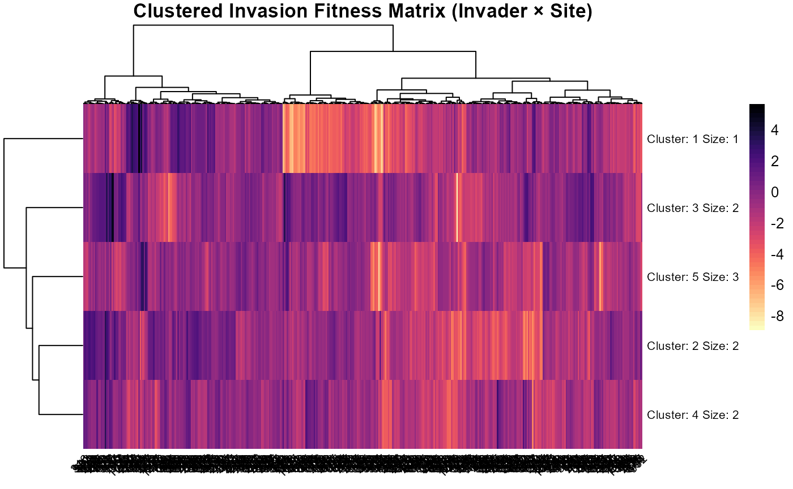
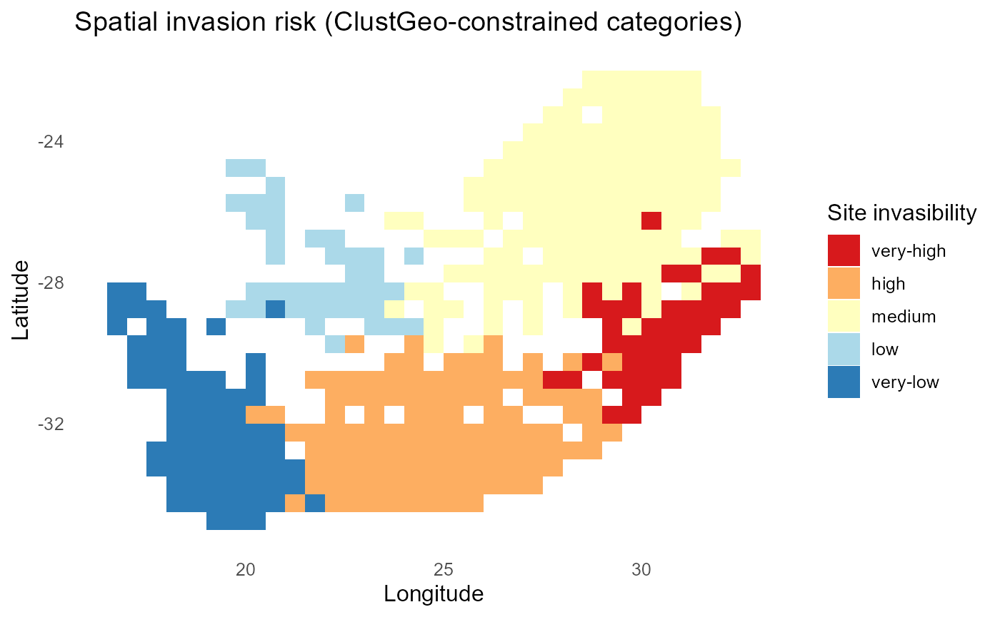
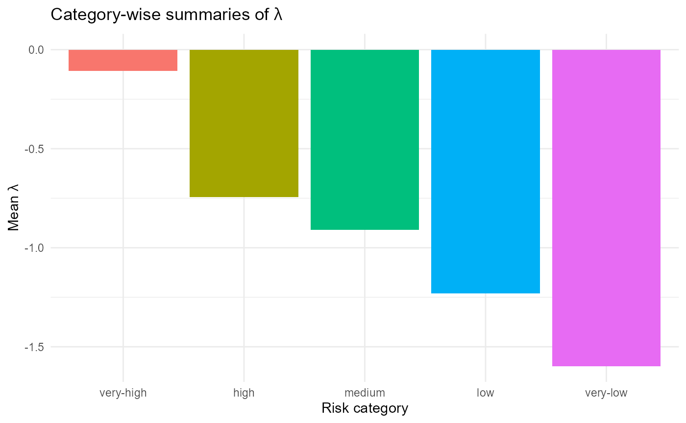

# Clustering and risk scenarios

------------------------------------------------------------------------

## Install and load `invasimapr` and other core packages

Install from GitHub (recommended for development) or CRAN (if available)
as before.

------------------------------------------------------------------------

## Clustering and risk scenarios

After computing invasion fitness \\\lambda\_{is}\\ (Sections 6-7), we
can mine the \\\text{invader} \times \text{site}\\ surface for
**recurring profiles**. Clustering reveals groups of invaders with
similar spatial success and groups of sites with similar susceptibility,
enabling practical **risk categories** and **scenario planning**.

:hourglass_flowing_sand: **Step-by-step** this section:

1.  We reshape the long fitness table into a matrix \\\Lambda\\ with
    rows = invaders and columns = sites;
2.  scale and cluster rows and columns (Ward’s method) to expose
    structure;
3.  assign **discrete cluster labels** to invaders and sites for
    downstream mapping and summaries; and
4.  visualise the joint structure with a clustered heatmap.

------------------------------------------------------------------------

### Hierarchical clustering of invaders and sites

We treat each invader as a vector of fitness values across sites and
each site as a vector across invaders. Hierarchical clustering groups
**invaders** into “broad-spectrum” vs. “specialists” and **sites** into
“open” vs. “resistant” community types. We scale rows/columns to
neutralise magnitude, compute Euclidean distances, and apply Ward’s
linkage. The number of clusters \\k\\ can be chosen by silhouette/gap
heuristics or fixed for interpretability.

:hourglass_flowing_sand: **Step-by-step** this section: 1. Build the
\\\lambda\_{is}\\ matrix ➔ 2. Clean ➔ 3. Scale rows/cols ➔ 4. Compute
Euclidean distances ➔ 5. Cluster with Ward’s linkage ➔ 6. Choose (\\k\\)
(silhouette when available; else a small default) ➔ 7. Attach cluster
labels back to data.

------------------------------------------------------------------------

#### Setup helper functions

``` r
# Optional for k selection via silhouette:
has_fviz = requireNamespace("factoextra", quietly = TRUE)

# Helpers --------------------------------------------------------------
safe_scale = function(M) {
  if (is.null(dim(M))) return(matrix(M, nrow = 1L))
  sds = apply(M, 2, sd, na.rm = TRUE)
  z = scale(M, center = TRUE, scale = sds)
  z[is.na(z)] = 0  # handles sd=0 columns
  z
}

safe_kmax = function(X, kmax = 10L) {
  n = nrow(X); if (is.null(n) || n < 3L) return(NA_integer_)
  min(kmax, n - 1L)  # k in [2, n-1]
}

choose_k_silhouette = function(X, kmax = 10L, nstart = 25L) {
  kmax_safe = safe_kmax(X, kmax)
  if (is.na(kmax_safe) || !has_fviz) return(NA_integer_)
  gg = factoextra::fviz_nbclust(
    as.data.frame(X), FUNcluster = kmeans, method = "silhouette",
    k.max = kmax_safe, nstart = nstart
  )
  d = gg$data
  if (!is.null(d) && all(c("clusters","y") %in% names(d))) d$clusters[which.max(d$y)] else NA_integer_
}
```

------------------------------------------------------------------------

#### Assemble the invader × site fitness matrix (\\\lambda\\)

We pivot long results (one row per site×invader) to a wide matrix with
**rows = invaders**, **cols = sites**. If multiple draws exist, we take
the mean per cell. Then drop rows/columns that are entirely `NA` (or all
missing after earlier filters). If too few remain, we bail out
gracefully.

``` r
lambda_mat = fit$summary$establish_long |>
  dplyr::select(invader, site, lambda) |>
  tidyr::pivot_wider(
    id_cols = invader,
    names_from = site,
    values_from = lambda,
    values_fill = 0,
    values_fn = list(lambda = ~ mean(.x, na.rm = TRUE))
  ) |>
  tibble::column_to_rownames("invader") |>
  as.matrix()

dim(lambda_mat)     # rows=invaders, cols=sites
#> [1]  10 415

lambda_mat_noNA = lambda_mat[
  rowSums(is.na(lambda_mat)) < ncol(lambda_mat),
  colSums(is.na(lambda_mat)) < nrow(lambda_mat),
  drop = FALSE
]

if (nrow(lambda_mat_noNA) < 2L || ncol(lambda_mat_noNA) < 2L) {
  warning("Too few invaders or sites for clustering; assigning NA clusters.")
}
dim(lambda_mat_noNA)     # rows=invaders, cols=sites
#> [1]  10 415
```

------------------------------------------------------------------------

#### Cluster **sites** (columns as observations)

We scale invader dimensions (columns) to neutralize magnitude and
cluster sites via `Ward.D2`.

``` r
if (nrow(lambda_mat_noNA) >= 2L && ncol(lambda_mat_noNA) >= 2L) {

  X_sites = t(safe_scale(lambda_mat_noNA))  # rows = sites, cols = invaders
  keep_sites = apply(X_sites, 1, sd) > 0
  if (any(!keep_sites)) X_sites = X_sites[keep_sites, , drop = FALSE]

  site_dist  = dist(X_sites)
  site_clust = hclust(site_dist, method = "ward.D2")

  k_sites = choose_k_silhouette(X_sites, kmax = 10L)
  if (is.na(k_sites)) k_sites = max(2L, min(5L, nrow(X_sites)))

  site_groups_ok = cutree(site_clust, k = k_sites)  # named vector (kept sites)

  # Reinsert dropped sites (if any) as NA; preserve original site order
  site_groups = setNames(rep(NA_integer_, ncol(lambda_mat_noNA)),
                          colnames(lambda_mat_noNA))
  site_groups[names(site_groups_ok)] = site_groups_ok
}
```

------------------------------------------------------------------------

#### Cluster **invaders** (rows as observations)

Same idea, now with rows (invaders) as observations.

``` r
if (nrow(lambda_mat_noNA) >= 2L && ncol(lambda_mat_noNA) >= 2L) {

  X_inv = safe_scale(lambda_mat_noNA)       # rows = invaders, cols = sites
  keep_inv = apply(X_inv, 1, sd) > 0
  if (any(!keep_inv)) X_inv = X_inv[keep_inv, , drop = FALSE]

  inv_dist  = dist(X_inv)
  inv_clust = hclust(inv_dist, method = "ward.D2")

  k_inv = choose_k_silhouette(X_inv, kmax = 10L)
  if (is.na(k_inv)) k_inv = max(2L, min(5L, nrow(X_inv)))

  inv_groups_ok = cutree(inv_clust, k = k_inv)  # named vector (kept invaders)

  inv_groups = setNames(rep(NA_integer_, nrow(lambda_mat_noNA)),
                         rownames(lambda_mat_noNA))
  inv_groups[names(inv_groups_ok)] = inv_groups_ok
}
```

------------------------------------------------------------------------

#### Attach cluster labels for downstream use

We create (or update) a `df_inv` table with one row per
`(site, invader)` and two factor columns: `site_cluster`,
`invader_cluster`. Any dropped entities become `NA`.

``` r
# Ensure df_inv exists
if (!exists("df_inv")) {
  df_inv = fit$summary$establish_long |>
    dplyr::select(site, invader) |>
    dplyr::distinct() |>
    dplyr::mutate(across(c(site, invader), as.character))
}

# Sanity checks: names should align with the clustered matrix
if (!all(df_inv$site %in% names(site_groups))) {
  warning("Some sites in df_inv not present in clustered matrix; setting NA.")
}
if (!all(df_inv$invader %in% names(inv_groups))) {
  warning("Some invaders in df_inv not present in clustered matrix; setting NA.")
}

df_inv = df_inv |>
  dplyr::mutate(
    site_cluster    = factor(site_groups[site],
                             levels = sort(unique(site_groups))),
    invader_cluster = factor(inv_groups[invader],
                             levels = sort(unique(inv_groups)))
  )

head(df_inv)
#> # A tibble: 6 × 11
#>   site  invader   val lambda mode          label      x     y val_f site_cluster
#>   <chr> <chr>   <int>  <dbl> <chr>         <chr>  <dbl> <dbl> <fct> <fct>       
#> 1 82    inv1        0 -1.92  probabilistic proba…  19.2 -34.8 0     1           
#> 2 83    inv1        0 -5.18  probabilistic proba…  19.8 -34.8 0     1           
#> 3 84    inv1        0 -1.21  probabilistic proba…  20.2 -34.8 0     2           
#> 4 117   inv1        1  0.220 probabilistic proba…  18.2 -34.3 1     2           
#> 5 118   inv1        0 -1.28  probabilistic proba…  18.8 -34.3 0     2           
#> 6 119   inv1        0 -1.45  probabilistic proba…  19.2 -34.3 0     1           
#> # ℹ 1 more variable: invader_cluster <fct>
```

------------------------------------------------------------------------

:information_source: **Why this matters**: Cluster labels compress
thousands of \\\lambda\_{is}\\ cells into a handful of **profiles** that
managers and analysts can reason about.

:warning: **Checks/tips**: \* Remove rows/cols with only `NA` before
clustering; clustering needs variation. \* Scaling neutralizes magnitude
so distance reflects **shape** of response. \* If silhouette selection
isn’t available, we default to a small (\\k\\) (2–5) for
interpretability. \* Store `site_cluster` and `invader_cluster` on your
canonical tables for downstream stratified summaries, e.g. site-type vs
invader-type risk maps.

------------------------------------------------------------------------

#### Quick diagnostic plots

:bar_chart: **Clustered** \\\lambda\\ heatmap summarizes the joint
structure of invasion fitness (\\\lambda\\) across invaders (rows) and
sites (columns).

``` r
# Sites dendrogram
if (exists("site_clust")) plot(site_clust, main = "Sites (Ward.D2)", xlab = "", sub = "")
```


``` r
# Invaders dendrogram
if (exists("inv_clust")) plot(inv_clust, main = "Invaders (Ward.D2)", xlab = "", sub = "")
```


> :chart_with_upwards_trend: **Figure 24**: Dendrograms, useful to
> eyeball structure and plausibility (k).

``` r
# Clustered heatmap: joint structure in $\lambda$ (invader × site)
pheatmap::pheatmap(
  lambda_mat_noNA,
  kmeans_k = 5,
  color = rev(viridis::viridis(50, option = "magma", direction = 1)),
  clustering_distance_rows = "euclidean",
  clustering_distance_cols = "euclidean",
  clustering_method        = "ward.D",
  fontsize_row = 8, fontsize_col = 8,
  main = "Clustered Invasion Fitness Matrix (Invader × Site)",
  angle_col = 45
)
```



> :chart_with_upwards_trend: **Figure 25**: The clustered heatmap
> summarizes the joint structure of invasion fitness (\\\lambda\\)
> across invaders (rows) and sites (columns): Colors encode \\\lambda\\
> (yellow/white = higher fitness; purple/black = lower), and the
> dendrograms group invaders and sites by similarity in their
> \\\lambda\\ profiles (Ward clustering). Clear vertical bands of warmer
> colors indicate that site identity explains much of the variation,
> certain site clusters consistently offer higher fitness across many
> invaders, whereas horizontal blocks are weaker, implying more modest
> between-invader differences. The k-means split (k = 5) on the columns
> highlights a few distinct site regimes that alternate between high and
> low \\\lambda\\, producing contiguous stripes rather than scattered
> pixels. Some invader clusters show uniformly poor performance (cool
> rows) with only small pockets of opportunity, while others have
> broader tolerance with multiple site clusters showing elevated
> \\\lambda\\. **Overall, the figure reveals strong spatial structure in
> establishment potential, with invader effects present but secondary to
> site-level context.**

:sparkles: **Overall importance**: Clustering turns a dense prediction
surface into a concise **vocabulary of profiles** for communication and
planning.

:bulb: **Summary.** You now have **invader** and **site** cluster labels
that can be mapped, ranked, and cross-tabulated with traits and
environments.

------------------------------------------------------------------------

### Mapping site-level risk categories

To support spatial decisions, we translate site clusters into **ordered
risk categories** (*very-high* → *very-low*) using mean
\\\lambda\_{is}\\ within each cluster, optionally constraining clusters
to be geographically cohesive. In this section:

1.  We use **ClustGeo** to blend similarity in \\\Lambda\\ profiles with
    geographic distance,
2.  **choose \\k\\ clusters**, and then
3.  **relabel** clusters by their mean site fitness into intuitive
    **risk categories**.
4.  Finally, we **map categories** over the study region.

:information_source: **Why this matters**: The map highlights **where**
openness to invasion concentrates and provides a stable spatial unit for
monitoring and intervention.

:warning: **Checks/tips**: Ensure coordinate joins are correct; test a
few \\\alpha\\ weights (0 = spatial only, 1 = fitness only); order
categories by mean fitness for consistent legends.

:hourglass_flowing_sand: **Step-by-step**: 1. Assemble \\\lambda\\ ➔ 2.
Prepare site coordinates ➔ 3. Build profile and spatial distances ➔ 4.
Cluster with `ClustGeo` ➔ 5. Choose \\k\\ ➔ 6. Relabel clusters by mean
\\\lambda\\ ➔ 7. Map

------------------------------------------------------------------------

#### Setup (packages, inputs)

``` r
# Optional: spatial / clustering helpers
has_sf      = requireNamespace("sf", quietly = TRUE)
has_clgeo   = requireNamespace("ClustGeo", quietly = TRUE)

# Expected objects:
# - fit$summary$establish_long or fit$fitness$lambda_long with (site, invader, lambda)
# - fitness_df with site-level summaries incl. site coords (x,y) or an sf geometry
# - rsa (optional sf boundary for context)
```

------------------------------------------------------------------------

#### Assemble a long table of (\\\lambda\\) (one row per site × invader)

Guard against duplicates by averaging within (site, invader) and drop
fully-NA rows/columns for stability.

``` r
lambda_long = if (!is.null(fit$fitness$lambda_long)) {
  fit$fitness$lambda_long
} else {
  fit$summary$establish_long
}

lambda_mean = lambda_long |>
  dplyr::select(site, invader, lambda) |>
  dplyr::mutate(across(c(site, invader), as.character)) |>
  dplyr::group_by(site, invader) |>
  dplyr::summarise(mean_lambda = mean(lambda, na.rm = TRUE), .groups = "drop")

# Drop fully-NA rows/columns for stability
lambda_mat = lambda_mean |>
  tidyr::pivot_wider(
    id_cols = invader, names_from = site, values_from = mean_lambda,
    values_fill = 0, values_fn = list(mean_lambda = ~ mean(.x, na.rm = TRUE))
  ) |>
  tibble::column_to_rownames("invader") |>
  as.matrix()
dim(lambda_mat)
#> [1]  10 415

lambda_mat_noNA = lambda_mat[
  rowSums(is.na(lambda_mat)) < ncol(lambda_mat),
  colSums(is.na(lambda_mat)) < nrow(lambda_mat),
  drop = FALSE
]

stopifnot(ncol(lambda_mat_noNA) >= 2L, nrow(lambda_mat_noNA) >= 2L)
dim(lambda_mat_noNA)
#> [1]  10 415
```

------------------------------------------------------------------------

#### Prepare site coordinates (x,y)

Accepts `fitness_df` either with numeric `x,y` columns *or* as `sf` with
point geometry.

``` r
# Extract site ids to be clustered (columns of lambda_mat_noNA)
site_ids = colnames(lambda_mat_noNA)

# Get coordinates for these sites
if (has_sf && inherits(fitness_df, "sf")) {
  # If sf, derive lon/lat (or projected) from geometry
  xy = sf::st_coordinates(sf::st_centroid(fitness_df))
  coords_df = cbind(st_drop_geometry(fitness_df), x = xy[,1], y = xy[,2])
} else {
  coords_df = fitness_df
}

stopifnot(all(c("site","x","y") %in% names(coords_df)))
site_coords = coords_df |>
  dplyr::mutate(site = as.character(site)) |>
  dplyr::filter(site %in% site_ids) |>
  dplyr::select(site, x, y)

# Reorder to match site_ids; keep only complete cases
site_coords = site_coords[match(site_ids, site_coords$site), ]
ok = stats::complete.cases(site_coords$x, site_coords$y)
stopifnot(any(ok))  # need at least some sites with coords
```

------------------------------------------------------------------------

#### Build distances: profile (D1) + geographic (D0)

Scale site profiles (rows) to neutralize magnitude; then compute
Euclidean distances.

``` r
# X = sites × invaders (scaled across invaders)
scale_cols = function(M) {
  sds = apply(M, 2, sd, na.rm = TRUE)
  Z   = scale(M, center = TRUE, scale = sds); Z[is.na(Z)] = 0; Z
}

X  = scale_cols(t(lambda_mat_noNA[, ok, drop = FALSE]))  # rows = sites(ok)
D1 = dist(X)                                            # profile distance

D0 = dist(as.matrix(site_coords$x[ok]) |> cbind(site_coords$y[ok]))
# Equivalent: dist(cbind(site_coords$x[ok], site_coords$y[ok]))
```

------------------------------------------------------------------------

#### Run ClustGeo (blend profile + spatial cohesion)

Tune (\\\alpha \in\\ \[0,1\]): 0 = spatial only; 1 = profile only.
*(Optional)* try a few (\\\alpha\\) values and inspect `inertia` to pick
a trade-off.

``` r
if (!has_clgeo) stop("ClustGeo not installed. install.packages('ClustGeo')")

alpha = 0.3   # adjust: higher = prioritize lambda profiles; lower = more spatial cohesion
tree  = ClustGeo::hclustgeo(D0, D1, alpha = alpha)

# Choose k (fixed or heuristic). For spatial categories, a small k is typical.
k = 5
site_groups_ok = stats::cutree(tree, k = k)  # names are sites with ok coords

# Reinsert NAs for sites lacking coords; order = site_ids
site_groups = setNames(rep(NA_integer_, length(site_ids)), site_ids)
site_groups[names(site_groups_ok)] = site_groups_ok
```

*Optional: alpha tuning curve*

``` r
# Within-cluster sum of squares from a distance matrix
# Works for Euclidean distances (e.g., dist() on scaled data or coordinates).
# W(C) = 0.5 / n_C * sum_{i,j in C} d(i,j)^2  ;  W = sum_C W(C)

withinss_dist = function(D, groups) {
  if (inherits(D, "dist")) D = as.matrix(D)
  g = as.factor(groups)
  idx = split(seq_len(nrow(D)), g)
  w = vapply(idx, function(I) {
    n = length(I)
    if (n <= 1L) return(0)
    Dij2 = D[I, I, drop = FALSE]^2
    sum(Dij2) / (2 * n)
  }, numeric(1))
  sum(w)
}

# Total sum of squares from a distance matrix: T = 0.5/n * sum_{i,j} d(i,j)^2
totss_dist = function(D) {
  if (inherits(D, "dist")) D = as.matrix(D)
  n = nrow(D)
  if (n <= 1L) return(0)
  sum(D^2) / (2 * n)
}

# Evaluate a grid of alpha to visualize within-cluster inertia trade-off
alphas = seq(0, 1, by = 0.1)

# Precompute totals for normalization (optional)
T1 = totss_dist(D1)   # profile total inertia
T0 = totss_dist(D0)   # spatial total inertia

alpha_curve = lapply(alphas, function(a) {
  tr = ClustGeo::hclustgeo(D0, D1, alpha = a)
  gr = cutree(tr, k = k)

  W1 = withinss_dist(D1, gr)         # within-cluster profile inertia
  W0 = withinss_dist(D0, gr)         # within-cluster spatial inertia
  data.frame(alpha = a,
             W1 = W1,  W1_rel = if (T1 > 0) W1/T1 else NA_real_,
             W0 = W0,  W0_rel = if (T0 > 0) W0/T0 else NA_real_)
})
alpha_curve = do.call(rbind, alpha_curve)

# Plot (relative values 0–1 are easiest to compare)
ggplot2::ggplot(alpha_curve, ggplot2::aes(alpha)) +
  ggplot2::geom_line(ggplot2::aes(y = W1_rel), linewidth = 0.8) +
  ggplot2::geom_point(ggplot2::aes(y = W1_rel), size = 1.2) +
  ggplot2::geom_line(ggplot2::aes(y = W0_rel), linetype = 2) +
  ggplot2::geom_point(ggplot2::aes(y = W0_rel), size = 1.2, shape = 1) +
  ggplot2::labs(y = "Relative within-cluster inertia",
       title = "Alpha trade-off: profile (solid) vs spatial (dashed)",
       subtitle = paste("k =", k)) +
  ggplot2::theme_minimal(11)
```


> :chart_with_upwards_trend: **Figure 26**: Trade-off curve showing how
> the choice of the `ClustGeo` mixing parameter (\\\alpha\\) affects
> clustering compactness in trait-profile space (solid line) versus
> geographic space (dashed line). At (\\\alpha=0\\), clusters are
> maximally cohesive geographically but poorly capture profile
> similarity; at (\\\alpha=1\\), the reverse holds. The curve suggests
> that intermediate values (\\(\alpha \approx 0.3!-!0.6)\\) provide a
> reasonable balance, with modest loss of profile compactness but large
> gains in spatial cohesion.

------------------------------------------------------------------------

#### Order clusters by mean site fitness → ordered **risk categories**

Compute a site-level mean (\\\lambda\\); order clusters by descending
mean; map to labels.

``` r
# Site-level mean lambda
site_lambda_mean = lambda_mean |>
  dplyr::group_by(site) |>
  dplyr::summarise(lambda_mean = mean(mean_lambda, na.rm = TRUE), .groups = "drop")

# Rank clusters by mean site lambda
tmp = data.frame(site = names(site_groups), cluster = site_groups) |>
  dplyr::left_join(site_lambda_mean, by = "site") |>
  dplyr::group_by(cluster) |>
  dplyr::summarise(mu = mean(lambda_mean, na.rm = TRUE), .groups = "drop") |>
  dplyr::arrange(desc(mu))

risk_labels = c("very-high","high","medium","low","very-low")[seq_len(nrow(tmp))]
remap = setNames(risk_labels, tmp$cluster)

# Final site table with ordered categories
site_sum = site_coords |>
  dplyr::transmute(site, x, y,
            site_cluster = remap[as.character(site_groups[site])],
            site_category = factor(site_cluster, levels = risk_labels))
```

------------------------------------------------------------------------

#### Map the categories

Use either a gridded backdrop or your `sf` boundary. If `fitness_df` is
gridded, tiles work; if polygons, join on `site` and plot geometry.

``` r
p = ggplot2::ggplot(site_sum, ggplot2::aes(x = x, y = y, fill = site_category)) +
  ggplot2::geom_tile(color = NA) +
  ggplot2::labs(title = "Spatial invasion risk (ClustGeo-constrained categories)",
       x = "Longitude", y = "Latitude", fill = "Site invasibility") +
  ggplot2::scale_fill_brewer(palette = "RdYlBu", direction = 1, drop = FALSE) +
  ggplot2::theme_minimal(12) +
  ggplot2::theme(panel.grid = ggplot2::element_blank(),
        legend.position = "right")

# Add boundary if available
if (exists("rsa") && has_sf && inherits(rsa, "sf")) {
  p = p + ggplot2::geom_sf(data = rsa, inherit.aes = FALSE, fill = NA, color = "black", size = 0.5)
}
p
```



> :chart_with_upwards_trend: **Figure 27**: The map depicts **spatial
> categories of invasion risk** derived from a ClustGeo clustering that
> jointly considers site-level invasion fitness (\\\lambda\\ profiles
> across invaders) and geographic proximity. Each grid cell is assigned
> to one of five ordered categories, very high, high, medium, low, and
> very low invasibility, based on the mean establishment potential of
> invaders at that location.

:bar_chart: Two patterns emerge: First, invasion risk is **spatially
structured**, with contiguous clusters of high-risk sites (red)
concentrated in the southern and central regions, and very-high
categories also evident in the northeast. These regions combine
favorable abiotic conditions with invader-compatible resident
communities. Second, low and very-low risk sites (blue shades) form
coherent zones, often in the western and coastal areas, suggesting
environmental filtering or strong resident resistance. Because the
categories are **constrained by geography**, the map highlights
regional-scale patterns rather than isolated hotspots. This makes it
useful for decision-making, since it aligns biological risk signals with
practical spatial units for monitoring and intervention. **In short, the
figure reveals where invasion pressure is expected to be greatest, where
resistance is likely strongest, and how these patterns are distributed
across the South African landscape.**

------------------------------------------------------------------------

### Cluster-wise summaries for reporting

Summarize mean/SD/CV of (\\\lambda\\) **by risk category**, and across
**(site × invader)** cells.

``` r
lambda_with_cat = lambda_mean |>
  dplyr::left_join(dplyr::select(site_sum, site, site_category), by = "site")

summ_sitecat = lambda_with_cat |>
  dplyr::group_by(site_category) |>
  dplyr::summarise(
    n_cells = dplyr::n(),
    mean_lambda = mean(mean_lambda, na.rm = TRUE),
    sd_lambda   = sd(mean_lambda, na.rm = TRUE),
    cv_lambda   = sd_lambda / mean_lambda,
    q10 = quantile(mean_lambda, 0.10, na.rm = TRUE),
    q50 = quantile(mean_lambda, 0.50, na.rm = TRUE),
    q90 = quantile(mean_lambda, 0.90, na.rm = TRUE),
    .groups = "drop"
  )

summ_sitecat
#> # A tibble: 5 × 8
#>   site_category n_cells mean_lambda sd_lambda cv_lambda    q10    q50    q90
#>   <fct>           <int>       <dbl>     <dbl>     <dbl>  <dbl>  <dbl>  <dbl>
#> 1 very-high         420      -0.107        NA        NA -0.107 -0.107 -0.107
#> 2 high             1120      -0.743        NA        NA -0.743 -0.743 -0.743
#> 3 medium           1520      -0.910        NA        NA -0.910 -0.910 -0.910
#> 4 low               390      -1.23         NA        NA -1.23  -1.23  -1.23 
#> 5 very-low          700      -1.60         NA        NA -1.60  -1.60  -1.60
```

*Quick barplot of category means:*

``` r
ggplot2::ggplot(summ_sitecat,
       ggplot2::aes(x = site_category, y = mean_lambda, fill = site_category)) +
  ggplot2::geom_col(show.legend = FALSE) +
  ggplot2::geom_errorbar(ggplot2::aes(ymin = mean_lambda - 1.96*sd_lambda/sqrt(n_cells),
                    ymax = mean_lambda + 1.96*sd_lambda/sqrt(n_cells)),
                width = 0.15) +
  ggplot2::labs(x = "Risk category", y = expression("Mean " * lambda),
       title = expression("Category-wise summaries of " * lambda)) +
  ggplot2::theme_minimal(11)
```



> :chart_with_upwards_trend: **Figure 28**: Category-wise mean invasion
> fitness (\\\lambda\\) across ordered site risk categories (*very-high*
> to *very-low*). Sites assigned to the *very-high* category exhibit
> near-zero or slightly positive mean fitness values, indicating
> conditions most favorable to invader establishment. In contrast, *low*
> and *very-low* categories show strongly negative mean fitness,
> reflecting resistant community conditions. The monotonic decline
> confirms that the clustering and relabeling successfully captured a
> gradient of invasion risk.

------------------------------------------------------------------------

:sparkles: **Overall importance**: Clustering + mapping yields
actionable **spatial units** and **invader types** for prioritising
surveillance and control.

:bulb: **Summary.** You now have spatially coherent **site categories**
and interpretable **invader categories** that align with the full
fitness surface.

:warning: **Checks/tips**: \* **Coordinates:** confirm site ↔︎ coord
join; if using `sf`, verify CRS. \* **Alpha:** test a few (\\\alpha\\)
(e.g., 0, 0.3, 0.6, 1) and inspect inertia to trade off cohesion vs
profile similarity. \* **k:** small (\\k\\) (3-6) aids communication;
fix (\\k\\) for comparability across runs. \* **Ordering:** always order
labels by **descending** mean (\\\lambda\\) to keep legends consistent.
\* **Missing coords:** sites without coordinates get `NA` clusters;
handle explicitly if mapping is required.

------------------------------------------------------------------------

## Session information

``` r
sessionInfo()
#> R version 4.5.2 (2025-10-31 ucrt)
#> Platform: x86_64-w64-mingw32/x64
#> Running under: Windows 11 x64 (build 26200)
#> 
#> Matrix products: default
#>   LAPACK version 3.12.1
#> 
#> locale:
#> [1] LC_COLLATE=English_South Africa.utf8  LC_CTYPE=English_South Africa.utf8   
#> [3] LC_MONETARY=English_South Africa.utf8 LC_NUMERIC=C                         
#> [5] LC_TIME=English_South Africa.utf8    
#> 
#> time zone: Africa/Johannesburg
#> tzcode source: internal
#> 
#> attached base packages:
#> [1] stats     graphics  grDevices utils     datasets  methods   base     
#> 
#> loaded via a namespace (and not attached):
#>   [1] Rdpack_2.6.6        DBI_1.3.0           gridExtra_2.3.1    
#>   [4] permute_0.9-10      sandwich_3.1-1      rlang_1.2.0        
#>   [7] magrittr_2.0.5      multcomp_1.4-28     otel_0.2.0         
#>  [10] matrixStats_1.5.0   e1071_1.7-17        compiler_4.5.2     
#>  [13] mgcv_1.9-4          systemfonts_1.3.2   vctrs_0.7.3        
#>  [16] stringr_1.6.0       pkgconfig_2.0.3     shape_1.4.6.1      
#>  [19] fastmap_1.2.0       backports_1.5.1     labeling_0.4.3     
#>  [22] utf8_1.2.6          rmarkdown_2.31      nloptr_2.2.1       
#>  [25] ragg_1.5.2          purrr_1.2.2         xfun_0.59          
#>  [28] glmnet_4.1-10       cachem_1.1.0        ClustGeo_2.1       
#>  [31] jsonlite_2.0.0      terra_1.9-34        broom_1.0.13       
#>  [34] parallel_4.5.2      cluster_2.1.8.2     R6_2.6.1           
#>  [37] bslib_0.11.0        stringi_1.8.7       RColorBrewer_1.1-3 
#>  [40] car_3.1-5           boot_1.3-32         jquerylib_0.1.4    
#>  [43] numDeriv_2016.8-1.1 estimability_2.0.0  Rcpp_1.1.1-1.1     
#>  [46] iterators_1.0.14    knitr_1.51          zoo_1.8-15         
#>  [49] Matrix_1.7-5        splines_4.5.2       glmmTMB_1.1.14     
#>  [52] tidyselect_1.2.1    viridis_0.6.5       rstudioapi_0.19.0  
#>  [55] abind_1.4-8         yaml_2.3.12         vegan_2.7-5        
#>  [58] invasimapr_0.2.0    TMB_1.9.21          codetools_0.2-20   
#>  [61] lattice_0.22-9      tibble_3.3.1        withr_3.0.3        
#>  [64] S7_0.2.2            coda_0.19-4.1       evaluate_1.0.5     
#>  [67] desc_1.4.3          survival_3.8-6      sf_1.1-1           
#>  [70] units_1.0-1         proxy_0.4-29        pillar_1.11.1      
#>  [73] ggpubr_0.6.3        carData_3.0-6       KernSmooth_2.23-26 
#>  [76] foreach_1.5.2       reformulas_0.4.4    insight_1.5.1      
#>  [79] generics_0.1.4      ggplot2_4.0.3       fuzzyjoin_0.1.8    
#>  [82] scales_1.4.0        minqa_1.2.8         xtable_1.8-8       
#>  [85] class_7.3-23        glue_1.8.1          pheatmap_1.0.13    
#>  [88] emmeans_2.0.3       tools_4.5.2         data.table_1.18.4  
#>  [91] lme4_2.0-1          ggsignif_0.6.4      fs_2.1.0           
#>  [94] mvtnorm_1.4-1       grid_4.5.2          tidyr_1.3.2        
#>  [97] rbibutils_2.4.1     nlme_3.1-169        performance_0.17.0 
#> [100] Formula_1.2-5       cli_3.6.6           textshaping_1.0.5  
#> [103] viridisLite_0.4.3   dplyr_1.2.1         gtable_0.3.6       
#> [106] rstatix_0.7.3       sass_0.4.10         digest_0.6.39      
#> [109] classInt_0.4-11     ggrepel_0.9.8       TH.data_1.1-4      
#> [112] htmlwidgets_1.6.4   farver_2.1.2        htmltools_0.5.9    
#> [115] pkgdown_2.2.0       factoextra_2.0.0    lifecycle_1.0.5    
#> [118] MASS_7.3-65
```
