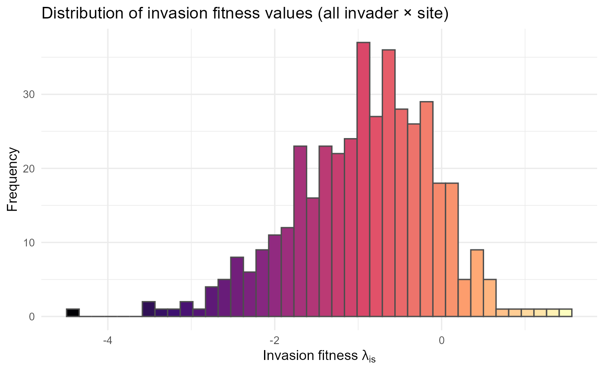
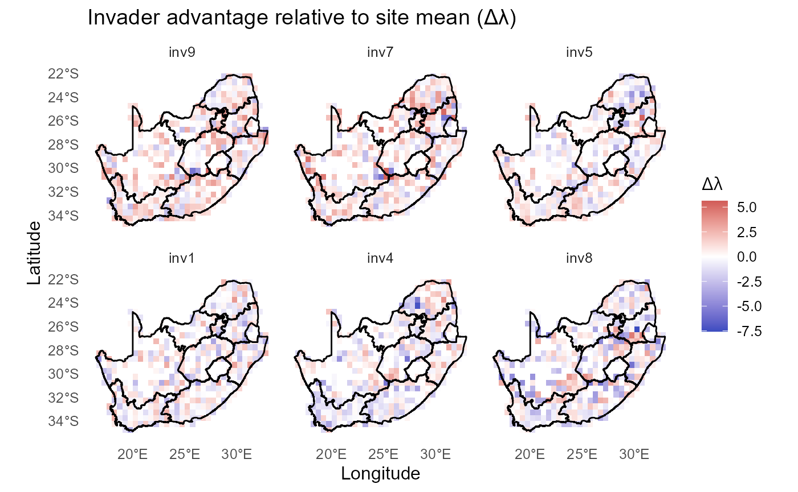

# Invasion fitness synthesis

------------------------------------------------------------------------

## Install and load `invasimapr` and other core packages

Install from GitHub (recommended for development) or CRAN (if available)
as before.

------------------------------------------------------------------------

## Synthesising invasion-fitness insights

This section condenses the high-dimensional output into **system-level
distributions**, **top/bottom ranks**, **trait correlates**, and
**key-invader maps**. The goal is a compact dashboard for reporting and
decision-support.

:hourglass_flowing_sand: **Step-by-step** in this section:

1.  Summarise the distribution of \\\lambda\_{is}\\,
2.  Identify top/bottom invaders and sites by mean fitness,
3.  Link invader traits to fitness via correlations/means, and
4.  Visualise spatial patterns for the most and least concerning
    invaders.

------------------------------------------------------------------------

### Distribution of invasion fitness values

The histogram of all \\\lambda\_{is}\\ values gives a system-wide view
of how often establishment conditions are favourable vs. exclusionary.

:bulb: **Interpretation**: Right-skew suggests many marginal
combinations but a meaningful tail of high-opportunity cases; left-skew
suggests strong overall resistance.

:warning: **Checks/tips**: Inspect tails; compare across specification
options (A-E) to test robustness.

``` r
ggplot2::ggplot(fitness_df, ggplot2::aes(x = lambda_mean, fill = ggplot2::after_stat(x))) +
  ggplot2::geom_histogram(bins = 40, color = "grey30") +
  ggplot2::scale_fill_viridis_c(option = "magma", guide = "none") +
  ggplot2::labs(title = "Distribution of invasion fitness values (all invader × site)",
                x = expression("Invasion fitness " * lambda[i*s]),
                y = "Frequency") +
  ggplot2::theme_minimal(base_size = 12)
```



> :chart_with_upwards_trend: **Figure 29**: The histogram shows the
> **distribution of invasion fitness values (**\\\lambda\\ᵢₛ) across all
> invader–site combinations. Most \\\lambda\\ values fall between −3 and
> 0, with a strong concentration around −2, indicating that the majority
> of potential invasions are constrained by either abiotic conditions or
> biotic resistance. Only a small fraction of cases approach or exceed
> \\\lambda\\ \> 0 (to the right of the origin), highlighting that
> successful establishment opportunities are relatively rare. The long
> left tail (\< −4) represents invader–site pairings where conditions
> are strongly unfavorable.

:bar_chart: Overall, the figure emphasizes that the **invasion landscape
is dominated by resistance** rather than opportunity, but with
occasional site–invader matches that may permit establishment. **This
pattern is consistent with theoretical expectations of community
assembly, where most introductions fail but a minority may find niches
that allow them to persist.**

------------------------------------------------------------------------

### Top and bottom invaders and sites

Ranking by mean \\\lambda\_{is}\\ highlights consistently permissive
sites and consistently risky invaders.

:bulb: **Interpretation**: Top invaders are candidates for vigilant
monitoring; top sites are **hotspots** for surveillance or preventative
management.

:warning: **Checks/tips**: Report uncertainty (e.g., bootstrapped means)
when used for policy.

    #> ==== Top 3 Invaders by Mean Invasion Fitness ====
    #> 1. inv9: -0.388
    #> 2. inv7: -0.435
    #> 3. inv5: -0.864
    #> 
    #> ==== Bottom 3 Invaders by Mean Invasion Fitness ====
    #> 1. inv1: -1.078
    #> 2. inv4: -1.216
    #> 3. inv8: -1.387
    #> 
    #> ==== Top 3 Sites by Mean Invasion Fitness ====
    #> 1. 401: 1.485
    #> 2. 884: 1.396
    #> 3. 695: 1.136
    #> 
    #> ==== Bottom 3 Sites by Mean Invasion Fitness ====
    #> 1. 417: -3.474
    #> 2. 428: -3.523
    #> 3. 558: -4.419

------------------------------------------------------------------------

### Functional correlates of invasion success

We relate invader traits to mean \\\lambda\_{is}\\ to identify
functional profiles linked to high or low establishment.

:bulb: **Interpretation**: Strong positive (or negative) correlations
for continuous traits, and high/low trait-level means for categorical
traits, suggest **mechanistic drivers** worth testing experimentally.

:warning: **Checks/tips**: Standardise continuous traits; ensure
categorical levels are well populated; treat results as exploratory
unless validated.

    #> ==== Top 3 Continuous Traits by Correlation with Mean Invasion Fitness ====
    #> trait_cont7: 0.732
    #> trait_cont2: 0.551
    #> trait_cont1: 0.113
    #> 
    #> ==== Bottom 3 Continuous Traits by Correlation with Mean Invasion Fitness ====
    #> trait_cont8: -0.427
    #> trait_cont4: -0.435
    #> trait_cont5: -0.449
    #> ==== Categorical Traits: Top Value per Trait by Mean Invasion Fitness ====
    #> trait_cat11: grassland (-0.82)
    #> trait_cat12: nocturnal (-0.90)
    #> trait_cat13: bivoltine (-0.88)
    #> trait_cat14: nectarivore (-0.71)
    #> trait_cat15: migratory (-0.92)

------------------------------------------------------------------------

### Faceted maps for key invaders

We visualise spatial patterns for the **top** and **bottom** invaders
identified above to link traits, environments, and community context.

:bulb: **Interpretation**: Hotspots for top invaders mark priority
regions; uniformly low values for bottom invaders highlight robust sites
or mismatched niches.

:warning: **Checks/tips**: Use a centred colour scale; show boundaries
for orientation; keep facet order consistent with ranks.

------------------------------------------------------------------------

:hourglass_flowing_sand: **Step-by-step** in this section: 1. select
invaders ➔ 2. compute z-MAD standardized fitness ➔ 3. build facet labels
ordered by mean \\\lambda\\ ➔ 4. map with a centered palette ➔ 5. show
relative advantage vs site mean ➔ 6. optionally overlay contours
(\\\lambda\>0\\); top decile).

#### Select key invaders (top & bottom)

``` r
# Objects assumed: df_inv (site, invader, x, y, lambda), rsa (sf boundary)
# Also assumed: top3_inv, bottom3_inv with columns 'invader'

# Select key invaders
key_invaders = c(top3_inv$invader, bottom3_inv$invader) |> unique()

lambda_key = df_inv |>
  dplyr::filter(invader %in% key_invaders) |>
  dplyr::mutate(invader = factor(invader, levels = key_invaders))
dim(lambda_key)
#> [1] 2490   11
```

#### Compute z-MAD standardization of (\\\lambda\\)

``` r
# z-MAD for lambda (avoid divide-by-zero)
med = median(lambda_key$lambda, na.rm = TRUE)
mad_ = mad(lambda_key$lambda, na.rm = TRUE)
if (!is.finite(mad_) || mad_ == 0) mad_ = sd(lambda_key$lambda, na.rm = TRUE)

lambda_key = lambda_key |>
  dplyr::mutate(lambda_zmad = (lambda - med) / mad_)
dim(lambda_key)
#> [1] 2490   12
```

#### Order facets by mean (\\\lambda\\) and build labels

``` r
# Order facets by mean lambda and create labels
lab_means = lambda_key |>
  dplyr::group_by(.data$invader) |>
  dplyr::summarise(mu = mean(.data$lambda, na.rm = TRUE), .groups = "drop") |>
  dplyr::arrange(dplyr::desc(.data$mu)) |>
  dplyr::mutate(label = sprintf("%s (mean \u03BB = %.2f)", .data$invader, .data$mu))

lab_levels = lab_means$label

lambda_key2 <- lambda_key |>
  dplyr::left_join(lab_means |> dplyr::select(invader, label), by = "invader", suffix = c(".x", ".y")) |>
  dplyr::mutate(label = dplyr::coalesce(label.y, label.x)) |>   # prefer joined label
  dplyr::select(-label.x, -label.y) |>
  dplyr::mutate(label = factor(label, levels = lab_levels))
names(lambda_key2)
#>  [1] "site"            "invader"         "val"             "lambda"         
#>  [5] "mode"            "x"               "y"               "val_f"          
#>  [9] "site_cluster"    "invader_cluster" "lambda_zmad"     "label"
```

#### Ordered faceted maps (centered palette)

``` r
# Load the national boundary
library(ggplot2)
rsa = sf::st_read(system.file("extdata", "rsa.shp", package = "invasimapr"))
#> Reading layer `rsa' from data source 
#>   `C:\Users\macfadyen\AppData\Local\Temp\RtmpGmxhos\temp_libpath3bcc23b6f2f\invasimapr\extdata\rsa.shp' 
#>   using driver `ESRI Shapefile'
#> Simple feature collection with 11 features and 8 fields
#> Geometry type: MULTIPOLYGON
#> Dimension:     XY
#> Bounding box:  xmin: 16.45189 ymin: -34.83417 xmax: 32.94498 ymax: -22.12503
#> Geodetic CRS:  WGS 84

# Diverging palette + clearer midpoint
ggplot2::ggplot(lambda_key2, ggplot2::aes(x, y, fill = lambda_zmad)) +
  ggplot2::geom_tile() +
  ggplot2::geom_sf(data = rsa, inherit.aes = FALSE, fill = NA, color = "black", linewidth = 0.5) +
  ggplot2::facet_wrap(~ label, ncol = 3) +
  scico::scale_fill_scico(
    palette = "vik", limits = c(-4, 4), oob = scales::squish,
    name = "Lambda (z-MAD)", midpoint = 0
  ) +
  ggplot2::labs(title = "Spatial invasion fitness (facets ordered by mean \u03BB)",
       x = "Longitude", y = "Latitude") +
  theme_minimal(12) +
  theme(panel.grid = ggplot2::element_blank())
```


> :chart_with_upwards_trend: **Figure 30**: This figure compares the
> **spatial distribution of invasion fitness** (\\\lambda\\, expressed
> as `z-MAD`) for the three highest- and three lowest-ranked invaders,
> ordered by their mean \\\lambda\\ values. Across invaders, spatial
> variation is structured by a common underlying pattern: inland and
> northeastern regions generally exhibit higher-than-expected invasion
> fitness (warm tones), whereas coastal and southwestern areas are
> consistently characterized by lower fitness (cool tones). The
> top-ranked invaders (inv5, inv9, inv10) show broader and more
> contiguous zones of positive \\\lambda\\, indicating relatively
> favourable conditions across multiple regions. In contrast, the
> bottom-ranked invaders (inv8, inv2, inv1) display more extensive and
> spatially consistent negative \\\lambda\\ values, with only small and
> fragmented pockets of opportunity.

#### Alternative gradient (viridis/magma)

``` r
ggplot2::ggplot(lambda_key, ggplot2::aes(x = x, y = y, fill = lambda_zmad)) +
  ggplot2::geom_tile() +
  ggplot2::geom_sf(data = rsa, inherit.aes = FALSE, fill = NA, color = "black", linewidth = 0.5) +
  ggplot2::facet_wrap(~ invader, ncol = 3) +
  ggplot2::scale_fill_gradientn(
    colours  = viridisLite::magma(256, direction = -1),
    rescaler = function(x, ...) scales::rescale_mid(x, mid = 0),
    limits   = c(-4, 4), oob = scales::squish,
    name     = "Lambda (z-MAD)"
  ) +
  labs(title = "Spatial invasion fitness for top- and bottom-ranked invaders",
       x = "Longitude", y = "Latitude") +
  theme_minimal(12) +
  theme(panel.grid = ggplot2::element_blank())
```


> :chart_with_upwards_trend: **Figure 31**: Same maps with an
> alternative diverging look using `magma` centered at 0.

#### Invader advantage relative to **site** mean

``` r
# Emphasize invader-specific advantage relative to the same sites
site_means = df_inv |>
  dplyr::group_by(site) |>
  dplyr::summarise(site_mean = mean(lambda, na.rm = TRUE), .groups = "drop")

lambda_rel = lambda_key |>
  dplyr::left_join(site_means, by = "site") |>
  dplyr::mutate(delta_lambda = lambda - site_mean)

ggplot2::ggplot(lambda_rel, aes(x, y, fill = delta_lambda)) +
  ggplot2::geom_tile() +
  ggplot2::geom_sf(data = rsa, inherit.aes = FALSE, fill = NA, color = "black", linewidth = 0.5) +
  ggplot2::facet_wrap(~ invader, ncol = 3) +
  ggplot2::scale_fill_gradient2(
    name = expression(Delta * lambda),
    low = "#3b4cc0", mid = "white", high = "#b40426", midpoint = 0
  ) +
  labs(title = "Invader advantage relative to site mean (\u0394\u03BB)",
       x = "Longitude", y = "Latitude") +
  theme_minimal(12) +
  theme(panel.grid = ggplot2::element_blank())
```



> :chart_with_upwards_trend: **Figure 32**: Deviations from each site’s
> mean (\\\lambda\\) (positive = invader outperforms the typical invader
> at that site).

:bar_chart: Together, these contrasts highlight that **invader
performance is shaped by both shared environmental templates and
invader-specific deviations**, with higher-ranked invaders better
aligned with spatial hotspots of opportunity.

:sparkles: **Overall importance**: This compact set—distribution, ranks,
trait links, and maps—forms a practical **reporting dashboard** for
stakeholders.

:bulb: **Summary.** You now have system-level summaries, interpretable
ranks, functional signals, and spatial views—ready for communication and
action.

:warning: **Checks/tips**: \* Use a **centered** color scale so zero is
visually neutral. \* Keep facet **order** consistent (use the `label`
factor). \* If thresholds should be **invader-specific**, compute
per-invader `thr_i` and draw contours per group (loop or
`group_split()`), since `breaks` can’t vary within a single
[`geom_contour()`](https://ggplot2.tidyverse.org/reference/geom_contour.html)
call. \* For publication, export figures with fixed dimensions and fonts
(e.g., `ggsave(..., width=7, height=6, dpi=300)`).

------------------------------------------------------------------------

## Session information

``` r
sessionInfo()
#> R version 4.5.2 (2025-10-31 ucrt)
#> Platform: x86_64-w64-mingw32/x64
#> Running under: Windows 11 x64 (build 26200)
#> 
#> Matrix products: default
#>   LAPACK version 3.12.1
#> 
#> locale:
#> [1] LC_COLLATE=English_South Africa.utf8  LC_CTYPE=English_South Africa.utf8   
#> [3] LC_MONETARY=English_South Africa.utf8 LC_NUMERIC=C                         
#> [5] LC_TIME=English_South Africa.utf8    
#> 
#> time zone: Africa/Johannesburg
#> tzcode source: internal
#> 
#> attached base packages:
#> [1] stats     graphics  grDevices utils     datasets  methods   base     
#> 
#> other attached packages:
#> [1] ggplot2_4.0.3
#> 
#> loaded via a namespace (and not attached):
#>   [1] Rdpack_2.6.6        DBI_1.3.0           gridExtra_2.3.1    
#>   [4] permute_0.9-10      sandwich_3.1-1      rlang_1.2.0        
#>   [7] magrittr_2.0.5      multcomp_1.4-28     otel_0.2.0         
#>  [10] matrixStats_1.5.0   e1071_1.7-17        compiler_4.5.2     
#>  [13] mgcv_1.9-4          systemfonts_1.3.2   vctrs_0.7.3        
#>  [16] stringr_1.6.0       pkgconfig_2.0.3     shape_1.4.6.1      
#>  [19] fastmap_1.2.0       backports_1.5.1     labeling_0.4.3     
#>  [22] rmarkdown_2.31      nloptr_2.2.1        ragg_1.5.2         
#>  [25] purrr_1.2.2         xfun_0.59           glmnet_4.1-10      
#>  [28] cachem_1.1.0        jsonlite_2.0.0      scico_1.5.0        
#>  [31] terra_1.9-34        broom_1.0.13        parallel_4.5.2     
#>  [34] cluster_2.1.8.2     R6_2.6.1            bslib_0.11.0       
#>  [37] stringi_1.8.7       RColorBrewer_1.1-3  car_3.1-5          
#>  [40] boot_1.3-32         jquerylib_0.1.4     numDeriv_2016.8-1.1
#>  [43] estimability_2.0.0  Rcpp_1.1.1-1.1      iterators_1.0.14   
#>  [46] knitr_1.51          zoo_1.8-15          Matrix_1.7-5       
#>  [49] splines_4.5.2       glmmTMB_1.1.14      tidyselect_1.2.1   
#>  [52] viridis_0.6.5       rstudioapi_0.19.0   abind_1.4-8        
#>  [55] yaml_2.3.12         vegan_2.7-5         invasimapr_0.2.0   
#>  [58] TMB_1.9.21          codetools_0.2-20    lattice_0.22-9     
#>  [61] tibble_3.3.1        withr_3.0.3         S7_0.2.2           
#>  [64] coda_0.19-4.1       evaluate_1.0.5      desc_1.4.3         
#>  [67] survival_3.8-6      sf_1.1-1            units_1.0-1        
#>  [70] proxy_0.4-29        pillar_1.11.1       ggpubr_0.6.3       
#>  [73] carData_3.0-6       KernSmooth_2.23-26  foreach_1.5.2      
#>  [76] reformulas_0.4.4    insight_1.5.1       generics_0.1.4     
#>  [79] fuzzyjoin_0.1.8     scales_1.4.0        minqa_1.2.8        
#>  [82] xtable_1.8-8        class_7.3-23        glue_1.8.1         
#>  [85] pheatmap_1.0.13     emmeans_2.0.3       tools_4.5.2        
#>  [88] data.table_1.18.4   lme4_2.0-1          ggsignif_0.6.4     
#>  [91] fs_2.1.0            mvtnorm_1.4-1       grid_4.5.2         
#>  [94] tidyr_1.3.2         rbibutils_2.4.1     nlme_3.1-169       
#>  [97] performance_0.17.0  Formula_1.2-5       cli_3.6.6          
#> [100] textshaping_1.0.5   viridisLite_0.4.3   dplyr_1.2.1        
#> [103] gtable_0.3.6        rstatix_0.7.3       sass_0.4.10        
#> [106] digest_0.6.39       classInt_0.4-11     ggrepel_0.9.8      
#> [109] TH.data_1.1-4       htmlwidgets_1.6.4   farver_2.1.2       
#> [112] htmltools_0.5.9     pkgdown_2.2.0       factoextra_2.0.0   
#> [115] lifecycle_1.0.5     MASS_7.3-65
```
