# Step-by-step Workflow

------------------------------------------------------------------------

## Step-by-step Workflow

This vignette runs through a step-by-step workflow to visualise trait
dispersion and assess species invasiveness and site invasibility. It
begins with how to install and load **`invasimapr`** and outlines the
(pre-)requisites for running the full workflow.

### Setup

#### Install and load `invasimapr`

\*Install\*\* and load the `invasimapr` package from GitHub, ensuring
all functions are available for use in the workflow.

``` r
# install.packages("remotes")
# remotes::install_github("b-cubed-eu/invasimapr")

# If invasimapr is on CRAN:
# install.packages("invasimapr")
```

\*Load\*\* the `invasimapr` package:

``` r
library(invasimapr)

if (!requireNamespace("invasimapr", quietly = TRUE)) {
  knitr::knit_exit()
}

# Optional: report package version
packageVersion("invasimapr")
#> [1] '0.2.0'

# Make sure all the functions are loaded
# devtools::load_all() # alternative during local development
```

#### Load other R libraries

Load core libraries for spatial processing, biodiversity modelling, and
visualization required across the `invasimapr` analysis pipeline.

The workflow typically uses packages for:

- data manipulation (`dplyr`, `tidyr`, `purrr`, `tibble`, `stringr`)
- modelling (`glmmTMB`, `performance`, `MASS`, `glmnet`, `Matrix`)
- multivariate methods (`vegan`, `cluster`)
- spatial analysis (`sf`)
- visualisation (`ggplot2`, `viridis`, `pheatmap`, `factoextra`)

For robust docs builds, we recommend **not** attaching large dependency
sets with [`library()`](https://rdrr.io/r/base/library.html) unless you
will use them in this vignette. Instead, downstream vignettes should
load what they need, and you can rely on `pkg::fun()` where practical.

Below is a light “availability check” that does not install anything.

``` r
# # Load essential packages
# suppressPackageStartupMessages({
#   need = c("dplyr","tidyr","purrr","tibble","stringr","ggplot2","Matrix","glmnet","rlang", "glmmTMB",
#   "performance", "vegan", "cluster", "matrixStats", "sf", "MASS", "factoextra", "viridis", "pheatmap")
#   to_install = need[!sapply(need, requireNamespace, quietly = TRUE)]
#   if (length(to_install)) install.packages(to_install)
#   lapply(need, library, character.only = TRUE)
# })

deps = c(
  # Core workflow
  "dplyr","tidyr","purrr","tibble","stringr", "forcats",
  "ggplot2",
  # Modelling / stats
  "glmmTMB","performance","Matrix","glmnet","MASS","vegan","cluster","matrixStats",
  # Spatial
  "sf",
  # Viz helpers used in later steps
  "viridis","pheatmap","factoextra"
)

is_installed = vapply(deps, requireNamespace, logical(1), quietly = TRUE)
missing = deps[!is_installed]

cat("### Dependency check\n\n")
if (length(missing) == 0) {
  cat("- All recommended packages are available.\n")
} else {
  cat("- Missing packages (install before running the full workflow):\n")
  cat(paste0("  - ", missing, collapse = "\n"), "\n")
}
```

------------------------------------------------------------------------

### Data access and preparation

#### Data access and preparation using `dissmapr`

To acquire and prepare species occurrence data for biodiversity
modelling using the `dissmapr` package, a series of modular functions
streamline the workflow from raw observations to spatially aligned
environmental predictors.

##### Install `dissmapr`

Install and load the `dissmapr` package from GitHub, ensuring all
functions are available for use in the workflow.

``` r
# # Install remotes if needed
# install.packages("remotes")
# remotes::install_github("b-cubed-eu/dissmapr")

# Ensure the package is loaded.
# suppressWarnings() hides dissmapr's namespace-load import clashes
# (intersect/union/time<-/aggregate from dplyr/terra/zoo/stats).
ok <- suppressWarnings(suppressMessages(
  requireNamespace("dissmapr", quietly = TRUE)
))
if (!ok) {
  knitr::knit_exit()
}
# Optional: report package version
packageVersion("dissmapr")
#> [1] '0.1.0'
```

##### Import and harmonise biodiversity-occurrence data

The process begins with
[`dissmapr::get_occurrence_data()`](https://b-cubed-eu.github.io/dissmapr/reference/get_occurrence_data.html),
which imports biodiversity records, such as a GBIF butterfly dataset for
South Africa, and harmonizes them into standardised formats. Input
sources can include local CSV files, URLs, or zipped GBIF downloads. The
function filters data by taxon and region, returning both raw records
and site × species matrices in presence-absence or abundance form.

``` r
# Use local GBIF data
bfly_data = dissmapr::get_occurrence_data(
  data = system.file("extdata", "gbif_butterflies.csv", package = "invasimapr"),
  source_type = "local_csv",
  sep = "\t"
)

# Check results but only a subset of columns to fit in console
dim(bfly_data)
# str(bfly_data[,c(51,52,22,23,1,14,16,17,30)])
head(bfly_data[, c(51, 52, 22, 23, 1, 14, 16, 17, 30)])
```

##### Format biodiversity records to long/wide formats

Next,
[`dissmapr::format_df()`](https://b-cubed-eu.github.io/dissmapr/reference/format_df.html)
restructures the raw records into tidy long and wide formats. This
assigns unique site IDs, extracts key fields (coordinates, species
names, observation values), and prepares two main outputs: `site_obs`
(long format for mapping) and `site_spp` (wide format for species-level
analysis).

``` r
# Continue from GBIF data
bfly_result = dissmapr::format_df(
  data        = bfly_data, # A `data.frame` of biodiversity records
  species_col = "verbatimScientificName", # Name of species column (required for `"long"`)
  value_col   = "pa", # Name of value column (e.g. presence/abundance; for `"long"`)
  extra_cols  = NULL, # Character vector of other columns to keep
  format      = "long" # Either`"long"` or `"wide"`
)

# Check `bfly_result` structure
str(bfly_result, max.level = 1)

# Optional: Create new objects from list items
site_obs = bfly_result$site_obs
site_spp = bfly_result$site_spp

# Check results
dim(site_obs)
head(site_obs)

dim(site_spp)
head(site_spp[, 1:6])

#### Get parameters from processed data to use later
# Number of species
(n_sp = dim(site_spp)[2] - 3)

# Species names
sp_cols = names(site_spp)[-c(1:3)]
sp_cols[1:10]
```

##### Generate spatial grid and gridded summaries

To integrate the data spatially,
[`dissmapr::generate_grid()`](https://b-cubed-eu.github.io/dissmapr/reference/generate_grid.html)
overlays a user-defined spatial lattice (e.g. 0.5° grid), aggregates
biodiversity observations per grid cell, and computes standardised
metrics such as species richness and observation effort. Outputs include
gridded species matrices (`grid_spp`, `grid_spp_pa`), a spatial polygon
(`grid_sf`), and raster layers (`grid_r`), enabling downstream spatial
modelling.

``` r
# Load the national boundary
rsa = sf::st_read(system.file("extdata", "rsa.shp", package = "invasimapr"))

# Choose a working resolution
res = 0.5 # decimal degrees° (≈ 55 km at the equator)

# Convert the AoI to a 'terra' vector
rsa_vect = terra::vect(rsa)

# Initialise a blank raster template
grid = terra::rast(rsa_vect, resolution = res, crs = terra::crs(rsa_vect))

# Populate the raster with placeholder values
terra::values(grid) = 1

# Clip the raster to the AoI
grid_masked = terra::mask(grid, rsa_vect)

# Generate a 0.5° grid summary for the point dataset `site_spp`
grid_list = dissmapr::generate_grid(
  data          = site_spp, # point data with x/y + species columns
  x_col         = "x", # longitude column
  y_col         = "y", # latitude  column
  grid_size     = 0.5, # cell size in degrees
  sum_cols      = 4:ncol(site_spp), # columns to aggregate * could also use `names(site_spp)[4:ncol(site_spp)]`
  crs_epsg      = 4326 # WGS84
)

# Inspect the returned list
str(grid_list, max.level = 1)

# (Optional) Promote list items to named objects
grid_r = grid_list$grid_r$grid_id # raster
grid_sf = grid_list$grid_sf # polygons for mapping or joins
grid_spp = grid_list$grid_spp # tabular summary per cell
grid_spp_pa = grid_list$grid_spp_pa # presence/absence summary

# Quick checks
dim(grid_sf) # ; head(grid_sf)
dim(grid_spp) # ; head(grid_spp[, 1:8])
dim(grid_spp_pa) # ; head(grid_spp_pa[, 1:8])
```

**Visualise species richness per grid cell**

Plot square root transformed sampling effort and species richness, in a
1x2 side by side. Each map uses the
[`viridisLite::turbo`](https://sjmgarnier.github.io/viridisLite/reference/viridis.html)
palette and is overlaid with the study area outline for spatial context.

``` r
# ensure terra methods are used
# library(terra)

# Get a 2-layer SpatRaster for obs_sum & spp_rich, regardless of source structure
r = grid_list$grid_r
if (inherits(r, "SpatRaster")) {
  effRich_r = r[[c("obs_sum", "spp_rich")]]
} else if (is.list(r)) {
  # r is a list of single-layer SpatRasters named 'obs_sum' and 'spp_rich'
  effRich_r = rast(list(r[["obs_sum"]], r[["spp_rich"]]))
} else {
  stop("grid_list$grid_r must be a SpatRaster or a list of SpatRaster layers")
}

# transform
effRich_r = sqrt(effRich_r)

# Open a 1×2 layout and plot each layer + outline
old_par = par(mfrow = c(1, 2), mar = c(1, 1, 1, 2))
on.exit(par(old_par), add = TRUE)

for (i in 1:2) {
  terra::plot(effRich_r[[i]],
    col   = viridisLite::turbo(100),
    colNA = NA,
    axes  = FALSE,
    main  = c("Sampling effort (√obs count)",
              "Species richness (√unique count)")[i],
    cex.main = 0.8
  )
  terra::plot(terra::vect(rsa), add = TRUE, border = "black", lwd = 0.4)
}
```

> :chart_with_upwards_trend: **Figure 3: Spatial distribution of
> sampling effort and species richness across the study area.** Each
> grid cell shows the square root–transformed values for (left) total
> observation counts (sampling effort) and (right) unique species counts
> (species richness). Both maps use the
> [`viridisLite::turbo`](https://sjmgarnier.github.io/viridisLite/reference/viridis.html)
> color palette for comparability and are overlaid with the study area
> outline to provide spatial context.

##### Retrieve, crop, resample, and link environmental rasters to sampling sites

Environmental predictors are appended using
[`dissmapr::get_enviro_data()`](https://b-cubed-eu.github.io/dissmapr/reference/get_enviro_data.html),
which buffers the grid, downloads raster data (e.g. WorldClim
bioclimatic variables), resamples it, and links values to grid-cell
centroids. This produces both a site × environment data frame (`env_df`)
and a SpatRaster object (`env_r`), aligning biological and environmental
data.

Begin by reading in a predefined target species list, then filter a site
× species dataset (`grid_spp`) to retain only relevant species
observations, and reshape the data for further analysis. This produces
both a filtered long-format dataset (`grid_obs`) and a cleaned
wide-format site × species matrix (`grid_spp`).

``` r
# Read in target species list
species = read.csv(system.file("extdata",
  "rsa_butterfly_species_names_n27_100plus.csv",
  package = "invasimapr"
), stringsAsFactors = FALSE)$species

# Filter `grid_spp` and convert to long-format
grid_obs = grid_spp |>
  dplyr::select(-mapsheet) |> # Drop mapsheet metadata
  tidyr::pivot_longer(
    cols = -c(grid_id, centroid_lon, centroid_lat, obs_sum, spp_rich), # Keep core metadata columns only
    names_to = "species",
    values_to = "count",
    values_drop_na = TRUE
  ) |>
  dplyr::filter(
    # obs_sum > 100, # Only high-observation sites
    count > 0,# Remove absent species
    .data$species %in% .env$species# Keep only target species
    ) |>
  dplyr::rename(
    site_id = grid_id, # Change 'grid_id' to 'site_id'
    x = centroid_lon, # Change 'centroid_lon' to 'x'
    y = centroid_lat # Change 'centroid_lat' to 'y'
  ) |>
  dplyr::relocate(site_id, x, y, obs_sum, spp_rich, species, count)

dim(grid_obs)
head(grid_obs)
length(unique(grid_obs$species))
length(unique(grid_obs$site))

# Reshape site-by-species matrix to wide format and clean
grid_spp = grid_obs |>
  tidyr::pivot_wider(
    names_from = species,
    values_from = count,
    values_fill = 0 # Replace missing counts with 0
  )

dim(grid_spp)
# head(grid_spp)
```

Then proceed to **retrieve and process environmental data** using
[`dissmapr::get_enviro_data()`](https://b-cubed-eu.github.io/dissmapr/reference/get_enviro_data.html).
In the example below, 19 bioclimatic variables are downloaded from
WorldClim v2.1 (≈10 km resolution) for all site centroids in the
`grid_spp` dataset. It performs the following steps:

1.  Retrieves WorldClim “bio” variables via the `geodata` interface.
2.  Buffers the area of interest (AOI) by 10 km.
3.  Retains site-level metadata (`obs_sum`, `spp_rich`) and excludes
    species columns.

``` r
# Retrieve 19 bioclim layers (≈10-km, WorldClim v2.1) for all grid centroids
data_path = "_data" # cache folder for rasters
enviro_list = dissmapr::get_enviro_data(
  data       = grid_spp, # centroids + obs_sum + spp_rich
  buffer_km  = 10, # pad the AOI slightly
  source     = "geodata", # WorldClim/SoilGrids interface
  var        = "bio", # bioclim variable set
  res        = 5, # 5-arc-min ≈ 10 km
  grid_r     = grid_r, # To set resampling resolution, if necessary
  path       = data_path,
  sp_cols    = 7:ncol(grid_spp), # ignore species columns
  ext_cols   = c("obs_sum", "spp_rich") # carry effort & richness through
)

# Quick checks
str(enviro_list, max.level = 1)

# (Optional) Assign concise layer names for readability
# Find names here https://www.worldclim.org/data/bioclim.html
names_env = c(
  "temp_mean", "mdr", "iso", "temp_sea", "temp_max", "temp_min",
  "temp_range", "temp_wetQ", "temp_dryQ", "temp_warmQ",
  "temp_coldQ", "rain_mean", "rain_wet", "rain_dry",
  "rain_sea", "rain_wetQ", "rain_dryQ", "rain_warmQ", "rain_coldQ"
)
names(enviro_list$env_rast) = names_env

# (Optional) Promote frequently-used objects
env_r = enviro_list$env_rast # cropped climate stack
env_df = enviro_list$env_df # site × environment data-frame

# Quick checks
env_r
dim(env_df)
head(env_df)

# Build the final site × environment table
grid_env = env_df |>
  dplyr::select(
    site_id, x, y,
    obs_sum, spp_rich, dplyr::everything()
  ) |>
  dplyr::mutate(across(
    .cols = -c(site_id, x, y, obs_sum, spp_rich), # all other columns
    .fns = ~ as.numeric(scale(.x)), # Scale bio
    .names = "{.col}" # keep same names
  ))

str(grid_env, max.level = 1)
head(grid_env)
```

##### Remove highly correlated predictors (Optional)

Finally,
[`dissmapr::rm_correlated()`](https://b-cubed-eu.github.io/dissmapr/reference/rm_correlated.html)
optionally reduces multicollinearity by filtering out highly correlated
predictors based on a threshold (e.g. r \> 0.70), improving model
stability and interpretability. Together, these functions provide a
reproducible and scalable pipeline for preparing ecological datasets for
spatial analysis.

``` r
# # (Optional) Rename BIO
# names(env_df) = c("grid_id", "centroid_lon", "centroid_lat", names_env, "obs_sum", "spp_rich")
#
# # Run the filter and compare dimensions
# # Filter environmental predictors for |r| > 0.70
# env_vars_reduced = dissmapr::rm_correlated(
#   data       = env_df[, 4:23],  # drop ID + coord columns
#   cols       = NULL,                  # infer all numeric cols
#   threshold  = 0.70,
#   plot       = TRUE                   # show heat-map of retained vars
# )
#
# # Before vs after
# c(original = ncol(env_df[, c(4, 6:24)]),
#   reduced  = ncol(env_vars_reduced))
```

------------------------------------------------------------------------

#### Data access and preparation using `invasimapr`

This section sets up data needed by all downstream wrappers: site
locations, environmental covariates, resident community matrices, and
species traits. It also shows how to enrich traits with metadata, and
how to simulate invader trait tables for later steps.

##### Retrieve and link trait and metadata for each species

[`get_trait_data()`](https://b-cubed-eu.github.io/invasimapr/reference/get_trait_data.md)
provides an automated pipeline for extracting and joining both
biological trait data and rich metadata for any focal species. Many
analyses benefit from curated trait columns, short taxonomy summaries,
and links to images.
[`get_trait_data()`](https://b-cubed-eu.github.io/invasimapr/reference/get_trait_data.md)
consolidates these per species from local trait tables and optional
online sources, returning a single tidy row per species for frictionless
joins.

:hourglass_flowing_sand: **What it does**: Given a species name, the
function looks up traits in a local table (or
[TRY](https://www.try-db.org/TryWeb/Home.php)-style database), performs
tolerant name matching, optionally scrapes a short
[Wikipedia](https://www.wikipedia.org/) description and taxonomy, and
can extract a compact image-based colour palette for visual summaries,
as follows:

1.  **Trait Table Lookup**: Retrieves species’ trait data from a local
    trait table (CSV) or a [TRY](https://www.try-db.org/TryWeb/Home.php)
    (Kattge et al 2020) style database, using fuzzy matching to ensure
    robust linkage even when there are minor naming inconsistencies.
2.  **Wikipedia Metadata Scraping**: Optionally augments each species
    entry with a taxonomic summary, higher taxonomy, and representative
    images scraped directly from
    [Wikipedia](https://www.wikipedia.org/).
3.  **Image-based Color Palette Extraction**: If enabled, downloads and
    processes public domain images to extract the most frequent colors,
    optionally removing green/white backgrounds to focus on diagnostic
    features.
4.  **Flexible Output**: Returns a single-row tibble with the species
    name, trait data, taxonomic metadata, image URL, and color palette -
    all harmonized for downstream analyses or visualization.

:information_source: **Why this matters**: Having a consistent,
analysis-ready trait table avoids downstream NA cascades, eases
plotting, and ensures that residents and invaders share identical column
definitions.

:warning: **Practical checks and tips**: Keep resident and invader trait
column names identical; prefer factors for categorical traits with
explicit levels; store provenance for any scraped fields for
reproducibility.

``` r
# Fetch local trait data.frame
btfly_traits = read.csv(system.file("extdata", "species_traits.csv", package = "invasimapr"))
str(btfly_traits)
#> 'data.frame':    27 obs. of  21 variables:
#>  $ species     : chr  "Acraea horta" "Amata cerbera" "Bicyclus safitza safitza" "Cacyreus lingeus" ...
#>  $ trait_cont1 : num  0.83 0.874 -0.428 0.661 0.283 ...
#>  $ trait_cont2 : num  0.811 -0.106 0.672 0.475 0.622 ...
#>  $ trait_cont3 : num  -0.922 0.498 0.355 -0.657 -0.478 ...
#>  $ trait_cont4 : num  -0.684 -0.282 0.291 0.552 0.127 ...
#>  $ trait_cont5 : num  0.0715 -0.9955 0.2179 0.6736 0.503 ...
#>  $ trait_cont6 : num  0.16 0.643 -0.773 0.529 0.247 ...
#>  $ trait_cont7 : num  0.2035 -0.606 0.0705 -0.6409 -0.0962 ...
#>  $ trait_cont8 : num  -0.425 -0.611 0.568 -0.742 -0.742 ...
#>  $ trait_cont9 : num  0.1493 -0.2933 0.0949 0.7854 -0.02 ...
#>  $ trait_cont10: num  -0.5772 0.0992 -0.036 -0.6811 -0.7008 ...
#>  $ trait_cat11 : chr  "wetland" "forest" "wetland" "wetland" ...
#>  $ trait_cat12 : chr  "diurnal" "nocturnal" "diurnal" "nocturnal" ...
#>  $ trait_cat13 : chr  "bivoltine" "multivoltine" "univoltine" "multivoltine" ...
#>  $ trait_cat14 : chr  "detritivore" "detritivore" "generalist" "nectarivore" ...
#>  $ trait_cat15 : chr  "migratory" "resident" "resident" "migratory" ...
#>  $ trait_ord16 : int  4 1 4 3 4 1 1 4 1 1 ...
#>  $ trait_ord17 : int  1 4 4 3 2 4 3 5 4 3 ...
#>  $ trait_bin18 : int  1 1 1 0 1 1 1 1 0 0 ...
#>  $ trait_bin19 : int  1 0 1 0 0 1 1 1 0 1 ...
#>  $ trait_ord20 : chr  "medium" "large" "medium" "medium" ...

# Retrieve and join trait/metadata for all species in the observation set
spp_traits = purrr::map_dfr(
  unique(grid_obs$species), # unique(longDF$species),
  ~ invasimapr::get_trait_data(
    species = .x,
    n_palette = 5,
    preview = FALSE,
    do_summary = TRUE,
    do_taxonomy = TRUE,
    do_image = TRUE,
    do_palette = TRUE,
    local_trait_df = btfly_traits,
    local_species_col = "species",
    max_dist = 1
  )
)
# The final output combines trait data, taxonomic info, Wikipedia summary, images, and color palette for each species.
# This integrated dataset supports multi-faceted biodiversity, trait, and visualization analyses.

# Check output
str(spp_traits, 1)
#> tibble [27 × 30] (S3: tbl_df/tbl/data.frame)
head(spp_traits[1:5,1:5])
#> # A tibble: 5 × 5
#>   species                    summary                        Kingdom Phylum Class
#>   <chr>                      <chr>                          <chr>   <chr>  <chr>
#> 1 Utetheisa pulchella        ""                             Animal… Arthr… Inse…
#> 2 Danaus chrysippus orientis  NA                            NA      NA     NA   
#> 3 Telchinia serena           "Acraea serena, the dancing a… Animal… Arthr… Inse…
#> 4 Vanessa cardui             "Vanessa cardui is the most w… Animal… Arthr… Inse…
#> 5 Hypolimnas misippus        "Hypolimnas misippus, the Dan… Animal… Arthr… Inse…
```

------------------------------------------------------------------------

#### Alternatively, load a local combined site-environment-trait file

If you already maintain a single long file that includes sites,
coordinates, species, counts, environment, and traits, you can start
directly from that structure and let
[`prepare_inputs()`](https://b-cubed-eu.github.io/invasimapr/reference/prepare_inputs.md)
parse columns by prefixes.

:hourglass_flowing_sand: **What it does**: This code reads a demo CSV,
selects canonical columns, coerces character fields to factors, and
renames the site identifier. The resulting `longDF` feeds straight into
the wrapper.

:information_source: **Why this matters**: A single schema keeps
alignment errors low and simplifies lineage tracking for each variable
class.

:warning: **Practical checks and tips**: Use stable prefixes like
`env_*` and `trait_*`; keep `site`, `x`, `y`, `species`, and `count`
present and well-typed.

``` r
# Example data (invasimapr demo)
site_env_spp = read.csv(
  system.file("extdata","site_env_spp_simulated.csv.gz", package = "invasimapr")
)

# Long format
longDF = site_env_spp |>
  dplyr::select(site_id, x, y, species, count,
                dplyr::starts_with("env"),
                dplyr::starts_with("trait_")) |>
  dplyr::mutate(across(where(is.character), as.factor))
colnames(longDF)[colnames(longDF) == "site_id"] = "site"
head(longDF[1:5,1:5])
#>   site     x         y                  species count
#> 1 1026 28.75 -22.25004             Acraea horta    10
#> 2 1026 28.75 -22.25004            Amata cerbera     0
#> 3 1026 28.75 -22.25004 Bicyclus safitza safitza     0
#> 4 1026 28.75 -22.25004         Cacyreus lingeus     0
#> 5 1026 28.75 -22.25004      Charaxes wakefieldi     9
```

**Import separate tables (Optional)**

``` r
# # site_df = read.csv('D:/Data/Simulations/env_sites_t0.csv')[,1:3]
# site_df = read.csv('D:/Data/Simulations/env_sites_t0_v2.csv')[,1:3]
# # head(site_df)
# dim(site_df)
# 
# # env_df = read.csv('D:/Data/Simulations/env_sites_t0.csv')[,-c(4:5)]
# env_df = read.csv('D:/Data/Simulations/env_sites_t0_v2.csv')[,-c(4:5)]
# # head(env_df)
# dim(env_df)
# 
# # comm_res = read.csv('D:/Data/Simulations/community_t0.csv')
# comm_res = read.csv('D:/Data/Simulations/community_t0_v2.csv')
# # head(comm_res)
# dim(comm_res)
# 
# # traits_res = read.csv('D:/Data/Simulations/species_traits_t0.csv')
# traits_res = read.csv('D:/Data/Simulations/species_traits_t0_v2.csv')
# # head(traits_res)
# dim(traits_res)
```

------------------------------------------------------------------------

#### Prepare residents’ community data with `prepare_inputs()`

[`prepare_inputs()`](https://b-cubed-eu.github.io/invasimapr/reference/prepare_inputs.md)
assembles and aligns the core matrices in one call, whether you start
from a single long table or from separate site, environment, community,
and trait tables. Under the hood it checks and standardises column
names, reconciles data types, and aligns keys so that the five core
objects share a common index: **sites** \\S\\, **environment** \\E\\,
**resident IDs** \\J\\, **abundances** \\N\\, and **traits** \\T\\.

The result is a compact **`invasimapr_fit`** object that downstream
steps simply extend. Optional utilities can be invoked at this stage to
attach trait metadata or to generate hypothetical invaders, but the
primary job here is reliable assembly and alignment of those core
matrices-ready for everything that follows.

:hourglass_flowing_sand: **What it does**: It isolates unique site
coordinates, constructs a site × environment matrix, produces site ×
species abundance and presence-absence tables, and builds a species ×
traits table. It records dimensions in `fit$meta` and can compute simple
site diversity summaries.

:information_source: **Why this matters**: All downstream geometry
(trait space), modelling, and prediction assume strict row/column
alignment across these matrices; the wrapper guarantees this and
surfaces early warnings.

:warning: **Practical checks and tips**: From a long table, keep at
least `site,x,y,species,count` plus `env_*` and `trait_*`. If tables are
separate, ensure identical site rownames across `site_df`, `env_df`,
`comm_res`, `pa_res`, and trait rownames that match community column
names.

:zap: **Run
[`prepare_inputs()`](https://b-cubed-eu.github.io/invasimapr/reference/prepare_inputs.md)**
to initialises `fit` with aligned inputs. Use this as the single source
of truth for sites, community matrices, and traits for all subsequent
wrappers.

``` r
# ---- Option A: one long table -----------------------------------------------
# try(source("D:/Methods/R/myR_Packages/b-cubed-versions/invasimapr/R/prepare_inputs.R"), silent = TRUE)
# if (!exists("prepare_inputs")) stop("prepare_inputs() not found.")

# # ---- Option A: One long table ----------------------------------
# stopifnot(all(c("site","x","y","species","count") %in% names(longDF)))
fit = prepare_inputs(
  long_df            = longDF,
  comm_long          = "auto",
  site_col           = "site", x_col = "x", y_col = "y",
  species_col        = "species", count_col = "count",
  env_cols           = NULL,    env_prefix   = "^env",
  trait_cols         = NULL,    trait_prefix = "^trait",
  drop_empty_sites   = TRUE,
  drop_empty_species = TRUE,
  return_diversity   = TRUE,
  make_plots         = FALSE
)

# # ---- Option B: already have separate tables ----------------------------------
# fit = prepare_inputs(
#   site_df            = site_df,
#   env_df             = env_df,
#   comm_res           = comm_res,
#   traits_res         = traits_res,
#   comm_long          = "auto",
#   site_col           = "site_id",
#   x_col              = "lon",
#   y_col              = "lat",
#   species_col        = "species",
#   count_col          = "abundance",
#   env_cols           = c('temp','precip','elev','aridity','fire_freq','human_index','habitat','geology'),
#   trait_cols         = c('guild','thermal_opt','moisture_opt','SLA','seed_mass','dispersal','body_size','trophic_level','life_history'),
#   drop_empty_sites   = TRUE,
#   drop_empty_species = TRUE,
#   return_diversity   = TRUE,
#   make_plots         = FALSE
# )

print(fit)
#> <invasimapr_fit>
#>  stages: inputs 
#>  sites: 415 | residents: 27 | invaders: NA
str(fit$inputs, 1)
#> List of 13
#>  $ site_df    :'data.frame': 415 obs. of  3 variables:
#>  $ env_df     :'data.frame': 415 obs. of  10 variables:
#>  $ comm_res   :'data.frame': 415 obs. of  27 variables:
#>  $ pa_res     :'data.frame': 415 obs. of  27 variables:
#>  $ traits_res :'data.frame': 27 obs. of  20 variables:
#>  $ diversity  : tibble [415 × 6] (S3: tbl_df/tbl/data.frame)
#>  $ sites      : chr [1:415] "82" "83" "84" "117" ...
#>  $ residents  : chr [1:27] "Acraea horta" "Amata cerbera" "Bicyclus safitza safitza" "Cacyreus lingeus" ...
#>  $ n_sites    : int 415
#>  $ n_env      : int 10
#>  $ n_residents: int 27
#>  $ n_traits   : int 20
#>  $ plots      : list()
```

:card_index_dividers: **Save the matrices** to use downstream and
perform quick sanity check before heavy computation.

``` r
site_df    = fit$inputs$site_df
env_df     = fit$inputs$env_df
comm_res   = fit$inputs$comm_res
pa_res     = fit$inputs$pa_res
traits_res = fit$inputs$traits_res

stopifnot(
  identical(rownames(site_df), rownames(env_df)),
  identical(rownames(site_df), rownames(comm_res)),
  identical(rownames(site_df), rownames(pa_res)),
  setequal(colnames(comm_res), rownames(traits_res))
)

cat("#sites:", nrow(site_df), " | #env:", ncol(env_df),
    " | #residents:", ncol(comm_res),
    " | #traits:", ncol(traits_res), "\n")
#> #sites: 415  | #env: 10  | #residents: 27  | #traits: 20
```

:bar_chart: **Map of resident richness** provides a spatial lens on
alpha diversity and sampling intensity before modelling.

``` r
spp_rich_obs = fit$inputs$diversity 
rsa = sf::st_read(system.file("extdata", "rsa.shp", package = "invasimapr"))
#> Reading layer `rsa' from data source 
#>   `C:\Users\macfadyen\AppData\Local\Temp\Rtmp23f6Iu\temp_libpatha16c5e88147a\invasimapr\extdata\rsa.shp' 
#>   using driver `ESRI Shapefile'
#> Simple feature collection with 11 features and 8 fields
#> Geometry type: MULTIPOLYGON
#> Dimension:     XY
#> Bounding box:  xmin: 16.45189 ymin: -34.83417 xmax: 32.94498 ymax: -22.12503
#> Geodetic CRS:  WGS 84

col_pal = colorRampPalette(c("blue", "green", "yellow", "orange", "red", "darkred"))
ggplot2::ggplot(spp_rich_obs, ggplot2::aes(x = x, y = y, fill = spp_rich)) +
  ggplot2::geom_tile() +
  ggplot2::scale_fill_gradientn(colors = rev(col_pal(10)), name = "Richness") +
  ggplot2::geom_text(ggplot2::aes(label = spp_rich), color = "grey80", size = 2) +
  ggplot2::geom_sf(data = rsa, inherit.aes = FALSE, fill = NA, color = "black", size = 0.4) +
  ggplot2::labs(x = "Longitude", y = "Latitude", title = "Spatial Distribution of Species Richness") +
  ggplot2::theme(panel.grid = ggplot2::element_blank())
```

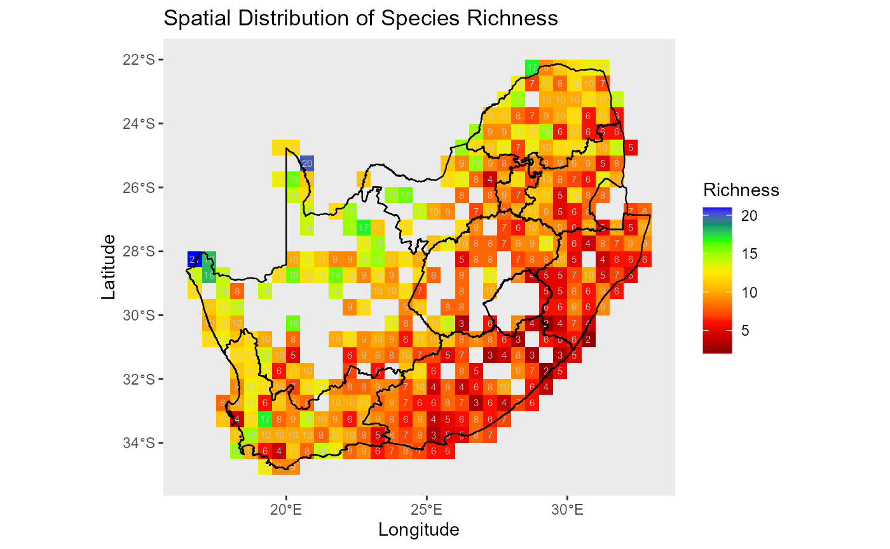

> :chart_with_upwards_trend: **Figure 4: Spatial distribution of species
> richness across the study area.** Each grid cell shows the number of
> unique species (species richness) in each grid-cell.

:information_source: **Why this matters**: Early spatial diagnostics
flag data gaps and uneven effort that can influence crowding and model
fits.

:bulb: **Summary**:
[`prepare_inputs()`](https://b-cubed-eu.github.io/invasimapr/reference/prepare_inputs.md)
locks in a clean, aligned foundation for trait-based analyses; store
`fit` and reference it throughout.

------------------------------------------------------------------------

### Generate hypothetical invaders: \\\textit{invader} \times \textit{traits}\\

When invader traits are unknown, you can simulate plausible invaders
from the resident pool to explore fitness scenarios.
[`simulate_invaders()`](https://b-cubed-eu.github.io/invasimapr/reference/simulate_invaders.md)
builds an invader trait table aligned with residents.

:hourglass_flowing_sand: **What it does**: It samples trait columns
either independently (novel combinations) or row-wise (preserve
covariance), supports bounded or distribution-based sampling for
numerics, and honours factor levels.

:information_source: **Why this matters**: Simulation supports
sensitivity analyses and planning when the exact invader set is
uncertain.

:warning: **Practical checks and tips**: Prefer `rowwise` for realism
when covariance is essential; use `columnwise` to probe unobserved
combinations; keep trait names and levels identical to residents.

``` r
stopifnot(exists("simulate_invaders"))
set.seed(42)

traits_inv = simulate_invaders(
  resident_traits     = traits_res,
  species_col         = NULL,
  n_inv               = 10,
  mode                = "columnwise",      # or "rowwise"
  numeric_method      = "bootstrap",       # "tnorm" / "uniform"
  keep_bounds         = TRUE,
  inv_prefix          = "inv",
  keep_species_column = TRUE,
  seed                = 42
)

traits_all = rbind(traits_res, traits_inv)
head(traits_all[1:4,1:4]); tail(traits_all[1:4,1:4])
#>                          trait_cont1 trait_cont2 trait_cont3 trait_cont4
#> Acraea horta               0.8296121   0.8114763  -0.9221270  -0.6841896
#> Amata cerbera              0.8741508  -0.1060607   0.4975908  -0.2819434
#> Bicyclus safitza safitza  -0.4277209   0.6720085   0.3545537   0.2912638
#> Cacyreus lingeus           0.6608953   0.4751912  -0.6574713   0.5516467
#>                          trait_cont1 trait_cont2 trait_cont3 trait_cont4
#> Acraea horta               0.8296121   0.8114763  -0.9221270  -0.6841896
#> Amata cerbera              0.8741508  -0.1060607   0.4975908  -0.2819434
#> Bicyclus safitza safitza  -0.4277209   0.6720085   0.3545537   0.2912638
#> Cacyreus lingeus           0.6608953   0.4751912  -0.6574713   0.5516467

cat("Simulated invaders:", nrow(traits_inv),
    "| invader traits:", ncol(traits_inv),
    "| total species:", nrow(traits_all),
    "| total traits:", ncol(traits_all), "\n")
#> Simulated invaders: 10 | invader traits: 20 | total species: 37 | total traits: 20
```

:sparkles: **Overall importance**: This closes the data layer:
residents, environment, and invaders are harmonised and ready for
trait-space construction.

------------------------------------------------------------------------

### Shared trait space and resident crowding

This wrapper,
[`prepare_trait_space()`](https://b-cubed-eu.github.io/invasimapr/reference/prepare_trait_space.md),
builds the joint trait geometry (PCoA on Gower), diagnoses centrality
and convex hull membership, and computes resident crowding \\C\_{js}\\
with optional site-wise z-scoring. It returns traits, crowding, and (if
requested) standardised inputs for modelling.

:hourglass_flowing_sand: **What the wrapper does (step-by-step)**:

1.  **Standardises** traits leakage-safely;
2.  Computes **Gower distances** and PCoA scores;
3.  Identifies **centroid, density, and hull**;
4.  Builds \\C\_{js}\\ from Hellinger weights and **Gaussian trait
    kernels**;
5.  Packages **tidy diagnostics and plots**.

#### Standardise model inputs (optional)

[`standardise_model_inputs()`](https://b-cubed-eu.github.io/invasimapr/reference/standardise_model_inputs.md)
harmonises resident and invader traits and any numeric environment
columns while preventing information leakage.

:hourglass_flowing_sand: **Step-by-step**: It z-scores resident traits
and environment with a zero-variance guard ➔ scales invader numerics
using resident moments ➔ coerces factor levels to resident sets ➔
optionally drops invader-only columns.

:information_source: **Why this matters**: Comparable scales improve
ordination stability and GLMM convergence; resident-based scaling avoids
leaking invader information.

:warning: **Practical checks and tips**: Keep invader columns a
subset/compatible superset of residents; document factor level
harmonisation.

------------------------------------------------------------------------

### Compute and plot the shared trait space

[`compute_trait_space()`](https://b-cubed-eu.github.io/invasimapr/reference/compute_trait_space.md)
builds the unified trait map across residents and invaders using Gower
dissimilarities followed by PCoA.

:hourglass_flowing_sand: **Step-by-step**: It computes distances across
mixed types ➔ projects points to \\(\mathrm{tr1},\mathrm{tr2})\\ ➔
identifies the resident convex hull and centroid ➔ and optionally adds
density surfaces and a dendrogram.

:information_source: **Why this matters**: Positions relative to the
hull and core foreshadow niche overlap and novelty, guiding the
interpretation of crowding and abiotic alignment.

:warning: **Practical checks and tips**: Ensure \>=3 residents for a
stable hull; keep trait schemas identical; record ordination settings
for reproducibility.

------------------------------------------------------------------------

### Determine centrality and convex-hull membership

[`compute_centrality_hull()`](https://b-cubed-eu.github.io/invasimapr/reference/compute_centrality_hull.md)
quantifies where species sit relative to the resident cloud and whether
invaders fall inside or outside the realised trait boundary.

:hourglass_flowing_sand: **Step-by-step**: It estimates robust
covariance ➔ computes Mahalanobis distances ➔ rescales to centrality (0
= peripheral, 1 = core) ➔ and tests hull membership for each invader.

:information_source: **Why this matters**: Central or in-hull invaders
face stronger crowding; peripheral or out-of-hull invaders may
experience weaker biotic resistance if the environment suits.

:warning: **Practical checks and tips**: Use robust covariance to limit
outlier leverage; keep a tidy table of ranks and flags for later map
legends.

------------------------------------------------------------------------

### Resident crowding \\C\_{js}\\ from composition × trait similarity

[`compute_resident_crowding()`](https://b-cubed-eu.github.io/invasimapr/reference/compute_resident_crowding.md)
integrates community composition and trait similarity into site ×
resident crowding fields with optional per-site z-scores.

:hourglass_flowing_sand: **Step-by-step**: It Hellinger-transforms
abundances to weights \\W\\ ➔ converts resident-resident Gower distances
to a Gaussian kernel \\K\\ with bandwidth \\\sigma\_\alpha\\ (median
positive distance by default) ➔ and computes \\C\_{js} = (W
K^\top)\_{sj}\\ ➔ with optional row-z standardisation yields
\\C^{(z)}\_{js}\\.

:information_source: **Why this matters**: \\C\_{js}\\ is the
resident-side template for invader crowding and directly enters invasion
fitness.

:warning: **Practical checks and tips**: Verify name alignment between
community and traits; examine distance distributions before fixing
\\\sigma\_\alpha\\; prefer robust row-scales when z-scoring.

:zap: **Run
[`prepare_trait_space()`](https://b-cubed-eu.github.io/invasimapr/reference/prepare_trait_space.md)**
to construct the trait space, diagnostics, and \\C\_{js}\\ in one step,
adding them to `fit`.

``` r
stopifnot(inherits(fit, "invasimapr_fit"),
          !is.null(fit$inputs$traits_res),
          !is.null(fit$inputs$comm_res),
          !is.null(fit$inputs$site_df))
stopifnot(exists("traits_inv"))

# try(source("D:/Methods/R/myR_Packages/b-cubed-versions/invasimapr/R/prepare_trait_space.R"), silent = TRUE)
# if (!exists("prepare_trait_space")) stop("prepare_trait_space() not found.")

fit = prepare_trait_space(
  fit            = fit,
  traits_inv     = traits_inv,
  crowding_sigma = NULL,   # data-driven default
  do_standardise = TRUE,
  row_z          = FALSE,
  show_plots     = FALSE
)

# print(fit)
# str(fit, 1)
str(fit$traits, 1)
#> List of 10
#>  $ gower     : 'dissimilarity' Named num [1:666] 0.56 0.36 0.424 0.304 0.358 ...
#>   ..- attr(*, "Labels")= chr [1:37] "Acraea horta" "Amata cerbera" "Bicyclus safitza safitza" "Cacyreus lingeus" ...
#>   ..- attr(*, "Size")= int 37
#>   ..- attr(*, "Metric")= chr "mixed"
#>   ..- attr(*, "Types")= chr [1:20] "I" "I" "I" "I" ...
#>  $ Q_res     :'data.frame':  27 obs. of  2 variables:
#>  $ Q_inv     :'data.frame':  10 obs. of  2 variables:
#>  $ hull      :'data.frame':  11 obs. of  2 variables:
#>  $ centroid  : Named num [1:2] 3.65e-18 -5.44e-18
#>   ..- attr(*, "names")= chr [1:2] "tr1" "tr2"
#>  $ density   :List of 3
#>  $ plots_ts  :List of 2
#>  $ centrality: tibble [37 × 8] (S3: tbl_df/tbl/data.frame)
#>  $ hull_df   :'data.frame':  11 obs. of  2 variables:
#>  $ plots_ch  :List of 3
str(fit$crowding, 1)
#> List of 5
#>  $ W_site     : num [1:415, 1:27] 0 0 0 0.238 0 ...
#>   ..- attr(*, "dimnames")=List of 2
#>   ..- attr(*, "parameters")=List of 2
#>   ..- attr(*, "decostand")= chr "hellinger"
#>  $ D_res      : num [1:27, 1:27] 0 0.56 0.36 0.424 0.304 ...
#>   ..- attr(*, "dimnames")=List of 2
#>  $ sigma_alpha: num 0.463
#>  $ K_res_res  : num [1:27, 1:27] 0 0.482 0.739 0.658 0.806 ...
#>   ..- attr(*, "dimnames")=List of 2
#>  $ C_js       : num [1:415, 1:27] 2.14 1.63 1.84 2.21 1.88 ...
#>   ..- attr(*, "dimnames")=List of 2
```

:card_index_dividers: **Save the core trait geometry objects and
crowding matrices** used by the residents model and for invader
predictions.

``` r
# Trait space & diagnostics
Q_res      = fit$traits$Q_res
Q_inv      = fit$traits$Q_inv
gower_all  = fit$traits$gower
hull_res   = fit$traits$hull
centroid   = fit$traits$centroid
central_df = fit$traits$centrality

# Resident crowding
C_js        = fit$crowding$C_js
C_js_z      = fit$crowding$C_js_z
C_mu_s      = fit$crowding$C_mu_s
C_sd_s      = fit$crowding$C_sd_s
W_site      = fit$crowding$W_site
D_res       = fit$crowding$D_res
K_res_res   = fit$crowding$K_res_res
sigma_alpha = fit$crowding$sigma_alpha

# If standardisation ran
traits_res_glmm = fit$inputs_std$traits_res_glmm
traits_inv_glmm = fit$inputs_std$traits_inv_glmm
```

Visualise different plots showing how invaders differ markedly in how
much they overlap with resident trait strategies: For example, *core
invaders* are more constrained by resident crowding, while *peripheral
invaders* may exploit unfilled regions of trait space, though often at
the cost of reduced environmental alignment. This framework links
geometric novelty to invasion fitness expectations.

``` r
# Check output structure
# str(fit$traits, 1)

# Heatmap plot
# fit$traits$plots_ts$dens_plot
fit$traits$plots_ts$dens_plot()  # draws to any current device (screen or file)
```

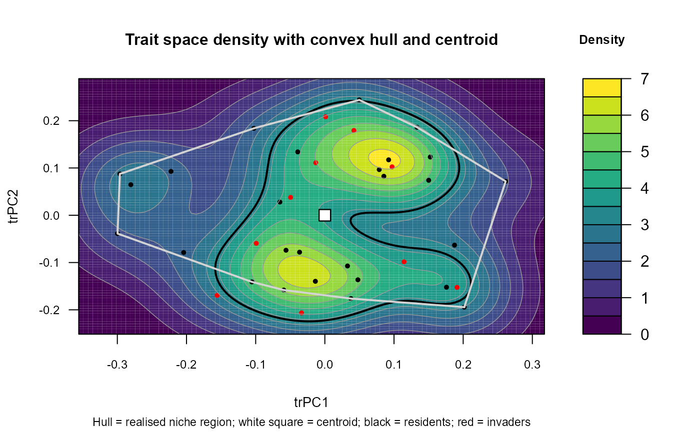

> :chart_with_upwards_trend: **Figure 5**: Heatmap plot showing how all
> species are mapped into a shared trait space (PCoA on Gower
> distances). Coloured contours show kernel-density “hotspots” of
> resident strategies, the white polygon is the resident convex hull
> (realised niche region), and the white square marks the cloud
> centroid. Residents (black points) form a clearly **multimodal**
> structure with two dense modes (upper-right and lower-centre),
> separated by a lower-density corridor. Invaders (red points) are
> mostly **inside the hull** and often fall near the dense resident
> cores, positions that imply **strong niche crowding** penalties. A few
> invaders sit near the hull boundary or in sparser regions of trait
> space, indicating **greater novelty** and potentially weaker crowding
> if local abiotic suitability is high.

``` r
# Dendogram plot
fit$traits$plots_ts$dend_plot
```


> :chart_with_upwards_trend: **Figure 6**: Dendogram plot shows
> hierarchical clustering species using Gower distances. The large
> splits (branch heights) and coloured/dashed groups reveal **distinct
> functional syndromes** that align with the density modes in the trait
> map: a leftmost (purple) clade is well separated, while central clades
> (blue/green) encompass the dense core, and smaller rightmost clades
> (yellow) capture peripheral strategies. Together, the panels show a
> resident community with strong trait structure; invaders overlapping
> core clusters should experience higher \\C^{(z)}\\ (crowding), whereas
> those on the periphery or near gaps in the hull may face weaker biotic
> resistance and thus higher establishment potential if \\r^{(z)}\\ is
> favourable.

:bar_chart: **Centrality ranks and hull maps** to highlight novelty and
diagnose ordination and kernel choices. The three figures below,
illustrate how invaders position relative to residents in trait space,
and how this affects their potential to establish.

``` r
# Check output structure
# str(fit$traits,1)
# str(fit$traits$plots_ch, 1)
# head(fit$crowding$C_js[1:4,1:4])

# Plot Centrality and hull status
if (!is.null(fit$traits$plots_ch)) {
  print(fit$traits$plots_ch$p_trait)
}
```

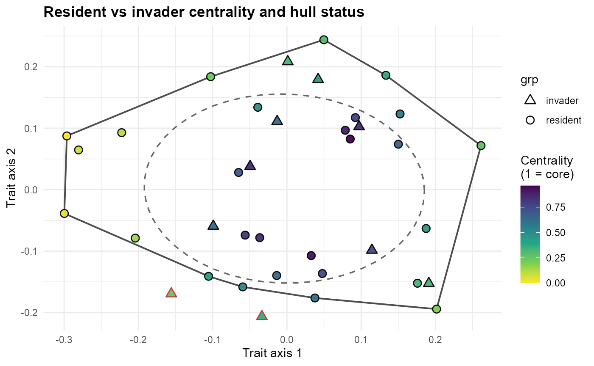

> :chart_with_upwards_trend: **Figure 7**: Centrality and hull status
> shows **residents (circles)** and **invaders (triangles)** embedded in
> a **two-dimensional trait space**. The **convex hull (solid polygon)**
> marks the **realised resident niche**, while the **dashed ellipse**
> indicates the **central core region**. Colour shading reflects
> **centrality** (values closer to 1 are deeper within the resident
> cloud). Many invaders fall inside the hull but with relatively **low
> centrality**, placing them nearer the trait-space **periphery**. A few
> invaders lie **outside the hull**, representing **novel strategies**
> not currently expressed by residents.

``` r
# Plot Mahalanobis distance distribution
fit$traits$plots_ch$p_dist
```


> :chart_with_upwards_trend: **Figure 8**: Mahalanobis distance
> distribution comparisons from the resident centroid. **Residents
> (grey)** cluster close to the centre, with most distances below 2-3
> units. **Invaders (red)** show a broader distribution, with some
> overlapping resident values but others displaced further into the
> tails. This highlights greater heterogeneity among invaders, with
> several occupying marginal or novel positions.

``` r
# Plot Invader ranking by centrality
fit$traits$plots_ch$p_rank
```

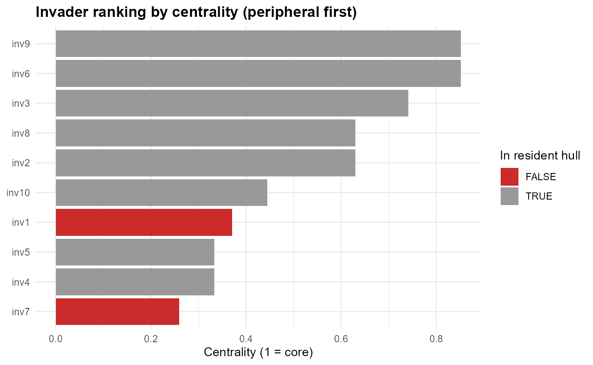

> :chart_with_upwards_trend: **Figure 9**: Invader ranking by centrality
> (from peripheral to core). **Peripheral invaders (low centrality)**
> are often those falling **outside the hull (red bars)**. These species
> represent the most novel introductions and are expected to experience
> **weaker crowding**, though their establishment will depend on abiotic
> suitability. Invaders with **higher centrality (grey bars)** overlap
> strongly with residents, implying **greater competition** and reduced
> establishment potential.

:sparkles: **Overall importance**: This stage anchors the trait geometry
and the resident-side crowding fields that everything else builds on.

:bulb: **Summary.** You now have a reproducible trait map, novelty
diagnostics, and \\C^{(z)}\_{js}\\ on a site-comparable scale.

------------------------------------------------------------------------

### Resident predictors (standardised): \\r^{(z)}\_{js}, C^{(z)}\_{js}, S^{(z)}\_{js}\\

[`model_residents()`](https://b-cubed-eu.github.io/invasimapr/reference/model_residents.md)
fits a residents-only GLMM that yields site-standardised **abiotic
suitability** \\r^{(z)}\_{js}\\ and carries forward **niche crowding**
\\C^{(z)}\_{js}\\. It also constructs a **site saturation** index
\\S^{(z)}\_{js}\\ broadcast from a site-only score.

:hourglass_flowing_sand: **What the wrapper does (step-by-step)**:

1.  **Standardises** environment and resident traits for the GLMM,
2.  **Builds** a transparent **formula** (with optional \\E\times T\\
    interactions),
3.  **Fits `glmmTMB`**,
4.  **Predicts fixed-effects** η for residents, and
5.  Applies per-site **z-scores** to \\r\_{js}\\.
6.  **Computes \\S_s\\** via a chosen mode and returns \\S^{(z)}\\.

#### Build the model frame and formula

[`build_model_formula()`](https://b-cubed-eu.github.io/invasimapr/reference/build_model_formula.md)
discovers predictors and assembles a formula that is reused for invaders
to ensure consistent structure.

:hourglass_flowing_sand: **Step-by-step**: It infers environment and
trait terms ➔ adds mains and optional \\E\times T\\ ➔ attaches
`(1|site) + (1|species)` and optional zero-correlation random slopes ➔
returns a valid `formula`.

:information_source: **Why this matters**: Consistent specification
across residents and invaders avoids scale drift and makes coefficients
interpretable in the trait plane.

:warning: **Checks/tips**: Keep naming conventions stable (`env_*`,
`trait_*`); avoid random slopes for site-only indices.

#### Fit the residents model (e.g., GLMM)

[`prep_resident_glmm()`](https://b-cubed-eu.github.io/invasimapr/reference/prep_resident_glmm.md)
expands the long site×resident frame, fits `glmmTMB`, and returns
fixed-effect predictions as a site×resident matrix.

:hourglass_flowing_sand: **Step-by-step**: It joins site environment and
resident traits ➔ coerces keys to factors ➔ fits a Tweedie log-link GLMM
➔ and predicts η with `re.form = NA`.

:information_source: **Why this matters**: Fixed-effect predictions
provide an **abiotic suitability** surface without borrowing random
effects across species or sites.

:warning: **Checks/tips**: Ensure numeric matrices, no `NA` predictors,
and sensible convergence (simplify interactions if needed).

#### Site-standardised resident predictors

[`standardise_by_site()`](https://b-cubed-eu.github.io/invasimapr/reference/standardise_by_site.md)
centres and scales each site row for \\r\_{js}\\ (and for \\C\_{js}\\ if
needed), yielding \\r^{(z)}\_{js}\\ and \\C^{(z)}\_{js}\\.

:hourglass_flowing_sand: **Step-by-step**: It computes row means and SDs
(robust optional) ➔ guards zero SD ➔ and returns z-scores plus moments.

:information_source: **Why this matters**: Within-site scaling makes
predictors comparable across species and ensures invaders can be
standardised on **resident moments**.

:warning: **Checks/tips**: Prefer robust scaling for skewed \\C\\;
retain `row_mean` and `row_sd` for invader standardisation.

#### Site-only saturation \\S_s\\ and global z-score

[`compute_site_saturation()`](https://b-cubed-eu.github.io/invasimapr/reference/compute_site_saturation.md)
builds a site-only competition index from totals, modelled dominance, or
evenness deficit, then applies a global z-score and broadcasts to
species.

:hourglass_flowing_sand: **Step-by-step**: It computes \\S_s\\ by mode ➔
applies global z ➔ and returns `S_js_z` for residents.

:information_source: **Why this matters**: \\S^{(z)}\\ captures
non-trait-specific crowding pressure and complements \\C^{(z)}\\.

:warning: **Checks/tips**: Do not add random slopes on \\S_z\\ (no
within-site variation); guard zero richness.

:zap: **Run
[`model_residents()`](https://b-cubed-eu.github.io/invasimapr/reference/model_residents.md)**
to fit the resident model (e.g. GLMM), construct standardised
predictors, and write results back to `fit$model` and `fit$residents`.

``` r
# try(source("D:/Methods/R/myR_Packages/b-cubed-versions/invasimapr/R/model_residents.R"), silent = TRUE)
# if (!exists("model_residents")) stop("model_residents() not found.")

# Run model_residents() function
fit = model_residents(
  fit,
  family = glmmTMB::tweedie(link = "log"),
  include_env_trait_interactions = TRUE,
  saturation_mode = "evenness_deficit",
  reduce_strategy = 'none',
  robust_r = TRUE
)

# print(fit)
# str(fit$model, 1)
# str(fit$residents, 1)
summary(fit$residents$fit_r)
#>  Family: tweedie  ( log )
#> Formula:          abundance ~ env1 + env2 + env3 + env4 + env5 + env6 + env7 +  
#>     env8 + env9 + env10 + trait_cont1 + trait_cont2 + trait_cont3 +  
#>     trait_cont4 + trait_cont5 + trait_cont6 + trait_cont7 + trait_cont8 +  
#>     trait_cont9 + trait_cont10 + trait_cat11 + trait_cat12 +  
#>     trait_cat13 + trait_cat14 + trait_cat15 + trait_ord16 + trait_ord17 +  
#>     trait_bin18 + trait_bin19 + trait_ord20 + (env1 + env2 +  
#>     env3 + env4 + env5 + env6 + env7 + env8 + env9 + env10):(trait_cont1 +  
#>     trait_cont2 + trait_cont3 + trait_cont4 + trait_cont5 + trait_cont6 +  
#>     trait_cont7 + trait_cont8 + trait_cont9 + trait_cont10 +  
#>     trait_cat11 + trait_cat12 + trait_cat13 + trait_cat14 + trait_cat15 +  
#>     trait_ord16 + trait_ord17 + trait_bin18 + trait_bin19 + trait_ord20) +  
#>     (1 | site) + (1 | species)
#> Data: attempt$rg$dat_r
#> 
#>       AIC       BIC    logLik -2*log(L)  df.resid 
#>   38197.5   40241.0  -18819.8   37639.5     10926 
#> 
#> Random effects:
#> 
#> Conditional model:
#>  Groups  Name        Variance Std.Dev.
#>  site    (Intercept) 0.006301 0.07938 
#>  species (Intercept) 0.001645 0.04056 
#> Number of obs: 11205, groups:  site, 415; species, 27
#> 
#> Dispersion parameter for tweedie family (): 7.98 
#> 
#> Conditional model:
#>                                 Estimate Std. Error z value Pr(>|z|)    
#> (Intercept)                    1.2833901  0.1361082   9.429  < 2e-16 ***
#> env1                           0.4238189  0.2730032   1.552 0.120559    
#> env2                          -0.4629570  0.2814522  -1.645 0.099993 .  
#> env3                          -0.1523661  0.3976060  -0.383 0.701565    
#> env4                           0.2574086  0.3011752   0.855 0.392728    
#> env5                           0.2883784  0.3298333   0.874 0.381946    
#> env6                           0.0920454  0.3380372   0.272 0.785396    
#> env7                           0.1802530  0.4869892   0.370 0.711280    
#> env8                          -0.1178539  0.4933806  -0.239 0.811206    
#> env9                          -0.1477103  0.4607070  -0.321 0.748501    
#> env10                         -0.2388646  0.5557325  -0.430 0.667327    
#> trait_cont1                   -0.2879529  0.0995748  -2.892 0.003830 ** 
#> trait_cont2                   -0.1468610  0.0429340  -3.421 0.000625 ***
#> trait_cont3                   -0.0183904  0.0671736  -0.274 0.784258    
#> trait_cont4                    0.0057871  0.0526189   0.110 0.912425    
#> trait_cont5                    0.0329278  0.0538160   0.612 0.540631    
#> trait_cont6                    0.0446251  0.0734411   0.608 0.543432    
#> trait_cont7                   -0.0332561  0.0488246  -0.681 0.495787    
#> trait_cont8                    0.0582392  0.0701413   0.830 0.406362    
#> trait_cont9                   -0.0030572  0.0521304  -0.059 0.953235    
#> trait_cont10                   0.0757443  0.0495473   1.529 0.126332    
#> trait_cat11grassland           0.0384514  0.1842370   0.209 0.834678    
#> trait_cat11wetland            -0.1194091  0.2430696  -0.491 0.623246    
#> trait_cat12nocturnal          -0.2214629  0.1160278  -1.909 0.056300 .  
#> trait_cat13multivoltine        0.0069169  0.0965116   0.072 0.942866    
#> trait_cat13univoltine         -0.1972040  0.1309296  -1.506 0.132020    
#> trait_cat14generalist          0.0380147  0.2600996   0.146 0.883799    
#> trait_cat14nectarivore         0.2441572  0.1720548   1.419 0.155880    
#> trait_cat15resident           -0.0448762  0.1352528  -0.332 0.740044    
#> trait_ord16                    0.0155845  0.0581019   0.268 0.788525    
#> trait_ord17                   -0.0457999  0.0426140  -1.075 0.282481    
#> trait_bin18                    0.0384106  0.0484466   0.793 0.427869    
#> trait_bin19                    0.0104646  0.0576802   0.181 0.856035    
#> trait_ord20medium              0.0838120  0.2635444   0.318 0.750471    
#> trait_ord20small              -0.1652942  0.1540706  -1.073 0.283340    
#> env1:trait_cont1               0.2590543  0.2018959   1.283 0.199454    
#> env1:trait_cont2               0.0511837  0.0872490   0.587 0.557446    
#> env1:trait_cont3               0.0419782  0.1365365   0.307 0.758500    
#> env1:trait_cont4               0.0569235  0.1068453   0.533 0.594196    
#> env1:trait_cont5              -0.1396320  0.1099753  -1.270 0.204203    
#> env1:trait_cont6              -0.1149766  0.1490549  -0.771 0.440487    
#> env1:trait_cont7               0.0247308  0.1007236   0.246 0.806045    
#> env1:trait_cont8              -0.0832165  0.1424527  -0.584 0.559107    
#> env1:trait_cont9               0.0193295  0.1069047   0.181 0.856516    
#> env1:trait_cont10             -0.0166879  0.1012074  -0.165 0.869032    
#> env1:trait_cat11grassland     -0.2495010  0.3716669  -0.671 0.502028    
#> env1:trait_cat11wetland       -0.2737927  0.4937667  -0.554 0.579238    
#> env1:trait_cat12nocturnal     -0.0896390  0.2365215  -0.379 0.704696    
#> env1:trait_cat13multivoltine   0.1300371  0.1954317   0.665 0.505805    
#> env1:trait_cat13univoltine     0.2479814  0.2637601   0.940 0.347126    
#> env1:trait_cat14generalist     0.1803710  0.5286677   0.341 0.732968    
#> env1:trait_cat14nectarivore   -0.2256056  0.3489209  -0.647 0.517903    
#> env1:trait_cat15resident      -0.1195242  0.2759828  -0.433 0.664952    
#> env1:trait_ord16               0.0164264  0.1176699   0.140 0.888978    
#> env1:trait_ord17              -0.0983943  0.0860021  -1.144 0.252585    
#> env1:trait_bin18              -0.0447998  0.0978090  -0.458 0.646928    
#> env1:trait_bin19              -0.0989036  0.1160240  -0.852 0.393970    
#> env1:trait_ord20medium        -0.1203885  0.5353213  -0.225 0.822065    
#> env1:trait_ord20small          0.2076244  0.3127982   0.664 0.506841    
#> env2:trait_cont1              -0.1073236  0.2099272  -0.511 0.609182    
#> env2:trait_cont2               0.0998720  0.0909106   1.099 0.271954    
#> env2:trait_cont3              -0.0302382  0.1432439  -0.211 0.832812    
#> env2:trait_cont4               0.0062584  0.1123871   0.056 0.955592    
#> env2:trait_cont5              -0.0215891  0.1145595  -0.188 0.850522    
#> env2:trait_cont6               0.0958735  0.1549708   0.619 0.536143    
#> env2:trait_cont7              -0.1614124  0.1051725  -1.535 0.124848    
#> env2:trait_cont8              -0.1579836  0.1475678  -1.071 0.284357    
#> env2:trait_cont9              -0.0824353  0.1116071  -0.739 0.460137    
#> env2:trait_cont10              0.0042922  0.1059621   0.041 0.967689    
#> env2:trait_cat11grassland      0.3465967  0.3880252   0.893 0.371733    
#> env2:trait_cat11wetland       -0.1429870  0.5138745  -0.278 0.780818    
#> env2:trait_cat12nocturnal     -0.0109025  0.2464091  -0.044 0.964709    
#> env2:trait_cat13multivoltine   0.0772089  0.2022998   0.382 0.702717    
#> env2:trait_cat13univoltine    -0.0152930  0.2723597  -0.056 0.955222    
#> env2:trait_cat14generalist     0.0938038  0.5469770   0.171 0.863835    
#> env2:trait_cat14nectarivore    0.0034584  0.3626978   0.010 0.992392    
#> env2:trait_cat15resident       0.0934440  0.2852982   0.328 0.743266    
#> env2:trait_ord16               0.1898966  0.1219071   1.558 0.119301    
#> env2:trait_ord17               0.1206038  0.0899711   1.340 0.180092    
#> env2:trait_bin18               0.0037917  0.1020570   0.037 0.970363    
#> env2:trait_bin19               0.0436744  0.1229657   0.355 0.722458    
#> env2:trait_ord20medium        -0.1337030  0.5551158  -0.241 0.809667    
#> env2:trait_ord20small          0.1591382  0.3209528   0.496 0.620014    
#> env3:trait_cont1              -0.0372629  0.2951912  -0.126 0.899548    
#> env3:trait_cont2               0.0420001  0.1284998   0.327 0.743782    
#> env3:trait_cont3               0.0621160  0.1991385   0.312 0.755099    
#> env3:trait_cont4               0.0263516  0.1563270   0.169 0.866137    
#> env3:trait_cont5              -0.0431644  0.1605220  -0.269 0.788006    
#> env3:trait_cont6               0.1030986  0.2177213   0.474 0.635832    
#> env3:trait_cont7              -0.1336400  0.1481034  -0.902 0.366875    
#> env3:trait_cont8              -0.0871097  0.2080141  -0.419 0.675385    
#> env3:trait_cont9               0.0312030  0.1557542   0.200 0.841219    
#> env3:trait_cont10             -0.0836775  0.1486914  -0.563 0.573599    
#> env3:trait_cat11grassland      0.0530339  0.5416079   0.098 0.921996    
#> env3:trait_cat11wetland        0.0004273  0.7215614   0.001 0.999527    
#> env3:trait_cat12nocturnal      0.0338567  0.3435294   0.099 0.921491    
#> env3:trait_cat13multivoltine  -0.0355021  0.2866598  -0.124 0.901436    
#> env3:trait_cat13univoltine    -0.0267714  0.3821760  -0.070 0.944154    
#> env3:trait_cat14generalist    -0.0064808  0.7741574  -0.008 0.993321    
#> env3:trait_cat14nectarivore    0.1040584  0.5059753   0.206 0.837057    
#> env3:trait_cat15resident       0.1061745  0.4041305   0.263 0.792764    
#> env3:trait_ord16               0.0159803  0.1718122   0.093 0.925895    
#> env3:trait_ord17               0.1282873  0.1257695   1.020 0.307719    
#> env3:trait_bin18              -0.1023514  0.1429024  -0.716 0.473848    
#> env3:trait_bin19               0.0989221  0.1715115   0.577 0.564097    
#> env3:trait_ord20medium        -0.0583839  0.7834286  -0.075 0.940594    
#> env3:trait_ord20small          0.0076437  0.4583593   0.017 0.986695    
#> env4:trait_cont1               0.1871081  0.2217728   0.844 0.398841    
#> env4:trait_cont2              -0.0448973  0.0951791  -0.472 0.637131    
#> env4:trait_cont3               0.1660386  0.1507123   1.102 0.270595    
#> env4:trait_cont4               0.0513924  0.1184007   0.434 0.664248    
#> env4:trait_cont5               0.0259057  0.1226941   0.211 0.832777    
#> env4:trait_cont6              -0.0927677  0.1635505  -0.567 0.570570    
#> env4:trait_cont7               0.1163699  0.1121210   1.038 0.299319    
#> env4:trait_cont8              -0.0180249  0.1561764  -0.115 0.908117    
#> env4:trait_cont9               0.0772283  0.1170715   0.660 0.509467    
#> env4:trait_cont10             -0.0208430  0.1107179  -0.188 0.850678    
#> env4:trait_cat11grassland     -0.1799181  0.4028088  -0.447 0.655122    
#> env4:trait_cat11wetland        0.3953166  0.5415347   0.730 0.465394    
#> env4:trait_cat12nocturnal     -0.0130807  0.2587156  -0.051 0.959676    
#> env4:trait_cat13multivoltine  -0.0585961  0.2173298  -0.270 0.787454    
#> env4:trait_cat13univoltine     0.0947713  0.2903156   0.326 0.744090    
#> env4:trait_cat14generalist     0.0786553  0.5813832   0.135 0.892383    
#> env4:trait_cat14nectarivore    0.0233595  0.3815324   0.061 0.951180    
#> env4:trait_cat15resident      -0.1226286  0.3045990  -0.403 0.687250    
#> env4:trait_ord16              -0.1742459  0.1306910  -1.333 0.182444    
#> env4:trait_ord17              -0.0095848  0.0936071  -0.102 0.918444    
#> env4:trait_bin18               0.1460148  0.1070335   1.364 0.172505    
#> env4:trait_bin19              -0.1382084  0.1268928  -1.089 0.276077    
#> env4:trait_ord20medium        -0.1994732  0.5888167  -0.339 0.734783    
#> env4:trait_ord20small         -0.2580449  0.3457473  -0.746 0.455462    
#> env5:trait_cont1               0.0123702  0.2456663   0.050 0.959841    
#> env5:trait_cont2              -0.0609928  0.1066625  -0.572 0.567438    
#> env5:trait_cont3               0.0756810  0.1652044   0.458 0.646877    
#> env5:trait_cont4               0.0216662  0.1288836   0.168 0.866499    
#> env5:trait_cont5               0.0346696  0.1318799   0.263 0.792637    
#> env5:trait_cont6              -0.0602581  0.1811538  -0.333 0.739410    
#> env5:trait_cont7               0.0551824  0.1224985   0.450 0.652368    
#> env5:trait_cont8               0.0679692  0.1728442   0.393 0.694142    
#> env5:trait_cont9               0.0678823  0.1291918   0.525 0.599278    
#> env5:trait_cont10             -0.0582309  0.1233393  -0.472 0.636841    
#> env5:trait_cat11grassland     -0.1218774  0.4491573  -0.271 0.786124    
#> env5:trait_cat11wetland        0.0071179  0.6004955   0.012 0.990543    
#> env5:trait_cat12nocturnal     -0.1119143  0.2868002  -0.390 0.696376    
#> env5:trait_cat13multivoltine  -0.1107300  0.2358441  -0.470 0.638709    
#> env5:trait_cat13univoltine    -0.2036733  0.3176916  -0.641 0.521455    
#> env5:trait_cat14generalist    -0.2461068  0.6403223  -0.384 0.700720    
#> env5:trait_cat14nectarivore   -0.0526845  0.4223282  -0.125 0.900723    
#> env5:trait_cat15resident       0.0484835  0.3353476   0.145 0.885045    
#> env5:trait_ord16              -0.0811707  0.1411523  -0.575 0.565252    
#> env5:trait_ord17              -0.0972289  0.1035414  -0.939 0.347713    
#> env5:trait_bin18               0.1027040  0.1188081   0.864 0.387339    
#> env5:trait_bin19              -0.0636271  0.1419014  -0.448 0.653872    
#> env5:trait_ord20medium         0.0120206  0.6490946   0.019 0.985225    
#> env5:trait_ord20small         -0.2150638  0.3789890  -0.567 0.570397    
#> env6:trait_cont1              -0.0246898  0.2480779  -0.100 0.920722    
#> env6:trait_cont2              -0.0004339  0.1071391  -0.004 0.996769    
#> env6:trait_cont3               0.0226814  0.1673397   0.136 0.892184    
#> env6:trait_cont4               0.0534481  0.1317414   0.406 0.684960    
#> env6:trait_cont5               0.1094548  0.1359880   0.805 0.420886    
#> env6:trait_cont6               0.1142859  0.1832831   0.624 0.532924    
#> env6:trait_cont7               0.1214664  0.1249329   0.972 0.330925    
#> env6:trait_cont8               0.1004448  0.1755440   0.572 0.567192    
#> env6:trait_cont9               0.0738422  0.1303336   0.567 0.571011    
#> env6:trait_cont10              0.0337164  0.1243256   0.271 0.786241    
#> env6:trait_cat11grassland     -0.3415737  0.4513362  -0.757 0.449166    
#> env6:trait_cat11wetland       -0.1465829  0.6027141  -0.243 0.807847    
#> env6:trait_cat12nocturnal      0.2060312  0.2883638   0.714 0.474928    
#> env6:trait_cat13multivoltine  -0.2666277  0.2412991  -1.105 0.269174    
#> env6:trait_cat13univoltine     0.2117171  0.3250485   0.651 0.514827    
#> env6:trait_cat14generalist    -0.3044428  0.6501297  -0.468 0.639584    
#> env6:trait_cat14nectarivore   -0.0652948  0.4260207  -0.153 0.878188    
#> env6:trait_cat15resident       0.0024190  0.3407272   0.007 0.994335    
#> env6:trait_ord16              -0.1436754  0.1453234  -0.989 0.322830    
#> env6:trait_ord17               0.0901250  0.1052978   0.856 0.392050    
#> env6:trait_bin18              -0.0602324  0.1202303  -0.501 0.616388    
#> env6:trait_bin19               0.0404023  0.1420808   0.284 0.776133    
#> env6:trait_ord20medium         0.3375212  0.6570004   0.514 0.607440    
#> env6:trait_ord20small          0.0095392  0.3848254   0.025 0.980224    
#> env7:trait_cont1              -0.1730178  0.3627418  -0.477 0.633382    
#> env7:trait_cont2              -0.0316228  0.1574463  -0.201 0.840817    
#> env7:trait_cont3              -0.1838059  0.2450052  -0.750 0.453127    
#> env7:trait_cont4               0.0300894  0.1917809   0.157 0.875328    
#> env7:trait_cont5              -0.1932804  0.1958736  -0.987 0.323760    
#> env7:trait_cont6              -0.0130956  0.2664564  -0.049 0.960802    
#> env7:trait_cont7              -0.0292479  0.1810542  -0.162 0.871666    
#> env7:trait_cont8               0.0192467  0.2547439   0.076 0.939775    
#> env7:trait_cont9               0.0404890  0.1916159   0.211 0.832651    
#> env7:trait_cont10              0.0584509  0.1818610   0.321 0.747904    
#> env7:trait_cat11grassland     -0.1630086  0.6679496  -0.244 0.807197    
#> env7:trait_cat11wetland        0.0845999  0.8871659   0.095 0.924029    
#> env7:trait_cat12nocturnal     -0.3929308  0.4254169  -0.924 0.355675    
#> env7:trait_cat13multivoltine  -0.0399157  0.3498784  -0.114 0.909171    
#> env7:trait_cat13univoltine     0.0647597  0.4663271   0.139 0.889551    
#> env7:trait_cat14generalist     0.2251639  0.9501766   0.237 0.812680    
#> env7:trait_cat14nectarivore    0.1571325  0.6249955   0.251 0.801494    
#> env7:trait_cat15resident      -0.1963711  0.4947895  -0.397 0.691457    
#> env7:trait_ord16               0.0412175  0.2100704   0.196 0.844447    
#> env7:trait_ord17              -0.1892053  0.1544197  -1.225 0.220475    
#> env7:trait_bin18              -0.0525759  0.1748677  -0.301 0.763673    
#> env7:trait_bin19               0.0490433  0.2095157   0.234 0.814923    
#> env7:trait_ord20medium        -0.0208916  0.9611256  -0.022 0.982658    
#> env7:trait_ord20small          0.0436226  0.5605275   0.078 0.937968    
#> env8:trait_cont1              -0.0992404  0.3664092  -0.271 0.786510    
#> env8:trait_cont2              -0.0059324  0.1597249  -0.037 0.970372    
#> env8:trait_cont3              -0.1333658  0.2480298  -0.538 0.590784    
#> env8:trait_cont4              -0.0397340  0.1949399  -0.204 0.838489    
#> env8:trait_cont5               0.0284401  0.2002928   0.142 0.887086    
#> env8:trait_cont6              -0.0124557  0.2704537  -0.046 0.963266    
#> env8:trait_cont7              -0.0510572  0.1848869  -0.276 0.782430    
#> env8:trait_cont8               0.0222058  0.2579816   0.086 0.931407    
#> env8:trait_cont9              -0.0568809  0.1938428  -0.293 0.769187    
#> env8:trait_cont10              0.0581838  0.1849161   0.315 0.753027    
#> env8:trait_cat11grassland      0.1557119  0.6715923   0.232 0.816651    
#> env8:trait_cat11wetland       -0.0711748  0.8961786  -0.079 0.936698    
#> env8:trait_cat12nocturnal      0.0424624  0.4281492   0.099 0.920998    
#> env8:trait_cat13multivoltine   0.0343569  0.3565739   0.096 0.923240    
#> env8:trait_cat13univoltine     0.0215318  0.4744210   0.045 0.963800    
#> env8:trait_cat14generalist    -0.0032950  0.9606829  -0.003 0.997263    
#> env8:trait_cat14nectarivore   -0.1248816  0.6285140  -0.199 0.842503    
#> env8:trait_cat15resident       0.1079409  0.5033339   0.214 0.830195    
#> env8:trait_ord16               0.0692422  0.2139331   0.324 0.746193    
#> env8:trait_ord17              -0.0738160  0.1565469  -0.472 0.637265    
#> env8:trait_bin18               0.1069665  0.1770867   0.604 0.545821    
#> env8:trait_bin19               0.0481182  0.2126110   0.226 0.820952    
#> env8:trait_ord20medium         0.0603182  0.9705939   0.062 0.950447    
#> env8:trait_ord20small          0.0944765  0.5688332   0.166 0.868088    
#> env9:trait_cont1              -0.0073004  0.3413243  -0.021 0.982936    
#> env9:trait_cont2               0.0454615  0.1480482   0.307 0.758788    
#> env9:trait_cont3              -0.1361370  0.2306877  -0.590 0.555100    
#> env9:trait_cont4              -0.0592998  0.1810096  -0.328 0.743210    
#> env9:trait_cont5              -0.0149632  0.1850655  -0.081 0.935559    
#> env9:trait_cont6               0.1050022  0.2515981   0.417 0.676429    
#> env9:trait_cont7              -0.0480970  0.1717226  -0.280 0.779412    
#> env9:trait_cont8               0.0070151  0.2410816   0.029 0.976786    
#> env9:trait_cont9              -0.0165517  0.1801239  -0.092 0.926785    
#> env9:trait_cont10              0.0693048  0.1715746   0.404 0.686261    
#> env9:trait_cat11grassland     -0.0347783  0.6246313  -0.056 0.955598    
#> env9:trait_cat11wetland       -0.1138468  0.8314303  -0.137 0.891087    
#> env9:trait_cat12nocturnal      0.1370395  0.3984670   0.344 0.730909    
#> env9:trait_cat13multivoltine   0.0189703  0.3299463   0.057 0.954151    
#> env9:trait_cat13univoltine     0.2276917  0.4407246   0.517 0.605414    
#> env9:trait_cat14generalist     0.1737563  0.8933064   0.195 0.845777    
#> env9:trait_cat14nectarivore    0.1109390  0.5863222   0.189 0.849927    
#> env9:trait_cat15resident      -0.0600524  0.4682556  -0.128 0.897953    
#> env9:trait_ord16               0.1000814  0.1981401   0.505 0.613485    
#> env9:trait_ord17               0.1797645  0.1447305   1.242 0.214213    
#> env9:trait_bin18              -0.1115117  0.1650530  -0.676 0.499287    
#> env9:trait_bin19               0.1064867  0.1969115   0.541 0.588656    
#> env9:trait_ord20medium        -0.0006363  0.9029495  -0.001 0.999438    
#> env9:trait_ord20small         -0.0269392  0.5265848  -0.051 0.959199    
#> env10:trait_cont1              0.1912956  0.4139308   0.462 0.643978    
#> env10:trait_cont2             -0.0157284  0.1797682  -0.087 0.930280    
#> env10:trait_cont3              0.0801624  0.2793349   0.287 0.774131    
#> env10:trait_cont4             -0.1313472  0.2184302  -0.601 0.547625    
#> env10:trait_cont5              0.2234582  0.2237496   0.999 0.317941    
#> env10:trait_cont6              0.0052068  0.3047726   0.017 0.986369    
#> env10:trait_cont7              0.0064104  0.2063383   0.031 0.975216    
#> env10:trait_cont8              0.0719547  0.2909494   0.247 0.804668    
#> env10:trait_cont9             -0.0336234  0.2186681  -0.154 0.877795    
#> env10:trait_cont10            -0.0796577  0.2078604  -0.383 0.701551    
#> env10:trait_cat11grassland     0.1113663  0.7630030   0.146 0.883955    
#> env10:trait_cat11wetland       0.0414050  1.0116675   0.041 0.967354    
#> env10:trait_cat12nocturnal     0.4401441  0.4845083   0.908 0.363649    
#> env10:trait_cat13multivoltine  0.0390652  0.3989402   0.098 0.921994    
#> env10:trait_cat13univoltine   -0.2102280  0.5343190  -0.393 0.693987    
#> env10:trait_cat14generalist   -0.1335313  1.0841116  -0.123 0.901972    
#> env10:trait_cat14nectarivore   0.0755655  0.7124468   0.106 0.915531    
#> env10:trait_cat15resident      0.2440925  0.5650561   0.432 0.665756    
#> env10:trait_ord16             -0.1135952  0.2396225  -0.474 0.635458    
#> env10:trait_ord17              0.1761947  0.1770831   0.995 0.319745    
#> env10:trait_bin18              0.0451127  0.1997347   0.226 0.821308    
#> env10:trait_bin19              0.0482269  0.2394590   0.201 0.840386    
#> env10:trait_ord20medium       -0.0248263  1.0958666  -0.023 0.981926    
#> env10:trait_ord20small        -0.2894524  0.6378556  -0.454 0.649980    
#> ---
#> Signif. codes:  0 '***' 0.001 '**' 0.01 '*' 0.05 '.' 0.1 ' ' 1
```

:card_index_dividers: **Save the core resident model objects** used for
invader predictions.

``` r
str(fit$residents, 1)
#> List of 16
#>  $ fit_r   :List of 7
#>   ..- attr(*, "class")= chr "glmmTMB"
#>  $ dat_r   :'data.frame':    11205 obs. of  33 variables:
#>  $ grid_res:'data.frame':    11205 obs. of  33 variables:
#>  $ fml     :Class 'formula'  language abundance ~ env1 + env2 + env3 + env4 + env5 + env6 + env7 + env8 + env9 +      env10 + trait_cont1 + trait_cont2| __truncated__ ...
#>   .. ..- attr(*, ".Environment")=<environment: 0x000001e6fbf8da80> 
#>  $ r_js    : num [1:415, 1:27] 1.061 0.957 1.218 1.247 1.415 ...
#>   ..- attr(*, "dimnames")=List of 2
#>  $ mu_js   : num [1:415, 1:27] 2.89 2.6 3.38 3.48 4.12 ...
#>   ..- attr(*, "dimnames")=List of 2
#>  $ r_js_z  : num [1:415, 1:27] -0.1157 -0.2056 0.0858 -0.1993 0.1854 ...
#>   ..- attr(*, "dimnames")=List of 2
#>  $ r_mu_s  : Named num [1:415] 1.17 1.14 1.14 1.39 1.25 ...
#>   ..- attr(*, "names")= chr [1:415] "82" "83" "84" "117" ...
#>  $ r_sd_s  : Named num [1:415] 0.906 0.909 0.884 0.703 0.898 ...
#>   ..- attr(*, "names")= chr [1:415] "82" "83" "84" "117" ...
#>  $ C_js_z  : num [1:415, 1:27] 1.028 -1.057 1.46 0.881 1.484 ...
#>   ..- attr(*, "dimnames")=List of 2
#>  $ C_mu_s  : Named num [1:415] 1.98 1.74 1.61 2.06 1.61 ...
#>   ..- attr(*, "names")= chr [1:415] "82" "83" "84" "117" ...
#>  $ C_sd_s  : Named num [1:415] 0.154 0.101 0.159 0.177 0.176 ...
#>   ..- attr(*, "names")= chr [1:415] "82" "83" "84" "117" ...
#>  $ S_s     : Named num [1:415] 0.0798 0.025 0.1327 0.1478 0.226 ...
#>   ..- attr(*, "names")= chr [1:415] "82" "83" "84" "117" ...
#>  $ S_s_z   : Named num [1:415] 0.172 -1.104 1.406 1.758 3.579 ...
#>   ..- attr(*, "names")= chr [1:415] "82" "83" "84" "117" ...
#>  $ S_js_z  : num [1:415, 1:27] 0.172 -1.104 1.406 1.758 3.579 ...
#>   ..- attr(*, "dimnames")=List of 2
#>  $ messages: chr [1:2] "preflight_gb=0.02" "path=original"
r_js    = fit$residents$r_js
r_js_z  = fit$residents$r_js_z
C_js_z  = fit$residents$C_js_z
S_s_z   = fit$residents$S_s_z
S_js_z  = fit$residents$S_js_z

r_mu_s  = fit$residents$r_mu_s
r_sd_s  = fit$residents$r_sd_s
```

:bar_chart: **Site map of \\S^{(z)}\\** and quick checks on the spread
of \\C^{(z)}\\ to help confirm scales and hotspots.

``` r
# str(fit$residents,1)
head(fit$residents$S_js_z[1:4,1:4])
#>     Acraea horta Amata cerbera Bicyclus safitza safitza Cacyreus lingeus
#> 82     0.1720317     0.1720317                0.1720317        0.1720317
#> 83    -1.1043100    -1.1043100               -1.1043100       -1.1043100
#> 84     1.4055746     1.4055746                1.4055746        1.4055746
#> 117    1.7579032     1.7579032                1.7579032        1.7579032

site_sat_df = data.frame(
  site  = names(fit$residents$S_s_z),
  S_s_z = as.numeric(fit$residents$S_s_z),
  row.names = NULL, check.names = FALSE) |>
  dplyr::left_join(site_df, by = "site")

ggplot2::ggplot(site_sat_df, ggplot2::aes(x, y, fill = S_s_z)) +
  ggplot2::geom_tile() +
  ggplot2::scale_fill_viridis_c(name=expression(Mean~S^{(z)}), direction=-1) +
  ggplot2::geom_sf(data = rsa, inherit.aes = FALSE, fill = NA, color = "black", size = 0.3) +
  ggplot2::labs(title = expression("Mean saturation (" * S^z * ") across sites"), x = "Longitude", y = "Latitude") +
  ggplot2::theme_minimal()
```

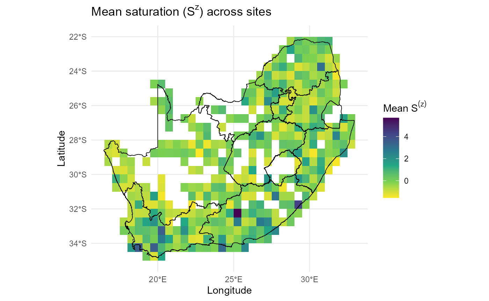

> :chart_with_upwards_trend: **Figures 10**: The map shows the mean
> saturation term (\\S^{(z)}\\) across sites in South Africa, calculated
> from the relative abundance structure of resident communities. Warmer
> colours (yellow) indicate sites with low saturation values, suggesting
> lower levels of resident dominance, whereas cooler colours (green to
> purple) highlight sites with higher saturation, where resident
> communities are dense and strongly filled. The pattern is
> heterogeneous: several regions, including the south-western Cape and
> parts of the interior plateau, show pronounced hotspots of high
> saturation, while coastal and northern areas are more lightly
> saturated. This map is an important diagnostic for the **site
> saturation predictor** in the invasion fitness framework. Areas of
> high \\S^{(z)}\\ reflect environments where invaders are expected to
> experience stronger suppression from resident dominance, regardless of
> their trait alignment. Conversely, low-saturation sites highlight
> potential windows of opportunity where invaders may establish more
> easily if abiotic suitability and trait differences align.

:zap: In practice, visualising \\S^{(z)}\\ confirms both the spatial
scaling of the predictor and the ecological plausibility of hotspots,
ensuring that subsequent invasion fitness calculations are grounded in
realistic community saturation patterns.

:sparkles: **Overall importance**: This step produces resident-only,
site-comparable predictors that define the scale on which invaders will
be evaluated.

:bulb: **Summary.** You now have \\r^{(z)}\_{js}\\, \\C^{(z)}\_{js}\\,
and \\S^{(z)}\_{js}\\ with resident moments saved for invader scaling.

------------------------------------------------------------------------

### Learn trait- and site-varying sensitivities (\\\alpha, \beta, \Gamma/\gamma\\)

[`learn_sensitivities()`](https://b-cubed-eu.github.io/invasimapr/reference/learn_sensitivities.md)
fits an auxiliary GLMM to relate \\r^{(z)}, C^{(z)}, S^{(z)}\\ to
positions in trait space, deriving trait-varying sensitivities and
optional site-varying slopes from random-slope components.

:hourglass_flowing_sand: **What the wrapper does (step-by-step)**:

1.  Builds a long **residents table** with
    \\(\mathrm{tr1},\mathrm{tr2})\\,
2.  **Fits interactions** between predictors and the trait plane,
3.  **Extracts slopes** to compute \\\alpha_i\\, \\\beta_i\\ (signed
    optional), \\\theta_i\\,
4.  Applies a **test for trait-varying \\\gamma\\** (Wald by default;
    likelihood-ratio test (LRT) optional), and
5.  (optionally) **Combines site random slopes** to produce
    \\\alpha\_{is}\\ and \\\Gamma\_{is}\\.

#### Auxiliary residents-only model on standardised predictors

[`fit_auxiliary_residents_glmm()`](https://b-cubed-eu.github.io/invasimapr/reference/fit_auxiliary_residents_glmm.md)
estimates how slopes on \\r^{(z)}, C^{(z)}, S^{(z)}\\ vary with
\\(\mathrm{tr1},\mathrm{tr2})\\.

:hourglass_flowing_sand: **Step-by-step**: It creates one row per site ×
resident ➔ adds predictors and trait coordinates ➔ fits interactions
`(r_z + C_z + S_z) × (tr1 + tr2)` with `(1|site) + (1|species)` and
optional site random slopes for `r_z` and `C_z`.

:information_source: **Why this matters**: The fitted slope systems
underpin trait-varying and site-varying sensitivities for invasion
fitness.

:warning: **Checks/tips**: Ensure \\(\mathrm{tr1},\mathrm{tr2})\\ come
from the same PCoA used elsewhere; keep `re.form = NA` when predicting;
avoid slopes on site-only `S_z`.

#### Trait-varying sensitivities and \\\gamma\\

[`derive_sensitivities()`](https://b-cubed-eu.github.io/invasimapr/reference/derive_sensitivities.md)
parses fixed effects to compute trait-dependent coefficients and chooses
\\\gamma\\ via an LRT.

:hourglass_flowing_sand: **Step-by-step**: It evaluates slopes at each
invader’s \\(\mathrm{tr1},\mathrm{tr2})\\ ➔ maps crowding/saturation
slopes to \\\alpha_i, \beta_i\\ (or signed \\\beta\\) ➔ and returns
\\\theta_0, \theta_i, \gamma_i\\ with diagnostics.

:information_source: **Why this matters**: These parameters translate
trait position into how hard crowding bites and how steep abiotic gains
are.

:warning: **Checks/tips**: Match `Q_inv` rownames and columns; inspect
distributions of \\\alpha_i\\ and \\\beta_i\\ for degeneracy. By
default, a Wald \\\chi^2\\ test is used; set `lrt = "lrt"` for a
likelihood-ratio test, or `lrt = "none"` to skip testing.

#### Site-varying penalties and slopes \\\alpha\_{is}\\ and \\\Gamma\_{is}\\

[`site_varying_alpha_beta_gamma()`](https://b-cubed-eu.github.io/invasimapr/reference/site_varying_alpha_beta_gamma.md)
combines trait-varying slopes with site random-slope deviations to form
site×invader versions where appropriate.

:hourglass_flowing_sand: **Step-by-step**: It sums fixed and
random-slope parts for `C_z` and `r_z` ➔ clamps \\\alpha\_{is} \ge 0\\ ➔
and returns tidy tables for heatmaps and summaries.

:information_source: **Why this matters**: Site heterogeneity modulates
how universal or local the inferred penalties and gains are.

:warning: **Checks/tips**: Include `(0 + C_z || site)` and optionally
`(0 + r_z || site)` in the auxiliary model; weak random-slope variance
implies little site variation.

:zap: **Run
[`learn_sensitivities()`](https://b-cubed-eu.github.io/invasimapr/reference/learn_sensitivities.md)**
to fit the auxiliary model, derive trait- and site-varying
sensitivities, and attach them to `fit$sensitivities`.

``` r
# try(source("D:/Methods/R/myR_Packages/b-cubed-versions/invasimapr/R/learn_sensitivities.R"), silent = TRUE)
# if (!exists("learn_sensitivities")) stop("learn_sensitivities() not found.")

fit = learn_sensitivities(
  fit,
  use_site_random_slopes = TRUE,
  lrt = TRUE
)

str(fit$sensitivities, 1)
#> List of 26
#>  $ fit_coeffs           :List of 7
#>   ..- attr(*, "class")= chr "glmmTMB"
#>  $ data_used            : tibble [11,205 × 8] (S3: tbl_df/tbl/data.frame)
#>  $ formula              :Class 'formula'  language log1p(abundance) ~ (r_z + C_z + S_z) * (tr1 + tr2) + (1 | species) + (1 |      site) + (0 + r_z || site) + (0 + C_z || site)
#>   .. ..- attr(*, ".Environment")=<environment: 0x000001e6da3aeb30> 
#>  $ alpha_i              : Named num [1:10] 0.982 0.964 0.973 0.981 0.937 ...
#>   ..- attr(*, "names")= chr [1:10] "inv1" "inv2" "inv3" "inv4" ...
#>  $ alpha_signed_i       : Named num [1:10] 0.982 0.964 0.973 0.981 0.937 ...
#>   ..- attr(*, "names")= chr [1:10] "inv1" "inv2" "inv3" "inv4" ...
#>  $ beta_i               : Named num [1:10] 0.0883 0.0695 0.0833 0.0925 0.045 ...
#>   ..- attr(*, "names")= chr [1:10] "inv1" "inv2" "inv3" "inv4" ...
#>  $ beta_signed_i        : Named num [1:10] -0.0883 -0.0695 -0.0833 -0.0925 -0.045 ...
#>   ..- attr(*, "names")= chr [1:10] "inv1" "inv2" "inv3" "inv4" ...
#>  $ theta0               : num 0.213
#>  $ theta_i              : Named num [1:10] 0.231 0.21 0.233 0.245 0.192 ...
#>   ..- attr(*, "names")= chr [1:10] "inv1" "inv2" "inv3" "inv4" ...
#>  $ gamma_i              : Named num [1:10] 0.213 0.213 0.213 0.213 0.213 ...
#>   ..- attr(*, "names")= chr [1:10] "inv1" "inv2" "inv3" "inv4" ...
#>  $ wald_lrt             :'data.frame':   1 obs. of  4 variables:
#>  $ sens_df              :'data.frame':   10 obs. of  13 variables:
#>  $ clamp_summary        :List of 5
#>  $ prior_note           : chr "Biotic effects are modelled as nonnegative penalties; positive learned slopes are reported but not used to increase lambda."
#>  $ site_alpha_beta_gamma:List of 12
#>  $ alpha_is             : num [1:415, 1:10] 1.123 0.715 0.941 0.609 1.015 ...
#>   ..- attr(*, "dimnames")=List of 2
#>  $ Gamma_is             : num [1:415, 1:10] 0.33 -0.126 0.512 0.752 0.382 ...
#>   ..- attr(*, "dimnames")=List of 2
#>  $ site_alpha           :List of 4
#>  $ site_gamma           :List of 4
#>  $ a0                   : num -0.96
#>  $ a1                   : num -0.0226
#>  $ a2                   : num 0.11
#>  $ b0                   : num -0.0675
#>  $ b1                   : num -0.0447
#>  $ b2                   : num 0.108
#>  $ abg_df               :'data.frame':   4150 obs. of  12 variables:

alpha_i        = fit$sensitivities$alpha_i
beta_i         = fit$sensitivities$beta_i
beta_signed_i  = fit$sensitivities$beta_signed_i
theta0         = fit$sensitivities$theta0
theta_i        = fit$sensitivities$theta_i
gamma_i        = fit$sensitivities$gamma_i
alpha_is       = fit$sensitivities$alpha_is
Gamma_is       = fit$sensitivities$Gamma_is
sens_df        = fit$sensitivities$sens_df
abg_df         = fit$sensitivities$abg_df

head(sens_df[1:4,1:4]); head(abg_df[1:4,1:4])
#>   invader         tr1         tr2  slope_C_i
#> 1    inv1 -0.03366963 -0.20651611 -0.9815948
#> 2    inv2 -0.09911835 -0.05940586 -0.9639289
#> 3    inv3  0.11449719 -0.09846095 -0.9730468
#> 4    inv4  0.19113440 -0.15252673 -0.9807258
#>   site invader  alpha_is SLOPE_C_is
#> 1   82    inv1 1.1226958 -1.1226958
#> 2   83    inv1 0.7148899 -0.7148899
#> 3   84    inv1 0.9412440 -0.9412440
#> 4  117    inv1 0.6092374 -0.6092374
```

:bar_chart: **Heatmaps** of \\\alpha\_{is}\\ and \\\Gamma\_{is}\\ that
reveal spatial heterogeneity and **barplots** that summarise mean
effects across invaders.

``` r
ggplot2::ggplot(abg_df, ggplot2::aes(invader, site, fill = alpha_is)) +
    ggplot2::geom_tile() + ggplot2::scale_fill_viridis_c(name = expression(alpha[is])) +
    ggplot2::labs(title = expression("Site-varying " * alpha[is]),
         x = "Invader", y = "Site") + ggplot2::theme_minimal(base_size = 11) +
    ggplot2::theme(axis.text.x = ggplot2::element_text(angle = 90, vjust = 0.5))
```

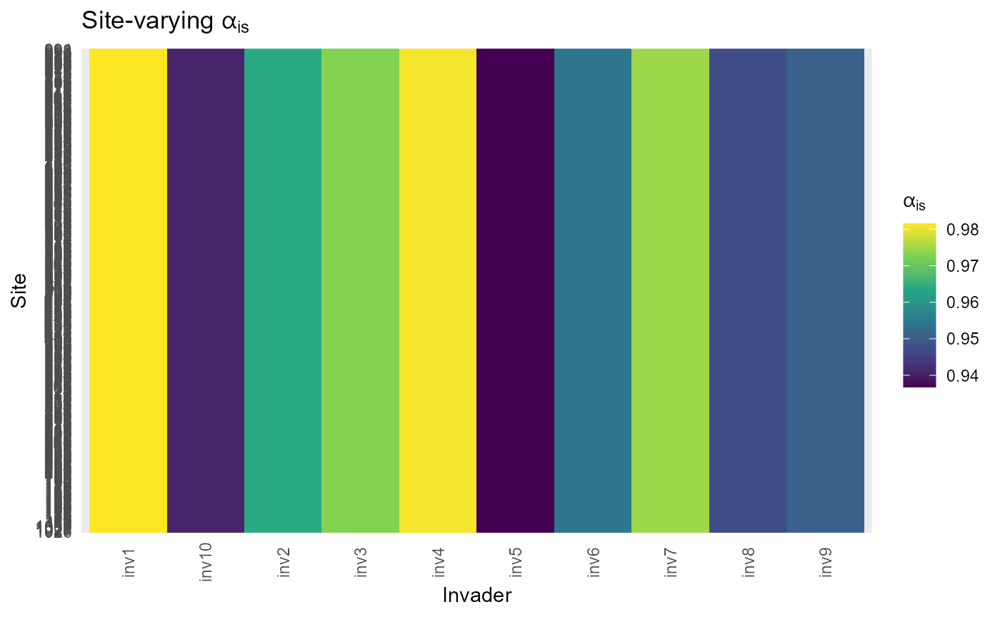

> :chart_with_upwards_trend: **Figure 11**: The heatmaps show how
> sensitivity to crowding (\\\alpha\_{is}\\) varies across sites and
> invaders. Each column corresponds to an invader, each row to a site,
> and the colour scale represents the parameter value. Here,
> \\\alpha\_{is}\\ values are consistently positive but display subtle
> gradients across sites, indicating that some environments impose
> stronger penalties from trait overlap than others. This heterogeneity
> reflects local differences in how resident communities constrain
> invaders: higher \\\alpha\_{is}\\ (yellow-green) means stronger
> crowding effects, while lower values (blue-purple) suggest weaker
> suppression.

``` r
ggplot2::ggplot(abg_df, ggplot2::aes(invader, site, fill = Gamma_is)) +
    ggplot2::geom_tile() + 
  ggplot2::scale_fill_viridis_c(name = expression(Gamma[is])) +
    ggplot2::labs(title = expression("Site-varying " * Gamma[is]),
         x = "Invader", y = "Site") + ggplot2::theme_minimal(base_size = 11) +
    ggplot2::theme(axis.text.x = ggplot2::element_text(angle = 90, vjust = 0.5))
```

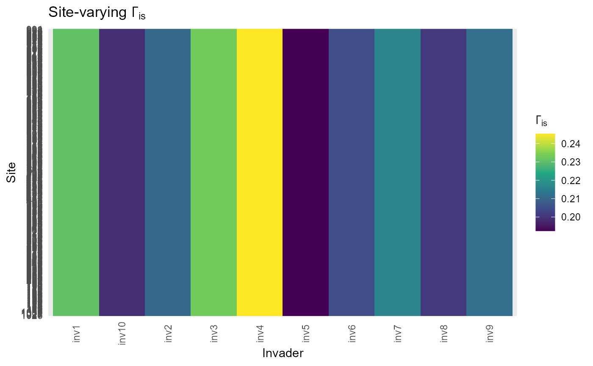

> :chart_with_upwards_trend: **Figure 12**: The heatmaps show how
> sensitivity to abiotic scaling (\\\Gamma\_{is}\\, second) varies
> across sites and invaders.Each column corresponds to an invader, each
> row to a site, and the colour scale represents the parameter value.
> Here, \\\Gamma\_{is}\\ values describe how abiotic suitability scales
> for each invader–site combination. Most values fall near zero to
> moderate positive ranges, but some sites show locally elevated
> \\\Gamma\_{is}\\, highlighting environments where abiotic alignment
> disproportionately boosts invasion fitness.

:bar_chart: Together, the plots above confirm that invasion fitness is
shaped by **site-specific interactions**: even with the same trait
predictors, the balance between abiotic suitability and crowding
penalties varies geographically. This heterogeneity is crucial for
interpreting invasion outcomes, since invaders may thrive in sites where
abiotic boosts outweigh crowding, while failing elsewhere despite
similar trait distances.

:sparkles: **Overall importance**: These sensitivities are the
coefficients that connect predictors to invasion fitness in flexible
ways (constant, trait-varying, site-varying).

:bulb: **Summary.** You now have \\\alpha_i\\, \\\beta_i\\ (and optional
signed), \\\theta_i\\ and \\\gamma_i\\, plus \\\alpha\_{is}\\,
\\\Gamma\_{is}\\ where random slopes support site variation.

------------------------------------------------------------------------

### Invader predictors \\r^{(z)}\_{is}, C^{(z)}\_{is}, S^{(z)}\_{is}\\

[`predict_invaders()`](https://b-cubed-eu.github.io/invasimapr/reference/predict_invaders.md)
builds invader-side pillars on the **resident scale** using the
residents GLMM, trait geometry, and resident moments.

:hourglass_flowing_sand: **Step-by-step**
[`predict_invaders()`](https://b-cubed-eu.github.io/invasimapr/reference/predict_invaders.md):

1.  **Predicts invader \\r\_{is}\\** from fixed effects;
2.  **Standardises by resident site** moments;
3.  **Computes** invader-resident distances and kernels to obtain
    **\\C\_{is}\\**;
4.  **Standardises by resident** moments;
5.  Broadcasts \\S^{(z)}\_s\\ to **\\S^{(z)}\_{is}\\**.

:zap: **Run
[`predict_invaders()`](https://b-cubed-eu.github.io/invasimapr/reference/predict_invaders.md)**
to produce invader predictor matrices and tidy frames, aligning invaders
directly to residents’ scales to avoid leakage.

``` r
# try(source("D:/Methods/R/myR_Packages/b-cubed-versions/invasimapr/R/predict_invaders.R"), silent = TRUE)
# if (!exists("predict_invaders")) stop("predict_invaders() not found.")

fit = predict_invaders(fit, traits_inv)

# str(fit$invaders, 1)

r_is   = fit$invaders$r_is
r_is_z = fit$invaders$r_is_z
C_is   = fit$invaders$C_is
C_is_z = fit$invaders$C_is_z
S_is_z = fit$invaders$S_is_z

inv_predict_df = fit$invaders$df
summary(inv_predict_df)
#>       site        invader              r_link             r_z           
#>  82     :  10   Length:4150        Min.   :-1.9422   Min.   :-8.447911  
#>  83     :  10   Class :character   1st Qu.: 0.6978   1st Qu.:-0.830539  
#>  84     :  10   Mode  :character   Median : 1.2211   Median : 0.136880  
#>  117    :  10                      Mean   : 1.1506   Mean   :-0.008854  
#>  118    :  10                      3rd Qu.: 1.6929   3rd Qu.: 0.993591  
#>  119    :  10                      Max.   : 3.6457   Max.   : 6.559607  
#>  (Other):4090                                                           
#>       C_z               S_z         
#>  Min.   :-1.0035   Min.   :-1.5449  
#>  1st Qu.: 0.5128   1st Qu.:-0.7173  
#>  Median : 0.9441   Median :-0.1541  
#>  Mean   : 0.9597   Mean   : 0.0000  
#>  3rd Qu.: 1.3796   3rd Qu.: 0.4529  
#>  Max.   : 3.3913   Max.   : 5.6963  
#> 
```

:bar_chart: **Site maps of mean** \\r^{(z)}\\ and mean \\C^{(z)}\\
across invaders that reveal abiotic opportunity versus biotic pressure
patterns.

``` r
stopifnot(exists("site_df"))

df_r_site = inv_predict_df |>
  dplyr::group_by(site) |>
  dplyr::mutate(mean_r_z = mean(r_z)) |>
  dplyr::left_join(site_df, by = "site")

ggplot2::ggplot(df_r_site, ggplot2::aes(x, y, fill = mean_r_z)) +
  ggplot2::geom_tile() +
  ggplot2::scale_fill_gradient2(name = expression(Mean~r^{(z)}), midpoint = 0) +
  ggplot2::labs(title = expression("Abiotic suitability " * r^{(z)} * " (site mean across invaders)"),
                x = "x", y = "y") +
  ggplot2::theme_minimal() + 
  ggplot2::geom_sf(data = rsa, inherit.aes = FALSE, fill = NA, color = "black", size = 0.3)
```

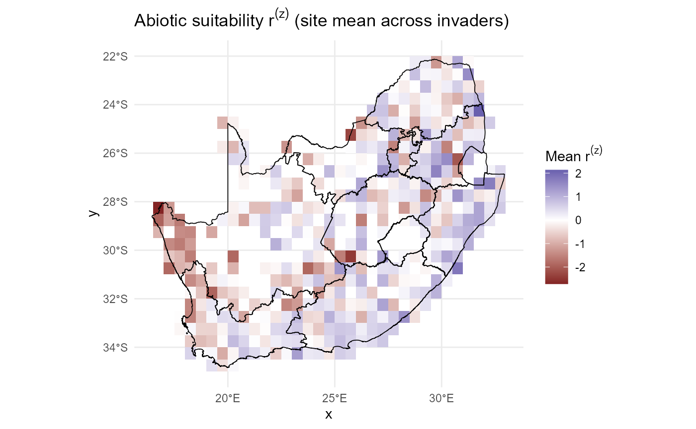

> :chart_with_upwards_trend: **Figure 13**: This map summarises how
> **Abiotic Suitability** (\\r^{(z)}\\) co-varies across space, averaged
> over all invaders. Here, the colours reflect the mean abiotic
> suitability that invaders experience per site. Warmer red tones
> indicate lower or even negative suitability, while cooler blue tones
> show higher suitability. The spatial gradients capture regions where
> abiotic conditions consistently favour or hinder invasion potential.

``` r
stopifnot(exists("site_df"))

df_C_site = inv_predict_df |>
  dplyr::group_by(site) |>
  dplyr::mutate(mean_C_z = mean(C_z)) |>
  dplyr::left_join(site_df, by = "site")

ggplot2::ggplot(df_C_site, ggplot2::aes(x, y, fill = mean_C_z)) +
  ggplot2::geom_tile() +
  ggplot2::scale_fill_viridis_c(name = expression(Mean~C^{(z)}), direction = 1) +
  ggplot2::labs(
    title = expression("Trait-similar crowding " * C^{(z)} * " (site mean across invaders)"),
    x = "x", y = "y"
  ) +
  ggplot2::theme_minimal() +
  ggplot2::geom_sf(data = rsa, inherit.aes = FALSE, fill = NA, color = "black", size = 0.3)
```

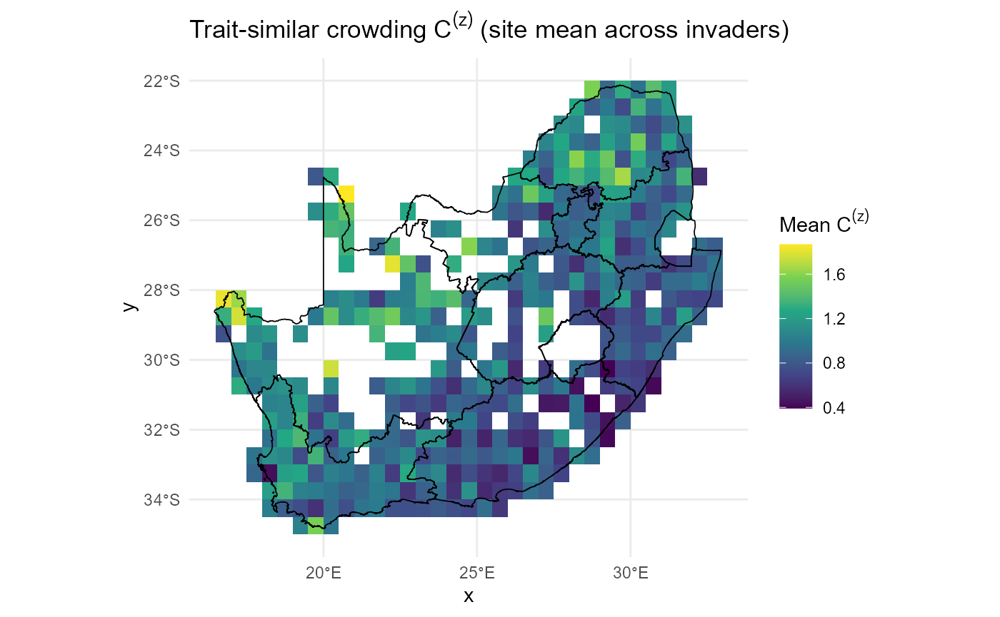

> :chart_with_upwards_trend: **Figure 14**: This map summarises how
> **Trait-similar Crowding** (\\C^{(z)}\\) or biotic pressure co-varies
> across space, averaged over all invaders. Here, the colours represent
> the average intensity of biotic pressure from resident communities,
> scaled by trait similarity. Higher values (yellow-green) highlight
> areas where residents are more functionally similar to potential
> invaders, thus exerting stronger competitive exclusion. Lower values
> (blue-purple) identify sites where invaders may face less
> trait-overlap pressure.

:bar_chart: Together, these maps provide a spatial lens on the
**trade-off between abiotic opportunity and biotic resistance**:
invasion is more likely where \\r^{(z)}\\ is high and \\C^{(z)}\\ is
low, and less likely where the opposite holds.

:sparkles: **Overall importance**: Invader predictors are now on the
same within-site scales as residents, enabling apples-to-apples fitness
calculations.

:bulb: **Summary.** You now have \\r^{(z)}\_{is}\\, \\C^{(z)}\_{is}\\,
\\S^{(z)}\_{is}\\ aligned to resident moments and ready for \\\lambda\\.

------------------------------------------------------------------------

### Invasion fitness (\\\lambda\\) and establishment probability (\\P\\)

[`predict_establishment()`](https://b-cubed-eu.github.io/invasimapr/reference/predict_establishment.md)
combines invader predictors with sensitivities under a set of options
(A-E) and maps \\\lambda\\ to probabilities with probit/logit/hard
rules.

:hourglass_flowing_sand: **Step-by-step**
[`predict_establishment()`](https://b-cubed-eu.github.io/invasimapr/reference/predict_establishment.md):

1.  Selects coefficients (constant, trait-varying, site-varying),
2.  optionally calibrates a resident baseline,
3.  computes \\\lambda\_{is}\\, and transforms to \\P\_{is}\\.
4.  Finally, it returns matrices plus tidy long frames and optional
    plots.

:zap: **Run
[`predict_establishment()`](https://b-cubed-eu.github.io/invasimapr/reference/predict_establishment.md)**
to produce \\\lambda\\ and \\P\\ surfaces for chosen options, with maps
and ranks for rapid review.

``` r
library(ggplot2)  # ensures waiver() exists
# try(source("D:/Methods/R/myR_Packages/b-cubed-versions/invasimapr/R/predict_establishment.R"), silent = TRUE)
# if (!exists("predict_establishment")) stop("predict_establishment() not found.")

fit = predict_establishment(
  fit,
  option         = "A",          # try "A"..."E"
  prob_method    = "hard",       # "probit", "logit", or "hard"
  prob_scale     = list(sigma = 1),
  calibrate_kappa = TRUE,
  boundary_sf    = rsa
)

str(fit,1)
#> List of 11
#>  $ inputs       :List of 13
#>  $ meta         :List of 7
#>  $ inputs_std   :List of 2
#>  $ traits       :List of 10
#>  $ crowding     :List of 5
#>  $ model        :List of 7
#>  $ residents    :List of 16
#>  $ sensitivities:List of 26
#>  $ invaders     :List of 6
#>  $ fitness      :List of 7
#>  $ prob         :List of 7
#>  - attr(*, "class")= chr [1:2] "invasimapr_fit" "list"
# str(fit$fitness, 1)
# str(fit$prob, 1)

lambda_is = fit$fitness$lambda_is
p_is      = fit$prob$p_is
# fit_lambda = fit$fitness$lambda_long
```

:bar_chart: **Overall mean** \\\lambda\\ maps that summarise openness,
**probability heatmaps** and **per-invader faceted maps** reveal where
and for whom establishment is likely.

``` r
if (!is.null(fit$prob$plots$heatmap))     fit$prob$plots$heatmap
```

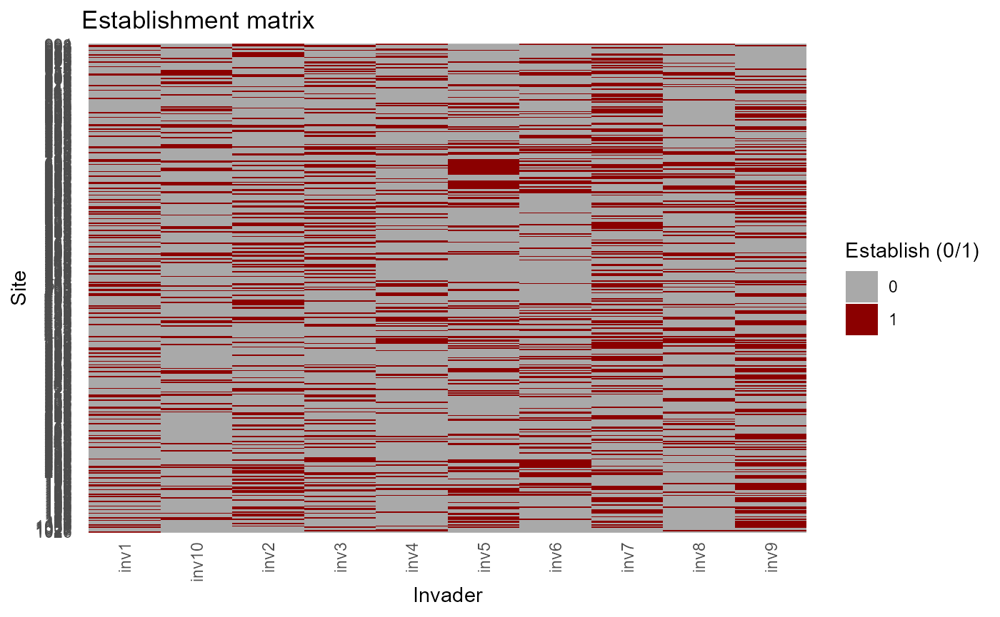

> :chart_with_upwards_trend: **Figure 15**: This figure illustrates the
> spatial and invader-specific structure of establishment likelihood.
> Rows correspond to sites and columns to invaders, with cells showing
> binary establishment outcomes. The sparse but structured pattern of
> yellow cells (successful establishment) indicates that invasion is not
> uniform but instead constrained by both species identity and site
> context.

``` r
# str(fit$prob$plots, 1)
if (!is.null(fit$prob$plots$site_mean))     fit$prob$plots$site_mean
```


> :chart_with_upwards_trend: **Figure 16**: Spatial pattern of
> establishment under Option A (\\\gamma\\ = 1). Tiles show the
> number/proportion of species establishing per grid cell (“#
> establishing”), from low (brown) to high (blue), over South Africa’s
> boundaries.

``` r
# str(fit$prob$plots, 1)
if (!is.null(fit$prob$plots$invader_mean))     fit$prob$plots$invader_mean
```

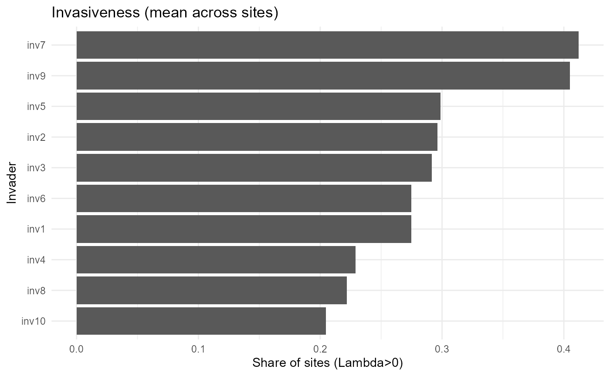

> :chart_with_upwards_trend: **Figure 17**: Invasiveness ranking by
> invader. Bars show the mean fraction of sites where intrinsic growth
> is positive (\\\lambda\\ \> 0) for each invader, averaged across all
> sites and ordered from highest (more invasive; e.g., inv7, inv9) to
> lowest (e.g., inv10).

``` r
fitness_df = fit$fitness$lambda_long |>
  dplyr::group_by(site, x, y, option) |>
  dplyr::summarise(lambda_mean = mean(lambda, na.rm = TRUE), .groups = "drop")
```

``` r
ggplot2::ggplot(fitness_df, ggplot2::aes(x, y, fill = lambda_mean)) +
  ggplot2::geom_tile() +
  ggplot2::scale_fill_gradient2(name = "Mean lambda", midpoint = -1.707) +
  ggplot2::geom_sf(data = rsa, inherit.aes = FALSE, fill = NA, color = "black", size = 0.3) +
  ggplot2::labs(title = fitness_df$option, x = "x", y = "y") +
  ggplot2::theme_minimal()
```


> :chart_with_upwards_trend: **Figure 18**: This figures illustrates the
> spatial and invader-specific structure of establishment likelihood.
> **Mean \\\lambda\\** is mapped with colours reflecting the site-level
> mean fitness (\\\lambda\\) of invaders under option A (\\\gamma=1\\),
> summarising overall openness to establishment. Negative values (brown)
> dominate, showing that most sites are generally resistant, while
> scattered blue patches identify hotspots where conditions are
> sufficiently favourable for invader persistence.

:bar_chart: Together, the heatmap and map highlight the **joint
filtering effects** of species identity and geography: while few
invaders succeed broadly, specific site–species combinations align to
permit establishment, with spatial clustering of higher openness
revealing invasion-prone regions.

:sparkles: **Overall importance**: These outputs translate biotic and
abiotic structure into explicit establishment surfaces, ready for
summary and decision-support.

:bulb: **Summary.** You now have \\\lambda\_{is}\\ and \\P\_{is}\\ under
clear assumptions (A-E), with diagnostics to choose a working
specification.

------------------------------------------------------------------------

### Summaries: species, traits, and sites

[`summarise_results()`](https://b-cubed-eu.github.io/invasimapr/reference/summarise_results.md)
distils the full \\\lambda\\ or \\P\\ surfaces into indicators of
species invasiveness \\V_i\\, site invasibility \\V_s\\, and trait
correlates, with tidy tables and plots.

:hourglass_flowing_sand: **Step-by-step**
[`summarise_results()`](https://b-cubed-eu.github.io/invasimapr/reference/summarise_results.md):

1.  **Computes \\V_i\\** and **\\V_s\\** (hard or probabilistic),
2.  **Ranks** invaders and sites,
3.  Quantifies **trait-fitness relationships**, and
4.  Returns **plots** (e.g. maps, heatmaps, lollipop plots) and
    **summary tables**.

:zap: **Run
[`summarise_results()`](https://b-cubed-eu.github.io/invasimapr/reference/summarise_results.md)**
to produce decision-ready summaries and figures linked back to the same
predictors and trait geometry.

``` r
# try(source("D:/Methods/R/myR_Packages/b-cubed-versions/invasimapr/R/summarise_results.R"), silent = TRUE)
# if (!exists("summarise_results")) stop("summarise_results() not found.")

fit = summarise_results(
  fit,
  use_probabilistic = TRUE,
  make_plots        = TRUE,
  boundary_sf       = rsa
)

str(fit, 1)
#> List of 12
#>  $ inputs       :List of 13
#>  $ meta         :List of 7
#>  $ inputs_std   :List of 2
#>  $ traits       :List of 10
#>  $ crowding     :List of 5
#>  $ model        :List of 7
#>  $ residents    :List of 16
#>  $ sensitivities:List of 26
#>  $ invaders     :List of 6
#>  $ fitness      :List of 7
#>  $ prob         :List of 7
#>  $ summary      :List of 6
#>  - attr(*, "class")= chr [1:2] "invasimapr_fit" "list"
str(fit$summary, 1)
#> List of 6
#>  $ species       : tibble [10 × 5] (S3: tbl_df/tbl/data.frame)
#>  $ site          : tibble [415 × 9] (S3: tbl_df/tbl/data.frame)
#>  $ trait_effects : tibble [20 × 7] (S3: tbl_df/tbl/data.frame)
#>  $ establish_long: tibble [4,150 × 8] (S3: tbl_df/tbl/data.frame)
#>  $ plots         :List of 4
#>  $ meta          :List of 3
# head(dplyr::arrange(fit$summary$species, dplyr::desc(V_i)), 10)
# head(dplyr::arrange(fit$summary$site,    dplyr::desc(total_expected %||% n_est)), 10)
# fit$summary$trait_effects
```

:bar_chart: **Species & trait invasiveness and site invasibility maps**

``` r
if (!is.null(fit$summary$plots$invader_rank))  fit$summary$plots$invader_rank
```

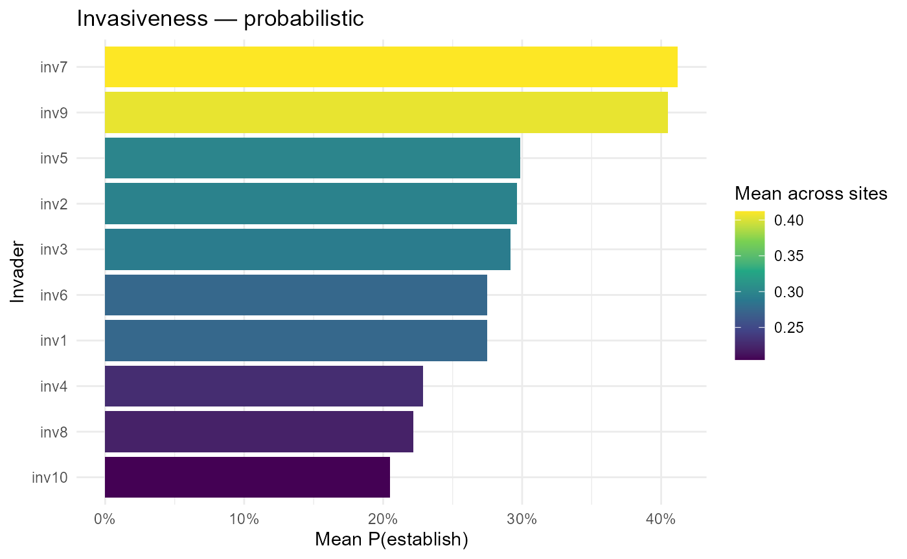

> :chart_with_upwards_trend: **Figure 19**: **Invasiveness -
> probabilistic** view where bars show the mean probability of
> establishment across sites for each invader. A steep drop from the top
> few taxa to the remainder indicates a short “high-risk list”: a small
> subset of invaders (e.g., inv6–inv7) are consistently more likely to
> establish, while others rarely exceed low single-digit probabilities.
> This ranking is useful for triage and horizon scanning.

``` r
if (!is.null(fit$summary$plots$site_map))      fit$summary$plots$site_map
```

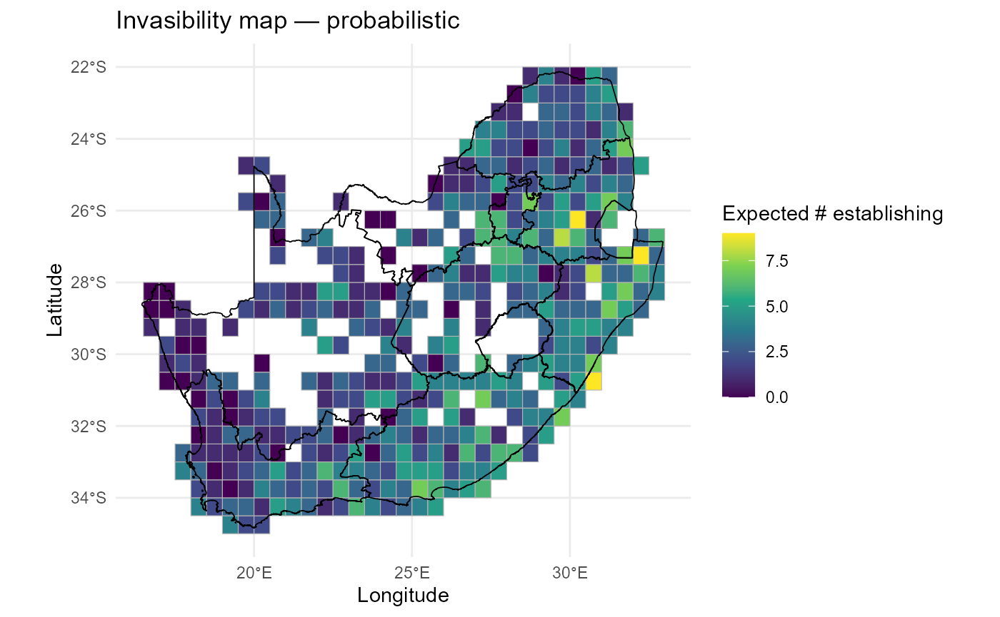

> :chart_with_upwards_trend: **Figure 20**: **Invasibility map -
> probabilistic** view where colours map the **expected number of
> establishing invaders** per site (sum of probabilities), highlighting
> geographic hotspots of openness. Most of the country remains resistant
> (dark tones), but clusters of higher expected establishment emerge
> along specific regions and borders, suggesting where surveillance or
> rapid response capacity would yield the greatest return.

``` r
if (!is.null(fit$summary$plots$heatmap))       fit$summary$plots$heatmap
```

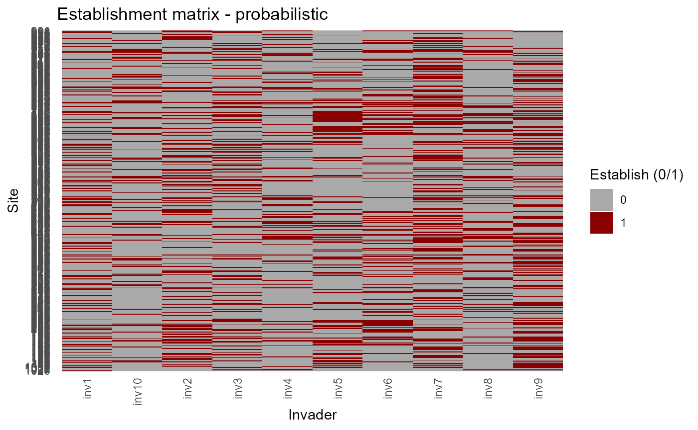

> :chart_with_upwards_trend: **Figure 21**: **Establishment matrix**
> with binary establishment outcomes from the probabilistic model shown
> across sites and invaders. Rows are sites, columns are invaders; tiles
> show establishment (1, red) vs non-establishment (0, grey),
> illustrating heterogeneity among invaders and among sites.

``` r
if (!is.null(fit$summary$plots$trait_effects)) fit$summary$plots$trait_effects
```

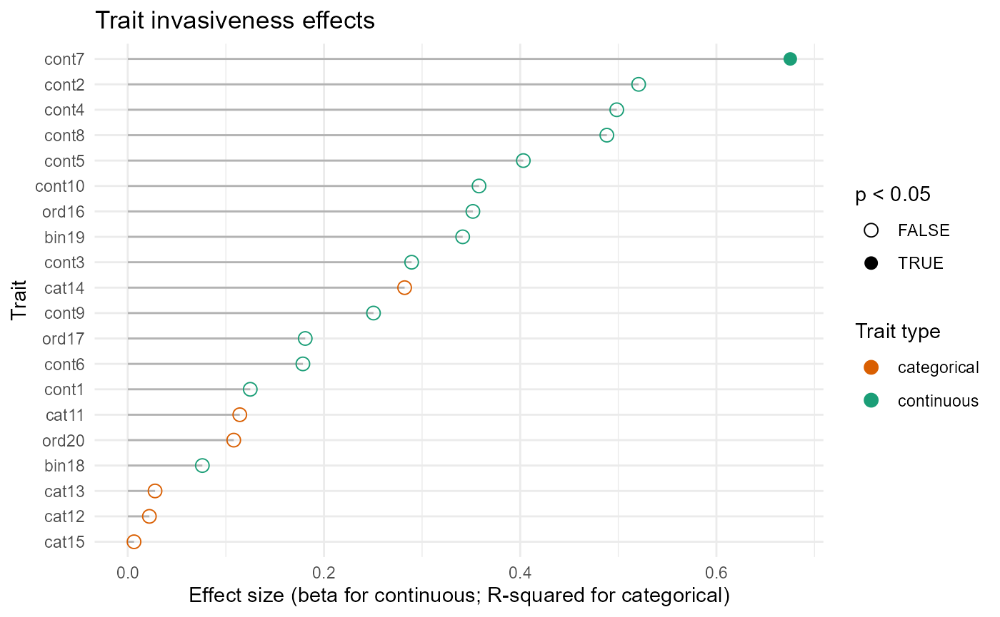

> :chart_with_upwards_trend: **Figure 22**: **Trait invasiveness
> effects** view with a lollipop plot ranks traits by their association
> with mean establishment probability (\|β\| for continuous traits;
> ANOVA \\R^2\\ for categorical/ordinal). A small set of continuous
> traits dominate the signal (right side, several with \\p\<0.05\\),
> implying that functional axes captured by those traits systematically
> raise or lower invasion success. Categorical/ordinal traits contribute
> more modestly, pointing to ecologically relevant but weaker thresholds
> or syndromes.

:bar_chart: A few invaders and a few trait axes drive most risk, and
their success concentrates in identifiable regions. This combination,
**who**, **why**, and **where**, provides a clear basis for prioritising
monitoring, pathway management, and site-level mitigation. Ranked bars
highlight consistently risky invaders; site maps show hotspots of
openness; heatmaps reveal joint structure; trait lollipops identify
functional correlates.

:sparkles: **Overall importance**: These summaries compress
high-dimensional predictions into interpretable priorities for
surveillance and management.

:bulb: **Summary.** You now have species ranks \\V_i\\, site maps
\\V_s\\, and trait effect sizes - linked transparently to the earlier
geometry, predictors, and sensitivities.

------------------------------------------------------------------------

``` r
# # 1) Count of all val==1 by site (heatmap)
# site_counts = fit$summary$establish_long |>
#   group_by(site, x, y) |>
#   summarise(n_val1 = sum(val == 1L, na.rm = TRUE),
#             p_val1 = (sum(val == 1L, na.rm = TRUE)/length(unique(fit$summary$establish_long$invader)))*100, .groups = "drop")
# head(site_counts)
# 
# p_count = ggplot2::ggplot(site_counts, ggplot2::aes(x, y, fill = n_val1)) +
#   ggplot2::geom_tile() +
#   ggplot2::coord_equal() +
#   ggplot2::scale_fill_viridis_c(name = "# invaders with val = 1", option = "C") +
#   ggplot2::geom_sf(data = rsa, inherit.aes = FALSE, fill = NA, color = "black", size = 0.35) +
#   ggplot2::labs(title = "Count of val = 1 by site", x = "Longitude", y = "Latitude") +
#   ggplot2::theme_minimal(base_size = 12)
# print(p_count)

# p_prop = ggplot2::ggplot(site_counts, ggplot2::aes(x, y, fill = p_val1)) +
#   ggplot2::geom_tile() +
#   ggplot2::coord_equal() +
#   ggplot2::scale_fill_viridis_c(name = "% invaders with val = 1", option = "C") +
#   ggplot2::geom_sf(data = rsa, inherit.aes = FALSE, fill = NA, color = "black", size = 0.35) +
#   ggplot2::labs(title = "% of val = 1 by site", x = "Longitude", y = "Latitude") +
#   ggplot2::theme_minimal(base_size = 12)
# print(p_prop)

# 2) Separate maps per invader: val=1 red, val=0 dark grey
df_inv = fit$summary$establish_long |>
  dplyr::mutate(val_f = factor(val, levels = c(0, 1)))

p_facets = ggplot2::ggplot(df_inv, ggplot2::aes(x, y, fill = val_f)) +
  ggplot2::geom_tile() +
  ggplot2::coord_equal() +
  ggplot2::scale_fill_manual(
    values = c(`0` = "grey20", `1` = "#d7301f"),
    labels = c(`0` = "0", `1` = "1"),
    name   = "val"
  ) +
  ggplot2::facet_wrap(~ invader, ncol = 5) +
  ggplot2::geom_sf(data = rsa, inherit.aes = FALSE, fill = NA, color = "black", size = 0.35) +
  labs(title = "Per-invader maps (val = 1 in red, val = 0 in dark grey)",
       x = "Longitude", y = "Latitude") +
  ggplot2::theme_minimal(base_size = 12) +
  ggplot2::theme(axis.text.x = ggplot2::element_blank(),
        axis.text.y = ggplot2::element_blank())
print(p_facets)
```

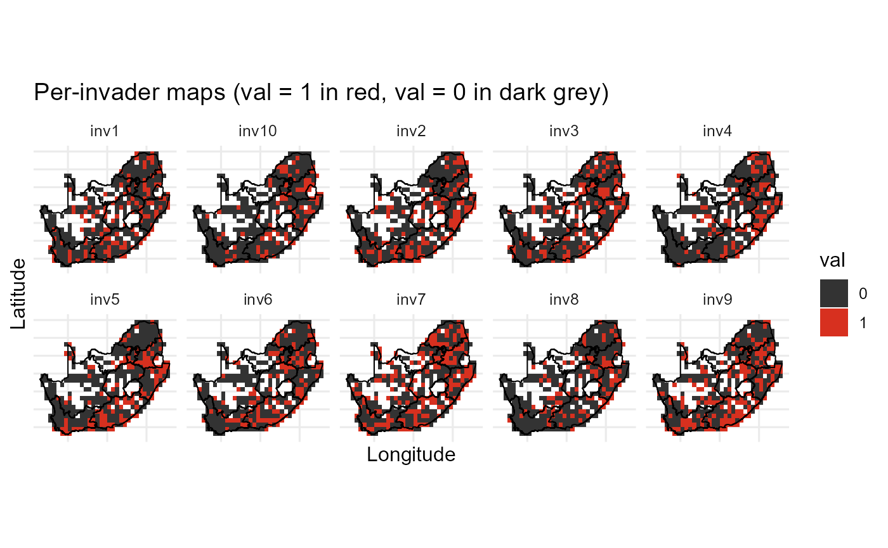

> :chart_with_upwards_trend: **Figure 23**: Per-invader maps of binary
> establishment across South Africa. Each panel is one invader; red
> cells indicate establishment (1) and dark grey non-establishment (0).
> Common grid and coastline enable direct comparison of spatial patterns
> among invaders.

------------------------------------------------------------------------

### Common pitfalls & quick fixes

Final guardrails for robust runs and reproducibility.

- **Name alignment.** All site-indexed matrices use identical rownames;
  community columns match trait rownames.
- **Hull stability.** Use ≥3 residents; otherwise centrality/hull
  diagnostics may be skipped.
- **Standardisation leakage.** Scale invaders using **resident** moments
  only.
- **Prediction scale.** Use fixed-effects predictions (`re.form = NA`)
  for both residents and invaders.
- **Saturation slopes.** Do **not** add `(0 + S_z || site)`; `S_z` has
  no within-site variation.

------------------------------------------------------------------------

### Session information

``` r
sessionInfo()
#> R version 4.5.2 (2025-10-31 ucrt)
#> Platform: x86_64-w64-mingw32/x64
#> Running under: Windows 11 x64 (build 26200)
#> 
#> Matrix products: default
#>   LAPACK version 3.12.1
#> 
#> locale:
#> [1] LC_COLLATE=English_South Africa.utf8  LC_CTYPE=English_South Africa.utf8   
#> [3] LC_MONETARY=English_South Africa.utf8 LC_NUMERIC=C                         
#> [5] LC_TIME=English_South Africa.utf8    
#> 
#> time zone: Africa/Johannesburg
#> tzcode source: internal
#> 
#> attached base packages:
#> [1] stats     graphics  grDevices utils     datasets  methods   base     
#> 
#> other attached packages:
#> [1] ggplot2_4.0.3    invasimapr_0.2.0
#> 
#> loaded via a namespace (and not attached):
#>   [1] splines_4.5.2        later_1.4.8          fields_17.3         
#>   [4] tibble_3.3.1         hardhat_1.4.3        pROC_1.19.0.1       
#>   [7] rpart_4.1.27         factoextra_2.0.0     lifecycle_1.0.5     
#>  [10] Rdpack_2.6.6         sf_1.1-1             rstatix_0.7.3       
#>  [13] globals_0.19.1       processx_3.9.0       lattice_0.22-9      
#>  [16] MASS_7.3-65          backports_1.5.1      NbClust_3.0.1       
#>  [19] dendextend_1.19.1    magrittr_2.0.5       sass_0.4.10         
#>  [22] rmarkdown_2.31       jquerylib_0.1.4      yaml_2.3.12         
#>  [25] otel_0.2.0           spam_2.11-4          sp_2.2-1            
#>  [28] pbapply_1.7-4        chromote_0.5.1       DBI_1.3.0           
#>  [31] minqa_1.2.8          RColorBrewer_1.1-3   lubridate_1.9.5     
#>  [34] abind_1.4-8          multcomp_1.4-28      maps_3.4.3          
#>  [37] rvest_1.0.5          glmmTMB_1.1.14       purrr_1.2.2         
#>  [40] nnet_7.3-20          TH.data_1.1-4        rappdirs_0.3.4      
#>  [43] sandwich_3.1-1       ipred_0.9-15         lava_1.9.1          
#>  [46] ggrepel_0.9.8        listenv_1.0.0        terra_1.9-34        
#>  [49] pheatmap_1.0.13      vegan_2.7-5          units_1.0-1         
#>  [52] parallelly_1.47.0    pkgdown_2.2.0        permute_0.9-10      
#>  [55] codetools_0.2-20     xml2_1.6.0           tidyselect_1.2.1    
#>  [58] dissmapr_0.1.0       clValid_0.7          farver_2.1.2        
#>  [61] lme4_2.0-1           viridis_0.6.5        matrixStats_1.5.0   
#>  [64] stats4_4.5.2         jsonlite_2.0.0       caret_7.0-1         
#>  [67] e1071_1.7-17         Formula_1.2-5        survival_3.8-6      
#>  [70] iterators_1.0.14     emmeans_2.0.3        systemfonts_1.3.2   
#>  [73] foreach_1.5.2        geodata_0.6-9        tools_4.5.2         
#>  [76] ragg_1.5.2           stringdist_0.9.17    Rcpp_1.1.1-1.1      
#>  [79] glue_1.8.1           prodlim_2026.03.11   gridExtra_2.3.1     
#>  [82] xfun_0.59            mgcv_1.9-4           websocket_1.4.4     
#>  [85] dplyr_1.2.1          scam_1.2-22          withr_3.0.3         
#>  [88] numDeriv_2016.8-1.1  fastmap_1.2.0        boot_1.3-32         
#>  [91] entropy_1.3.2        digest_0.6.39        timechange_0.4.0    
#>  [94] R6_2.6.1             estimability_2.0.0   textshaping_1.0.5   
#>  [97] wk_0.9.5             fuzzyjoin_0.1.8      utf8_1.2.6          
#> [100] tidyr_1.3.2          generics_0.1.4       data.table_1.18.4   
#> [103] recipes_1.3.3        class_7.3-23         httr_1.4.8          
#> [106] htmlwidgets_1.6.4    ModelMetrics_1.2.2.2 pkgconfig_2.0.3     
#> [109] gtable_0.3.6         timeDate_4052.112    S7_0.2.2            
#> [112] selectr_0.6-0        htmltools_0.5.9      carData_3.0-6       
#> [115] dotCall64_1.2        TMB_1.9.21           scales_1.4.0        
#> [118] gower_1.0.2          reformulas_0.4.4     corrplot_0.95       
#> [121] knitr_1.51           rstudioapi_0.19.0    geosphere_1.6-8     
#> [124] reshape2_1.4.5       coda_0.19-4.1        nlme_3.1-169        
#> [127] curl_7.1.0           nloptr_2.2.1         zetadiv_1.3.0       
#> [130] proxy_0.4-29         cachem_1.1.0         zoo_1.8-15          
#> [133] stringr_1.6.0        KernSmooth_2.23-26   parallel_4.5.2      
#> [136] desc_1.4.3           s2_1.1.11            pillar_1.11.1       
#> [139] grid_4.5.2           vctrs_0.7.3          promises_1.5.0      
#> [142] ggpubr_0.6.3         car_3.1-5            xtable_1.8-8        
#> [145] cluster_2.1.8.2      evaluate_1.0.5       magick_2.9.1        
#> [148] mvtnorm_1.4-1        cli_3.6.6            compiler_4.5.2      
#> [151] rlang_1.2.0          future.apply_1.20.2  ggsignif_0.6.4      
#> [154] labeling_0.4.3       mclust_6.1.2         classInt_0.4-11     
#> [157] forcats_1.0.1        plyr_1.8.9           fs_2.1.0            
#> [160] stringi_1.8.7        viridisLite_0.4.3    Matrix_1.7-5        
#> [163] patchwork_1.3.2      future_1.70.0        rbibutils_2.4.1     
#> [166] broom_1.0.13         bslib_0.11.0
```
